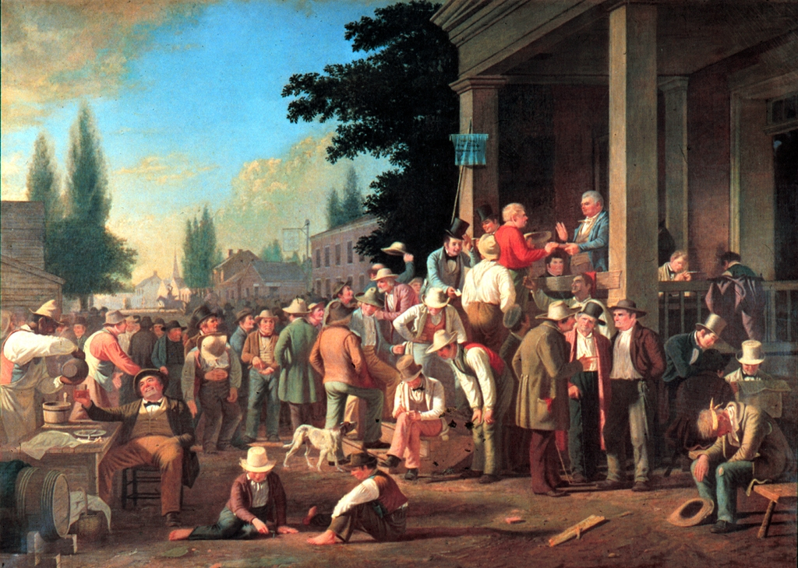
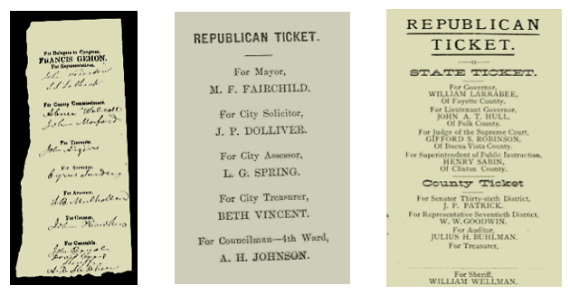
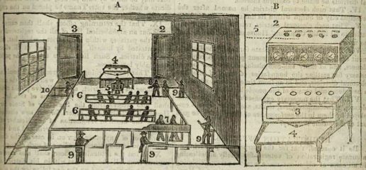
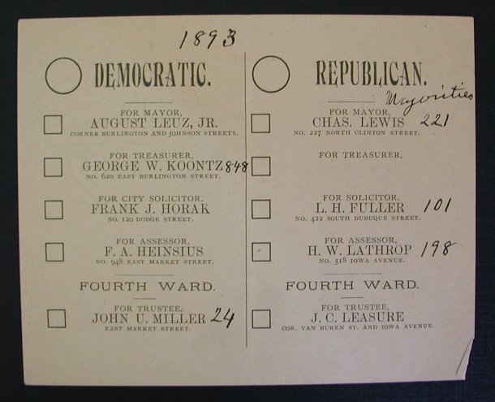
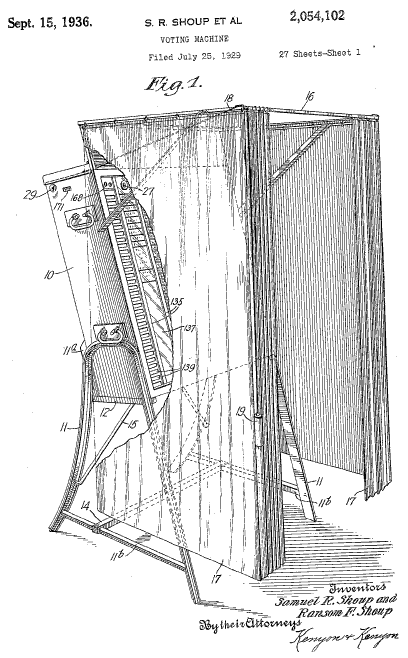
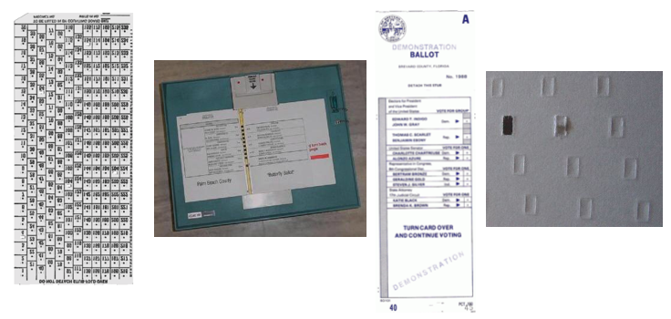
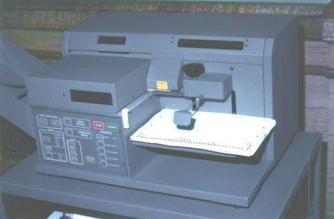
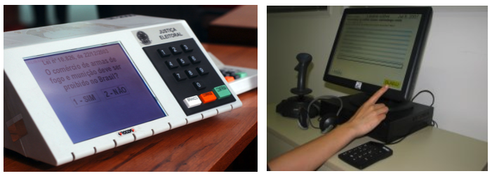
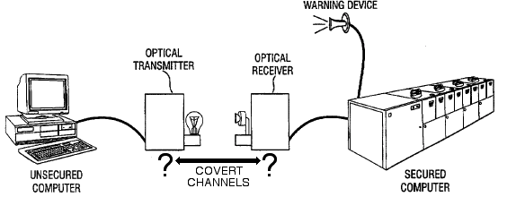

## 투표 이전

* 투표관리자 있어 성경을 들고, "투표를 하지 않았다는" 서약을 받고 투표소로 입장하게 된다.
"**선거인 명부(voting registration)**"라는 개념이 없다. 
* **비밀투표(secret vote)**라는 개념도 없어 누구에게 투표할지를 큰 소리로 외친다.
    * 투표소 직원이 이름을 적고, 투표하는 후보자 이름도 함께 적는다.
* **종이 투표(paper ballot)**는 그 당시 존재하지 않았다.
* 투표소 주변에서 **선거유세**는 적법하고 일반적인 관행이었다.

County Election by George Caleb Bingham, Saline County, Missouri, in 1846

## 첫 투표

> ### 일인일표제도 {.callout}
> One man shall have one vote.   
> - John Cartwright, 1780

투표(ballot)이라는 용어는 공(ball)에서 기원했다고 하지만, 고대 그리스에서 던진다는 단어에 뿌리를 두고 있다고 한다.
고대 그리스 아테나에서 진흙 혹은 금속 상징물을 투표함(진흙 항아리)에 넣어 투표를 했다.

르네상스 시대에 검은공(blackball)이라는 용어가 등장했는데, 누군가를 비밀조직에 가입시키는데, 흰공과 검은공을 사용해서
각 조직원은 흰공과 검은공이 주어지고, 새로운 조직원의 가입을 찬성하는 경우 흰공을 투표함에 넣고,
반대하는 경우 검은공을 투표함에 넣는다. 이런 유래로 조직에서 추출할 때, 선거에서 제외시킨때 검은공을 던진다(blackball someone)는 표현이 생겨났다.

이런 전통으로 19세기 초기 투표기계 개발자들은 작은 공을 사용해서 투표기를 만들어야 된다는 생각을 가지게 되었다.
그리고, 한명이 투표를 한개만 해야 되기 때문에 적절히 구분하는 메커니즘을 함께 고안했다.

## 종이 투표(paper ballot)

종이 투표는 로마에서 139 BC 사용되었다는 기록이 있고, 미국에서는 1629년 교회 목사를 선출하는데 처음 사용되었다는 기록이 있다.

## 비밀투표에 대한 차티스트 운동 [^chartist]

1938년 영국에서 노동자 단체가 만들어져서 보통 선거권을 비롯한 오늘날 민주주의 근본이 되는 다양한 참정권 운동을 펼쳤다. 

특히, Benjamin Jolly가 고안한 투표소 그림에 따르면, `A`에 사람들이 줄을 서서 투표를 하고, `B`에 투표를 계수하는 투표기가 잘 그려져있다. 기본적으로 구리구슬을 후보자 이름이 새겨진 투표기 상단에 넣어 투표를 하는 방식이다.

[^chartist]: 차티즘(Chartism), 차티스트 운동(Chartist Movement)은 19세기 중엽(1838~1848) 영국에서 있었던 사회 운동으로, 특히 보통 선거권의 획득을 목표로 싸운 참정권 운동이다.

## 오스트리아 종이 투표

> ### 계수의 중요성 {.callout}
>
> It's not the voting that's democracy, it's the counting.  
> - Tom Stoppard, British playwright, 1972   
> You won the election, but I won the count.  
> - Anastasio Somoza, Dictator, 1977

투표 부정과 비밀투표는 영국과 미국에만 국한된 것이 아니라서 오스트리아에서 투표기술에 있어
가장 중요한 혁신 중 하나를 제시했다. 오늘날 **오스트리아 비밀투표제**로 알려진 것이다.

정부가 비용을 대고 투표용지를 출력해서, 투표소 및 투표자에게 1인 1표 배부했다. 

상당히 혁신적인 투표시스템이지만, 정부비용으로 투표지를 출력하고, 투표용지 저장 및 운반을 보증해야하는 추가 비용이 소요되는 것도 사실이다. 그리고 가장 취약한 약점은 **개표**에 있다.

 
## 레버 투표기계(lever voting machine)

> ### 투표가 빠징코인가? {.callout}
>
> the right to vote today is far more than the right to pull that lever on election day. 
> It is the right to an equal and meaningful vote, which includes the right to equal and 
> meaningful participation.   
> - John C. Bonifaz to the House Judiciary Committee, May 5, 1999

마이어 자동 레버 투표기계가 1892년 뉴욕에 소개되었고, 그 우수성으로 자연히 퍼져나갔다.
1944년 12백만 유권자가 Automatic Voting Machine Corporation 기계를 사용한다는 광고도 나갔다.

1890년 레버를 사용한 수동식 투표기계가 최신 기술이었지만, 컴퓨터 펀치카드가 1960년대 도입되고, 1990년에는 바로 투표지를 판독할 수 있는 기술이 도입되었다. [Shoup](http://shoupvote.com/), AVM (Automatic Voting Machines) 회사가 두 유명한 제조사다.

## 펀치카드와 광학 표시 판독 투표기계

[Herman Hollerith](http://www-03.ibm.com/ibm/history/history/year_1886.html)가 1889년 표준 펀치카드를 발명해서 1890년 인구총조사에서 처음으로 사용되었다. IBM이 펀치카드 기술을 정치에 사용되는 것을 관심깊게 지켜보고 있다가 1965년 지금의 개념으로 보면 펀치카드 투표기계를 개발한 정치스트타업을 인수하여 본격적으로 뛰어들었다.

IBM은 1937년 학력고사 같은 표준시험지에 뿌리를 두고 있는 Type 805 Test Scoring Machine을 소개했다. 전도성을 이용해서 흑연필 표식을 감지하여 판독하는 체계를 갖고 있다.

## 직접 기록 전자 투표컴퓨터

개인용 컴퓨터가 내장되어 있는 직접기록 전자 투표컴퓨터(Direct Recording Electronic Voting Machines)는 그 자체로 화면이 있고, 프로그래밍 된 컴퓨터에 직접 유권자가 투표를 하면 (정확히는 마우스 커서를 옮겨 후보자를 클릭) 결과자 하드디스크나 내장 메모리에 저장되고 이것이 네트워크를 타고 혹은 탈부착이 가능한 이동식 저장장소를 통해 투표정보를 복사나 이동을 할 수 있다.

## 전자투표 컴퓨터 이슈

각 투표기마다 장착된 컴퓨터에서 안전하고 보안이 철저한 상태 정보를 옮길 수 있는 방법은 무엇인가?

