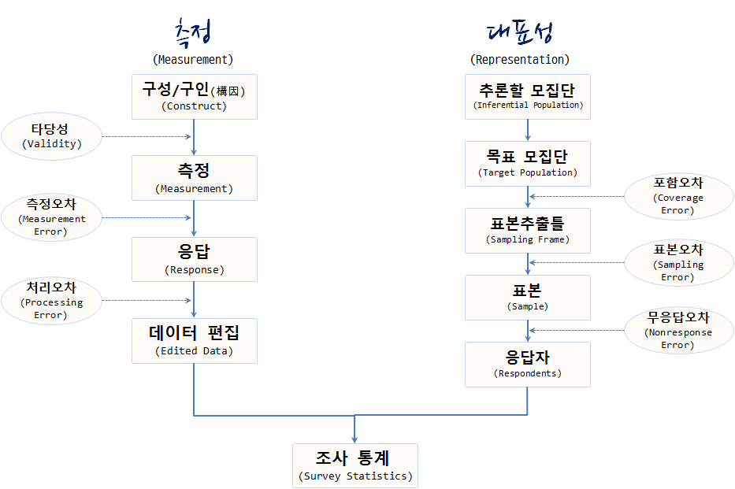

## 1. 제20대 국회의원 선거가 남긴 숙제 [^survey-fail01] [^survey-fail02]

갤럽 및 이와 유사한 여론조사 방법론을 동원한 여론조사 전문기관들이 대통령 선거를 비롯한
다양한 선거에서 점쟁이(?), 쪽집게(?) 노릇을 톡톡히 했다. 하지만, 이번 제20대 총선에서 
새누리 압승으로 예상한 것이 틀렸고, 제1당의 위치도 내려놓게 되었다.

[^survey-fail01]: [실제보다 여당이 높게 보이는 여론조사의 비밀](http://www.mediatoday.co.kr/?mod=news&act=articleView&idxno=129177)
[^survey-fail02]: [4‧13 총선, 여론조사가 빗나간 세 가지 이유](http://www.mediatoday.co.kr/?mod=news&act=articleView&idxno=129414)

## 2. 여론조사

여론조사(輿論調査)는 특정 사회집단의 구성원에 대해 여론동향을 파악하려는 목적으로 실시하는 통계적 사회조사로, 무작위로 추출된 일정수 사람들(표본)에게 설문하여, 응답을 수집하는 통계조사로, 통계이론에 근거한 표본 조사이며, 표본 오차가 뒤따른다.[^survey]

19세기 미국에서 대통령 선거 결과를 사전에 예상하는 목적으로 발달했으며, 20세기 초에는 언론기관들이 여론조사를 실시하면서 보편화되었다.

> ### 여론조사 공표 및 인용보도 금지 (공직선거법,108조1항) {.callout}
>
> 누구든지 **선거일전 6일**부터 선거일의 투표마감시각까지 선거에 관하여 정당에 대한 지지도나 당선인을 예상하게 하는 여론조사(모의투표나 인기투표에 의한 경우를 포함)의 경위와 그 결과를 공표하거나 인용하여 보도할 수 없습니다. [^release-period]
> 단, 다만 공표만 하지않고, 내부 자료로 활용하기 위한 여론조사는 수행할 수 있다.

[^survey]: [여론 조사](https://ko.wikipedia.org/wiki/여론_조사)
[^release-period]: [선거에 관한 여론조사](http://m.1390.go.kr/lawmobile/laws.letter.do?cont_id=201202150190&cont_sid=0001)

### 2.1. 여론조사 개요

여론조사결과는 [중앙선거관리위원회 - 중앙선거 여론조사 공정심의위원회](https://www.nesdc.go.kr/) 웹사이트에서 확인할 수 있다.
`여론조사결과 등록` > `여론조사결과 등록현황` 메뉴에서 여론조사 기관에서 조하한 여론조사 결과를 확인할 수 있다.

여론조사는 표본 및 설문문항을 설계한 후에 설정한 모집단에서 표본을 임의로 추출하여 추출된 유권자에게 준비된 설문문항을 조사하는 방식으로 진행된다. 
특히, 표본을 뽑을 표본추출틀(Sampling Frame)을 잘 설계해야하고, 설문 문항도 잘 설계하여야 하며, 표본도 잘 추출해야만 
조사하고자하는 모집단의 대표성과 함께 적절한 설문문항을 통해 여론조사의 정확성을 높일 수 있다.

### 2.2. 여론조사 오차 [^jk-sampling]

[^jk-sampling]: [김재광 (2008), "표본조사론", 자유아카데미](https://books.google.co.uk/books/about/표본조사론.html?id=VV_dNAAACAAJ&hl=ko)

민심을 정확히 파악하기 위해 여론조사를 수행할 경우 표본에서 얻어진 추정치와 민심의 참값 차이를 오차라고 정의한다.
오차는 시간과 비용 등의 사유로 전체 모수를 대상으로 수행하는 대신에 일부 표본을 활용하기 때문에 발생하는 **표본오차(Sampling Error)**와 
전수조사를 하더라도 꼭 발생하는 **비표본 오차(Nonsampling Error)**로 구분된다.

대표적인 비표본오차가 포함오차, 무응답오차, 측정오차, 작업처리오차 등이 망라된다.
여론조사에서 많이 부각되는 무응답 오차는 공표기준에 맞추기 위해 처음에 표본추출틀을 통해 선정된 설문대상자 중 일부가 
응답하지 않음으로 발생하는 오차로 **샤이 트럼프** 지지자라는 이름으로 요즘 회자된다.
작업처리오차(Processing Error)도 응답된 설문결과를 특정 후보자에게 유리하도록 의도적으로 결측값을 처리하거나 전산 수작업 실수 등 자료분석과정에서 
예기치 않는 실수가 발생할 수 있어 통계분석실무자에 대한 윤리 교육과 함께 재현가능한 데이터분석에 대한 관심이 높아지고 있다.

관측을 하지 못하기 때문에 발생되는 오차를 **비관측오차(Error of Nonobservation)**라고 하고 관측을 하여도 발생되는 오차를 
**관측오차(Error of Observation)**라고 한다.

- 비관측오차
    - 포함오차: 표본추출틀이 목표모집단과 같지 않기 때문에 생기는 오차
    - 표본오차: 표본추출틀에서 전부를 관측하지 않고 일부를 관측하기 때문에 발생하는 오차
    - 무응답오차: 추출된 표본으로부터 여론조사 응답자가 응답을 하지 않아 발생하는 오차
- 관측오차
    - 측정오차: 참값을 정확하게 측정하지 못해 발생하는 오차
        - 면접원: 면접원의 면접 기술, 성별, 나이, 정치/종교적 신념 등
        - 응답자: 응답자 거짓 진술 등
        - 도구: 설문 문항이나 측정 도구의 부실
        - 면접 방법: 대면조사, 우편조사, 유선전화조사, 무선전화조사, 전자우편조사, 인터넷 설문조사 등
    - 처리오차: 정확하게 측정된 값을 컴퓨터로 옮기는 과정에서 발생하는 오차

### 2.2. 여론조사 사례

선거법에 따라 일정 표본크기 이상을 뽑아야만 여론조사를 공표할 수 있다는 규정에 따라 500개 이상(?)
표본을 뽑아야하고, 특정지역이라는 제약조건을 만족시켜야 되고, 무작위라는 속성도 만족시켜야 되고,
비용도 줄여야 되는 여러 조건과 법규정을 준수해야 하기 때문에 KT 유선 집전화를 사용하여 
여론조사에 사용되는 표본이 추출되고 이를 기반으로 하여 통상 여론조사를 실시한다.

| 구분    | XX일보      |   YY일보  | ZZ일보       |  KK일보      |
|--------|------------|----------|-------------|-------------|
| 모집단   | 19세 분당을 남녀 | 19세 분당을 남녀 | 19세 분당을 남녀 | 19세 분당을 남녀 |
| 표본크기   | 1,000    |   511  |  500        |  600        |
| 응답율  |  4.4%    |   2.8%   |  7.7%       |  4.0%       |
| 조사방법   | 휴대전화/ARS |  유무선전화 | RDD(임의걸기) |  유선전화      |    
| 조사날짜   | 2/20일"   |  3/15일   | 3/19        |  4/1        |
| 조사시간   | 11시~20시   | 09시~22시 |  10시~22시   |   14시~19시" |
| 조사기관   | OO리서치    |  리얼미터  | 리서치앤리서치  |  엠브레인     |

ARS: 전화자동응답전화, RDD: Random Digit Dialing

### 2.3. 여론조사 설문 사례

표본틀에서 나온 표본 유권자에게 조사할 설문지는 다음과 같은 형태를 띈다. 우선 SQ1,2,3를 통해서 인구통계학적
설문을 한다. 직업이나 기타 관심있는 인구통계학적 요소를 추가하기도 한다.

다음으로 본격적으로 여론조사 본론으로 들어가서, 정당, 인물, 정책에 대한 항목을 순차적으로 질문을 한다.

> #### 여론조사 설문지 견본 {.getready}
> 
> * SQ1. OO님의 주민등록상 주소지는 어디입니까? 아래 해당지역 거주자만 조사가능, 조사가능지역: 분당을
>     1. 정자동
>     1. 분당동
>     1. ...
>     1. 구미동
> * SQ2. 연령은 어떻게 되십니까? 만`_____`세
> * SQ3. 성별은 어떻게 되십니까? 1. 남자, 2. 여자
> * 문항1. 4월 성남지역구 국회의원을 뽑는 선거가 실시됩니다. OO님께서는 국회의원 선거 때 투표할 생각입니까?
>     1. 반드시 할 것이다.
>     1. 아마 할 것이다.
>     1. 아마 못할 것 같다.
>     1. 모름/무응답
> * 문항2. 오는 4월 성남지역구 국회의원 선거에는 새누리당 OOO, 더불어민주당 OOO, 국민의당 OOO, 모소속 OOO 등이 출마했습니다.
> OO님께서는 이들 중 누구에게 투표하시겠습니까?
>     1. 새누리당 OOO
>     1. 더불어민주당 OOO
>     1. 국민의당 OOO
>     1. 무소속 OOO
>     1. 없다.
>     1. 모르겠다/무응답/말할 수 없다.
> * 문항3. 현재 우리나라에는 새누리당, 더불어민주당, 국민의당, 정의당 등의 정당이 있습니다.
> OO님께서는 여러 정당중 어느 정당을 지지하십니까?
>     1. 새누리당
>     1. 더불어민주당
>     1. 국민의당
>     1. 정의당
>     1. 없다.
>     1. 모르겠다/무응답/말할 수 없다.
> * 문항4. OO님께선 이번 총선에 여야후보 선택과 관련해 다음 두가지 중 어느 쪽 의견에 조금이라도 더 가깝나요?
>     1. 국정 안정을 위해 여당(새누리당) 후보를 찍어야 한다.
>     1. 여당 심판을 이해 야당(더불어민주당) 후보를 찍어야 한다.
>     1. 모르겠다/무응답/말할 수 없다.

## 3. 여론조사 공표

여론조사에서 정당, 인물, 정책에 대한 사항 결과를 통계이론에 맞춰 정리하여 결과를 제시한다. 

