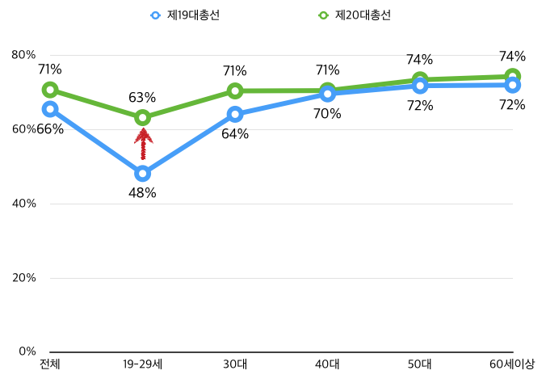

``` {r setOptions, message=FALSE, include=FALSE}
source("tools/chunk-options.R")
library(googleVis)
op <- options(gvis.plot.tag='chart')
#knitr::opts_chunk$set(cache=TRUE)
```


## 선거구

선거구 획정 관련 이슈

## 제20대 선거구 

제20대 선거구 데이터는 팀포퐁 [GitHub](https://github.com/southkorea/southkorea-maps)에서 가져온다. GeoJSON과 
Topo JSON 형식을 모두 지원한다.
`ogrListLayers` 함수를 통해서 사용할 `layer=`를 확인한다.

``` {r korea_precinct, results='asis', tidy=FALSE}
library(rgeos)
library(rgdal) # gdal > 1.11.0
library(ggplot2)

ogrListLayers("../southkorea-maps/popong/precinct/assembly-precinct-20-geo.json")
# precincts
 
ogrInfo("../southkorea-maps/popong/precinct/assembly-precinct-20-geo.json", "precincts")

map <-  readOGR(dsn="../southkorea-maps/popong/precinct/assembly-precinct-20-geo.json", layer="precincts")
 
plot(map)
```


#### 사전투표율



|  구 분  |  제19대   | 제20대(예측) |  증감율 |
|---------|---------|-----------|--------|
| 전체    |  65.6%  |70.8%      |  5.2%  |
| 19-29세  |  48.2%  |63.3%      |  15.1% |
| 30대   |  64.2%  |70.5%      |  6.3%  |
| 40대   |  69.7%  |70.6%      |  0.9%  |
| 50대   |  71.9%  |73.5%      |  1.6%  |
| 60세이상  |  72.1% |74.4%      |  2.3%  |

### 선거구 현황

|  구 분  |  제19대   | 제20대(예측) |제20대(실제)|  증감율 |
|---------|---------|-----------|----------|-------|
| 전체    |       |         |          | 5.2%  |
| 19-29세  |       |         |          | 15.1% |
| 30대   |       |         |          | 6.3%  |
| 40대   |       |         |          | 0.9%  |
| 50대   |       |         |          | 1.6%  |
| 60세이상  |      |         |          | 2.3%  |

[제20대 국회의원선거 투표구별 개표결과 자료](http://www.nec.go.kr/portal/bbs/list/B0000338.do?menuNo=200061)


