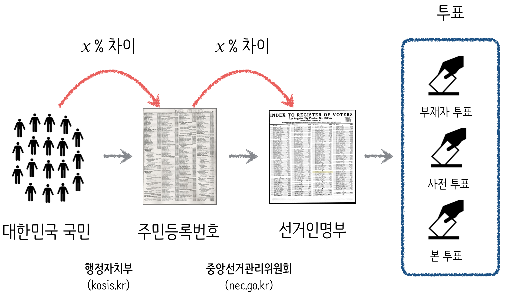

## 선거/투표 과정

선출직 공무원(대통령, 국회의원, 지방자체단체장)을 선거/투표 과정을 통해서 선출하는 과정은 다음과 같다.

* 대한민국 국적을 갖고 있는 모든 대한민국 국민을 정의한다.
* 모든 대한민국 국민을 주민등록번호에 매핑한다.
* 주민등록번호에 매핑된 정보를 기반으로 선거 인명부를 정의한다.
* 선거 인명부에 등재된 사람을 기준으로 투표를 실시한다.
    * 특정일시에 투표를 실시하기 어렵거나 투표율을 높이기 위해서, 사전투표, 부재자투표를 병행실시 한다.

### 선거 인명부 [^registration]

[^registration]: ["위장 전입은 죄가 아냐?…국가 기본 흔드는 행위"](http://view.asiae.co.kr/news/view.htm?idxno=2015030911074488331)

[선거 인명부](https://ko.wikipedia.org/wiki/선거_인명부)는 선거구별로 유권자의 수를 집계하여 유권자들을 기록해둔 장부로, 주민등록체계를 이용하여 선거 인명부가 작성되며, 부정선거 방지와 유권자수 파악이 목적이다. 주민등록제가 없는 나라의 경우는 별도 선거인명부를 정의하여 이를 기반으로 유권자를 파악해야만 된다.

### 사전 투표

[사전 투표(事前投票)](https://ko.wikipedia.org/wiki/사전_투표)는 유권자가 지정된 선거일 이전에 투표를 할 수 있도록 하는 제도로, 투표 참여를 높이고, 선거일 당일의 투표소 혼잡을 막기 위함이다.

### 부재자 투표

[부재자 투표](https://ko.wikipedia.org/wiki/부재자_투표)는 투표 방식의 일종이며, 선거일 당일에 일정한 사유 (해외 여행, 병원 입원, 징병 등)로 주소지 외부에 거주하게 되는 유권자가 다른 지역에서 투표할 수 있도록 마련한 제도로, 대한민국에서는 우편투표법을 인정하고 있다.

> ### 선거와 투표 {.callout}
> 
> **선거**는 대표자를 뽑는 행위이고, **투표**는 다수의 의사를 취합하는 방법 중 하나를 의미하는 것으로 통상 선거와 투표가 함께 이루어지는 과정을 거치게 됨으로써 한국에서는 동일의미로 사용되곤 한다.

## 선거 인명부

