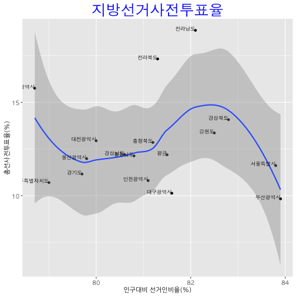

## 사전 투표율 (early voting turnout)

사전 투표는 사전투표란 선거일에 투표를 할 수 없는 선거인은 누구든지 별도의 신고없이 읍·면·동마다 설치된 사전투표소에서 선거일 전 5일부터 2일간 투표할 수 있는 제도로서 2013년 상반기 재·보궐선거에서 최초 도입됨[^nec-early-voting].

[^nec-early-voting]: [사전투표제도](http://www.nec.go.kr/portal/bbs/list/B0000357.do?menuNo=200561)

## 전국 사전 투표율 분석 데이터

|시도명   | 선거인수	      |  투표자수	    | 인구대비선거인비율	|지방선거사전투표율 |총선사전투표율 |
|-------|-------------|-------------|---------------|-------------|----------|
|평균	    | 42,100,398  | 4,472,492	| 81.5          | 11.5        |   12.19 |
|서울특별시	| 8,423,654	  | 837,130		| 83.8          | 11.1        |   11.61 |
|부산광역시	| 2,952,961	  | 253,396		| 83.9          | 8.9         |   9.83  |
|대구광역시	| 2,031,478	  | 179,239		| 81.6          | 8           |   10.13 |
|인천광역시	| 2,379,666	  | 222,386		| 81.1          | 11.3        |   10.81 |
|광주광역시	| 1,158,598	  | 158,455		| 78.7          | 13.3        |   15.75 |
|대전광역시	| 1,214,402	  | 136,185		| 80.0          | 11.2        |   12.94 |
|울산광역시	| 937,421	  | 96,221		| 79.8          | 10.7        |   11.98 |
|세종특별	| 167,798	  | 24,289		| 75.4          | 15.1        |   16.85 |
|경기도	| 10,034,919  | 966,650		| 79.7          | 10.3        |   11.16 |
|강원도	| 1,277,858   | 153,219		| 82.5          | 14.2        |   13.36 |
|충청북도	| 1,287,549   | 146,411		| 81.2          | 13.3        |   12.85 |
|충청남도	| 1,683,854   | 180,411		| 80.8          | 11.9        |   12.13 |
|전라북도	| 1,520,032   | 233,465		| 81.3          | 16.1        |   17.32 |
|전라남도	| 1,567,192   | 264,693		| 82.1          | 18          |   18.85 |
|경상북도	| 2,242,016   | 282,268		| 82.8          | 13.1        |   14.07 |
|경상남도	| 2,719,668   | 290,791		| 80.6          | 11.9        |   12.19 |
|제주특별	| 501,332	  | 47,283		| 79.0          | 11.1        |   10.7  |

### 1. 사전투표율 데이터 가져오기

`googlesheets` 팩키지를 활용하여 사전투표율 데이터를 분석하는데 엑셀을 대신하여 웹기반 스프레드쉬트를 활용한다.
`사전투표율분석` 파일을 생성하고 `사전투표` 워크쉬트에 상기 표형식 데이터를 분석한다.

`t.dat`는 `googlesheet`, 리스트 데이터형이고, `gs_read` 함수를 통해 `tbl_df`, 데이터프레임이다.

~~~{.r}
#================================================================
# 1. 데이터 가져오기
#================================================================
library(googlesheets)

glist <- gs_ls()

t.dat <- gs_title("사전투표율분석")
~~~

~~~{.output}
Sheet successfully identified: "사전투표율분석"

~~~

~~~{.r}
v.dat <- gs_read(t.dat, ws='사전투표')
~~~

~~~{.output}
Accessing worksheet titled '사전투표'.

~~~

~~~{.output}
No encoding supplied: defaulting to UTF-8.

~~~

### 2. 데이터 정제

사전투표분석을 위해 데이터프레임을 데이터 시각화를 위해 정리한다.
탐색적 데이터분석결과 `세종특별자치시`는 인구가 적어 상호비교를 하는데 도움이 되지 않아 제외한다.

~~~{.r}
suppressMessages(library(dplyr))
colnames(v.dat) <- c('시도','선거인수','투표자수','인구대비선거인비율','총선사전투표율','지방선거사전투표율')
v.dat <- v.dat %>%
  filter(!(시도 %in% "세종특별자치시")) 
~~~

### 3. 시각화

`ggplot`을 통해 인구대비 선거인비율(%)이 대략 82% 정도로 파악이 되고, 전국 평균과 비교하여 전라남도와 전라북도가
총선 사전투표율이 높은 반면, 대구광역시는 상대적으로 낮은 것이 시각화를 통해 드러난다.

~~~{.r}
library(ggplot2)
source("~/Dropbox/01_data_science/00-hangul-plot-setting.R") # http://freesearch.pe.kr/archives/4446 참조

ggplot(data = v.dat) + 
  aes(x=인구대비선거인비율,y=총선사전투표율) +
  geom_point() +
  geom_smooth() +
  labs(title = "지방선거사전투표율", x="인구대비 선거인비율(%)", y="총선사전투표율(%)") +
  geom_text(aes(x=인구대비선거인비율,y=총선사전투표율, label=시도), hjust=1, vjust=0, family="AppleGothic", size=3) +
  theme(plot.title = element_text(size=25, family="AppleGothic", colour="blue"),
        axis.text = element_text(size=10, family="AppleGothic"))
~~~

