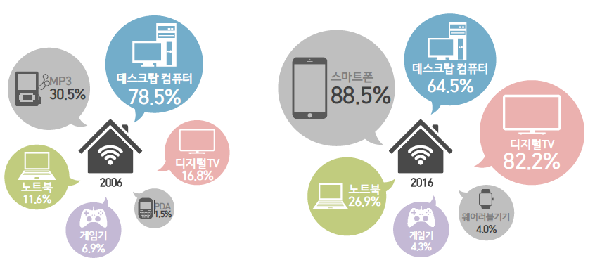
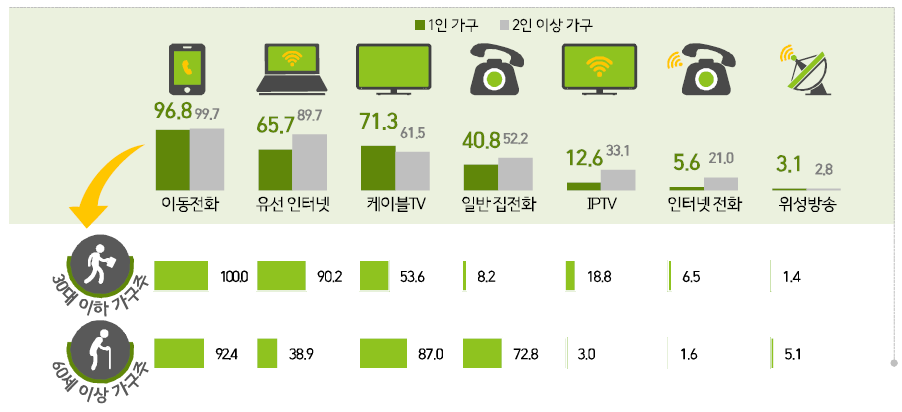
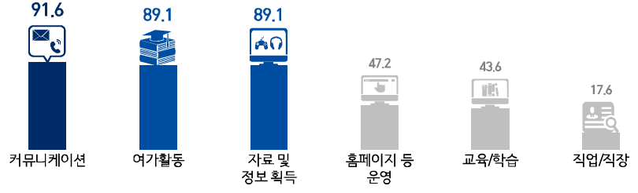
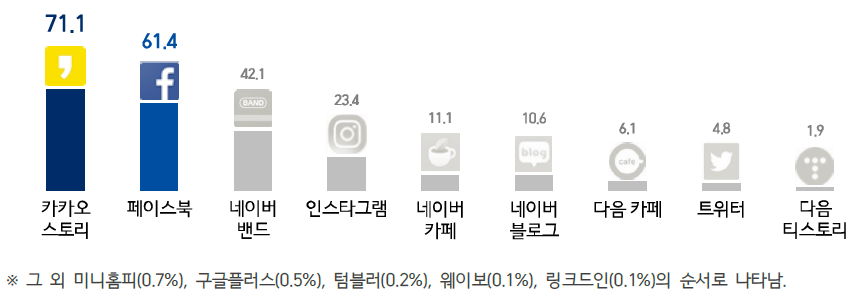
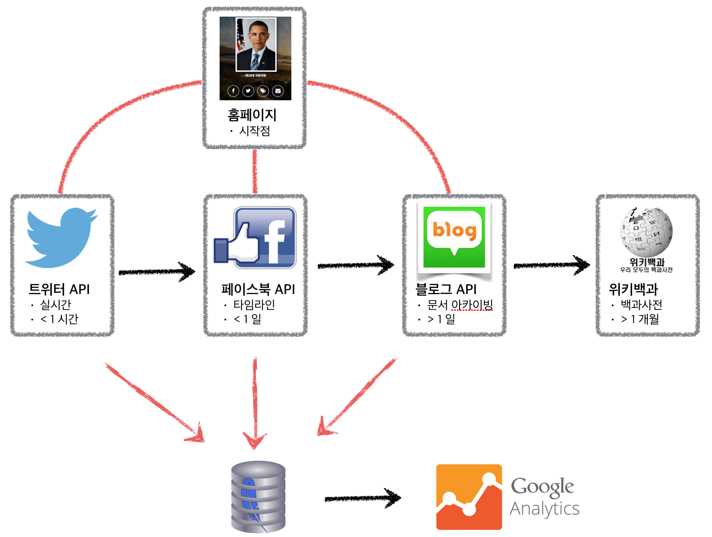

> ## 학습 목표 {.objectives}
>
> * 디지털 미디어와 SNS 그리고 데이터 과학 관계를 이해한다.
> * 디지털 미디어 배포 채널을 이해한다.
> * 인터넷 SNS에 대해 이해한다.

## 1. 대한민국 컴퓨터 하드웨어 인트라 [^kisa-report-2017]

[^kisa-report-2017]: [2016년 인터넷이용실태조사 요약보고서](http://isis.kisa.or.kr/board/?pageId=060100&bbsId=7&itemId=817&pageIndex=1)

인공지능과 4차 산업혁명이 휩쓸고 있는 2017년 현재 대한민국은 디지털 제품(소프트웨어, 미디어, 데이터 등)을 생산하는 생산자이기도 하며
동시에 소비자이기도 하다. 디지털 제품 생산을 위해서 고정형 데스크탑 컴퓨터와 이동형 노트북이 활용되고,
디지털 제품을 소비는 고정형 디지털 TV와 이동형 스마트폰을 통해서 이뤄지고 있다.

|  구분   |      생산          |       소비     |
|---------|--------------------|----------------|
| 고정형  |  데스크탑 컴퓨터   |    디지털 TV   |
| 이동형  |       노트북       |   스마트폰     |

### 1.1. 세대별 인터넷 커뮤니케이션 활용

30대 이하 가구주는 이동전화와 유선 인터넷 사용을 많이 하고, 60세 이상은 케이블TV, 일반집전화, 그리고 이동전화를 주된 인터넷 커뮤니케이션으로 사용한다.

### 1.2. 왜 인터넷을 사용하는가?

커뮤니케이션, 여가활동, 자료 및 정보 획득을 위해 주로 인터넷 커뮤니케이션에 사용된다.

### 1.3. SNS 활용 순위

카카오 스토리, 페이스북이 양강을 이루고 있다.

## 2. 디지털 미디어 배포 채널

디지털 미디어(글, 사진, 동영상, 음악 등)가 제작되면 이를 다양한 채널을 통해 배포를 한다.
가장 정적이면서 신뢰성이 높은 콘텐츠가 [위키백과사전](https://www.wikipedia.org/) 사전이다.
백과사전으로 정리하여 배포할 필요가 있는 콘텐츠는 위키백과사전에 등록하고 이를 링크를 걸어 활용한다.

정적인 디지털콘텐츠의 대표적인 사례가 블로그다. 블로그는 [xwMOOC](http://www.xwmooc.net)와 같이 
독자적으로 설치하여 나만의 블로그 페이지를 구축하는 것도 가능하다. 그동안 많이 사용된 설치형 블로그는
정적 웹콘텐츠의 대표적인 사례로 [워드프레스](https://ko.wordpress.com/)와 [제킬](https://jekyllrb.com/)이 있다.

하지만, 가입형 블로그 서비스로 국내에서는 [네이버 블로그](http://blog.naver.com)나 카카오에서 서비스하는 [티스토리](http://www.tistory.com/)가 있다. 최근에는 [GitHub Page](http://github.com/)도 개발자를 중심으로 확산을 되어 나가고 있다.

[페이스북(Facebook)](http://www.facebook.com/)은 SNS 서비스의 대표격으로, 과거 싸이월드 및 Myspace 같은 소셜 네트워크 서비스를 확장하여 현재 전세계 표준으로 자리잡으며, 무서운 속도로 거의 모든 배포 채널을 빨아들이고 있다. 타임라인 서비스를 킬러 서비스로, 동영상, 문자메시지, 그룹, 게임, 실시간 방송 등 거침이 없다.

[트위터](https://twitter.com/) 서비스는 트윗(tweet)이 기본 단위로, 140자가 한도로 미국 SMS가 160 글자로 한정되어 있고, 20자는 사용자 아이디 공간이 된다.

고유 도메인을 갖는 홈페이지를 구축하기도 하여 일체성을 강조하기도 한다. 과거 거의 모든 콘텐츠를 홈페이지에 넣어 이를 서비스하던 형태에서 모듈화되고 RESTful API를 활용하여 클릭시 도달하는 랜딩페이지(landing page) 개념으로 활용하기도 한다.

### 3. 디지털 미디어 관련 데이터

디지털 미디어를 통해 배포된 데이터는 페이스북의 경우, *좋아요*, *공유*, *코멘트* 등을 통해서 얼마나 많은 사용자가 관심을 가지고 적극적으로 디지털 미디어를 소비했는지 파악할 수 있고, 이 데이터를 DB에 모아 [구글 애널리틱스(Google Analytics, GA)](http://analytics.google.com)를 통해 다양한 통계분석, 모니터링, [A/B 테스팅](https://en.wikipedia.org/wiki/A/B_testing) 등을 별도 비용없이 진행가능하다.

## 디지털 콘텐츠 제작

3부작 제작 중 

