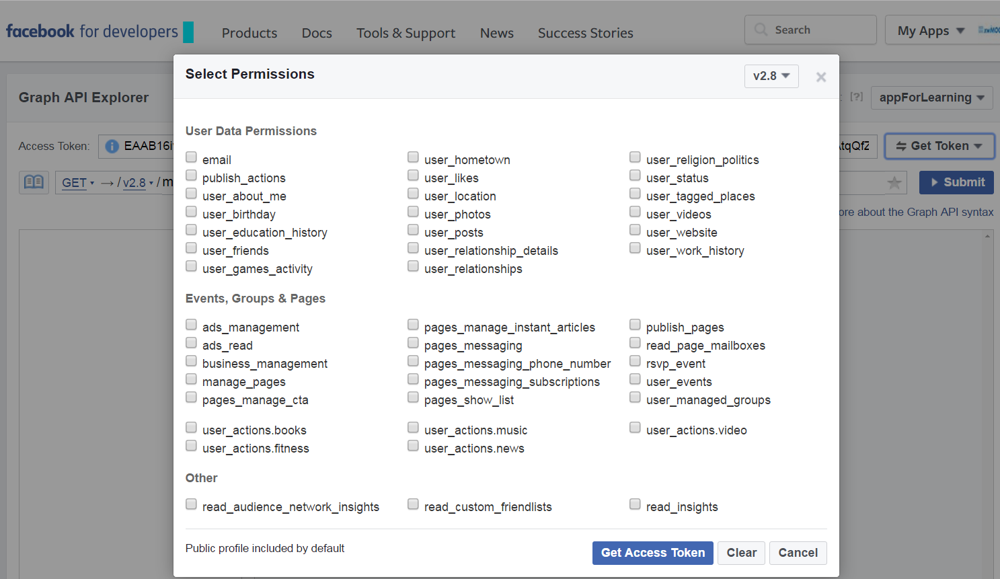
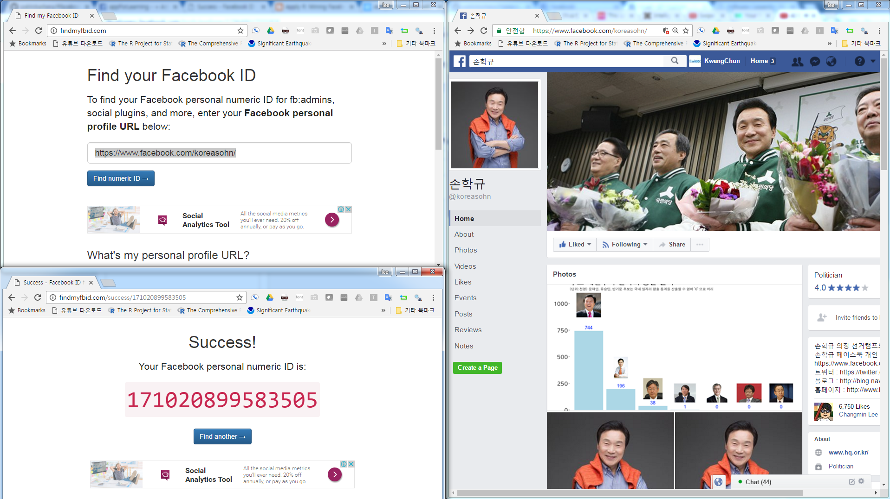

```{r setOptions, message=FALSE, include=FALSE}
source("tools/chunk-options.R")
library(tidyverse)
library(gridExtra)
library(ggplot2)
options(warn=-1)
```

## 페이스북(Facebook) 

[페이스북(Facebook)](http://www.facebook.com/)은 SNS 서비스의 대표격으로, 
과거 싸이월드 및 Myspace 같은 소셜 네트워크 서비스를 확장하여 현재 전세계 표준이 되었다. 
물론 대표적인 SNS 서비스로 자리매김하기까지 우여곡절도 많았지만, 지속적인 혁신을 가져이어 가며 최고의 위상을 이어가고 있다.

페이스북은 그 자체로 다양한 서비스를 아우르고 있고, 특히 페이스북 개인 프로파일과 페이지의 장단점에 대해 이해하고, 
페이스북 그룹 기능에 대한 올바른 이해가 필수적이다.


- 페이스북 서비스 구분
    - 개인 프로필(Personal Profile)
    - 페이지(Page)
    - 그룹(Group)

### 페이지와 그룹 비교

페이스북 페이지와 그룹은 유사해 보지만 상당한 차이가 있다. 페이지는 일대다(One-to-Many) 방송 플랫폼인 반면에
그룹은 유사한 관심사를 갖는 사람들 간에 협업과 토론을 위한 장이다. [^1]

|        구분    |             페이지          |            그룹                   |
|----------------|-----------------------------|-----------------------------------|
| 목적           | 특정인, 브랜드 대표         | 특정 그룹을 위한 협업 공간        |
| 제한사항       | 공개 혹은 관리자만          | 공개 그룹, 비공개 그룹, 비밀 그룹 |
| 친구 추가      | 불가                        | 가능 - 그룹원의 페북친구만        |
| 게시 제한      | 관리자 혹은 위임받은 자     | 관리자만 혹은 모두에게 공개       |


[^1]: [Facebook Pages vs Facebook Groups - Cara Pring](http://thesocialskinny.com/facebook-pages-vs-facebook-groups/)

### 개인 프로필과 페이지 비교 [^2]

개인 프로필(Personal Profile)은 비영리 및 각 개인을 대변한다. 
팔로어 기능을 통해 친구가 아닌 사람도 관심갖고 있는 사람에 대한 최신 정보를 받아볼 수 있다.
페이지는 개인 프로파일과 유사하지만, 사업, 브랜드, 조직을 위한 유일무이한 도구를 제공한다.
페이지는 개인 프로파일을 갖는 사람이 관리하며, 페이지에 좋아요를 누르면 뉴스피드를 통해 
최신 정보를 받아보게 된다.

> ### 개인 계정을 페이지로 전환해야 되는 이유 {.callout}
>
> 사업, 브랜드, 조직 등을 대표하는데 개인 계정을 사용하는 것은 페이스북 계약조항에 위배된다.
> 개인이 아닌 사업, 브랜드, 조직을 대표하여 사용하고 있는데 이를 페이지로 전환하지 않는다면,
> 영구히 계정에 대한 접근 권한을 잃어버릴 수 있다. 

[^2]: [Why should I convert my personal account to a Facebook Page?](https://www.facebook.com/help/217671661585622)

### 개인 프로파일에 대한 페이지 사용할 때 좋은 점 14 [^3]

1. 페이스북 활동 이력 데이터에 대한 접근
1. 탭과 콘텐츠
1. 광고기능은 페이지만 활용 가능
1. 페친 5,000 명 가능
1. 프로필이 전문적으로 보임 
1. 광고에 대한 접근
1. 사생활 보호
1. 관리자 권한 위임
1. 예약 스케쥴링
1. 페이스북 위치

[^3]: [14 Benefits of a Facebook Business Page Over a Personal Profile](http://www.jonloomer.com/2012/09/03/benefits-of-a-facebook-business-page/)


## 페이스북 데이터 긁어오기

### OAuth를 활용한 영구 토큰을 이용한 방법

페북 데이터를 R을 활용하여 분석할 경우 `Rfacebook` 팩키지를 활용하여 페이스북 페이지 데이터를 분석한다. 먼저 
[페이스북 개발자 페이지](https://developers.facebook.com/)에 접속해서 `Add a New App`을 클릭하고 나서,
`Website`를 선택한다. 사용할 페이스북앱 이름과 더불어, 연락처 및 관련된 설정을 선택한다.

`fbOAuth` 인자로 넘길 `app_id`와 `app_secret` 정보를 확인한 후에 R에서 목표로 삼고 있는 페이스북 페이지 정보를 
가져와서 분석한다. 
자세한 사항은 [Analyze Facebook with R](http://thinktostart.com/analyzing-facebook-with-r/), 
[R-Blogger: Analyze Facebook with R](http://www.r-bloggers.com/analyze-facebook-with-r/)을 참조한다.

`Rfacebook`을 Github을 통해 설치를 할 것이기 때문에, `devtools`가 필요하다.
이후, `fbOAuth`에서 사용될 `app_id`와 `app_secret` 정보를 넣어 페이스북 인증준비를 마친다.

주의할 점은 `app_id`와 `app_secret`을 인터넷에 노출시킬 수 없어서, 
`save(fb_oauth, file="fb_oauth")` 명령어로 처리한 점을 이해하면 좋다. `fb_oauth` 파일에 인증보안에 
사용되는 열쇠가 포함되어 있다.

```{r fb-page-oauth-token, tidy=FALSE, eval=FALSE}
# 0. 환경설정 ================================================================
# library(devtools)
# install_github("Rfacebook", "pablobarbera", subdir="Rfacebook")

suppressMessages(require("Rfacebook"))
# fb_oauth <- fbOAuth(app_id="1XXXXXXXX30", 
#                    app_secret="982XXXXXXXXXXXXXXXXXXXXdaa",
#                    extended_permissions = TRUE)
# save(fb_oauth, file="fb_oauth")
load("fb_oauth")
```

### 페이스북 임시 토큰을 이용한 간단한 방법

페이스북에서 제공하는 [Graph API Explorer](https://developers.facebook.com/tools/explorer)를 통해 토큰(Token)을 얻어와서 이를 활용하여 
2시간 내 잠깐 사용하는 데이터 작업에 활용하기에는 이보다 더 좋은 것이 없다. `Get Token`으로 발급된 **Access Token**을 복사해서 
변수에 넣고 이를 페이스북 데이터를 가져오는데 활용한다.

[https://developers.facebook.com/tools/explorer](https://developers.facebook.com/tools/explorer) &rarr; `Tools & Support` 
&rarr; `Graph API Explorer` &rarr; `Get Token` &rarr; `Get User Access Token`



```{r fb-page-token, tidy=FALSE, eval=FALSE}
me_token <-"EAACExxxxxxxxxxxxxxxxxxxxxxxxxxxxxxxxxxxxxxxxx"
```

### 페이스북 ID 알아내는 방법

페이스북 개인 프로파일 URL을 알아내는 방법은 페이스북 페이지 좌측 상단 본인 계정을 클릭하면 확인이 가능하다.
개인 프로파일이나 페북 페이지 혹은 그룹 URL을 확인한 후에 페이스북 ID를 알고 있으면 좋다.
한 사례로 [손학규 @koreasohn](https://www.facebook.com/koreasohn/) 페이스북 페이지 URL을 통해 페이스북 ID를 알아내는 사례를 살펴보자.

[Find your Facebook ID](http://findmyfbid.com/) 웹페이지를 방문하여 페이스북 프로파일, 그룹, 페이지 등 URL을 확인했으면,
URL을 복사하여 붙여 넣게 되면 페이스북 ID를 반환해 준다.



### 페이스북 프로파일 헬로우 월드

페이스북에서 데이터를 긁어오기 위해 토큰을 생성하고 페이지 ID를 얻었으면 이를 바탕으로 
"Hello World"를 찍어본다. `getUsers()` 함수에 개인 프로파일 ID와 토큰을 넣어 정보를 얻어오고, `getFriends()` 함수를 통해
친구 정보도 받아오고 나서 친구 성별을 표로 만들어본다.

```{r fb-page-profile, tidy=FALSE, eval=FALSE}
# devtools::install_github("pablobarbera/Rfacebook")
library(Rfacebook)
library(tidyverse)

me_token <-"EAACEdEose0cBAA2JEOrM4YC6ZCkWmDTXgu0SCCYaZC27vftd2XydDoLlsT10effWMXVfPgs4nwOFgnrT2rAqwYw2EWVyeZCkWDcWBZBFmlXsNjXeUUy0Uc3CeoZAy1jRBFVgulTS4sRfG9mMjIUZAYADr6B8V0fePVxxlTg8pLMFIn5ZB6YfAnsDlalZAZBZBOIwAZD"

me <- getUsers("533419894", token=me_token, private_info=TRUE)
me$name

my_friends <- getFriends(token=me_token, simplify = FALSE)

table(my_friends$gender)
```


