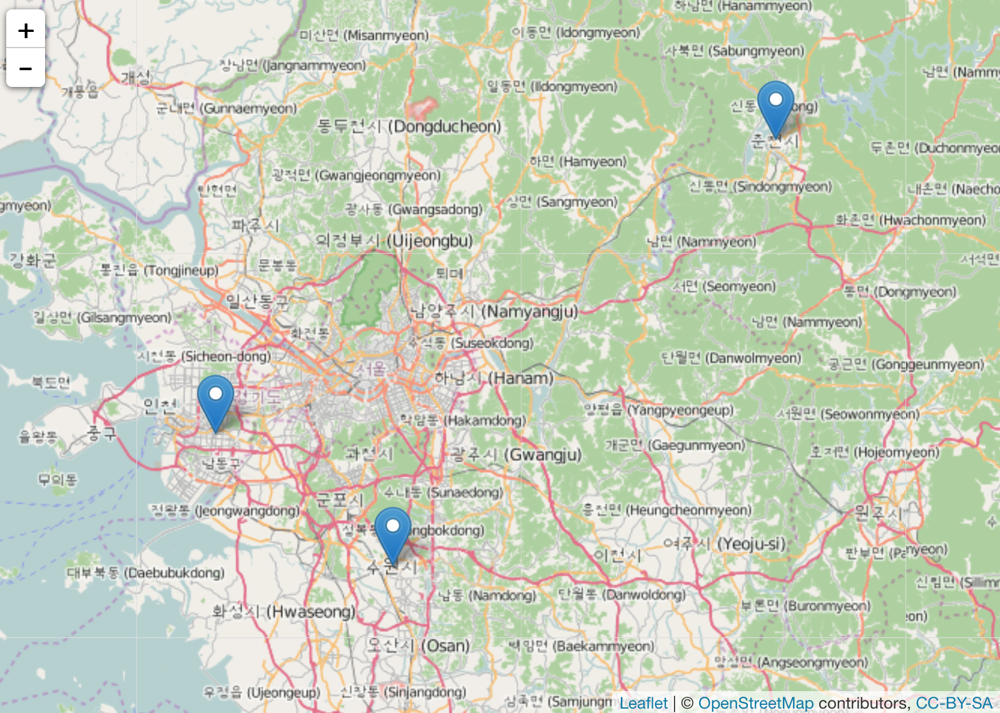
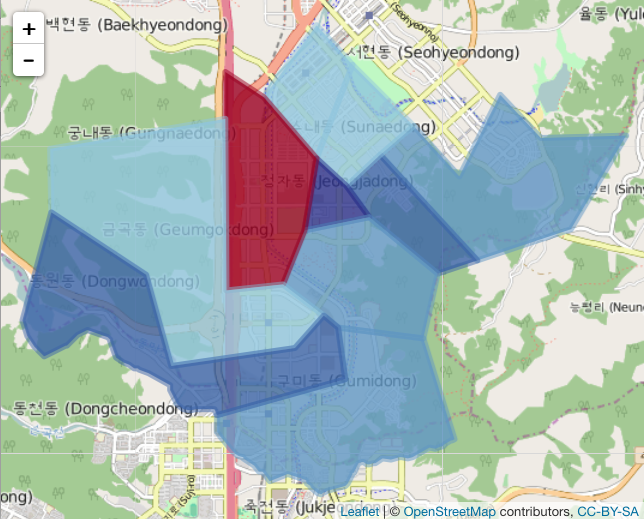

``` {r setOptions, message=FALSE, include=FALSE}
source("tools/chunk-options.R")
library(googleVis)
op <- options(gvis.plot.tag='chart')
#knitr::opts_chunk$set(cache=TRUE)
```

## 투표 지리정보 매핑에 들어가며

추론하는 선거에서 보는 선거로 넘어가고 있다. 과거 선거캠프나 후보자 경험에 의해 주변정보를 입력받아 추론하는 선거도 여전히 유효하다. 하지만, 알파고의 등장으로 확연히 드러나고 인정되는 사실은
인공지능이 직간접적으로 영향을 주고 있으며, 과거 **추론의 선거에서 시각화하는 선거**로 넘어가고 있다는 점이다. 투표정보를 지리정보와 매핑하여 추론을 보좌하고 시각화의 강력함을 눈으로 확인해보자.

## 1. 위도경도 정보

구글 지오코드 API(Geocode API)를 활용하여 지명만으로 위도와 경도를 받아오고, 
이를 `bind_cols` 함수로 칼럼 결합을 한 후에 `leaflet` 팩키지를 활용하여 
지리정보를 매핑한다.

``` {r geo-lonlat-import, eval=FALSE, tidy=FALSE}
##===========================================================
## 구글 Geocode API
##===========================================================
suppressMessages(library(ggmap))
suppressMessages(library(dplyr))

# type	city	addr	lon	lat
# 관찰소	서울보호관찰소		126.9779692	37.566535
# 관찰소	서울동부보호관찰소		126.9197115	37.4932342
# 관찰소	서울남부보호관찰소		126.9205608	37.4849326
# 지소	공주지소 	 충청남도 공주시 번영1로 114 	127.1191534	36.4465346
# 지소	논산지소 	 충청남도 논산시 시민로294길 27 	127.0987453	36.1870656
# 지소	서산지소 	 충청남도 서산시 서령로 89 	126.4503169	36.7844993

# 지명
city = c("인천보호관찰소", "수원보호관찰소", "춘천보호관찰소")
type = c("관찰소","관찰소","관찰소")

loc <- data.frame(city, type, stringsAsFactors = FALSE)
latlon <- geocode(loc$city)

loc.latlon <- bind_cols(loc, latlon)

##===========================================================
## leaflet 마커
##===========================================================
suppressMessages(library(leaflet))

leaflet(data = loc.latlon) %>% addTiles() %>%
  addMarkers(~lon, ~lat, popup = ~as.character(type))
```
[](html/geo-vote-marker.html)

## 2. 투표정보 매핑

``` {r geo-shapefile, eval=FALSE, tidy=FALSE}
#----------------------------------------------------------------
# 1. 환경설정

library(Kormaps); library(leaflet); library(RColorBrewer); library(readxl)

#----------------------------------------------------------------
# 2. 데이터 가져오기 (지도데이터 및 투표 데이터)

## 2.1. 대한민국 지도 추출
kr.map <- korpopmap3


### 2.1.1. 성남 분당을 지역구 지도 추출
bd.eul <- c("3102351", "3102352", "3102353","3102354",
            "3102355","3102356","3102357","3102367","3102371","3102372","3102377","3102378")

sn.map <- subset(korpopmap3, korpopmap3@data$code %in% bd.eul)

## 2.2. 선거 주제도 데이터 불러오기
sn.vote <- read_excel("data/map-sn-data.xlsx", sheet="Sheet1")

#----------------------------------------------------------------
# 3. 데이터 정제

sn.m <- merge(sn.map, sn.vote, by.x='code', by.y='code', all.x=T)

#----------------------------------------------------------------
# 4. 데이터 시각화

politics_brew_colors <- rev(brewer.pal(n = 10, name = "RdYlBu"))

blue_palette <- colorBin(politics_brew_colors, domain=sn.m@data$vote_diff)
votes_diff <- paste0("분당을: ", sn.m@data$dong, "<br>",
                     "표차이: ", domain=sn.m@data$vote_diff, "<br>",
                     "-양수: 새누리", "<br>", "-음수: 더민주")

leaflet(sn.m) %>%
  addTiles() %>%
  addPolygons(stroke=TRUE, 
              smoothFactor = 0.2,
              fillOpacity = .8, 
              popup=votes_diff,
              color= ~blue_palette(sn.m@data$vote_diff))

```

[](html/bd_eul_election.html)


