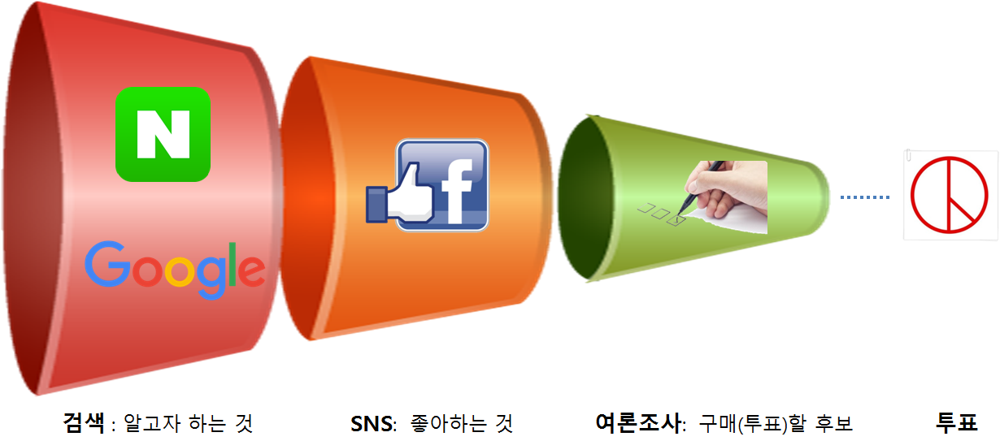

```{r setOptions, message=FALSE, include=FALSE}
library(tidyverse)
library(stringr)
library(plotly)
source("tools/chunk-options.R")

gallop_df <- read_csv("data/survey_gallop.csv")
real_df   <- read_csv("data/survey_real.csv")
rns_df    <- read_csv("data/survey_rns.csv")
jwi_df    <- read_csv("data/survey_jwi.csv")

survey_df <- gallop_df %>% 
  bind_rows(real_df) %>% 
  bind_rows(rns_df) %>% 
  bind_rows(jwi_df)

survey_df <- survey_df %>% mutate(주차 = factor(주차, levels=c("1월 1주차", "1월 2주차", "1월 3주차", "1월 4주차", "2월 1주차", 
                                              "2월 2주차", "2월 3주차", "2월 4주차", "3월 1주차", "3월 2주차", 
                                              "3월 3주차", "3월 4주차", "3월 5주차", "4월 1주차", "4월 2주차", 
                                              "4월 3주차", "4월 4주차"))) %>% 
  mutate(지지율 = 지지율/100)

# 3. 데이터 시각화 -------------------------------------------------------------------

survey_g <- ggplot(survey_df, aes(x=주차, y=지지율, group=interaction(조사업체,후보), color=후보)) +
  geom_point() +
  geom_line() +
  scale_y_continuous(labels = scales::percent) +
  theme_minimal() +
  theme(legend.position="none", 
        plot.caption=element_text(hjust=0,size=8),
        plot.subtitle=element_text(face="italic"),
        axis.text=element_text(size=9.5))+
  labs(x="",y="",title="후보별 여론조사 지지율 추이",
       caption="\n 데이터출처: 나무위키 여론조사(https://namu.wiki/w/제19대 대통령 선거/여론조사)",
       subtitle="") +
  scale_colour_manual(name="",
                      values=c(문재인="#065ce8", 
                                  홍준표="#ff0000",
                                  안철수="#07f91f",
                                  유승민="#00faff",
                                  심상정="#f2ee09"))


survey_facet_g <- ggplot(survey_df, aes(x=주차, y=지지율, group=후보, color=후보)) +
  geom_point() +
  geom_line() +
  facet_wrap(~조사업체) +
  theme_minimal() +
  theme(legend.position="none", 
        plot.caption=element_text(hjust=0,size=8),
        plot.subtitle=element_text(face="italic"),
        axis.text=element_text(size=7.5))+
  labs(x="",y="",title="후보별 여론조사 지지율 추이",
       caption="\n 데이터출처: 나무위키 여론조사(https://namu.wiki/w/제19대 대통령 선거/여론조사)",
       subtitle="") +
  scale_colour_manual(name="",
                      values=c(문재인="#065ce8", 
                                  홍준표="#ff0000",
                                  안철수="#07f91f",
                                  유승민="#00faff",
                                  심상정="#f2ee09"))
```

## 1. 대선 여론조사 공표 금지 [^mbc-bodo]

[^mbc-bodo]: [대선 여론조사 공표 금지 '깜깜이' 기간…실효성은?](http://news.naver.com/main/read.nhn?mode=LPOD&mid=tvh&oid=214&aid=0000762271)

5월 3일부터 대선 여론조사 공표 금지에 들어간다. 공직 선거법 108조의 여론조사의 결과공표금지 규정에 따른 것이다.

> 제108조(여론조사의 결과공표금지 등<개정 2015.12.24>) 
> 
> ① 누구든지 선거일 전 6일부터 선거일의 투표마감시각까지 선거에 관하여 정당에 대한 지지도나 당선인을 예상하게 하는 
> 여론조사(모의투표나 인기투표에 의한 경우를 포함한다. 이하 이 조에서 같다)의 경위와 그 결과를 공표하거나 인용하여 보도할 수 없다.

<iframe width="560" height="315" src="https://www.youtube.com/embed/4psAdPRoK2g" frameborder="0" allowfullscreen></iframe>

기존 6일에서 2일로 공표기간을 줄이는 법안을 중앙선거관리위원회에서 제시를 했지만, 더이상 진척된 것은 없다.
대한민국과 비교하여 다른 외국 사례를 비교하면 다음과 같다.

- 미국: 공표금지기간 없음.
- 영국: 공표금지기간 없음.
- 프랑스: 공표금지기간 2일
- 스페인: 공표금지기간 5일


## 2. 민심과 여론조사 그리고 대안

선거를 이기려는 후보자는 민심을 읽으려고 하고, 후보자를 선택하려는 사람들은 선거 현황에 대한 알고자 하는 욕구가 있다.
전통적으로 이런 역할을 수행했던 방법이 여론조사다. (바닥)민심이 SNS(페이스북 등)와 여론조사 지지율에 반영되고 그리고 종국에는 투표로 이어진다.

> **"Public sentiment is everything. With public sentiment, nothing can fail; without it nothing can succeed. 
> Abraham Lincoln - first Lincoln-Douglas Debate at Ottawa, Illinois (21 August 1858)"**

링컨 대통령이 말씀하신 것과 같이 민심을 읽게 되면 대권을 얻게 되는데, 과거 여론조사는 민심을 읽어내는 한
방식이었다. 이제 민심을 읽을 수 있는 대안이 생겼다. 
검색과 SNS 소셜이 여론조사의 빈자리(여론조사 공표 금지 6일)을 메울 수 있고, 더 나아가 유권자들이 알고자 하는 것과 함께 좋아하는 것을 파악할 수 있다.


따라서, 네이버 검색, 구글 검색 결과와 페이스북 좋아요를 읽게 되면 대권을 얻게 되는 대안이 생기게 되었고, 
중간 여론조사기관이 수행하던 표본조사 방식에 더하여 직접민주주의에 더 다가서게 되었다. 

한표를 얻는 과정은 검색을 통해 긍정이든 부정이든 의사결정을 위한 정보수집단계가 첫번째 단계가 되고 이를 각 후보들이 혹은 언론들이 
창출하는 정보에 "좋아요"를 통해 표현하고 나서 운 좋게 여론조사업체에서 연락을 받게 되면 한표를 던질 후보에 여론을 전달하게 된다.
그리고 5월 9일 물론 그 이전에 사전투표 등을 통해 소중한 한표를 행사하게 된다.



## 3. 여론조사 

[나무위키 여론조사](https://namu.wiki/w/제19대 대통령 선거/여론조사) 웹사이트에서 국내 주요 여론조사업체가 실시한 여론조사 결과가 표형태로 잘 정리되어 있다.

- 갤럽 : 한국갤럽에서 자체적으로 조사한 2017년 대선 후보 지지도 주간집계 결과임
- 리얼미터 : MBN·매일경제·CBS가 의뢰하여 리얼미터에서 조사한 2017년 대선주자 지지도 주간집계 결과임
- 알앤써치 : 데일리안이 의뢰하여 알앤써치에서 조사한 2017년 대선주자 여론조사 주간집계 결과임
- 조원씨앤아이 : 쿠키뉴스가 의뢰하여 조원씨앤아이에서 조사한 2017년 대선주자 여론조사 주간집계 결과임

``` {r survey-almost-polls, fig.width=12, echo=FALSE, message=FALSE, warning=FALSE}
ggplotly(survey_g)

library(data.table)
survey_tbl <- dcast(setDT(survey_df), 주차 ~ 조사업체+후보, value.var =c("지지율"))

DT::datatable(survey_tbl) %>% 
  DT::formatPercentage(c(2:21), digits=1)

survey_facet_g
```

``` {r survey-setup, eval=FALSE}
# 0. 환경설정 --------------------------------------------------
library(tidyverse)
library(rvest)
library(stringr)
library(plotly)

# 1. 데이터 가져오기 ------------------------------------------

namu_url <- "https://namu.wiki/w/%EC%A0%9C19%EB%8C%80%20%EB%8C%80%ED%86%B5%EB%A0%B9%20%EC%84%A0%EA%B1%B0/%EC%97%AC%EB%A1%A0%EC%A1%B0%EC%82%AC"
namu_html <- read_html(namu_url, encoding="UTF-8")

Sys.setlocale("LC_ALL", "Korean")
naum_tbl <- readRDS("data/namu_tbl.RDS")

gallop_tbl <- html_table(namu_tbl) [[7]]
real_tbl <- html_table(namu_tbl) [[8]]
rns_tbl <- html_table(namu_tbl) [[9]]
jwi_tbl <- html_table(namu_tbl) [[10]]

# 2. 데이터 정제 ------------------------------------------

## 2.1. 갤럽 ----------------------------
names(gallop_tbl) <- gallop_tbl[1,]
gallop_tbl <- gallop_tbl %>% dplyr::select(`주차`, `문재인`, `홍준표`, `안철수`, `유승민`, `심상정`)

gallop_df <- gallop_tbl %>% dplyr::filter(stringr::str_detect(gallop_tbl$주차, pattern="[0-9]{1}[월]")) %>%
  gather(후보, 지지율, -주차) %>% 
  mutate(`지지율` = str_replace_all(`지지율`, "%", "")) %>%
  mutate(`지지율` = as.numeric(`지지율`)) %>% 
  mutate(조사업체 = "갤럽")

## 2.2. 리얼미터 ----------------------------
names(real_tbl) <- real_tbl[1,]
real_tbl <- real_tbl %>% dplyr::select(`주차`, `문재인`, `홍준표`, `안철수`, `유승민`, `심상정`)

real_df <- real_tbl %>% dplyr::filter(stringr::str_detect(real_tbl$주차, pattern="[0-9]{1}[월]")) %>%
  gather(후보, 지지율, -주차) %>% 
  mutate(`지지율` = str_replace_all(`지지율`, "%", "")) %>%
  mutate(`지지율` = as.numeric(`지지율`)) %>% 
  mutate(조사업체 = "리얼미터")

## 2.3. 알앤써치 ----------------------------
names(rns_tbl) <- rns_tbl[1,]
rns_tbl <- rns_tbl %>% dplyr::select(`주차`, `문재인`, `홍준표`, `안철수`, `유승민`, `심상정`)

rns_df <- rns_tbl %>% dplyr::filter(stringr::str_detect(real_tbl$주차, pattern="[0-9]{1}[월]")) %>%
  gather(후보, 지지율, -주차) %>% 
  mutate(`지지율` = str_replace_all(`지지율`, "%", "")) %>%
  mutate(`지지율` = as.numeric(`지지율`)) %>% 
  mutate(조사업체 = "알앤써치")

## 2.4. 조원씨앤아이 ----------------------------
names(jwi_tbl) <- jwi_tbl[1,]
jwi_tbl <- jwi_tbl %>% dplyr::select(`주차`, `문재인`, `홍준표`, `안철수`, `유승민`, `심상정`)

jwi_df <- jwi_tbl %>% dplyr::filter(stringr::str_detect(real_tbl$주차, pattern="[0-9]{1}[월]")) %>%
  gather(후보, 지지율, -주차) %>% 
  mutate(`지지율` = str_replace_all(`지지율`, "%", "")) %>%
  mutate(`지지율` = as.numeric(`지지율`)) %>% 
  mutate(조사업체 = "조원씨앤아이")

## 2.5. 데이터 병합 ----------------------------

# write_csv(gallop_df, "data/survey_gallop.csv")
# write_csv(real_df, "data/survey_real.csv")
# write_csv(rns_df, "data/survey_rns.csv")
# write_csv(jwi_df, "data/survey_jwi.csv")

gallop_df <- read_csv("data/survey_gallop.csv")
real_df   <- read_csv("data/survey_real.csv")
rns_df    <- read_csv("data/survey_rns.csv")
jwi_df    <- read_csv("data/survey_jwi.csv")

survey_df <- gallop_df %>% 
  bind_rows(real_df) %>% 
  bind_rows(rns_df) %>% 
  bind_rows(jwi_df)

survey_df <- survey_df %>% mutate(주차 = factor(주차, levels=c("1월 1주차", "1월 2주차", "1월 3주차", "1월 4주차", "2월 1주차", 
                                              "2월 2주차", "2월 3주차", "2월 4주차", "3월 1주차", "3월 2주차", 
                                              "3월 3주차", "3월 4주차", "3월 5주차", "4월 1주차", "4월 2주차", 
                                              "4월 3주차", "4월 4주차"))) %>% 
  mutate(지지율 = 지지율/100)

# 3. 데이터 시각화 -------------------------------------------------------------------

survey_g <- ggplot(survey_df, aes(x=주차, y=지지율, group=interaction(조사업체,후보), color=후보)) +
  geom_point() +
  geom_line() +
  scale_y_continuous(labels = scales::percent) +
  theme_minimal() +
  theme(legend.position="none", 
        plot.caption=element_text(hjust=0,size=8),
        plot.subtitle=element_text(face="italic"),
        axis.text=element_text(size=9.5))+
  labs(x="",y="",title="후보별 여론조사 지지율 추이",
       caption="\n 데이터출처: 나무위키 여론조사(https://namu.wiki/w/제19대 대통령 선거/여론조사)",
       subtitle="") +
  scale_colour_manual(name="",
                      values=c(문재인="#065ce8", 
                                  홍준표="#ff0000",
                                  안철수="#07f91f",
                                  유승민="#00faff",
                                  심상정="#f2ee09"))

ggplotly(survey_g)

ggplot(survey_df, aes(x=주차, y=지지율, group=후보, color=후보)) +
  geom_point() +
  geom_line() +
  facet_wrap(~조사업체) +
  theme_minimal() +
  theme(legend.position="none", 
        plot.caption=element_text(hjust=0,size=8),
        plot.subtitle=element_text(face="italic"),
        axis.text=element_text(size=7.5))+
  labs(x="",y="",title="후보별 여론조사 지지율 추이",
       caption="\n 데이터출처: 나무위키 여론조사(https://namu.wiki/w/제19대 대통령 선거/여론조사)",
       subtitle="") +
  scale_colour_manual(name="",
                      values=c(문재인="#065ce8", 
                                  홍준표="#ff0000",
                                  안철수="#07f91f",
                                  유승민="#00faff",
                                  심상정="#f2ee09"))
```
