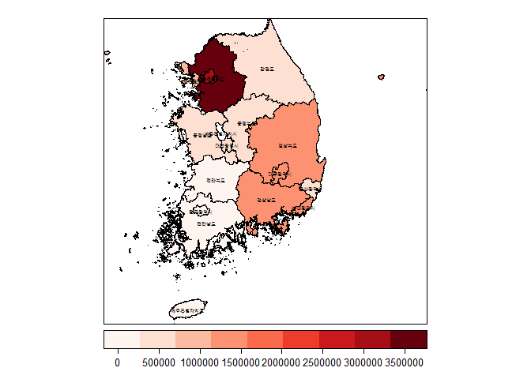
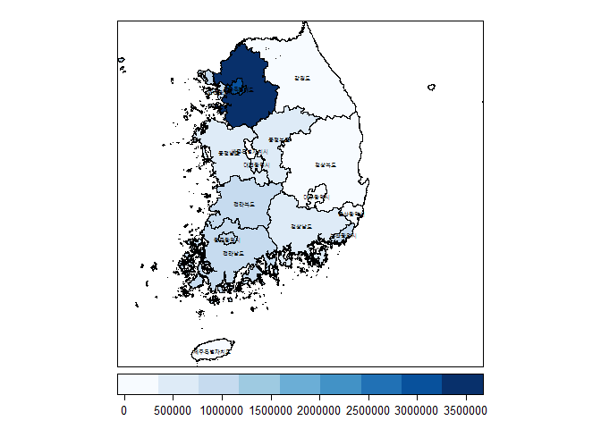
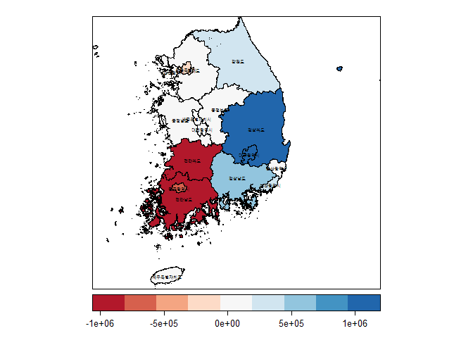
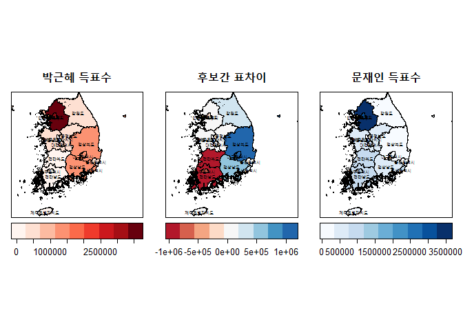

# 데이터 과학자가 바라본 20대 총선

## 제 18 대 대통령선거 시각화

제 18 대 대통령선거는 보수와 진보가 하나로 뭉쳐 일대일 대결을 펼쳤다.
하지만, 대부분이 사람들은 수도권에 모여 투표를 했지만, 이를 지리정보를 통해 표현할 경우 오히려 
왜곡된 정보가 언론에 전달되고 있다고 주장하는 분도 있고, 그들의 주장을 들어보면 일리도 있다.

### 환경설정

`shapefile`을 갖고 지리정보 시각화하는 팩키지를 불러온다.

~~~{.r}
# 0. 환경설정 -------------------------------------------------------------

library(rgdal)
library(ggplot2)
library(rgdal)
library(rgeos)
library(ggmap)
library(maps)
library(maptools)
library(RColorBrewer)
library(scales)
library(tidyverse)
library(readxl)
library(gridExtra)
~~~

### 데이터 가져오기

엑셀로 된 제18대 대선 투표구별 개표자료를 불러오고, `shapefile`로 된 시도별 지도를 불러와서
박근혜 후보와 문재인 후보 득표수 및 득표차에 대한 데이터를 준비한다.

~~~{.r}
# 1. 데이터 가져오기 -----------------------------------------------------------------
# 1.1. 지도데이터 가져오기 -------------------------------------------------------------
kor_sp <- rgdal::readOGR(dsn=file.path("data/shapefile_sido/", "TL_SCCO_CTPRVN.shp"), verbose=TRUE)
~~~

~~~{.output}
OGR data source with driver: ESRI Shapefile 
Source: "data/shapefile_sido//TL_SCCO_CTPRVN.shp", layer: "TL_SCCO_CTPRVN"
with 17 features
It has 3 fields

~~~

~~~{.r}
kor_sp$area <- gArea(kor_sp, byid=TRUE) / (1e6)

## 1.2. 2012년 대선 득표율 ---------------------------------------
vote_df <- read_excel("data/제18대 대선 투표구별 개표자료.xls", skip=3)
# http://stackoverflow.com/questions/28549045/dplyr-select-error-found-duplicated-column-name
valid_column_names <- make.names(names=names(vote_df), unique=TRUE, allow_ = TRUE)
names(vote_df) <- valid_column_names

names(vote_df) <- c("시도명", "구시군명", "읍면동명", "투표구명", "선거인수", "투표수", 
                    "박근혜", "문재인", "X.1", "X.2", "X.3", "X.4", "X.5", "무효.투표수", "기권수")

votes_df <- vote_df %>% 
  # dplyr::filter(`구시군명` =="합계" & `시도명` !="전국" & `시도명` !="세종특별자치시") %>%
  dplyr::filter(`구시군명` =="합계" & `시도명` !="전국" & `시도명` !="세종특별자치시") %>%
  dplyr::select(`시도명`, `선거인수`, `박근혜`, `문재인`) %>% 
  mutate_each(funs(as.numeric), matches("^[박|문|선]")) %>% 
  mutate(`표차`=`박근혜`-`문재인`)

## 1.3. 데이터 병합 ---------------------------------------
mapping_code <- read_excel("data/시도코드.xlsx")

votes_df <- full_join(votes_df, mapping_code, by=c("시도명"="CTP_KOR_NM"))
votes_df <- votes_df %>% mutate(CTPRVN_CD = factor(CTPRVN_CD)) %>% 
  mutate(`시도명` = factor(`시도명`))
glimpse(votes_df)
~~~

~~~{.output}
Observations: 17
Variables: 6
$ 시도명    <fctr> 서울특별시, 부산광역시, 대구광역시, 인천광역시, 광주광역시, 대전광역시, 울산광역시, 경기도, ...
$ 선거인수  <dbl> 8393847, 2911700, 1990746, 2241366, 1117781, 1182321, 88...
$ 박근혜    <dbl> 3024572, 1324159, 1267789, 852600, 69574, 450576, 41397...
$ 문재인    <dbl> 3227639, 882511, 309034, 794213, 823737, 448310, 275451...
$ 표차      <dbl> -203067, 441648, 958755, 58387, -754163, 2266, 138526,...
$ CTPRVN_CD <fctr> 11, 26, 27, 28, 29, 30, 31, 41, 42, 43, 44, 45, 46,...

~~~

~~~{.r}
votes_sp <- merge(kor_sp, votes_df)
~~~

### 득표정보 시각화

박근혜 대통령을 상징하는 색상을 붉은 계열로, 문재인 후보를 상징하는 색상을 푸른색 계열로 준비하고 
`spplot` 함수를 활용하여 시각화한다.

~~~{.r}
# 2. 시각화 -------------------------------------------------------------------------
## 2.1. Original --------------------------------------------------------------------
park.palette <- brewer.pal(n = 9, name = "Reds")
moon.palette <- brewer.pal(n = 9, name = "Blues")
diff.palette <- brewer.pal(n = 9, name = "RdBu")

sp_label <- function(x, label) {list("sp.text", coordinates(x), label,cex=0.5)}

### 2.1.1. 박근혜 

spplot(votes_sp, zcol="박근혜", col.regions = park.palette, 
       cuts = length(park.palette)-1,
       sp.layout=sp_label(votes_sp, votes_sp$CTP_KOR_NM), 
       colorkey = list(space = "bottom", height = 1))
~~~

~~~{.r}
### 2.1.2. 문재인
spplot(votes_sp, zcol="문재인", col.regions = moon.palette, 
       cuts = length(moon.palette)-1,
       sp.layout=sp_label(votes_sp, votes_sp$CTP_KOR_NM), 
       colorkey = list(space = "bottom", height = 1))
~~~

~~~{.r}
### 2.1.3. 박근혜 - 문재인 표차
spplot(votes_sp, zcol="표차", col.regions = diff.palette, 
       cuts = length(diff.palette)-1,
       sp.layout=sp_label(votes_sp, votes_sp$CTP_KOR_NM), 
       colorkey = list(space = "bottom", height = 1))
~~~

~~~{.r}
### 2.1.4. 한번에 비교

grid.arrange(
  spplot(votes_sp, zcol="박근혜", col.regions = park.palette, 
         cuts = length(park.palette)-1,
         sp.layout=sp_label(votes_sp, votes_sp$CTP_KOR_NM), main="박근혜 득표수", 
         colorkey = list(space = "bottom", height = 1)),
  
  spplot(votes_sp, zcol="표차", col.regions = diff.palette, 
         cuts = length(diff.palette)-1,
         sp.layout=sp_label(votes_sp, votes_sp$CTP_KOR_NM), main="후보간 표차이", 
         colorkey = list(space = "bottom", height = 1)),
  
  spplot(votes_sp, zcol="문재인", col.regions = moon.palette, 
         cuts = length(moon.palette)-1,
         sp.layout=sp_label(votes_sp, votes_sp$CTP_KOR_NM), main="문재인 득표수", 
         colorkey = list(space = "bottom", height = 1)), nrow=1
)
~~~

### 시각화 원본 데이터

~~~{.r}
DT::datatable(votes_sp@data %>% dplyr::select(CTPRVN_CD, CTP_KOR_NM, area, 
                                                선거인수, 박근혜, 문재인, 표차)) %>% 
  DT::formatCurrency(c(3,4,5,6,7), currency="", interval = 3, mark=',', digits=0)
~~~

<!--html_preserve-->

<!--/html_preserve-->
