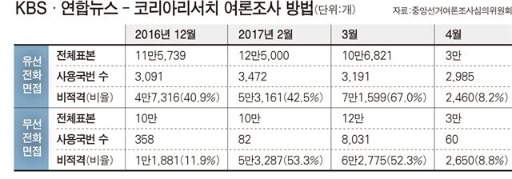

```{r setOptions, message=FALSE, include=FALSE}
source("tools/chunk-options.R")
knitr::opts_chunk$set(echo = TRUE, warning=FALSE, message=FALSE)
```

<style>
div.blue { background-color:#e6f0ff; border-radius: 5px; padding: 10px;}
</style>


# 기계와 선동 [^it-column] {#machine-propaganda}

[^it-column]: [IT 칼럼, 이성규 메디아티 미디어테크랩장(2018-03-13), 알고리즘에 편승해 활개치는 정치적 선동](http://weekly.khan.co.kr/khnm.html?mode=view&code=114&artid=201803051741241&pt=nv)

선동의 주체는 바뀌지 않았지만, 선동의 확산은 기계, 즉 컴퓨터 몫으로 넘어갔고 이를 컴퓨팅 선동(Computational Propaganda)라고 부른다.

# 여론조사 [^kbs-president] [^wolyo-survey] {#kbs-president}

[^kbs-president]: [팩트파인더, 이동현(2017-04-12), “안철수 첫 역전” KBS 여론조사 샘플링 왜곡?](http://www.hankookilbo.com/v/79db96638c074da0a2aba35216affb87)

[^wolyo-survey]: [김혜선 월요신문(2017-04-19), 대선여론조사 자료 축소, 코리아리서치 과태료 1500만원](http://www.wolyo.co.kr/news/articleView.html?idxno=43695)

촛불혁명으로 뜨거웠던 2017년 대통령선거 민주당, 국민의당, 자유한국당, 바른정당, 정의당 5명의 대선주자는 벚꽃 대선을 향해 힘차게 나가고 있었다.
2017년 4월 KBS 연합뉴스 - 코리아리서치 여론조사 결과는 안철수 국민의당 대선후보가 문재인 더불어민주당 대선후보를 처음으로 앞섰다고 발표를 했다.
하지만, 표본 추출 과정을 의도적(?)으로 기술적(?)으로 혹은 다른 이유로 인해 왜곡이 있었는지 조사를 했고 결과 코리아리서치에 과태로 1500만원을 부과하고 마무리 되었다.

김재광 카이스트 교수는 안철수 후보의 대약진을 보여주는 여론조사 결과가 이상하다”, “회사 자체 DB를 사용한다던지 왜곡 작업이 들어간 것으로 보인다”며 의혹을 제기했고,
선거관리 위원회는 전화번호 추출 수를 축소해 등록했고 비적격사례와 접촉실패사례수도 사실과 다르게 등록됐다. 국번 추출에서도 문제가 있었다고 확인했다.

<div class = "blue">

코리아리서치 측은 조사 대상 규모를 유·무선 각 3만개를 추출했다고 여심위에 기재했지만 실제로 추출한 수는 
유선 7만6500개, 무선5만여개였다. 비적격사례 역시 기재된 내용은 유선 2,460 무선 2,650개였지만 
실제로는 유선 2만5455개, 무선 1만4983개였다. 
접촉실패사례수도 실제로는 유선 1만1836건, 무선 2만4122건이었지만 사실과 다르게 등록됐다.

</div>



