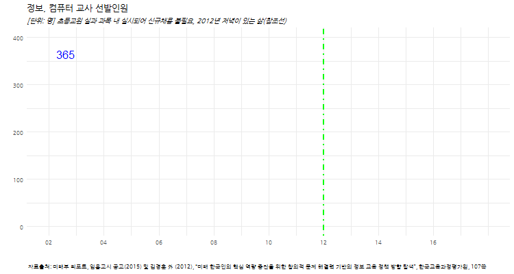

```{r setOptions, message=FALSE, include=FALSE}
source("tools/chunk-options.R")
library(tidyverse)
library(lubridate)
library(ggthemes)
library(animation)
library(extrafont)
loadfonts()
```

## 1. 컴퓨팅 사고력 교육 [^ct-teachers-2012] [^ct-moe-2016]


[^ct-teachers-2012]: [김경훈 外 (2012), “미래 한국인의 핵심 역량 증진을 위한 창의적 문제 해결력 기반의 정보 교육 정책 방향 탐색”, 한국교육과정평가원, 107쪽](https://www.nkis.re.kr:4445/researchReport_view.do?otpId=KICE00019118)

[^ct-moe-2016]: [미래부·교육부 (2016.12.), 소프트웨어교육 활성화 기본 계획](http://www.moe.go.kr/boardCnts/view.do?boardID=294&boardSeq=65033&lev=0&searchType=null&statusYN=W&page=4&s=moe&m=0503&opType=N)

정보, 컴퓨터 교사 선발인원은 2002년 이후 급격히 감소하기 시작하여, 2014년 09월 발표된 "문·이과 통합형 교육과정 개편안"에 초중등 SW교육 강화 포함된 이후 
초중등생을 대상으로 컴퓨팅 사고력을 교육할 수 있는 교원을 충원하기 시작했다.

미래부와 교육부가 공동으로 준비하여 발표한 "SW교육 활성화 기본 계획"에 따라 SW정규 교육 기반을 구축하여 체계적인 SW교육 환경을 준비하고 있다.

- 초등 교원: 초등학교는 담임교사를 통해 소프트웨어 교육이 실과 과목 내에서 실시되어 별도의 신규채용이 불필요. 
단, 초등실과 과목에 소프트웨어 관련 내용을 포함, 초등컴퓨터 과목은 SW기초소양, 프로그래밍, 알고리즘 관련 단원을 포함하여 운영
- 중등 교원: 시·도 교육청과 협력하여 ‘정보·컴퓨터’ 교사 수요를 파악하고 신규채용, 복수전공연수 등을 통해 연차적으로 확보.

| 연도 |  선발인원 |
|------|-----------|
| 2002 |  365      |
| 2003 |  311      |
| 2004 |  113      |
| 2005 |  43       |
| 2006 |  60       |
| 2007 |  24       |
| 2008 |  13       |
| 2009 |  14       |
| 2010 |  4        |
| 2011 |  3        |
| 2012 |  0        |
| 2013 |  0        |
| 2014 |  10       |
| 2015 |  0        |
| 2016 |  31       |

## 2. 정보, 컴퓨터 교사 선발인원 시각화



### 2.1. 정적 그래프

``` {r ct-teachers, eval=FALSE}
# 0. 환경설정 --------------------------------------------------------------------------
library(tidyverse)
library(lubridate)
library(ggthemes)
library(animation)
library(extrafont)
loadfonts()

# 1. 데이터 가져오기 --------------------------------------------------------------------------
df <- structure(list(year = c(2002,2003,2004,2005,2006,2007,2008,2009,2010,2011,2012,2013,2014,2015,2016), 
                     teacher = c(365,311,113,43,60,24,13,14,4,3,0,0,10,0,31)), .Names = c("year", "teacher"), row.names = c(NA, -15L), class = "data.frame")

df$year <- as.Date(paste0(df$year,"-01-01", format = "%Y-%m-%d"))

# 2.1. 정보 컴퓨터 교사 정적 시각화 ------------------------------------------------------------------

ggplot(data=df, aes(x=year, y=teacher, group=1))+
  geom_line(size=1.1) +
  theme_minimal() + 
  geom_vline(xintercept=as.numeric(ymd("2012-01-01")), linetype=4, color="green", size=0.9) +    
  theme(legend.position="none", plot.caption=element_text(hjust=0,size=8),plot.subtitle=element_text(face="italic"),
        axis.text=element_text(size=7.5))+
  labs(x="",y="",title="정보, 컴퓨터 교사 선발인원",
       caption="\n 자료출처: 미래부 리포트, 임용고시 공고(2015) 및 김경훈 外 (2012), “미래 한국인의 핵심 역량 증진을 위한 창의적 문제 해결력 기반의 정보 교육 정책 방향 탐색”, 한국교육과정평가원, 107쪽",
       subtitle="[단위: 명] 초등교원 실과 과목 내 실시되어 신규채용 불필요, 2012년 저녁이 있는 삶(참조선)") +
  theme(text=element_text(family="NanumGothic"))
```

### 2.2. 애니메이션 그래프

``` {r ct-teachers-ani, eval=FALSE}
# 2.2. 정보 컴퓨터 교사 시각화----------------------------------------------------
dlist <- unique(df$year)

ct_plot <- function(i){
  ggplot(data=df %>% dplyr::filter(year<=dlist[i]), aes(x=year, y=teacher, group=1, label=teacher))+
    geom_line(aes(group=1), size=1.1) +
    scale_y_continuous(limits = c(0, 400))+
    scale_x_date(breaks=seq(dlist[1], tail(dlist,1) + years(1), "2 year"),
                 date_labels="%y",limits=c(dlist[1], tail(dlist,1)+years(2)))+
    geom_text(data=df %>% dplyr::filter(year==dlist[i]), 
               aes(x=year, y=teacher, group=1), size=5.5, color="blue", hjust=0, nudge_x=100) +
    geom_vline(xintercept=as.numeric(ymd("2012-01-01")), linetype=4, color="green", size=0.9) +    
    theme_minimal() + 
    theme(legend.position="none", plot.caption=element_text(hjust=0,size=8),plot.subtitle=element_text(face="italic"),
          axis.text=element_text(size=7.5))+
    labs(x="",y="",title="정보, 컴퓨터 교사 선발인원",
         caption="\n 자료출처: 미래부 리포트, 임용고시 공고(2015) 및 김경훈 外 (2012), “미래 한국인의 핵심 역량 증진을 위한 창의적 문제 해결력 기반의 정보 교육 정책 방향 탐색”, 한국교육과정평가원, 107쪽",
         subtitle="[단위: 명] 초등교원 실과 과목 내 실시되어 신규채용 불필요, 2012년 저녁이 있는 삶(참조선)") +
    theme(text=element_text(family="NanumGothic"))
}

oopt <- ani.options(interval = 0.5)
saveGIF({for (i in 1:(length(dlist))) {
  g <- ct_plot(i)
  
  print(g)
  print(i)
  ani.pause()
}
  
  for (i2 in 1:20) {
    print(g)
    ani.pause()
  }
}, movie.name="ct_teachers_trend.gif", ani.width = 750, ani.height = 400)
```


