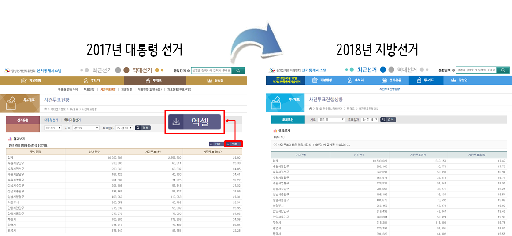

```{r setOptions, message=FALSE, include=FALSE}
source("tools/chunk-options.R")
knitr::opts_chunk$set(echo = TRUE, warning=FALSE, message=FALSE)

library(tidyverse)
library(readxl)
library(lubridate)
library(extrafont)
loadfonts()
library(rvest)
library(glue)
library(RSelenium)

gg_list <- read_rds("data/gg_list.rds")

```

# 6·13 지방선거 사전투표 [^pre-voting-rate-news] {#사전투표율}

[^pre-voting-rate-news]: [조선일보, 6·13지방선거 사전투표 종료, 최종 투표율 20.14%](http://news.chosun.com/site/data/html_dir/2018/06/09/2018060901255.html)

6·13 지방선거가 몇일 남지 않은 상황에서 수도권에서 여배우스캔들, 이부망천 등 신조어가 
생겨나면서 가열이 되고 있고, 2014년 6·4 지방선거 사전투표율(11.5%)보다 크게 높은 최종 투표율 20.14%으로 마감되었다.



# 엑셀 파이터의 종말 {#사전투표율-엑셀}

데이터 분석가나 데이터과학자에게도 선관위에서도 6·13 지방선거 준비한 내용은 충격적이다.

- [제7회 전국동시지방선거 > 투·개표 > 사전투표진행상황](http://info.nec.go.kr/main/showDocument.xhtml?electionId=0020180613&topMenuId=VC&secondMenuId=VCAP01)
- [역대선거정보> 투/개표 > 사전투표현황](http://info.nec.go.kr/main/showDocument.xhtml?electionId=0000000000&topMenuId=VC&secondMenuId=VCAP01)

작년까지 데이터분석을 위해서 제공되던 엑셀 다운로드 기능이 없어져 버렸다.
시간대별로 사전투표현황 데이터를 얻기 위해서는 수작업으로 일일이 긁어내서 저장하는 과정을 거치는 수밖에 없다.
즉, 엑셀 파이터는 데이터 분석을 시작하기도 전에 엄청난 핸디캡을 가지고 전쟁에 임해야 되는 한계상황으로 내몰리고 있다.


# 데이터 {#사전투표율-데이터}

## 제19대 대통령선거 {#사전투표율-데이터-대선}

제19대 대통령선거(2017) 1일차, 2일차 데이터를 엑셀로 다운로드 받아 엑셀 쉬트에 정리하고 
데이터를 전처리해서 시각화 및 후속작업이 가능한 형태로 가공한다.

``` {r 사전투표율-대선-데이터}
# 0. 팩키지 -----
library(tidyverse)
library(readxl)
library(lubridate)
library(extrafont)
loadfonts()
library(rvest)
library(glue)
library(RSelenium)
library(plotly)
library(crosstalk)
library(htmltools)

# 1. 데이터 -----
## 1.1. 제19대 대통령선거(2017)
### 1일차
presid_01_dat <- read_excel("data/사전투표현황_제19대선.xlsx", sheet="제19대선_1일차", skip =4)

presid_01_df <- presid_01_dat %>% 
  filter(!is.na(X__2),
         X__1 != "합계") %>% 
  rename(시군구 = X__1,
             선거인수 = X__2) %>% 
  select(-X__3) %>% 
  gather(시간, 투표수, -시군구, -선거인수) %>% 
  mutate(시군구명 = case_when(str_detect(시군구, "수원") ~ "수원시",
                              str_detect(시군구, "성남") ~ "성남시",
                              str_detect(시군구, "안양") ~ "안양시",
                              str_detect(시군구, "안산") ~ "안산시",
                              str_detect(시군구, "고양") ~ "고양시",
                              str_detect(시군구, "용인") ~ "용인시",
                              TRUE ~ 시군구) )  %>% 
  mutate(투표일자 = "1일차")

### 2일차  
presid_02_dat <- read_excel("data/사전투표현황_제19대선.xlsx", sheet="제19대선_2일차", skip =4)

presid_02_df <- presid_02_dat %>% 
  filter(!is.na(X__2),
         X__1 != "합계") %>% 
  rename(시군구 = X__1,
            선거인수 = X__2) %>% 
  select(-X__3) %>% 
  gather(시간, 투표수, -시군구, -선거인수) %>% 
  mutate(시군구명 = case_when(str_detect(시군구, "수원") ~ "수원시",
                          str_detect(시군구, "성남") ~ "성남시",
                          str_detect(시군구, "안양") ~ "안양시",
                          str_detect(시군구, "안산") ~ "안산시",
                          str_detect(시군구, "고양") ~ "고양시",
                          str_detect(시군구, "용인") ~ "용인시",
                          TRUE ~ 시군구) )  %>% 
  mutate(투표일자 = "2일차")

### 3 병합
presid_df <- bind_rows(presid_01_df, presid_02_df) %>% 
  mutate(선거인수 = str_replace_all(선거인수, ",", "") %>% as.integer,
             투표수 =  str_replace_all(투표수, ",", "") %>% as.integer)

## 1.2. 데이터 정제
### 시군별: 유권자수
presid_voter_df <- presid_df %>% 
  group_by(시군구명) %>% 
  summarise(선거인수 = sum(선거인수)/24) %>% 
  ungroup()

### 시간대별 : 사전투표수
presid_over_time_df <- presid_df %>% 
  group_by(시군구명, 투표일자, 시간) %>% 
  summarise(투표수 = sum(투표수)) %>% 
  ungroup()

### 유권자수와 시간대별 데이터 병합

presid_sigun_day_one_df <- presid_df %>% 
  filter(투표일자 == "1일차") %>% 
  group_by(시군구명) %>% 
  summarise(투표1일차 = as.integer(max(투표수)))

### 시각화용 데이터 

presid_viz_df <- left_join(presid_over_time_df, presid_voter_df) %>% 
  left_join(presid_sigun_day_one_df) %>% 
  mutate(사전투표율 = round(투표수/선거인수*100, 1)) %>% 
  mutate(시간 = str_replace(시간, "시", "") %>% as.integer) %>% 
  mutate(투표시간 = case_when(투표일자 == "1일차" ~ ymd_hms(paste0("2018-05-04 ", 시간, ":00:00")),
                              투표일자 == "2일차" ~ ymd_hms(paste0("2018-05-05 ", 시간, ":00:00")))) %>% 
  mutate(투표누적 = case_when(투표일자 == "2일차" ~ 투표수 + 투표1일차,
                             TRUE ~ 투표수))
```

## 대선 시각화 {#사전투표율-데이터-대선-시각화}

경기도 시군이 31개 $6 \times 5 = 30$ 형태로 만들어가 가능하면 시각화 공간을 많이 마련하기 위해서
가평균을 제외하고 대선 사전투표율을 시각화한다.

``` {r 사전투표율-대선-시각화}
# 2. 시각화 -----
## 1일차와 2일차 투표율 비교
presid_viz_df %>% 
  filter(시군구명 != "가평군")  %>% 
  ggplot(aes(x=시간, y=사전투표율, group=투표일자, color=투표일자)) +
    geom_line() +
    geom_point() +
    facet_wrap(~시군구명) +
    theme_minimal(base_family = "NanumGothic") +
    labs(x="", y="사전투표율",
         title="경기도 시군별 사전 투표율",
         subtitle = "가평군(유권자수 경기도 최소시군)은 가독성을 위해서 제외") +
    theme(legend.position = "top") +
    scale_color_manual(values=c("red", "blue"))
```

## 제7회 지방선거 {#사전투표율-데이터-지선}

제7회 지방선거 1일차, 2일차 데이터를 엑셀로 다운로드 받는 기능이 없어졌다.
따라서, 코딩을 통해서 데이터를 긁어와야 작업이 가능하다.

`RSelelium` 팩키지 기능을 활용하여 일자별, 시간별로 루프를 돌려 데이터프레임 각각을 
리스트에 저장시킨다.

``` {r 사전투표율-지선-데이터, eval=FALSE}
# 1. 데이터 -----
## 1.1. 제7회 지방선거 
### 사전투표일: 1일차, 2일차
date_code_df <- tribble(
  ~date_code, ~date_value,
  1, "1일차",
  2, "2일차"
)

### 사전투표일: 1일차, 2일차
hour_code_df <- tribble(
  ~hour_code, ~hour_value,
  "07", "7시",
  "08", "8시",
  "09", "9시",
  "10", "10시",
  "11", "11시",
  "12", "12시",
  "13", "13시",
  "14", "14시",
  "15", "15시",
  "16", "16시",
  "17", "17시",
  "18", "18시"
)

## 1.2. RSelelium 동작
rem_driver <- rsDriver(browser="firefox")
remdrv_client <- rem_driver[["client"]]

## 1.3. 데이터 크롤링 
## 1.3. 데이터 크롤링 
gg_list <- vector("list", length=0)

for(i in 1:nrow(date_code_df)) {
  tmp_list <- list()
  
  for(j in 1:nrow(hour_code_df)) {
    ### 선관위 URL에서 데이터 가져오기
    
    gg_url <- glue("http://info.nec.go.kr/main/showDocument.xhtml?electionId=0020180613&requestURI=%2FWEB-INF%2Fjsp%2Felectioninfo%2F0020180613%2Fvc%2Fvcap01.jsp&topMenuId=VC&secondMenuId=VCAP01&menuId=VCAP01&statementId=VCAP01_%232&cityCode=4100&dateCode=",
                   date_code_df$date_code[i], "&timeCode=", hour_code_df$hour_code[j], "&x=44&y=8")
    
    remdrv_client$navigate(gg_url)
    
    election_web_eleml <- remdrv_client$findElement("xpath", '//*[@id="spanSubmit"]/input')
    election_web_eleml$clickElement()
    
    local_pg <- remdrv_client$getPageSource()[[1]] %>%
      read_html()
    
    Sys.setlocale("LC_ALL", "C")
    
    ### 선관위 데이터 정제작업
    local_df <- local_pg %>%
      html_nodes(xpath = '//*[@id="table01"]') %>%
      html_table(fill=TRUE) %>%
      .[[1]] %>%
      as_tibble()
    
    Sys.setlocale("LC_ALL", "Korean")
    
    local_df <- local_df %>%
      filter(!str_detect(구시군명, "합계")) %>%
      mutate(구시군 = case_when(str_detect(구시군명, "수원") ~ "수원시",
                             str_detect(구시군명, "성남") ~ "성남시",
                             str_detect(구시군명, "안양") ~ "안양시",
                             str_detect(구시군명, "안산") ~ "안산시",
                             str_detect(구시군명, "고양") ~ "고양시",
                             str_detect(구시군명, "용인") ~ "용인시",
                             TRUE ~ 구시군명) )  %>%
      mutate(선거인수 = str_replace_all(선거인수, ",", "") %>% as.integer,
                 사전투표자수 =  str_replace_all(사전투표자수, ",", "") %>% as.integer) %>%
      mutate(투표일자 = date_code_df$date_value[i],
                 투표시간 = hour_code_df$hour_code[j])
    
    tmp_list[[j]] <- local_df
    
  }  
  
  list_name <- date_code_df$date_value[i]
  gg_list[[list_name]] <- tmp_list
  
}

```


``` {r 사전투표율-지선-데이터-보기}
listviewer::jsonedit(gg_list)
```

## 제7회 지방선거 데이터 정제 {#사전투표율-데이터-지선-정제}

리스트 데이터를 함수형프로그래밍 핵심 팩키지(`purrr`)를 활용하여 데이터프레임으로 바꾸고 
후속 데이터 분석이 가능한 형태로 유권자수와 일자별 시간별 사전투표수를 추출한다.

``` {r 사전투표율-지선-데이터-정제, eval=TRUE}
gg_df <- map_df(gg_list, bind_rows)

## 1.2. 데이터 정제
### 시군별: 유권자수
local_voter_df <- gg_df %>% 
  group_by(구시군) %>% 
  summarise(선거인수 = sum(선거인수)/24) %>% 
  ungroup()

### 시간대별 : 사전투표수
local_over_time_df <- gg_df %>% 
  group_by(구시군, 투표일자, 투표시간) %>% 
  summarise(투표수 = sum(사전투표자수)) %>% 
  ungroup()

### 유권자수와 시간대별 데이터 병합
local_sigun_day_one_df <- gg_df %>% 
  filter(투표일자 == "1일차") %>% 
  group_by(구시군) %>% 
  summarise(투표1일차 = as.integer(max(사전투표자수)))

### 시각화용 데이터 

local_viz_df <- left_join(local_over_time_df, local_voter_df) %>% 
  left_join(local_sigun_day_one_df) %>% 
  mutate(사전투표율 = round(투표수/선거인수*100, 1)) %>% 
  mutate(시간 = str_replace(투표시간, "시", "") %>% as.integer) %>% 
  mutate(투표시간 = case_when(투표일자 == "1일차" ~ ymd_hms(paste0("2018-05-04 ", 시간, ":00:00")),
                              투표일자 == "2일차" ~ ymd_hms(paste0("2018-05-05 ", 시간, ":00:00")))) %>% 
  mutate(투표누적 = case_when(투표일자 == "2일차" ~ 투표수 + 투표1일차,
                              TRUE ~ 투표수))
```

정제한 데이터를 `ggplot`을 활용하여 가평군을 제외한 경기도 시군별 시간대별 사전투표율을 시각화한다.

``` {r 사전투표율-지선-데이터-시각화, eval=TRUE}
# 2. 시각화 -----
## 1일차와 2일차 투표율 비교
local_viz_df %>% 
  filter(구시군 != "가평군")  %>% 
  ggplot(aes(x=시간, y=사전투표율, group=투표일자, color=투표일자)) +
  geom_line() +
  geom_point() +
  facet_wrap(~구시군) +
  theme_minimal(base_family = "NanumGothic") +
  labs(x="", y="사전투표율",
       title="경기도 시군별 사전 투표율",
       subtitle = "가평군(유권자수 경기도 최소시군)은 가독성을 위해서 제외") +
  theme(legend.position = "top") +
  scale_color_manual(values=c("red", "blue"))
```


# 시각화 {#사전투표율-데이터-시각화-전체}

제19대 대통령선거와 제7회 지방선거 데이터를 경기도 시군별로 사전투표율을 시각화하는 것은 데이터 검증목적이 강했다.
대선과 지선 데이터를 하나로 묶는 데이터 정제작업과 함께 이를 인터랙티브 시각화한다.


## 데이터 병합 {#사전투표율-데이터-시각화-전체-병합}

`plotly`, `crosstalk`, `htmltools` 팩키지를 설치하고 나서 
지선과 대선 데이터를 결합하기 위해서 변수명 일치 작업과 함께 라벨을 별도로 붙어 구분하고,
유권자가 가장 많은 순으로 경기도 시군순으로 정리한다.


``` {r 사전투표율-지선-데이터-시각화-전체-병합, eval=TRUE}

# 1. 데이터 -----
local_viz_df <- local_viz_df %>% 
  select(구시군, 투표일자, 투표시간, 선거인수, 투표수, 투표누적) %>% 
  mutate(선거="지선7")

presid_viz_df <- presid_viz_df %>% 
  select(구시군 = 시군구명, 투표일자, 투표시간, 선거인수, 투표수, 투표누적) %>% 
  mutate(선거="대선19")

## 1.2. 데이터 병합

pre_df <- bind_rows(local_viz_df, presid_viz_df) %>% 
  ungroup()

pre_df <- pre_df %>% 
  mutate(사전투표율 = 투표누적/선거인수)  

# 2. 데이터 시각화 ------
## 2.1. 경기도 유권자 -----
pre_df %>% 
  group_by(구시군) %>% 
  summarise(선거인수 = first(선거인수)) %>% 
  arrange(-선거인수) %>% 
  mutate(선거인비율 = 선거인수/sum(선거인수),
              선거인누적 = cumsum(선거인비율)) %>% 
  DT::datatable() %>% 
  DT::formatRound("선거인수", digits=0) %>% 
  DT::formatPercentage(c("선거인비율", "선거인누적"), digits =1)
```

## 정적 시각화 {#사전투표율-데이터-시각화-전체-정적시각화}

2일에 걸쳐 사전투표가 시간단위로 공개되기 때문에 이를 시각화하면 
18시 이후 다음날 아침까지 데이터가 비는 문제가 발생된다.
이를 해소하기 위해서 `facet_wrap()`기능을 활용하는 방식과
데이터 자체를 바꾸는 방식이 있다.

``` {r 사전투표율-지선-데이터-시각화-전체-정적시각화, eval=TRUE}
## 2.2. 경기도 유권자 시간대별 시각화 -----
### 시간정보 살림

first_g <- pre_df %>% 
  filter(구시군 == "가평군")  %>% 
  ggplot(aes(x=투표시간, y=사전투표율, group=선거, color=선거)) +
  geom_line() +
  geom_point(size=2) +
  facet_wrap(~구시군+투표일자, scales="free_x") +
  theme_minimal(base_family = "NanumGothic") +
  labs(x="", y="사전투표율",
       title="경기도 시군별 사전 투표율",
       subtitle = "가평군(유권자수 경기도 최소시군)은 가독성을 위해서 제외") +
  theme(legend.position = "top") +
  scale_color_manual(values=c("darkgray", "black")) +
  scale_y_continuous(labels = scales::percent)

### 시간정보 죽임
second_g <- pre_df %>% 
  mutate(투표시간 = format(투표시간, "%m-%d:%H")) %>% 
  filter(구시군 == "가평군")  %>% 
  ggplot(aes(x=투표시간, y=사전투표율, group=선거, color=선거)) +
  geom_line() +
  geom_point(size=2) +
  theme_minimal(base_family = "NanumGothic") +
  labs(x="", y="사전투표율",
       title="경기도 시군별 사전 투표율",
       subtitle = "가평군(유권자수 경기도 최소시군)은 가독성을 위해서 제외") +
    theme(legend.position = "top",
        axis.text.x = element_text(angle = 90, hjust = 1)) +
  scale_color_manual(values=c("darkgray", "black")) +
  scale_y_continuous(labels = scales::percent)

gridExtra::grid.arrange(first_g, second_g, nrow=1)
```

## 동적 시각화 {#사전투표율-데이터-시각화-전체-동적시각화}

`crosstalk` 팩키지를 활용하여 시군별로 사전투표율을 비교할 수 있도록 그래프를 인터랙티브하게 코딩한다.


``` {r 사전투표율-지선-데이터-시각화-전체-동적, eval=TRUE}
## 2.3. 동적 시계열 추세 -----
### 2.3.1. 공유 데이터
pre_df <- pre_df %>% 
  mutate(투표시간 = format(투표시간, "%m-%d:%H"))

pre_sd <- SharedData$new(pre_df)

### 2.3.2. 제어
filter_checkbox("구시군", "구시군명", pre_sd, ~구시군, inline = TRUE)

### 2.3.3. 시각화
gg_ts_g <- pre_sd %>% 
  ggplot(aes(x=투표시간, y=사전투표율, group=구시군, color=선거, 
             text = paste('구시군 :', 구시군, "\n",
                          '선거:', 선거, "\n",
                          '투표시간:', 투표시간, "\n",
                          '사전투표율:', scales::percent(사전투표율)))) +
  geom_line() +
  geom_point(size=2) +
  theme_minimal(base_family = "NanumGothic") +
  labs(x="", y="사전투표율",
       title="경기도 시군별 사전 투표율",
       subtitle = "가평군(유권자수 경기도 최소시군)은 가독성을 위해서 제외") +
  theme(legend.position = "top",
        axis.text.x = element_text(angle = 90, hjust = 1)) +
  scale_color_manual(values=c("darkgray", "black")) +
  scale_y_continuous(labels = scales::percent)


gg_ts_gg <- ggplotly(gg_ts_g, tooltip = "text")

### 4.2.5. 인터랙티브 시각화
gg_ts_gg
```
