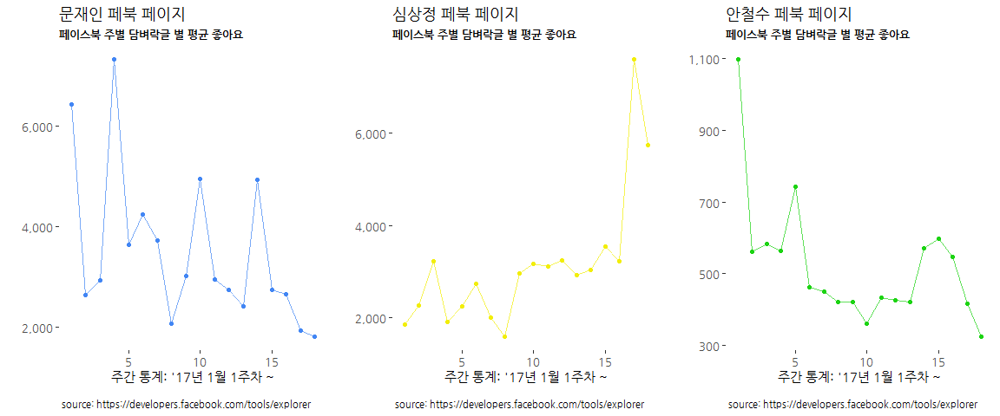

# 데이터 과학자와 함께 하는 제19대 대통령 선거

## 페이스북 페이지 성과 [^fb-ctr-wiki]

[^fb-ctr-wiki]: [위키백과: 클릭률](https://ko.wikipedia.org/wiki/%ED%81%B4%EB%A6%AD%EB%A5%A0)

페이스북 페이지를 운영하게 되면 페이스북 페이지가 잘 운영되고 있는지 파악할 수 있는 지표가 필요하다.
과거 클릭률(CTR, Click-Through-Rate)이 특정 웹사이트 온라인 광과 캠페인 성공 여부 혹은 이메일 캠페인 효율성을 측정하는 지표로 활용되었다.
페이스북에서도 글, 동영상, 사진 등이 올라가면 좋아요, 댓글, 공유 갯수를 중요지표로 활용이 가능하다.

### 환경설정

`Rfacebook`을 비롯한 필요한 팩키지를 불러온다.

~~~{.r}
# 1. 환경설정 ---------------------------------------------------------------
library(tidyverse)
library(tibble)
library(stringr)
library(lubridate)
library(ggthemes)
library(extrafont)
library(Rfacebook)
loadfonts()
~~~

### 페북 페이지 불러오기

페북 키를 발급받아 손학규, 안철수 공식 페북 페이지에서 데이터를 긁어온다.
시점은 손학규 후보가 만덕산에서 내려와 대선 행보를 시작한 시점을 기준으로 안철수 후보와 비교한다.

~~~{.r}
fb_keys <- "EAACEdEose0cBAE7ZBDCig7SiVrivqkynmSSjEueB6Jv3FlyTRuwwTk1wMVMi4rNGh4HYMgrEPJHupd1koHzQNxMG6w7vMkjxJ4w9B00PsD14QsBpE4JOGG40p5u8EQCDUtYb85HgZBXyLY8kXZCbArljo80lsj9extY6nQZBXEBn0qj2ouF77QaGQAZBpVCMZD"

# 2. 페북 페이지 데이터 긁어오기 --------------------------------------

ahn_pg  <- getPage("ahncs111",    n=1000, token=fb_keys, since='2016/10/01', until="2017/03/01")
~~~

~~~{.output}
25 posts 50 posts 75 posts 100 posts 125 posts 150 posts 175 posts 200 posts 225 posts 250 posts 275 posts 300 posts 325 posts 350 posts 375 posts 400 posts 411 posts 

~~~

~~~{.r}
ahn_pg <- ahn_pg %>% mutate(person = "안철수", fb_type="Page")
sohn_pg <- getPage("koreasohn",   n=1000, token=fb_keys, since='2016/10/01', until="2017/03/01")
~~~

~~~{.output}
25 posts 50 posts 75 posts 100 posts 125 posts 150 posts 175 posts 200 posts 219 posts 

~~~

~~~{.r}
sohn_pg <- sohn_pg %>% mutate(person = "손학규", fb_type="Page")

# 3. 데이터 전처리 및 정제 --------------------------------------

convert_fb_df <- function(fb_pg){
  df <- fb_pg %>% 
    mutate(fb_date = ymd(substr(created_time, 1,10))) %>%
    dplyr::select(fb_date, person, likes_count, comments_count, shares_count)
  return(df)
}

ahn_df <- convert_fb_df(ahn_pg)
sohn_df <- convert_fb_df(sohn_pg)

convert_month_ctr <- function(fb_df) {
  ctr_df <- fb_df %>% ungroup() %>% 
    mutate(fb_ym = stringr::str_sub(fb_date, 3,7)) %>%
    group_by(fb_ym) %>% 
    dplyr::summarise(person = first(person),
                     month_likes = sum(likes_count),
                     month_shares = sum(shares_count),
                     month_comments = sum(comments_count)) %>% 
    gather(type, activity, -fb_ym, -person)
  return(ctr_df)
}

ahn_ctr_df  <- convert_month_ctr(ahn_df)
sohn_ctr_df <- convert_month_ctr(sohn_df)

ctr_df <- bind_rows(ahn_ctr_df, sohn_ctr_df)
~~~

### 페북 페이지 성과 시각화

페북 페이지 성과를 시각화한다. 
페북 좋아요, 댓글, 공유 갯수를 월별 합계를 하고 이를 월별로 합산하여 추세를 살펴본다.

~~~{.r}
# 4. 시각화 -------------------------------------------------
# 4.1. 손학규 vs. 안철수 좋아요, 댓글, 공유
ggplot(data=ctr_df %>% mutate(fb_ym = ymd(paste0("19", fb_ym,"-01")))) +
  aes(x=fb_ym, y=activity, color=person) +
  geom_point(aes(colour=type), alpha=0.3) +
  geom_smooth(se=FALSE) +
  scale_y_continuous(labels = scales::comma) +
  scale_x_date(labels=scales::date_format("%y-%m")) +
  theme_tufte(base_family="NanumGothic") +
  theme(legend.position="top", 
        plot.caption=element_text(hjust=0,size=8),
        plot.subtitle=element_text(face="italic"),
        axis.text=element_text(size=7.5))+
  labs(x="",y="",title="손학규 vs. 안철수 페북 페이지 활동",
       caption="\n 데이터: 페이스북 페이지(https://www.facebook.com/wikitree.page/) ",
       subtitle="페이스북 활동건수 [like, share, comments]") +
  facet_wrap(~type)
~~~

~~~{.output}
`geom_smooth()` using method = 'loess'

~~~

~~~{.r}
# 4.2. 손학규 vs. 안철수 좋아요, 댓글, 공유
ggplot(data=ctr_df %>% mutate(fb_ym = ymd(paste0("19", fb_ym,"-01")))) +
  aes(x=fb_ym, y=activity, color=type) +
  geom_point(aes(colour=type), alpha=0.3) +
  geom_smooth(se=FALSE) +
  scale_y_continuous(labels = scales::comma) +
  # scale_x_datetime(labels=scales::date_format("%y-%m-%d")) +
  scale_x_date(labels=scales::date_format("%y-%m")) +
  theme_tufte(base_family="NanumGothic") +
  theme(legend.position="none", 
        plot.caption=element_text(hjust=0,size=9),
        plot.subtitle=element_text(face="italic"),
        axis.text=element_text(size=10.5),
        strip.text.x = element_text(size = 12, colour = "black", angle = 0))+
  labs(x="",y="",title="손학규 vs. 안철수 페북 페이지 활동",
       caption="\n 데이터: 페이스북 페이지(https://www.facebook.com/wikitree.page/) ",
       subtitle="페이스북 월별 활동건수 [like, share, comments]") +
  facet_wrap(~person)
~~~

~~~{.output}
`geom_smooth()` using method = 'loess'

~~~

