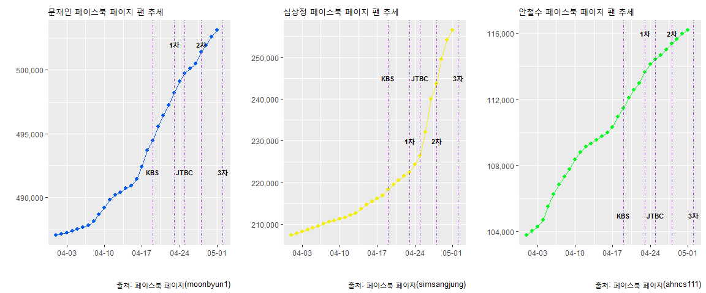

# 데이터 과학자와 함께 하는 제19대 대통령 선거

## 페이스북 페이지 팬수 추세

민주당 문재인 후보와 국민의당 안철수 후보가 양강 체계를 구축하고 치열한 각축전을 벌이고 있다.
심상정 후보는 페이스북을 통해 지지세를 넓혀가고 있고, 홍준표와 유승민 후보는 페북이 유의미한 숫자를 만들어 내고 있지는 않다. 페이스북 팬수 추세를 시각화 한다.

## TV 토론이 지지율에 미치는 효과

TV 토론이 지지율에 미치는 효과를 검증하기 위한 도구로 페이스북 페이지 팬수 증가분을 통계지표로 삼는다.

- **대선 후보 TV 토론 일정** 
    - ~~KBS 비법정 토론: 4월 19일~~
    - ~~1차 TV 토론 (정치): 4월 23일~~
    - ~~JTBC 비법정 토론 (양극화와 안보): 4월 25일~~
    - ~~2차 TV 토론 (경제): 4월 28일~~
    - ~~3차 TV 토론 (사회): 5월 2일~~

심상정 후보는 JTBC TV토론을 비롯한 5차례 TV토론 효과를 가장 많이 본 것으로 보이며 안철수 후보는 TV토론에서 초반에 열세를 보였지만, 후반에는 신속한 학습능력을 통해 만회를 한 것으로 보인다.

### 페이스북 페이지 팬수 비교 

~~~{.r}
# 0. 참고문헌 ---------------------------------------------------------------------
library(Rfacebook)
library(RCurl)
library(tidyverse)
library(lubridate)
library(ggplot2)
library(stringr)
library(DT)
library(gridExtra)
library(ggthemes)
library(extrafont)
loadfonts()
fb_keys <- "EAACEdEose0cBAFkMShc5ip4LjKRCZCblqzPPZAPXFOZCao5vCMEaNumbWsVug53JvL6UOxZBrfZC6haf4hfRfmCdGfySXEqsU8gpvbZAp7UunaRkgiW2TEZCM9Na2vZCdeznpdaxfdckx7yasF8Cbe1HT3G3RFVjZB6J03VEDOrBCIG9Kii9olNBi"

fb_crawl_date <- "2017-05-02"

# 1. 데이터 불러오기 ---------------------------------------------------------------------

## 1.1. 페북 데이터 데이터---------------------------------

get_fb_likes <- function(fb_pages, sdate, edate, fb_keys){
    url         <- paste0("https://graph.facebook.com/v2.8/", fb_pages, "/insights/page_fans_country/lifetime?&since=", sdate, "&until=", edate, "&access_token=", fb_keys)
    url_json    <- getURL(url)
    url_list    <- fromJSON(url_json)
    url_dat_likes  <- lapply(url_list$data[[1]]$values, function(x) {x$value})
    library(gtools)
    url_dat_df <- do.call(gtools::smartbind, url_dat_likes)
    url_dat_df[is.na(url_dat_df)] <- 0
    url_date <- lapply(url_list$data[[1]]$values, function(x) {x$end_time})
    url_date_df <- do.call(rbind, url_date)
    
    url_df <- cbind(url_date_df, url_dat_df)
    url_df <- url_df %>%
        dplyr::mutate(url_date_df = lubridate::ymd(stringr::str_sub(url_date_df, 1, 10))) %>% 
        dplyr::rename(fdate=url_date_df)
    return(url_df)
}

# 2. 데이터 가져오기 ---------------------------------------------------------------

## 2.1. 안철수
ahn_fan_1703 <- get_fb_likes("ahncs111", "2017-01-01", "2017-03-30", fb_keys)
ahn_fan_1704 <- get_fb_likes("ahncs111", "2017-03-30", fb_crawl_date, fb_keys)

ahn_fan <- bind_rows(ahn_fan_1703, ahn_fan_1704)

ahn_fan_lng <- ahn_fan %>% 
    gather(`iso-a2`, fans, -fdate) %>% 
    mutate(fans = ifelse(is.na(fans), 0, fans))

ahn_fan_lng <- ahn_fan_lng %>% 
    group_by(fdate) %>% 
    dplyr::summarise(ahn_fans = sum(fans))

write_csv(ahn_fan_lng, "data/fb_ahn.csv")

## 2.2. 문재인
moon_fan_1703 <- get_fb_likes("moonbyun1", "2017-01-01", "2017-03-30", fb_keys)
moon_fan_1704 <- get_fb_likes("moonbyun1", "2017-03-30", fb_crawl_date, fb_keys)

moon_fan <- bind_rows(moon_fan_1703, moon_fan_1704)

moon_fan_lng <- moon_fan %>% 
    gather(`iso-a2`, fans, -fdate) %>% 
    mutate(fans = ifelse(is.na(fans), 0, fans))

moon_fan_lng <- moon_fan_lng %>% 
    group_by(fdate) %>% 
    dplyr::summarise(moon_fans = sum(fans))

write_csv(moon_fan_lng, "data/fb_moon.csv")

## 2.3. 심상정
sim_fan_1703 <- get_fb_likes("simsangjung", "2017-01-01", "2017-03-30", fb_keys)
sim_fan_1704 <- get_fb_likes("simsangjung", "2017-03-30", fb_crawl_date, fb_keys)

sim_fan <- bind_rows(sim_fan_1703, sim_fan_1704)

sim_fan_lng <- sim_fan %>% 
    gather(`iso-a2`, fans, -fdate) %>% 
    mutate(fans = ifelse(is.na(fans), 0, fans))

sim_fan_lng <- sim_fan_lng %>% 
    group_by(fdate) %>% 
    dplyr::summarise(sim_fans = sum(fans))

write_csv(sim_fan_lng, "data/fb_sim.csv")
~~~

~~~{.r}
## 2.4. 데이터 정제 ---------------------------------------------------------------

moon_df <- read_csv("data/fb_moon.csv")
ahn_df <- read_csv("data/fb_ahn.csv")
sim_df <- read_csv("data/fb_sim.csv")

fb_fans_df <- moon_df %>% 
    left_join(ahn_df, by="fdate") %>% 
    left_join(sim_df, by="fdate")

fb_fans_long_df <- fb_fans_df %>% 
    gather(candidate, fans, -fdate) %>% 
    mutate(candidate = factor(candidate, levels=c("moon_fans", "sim_fans", "ahn_fans")))

DT::datatable(fb_fans_df) %>% 
  DT::formatCurrency(c(2,3,4), '', mark=",", digits=0)
~~~

<!--html_preserve-->

<!--/html_preserve-->

### 페이스북 페이지 팬수 비교 

`ggsave()` 함수로 그래프 시각화 산출물을 저장할 경우 가장 마지막 그래프만 자동으로 저장한다.
[Saving grid.arrange() plot to file](http://stackoverflow.com/questions/17059099/saving-grid-arrange-plot-to-file)을 참조하면 그런 문제를 해결할 수 있다. 즉 `grid.arrange` 대신 `arrangeGrob` 함수를 사용하면 원하는 방식으로 그래프를 저장할 수 있다.

~~~{.r}
# 3. 데이터 시각화 ---------------------------------------------------
## 3.1. 전체 후보 ----------------------------------------------------
fans_p <- fb_fans_long_df %>% 
    ggplot() +
    aes(x=fdate, y=fans, fill=candidate, color=candidate) +
    geom_line(size=1.7) +
    scale_x_date(date_labels = "%m-%d") +
    scale_y_continuous(labels=scales::comma) +
    # theme_minimal(base_family="NanumGothic") +
    labs(x="",y="",title="Facebook Fans Trend",
         caption="\n Source: Facebook for Developers, Graph API Explorer") +
    theme(legend.position="top") +
    scale_colour_manual(name="",
                        values=c(moon_fans="#065ce8", 
                                 ahn_fans="#07f91f",
                                 sim_fans="#f2ee09")) +
    geom_vline(xintercept=as.numeric(ymd("2017-04-19")), linetype=4, color="red", size=0.9) +
    geom_vline(xintercept=as.numeric(ymd("2017-04-23")), linetype=4, color="red", size=0.9) +
    geom_vline(xintercept=as.numeric(ymd("2017-04-25")), linetype=4, color="red", size=0.9) +
    geom_vline(xintercept=as.numeric(ymd("2017-04-28")), linetype=4, color="red", size=0.9) +
    geom_vline(xintercept=as.numeric(ymd("2017-05-02")), linetype=4, color="red", size=0.9)

grid.arrange(fans_p, nrow=1)
~~~

~~~{.r}
## 3.2. 후보 별로 ----------------------------------------------------

ahn_p1 <- ahn_df %>% 
    ggplot(aes(x= fdate, y=ahn_fans/1000)) +
    geom_line(colour="#07f91f") +
    geom_point(size=1.3, colour="#07f91f") +
    scale_x_date(date_labels = "%m-%d") +
    scale_y_continuous(labels=scales::comma) +
    # theme_minimal(base_family="NanumGothic") +
    labs(x="",y="",title="Ahn Facebook Fans Trend",
         caption="\n Source: Facebook(ahncs111)") +
    theme(legend.position="none") +
    geom_vline(xintercept=as.numeric(ymd("2017-04-19")), linetype=4, color="red", size=0.9) +
    geom_vline(xintercept=as.numeric(ymd("2017-04-23")), linetype=4, color="red", size=0.9) +
    geom_vline(xintercept=as.numeric(ymd("2017-04-25")), linetype=4, color="red", size=0.9) +
    geom_vline(xintercept=as.numeric(ymd("2017-04-28")), linetype=4, color="red", size=0.9) +
    geom_vline(xintercept=as.numeric(ymd("2017-05-02")), linetype=4, color="red", size=0.9)

moon_p1 <- moon_df %>% 
    ggplot(aes(x= fdate, y=moon_fans/1000)) +
    geom_line(colour="#065ce8") +
    geom_point(size=1.3, colour="#065ce8") +
    scale_x_date(date_labels = "%m-%d") +
    scale_y_continuous(labels=scales::comma) +
    # theme_minimal(base_family="NanumGothic") +
    labs(x="",y="",title="Moon Facebook Fans Trend",
         caption="\n Source: Facebook(moonbyun1)") +
    theme(legend.position="none") +
    geom_vline(xintercept=as.numeric(ymd("2017-04-19")), linetype=4, color="red", size=0.9) +
    geom_vline(xintercept=as.numeric(ymd("2017-04-23")), linetype=4, color="red", size=0.9) +
    geom_vline(xintercept=as.numeric(ymd("2017-04-25")), linetype=4, color="red", size=0.9) +
    geom_vline(xintercept=as.numeric(ymd("2017-04-28")), linetype=4, color="red", size=0.9) +
    geom_vline(xintercept=as.numeric(ymd("2017-05-02")), linetype=4, color="red", size=0.9)

sim_p1 <- sim_df %>% 
    ggplot(aes(x= fdate, y=sim_fans/1000)) +
    geom_line(colour="#f2ee09") +
    geom_point(size=1.3, colour="#f2ee09") +
    scale_x_date(date_labels = "%m-%d") +
    scale_y_continuous(labels=scales::comma) +
    # theme_minimal(base_family="NanumGothic") +
    labs(x="",y="",title="Sim Facebook Fans Trend",
         caption="\n Source: Facebook(simsangjung)") +
    theme(legend.position="none") +
    geom_vline(xintercept=as.numeric(ymd("2017-04-19")), linetype=4, color="red", size=0.9) +
    geom_vline(xintercept=as.numeric(ymd("2017-04-23")), linetype=4, color="red", size=0.9) +
    geom_vline(xintercept=as.numeric(ymd("2017-04-25")), linetype=4, color="red", size=0.9) +
    geom_vline(xintercept=as.numeric(ymd("2017-04-28")), linetype=4, color="red", size=0.9) +
    geom_vline(xintercept=as.numeric(ymd("2017-05-02")), linetype=4, color="red", size=0.9)

grid.arrange(moon_p1, sim_p1, ahn_p1, nrow=1)
~~~

~~~{.r}
## 3.3. 후보 별로 확대 ----------------------------------------------------

ahn_p2 <- ahn_df %>% dplyr::filter(fdate >="2017-04-01") %>% 
    ggplot(aes(x= fdate, y=ahn_fans)) +
    geom_line(colour="#07f91f") +
    geom_point(size=1.7, colour="#07f91f") +
    scale_x_date(date_labels = "%m-%d") +
    scale_y_continuous(labels=scales::comma) +
    # theme_minimal(base_family="NanumGothic") +
    labs(x="",y="",title="Ahn Facebook Fans Trend",
         caption="\n Source: Facebook(ahncs111)") +
    theme(legend.position="none") +
    geom_vline(xintercept=as.numeric(ymd("2017-04-19")), linetype=4, color="#ab3ae8", size=0.3) +
    geom_vline(xintercept=as.numeric(ymd("2017-04-23")), linetype=4, color="#ab3ae8", size=0.3) +
    geom_vline(xintercept=as.numeric(ymd("2017-04-25")), linetype=4, color="#ab3ae8", size=0.3) +
    geom_vline(xintercept=as.numeric(ymd("2017-04-28")), linetype=4, color="#ab3ae8", size=0.3) +
    geom_vline(xintercept=as.numeric(ymd("2017-05-02")), linetype=4, color="#ab3ae8", size=0.3) +
    annotate(geom="text",x=as.Date("2017-04-19"), y=105000,label="KBS",fontface="bold", size=3) +
    annotate(geom="text",x=as.Date("2017-04-23"), y=116000,label="1차",fontface="bold", size=3) +
    annotate(geom="text",x=as.Date("2017-04-25"), y=105000,label="JTBC",fontface="bold", size=3) +
    annotate(geom="text",x=as.Date("2017-04-28"), y=116000,label="2차",fontface="bold", size=3) +
    annotate(geom="text",x=as.Date("2017-05-02"), y=105000,label="3차",fontface="bold", size=3)    

moon_p2 <- moon_df %>% dplyr::filter(fdate >="2017-04-01") %>% 
    ggplot(aes(x= fdate, y=moon_fans)) +
    geom_line(colour="#065ce8") +
    geom_point(size=1.7, colour="#065ce8") +
    scale_x_date(date_labels = "%m-%d") +
    scale_y_continuous(labels=scales::comma) +
    # theme_minimal(base_family="NanumGothic") +
    labs(x="",y="",title="Moon Facebook Fans Trend",
         caption="\n Source: Facebook(moonbyun1)") +
    theme(legend.position="none") +
    geom_vline(xintercept=as.numeric(ymd("2017-04-19")), linetype=4, color="#ab3ae8", size=0.3) +
    geom_vline(xintercept=as.numeric(ymd("2017-04-23")), linetype=4, color="#ab3ae8", size=0.3) +
    geom_vline(xintercept=as.numeric(ymd("2017-04-25")), linetype=4, color="#ab3ae8", size=0.3) +
    geom_vline(xintercept=as.numeric(ymd("2017-04-28")), linetype=4, color="#ab3ae8", size=0.3) +
    geom_vline(xintercept=as.numeric(ymd("2017-05-02")), linetype=4, color="#ab3ae8", size=0.3) +
    annotate(geom="text",x=as.Date("2017-04-19"), y=492000,label="KBS",fontface="bold", size=3) +
    annotate(geom="text",x=as.Date("2017-04-23"), y=502000,label="1차",fontface="bold", size=3) +
    annotate(geom="text",x=as.Date("2017-04-25"), y=492000,label="JTBC",fontface="bold", size=3) +
    annotate(geom="text",x=as.Date("2017-04-28"), y=502000,label="2차",fontface="bold", size=3) +
    annotate(geom="text",x=as.Date("2017-05-02"), y=492000,label="3차",fontface="bold", size=3)

sim_p2 <- sim_df %>% dplyr::filter(fdate >="2017-04-01") %>% 
    ggplot(aes(x= fdate, y=sim_fans)) +
    geom_line(colour="#f2ee09") +
    geom_point(size=1.7, colour="#f2ee09") +
    scale_x_date(date_labels = "%m-%d") +
    scale_y_continuous(labels=scales::comma) +
    # theme_minimal(base_family="NanumGothic") +
    labs(x="",y="",title="Sim Facebook Fans Trend",
         caption="\n Source: Facebook(simsangjung)") +
    theme(legend.position="none") +
    geom_vline(xintercept=as.numeric(ymd("2017-04-19")), linetype=4, color="#ab3ae8", size=0.3) +
    geom_vline(xintercept=as.numeric(ymd("2017-04-23")), linetype=4, color="#ab3ae8", size=0.3) +
    geom_vline(xintercept=as.numeric(ymd("2017-04-25")), linetype=4, color="#ab3ae8", size=0.3) +
    geom_vline(xintercept=as.numeric(ymd("2017-04-28")), linetype=4, color="#ab3ae8", size=0.3) +
    geom_vline(xintercept=as.numeric(ymd("2017-05-02")), linetype=4, color="#ab3ae8", size=0.3) +
    annotate(geom="text",x=as.Date("2017-04-19"), y=245000,label="KBS",fontface="bold", size=3) +
    annotate(geom="text",x=as.Date("2017-04-23"), y=230000,label="1차",fontface="bold", size=3) +
    annotate(geom="text",x=as.Date("2017-04-25"), y=245000,label="JTBC",fontface="bold", size=3) +
    annotate(geom="text",x=as.Date("2017-04-28"), y=230000,label="2차",fontface="bold", size=3) +
    annotate(geom="text",x=as.Date("2017-05-02"), y=245000,label="3차",fontface="bold", size=3)

grid.arrange(moon_p2, sim_p2, ahn_p2, nrow=1)
~~~

