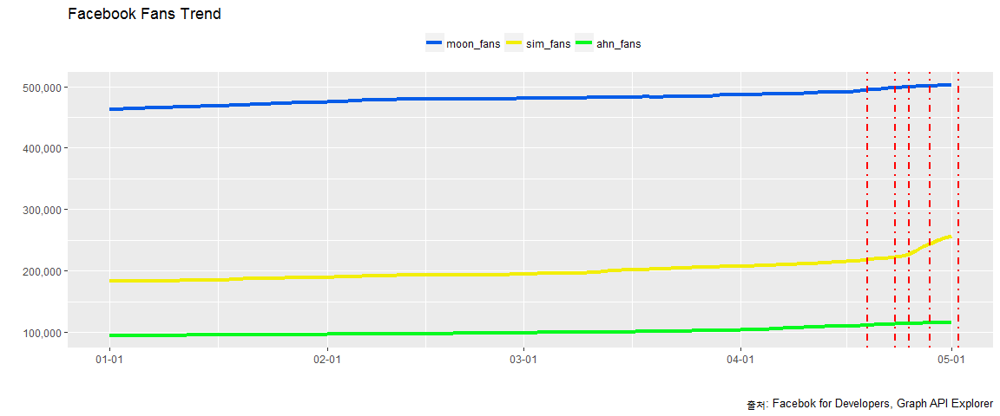

# 데이터 과학자와 함께 하는 제19대 대통령 선거

## 페이스북 페이지 팬수 추세

민주당 문재인 후보와 국민의당 안철수 후보가 양강 체계를 구축하고 치열한 각축전을 벌이고 있다.
페이스북 팬수 추세를 시각화 한다.

### 페이스북 페이지 팬수 비교 

<!--html_preserve-->

<!--/html_preserve-->

### 페이스북 페이지 팬수 비교 

