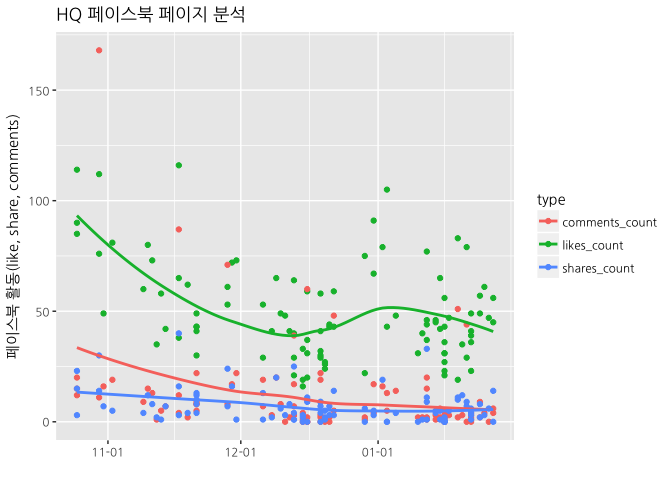

# 데이터 과학자와 함께 하는 제19대 대통령 선거

## 1. 대권후보 페이스북 페이지

페이스북 API를 통해 손학규 의장을 비롯한 유력 대권후보 페북 페이지 데이터를 가져와서 분석하는 것이 가능하다.
가장 먼저 네이버 인물검색을 통해 공식 페이스북 페이지를 확인한다.

- 문재인 : [https://www.facebook.com/moonbyun1](https://www.facebook.com/moonbyun1)
- 반기문 : [https://www.facebook.com/bkmkorea2017](https://www.facebook.com/bkmkorea2017)
- 손학규 : [https://www.facebook.com/koreasohn](https://www.facebook.com/koreasohn)
- 이재명 : [https://www.facebook.com/jaemyunglee](https://www.facebook.com/jaemyunglee)
- 유승민 : [https://www.facebook.com/sminyoo](https://www.facebook.com/sminyoo)
- 안철수 : [https://www.facebook.com/ahncs111](https://www.facebook.com/ahncs111)

## 2. 대권후보 1인 페북 활동성 분석

최근 국민주권개혁회의를 통해 출마를 선언한 손학규 의장 공식 페이스북 페이지를 분석한다.

### 2.1. 환경설정

가장 먼저 페북 분석을 위한 환경설정을 한다. 특히 `fbOAuth()` 함수를 통해 인증키 관리에 신경을 많이 쓴다.

~~~{.r}
# 1. 환경설정 ---------------------------------------------------
## 1.1. 팩키지 불러오기
# devtools::install_github("pablobarbera/Rfacebook/Rfacebook")
library(Rfacebook)
library(tidyverse)
library(lubridate)
library(ggplot2)
library(DT)

## 1.2. 인증설정
# fb_oauth <- fbOAuth(app_id="1XXXXXXXXXXXXXXXXX",
#                    app_secret="e33XXXXXXXXXXXXXXXXXXXXXXXXX",
#                    extended_permissions = TRUE)
# save(fb_oauth, file="code/fb_oauth")
load("code/fb_oauth")
~~~

### 2.2. 페북 페이지 데이터 끌어오기

페북 데이터를 `getPage()` 함수를 통해 간단히 가져와서, "2016-10-01" 이후 데이터를 대상으로 분석을 시작한다.

~~~{.r}
# 2. 페북 데이터 끌어오기 --------------------------------------
# https://www.facebook.com/koreasohn

sohn_pg <- getPage("koreasohn", n=100, token=fb_oauth)
~~~

~~~{.output}
25 posts 50 posts 75 posts 100 posts 

~~~

~~~{.r}
# 3. 데이터 전처리 및 정제 --------------------------------------

sohn_lg <- sohn_pg %>% 
  mutate(fb_date = ymd(substr(created_time, 1,10))) %>% 
  dplyr::filter(fb_date >="2016-10-01") %>% 
  dplyr::select(fb_date, likes_count, comments_count, shares_count) %>% 
  gather(type, activity, -fb_date)
~~~

### 2.3. 페북 페이지 활동성 시각화

`ggplot`을 통해 좋아요, 공유, 댓글에 대한 활동성 지표를 바탕으로 시간순으로 시각화한다.

~~~{.r}
# 3. 시각화 -------------------------------------------------

ggplot(data=sohn_lg) +
  aes(x=fb_date, y=activity, fill=type, color=type) +
  geom_point(aes(colour=type)) +
  geom_smooth(se=FALSE) +
  scale_x_date(date_labels = "%m-%d") +
  labs(title = "HQ 페이스북 페이지 분석", x="", y="페이스북 활동(like, share, comments)")
~~~

~~~{.output}
`geom_smooth()` using method = 'loess'

~~~

### 2.4. 페북 페이지 통계

페북 페이지 활동성 지표를 통해 게시물 유형(status, video, photo, link)별로 활동성 지표의 반응을 살펴본다.

$$\text{좋아요 전환(like_converstion)} = \frac{\text{좋아요 총합(like_sum)}}{\text{콘텐츠 갯수(content_count)}}$$

~~~{.r}
# 4. 장표 ---------------------------------------------------
## 4.1. HQ 페북 활동성 분석
sohn_stat <- sohn_pg %>% mutate(fb_date = ymd(substr(created_time, 1,10))) %>% 
  dplyr::filter(fb_date >="2016-10-01") %>% 
  group_by(type) %>% 
  summarise(content_count = n(),
            like_sum = sum(likes_count),
            comment_sum = sum(comments_count),
            share_sum = sum(shares_count)) %>% 
  mutate(like_conversion = like_sum/content_count,
         comment_conversion = comment_sum/content_count,
         share_conversion = share_sum/content_count) %>% 
  arrange(desc(like_sum))

datatable(sohn_stat, options = list(autoWidth = TRUE,
                                   columnDefs = list(list(width = '50px', targets = c(1:6))))) %>% 
  formatCurrency(c('content_count', 'like_sum', 'comment_sum', 'share_sum'),' ', interval = 3, mark = ",", digits = 0) %>% 
  formatCurrency(c('like_conversion', 'comment_conversion', 'share_conversion'),' ', interval = 3, mark = ",", digits = 1)
~~~

<!--html_preserve-->

<!--/html_preserve-->

### 2.5. 페북 페이지 인기 게시물

페북 페이지 활동성을 통해 "2016-10-01" 이후 가장 활동성이 좋은 게시물을 파악한다.

~~~{.r}
## 4.2. HQ 페북 페이지 상세
sohn_tbl <- sohn_pg %>% mutate(fb_date = ymd(substr(created_time, 1,10))) %>% 
  dplyr::filter(fb_date >="2016-10-01") %>%
  dplyr::select(type, fb_date, like=likes_count, comment=comments_count, share=shares_count, message) %>% 
  arrange(desc(like))

datatable(sohn_tbl, options = list(autoWidth = TRUE,
                                   columnDefs = list(list(width = '500px', targets = c(6)))))
~~~

<!--html_preserve-->

<!--/html_preserve-->
