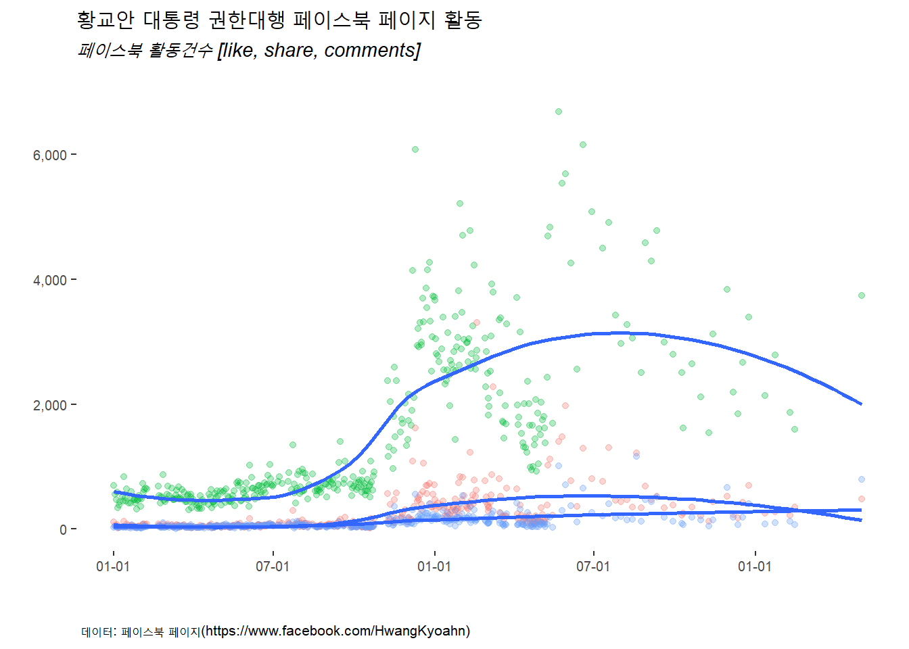
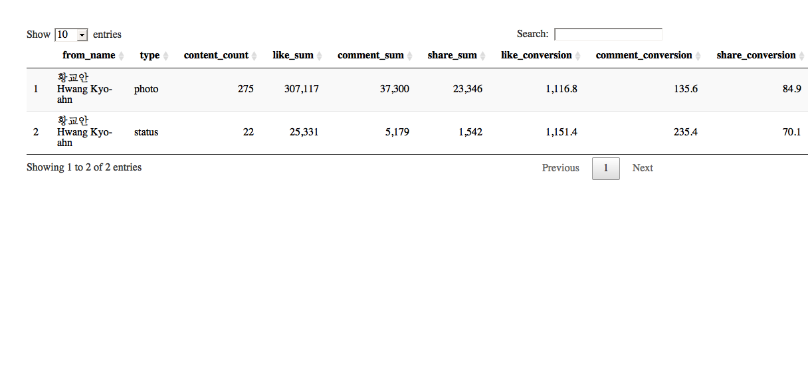
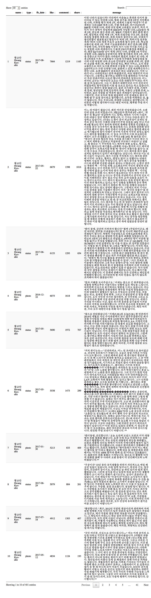

# 황교안 대통령 권한대행 페이스북 페이지 {#hwang-fb-page}

페이스북 API를 통해 황교안 대통령 권한대행 페이스북 페이지 활동성을 분석한다.
가장 먼저 네이버 인물검색을 통해 공식 페이스북 페이지를 확인한다.

- 황교안 대통령 권한대행 네이버 인물검색 : [https://search.naver.com/search.naver?where=nexearch&query=황교안&sm=top_hty&fbm=0&ie=utf8](https://search.naver.com/search.naver?where=nexearch&query=%ED%99%A9%EA%B5%90%EC%95%88&sm=top_hty&fbm=0&ie=utf8)
- 황교안 대통령 권한대행 페이스북 페이지 : [https://www.facebook.com/PM0415HwangKyoahn](https://www.facebook.com/PM0415HwangKyoahn)

# 황교안 대통령 권한대행 페북 활동성 분석 {#hwang-fb-page-activity}

황교안 대통령 권한대행 공식 페이스북 페이지를 분석한다.

## 환경설정 {#hwang-setup}

가장 먼저 페북 분석을 위한 환경설정을 한다. 특히 `fbOAuth()` 함수를 통해 인증키 관리에 신경을 많이 쓴다.

~~~{.r}
# 0. 참고문헌 ---------------------------------------------------------------------

# 1. 환경설정 ---------------------------------------------------
## 1.1. 팩키지 불러오기
# devtools::install_github("pablobarbera/Rfacebook")
library(Rfacebook)
library(tidyverse)
library(lubridate)
library(ggplot2)
library(DT)
library(ggthemes)
library(scales)

## 1.2. 인증설정
# fb_oauth <- fbOAuth(app_id="1XXXXXXXXXXXXXXXXX",
#                    app_secret="e33XXXXXXXXXXXXXXXXXXXXXXXXX",
#                    extended_permissions = TRUE)
# save(fb_oauth, file="code/fb_oauth")
load("code/fb_oauth")

# 2. 페북 데이터 끌어오기 --------------------------------------
# 황교안: https://www.facebook.com/PM0415HwangKyoahn

fb_keys <- "EAACEdEose0cBAMGeGJQuUAnq0cBDcjLHzSD3q8SDtKua9BWFL7Vd7fAptH1mZB1J0AGGOr4U7X4RZBvGBvsQQBdsIY1oJh1Xm7G7wHZCuJSLbXuPn7e6X9ZB3sn8CPhxEo8z8fpEodhMkxxkWyFLR5EZAdllQ9TtUDWXLdoYiOLHMNkEpA3BF7DsU3761ZA0EZD"

hwang_pg  <- getPage("PM0415HwangKyoahn", n=1000, token=fb_keys, since='2016/01/01')
~~~

~~~{.output}
25 posts 50 posts 75 posts 100 posts 125 posts 150 posts 175 posts 200 posts 225 posts 250 posts 275 posts 300 posts 325 posts 350 posts 375 posts 400 posts 401 posts 

~~~

~~~{.r}
fb_page_dat <- hwang_pg

# 3. 데이터 전처리 및 정제 --------------------------------------

fb_page_df <- fb_page_dat %>% 
  mutate(fb_date = ymd(substr(created_time, 1,10))) %>% 
  dplyr::select(fb_date, likes_count, comments_count, shares_count) %>% 
  gather(type, activity, -fb_date)
~~~

## 페북 페이지 활동성 시각화 {#hwang-activity-viz}

`ggplot`을 통해 좋아요, 공유, 댓글에 대한 활동성 지표를 바탕으로 시간순으로 시각화한다.

~~~{.r}
# 3. 시각화 -------------------------------------------------

ggplot(data=fb_page_df) +
  aes(x=fb_date, y=activity, fill=type) +
  geom_point(aes(colour=type), alpha=0.3) +
  geom_smooth(se=FALSE) +
  scale_y_continuous(limits=c(0,7000), labels = comma) +
  scale_x_date(date_labels = "%m-%d") +
  theme_tufte() +
  theme(legend.position="none", plot.caption=element_text(hjust=0,size=8),plot.subtitle=element_text(face="italic"),
        axis.text=element_text(size=7.5))+
  labs(x="",y="",title="황교안 대통령 권한대행 페이스북 페이지 활동",
       caption="\n 데이터: 페이스북 페이지(https://www.facebook.com/HwangKyoahn) ",
       subtitle="페이스북 활동건수 [like, share, comments]") +
  theme(text=element_text(family="NanumGothic"))
~~~

~~~{.output}
`geom_smooth()` using method = 'loess' and formula 'y ~ x'

~~~

## 페북 페이지 통계 {#hwang-activity-stat}

페북 페이지 활동성 지표를 통해 게시물 유형(status, video, photo, link)별로 활동성 지표의 반응을 살펴본다.

$$\text{좋아요 전환(like_converstion)} = \frac{\text{좋아요 총합(like_sum)}}{\text{콘텐츠 갯수(content_count)}}$$

~~~{.r}
# 4. 장표 ---------------------------------------------------
## 4.1. 황교안 대통령 권한대행 페북 활동성 분석
fb_page_stat <- fb_page_dat %>% mutate(fb_date = ymd(substr(created_time, 1,10))) %>% 
  group_by(from_name, type) %>% 
  summarise(content_count = n(),
            like_sum = sum(likes_count),
            comment_sum = sum(comments_count),
            share_sum = sum(shares_count)) %>% 
  mutate(like_conversion = like_sum/content_count,
         comment_conversion = comment_sum/content_count,
         share_conversion = share_sum/content_count) %>% 
  arrange(desc(like_sum))

datatable(fb_page_stat, options = list(autoWidth = TRUE,
                                   columnDefs = list(list(width = '50px', targets = c(1:6))))) %>% 
  formatCurrency(c('content_count', 'like_sum', 'comment_sum', 'share_sum'),' ', interval = 3, mark = ",", digits = 0) %>% 
  formatCurrency(c('like_conversion', 'comment_conversion', 'share_conversion'),' ', interval = 3, mark = ",", digits = 1)
~~~

## 페북 페이지 인기 게시물 {#hwang-popular-post}

페북 페이지 활동성을 통해 가장 활동성이 좋은 게시물을 파악한다.

~~~{.r}
## 4.2. 황교안 대통령 권한대행 페북 페이지 상세
fb_page_tbl <- fb_page_dat %>% mutate(fb_date = ymd(substr(created_time, 1,10))) %>% 
  dplyr::select(name=from_name, type, fb_date, like=likes_count, comment=comments_count, share=shares_count, message) %>% 
  arrange(desc(like))

datatable(fb_page_tbl, options = list(autoWidth = TRUE,
                                   columnDefs = list(list(width = '500px', targets = c(7)))))
~~~

