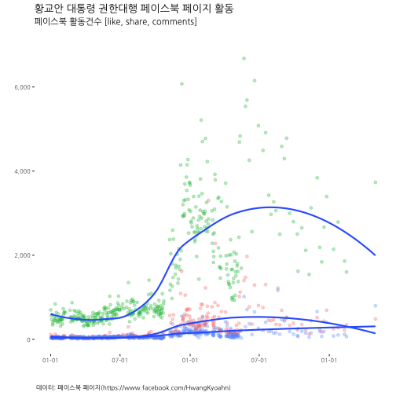

# 데이터 과학자와 함께 하는 제19대 대통령 선거

## 1. 황교안 대통령 권한대행 페이스북 페이지

페이스북 API를 통해 황교안 대통령 권한대행 페이스북 페이지 활동성을 분석한다.
가장 먼저 네이버 인물검색을 통해 공식 페이스북 페이지를 확인한다.

- 황교안 대통령 권한대행 네이버 인물검색 : [https://search.naver.com/search.naver?where=nexearch&query=황교안&sm=top_hty&fbm=0&ie=utf8](https://search.naver.com/search.naver?where=nexearch&query=%ED%99%A9%EA%B5%90%EC%95%88&sm=top_hty&fbm=0&ie=utf8)
- 황교안 대통령 권한대행 페이스북 페이지 : [https://www.facebook.com/PM0415HwangKyoahn](https://www.facebook.com/PM0415HwangKyoahn)

## 2. 황교안 대통령 권한대행 페북 활동성 분석

황교안 대통령 권한대행 공식 페이스북 페이지를 분석한다.

### 2.1. 환경설정

가장 먼저 페북 분석을 위한 환경설정을 한다. 특히 `fbOAuth()` 함수를 통해 인증키 관리에 신경을 많이 쓴다.

~~~{.r}
# 0. 참고문헌 ---------------------------------------------------------------------

# 1. 환경설정 ---------------------------------------------------
## 1.1. 팩키지 불러오기
# devtools::install_github("pablobarbera/Rfacebook")
options(warn=-1)
library(Rfacebook)
library(tidyverse)
library(lubridate)
library(ggplot2)
library(DT)
library(ggthemes)
library(scales)

## 1.2. 인증설정
# fb_oauth <- fbOAuth(app_id="1XXXXXXXXXXXXXXXXX",
#                    app_secret="e33XXXXXXXXXXXXXXXXXXXXXXXXX",
#                    extended_permissions = TRUE)
# save(fb_oauth, file="code/fb_oauth")
load("code/fb_oauth")

# 2. 페북 데이터 끌어오기 --------------------------------------
# 황교안: https://www.facebook.com/PM0415HwangKyoahn

hwang_pg  <- getPage("PM0415HwangKyoahn", n=1000, token=fb_oauth, since='2016/01/01')
~~~

~~~{.output}
25 posts 50 posts 75 posts 100 posts 125 posts 150 posts 175 posts 200 posts 225 posts 250 posts 275 posts 297 posts 

~~~

~~~{.r}
fb_page_dat <- hwang_pg

# write_csv(fb_page_dat, "data/fb_page_20170203.csv")

# 3. 데이터 전처리 및 정제 --------------------------------------

fb_page_df <- fb_page_dat %>% 
  mutate(fb_date = ymd(substr(created_time, 1,10))) %>% 
  dplyr::select(fb_date, likes_count, comments_count, shares_count) %>% 
  gather(type, activity, -fb_date)
~~~

### 2.3. 페북 페이지 활동성 시각화

`ggplot`을 통해 좋아요, 공유, 댓글에 대한 활동성 지표를 바탕으로 시간순으로 시각화한다.

~~~{.r}
# 3. 시각화 -------------------------------------------------

ggplot(data=fb_page_df) +
  aes(x=fb_date, y=activity, fill=type) +
  geom_point(aes(colour=type), alpha=0.3) +
  geom_smooth(se=FALSE) +
  scale_y_continuous(limits=c(0,7000), labels = comma) +
  scale_x_date(date_labels = "%m-%d") +
  theme_tufte() +
  theme(legend.position="none", plot.caption=element_text(hjust=0,size=8),plot.subtitle=element_text(face="italic"),
        axis.text=element_text(size=7.5))+
  labs(x="",y="",title="황교안 대통령 권한대행 페이스북 페이지 활동",
       caption="\n 데이터: 페이스북 페이지(https://www.facebook.com/HwangKyoahn) ",
       subtitle="페이스북 활동건수 [like, share, comments]") +
  theme(text=element_text(family="NanumGothic"))
~~~

~~~{.output}
`geom_smooth()` using method = 'loess'

~~~

### 2.4. 페북 페이지 통계

페북 페이지 활동성 지표를 통해 게시물 유형(status, video, photo, link)별로 활동성 지표의 반응을 살펴본다.

$$\text{좋아요 전환(like_converstion)} = \frac{\text{좋아요 총합(like_sum)}}{\text{콘텐츠 갯수(content_count)}}$$

~~~{.r}
# 4. 장표 ---------------------------------------------------
## 4.1. 황교안 대통령 권한대행 페북 활동성 분석
fb_page_stat <- fb_page_dat %>% mutate(fb_date = ymd(substr(created_time, 1,10))) %>% 
  group_by(from_name, type) %>% 
  summarise(content_count = n(),
            like_sum = sum(likes_count),
            comment_sum = sum(comments_count),
            share_sum = sum(shares_count)) %>% 
  mutate(like_conversion = like_sum/content_count,
         comment_conversion = comment_sum/content_count,
         share_conversion = share_sum/content_count) %>% 
  arrange(desc(like_sum))

datatable(fb_page_stat, options = list(autoWidth = TRUE,
                                   columnDefs = list(list(width = '50px', targets = c(1:6))))) %>% 
  formatCurrency(c('content_count', 'like_sum', 'comment_sum', 'share_sum'),' ', interval = 3, mark = ",", digits = 0) %>% 
  formatCurrency(c('like_conversion', 'comment_conversion', 'share_conversion'),' ', interval = 3, mark = ",", digits = 1)
~~~

<!--html_preserve-->

<!--/html_preserve-->

### 2.5. 페북 페이지 인기 게시물

페북 페이지 활동성을 통해 가장 활동성이 좋은 게시물을 파악한다.

~~~{.r}
## 4.2. 황교안 대통령 권한대행 페북 페이지 상세
fb_page_tbl <- fb_page_dat %>% mutate(fb_date = ymd(substr(created_time, 1,10))) %>% 
  dplyr::select(name=from_name, type, fb_date, like=likes_count, comment=comments_count, share=shares_count, message) %>% 
  arrange(desc(like))

datatable(fb_page_tbl, options = list(autoWidth = TRUE,
                                   columnDefs = list(list(width = '500px', targets = c(7)))))
~~~

<!--html_preserve-->

<script type="application/json" data-for="htmlwidget-9f684038f8be39801a0a">{"x":{"filter":"none","data":[["1","2","3","4","5","6","7","8","9","10","11","12","13","14","15","16","17","18","19","20","21","22","23","24","25","26","27","28","29","30","31","32","33","34","35","36","37","38","39","40","41","42","43","44","45","46","47","48","49","50","51","52","53","54","55","56","57","58","59","60","61","62","63","64","65","66","67","68","69","70","71","72","73","74","75","76","77","78","79","80","81","82","83","84","85","86","87","88","89","90","91","92","93","94","95","96","97","98","99","100","101","102","103","104","105","106","107","108","109","110","111","112","113","114","115","116","117","118","119","120","121","122","123","124","125","126","127","128","129","130","131","132","133","134","135","136","137","138","139","140","141","142","143","144","145","146","147","148","149","150","151","152","153","154","155","156","157","158","159","160","161","162","163","164","165","166","167","168","169","170","171","172","173","174","175","176","177","178","179","180","181","182","183","184","185","186","187","188","189","190","191","192","193","194","195","196","197","198","199","200","201","202","203","204","205","206","207","208","209","210","211","212","213","214","215","216","217","218","219","220","221","222","223","224","225","226","227","228","229","230","231","232","233","234","235","236","237","238","239","240","241","242","243","244","245","246","247","248","249","250","251","252","253","254","255","256","257","258","259","260","261","262","263","264","265","266","267","268","269","270","271","272","273","274","275","276","277","278","279","280","281","282","283","284","285","286","287","288","289","290","291","292","293","294","295","296","297"],["황교안 Hwang Kyo-ahn","황교안 Hwang Kyo-ahn","황교안 Hwang Kyo-ahn","황교안 Hwang Kyo-ahn","황교안 Hwang Kyo-ahn","황교안 Hwang Kyo-ahn","황교안 Hwang Kyo-ahn","황교안 Hwang Kyo-ahn","황교안 Hwang Kyo-ahn","황교안 Hwang Kyo-ahn","황교안 Hwang Kyo-ahn","황교안 Hwang Kyo-ahn","황교안 Hwang Kyo-ahn","황교안 Hwang Kyo-ahn","황교안 Hwang Kyo-ahn","황교안 Hwang Kyo-ahn","황교안 Hwang Kyo-ahn","황교안 Hwang Kyo-ahn","황교안 Hwang Kyo-ahn","황교안 Hwang Kyo-ahn","황교안 Hwang Kyo-ahn","황교안 Hwang Kyo-ahn","황교안 Hwang Kyo-ahn","황교안 Hwang Kyo-ahn","황교안 Hwang Kyo-ahn","황교안 Hwang Kyo-ahn","황교안 Hwang Kyo-ahn","황교안 Hwang Kyo-ahn","황교안 Hwang Kyo-ahn","황교안 Hwang Kyo-ahn","황교안 Hwang Kyo-ahn","황교안 Hwang Kyo-ahn","황교안 Hwang Kyo-ahn","황교안 Hwang Kyo-ahn","황교안 Hwang Kyo-ahn","황교안 Hwang Kyo-ahn","황교안 Hwang Kyo-ahn","황교안 Hwang Kyo-ahn","황교안 Hwang Kyo-ahn","황교안 Hwang Kyo-ahn","황교안 Hwang Kyo-ahn","황교안 Hwang Kyo-ahn","황교안 Hwang Kyo-ahn","황교안 Hwang Kyo-ahn","황교안 Hwang Kyo-ahn","황교안 Hwang Kyo-ahn","황교안 Hwang Kyo-ahn","황교안 Hwang Kyo-ahn","황교안 Hwang Kyo-ahn","황교안 Hwang Kyo-ahn","황교안 Hwang Kyo-ahn","황교안 Hwang Kyo-ahn","황교안 Hwang Kyo-ahn","황교안 Hwang Kyo-ahn","황교안 Hwang Kyo-ahn","황교안 Hwang Kyo-ahn","황교안 Hwang Kyo-ahn","황교안 Hwang Kyo-ahn","황교안 Hwang Kyo-ahn","황교안 Hwang Kyo-ahn","황교안 Hwang Kyo-ahn","황교안 Hwang Kyo-ahn","황교안 Hwang Kyo-ahn","황교안 Hwang Kyo-ahn","황교안 Hwang Kyo-ahn","황교안 Hwang Kyo-ahn","황교안 Hwang Kyo-ahn","황교안 Hwang Kyo-ahn","황교안 Hwang Kyo-ahn","황교안 Hwang Kyo-ahn","황교안 Hwang Kyo-ahn","황교안 Hwang Kyo-ahn","황교안 Hwang Kyo-ahn","황교안 Hwang Kyo-ahn","황교안 Hwang Kyo-ahn","황교안 Hwang Kyo-ahn","황교안 Hwang Kyo-ahn","황교안 Hwang Kyo-ahn","황교안 Hwang Kyo-ahn","황교안 Hwang Kyo-ahn","황교안 Hwang Kyo-ahn","황교안 Hwang Kyo-ahn","황교안 Hwang Kyo-ahn","황교안 Hwang Kyo-ahn","황교안 Hwang Kyo-ahn","황교안 Hwang Kyo-ahn","황교안 Hwang Kyo-ahn","황교안 Hwang Kyo-ahn","황교안 Hwang Kyo-ahn","황교안 Hwang Kyo-ahn","황교안 Hwang Kyo-ahn","황교안 Hwang Kyo-ahn","황교안 Hwang Kyo-ahn","황교안 Hwang Kyo-ahn","황교안 Hwang Kyo-ahn","황교안 Hwang Kyo-ahn","황교안 Hwang Kyo-ahn","황교안 Hwang Kyo-ahn","황교안 Hwang Kyo-ahn","황교안 Hwang Kyo-ahn","황교안 Hwang Kyo-ahn","황교안 Hwang Kyo-ahn","황교안 Hwang Kyo-ahn","황교안 Hwang Kyo-ahn","황교안 Hwang Kyo-ahn","황교안 Hwang Kyo-ahn","황교안 Hwang Kyo-ahn","황교안 Hwang Kyo-ahn","황교안 Hwang Kyo-ahn","황교안 Hwang Kyo-ahn","황교안 Hwang Kyo-ahn","황교안 Hwang Kyo-ahn","황교안 Hwang Kyo-ahn","황교안 Hwang Kyo-ahn","황교안 Hwang Kyo-ahn","황교안 Hwang Kyo-ahn","황교안 Hwang Kyo-ahn","황교안 Hwang Kyo-ahn","황교안 Hwang Kyo-ahn","황교안 Hwang Kyo-ahn","황교안 Hwang Kyo-ahn","황교안 Hwang Kyo-ahn","황교안 Hwang Kyo-ahn","황교안 Hwang Kyo-ahn","황교안 Hwang Kyo-ahn","황교안 Hwang Kyo-ahn","황교안 Hwang Kyo-ahn","황교안 Hwang Kyo-ahn","황교안 Hwang Kyo-ahn","황교안 Hwang Kyo-ahn","황교안 Hwang Kyo-ahn","황교안 Hwang Kyo-ahn","황교안 Hwang Kyo-ahn","황교안 Hwang Kyo-ahn","황교안 Hwang Kyo-ahn","황교안 Hwang Kyo-ahn","황교안 Hwang Kyo-ahn","황교안 Hwang Kyo-ahn","황교안 Hwang Kyo-ahn","황교안 Hwang Kyo-ahn","황교안 Hwang Kyo-ahn","황교안 Hwang Kyo-ahn","황교안 Hwang Kyo-ahn","황교안 Hwang Kyo-ahn","황교안 Hwang Kyo-ahn","황교안 Hwang Kyo-ahn","황교안 Hwang Kyo-ahn","황교안 Hwang Kyo-ahn","황교안 Hwang Kyo-ahn","황교안 Hwang Kyo-ahn","황교안 Hwang Kyo-ahn","황교안 Hwang Kyo-ahn","황교안 Hwang Kyo-ahn","황교안 Hwang Kyo-ahn","황교안 Hwang Kyo-ahn","황교안 Hwang Kyo-ahn","황교안 Hwang Kyo-ahn","황교안 Hwang Kyo-ahn","황교안 Hwang Kyo-ahn","황교안 Hwang Kyo-ahn","황교안 Hwang Kyo-ahn","황교안 Hwang Kyo-ahn","황교안 Hwang Kyo-ahn","황교안 Hwang Kyo-ahn","황교안 Hwang Kyo-ahn","황교안 Hwang Kyo-ahn","황교안 Hwang Kyo-ahn","황교안 Hwang Kyo-ahn","황교안 Hwang Kyo-ahn","황교안 Hwang Kyo-ahn","황교안 Hwang Kyo-ahn","황교안 Hwang Kyo-ahn","황교안 Hwang Kyo-ahn","황교안 Hwang Kyo-ahn","황교안 Hwang Kyo-ahn","황교안 Hwang Kyo-ahn","황교안 Hwang Kyo-ahn","황교안 Hwang Kyo-ahn","황교안 Hwang Kyo-ahn","황교안 Hwang Kyo-ahn","황교안 Hwang Kyo-ahn","황교안 Hwang Kyo-ahn","황교안 Hwang Kyo-ahn","황교안 Hwang Kyo-ahn","황교안 Hwang Kyo-ahn","황교안 Hwang Kyo-ahn","황교안 Hwang Kyo-ahn","황교안 Hwang Kyo-ahn","황교안 Hwang Kyo-ahn","황교안 Hwang Kyo-ahn","황교안 Hwang Kyo-ahn","황교안 Hwang Kyo-ahn","황교안 Hwang Kyo-ahn","황교안 Hwang Kyo-ahn","황교안 Hwang Kyo-ahn","황교안 Hwang Kyo-ahn","황교안 Hwang Kyo-ahn","황교안 Hwang Kyo-ahn","황교안 Hwang Kyo-ahn","황교안 Hwang Kyo-ahn","황교안 Hwang Kyo-ahn","황교안 Hwang Kyo-ahn","황교안 Hwang Kyo-ahn","황교안 Hwang Kyo-ahn","황교안 Hwang Kyo-ahn","황교안 Hwang Kyo-ahn","황교안 Hwang Kyo-ahn","황교안 Hwang Kyo-ahn","황교안 Hwang Kyo-ahn","황교안 Hwang Kyo-ahn","황교안 Hwang Kyo-ahn","황교안 Hwang Kyo-ahn","황교안 Hwang Kyo-ahn","황교안 Hwang Kyo-ahn","황교안 Hwang Kyo-ahn","황교안 Hwang Kyo-ahn","황교안 Hwang Kyo-ahn","황교안 Hwang Kyo-ahn","황교안 Hwang Kyo-ahn","황교안 Hwang Kyo-ahn","황교안 Hwang Kyo-ahn","황교안 Hwang Kyo-ahn","황교안 Hwang Kyo-ahn","황교안 Hwang Kyo-ahn","황교안 Hwang Kyo-ahn","황교안 Hwang Kyo-ahn","황교안 Hwang Kyo-ahn","황교안 Hwang Kyo-ahn","황교안 Hwang Kyo-ahn","황교안 Hwang Kyo-ahn","황교안 Hwang Kyo-ahn","황교안 Hwang Kyo-ahn","황교안 Hwang Kyo-ahn","황교안 Hwang Kyo-ahn","황교안 Hwang Kyo-ahn","황교안 Hwang Kyo-ahn","황교안 Hwang Kyo-ahn","황교안 Hwang Kyo-ahn","황교안 Hwang Kyo-ahn","황교안 Hwang Kyo-ahn","황교안 Hwang Kyo-ahn","황교안 Hwang Kyo-ahn","황교안 Hwang Kyo-ahn","황교안 Hwang Kyo-ahn","황교안 Hwang Kyo-ahn","황교안 Hwang Kyo-ahn","황교안 Hwang Kyo-ahn","황교안 Hwang Kyo-ahn","황교안 Hwang Kyo-ahn","황교안 Hwang Kyo-ahn","황교안 Hwang Kyo-ahn","황교안 Hwang Kyo-ahn","황교안 Hwang Kyo-ahn","황교안 Hwang Kyo-ahn","황교안 Hwang Kyo-ahn","황교안 Hwang Kyo-ahn","황교안 Hwang Kyo-ahn","황교안 Hwang Kyo-ahn","황교안 Hwang Kyo-ahn","황교안 Hwang Kyo-ahn","황교안 Hwang Kyo-ahn","황교안 Hwang Kyo-ahn","황교안 Hwang Kyo-ahn","황교안 Hwang Kyo-ahn","황교안 Hwang Kyo-ahn","황교안 Hwang Kyo-ahn","황교안 Hwang Kyo-ahn","황교안 Hwang Kyo-ahn","황교안 Hwang Kyo-ahn","황교안 Hwang Kyo-ahn","황교안 Hwang Kyo-ahn","황교안 Hwang Kyo-ahn","황교안 Hwang Kyo-ahn","황교안 Hwang Kyo-ahn","황교안 Hwang Kyo-ahn","황교안 Hwang Kyo-ahn","황교안 Hwang Kyo-ahn","황교안 Hwang Kyo-ahn","황교안 Hwang Kyo-ahn","황교안 Hwang Kyo-ahn","황교안 Hwang Kyo-ahn","황교안 Hwang Kyo-ahn","황교안 Hwang Kyo-ahn","황교안 Hwang Kyo-ahn","황교안 Hwang Kyo-ahn","황교안 Hwang Kyo-ahn","황교안 Hwang Kyo-ahn","황교안 Hwang Kyo-ahn","황교안 Hwang Kyo-ahn","황교안 Hwang Kyo-ahn","황교안 Hwang Kyo-ahn","황교안 Hwang Kyo-ahn","황교안 Hwang Kyo-ahn","황교안 Hwang Kyo-ahn","황교안 Hwang Kyo-ahn","황교안 Hwang Kyo-ahn","황교안 Hwang Kyo-ahn"],["photo","photo","photo","photo","photo","status","photo","status","photo","photo","photo","status","photo","photo","status","photo","photo","photo","photo","photo","photo","photo","photo","photo","photo","photo","photo","photo","photo","photo","photo","photo","photo","photo","photo","photo","photo","photo","photo","photo","photo","photo","photo","status","photo","photo","photo","photo","photo","photo","photo","photo","photo","photo","photo","photo","photo","photo","photo","photo","photo","photo","photo","photo","photo","photo","photo","photo","photo","photo","photo","photo","photo","photo","photo","photo","photo","photo","photo","photo","photo","photo","photo","photo","photo","photo","photo","photo","photo","photo","photo","photo","photo","photo","photo","photo","photo","photo","photo","photo","photo","photo","photo","photo","photo","photo","photo","photo","photo","photo","photo","photo","photo","photo","photo","photo","photo","photo","photo","photo","photo","photo","photo","photo","photo","photo","photo","photo","photo","status","photo","photo","photo","photo","photo","photo","photo","photo","photo","photo","photo","photo","photo","photo","photo","photo","photo","photo","photo","photo","photo","photo","photo","photo","photo","photo","photo","photo","status","photo","photo","photo","photo","photo","photo","photo","photo","photo","photo","photo","photo","photo","photo","photo","photo","photo","photo","photo","photo","photo","photo","photo","photo","photo","photo","photo","photo","photo","photo","photo","photo","photo","photo","photo","photo","photo","photo","photo","photo","photo","photo","photo","photo","status","status","photo","photo","photo","photo","photo","photo","photo","photo","photo","photo","photo","photo","photo","photo","photo","photo","photo","photo","photo","photo","photo","photo","photo","photo","photo","photo","photo","photo","photo","photo","photo","photo","photo","photo","photo","photo","photo","photo","photo","photo","photo","photo","photo","photo","photo","photo","photo","status","photo","status","photo","photo","photo","photo","photo","photo","photo","photo","photo","photo","photo","photo","status","photo","photo","photo","status","status","photo","photo","photo","photo","status","photo","status","photo","status","photo","photo","photo","photo","photo","status","photo","photo","status","status","photo","photo","photo","status","status"],["2016-12-10","2017-01-30","2016-12-26","2016-12-24","2017-02-02","2016-12-07","2016-12-22","2016-12-31","2016-12-18","2016-12-30","2017-01-01","2017-01-28","2016-12-23","2017-01-10","2016-12-19","2016-12-15","2016-12-27","2017-01-24","2016-12-13","2017-01-16","2016-12-29","2017-02-01","2017-01-02","2016-12-17","2016-12-17","2016-12-12","2016-12-14","2017-01-27","2017-01-09","2017-01-03","2017-01-04","2017-01-26","2017-01-23","2017-01-06","2016-11-16","2017-01-19","2017-01-31","2017-01-20","2016-12-28","2017-01-15","2017-01-11","2017-01-22","2017-01-29","2016-11-18","2017-01-25","2017-01-17","2016-11-08","2017-02-03","2017-01-14","2017-01-13","2016-12-02","2016-12-08","2016-11-11","2016-11-28","2016-12-06","2017-01-18","2016-11-15","2016-11-24","2016-12-02","2016-11-25","2016-12-05","2016-11-23","2016-11-17","2016-12-01","2016-09-15","2016-07-23","2016-11-10","2016-11-30","2017-01-24","2016-11-15","2016-11-09","2016-09-21","2016-10-20","2016-09-14","2016-06-04","2016-06-27","2016-11-14","2016-08-03","2016-10-11","2016-10-24","2016-07-30","2016-07-19","2016-08-06","2016-08-04","2016-08-15","2016-02-26","2016-07-29","2016-06-25","2016-09-11","2016-10-23","2016-07-08","2016-01-13","2016-09-30","2016-06-06","2016-08-08","2016-06-28","2016-09-20","2016-09-01","2016-09-03","2016-10-16","2016-10-07","2016-09-07","2016-10-10","2016-07-06","2016-05-22","2016-07-18","2016-10-21","2016-10-06","2016-05-24","2016-09-05","2016-06-21","2016-05-31","2016-05-20","2016-10-03","2016-09-19","2016-07-11","2016-02-03","2016-08-29","2016-10-13","2016-07-25","2016-09-13","2016-09-07","2016-07-01","2016-06-29","2016-09-27","2016-06-24","2016-08-30","2016-06-23","2016-10-19","2016-01-01","2016-08-11","2016-05-22","2016-06-14","2016-06-18","2016-02-21","2016-03-03","2016-10-12","2016-06-30","2016-10-01","2016-06-15","2016-10-18","2016-09-02","2016-08-01","2016-03-15","2016-10-09","2016-08-23","2016-10-05","2016-03-07","2016-06-07","2016-06-08","2016-08-25","2016-09-08","2016-07-28","2016-02-06","2016-09-29","2016-05-08","2016-08-20","2016-04-21","2016-02-08","2016-01-16","2016-07-22","2016-06-01","2016-03-19","2016-06-11","2016-02-05","2016-05-27","2016-10-04","2016-10-22","2016-08-22","2016-06-20","2016-05-17","2016-05-06","2016-03-13","2016-09-12","2016-08-05","2016-04-28","2016-10-14","2016-05-02","2016-08-20","2016-10-17","2016-08-18","2016-08-05","2016-06-13","2016-10-15","2016-07-27","2016-01-21","2016-08-02","2016-06-17","2016-05-04","2016-08-24","2016-01-05","2016-03-21","2016-10-10","2016-02-04","2016-05-28","2016-07-25","2016-06-22","2016-04-26","2016-03-29","2016-07-31","2016-01-03","2016-04-19","2016-03-02","2016-08-19","2016-03-12","2016-03-26","2016-10-14","2016-02-22","2016-09-28","2016-06-16","2016-04-09","2016-01-30","2016-06-09","2016-05-16","2016-05-10","2016-03-04","2016-03-25","2016-05-30","2016-04-29","2016-01-11","2016-02-24","2016-04-20","2016-08-31","2016-05-11","2016-03-29","2016-10-19","2016-04-27","2016-03-17","2016-03-14","2016-01-14","2016-02-25","2016-05-29","2016-01-22","2016-03-16","2016-03-08","2016-01-31","2016-08-09","2016-03-11","2016-03-31","2016-03-18","2016-05-15","2016-06-10","2016-02-02","2016-06-02","2016-03-01","2016-01-29","2016-04-11","2016-03-10","2016-03-22","2016-03-09","2016-01-25","2016-01-04","2016-01-24","2016-05-26","2016-05-25","2016-02-27","2016-01-28","2016-01-12","2016-05-13","2016-05-14","2016-05-12","2016-04-24","2016-04-23","2016-01-15","2016-04-01","2016-03-28","2016-04-12","2016-02-29","2016-01-08","2016-03-23","2016-04-04","2016-03-24","2016-05-07","2016-04-13","2016-04-23","2016-02-23","2016-07-26","2016-01-20","2016-01-26","2016-01-18","2016-04-18","2016-04-25","2016-04-05","2016-05-03","2016-01-07","2016-05-18","2016-06-03","2016-02-01","2016-04-07","2016-01-06","2016-04-10","2016-04-22","2016-03-30","2016-04-06","2016-04-08","2016-01-27","2016-03-27"],[6243,5023,4389,4279,4267,4256,3978,3831,3800,3794,3735,3712,3648,3435,3432,3395,3392,3331,3309,3162,3127,3122,3084,3083,3044,3028,3007,2930,2902,2851,2808,2773,2770,2699,2665,2664,2613,2586,2583,2550,2545,2492,2449,2447,2437,2431,2422,2386,2370,2315,2211,2150,2081,2068,1931,1927,1856,1789,1763,1728,1690,1580,1490,1452,1427,1385,1348,1345,1295,1279,1193,1115,1098,1081,1045,1044,990,971,941,935,935,932,916,906,895,889,888,877,873,864,864,855,846,841,830,816,805,800,799,797,797,797,790,785,782,777,763,757,757,755,755,754,754,751,747,747,743,741,738,732,729,729,728,727,723,723,722,719,717,715,714,711,709,706,705,702,698,698,696,696,693,693,692,689,685,685,681,670,668,666,665,662,662,662,661,660,659,655,654,654,652,648,648,647,644,642,633,632,632,630,630,630,628,627,627,626,624,624,622,621,621,621,621,618,615,613,606,605,602,598,598,597,596,596,595,589,588,582,574,572,572,571,565,559,559,557,555,548,547,547,547,546,543,543,540,540,539,538,530,530,528,527,521,520,520,519,517,514,513,507,506,501,501,498,498,495,494,494,493,493,492,491,484,483,483,483,482,482,481,478,478,478,475,473,470,466,460,458,457,455,453,453,450,450,447,447,446,445,445,440,438,438,437,434,428,425,423,420,418,417,406,399,393,390,388,376,373,372,371,351,346,345,342,337,335,320,318],[1711,856,765,752,848,1137,734,755,642,581,511,761,599,465,1130,584,449,506,544,362,378,478,398,430,314,479,512,340,393,338,440,339,369,366,498,275,348,305,393,287,349,373,226,612,306,243,589,404,222,212,196,389,422,327,159,175,207,211,163,257,171,185,141,120,165,306,178,126,145,102,124,193,175,123,173,91,115,150,44,175,121,94,91,85,79,87,86,67,92,76,113,124,123,52,87,58,72,81,82,57,80,86,44,72,71,113,39,69,92,74,67,52,81,37,66,91,80,57,48,70,64,64,53,63,54,53,61,54,32,114,80,65,77,62,84,81,44,72,49,66,45,50,98,55,48,57,38,67,43,53,69,51,71,67,39,65,45,84,82,81,55,41,62,46,83,47,52,40,38,55,60,42,67,43,43,45,72,44,43,30,46,34,68,37,62,60,53,51,57,41,72,67,42,42,41,50,52,38,49,33,59,55,43,50,63,49,33,64,43,25,64,45,33,44,42,49,37,32,49,37,44,42,49,37,38,15,57,34,43,38,43,25,45,32,35,40,39,42,26,42,50,39,52,43,35,40,37,36,36,39,44,46,50,37,49,35,43,38,22,40,35,28,24,36,33,28,39,44,34,35,23,28,39,36,28,37,68,35,31,56,33,32,31,27,31,38,48,32,29,19,32,31,29,29,26,27,26],[598,425,447,281,536,332,274,181,328,254,210,194,235,319,201,258,191,324,214,274,214,241,241,222,159,155,167,209,196,166,229,202,167,203,385,176,160,159,154,214,138,181,119,184,155,147,230,144,126,157,189,97,181,153,97,96,149,193,117,118,103,106,142,82,62,120,122,88,35,75,84,100,129,119,67,81,61,67,66,61,77,80,94,72,65,104,116,80,63,49,70,47,104,68,67,67,63,64,50,50,62,65,86,63,75,62,42,61,63,53,64,77,67,40,49,66,76,44,52,54,52,64,66,75,33,58,45,57,39,28,60,70,70,52,46,55,54,67,45,53,39,52,66,67,58,48,35,58,64,50,46,37,174,45,37,82,36,47,36,54,48,52,50,52,44,47,33,46,48,58,54,71,26,51,40,62,41,52,31,43,44,48,43,34,60,43,66,59,63,46,44,51,32,31,55,27,59,45,75,49,39,52,43,38,12,43,25,51,30,42,34,27,46,60,46,32,40,43,47,41,34,58,30,59,40,33,35,39,34,42,27,38,68,34,39,24,25,41,25,43,40,43,22,51,42,36,43,27,40,25,33,36,29,36,29,31,31,33,39,32,32,32,34,25,37,43,52,24,35,32,30,32,44,20,37,33,39,17,23,30,29,23,33,29,26,21,17,24,30,24,24,20,21,28,26,14,27],["\"힘과 지혜를 모아주십시오.\"\n \n어제는 참으로 긴 하루였습니다. 대통령 탄핵소추안 가결이라는 상황에 깊은 책임을 느낍니다. 여러분께 진심으로 송구하다는 말씀을 드리고 싶습니다. \n\n저는 제게 부여된 대통령 권한대행의 책무를 무겁게 받들겠습니다.\n\n어제 담화에서 밝혔듯이 앞으로 무엇보다 굳건한 안보, 차질 없는 외교, 침체된 경제 회복, 그리고 민생안정에 온 힘을 쏟겠습니다. 오직 국민과 국가만 생각하며, 전 국무위원 그리고 모든 공직자와 함께 국정 관리에 최선을 다할 것입니다. \n\n세계가 우리를 주시하는 지금, 많은 위기와 혼란을 슬기롭게 이겨낸 우리의 저력을 보여줘야합니다. 국민의 목소리를 경청하며, 겸허한 자세로, 투명하게 국정을 챙겨나가겠습니다. \n\n페친 여러분, 우리 모두 대한민국을 위해 다시 힘을 냅시다.","\"한미동맹, 굳건합니다.\"\n\n오늘 오전에 도널드 트럼프 미국 대통령과 전화 통화를 했습니다. 요즘 국제 외교 무대에서는 전화 외교가 활발합니다.\n\n저는 트럼프 대통령의 취임을 축하했고, 트럼프 대통령 리더십 하에서 미국과 국제사회에 발전이 있기를 기원한다고 인사했습니다. 아울러 한미관계가 강화돼야 한다고 했습니다.\n\n트럼프 대통령은 \"한미관계가 과거 어느 때보다 좋아질 것\"이라고 했습니다. 북핵 대응 등 북한문제와 관련해서는 \"미국은 100% 한국과 함께 갈 것\"이라고 강조했습니다.\n\n30분간의 전화 통화는 시작입니다. 앞으로 더 활발한 다각적 대화를 통해 두 나라의 오랜 동맹이 더 굳건해지도록 노력하겠습니다.^^","\"서부전선 이상 없다!\"\n\n모두가 들뜬 연말, 북한은 청와대 모형 타격훈련, 원산 일대 포병집중타격연습 등 도발 위협을 멈추지 않고 있습니다. 우리 군의 대비태세를 점검하고 장병들을 격려하기 위해 오늘 서부전선 최전방 육군 25사단 GOP 부대를 찾았습니다. \n\n철책을 둘러보고 과학화 경계시스템을 보고받은 뒤 장병들과 점심을 같이 했습니다. \"한 사람이 길목을 잘 지키면, 천 명도 두렵게 할 수 있다.\" 병사들에게 이순신 장군의 말씀을 전했습니다. 북이 감히 도발 엄두도 내지 못할 만큼 확실한 정신적, 물리적 대비태세를 당부했습니다. \n\n어떠한 상황에도 국가와 국민을 지키는 것이 군의 사명이지요. GOP 부대원들이 '형제처럼' 지낸다고 해서 '형제로' 지내라고 격려했습니다. 열정과 의지로 국방에 헌신하는 우리 장병 모두 진정한 애국자입니다. \n\n25사단 천하무적 상승 비룡부대원을 비롯한 국군 장병 여러분, 정말 수고가 많습니다. 고맙습니다. 필승!","\"메리 크리스마스~~\"\n\n전 세계 어린이들이 가장 좋아하는 크리스마스가 하루 앞으로 다가왔습니다. 어린이들만이 아니라 어른들도 기다리는 날이죠. \n\n오늘 오전 ''산타클로스''가 되어 서울 강북구 수유동에 있는 장애아동 거주시설 '디딤자리'를 찾았습니다. 0~6세 어린이 30명이 수녀님들의 돌봄 속에서 구김살 없이 살아가고 있었습니다. 어려움을 이겨내고 어린이집에 다니는 아이들도 있었습니다. 사무실 계획표에는 12월 은찬 태호 혜영이의 생일파티 일정도 들어 있더군요.\n\n아이들이 낯선이를 보면 운다고 들어서 걱정했는데 다행히도 저를 웃으며 맞아주고 함께 잘 놀아주더군요. 아이들이 밝고 건강하고 행복하게 자라기를 기원합니다. 얘들아 모두 메리 크리스마스~\n\n페친 여러분도, 메리 크리스마스~~^^","\"한미동맹, 강화될 겁니다.\"\n\n오늘 오후에 제임스 매티스 미국 국방장관을 서울청사에서 접견했습니다. 매티스 장관은 트럼프 행정부 출범 후 첫 해외 방문지로 우리나라를 찾았습니다.\n\n저는 이 자리에서 한미동맹 강화와 북핵대응 공조를 강조했습니다. 매티스 장관은 \"트럼프 대통령이 한미동맹을 우선순위로 생각하고 있다고 분명히 전해달라고 하셨다\"고 말했습니다. 북핵 위협에 대해서는 한미 양국이 어깨를 나란히 하고 대응해야 한다고 강조했습니다.\n\n앞으로 한ᆞ미 두 나라간에 긴밀한 협력을 비롯한 대외협력도 강화토록 노력하겠습니다.","\"감사드립니다.\"\n\n페이스북에 다양한 이야기를 하나 둘 올려온 지 1년 6개월이 되었습니다. 직접 국민 여러분과 소통하기 위해 시작한 SNS 활동이 최근 2만 명이 넘는 페친분들의 관심을 받게 되었습니다.\n\n진심으로 감사의 말씀을 드립니다. \n\n제 페이스북에 대한 관심은 곧 정부에 대한 관심이기에 더 긍정적으로 여기고 있습니다. 한 분 한 분께 모두 답을 하진 못하지만, 여러분이 주시는 소중한 메시지와 댓글은 빠짐없이 읽고 필요한 부분은 정책에 반영하고 있습니다. \n \n앞으로도 정부와 국가 정책에 많은 관심과 조언을 부탁드립니다.\n\n오늘은 땅도 얼고 물도 언다는 '대설'입니다. 미끄러운 길 조심하시고, 늘 건강하십시오.\n\n고맙습니다.^^","''먼저 노력하겠습니다.''\n\n오늘 점심에 경제장관 등을 지내신 경제원로 여섯 분을 모시고 경제 정책에 관한 고견을 들었습니다. \n\n원로들은 우리 정부의 정책 일관성을 해외에 적극 알리고, 위험요인에 선제적인 대비를 해야 한다고 조언하셨습니다.\n\n경제 활력 회복을 위한 대책도 거론되었습니다. 단기적으로는 재정을 최대한 조기 집행하고, 가계부채와 노동시장 양극화 문제 등을 시급히 해소해야 한다는 것이었습니다. 장기적으로는 새로운 산업구조를 만들어 나갈 것을 제언하셨습니다.\n\n현안에 대한 난상토론이 필요하다는 말씀도 의미가 있었습니다. 경제 안정은 정치와 사회 안정이 뒷받침되지 않고는 이룰 수 없다는 조언도 하셨습니다.\n\n어려운 상황이지만, 정부가 먼저 노력하겠습니다.  페친 여러분도 함께 해주세요.^^","\"올 한 해, 수고 많으셨습니다.\"\n\n정말 다사다난했던 2016년의 마지막 날입니다.\n\n각 분야에서 묵묵히 맡은 일에 힘써오신 여러분들께 따뜻한 마음을 담아 박수를 보내드립니다.\n\n페친 여러분,\n한 해 수고  많으셨습니다. \n그리고, 행복한 새해 되시길 빕니다.^^","\"전통시장 살립시다.\"\n\n며칠 전 강원도에 폭설이 내렸죠. 눈 사진을 보니 한 달 전 양구를 방문했던 기억이 납니다. \n\n전방부대 병사들을 격려하고 귀로에 양구 중앙시장을 방문했지요. 한국전쟁 직후인 1953년에 만들어진 유서깊은 시장인데도 상인 여러분들의 노력으로 깔끔하고 정감 깊은 시장이었습니다.\n\n과일가게, 떡집, 정육점, 반찬집을 두루 돌며 장을 봐서 현지의 복지시설에 선물했습니다. 뜻깊은 시장 나들이였습니다. 상인, 주민 그리고 우리 모두 힘을 합해 전통시장을 살려냈으면 좋겠습니다. \n\n양구 중앙시장 여러분들, 이 겨울에 잘 지내시나요?","\"대한민국 공직자, 화이팅\"\n\n오늘은 대통령 권한대행이 되고 처음으로 세종청사를 찾았습니다. 그간 세종에서 일하는 공직자들과 함께 호흡하지 못해 미안한 마음이 컸습니다. 열심히 일해온 공직자들까지도 최근 사태로 비난을 받고 있고, '공무원들이 일손을 놓고 있다'는 비판적인 보도도 많아 안타까웠습니다.\n\n공직자들을 모두 만날 수는 없어서 총리실 일부 직원들과 구내식당에서 떡국 점심을 들었습니다. 직원들은 고맙게도 권한대행의 격무를 걱정하면서 새해엔 함께 더 좋은 나라를 만들어가자고 뜻을 모아주었습니다.\n\n각자의 자리에서 최선을 다해준 100만 공직자들과 함께라면 지금의 어려움도 극복해 나갈 수 있다고 생각합니다. \n\n공직자 여러분, 국민을 위해 더 힘을 냅시다. 페친 여러분도 일 열심히 하는 공직자를 아낌없이 칭찬해주세요~~^^","\"새해 복 많이 받으십시오.\"\n\n2017년 새해가 밝았습니다.\n\n새벽 닭의 힘찬 울음처럼 대한민국이 다시 힘차게 일어서는 새해가 되길 소망합니다. \n여러분 가정에 건강과 행복이 가득하길 바랍니다.\n\n저는 아침 일찍 장차관 등과 함께 서울 현충원에서 참배하고 떡국을 나눴습니다. \n장관들께 메모지에 국민들께 드릴 신년 덕담 한 말씀씩 써보자고 했습니다.\n저는 이렇게 썼습니다.\n\n''국민여러분!\n정유년 새해, 새로운 희망과 도전으로 새롭게 도약하는 한 해 되시길 바랍니다.''","\"페친 여러분, 새해 복 많이 받으세요.^^\"\n\n정유년 설날입니다. 벅찬 희망 속에 솟아오르는 태양처럼 밝은 닭의 해가 시작되었습니다.\n\n떡국 맛있게 드셨습니까? \n\n설은 가족 생각하는 명절 아닐까요? 가족이란 함께 있으면 행복해지고 생각만해도 힘이 나는 존재이지요. 페친 여러분도 이번 설에 가족의 소중함을 새삼 느끼고 계시겠지요?\n오직 가족의 행복을 위해 모든 것을 참아내신 우리들의 부모님 세대를 생각하면 고개가 숙여집니다. \n\n새해 아침, 복 많이 받으세요.~~^^","\"기타 치는 할머니들!!\"    \n\n오늘 오후에 서울 대방1동 영구임대아파트를 찾았습니다. 저렴하게  장기간 안정적으로 살 수 있는 서민형 아파트입니다. 그곳 복지관에서 평안하고 흐뭇한 장면을 보았습니다. 복지관 2층 강습장에서 할머니 열 분과 할아버지 한 분이 기타를 배우고 계시더군요.\n\n밝은 얼굴로 기타줄을 튕기면서 저에게 '고요한 밤 거룩한 밤'을 불러주셨습니다. \n\n경로당에서는 연세가 높으신 할머니들을 뵈었는데 한 분은 영어를 배우고 있다고 하셨습니다. 운동을 하신다는 분들도 계셨고요. 무엇인가를 계속 배우시려는 할머니들, 멋져보였습니다.\n\n서민의 집 걱정을 덜어드리려는 것이 '공공임대주택'입니다. 계획된 물량을 제때 공급하고 생활 여건도 계속 개선해 나가겠습니다.\n\n페친 여러분, 크리스마스 잘 보내세요.^^","\"먼저 온 통일...\"\n\n국내에 입국한 탈북민이 지난해 11월, 3만 명을 넘어섰습니다. 이들의 국내 정착을 돕는 기관이 통일부 소속 '하나원'입니다. 탈북민들이 12주간 적응교육을 받으며 생활하는 하나원을 오늘 방문했습니다.\n\n3만 번째 탈북민인 할머니는 몸이 불편한데도 외손녀를 데리고 탈북하여 한국에 왔습니다. 먼저 입국한 두 딸과 감격의 상봉을 했고 지금은 이곳 하나원 병원에서 치료를 받고 있더군요. 치과 치료를 받는 탈북민도 여러분 만나 교육 잘 받고 잘 정착하라고 격려했습니다.\n\n정착 및 직업교육을 받는 성인들에게서는 자유의 땅에서 열심히 살아가겠다는 각오가 느껴졌습니다. 탈북청소년들은 제게 '반갑습니다' 노래를 불러주었습니다. 이들에게 공부도 많이 하고 앞으로 친구도 많이 사귀고 건강히 지내라고 격려했습니다.\n\n탈북민 3만 명은 언제일지 모를 진짜 통일에 앞서 '먼저 온 통일' 아닐까요? 이들을 따뜻하게 맞아 대한민국의 훌륭한 시민이 되도록 함께 도웁시다.^^","\"국회 이야기\"\n\n오늘 저는 이번 임시국회 본회의에 출석해서 국민들께 국정 관리방향을 말씀드리고 의원들께서 궁금해 하는 사안에 대해 성실하게 설명 드리겠다고 발표하였습니다.\n\n국회로부터 대정부질문에 권한대행이 참석할 것을 요청받고 국가안보 위기상황시 즉각대응에 장애 등을 우려하여 고민이 많았습니다. \n그러나 국회 출석 여부를 둘러싸고 정부와 입법부가 갈등을 빚는 것처럼 비쳐지는 것은 이 시점에서 바람직하지 않으며, 조속한 국정 안정을 바라는 국민들의 여망과도 부합하지 않는다고 판단했습니다.\n\n지난주에는 국회의장을 방문하였고 여야정협의체에 정부가 참여토록 하겠다는 의사를 표시하였으며, 각 정당대표와의 회동도 제안한 바 있습니다.\n\n앞으로도 겸허한 자세로 국민들의 목소리를 무겁게 듣고, 국회와 적극적으로 소통･협력해 나가겠습니다. ^^","\"나눔은 '정'입니다.\"\n\n요즘 부쩍 추워졌지요? 이럴 때면 구세군의 자선냄비가 눈에 띄고 종소리도 들립니다. 오늘 오후 서울 명동을 찾아 구세군의 사랑 주머니에 제 마음을 보태고 왔습니다.  \n\n앞서 광명시 소하1동 행정복지센터를 방문해 민·관 복지 관계자분들을 뵙고 현장 이야기를 들었습니다. 좋은 복지제도를 만드는 것과 함께, 복지를 잘 전달하는 것도 중요합니다. 어려운 주민들에게 '찾아가는 복지'가 바로 그것입니다.\n\n나눔은 정(情)입니다. 정은 베풀고 희망은 키우고. 모두가 행복한 연말이 되었으면 좋겠습니다.^^","\"소방서가 있습니다.\" \n\n우리 생활에 가장 밀접한 신고 전화가 119라는데 이견이 없을 겁니다. 그만큼 소방공무원의 수고와 노력도 많습니다.\n\n오늘 오후에 서울 중심부를 관할하는 중부소방서를 찾아 긴급대응체계를 점검하고, 근무자들을 격려했습니다. \n관내 유동인구가 많고, 명동·남대문·동대문 등 관광특구가 밀집된 중구는 그야말로 매 순간 '비상'입니다. 특히 소방안전과 긴급구조가 더없이 중요한 연말연시, 더 큰 사명감으로 임무를 다해주길 당부했습니다. \n\n국민 안전을 위해 헌신하는 소방공무원은 우리의 '영웅'입니다. 소방관의 근무여건 개선과 사기 증진을 위해 지원을 늘리겠습니다.  \n\n국민을 지켜주는 119. 그런 소방대원을 응원해 주세요.~~","\"군대 간 아들 딸, 잘 있습니다!\"\n\n설을 앞두고, 최근에 자녀를 군에 보낸 부모님들은 엄중한 안보 상황에 걱정이 많으실 겁니다. 갓 입대한 훈련병들을 격려하기 위해 오늘 논산 육군훈련소를 찾았습니다.\n\n수류탄 훈련장에 가보니 며칠만에 군인 폼이 잡혀 의젓하고 믿음직한 훈련병이 많았습니다. 이들이 군 복무를 보람있게 마치고 다시 부모의 품으로 건강하게 돌아가도록 정부가 최선을 다할 것입니다.\n\n전국의 훈련병 여러분, 군에서의 첫 명절에 가족과 조국을 생각하면서 의미있게 보내길 바랍니다. 모두 화이팅입니다~~.^^","\"연말 민생치안에 주력하겠습니다.\"\n\n모임이 많은 연말연시입니다. 귀가시간이 늦어지면서 안전취약층이 범죄에 노출될 우려가 있습니다.\n\n오늘 경찰청 영등포 중앙지구대를 찾아 시민의 '귀갓길 안전'을 잘 보살펴줄 것을 당부했습니다. 지구대 인근 주민들과 잠깐 대화를 나누면서 \"정부가 최선을 다하겠다\"고 말씀드렸습니다.\n\n이어서 서울경찰청 교통순찰대를 방문해 음주, 난폭, 보복 운전 단속에 힘써줄 것을 당부했습니다. \n\n경찰관 여러분, 추운 날씨에 수고하시고, 건강 잘 챙기십시오. 업무 중 안전에도 유의하시기 바랍니다.^^","\"해양경찰에 박수를!\"\n\n지난 해 10월부터 중국어선의 불법조업에 대해 단속을 강화했습니다. 이후 불법조업은 크게 줄고 우리 어민들의 어획량은 많이 늘었다는 반가운 소식이 들립니다. \n\n오늘 오후에 인천해양경비안전서 3005함을 방문해 해경을 격려하고 해상 경비태세를 점검했습니다. 불법조업 중국어선에 대해 불가피한 경우에는 공용화기를 사용합니다. 이처럼 원칙적으로 대응하니 좋은 결과가 나오고 있습니다.\n\n인천 등 전국 해경 여러분! 어민들의 희망과 대한민국 해양주권을 지킨다는 자부심으로 더 굳세게 바다를 지켜주시기를 바랍니다. 우리 어민을 지켜드려야 합니다. \n\n대한민국 해양주권의 수호자들, 고맙고 든든합니다!^^","\"아름다운 사랑의 전령(傳令)\"\n\n혼자만 알고 있기엔 아까운 '천사'가 있으면 어떻게 하시나요? 주저없이 '국민포상'을 신청해 보세요. 국민이 추천하면 정부가 심사해서 포상하는 제도입니다. 오늘 오후 2016년 국민추천포상을 수여했습니다. \n\n스물다섯 나이에 낯선 한국에 와 50년 가까이 봉사하며 살아오신 강칼라 수녀님. \n뜨개질 등으로 어렵게 모은 재산을 장학금으로 낸 전정숙 여사님. \n온갖 궂은 일을 다하며 20년간 1억7천만 원의 장학금을 내시고 오늘 상을 받으며 눈물을 보이신 고태숙 여사님.\n\n한 분 한 분의 미담을 다 적지 못하지만 나눔과 배려로 우리 사회를 아름답게 만든 분들이시죠. 고귀한 헌신을 실천해온 수상자분들을 '사랑의 전령'이라 부르고 싶습니다.\n\n진심으로 감사드립니다. 페친 여러분도 함께 축하해주세요. 강칼라 수녀님 말씀처럼 '함께 걸어갑시다.'~~^^","\"세상을 밝히는 빛\"\n\n'열정은 성공의 열쇠이고, 그 성공의 완성은 나눔'이라는 말이 있습니다. 여러분도 동의하시나요?^^\n\n이를 몸소 실천하고 계신 분들과 오늘 점심을 함께 했습니다. 언론보도를 통해 선행이 알려진 분들이라 아마 사연을 이야기하면 여러분도 \"아, 그 분~~\" 하실 겁니다.^^\n\n보따리 장사로 모은 전 재산을 장학금으로 기부하신 분, 16년간 매일 무료급식 봉사를 해 오신 분, 열 명의 아이를 입양한 어머니 등이 주인공들입니다.\n\n이 분들은 대단한 자산가가 아닙니다. 평범한 우리 이웃이지요. 이처럼 한 사람 한 사람이 베푸는 정이 세상을 환하게 밝혀줍니다. 그래서 더 따뜻해진 사회를 우리는 봅니다.^^","\"희망찬 새해를 열어갑시다!\" \n\n2017년 새해 정부 업무가 오늘 시작되었습니다.\n시무식에서 저를 포함한 전체 공직자들은 현재의 어려움을 이겨내자고 과거 어느 때보다 결연한 의지를 다졌습니다.\n\n'동주공제(同舟共濟)'. \n힘 드는 때일수록 같은 배를 타고 강을 건넌다는 공동체 의식이 필요합니다. 희망을 품고 서로 신뢰하며 난관을 이겨냈으면 합니다. \n\n공직자 여러분! 무(無)에서 유(有)를 창조해온 우리의 저력으로 희망찬 대한민국의 새해를 함께 열어갑시다.^^","\"최고의 올림픽!!\"\n\n2018 평창 동계올림픽을 1년여 앞두고, 테스트 이벤트로 '쇼트트랙 월드컵 대회'가 오늘 강원도 강릉 빙상경기장(아이스아레나)에서 열렸습니다.\n\n선수단 격려차 방문했는데, 경기장은 각국 선수단과 관객으로 가득 차 올림픽 열기를 미리 느낄 수 있었습니다. 선수들도 경기장이 훌륭하다고 칭찬했다고 합니다. 아이스하키장 등 공사중인 시설도 둘러보았습니다. 관계자 여러분들 수고가 많았습니다.\n\n평창 동계올림픽에 대한 국민들의 관심과 참여가 필요합니다. 세계가 칭찬하도록 훌륭하게 준비해서 멋지게 치르도록 모두 성원해 주세요.^^","\"국민안전 빈틈없이!\"\n\n국정 여건이 어려울수록 국민안전을 빈틈없이 챙겨야 한다고 생각합니다. 어제 제11차 국민안전 민관합동회의를 열고 올 한해 안전대책들을 점검했습니다.\n\n이번 핵심은 지진 대책이었습니다. 내년 하반기부터 새로 짓는 모든 주택은 반드시 지진을 견뎌낼 정도의 내진설계를 해야 합니다. 공항, 철도, 항만, 학교 등에는 예산을 대규모로 투입해서 내진성능을 대폭 보강할 것입니다. 특히 원자력발전소는 규모 7.0 수준의 지진에도 견디도록 보강하겠습니다.\n\n이밖에도 여러 안전대책들을 다각도로 정비해 시행중입니다. 페친 여러분도 함께 안전 대한민국을 만들어갑시다.^^","그 동안 정부가 노력했음에도 조류 인플루엔자(AI)가 확산되고 있습니다. AI 대책을 원점에서 다시 한 번 철저하게 점검할 수밖에 없는 상황입니다.\n\n오늘 관계장관들과 대책회의를 개최, AI 방역에 총력을 기울이고 즉각적, 사전적, 꼼꼼한 대처를 할 것을 주문했습니다. 잘 이겨냅시다.\n\n페친 여러분도 혹시 방역과 통제로 다소 불편하시더라도 참고 협조해주시기 바랍니다.^^","\"소통 하겠습니다.\"\n\n오늘 오후 국회로 정세균 국회의장을 방문했습니다. 이 자리에서 국민의 뜻을 엄중히 받들어 국정을 챙겨나가고 국회와 소통하겠다고 밝혔습니다.\n\n국회와 정부는 긴밀히 협력하며 국민을 위해 일해야 하는 조직입니다. 국회와 정부가 멋지게 함께 뛰는 날이 빨리 오기를 기대합니다.^^","“모두에게 따뜻한 설^^”\n\n설 연휴 첫날입니다. 고향에 가신 분들 가족 잘 만나셨길 바랍니다.^^ \n\n이렇게 모두가 들뜬 명절이면 더 외로운 분들이 계십니다. 그저께 서울 남대문 쪽방 주민들을 찾아 떡국을 대접했습니다. \n\n9백여 주민이 거주하는 이곳은 쪽방 상담소와 주민센터, 그리고 후원 기업의 봉사자들이 도움을 주고 있었습니다.\n\n정부는 사회적 약자들이 언제든 주민센터를 통해 도움을 받을 수 있도록 만들어가고 있습니다. 아울러 맞춤형 복지를 확대해 나가겠습니다. 모두 행복한 사회를 위해 애쓰겠습니다.\n\n페친 여러분, 행복한 설 보내세요.^^","''새 희망을 만들어 갑시다.'' \n\n정부부처가 세종시로 이전한 지 올해로 6년 째가 됩니다. 오늘 오전 세종청사에서 6개 부처 새해 업무보고를 받은 뒤 점심에 20개 기관 100여 명의 세종청사 근무 공무원들과 대화의 시간을 가졌습니다. \n\n어려운 국정에 공무원의 복지부동과 기강해이를 우려하는 목소리도 있지만, 대다수 공직자가 사명감을 갖고 소임을 다하고 있었습니다. 대화를 나눠보니 국민을 위해 일한다는 각오가 생생하게 느껴졌습니다.\n\n올해도 안팎의 도전이 많겠지만 현장과 소통하며 흔들림 없이 정책을 추진해달라고 당부했습니다. 그래서 국민이 성과를 체감할 수 있도록 계속 힘써달라고 격려했습니다.\n\n보이지 않는 곳에서 묵묵히 일하는 대한민국 공직자 여러분! 정유년 새해에 새 희망을 만들어갑시다.^^","\"수출을 살립시다.\"\n\n수출은 우리 경제가 굴러가게 하는 중요한 엔진입니다. 수출이 잘 돼야 소득, 고용, 경기가 두루 좋아집니다. 과거 경제위기 때마다 수출이 버텨줬던 게 힘이 되었죠.\n\n수출이 계속 감소세였었는데, 지난 연말에는 다행히도 26개월 만에 두 달 연속 증가세를 보였습니다. 올해도 회복세로 전망돼 기대가 됩니다. \n\n서울 구로의 디지털 산업단지를 새해 첫 방문지로 찾았습니다. 수출 회복의 소망이 컸기 때문입니다. 수출로 나라를 일으킨 주역인 옛 '구로공단'이 지금은 첨단 디지털 관련업체들로 가득합니다. 10,000개  업체나 된다는군요. 입주기업을 돌아보며 관계자를 격려하고 현장의 애로도 들었습니다. \n\n수출현장 근로자와 기업인 여러분, 희망찬 미래를 위해 다시 뜁시다. 모두 파이팅입니다! ^^","\"기업하기 좋은 나라를 만듭시다.\"\n\n오늘 저녁, 경제계 신년인사회에 참석했습니다. 우선 대내외적 어려움에도 지구촌을 누비며 활로를 개척해온 기업인과 근로자분들께 감사의 인사를 전했습니다. \n\n일자리를 만드는 기업인은 '실천하는 애국자'입니다. 경제인 여러분, 과감한 투자로 일자리 창출에 계속 앞장서주십시오. \n\n정부도 올해 경제 회복과 활성화에 역량을 집중하겠습니다. 그러려면 기업하기 좋은 나라를 만들 필요가 있습니다.\n\n'사목사총(四目四聰)'. 모든 눈과 귀를 열고 끊임없이 소통한다는 말이지요. 언제 어디서든 경제 현장의 목소리를 듣겠습니다.\n\n경제인 여러분, 힘내세요.^^","\"설 연휴에도 안전이 최우선~!\"\n\n오늘부터 본격 귀성이 시작됩니다. 고향 가시는 분들 교통편 마련하셨습니까? 이번 설 연휴에 250만명 이상이 철도를 이용한다고 합니다. \n\n오늘 오후 서울역을 방문해 연휴 때 특별근무하는 철도 관계자와 특별치안활동 중인 경찰관들을 격려했습니다.\n우리가 명절에 편하게 가족을 만나 시간을 보낼 수 있는 건 보이지 않게 애쓰는 이분들 공이 크지 않을까요?\n\n서울역 대기실에서 만난 귀성객들의 얼굴에는 피곤함은커녕 반가움, 기쁨, 편안함, 사랑이 가득했습니다.^^\n\n설 연휴 때 눈이 내리는 곳도 있답니다. 안전하게 잘~ 다녀오시기 바랍니다.^-^","\"소통하겠습니다.\" \n\n'대통령 권한대행'의 막중한 책무를 받든 지 40여 일. 모든 공직자와 함께 국정안정화를 위해 뛰어왔습니다. \n\n오늘 그간 성원해주신 국민들께 감사드리고 새해 국정 방향을 설명해드리기 위해 정부 서울청사에서 '언론과의 신년대화' 시간을 가졌습니다. 소통의 자리지요.\n\n여전히 국내외적인 위기 상황이 이어지고 있습니다. 위기극복을 위해 정부와 국민이 합심해야 합니다. \n힘을 모아주십시오~~","\"4차 산업혁명, 우리가 먼저\"\n\n새해 업무보고 시즌입니다. 오늘은 '미래성장동력 확보'를 주제로 미래부 등 5개 부처의 업무보고가 있었습니다.\n\n'사물인터넷'이라는 말을 요즘 자주 듣게 되시죠? 유통기한이 지난 식품을 냉장고가 인식해 신호를 보내고, 자동차가 서로를 인식해 충돌을 피하는 등 사물 간 대화를 통한 능동적인 기기 운용을 말합니다. 4차 산업혁명의 핵심 기술이지요.\n\n4차 산업혁명은 우리에게 '도전'이자 '기회'입니다. 정부는 신산업 창업을 위해 지속적으로 규제개혁을 하고 가상·증강현실을 이용한 독특한 콘텐츠 개발을 지원해나가겠습니다. \n\n미래는 우리가 하기에 달렸습니다. 창의적 아이디어와 신기술이 결합한 '미래 먹거리'를 우리 함께, 다른 나라보다 먼저 만들어갑시다!^^","\"동부전선 이상 없습니다.\"\n\n강원도 양구 일대, 가장 험준한 지역을 지키고 있는 육군 21사단장의 보고였습니다. 이 보고를 그대로 페친 여러분께 전합니다.\n\n오늘 오후 최전방 가칠봉의 GOP(일반전초)를 방문해 병사들을 격려하고 철책도 둘러보았습니다. 찬바람이 강한 철책 너머로 북한군 초소가 보였습니다. 우리가 편히 잠잘 수 있는 것이 장병들 덕분이지요.\n\n지난주 북한 김정은이 도서 기지 두 곳을 시찰했습니다. 북의 도발 가능성이 있습니다. 미국 대선 결과도 한반도와 동북아의 안보지형에 많은 변화를 가져올 수 있습니다. 우리 군은 급변하는 상황에서도 북이 무모한 도발을 하지 못하도록 철저히 대비할 것입니다.\n\n '백두산부대'라는 별칭의 21사단을 비롯한 전 군의 건승을 기원합니다. 정말 수고 많습니다.^^","\"소공인 여러분, 힘내세요\"\n\n1970년대 서울 문래동은 '철공소 골목'이라 불렸습니다. 지금은 1,300여 업체가 모인 소공인 중심지가 되었지요. '문래동에서 만들지 못하면 어디에서도 못 만든다'고 할만큼 기술력이 대단합니다. \n\n경기침체로 어려움을 겪는 영세 소공인을 응원하기 위해 오늘 오후에 문래동 ''소공인 특화지원센터''를 찾았습니다. 단순 가공을 넘어 창의적인 아이디어를 더한 융합 신제품을 내놓으며 성장하고 있었습니다. 우리나라를 기술 강국으로 발전시킨 주역다웠습니다.\n\n제조업 발전과 서민 일자리 창출에 큰 역할을 하는 소공인들이 활력을 되찾을 수 있게 정부도 힘을 보태겠습니다. \n\n100만 소공인 여러분, 힘내세요! ^^","\"대한민국이 팝니다.^^\"\n\n쇼핑·관광·한류를 아우르는 축제, '코리아 그랜드 세일'이 한창입니다. 2월말까지 이어진다고 하네요. \n\n설 연휴에 동대문을 찾았더니 구매 할인에서 관광 정보까지 다양한 혜택이 마련되어 있더군요. 중국 춘절 연휴에 한국에 온 중국 관광객들이 좋아할 것 같습니다. \n\n요즘 한국을 찾는 외국인 관광객 수가 예전 같지 않다는 말도 들립니다. 그럴수록 우리가 더 잘 해야겠죠. 좋으면, 다시 찾기 마련이니까요.^^ \n\n외국인을 맞는 현장 관계자의 말 한마디와 행동 하나가 곧 '대한민국'을 대표하게 됩니다. 외국인이 다시 찾고 싶어하는 대한민국, 우리가 함께 만들어 갑시다~!","\"직장어린이집, 참 멋집니다^^\"\n\n경기도 파주 출판도시에 가보셨나요? 데이트코스로도 유명하지요. 오늘 가보니 그곳에 또 하나의 명물이 있더군요. \"중소기업 공동 직장어린이집\"입니다. 깔끔한 3층 건물도, 깔깔거리며 함께 노는 아이들도, 신나게 가르치는 교사들도 모두 멋져보였습니다.\n\n단독으로 어린이집을 세우기 어려운 중소기업들이 정부 지원을 받아 2014년에 문을 열었습니다. 현재 19개 기업 직원들의 자녀 76명이 다니고 있더군요. 엄마 아빠들의 일하는 시간에 맞춰 오전 7시반부터 오후 7시반까지 운영합니다.\n\n멋진 어린이집 덕분에 회사의 평판이 좋아진 기업들 이야기도 흥미로웠습니다. 계열사 협력사까지 포함해 직장어린이집을 운영하는 바텍, 1987년 선도적으로 직장탁아소를 세운 린나이코리아 등이죠. 앞서가는 대표님들도 참 멋집니다.\n\n정부는 직장 어린이집 지원을 계속 늘려가고 있습니다. \n우리 엄마들, 응원합니다 ~~^^","\"규제개혁에 마침표는 없습니다.\"\n\n연말 경제가 여전히 어렵습니다. 그렇다고 손을 놓고 있을 수는 없습니다. 오늘 '규제개혁 관계장관회의'를 열고, 소상공인·서민 등 민생분야에 초점을 둔 규제 개선을 논의했습니다. \n\n정부나 공공기관이 기업의 물건을 사는 것을 조달이라고 하죠. 이때 입찰을 하는데 조건을 까다롭게 해놓으면 참여하지 못하는 중소기업이 많아집니다. 이번에 이런 조달 관련 규제들을 일제히 점검해 손을 보았습니다. 또 창업기업에 관한 규제도 풀 것입니다. 예를 들어 푸드트럭에 음료 광고를 붙일 수 있도록 허용하는 것이죠.\n\n저는 총리 취임 후 '규제개혁 현장점검회의'를 새로 만들어 지금까지 8차례 전국을 다니며 현장 목소리를 듣고 있습니다. 이 과정에서 절실히 느낀 건 '규제개혁에는 결코 마침표가 없다'는 사실입니다. 규제개혁은 돈 안쓰는 훌륭한 경제정책입니다.\n\n우리 모두 다시 뜁시다. 희망찬 새해가 다가옵니다.","\"창업도 K-팝처럼 경진대회를\"\n\n좋은 기술이나 아이디어만으로 창업을 할 수 있다면 젊은이들이 마음껏 뜻을 펼칠 수 있겠지요. 올해 정부가 꼭 하고싶은 일 중의 하나입니다.\n\n지난 12일 관계부처 장차관들과 함께 창업활성화 방안을 논의했습니다. 창업의 저변을 확대하기 위해 창업경진대회를 열고 대학 중심의 창업 붐을 조성하는 등 좋은 방안이  많이 나왔습니다.\n\n창업 기업이 세계로 뻗어가도록 지원하는 것도 중요합니다. 창업자금을 투자하고 실패해도 신용불량자 딱지 대신에 재기할 기회를 주는 등 종합대책을 마련할 계획입니다. \n\n청년 여러분! '스타트업 코리아'를 함께 만들어갑시다!^^","\"생활치안, 지키겠습니다!\"\n\n작년 12월 9일, 제가 대통령 권한대행의 책무를 맡으며 가장 먼저 국방장관 외교장관 등과 전화 통화를 했습니다. 안보 외교 경제 등에 빈틈이 없도록 하라는 것이었습니다. 모두 언론에 소개가 되었죠.\n\n이후 처음 출근한 12일 오전에 가장 먼저 한 일은 경찰청장에게 생활치안, 민생치안을 당부한 것이었습니다. 국정이 안정되지 않고 경제가 어려우면 서민 생활이 더 어려워지니 범죄 예방에 더욱 더 힘쓰라고 지시를 했습니다.\n\n특히 여성안전, 서민생활안전, 동네생활안전, 교통안전 등 '4대 안전'입니다. 새해에도 4대 분야 민생침해 범죄 대응에 총력을 다하겠습니다. 오늘 새해 업무보고 때 행정자치부, 법무부, 경찰청 등이 모두 4대 안전을 잘 확보하겠다고 밝혔습니다.\n\n정부는 이달 말까지 연말연시 특별치안활동을 계속 합니다. 범죄 걱정 없이 사는 것이 행복이지요. 저도 힘을 보태겠습니다.^^","\"기.승.전.청년!\"\n\n\"결국 모든 결론은 청년\"이라는 의미입니다.^^ \n\n오늘 서울 충무아트홀에서 청년 170여 명과 만나 취업, 결혼 같은 그들의 고민과 희망을 들었습니다. \n\n인생에서 가장 빛날 청년시기에 'N포세대', '월급로그아웃' 같은 자조 섞인 말이 유행인 상황이 안타깝습니다. 하지만 또한 오늘 토크 콘서트에서 자신의 행복과 꿈에 관해 이야기하는 청년들의 진지한 모습에서 대한민국의 밝은 미래를 보았습니다. \n\n우리 청년들이 남들이 가지 않은 '새 길'을 달려가길 바랍니다. 여러분의 빛나는 의지를 응원합니다.^^\n\n청년 여러분, 도전하십시오! 정부가 돕겠습니다!!","\"설, 이산가족의 한\" \n\n남북이 갈라져 혈육조차 만날 수 없는 이산가족들. 설을 맞아 가족과 고향에 대한 그리움이 여느 때보다 클 겁니다. \n\n지난 23일 점심에 이산가족 열 분을 모셨습니다. 작년 9월 '이산가족의 날' 행사를 며칠 앞두고 북이 핵 도발을 감행해 제가 참석하지 못하게 되었죠. 그때 '따로 초청하겠다'고 한 약속을 이번에 지킨 것이기도 합니다. \n\n이산가족은 다시 만나야 합니다. 이산 1세대 대부분이 고령임을 생각하면 시급히 해결해야 합니다. 정부는 꾸준히 노력할 것입니다.\n\n이산가족 여러분, 헤어진 가족을 만나는 희망을 간직하고, 건강을 잘 챙기시길 바랍니다.","APEC 정상회의에 다녀오겠습니다.\n\nAPEC은 우리나라를 포함해 21개 아시아 태평양 연안국이 경제협력을 강화하기 위해 만든 회의체입니다. \n\n이번 APEC 정상회의는 '질적 성장과 인간개발'을 주제로 19, 20일 이틀간 페루의 리마에서 개최됩니다.\n\n저는 회의에서 참가 21개국 대표들에게  보호무역주의 확산에 대응하자고 제안할 것입니다. 각국이 당장 급하다고 해서 자유무역 대신 보호무역을 내세우고 있는데 이러다가는 세계 전체가 성장이 침체되고 일자리가 더 위축될 수 있습니다. 아울러 회원국에 우리나라의 기업환경 개선 노력도 설명할 것입니다.\n\n짧은 해외출장이지만 요즘 정국과 관련하여 마음이 편치않은 분들이 많은 때에 나라를 비우게 되어 저 역시 마음이 무겁습니다. 하지만 외교는 한시도 멈출 수 없습니다. \n\n페친 여러분,  잘 다녀오겠습니다.^^","\"명절 준비는 전통시장에서\"\n\n설이 사흘 앞으로 다가왔네요. 여러분 차례상 준비는 어떻게 하십니까?\n\n저는 오늘 오후에 서울 양천구 소재 전통시장인 신영시장에 다녀왔습니다. 화재 대비는 잘 되어 있는지 점검하고, 명절 물품 가격이나 수급 현황도 챙겨봤습니다.  \n\n시장에서 젊은 세대를 많이 봤습니다. '전통시장=똑똑한 소비'라는 공식이 맞는가봅니다. 인근에 대형마트가 있는데도 손님이 많은 걸 보면 전통시장 살리기 노력의 효과가 있었다는 생각이 듭니다.\n\n저도 온누리상품권으로 물건을 사서 인근 복지시설에 전해드리고 왔습니다. 정도 있고, 실속도 있는 전통시장. '강추'합니다.^^","\"어려운 근로자를 위하여!\"  \n\n근로자에게 임금은 노동의 대가이자 생계 수단입니다. 그런데 매년 임금체납액이 1조 원이 넘고, 최근 증가추세여서 안타깝습니다. \n\n임금체불 피해자 지원현황 점검차 오늘 근로복지공단 서울지역본부를 찾았습니다.\n\n도산기업  근로자는 체당금 제도를 활용할 수 있습니다. 지급능력이 없는 사업주 대신 임금 일부를 정부가 지원하는 제도입니다. 또한 일시적인 애로 때문에 임금을 주지 못한 사업자는 융자를 받을 수 있습니다.\n\n임금을 제때 받지 못하면 고용노동부 민원마당 (minwon.moel.go.kr)을 통해 상담해 보시기 바랍니다. 설을 앞두고 체불임금 해결을 위해 정부도 노력하겠습니다. 근로자 여러분, 화이팅!!","오랜만에 글을 올립니다.\n\n요즘 어려운 여건 속에서 국정이 흔들리지 않도록 하는데 전념해왔습니다. 현재의 상황에 대해 총리로서 큰 책임을 느끼고 있습니다.  \n   \n오전에 국무회의를 주재하고 경남 거제로 향했습니다. 순수 우리 기술로 건조한 최신예 잠수함, '이범석함'의 진수식이 있었습니다.\n\n일제강점기 만주벌판을 누비며 무장독립투쟁에 앞장섰고 대한민국 초대 국무총리를 지내신 철기 이범석 장군의 이름을 딴 잠수함의 위용이 대단했습니다. '무운장구(武運長久)'. 우리 바다를 굳게 지켜줄 잠수함입니다.\n\n어제가 입동이었지요. 부쩍 추워진 날씨에 여러분의 건강을 기원합니다.","\"일곱 색깔 무지개처럼\"\n\n하나의 마을, '지구촌'. 1945년 영국 과학소설가 클라크가 제시한 미래상입니다. 지금의 모습이지요.^^\n\n그 증거가 다문화 가족들일 겁니다. 오늘 서울 용산 다문화가족지원센터에 다문화 정책 점검차 다녀왔습니다. 편견이나 차별 없이 다문화가족들이 잘 적응할 수 있게 돕는 것이 우리 역할이라는 걸 다시 확인했습니다. \n\n다양한 개성이 존중받고 조화를 이루는, 아름답고 풍성한 지구촌을 기대합니다.^^ 일곱 색깔이 어우러져 더 아름다운 무지개처럼 말이지요.^^","\"(은)혜롭고 (평)화로운 '은평의 마을'\"\n\n'은평의 마을', 이름 참 좋지요?^^ \n지난 12일 오후에 방문했던 서울 은평구 노숙인 요양시설입니다.\n\n일반적으로 노숙인에 대한 시선이 좋지 않지요. 하지만 그 분들 상당수가 취업과 정착에 적극적이었습니다. 방문때 뵌 분들 역시 지역사회 복귀 의지가 강했습니다.\n\n노숙자가 되는 것을 예방할 복지 대책, 노숙자의 거취 공간 마련, 직업교육을 통한 자활과 의료지원 등 체계적인 대책이 필요합니다. 그래서 이들이 다시 사회로 돌아올 수 있게 해야 합니다. \n우리 모두가 관심을 더 가져야 하겠습니다.","\"난임, 포기하지 마세요.\"\n\n아이를 갖고 싶어도 임신이 안되는 분들을 보면 참 안타깝지요. 그래서 정부도 난임부부에 대한 지원을 늘려가고 있습니다. 지난해 9월부터 의료비를 지원해왔고, 올 10월부터는 건강보험을 적용해 부담을 더 덜어드리려고 합니다.  \n\n오늘 서울 국립중앙의료원 난임센터를 찾았습니다. 시술로 임신에 성공한 임신부는 세상 누구보다 행복해 하시더군요. 축하 인사를 전하고 태어날 아이를 위해 덕담을 해드렸습니다.\n\n우리 사회의 저출산 현상을 극복하기 위해서도 아이를 소망하는 부부가 임신과 출산을 포기하지 않도록 지원하겠습니다.^^","\"결코 잊지 않겠습니다!\"\n\n3년에 걸친 한국전쟁 때 조국을 지키다 숨진 국군이 13만여 명에 이릅니다. 정부는 2000년부터 6.25 전사자 유해발굴을 계속하고  있습니다. \n\n당초 2003년에 마무리하려 했던 발굴사업은 다행히도 계속 이어져왔습니다. 나라를 위해 목숨까지 바친 분들은 국가가 끝까지 책임진다는 무한책임의 의지  때문입니다.\n\n오늘 오전, 올해 발굴한 국군 전사자 501위의 합동봉안식이 서울 국립현충원에서 열렸습니다. 저도 참석하여, 보내드리고 왔습니다.\n\n조국을 위해 희생하신 호국영령의 넋을 기리며, 우리 곁에서 평안히 영면하시길 기원합니다.","\"전국 반나절 생활권, 실감납니다.\"\n\n서울 강남과 경기 평택을 잇는 수서고속철(SR) 개통식이 오늘 열렸습니다. 국토 균형발전을 이끌 동맥이 하나 더 생긴 셈입니다. \n\n저는 축사를 통해, 지난 5년간 철도 건설에 땀 흘린 수많은 분들의 노고를 격려하였습니다. \n\n철도 같은 대형운송수단은 안전이 최우선 입니다. 매 순간 승객안전을 1순위로 챙겨 달라고 당부했습니다. \n\n정부는 오는 2025년까지 전국 주요거점을 고속철로 잇는 '제3차 국가철도망 구축계획'을 추진하고 있습니다. 대도시 교통난 해소와 물류 활성화로 명실상부한 전국 반나절 생활권 시대가 열리게 될 겁니다.   \n\n2004년 처음 개통한 고속철도는 이제 하루 17만 명이 넘는 승객의 발이 되고 있습니다. 앞으로 SR과 코레일이 선의의 경쟁으로 더욱 발전하길 바랍니다. 그렇게 우리나라의 발전도 견인하길 기대합니다.^^","공직자가 중심을 잡아야 합니다.\n\n지난 화요일이었지요. 전국의 우수·모범 공무원들과 서울정부청사 구내식당에서 격려오찬을 같이했습니다.  \n\n9월 말 태풍 '차바'로 표류 중이던 승무원을 구조하다 다치고도 끝까지 임무를 완수한 여수해경 박정채 경사 등 14명이었습니다. 국정이 어려운 요즘, 임무에 충실한 공직자를 더 격려해주고 싶은 마음입니다. \n\n드러나지 않는 자리에서 불평하지 않고 묵묵히 열심히 일하고 개인적으로 좋은 일도 하는 공직자가 이처럼 많습니다. 이들이 나라의 기반이지요. 이들이 더 좋은 여건에서 훌륭한 성과를 낼 수 있도록 지원해나갈 것입니다. 여러분도 함께 응원해주시기 바랍니다.","''안전, 점검 또 점검''\n\n오늘 제7차 안전관계장관회의를 열었습니다. 제가 올해 3월 안전대책이 현장에서 잘 시행되는지 점검하기 위해 만든 회의체지요.\n\n안전대책은 도입 초기엔 잘 하다가도 시간이 지나면 소홀해지기 쉽기 때문에 지속적으로, 반복적으로 점검할 필요가 있습니다. 무엇보다 현장에서 실천하는 것이 중요하지요.\n\n오늘은 항공교통량 분석시스템 구축 등을 논의했습니다. 또 이미 시행중인 대책의 재점검 차원에서 연안여객선 안전대책 현황을 짚어보았습니다.\n\n저는 민간전문가가 참석하는 '국민안전 민관합동회의'도 정기적으로 열어 생활 속의 안전강화 대책을 추진하고 있습니다. \n페친 여러분도 이 겨울에 안전을 한 번 더 생각해 주세요.^^","\"도전하고 성공하십시오.\"\n\n\"창업선도대학\"이라는 학교를 들어보셨나요? 정부는 2011년부터 창업 역량이 우수한 대학을 뽑아 창업을 지원해오고 있습니다. 경제도 키우고 좋은 일자리도 만드는, 마술과도 같은 것이 바로 창업입니다. \n\n오늘 경기도 시흥의 한국산업기술대학교를 찾았습니다. 정부에서 지정된 창업선도대학이지요. 입주 기업 관계자(위 대학 출신 청년 기업이지요)와 창업 동아리 학생들을 만나 격려하고, 직접 만든 제품도 체험해봤습니다. 창업을 해보면 무엇 하나 확실한 게 없고 불안하기 마련이죠. 이런 어려움을 무릅쓰고 창업의 세계로 뛰어드는 젊은이들을 높이 평가하고 싶습니다. \n\n전기자동차로 유명한 테슬라의 엘론 머스크 회장은 두 가지의 성공비결을 갖고 있다고 합니다. 하나는 '단 10%의 가능성만 있어도 도전할 것'이랍니다. 다른 하나는 '실패를 두려워하지 않는 용기'라고 말합니다. 혁신의 시대에 꼭 필요한 창업 정신입니다.  \n\n창업선도대학은 전국에 34곳이 있습니다. 창업 젊은이의 열정에 정부도 계속 힘을 보태겠습니다. 두려워 말고 도전하십시오. 그리고 성공하십시오.^^","\"인공두뇌 '엑소브레인'을 아시나요?\"\n\n한국전자통신연구원(ETRI)이 개발한 인공지능 엑소브레인(Exobrain). 지난달 31일 방송된 'EBS 장학퀴즈'에서 우승했답니다.^^\n\n오늘 대전의 ETRI를 찾아 가상현실 '썬더펀치', 인공지능 '엑소브레인', 시각지능 '딥뷰'를 시연하는 장면을 지켜봤습니다. 머지않아 국방, 게임, 사회안전망 구축 등 여러 분야에 널리 쓰일 것으로 보입니다. 4차 산업혁명이 본격적으로 전개되는 것이지요.\n\n과학기술 관련 연구기관장들과 만나 연구소들이 핵심원천기술 확보에 노력해줄 것을 당부했습니다. 아울러 창업의 거점 역할도 주문했습니다. 기술 창업은 성공 가능성이 높고 일자리 창출을 위해 우리가 꼭 가야할 길이기도 합니다. \n\n우리 한 번 열심히 해봅시다.^^","수험생 여러분,\n\n수능시험을 앞두고 있는 여러분에게,\n그간의 노력과 정성에\n격려의 박수를 보냅니다.\n\n정말 수고 많았습니다.\n그리고 시험 잘 치르시기 바랍니다.\n화이팅!\n\n페친 여러분도\n주변의 수험생들에게\n진심 어린 응원 부탁드립니다.\n\n2016년 11월 16일\n국무총리 황교안","''새 길을 갑시다.''\n\n대한상공회의소가 국내 제조업체 300개사를 대상으로 설문조사를 한 결과 신사업에 투자하겠다는 응답이 87%에 달했다고 합니다. 하지만 대기업이든 중소·중견기업이든 신사업 발굴과 진출에 어려움을 겪는 것이 우리 현실입니다. 그럼에도, 도전하고 혁신하려는 기업인이 있어 한국경제의 앞날을 밝게 합니다. \n\n오늘 신사업으로 성공적으로 옮아간 기업인들을 서울 총리공관에 초대해 점심을 함께 했습니다.\n\n통신장비 업체를 경영하다 소프트웨어나 자동차부품업체를 인수해 사업영역을 넖혀가는 남민우 대표, 의약품 업체를 줄기세포 화장품 업체로 바꿔놓은 조용준 대표, 그라인더를 생산하다 복강경 수술로봇 시스템을 개발한 30대의 김준홍 대표의 성공 뒤에는 의지와 투지가 있었습니다.\n\n창호제조업체를 스마트 방범안전창 업체로 변모시킨 윤준호 대표, 산업스파이에 당하고 이제는 폐열발전에 뛰어든 정원석 대표, 대기업의 협력업체로는 불안해 자체 경쟁력을 키워 폐사가축 처리시스템을 개발한 서태일 대표 등의 경험담은 역경 속 기업인의 노력을 느끼게 해줍니다.\n\n이들의 성공 노하우를 널리 확산시키면 좋겠습니다. 이분들이 지적한 정부규제의 문제점도 정부 차원에서 한번 더 살펴보겠습니다. \n\n새 길을 가는 이 분들께 박수를 보냅니다. 화이팅합시다.^^","''이런 회사가 있습니다.\"\n\n장애인과 비장애인이 자연스럽게 어울리는 일터. 장애인에게 맞는 작업환경을 만들어주고 기숙사까지 운영하며 격려하는 기업인. 우리 사회에서 흔치 않은 장면이죠.\n\n직원 94명 중 거의 절반인 46명을 장애인으로 뽑은 '태건상사'의 모습입니다. 대부분이 중증장애인입니다. 이틀 전 경기도 고양시에 있는 이 회사를 둘러보고 직원들과 대화를 나누면서 받은 감동이 지금도 생생합니다.\n\n김만석 대표는 회사를 차릴 때부터 장애인도 조립할 수 있는 제품을 만들었습니다. 지금은 장애인 우선 채용을 담당하는 부서까지 두고 있습니다. 모두 정규직으로 뽑습니다. 김 대표는 \"동행하는 회사를 꿈꾼다\"고 말합니다.\n\n장애인 직원에게는 적금을 들도록 주선하고 회사에서 월 2만 원씩 더해줍니다. 회사 옆 기숙사에는 체력단련실도 있고 아침식사를 무료로 제공합니다.\n\n장애인 직원들의 말을 들어봤습니다.\n\"가벼운 장애라도 취업이 어려운데 장애인을 우선 채용한다고 해서 왔습니다.\" \n\"생일파티, 기차여행, 포상, 모두 좋습니다.\"\n\n비장애인 직원은 이렇게 말하더군요.\n\"도우미로 일하는데 선입견과 달리 다들 착하고 인사도 잘해서 좋아요.\" \n\"영업을 하며 장애인 직원이 만들었다고 하면 고객들이 품질을 걱정할 줄 알았는데 더 관심을 보여요.\"\n\n참 반가운 말입니다. 장애인의 자립에 일자리는 필수 조건입니다. 정부는 모범 사업장과 동행하며 지원하겠습니다. \n저는 이 회사에 총리 명의가 적힌 소박한 괘종 스탠드시계를 선물했습니다. 이런 모범사례가 더 널리 알려지고 더 많아지기를 기대하는 마음에서입니다.^^","\"투명하게 신속히 알리겠습니다.\"  \n\n겨울 철새에 따라오는 불청객, 조류인플 루엔자(AI)가 또 말썽입니다. 현재 AI가 5개 도에서 확인되었습니다. 정부는 경보단계를 격상했고 25일 24시부터 48시간 동안 전국 닭, 오리 등 관련 종사자와 운반차량의 일시 이동정지 조치를 내렸습니다. \n\n여러분이 가장 궁금해 하실 부분이 인체감염 여부일 것입니다. AI 바이러스는 75℃에서 5분 가열만으로도 사멸되니 일반적으로 조리된 음식은 안전합니다. 세계보건기구(WHO)도 익힌 닭, 오리의 전염성은 없다고 발표했습니다.\n\n다만, 감염된 가축을 접촉한 사람, 차량, 의복이 전염시킬 수도 있다고 하니 철저한 방역 조치가 필요합니다. \n\n오늘 오후 경기도청 북부청사의 AI 방역대책 상황실을 찾아 격려하고 조기 AI 종식을 위해 힘써주실 것을 당부했습니다. 정부는 피해를 최소화하기 위해 다각도로 챙겨보겠습니다. 과도한 국민불안이 조성되지 않도록 관련 정보를 투명하게, 신속히 알리겠습니다.\n\n피해 농민께 위로를 전합니다. \nAI와 싸우시는 모든 분들, 더 힘을 냅시다.","\"더 높이 날아오르길...\"\n\n오늘은 제53회 ''무역의 날''입니다. 기념식에 참석하여 축사를 하고 축하했습니다.\n\n어려운 국내외 여건에도 백만 불, 천만 불 수출 탑을 쌓아올린 기업에 축하와 감사의 인사를 전합니다.\n\n올 상반기, 세계 교역 규모가 5.4% 감소하며 2010년 이후 최저치를 기록했습니다. 이런 분위기에서 정부와 기업은 수출 확대를 위해 애썼습니다. 그 결과 우리 수출 감소 폭이 서서히 줄어 수출 부진에서 벗어날 수 있다는 희망을 품게 되었습니다.\n\n내년에도 상황은 쉽지 않을 겁니다. 글로벌 교역 축소, 보호 무역주의 확대, 4차 산업혁명 등으로 구조가 빠르게 바뀔 것입니다. 하지만 \"대한민국은 위기에 강하다\"고 하지 않습니까? 민관이 힘을 합치면 위기도 기회로 바꿀 수 있을 겁니다.\n\n\"풍신연등(風迅鳶騰)\", 바람이 거셀수록 연은 더 높이 납니다. 지금의 어려움을 딛고 우리 무역이 더 높이 날아오르길 기원합니다.","''어려울 때 나눕시다.''\n\n페루에서 열린 아시아ㆍ태평양 경제협력체(APEC) 정상회의에 참석하고 어제 오후 귀국했습니다. 여독은 남아있지만, 오늘 오후 사회복지공동모금회 여러분을 만났습니다.\n\n매년 연말이면 '사랑의 열매'로 \"희망 나눔 캠페인\"이 열리지요. 올해는 이달 21일부터 내년 1월 말까지 3,588억원 모금을 목표로 정했다고 합니다.\n\n저도 공동모금회 회장과 팝페라 가수 임형주 홍보대사로부터 정부대표로 '사랑의 열매'를 전달받고 작은 성금도 기부했습니다. 국민의 자발적인 참여로 사랑의 온도탑 100도를 넘는 목표를 달성하기를 기원합니다.\n\n여건이 어려울수록 주변의 소외된 이웃을 생각하는 마음이 더 필요합니다. 거액 기부도 필요하지만 소액 기부, 지속적인 기부야말로 박수를 받아야 합니다. \n\n오늘 거세게 분 찬바람이 이웃을 생각하고 나눔의 의미를 깨닫게 하는 자극이 되면 좋겠습니다. 우리 모두에게^^","''순국선열을 기립니다.''\n\n오늘은 일흔 일곱 번째 순국선열의 날입니다. 백범기념관에서 열린 기념식에 참석하여 기념사를 하고 왔습니다. \n\n1905년 11월 17일, '을사늑약'으로 우리 외교적 주권이 사라졌습니다. 우리나라가 국제적인 지위를 강탈당한 이 날을 전후로 수많은 애국지사가 순국하셨습니다.\n\n이들은 광복을 위해 오롯이 목숨을 바쳤습니다. '순국선열의 노래'의 표현 그대로입니다. \"님들의 그 충절이 겨레의 얼 지켰네.\"\n\n지금 우리가 처한 엄중한 상황은 호국정신을 더 생각나게 합니다. 나라를 위하는 한 마음 한 뜻, 이것이 순국선열과 애국지사의 고귀한 뜻을 실천하는 길입니다. 아울러 이 땅에서 오늘을 살아가는 우리의 과제가 아닐까요?","\"교통사고 더 줄여야 합니다.\"\n\n20여 년 전, 한 경찰관이 빗속에 네 거리에서 교통정리를 하는 걸 보고 궁금해서 이유를 물어보았습니다. 그는 \"사망사고가 많은 곳이어서 특별히 관리를 해야 한다\"고 대답했습니다. 그날 자료를 찾아보니 한 해 교통사고 사망자가 무려 1만4천 명이나 되더군요.\n\n지난 해는 4천6백여 명이 교통사고로 소중한 생명을 잃었습니다. 과거보다 매년 1만 명 가까이가 생명을 지킨 셈입니다. 하지만 선진국에 비하면 여전히 너무 많습니다. 더 줄여야 합니다.\n\n오늘 국회 의원회관에서 ''제12회 선진교통안전 대상 시상식''이 있었습니다. 유공자를 격려하는 자리에서 성숙한 교통문화를 위해 계속 애써달라고 당부했습니다.     \n\n페친 여러분도 안전띠 매기, 교통신호 준수, 난폭 운전 안 하기를 실천하고 계시죠? 작은 실천만으로도 교통사고를 획기적으로 줄일 수 있습니다. \n특히 연말 음주운전, 난폭운전 근절을 위해 함께 노력했으면 좋겠습니다.^~^","추석을 맞아 \n우리 가족이야기 전해 드립니다.ㅎㅎ\n친손녀와 외손자...\n\n페친 여러분, \n가족과 함께 \n행복한 한가위 되시길 바랍니다.","오늘 페이스북 친구 몇 분과 점심을 같이 했습니다. \n온라인에서 글을 주고받으며 페친 분들과 꼭 한번 만나고 싶었습니다. 그래서 취임 1년을 맞았고, 페친 수도 만 명을 넘은 기회에 이번에 자리를 마련하게 되었습니다. \n\n마음 같아서는 모든 페친 분을 뵙고 싶었지만, 사정이 여의치 않아 우선 몇 분만 모셨습니다. '댓글'과 '좋아요'로 응원해주신 분, 1만 번째 페친이 되어주신 분, 정책현장에서 인연이 되신 분 등 다양한 나이, 지역, 직업의 분들이셨습니다. 얼마전 교통사고로 다리를 다쳤는데도 깁스와 휠체어를 타고 자리를 함께해준 페친도 있어 고마웠습니다. \n\n대화를 나누다 보니 마치 오래 사귄 사이 인양 편안하고 시종 화기애애한 분위기였습니다.^^ 기회가 되면 다른 분들도 모시고 싶습니다.\n\n저와 함께 이 소중한 공간에서 소통하시는 페친 여러분, 덕분에 행복하고 고맙습니다. \n\n여름철 건강관리 잘하시고, 휴가 즐겁고 안전하게 다녀오시기 바랍니다. 여러분들 마음엔 늘 시원한 바람이 부는 여름이면 좋겠습니다.^^","트럼프 후보의 미국 대통령 당선, 축하합니다.\n\n미국 45대 대통령에 공화당 도널드 트럼프 후보가 당선되었습니다. 미국은 우리의 오랜 군사·외교 동맹국이며, 최대 교역 시장 중 하나입니다. 그만큼 새 정부 출범에 면밀히 대비할 필요가 있습니다.\n\n어제 오후 당선자가 사실상 확정된 직후 관계 장관회의를 열어 범정부적인 역할과 대응방안을 논의했습니다. 이어 오늘 오전 총리-부총리 협의회 안건으로도 다뤘습니다.\n\n우리 정부는 외교·국방·경제 등 정책 전반에서 미국 새 정부와 긴밀한 협력 관계를 유지할 것입니다. 트럼프 행정부도 국제사회와 함께 가겠다고 했습니다. 국민들께서 미국의 자국 이익 중심주의를 걱정하지 않으시도록 챙기겠습니다.\n\n정부와 경제계, 민간이 합심해 이번의 변화 요인을 양국의 미래지향적인 발전의 계기로 만들어 나가야 합니다.^^","\"서민금융, 활용해 보세요.\"\n\n서민과 취약계층의 경제상황이 매우 어렵습니다. 금융도 그 중 하나이구요. 신용도가 낮은 분들은 높은 은행 문턱을 넘기 어렵기 때문입니다. \n\n오늘 오후, 신한은행 서울 충정로지점에서 서민금융 관계자와 이용자 간담회를 가졌습니다. 과거엔 서민금융이라면 계, 사채, 고리대금 같은 단어가 떠올랐죠. 요즘은 그 자리를 햇살론, 미소금융, 사잇돌 금융대출이 차지하고 있답니다.\n\n이용자들은 이렇게 말합니다. \n\"신용불량의 처지였는데 신용회복위원회에서 상담을 통해 대출도 받고 신용카드도 발급받았어요.\" \"노점상을 하며 어렵게 사는데 미소금융을 소개받아 돈을 빌려 도움을 받았어요.\" \"은행 대출을 받기는 어려웠는데 은행 소개로 당일날 모바일로 사잇돌 대출을 받았어요.\" \n참 다행입니다. 이분들이 한 목소리로 말합니다. \n\"다른 어려운 사람들도 이용하도록 더 많이 알려주세요.\"\n\n정부는 12월을 '서민금융 집중 점검의 달'로 정했습니다. 서민, 취약계층이 금융을 더 쉽게 접근할 수 있도록 더 챙겨보겠습니다. 서민금융은 우리 사회를 재도전이 가능한 사회로 만드는데 꼭 필요한 것입니다.",null,"청년 구직자가 스타트업을 만나면?\n\n요즘은 우리 주변에서 흔히 벌어지는 일이지요. 바로 오늘도 그런 자리가 있었습니다. 서울 강남의 팁스타운에서 ''제1회 스타트업 청년채용 페스티벌''이 열렸습니다.\n\n함께 할 인재를 찾는 스타트업과 일자리를 찾는 청년들이 만나는 뜻깊은 자리였습니다. 축사를 한 후, 부스 몇 곳을 둘러보며 이들의 도전정신을 격려했습니다.\n\n저는 공직에 있으면서 후배들에게 늘 이렇게 말해 왔습니다. \n\"좋은 자리를 찾지 말고 지금 있는 자리를 좋은 자리로 만들어라.\" \n또 이렇게 조언했습니다.\n\"편안한 길보다는 새로운 길을 택하라.\" \n\n열정과 패기로 뭉친 스타트업이 우리 경제에 새 길을 내고, 그 길을 따라 청년들의 희망이 커 가길 바랍니다. 정부도 열과 성을 다해 돕겠습니다. \n날아라~~ 스타트업!","정부도 서비스 경쟁을 합니다.\n\n투명한 정부, 유능한 정부, 서비스 정부. 우리 '정부3.0'의 세 가지 목표입니다. \n \n우리나라는 지난해 OECD 공공정보 개방 평가에서 1위를 했습니다. 정부3.0에 충실한 결과라 생각합니다. \n공공 빅데이터가 민간의 아이디어로 가공되면 새로운 서비스가 만들어지고 창업으로도 이어집니다. 세계 수준의 전자정부 인프라는 이렇게 국가 경쟁력과 효율성을 높이는 것이지요.\n\n'제3회 정부3.0 체험마당'이 오늘부터 4일간 부산에서 열립니다. 우수사례 경진대회, 워크숍, 창업 상담까지 진행됩니다. 저도 오늘 낮 참석하여 격려하고 함께 했습니다.  \n\n국민 중심의 정부혁신은 계속되어야 합니다. 이를 위한 정부3.0의 비전이 널리 공유되길 바랍니다.","오늘 국회 일정을 마치고 퇴근하면서 조문을 다녀오는 길입니다. \n살면서 조문을 많이 다니기는 하지만 오늘은 참 \"의미 있는\" 조문이었습니다.\n\n12일 전 모두가 잠든 새벽 시간, 서울 마포구 원룸 건물에서 화재가 발생했지요. 혼자서 건물 밖으로 대피했다가 다시 뛰어들어가 \"피하시라\"고 원룸 문을 일일이 두드린 청년이 있었습니다. 그래서 원룸 21가구에서 단 한 명의 사망자가 나오지 않았습니다.\n\n다른 사람의 생명을 구하고 정작 자신은 질식해 입원한 지 11일만인 어제 숨을 거둔 28세의 안치범씨, 언론은 \"초인종 의인\"이라고 부르더군요.\n\n빈소를 찾아 유족을 위로해드리고 왔습니다. 이름 석 자와 함께, 그의 희생정신을 영원히 기억하는 게 우리 사회의 도리가 아닐까요.\n\n삼가 고인의 명복을 빕니다. \n고인의 용기와 값진 희생을 결코 잊지 않겠습니다.","\"고 김창호 경감을 잊지 않겠습니다.\"\n\n국민을 지켜주는 경찰관이 근무 중 불의의 총격을 받아 숨지는, 참으로 안타까운 일이 어제 서울에서 벌어졌습니다. 저는 오늘 아침부터 저녁까지 이어진 지방 현장 일정을 마치고 서울로 돌아오면서 바로 국립경찰병원 고 김창호 경감의 빈소를 찾았습니다. 고인의 명복을 빌고 유족께 위로의 말씀을 전했습니다. \n\n고인은 1989년 순경으로 경찰제복을 입은 이래 24차례나 표창을 받을 정도로 모범 경찰관이었습니다. 많은 동료 경찰관들이 성실했던 고인을 추모했습니다.\n\n경찰의 희생이 또 발생해 매우 비통한 심정입니다. 국민을 지키는 '자랑스런 제복'은 우리 국민이 보호해야 합니다. 이번 사건을 통해 드러난 불법 사제총기류에 대한 관리를 더 철저히 하도록 경찰청에 지시하였습니다. 일선 경찰관의 안전보호 장비 확충에도 더 노력할 것입니다.\n\n내일은 ''경찰의 날''입니다. 고 김창호 경감의 희생을 잊어선 안되겠습니다. \n\n고인의 숭고한 뜻을 기리며 명복을 빕니다.","추석 연휴 잘 보내고 계십니까?\n\n오늘 패트리어트 부대를 방문했습니다. 이곳을 찾은 이유는 잘 아시지요? 북한의 핵과 장거리 탄도미사일 위협이 어느 때보다 높아져 있습니다. 패트리어트 부대는 북한의 탄도 미사일 위협으로부터 국민을 지키는 매우 중요한 곳이지요.\n\n추석 연휴에도 우리 영공을 지키는 장병들의 늠름한 모습에 마음 든든했습니다. 장병들과 주먹을 쥐고 외친 구호가 무척 마음에 들더군요. \n\n원샷, 원킬!!!\n\n적의 공격을 단박에 박살내겠다는 결연한  의지가 느껴지지 않습니까?\n\n부대 방문을 마치고는, 서해 NLL해역에서 임무를 수행중인 해양경비안전본부 함장에게 전화를 걸어 격려했습니다. 북한 도발에 대비태세를 잘 유지하고, 불법조업중인 중국어선으로부터 해양주권도 지켜달라고 당부했습니다.\n\n머나먼 남극 장보고과학기지에서 근무중인 관계자에게도 격려의 전화를 했습니다.\n\n오늘 만나고 통화하신 분들의 공통점은 남들이 쉴 때 사랑하는 가족들과 떨어져 헌신을 하고 있다는 점입니다. 이분들의 헌신이 있기에 우리 국민이 편안하고 안전한 추석을 보낼수 있습니다. 이분들에게 격려의 박수를 보내드리면 어떻겠습니까^^\n\n추석 연휴 잘보내시기 바랍니다~","지난해 7월, 제 페이스북을 열고\n틈을 내 하나둘 게시물을 올려 왔습니다.\n\n1년이 채 안 되었는데, \n만 명이 넘는 페친들이 찾아 주시는 공간이 되었습니다.\n\n주시는 댓글과 메시지 늘 감사히 읽고 있습니다.\n성원에 힘을 얻고, \n따끔한 말씀에 가던 걸음을 되짚어 봅니다.\n\n하나하나 답을 드리지는 못하지만,\n여러분의 소중한 목소리, 항상 귀담아듣고 있습니다.\n\n고맙습니다.^^\n\n국무총리 황교안.","어제저녁, 일정 차 중국 톈진에 왔습니다. \n이곳 기온도 꽤 높네요.^^;\n\n리커창 총리 초청의 4박 5일간 중국 방문 첫 일정으로 어제 현지 우리 기업인과의 자리를 마련했습니다. 중국 내 어려운 여건에 애로가 얼마나 많을까 하는 마음에서였는데, 대화를 통해 느낀 이들의 도전정신과 지혜는 역시 높이 살 만했습니다. \n미력이나마 도움이 될 수 있도록 저도 이번 방문에 최선을 다하려 합니다.  \n\n오늘 오전에 90여 개국 정부인사, CEO, 학자 등 약 1,500명이 함께한 '2016 하계 다보스 포럼' 개막식에 참석했습니다. 세계 각국 차세대 혁신적 아이디어와 에너지가 결집한 장이었습니다. \n\n오후 특별 세션에서는 '제4차 산업혁명과 한국의 대응'을 주제로 기조연설을 했습니다. 제4차 산업혁명의 기회와 도전, 지난주 브렉시트 국민투표로 세계 경제의 불확실성이 깊어진 가운데 세계 석학들과 지도자들이 모여 의견을 교환한 매우 시의적절하고 뜻깊은 자리였습니다. \n\n기술발전으로 저성장을 극복하고 이를 더 나은 삶의 동력으로 활용할지는 전적으로 우리 의지라는 생각입니다. 서로의 고민을 나누고 성과를 공유하는 이 같은 자리를 통해 국제사회가 새로운 시대를 슬기롭게 대비할 수 있길 바랍니다.\n\n또한, 우리 창조경제·신산업육성정책, 미래 정책 구상 등의 소개로 국제사회 인식을 높이고, 세계경제포럼 및 주최국 중국과의 협력을 돈독히 한 것은 성과라 할 수 있을 겁니다.^^","블루골드(Blue Gold)를 아십니까?\n\n지구촌의 인구가 많아질수록 물이 더 중요해집니다. 기후변화로 인해 물 부족 현상은 심해지고 있습니다. 그래서 물을 '블루골드'라고 한답니다. \n\n2025년에는 세계 20%의 국가가 물 부족 사태를 겪을 것이라고 하니 물 산업에 대한 투자가 시급합니다. 오늘 국가정책조정회의에서 이 안건을 다뤘습니다. 국내 물산업은 가격 경쟁이 치열한 내수시장에 머물러 있는데, 과감하게 해외로 진출하도록 하자는 것도 핵심의 하나입니다.\n\n올해 세계 물시장은 7천억 달러가 넘는데 미국의 대규모 인프라 투자, 독일의 기술이 돋보입니다. 오랜 역사를 가진 프랑스의 민간 물기업도 쟁쟁합니다. 우리라고 구경만 할 수는 없겠지요.\n\n앞으로 물기업의 해외진출을 원스톱 지원하고 우리의 강점인 ICT를 활용해 스마트 물산업을 키워나갈 것입니다. 이 과정에서 좋은 일자리도 많이 만들어질 겁니다.\n\n20세기가 석유의 시대였다면, 21세기는 물의 시대입니다. 꾸준한 투자를 통해 '블루골드 강국'으로 우뚝 설 대한민국을 그려봅니다.^^","페친 여러분, 휴가 다녀오셨습니까? \n저는 오늘부터 사흘간 휴가입니다. 가족과 함께 지방을 다니면서 관광도 하고, 어려운 지역경제를 살리는데 조금이라도 보탬이 되었으면 하는 바람으로 휴가길을 떠났습니다.\n\n오늘, 전남 담양을 찾아 메타세쿼이아 가로수길, 죽녹원, 가사문학관, 소쇄원을 쭉 둘러봤습니다. 페친 여러분도 다녀오셨겠지만  \n약 8Km의 길 양옆으로 큰 키의 메타세쿼이아가 늘어선 산책로를 천천히 걷는데, 울창한 나무 덕에 생긴 커다란 터널에 싱그러운 풀냄새, 흙냄새가 가득해 상쾌하더군요. \n\n다니면서 또다시 느끼는 것은 우리나라에는 참 경치 좋은 곳이 많다는 생각입니다. 굳이 돈 들여 해외로 나갈 필요 있겠습니까?\n\n광주의 '송정 전통시장'도 둘러봤습니다. 1913년 처음 장이 열려 무려 103년의 역사를 자랑하는 곳이더군요. 최근에는 17명의 청년 상인들이 들어와 시장에 활력을 주고 있는 창조경제의 현장입니다. 상인들을 격려하고, 과일, 미숫가루, 고로케, 고기 등을 샀습니다. 구매품은 인근 복지시설에 전해드리도록 했습니다.  \n\n날씨가 무덥군요. \n폭염에 건강 조심하시기 바랍니다.^^","그 우정, 잊지 않겠습니다.\n\n오늘 한국전 참전부대인 태국 촌부리 21연대를 방문했습니다.\n\n66년 전, 위기에 처한 한국 국민의 자유와 민주주의를 지키기 위해 달려와 준 태국 젊은이들. 그들의 고귀한 희생과 헌신에 감사하며 경의의 뜻을 담아 참전기념비에 헌화하고 묵념했습니다. \n\n한국전쟁 발발 직후 태국은 미국에 이어 두 번째로 참전을 결정했습니다. 육해공군 총 6,300여 명이 파병되었습니다. 한국과 태국 양국 관계가 얼마나 소중한 기반 위에서 발전해 왔는지 실감하였습니다.\n\n대화의 시간에 백발의 참전용사가 아리랑을 아주 정확하게 불러주어 감동을 받았습니다. 아리랑 가사대로 한국과 태국은 헤어질 수 없는 혈맹이라는 점을 다시 한 번 느꼈습니다.\n\n경기도 운천에는 태국군 한국전 참전기념비가 있습니다. 그 주변을 지나실 때 '리틀 타이거(Little Tiger)'라는 별명의 용맹스런 태국군을 떠올리시면 좋겠습니다. 그들의 고귀한 희생에 거듭 감사를 드립니다.","\"희망의 격차 줄여 나갑시다.\"\n\n\"수저를 탓하기보다 자기 인생의 그릇부터 정하라.\" 오늘 낮에 들은 김동근 코리아드라이브 대표의 말씀입니다. 그는 고물상, 택시기사를 거쳐 대리운전 업체를 설립하는 성공을 이루었고, 요즘은 봉사활동으로 희망을 나누고 있습니다.\n\n저는 올 초부터 따뜻하고 활력있는 사회를 위해 '긍정·희망 간담회'를 열고 있습니다. 역경을 딛고 꿈을 이룬 분들을 모셔 격려도 하고 귀한 말씀도 듣습니다.\n\n세간에는 '흙수저, 헬조선, 5포 세대'같은 부정적인 용어들이 번지고, 우리의 장점인 역동성마저 엷어지고 있어 안타깝습니다. 이런 때일수록 긍정의 기운이 필요합니다. 정부도 희망의 사다리를 다시 만들겠습니다.\n\n빈부의 격차를 줄여야 합니다. 그리고 '희망의 격차'를 줄이는 것도 시급합니다. 모두 긍정과 희망의 힘을 믿고 용기를 내었으면 좋겠습니다!!","찜통 더위가 연일 이어지고 있습니다.\n관측 이래 가장 더운 여름이 될 거라는 전망까지 있습니다. 이럴때 누구보다 힘겹게 여름을 지내고 있는 분들도 많습니다.\n\n오후에 영등포 쪽방촌을 찾아 그곳 거주 어르신들의 안부를 살펴보았습니다. 1.5평짜리 좁은 단칸방에서 한여름을 지내시는데 어려움은 없는지, 건강은 괜찮으신지 여쭈었습니다.\n\n수시로 주민센터에서 안부를 챙기고, 응급알림서비스, 친구만들기 등 다양한 정책이 있지만, 연로한 분이 많은 쪽방촌의 여름은 더 꼼꼼히 돌봐야할 겁니다. \n\n쪽방상담소장님과 주민센터 복지사들께 좀 더 수고해주길 당부했습니다. 홀로 지내시는 어르신들이 건강도 지키고 희망도 지켜내시도록 정부도 노력 하겠습니다.^^","'2016 리우 하계올림픽대회'가 보름 앞으로 다가왔습니다. \n오늘 오후 올림픽공원에서 열린 대표선수단 결단식에 참석했습니다.\n\n선전의 각오를 밝히는 선수들의 결의에 찬 모습이 참 든든하고 자랑스럽더군요.^^ 그동안 고된 훈련 잘 마무리한 것처럼, 실전에서도 부디 부상 없이 경기를 잘 치러내길 바랍니다.\n\n남미 최초의 올림픽인 이번 대회는 지구 반대편에 우리나라를 널~리 알리는 좋은 기회가 될 겁니다. 또한, 브라질 리우데자네이루는 세계 3대 미항 중 하나이기도 하지요. 아름다운 도시에서 열정을 마음껏 펼칠 수 있도록 정부도 열심히 지원하겠습니다.\n\n곧 현지로 떠나는 선수단의 가슴에 달린 태극기가 리우 하늘에 높이 펄럭이는 모습을 보고 싶습니다.^-^  \n대한민국 선수단 파이팅!!","어제 저녁에 세종시내 영화관에서 요즘 화제인 영화 '인천상륙작전'을 관람했습니다. \n\n평소 만나보고 싶었던 총리실 직원 자녀들과 함께여서 더 큰 의미가 있었습니다. 영화를 보면서 느낀 점은 우리가 누리고 있는 오늘의 자유는 많은 사람들의 희생을 바탕으로 하고 있다는 겁니다.\n\n아직 관람하지 못한 분이 계시다면 주말에 더위도 식힐 겸 극장을 찾아보시면 어떨까요.\n\n폭염이 기승을 부리고 있습니다. 무더위에는 물을 자주 마시는게 좋다고 합니다. 평안한 주말 보내시기 바랍니다~.","오늘은 부여의 관광지와 유적지, 그리고 '스마트 팜' 농장을 둘러봤습니다. \n\n우리나라 최초의 인공연못인 궁남지에 핀 연꽃이 무척 아름답더군요. 궁남지의 조경기술이 일본에 건너갔다는 설명도 들었습니다. 연못이 워낙 넓어서 다 둘러보지 못해 아쉬웠습니다.\n\n연꽃과 연잎을 끓여 우려낸 전통차와 점심때 연잎밥 맛은 일품이었습니다. 부여에는 백제문화단지 같은 볼거리와 먹거리가 참 많더군요.\n\n부여의 친환경 유기농 '스마트 팜'인 머루 포도농장을 둘러봤습니다. 멀리 나가 있더라도 휴대폰으로 농장을 관리할 수 있어 편리하다는 농장 주인의 설명도 들었습니다. \n\n이제는 농업도 혁신해야 합니다. 유기농, 나아가 스마트 팜, 가공으로 부가가치를 높여야 합니다. 잘 사는 농촌, 가능하지 않을까요?","광복(光復). 오늘은 우리나라가 빛을 되찾은 지 71주년이 되는 날입니다.\n\n빼앗긴 나라를 되찾기 위한 선열들의 숭고한 헌신으로 지금 우리가 자유와 풍요를 누립니다. 감사의 마음을 전하기 위해 오늘 오후에 김유길 애국지사의 댁을 찾아 뵈었습니다. 1944년 일본군 학병에 징집되었다가 탈출해 한국광복군에서 독립운동을 하신 97세의 김유길 애국지사. \n\n심한 다리 부종으로 오늘 경축식에도 참석하지 못하셨지만, 비교적 정정하신 모습을 뵈니 안심이 되더군요.\n  \n우리나라의 자랑스러운 운명을 이끈, 애국지사를 비롯한 국가유공자분들을 존경합니다. 이들의 명예로운 삶에 소홀함이 없도록 챙기겠습니다. 정부는 그 훌륭한 이야기와 고귀한 뜻을 후손들이 놓치지 않도록 노력할 것입니다. 이 것이 우리에게 맡겨진 또다른 과제이기 때문입니다.\n\n폭염에 건강 조심하세요.^^","제주에 민군복합형 관광미항이 들어섰습니다. \n오늘 그 준공식이 있었는데요.\n북의 도발이 계속되는 상황이라 더 뜻깊고 든든하게 여겨집니다.\n\n항구에는 우리 해군 최정예 이지스함 '서애 류성룡함'이 정박 중이었는데요. 장병들에게 유비무환 정신으로 무장한 함대를 만들어주길 당부했습니다.\n\n사실 미국 하와이, 호주 시드니 등 대부분의 세계적인 미항은 이렇게 군항을 끼고 있습니다. 해군기지가 국가의 방패 역할과 더불어 도시발전을 돕고 있지요.\n\n이 사업에도 평화와 환경을 우려하는 목소리가 적지 않았지만, 수많은 갈등을 넘어선 항만의 준공은 이제 더 튼튼한 나라, 번영하는 나라의 토대가 될 것입니다. 같이 응원해주십시오.\n\n이번 한 주도 수고 많으셨습니다. \n여유있는 주말 되세요.^^","대다수 공무원은 우수하고, 열의를 갖고 일하고 있습니다. \n게다가 선행을 함께하는 공무원들도 적지 않습니다.\n\n오늘 특히 모범적인 공무원 열다섯 분을 초청하여 점심을 함께했습니다. 그분들의 얘기를 듣고 격려의 박수를 보냈습니다.\n\n100여 명의 무의탁 소년원생의 '아빠'로 불리며 사비로 아이들의 사회정착을 돕는 공무원, 거동이 불편한 독거노인을 위해 맞춤형 침대를 제작해 드리는 공무원, 아동복지시설에 2천여 권의 책을 기증하고 독서지도 재능기부를 하는 공무원, 새벽 인력시장에 나온 분들을 위해 아침밥을 제공하다가 자신의 차량도 급식운반을 위해 화물차로 바꾼 공무원...\n\n이분들의 열의와 선행이 정부 내에서, 그리고 사회 전반에 좋은 본보기가 돼서 국민들의 삶이 더 행복해지고, 아울러 사회 전반에도 긍정의 변화가 확산돼 나갔으면 좋겠습니다.\n\n정부는 우수 모범 공무원들에 대해 각별한 관심을 갖고 챙겨나가겠습니다. ^^","오늘은 6.25전쟁이 일어난 지 66주년이 되는 날입니다. 포성이 멎은 지 오래지만, 여전히 안보가 불안정합니다. 그 날을 '역사'로만 여길 수 없는 이유이지요. \n\n대화를 제의하던 북한은 며칠전 중거리 탄도 미사일을 발사하는 무모한 도발을 강행하지 않았습니까? 진정성 없는 위장 대화 제스처지요. \n정부는 북한의 계속되는 도발행위에 결코 좌시하지 않을겁니다. 이 땅의 평화와 번영은 우리 후손들을 위해서도 반드시 지켜야 합니다.\n\n오늘 잠실 실내체육관에서 열린 6.25전쟁 66주년 행사에서 만나뵌 80~90대의 참전용사에게 깊은 감사의 마음을 전하고 왔습니다. 우리가 일상으로 여기는 자유와 평화도 이분들의 헌신과 희생이 있었기에 가능한 것입니다. \n\n66년 전 오늘이 주는 뼈아픈 교훈을 되새기며, 호국영령을 추모하는, 의미있는 하루가 되었으면 좋겠습니다.","국제사회의 제재와 경고에도 불구하고 도발을 일삼아 오던 북한, 지난 9일에는 5차 핵실험을 감행하고야 말았습니다. 도발양태가 결코 정상적이라고 하기 어렵습니다. \n\n그래서 오늘 오후 서부전선 최전방 해병2사단을 찾았습니다. 국민들이 안심하고 생활할 수 있는 튼튼한 안보태세를 독려하고 장병들의 노고를 격려했습니다.\n\n북한 정권이 주민들의 민생을 외면하고 핵과 미사일 개발에만 몰두한다면, 자멸의 길로 치닫게 될 것입니다.\n\n안보상황이 엄중하지만 전방에서는 북한의 어떠한 도발에도 강력하게 응징할 수 있도록 우리 \"무적해병\"이 철통같이 지키고 있음을 확인했습니다. \n휴일에도 임무수행을 위해 고생하는 장병들의 어깨를 두드려주고, 함께 구호를 힘껏 외쳤습니다. \n\n무적 해병, 화이팅!!!","\"함께 하면 극복할 수 있습니다.\"\n\n지난 21일 틈을 만들어 경남 거제를 찾았습니다. 우리 경제의 효자였던 조선산업이 불황에 시달리고 있어 안타까운 심정입니다.\n\n거제시 고현동에 있는 '조선업 희망센터'를 방문했는데, 깔끔한 인테리어로 방문자를 푸근하게 맞고 있었습니다. 조선업 실직자의 전직, 창업, 대출 등 관련 서비스를 한 곳에서 받을 수 있는 센터입니다. \n\n그곳에서 간담회를 가졌습니다. 어렵지만 정부 지원을 받아 고용을 유지하고 있는 조선업종 중소기업, 조선회사의 협력회사에서 퇴직한 뒤 창업에 나선 분들, 업종을 바꿔 다른 회사로 전직한 젊은이, 실직한 남편 대신 일자리를 찾아나서 현재 상담을 받고 있는 새댁 등 현장의 이야기를 나누었습니다.\n\n우리는 조선업 불황과 지역경제의 어려움을 꼭 극복해내야 합니다. 외환위기 등 숱한 위기를 슬기롭게 이겨낸 우리입니다. 기업과 근로자의 노력에 감사드립니다. 정부는 현장점검 등을 토대로 이번 달 안에 추가지원대책을 발표할 것입니다.\n\n한국 조선산업은 구조조정을 거쳐 새롭게 태어날 수 있습니다. 모두 마음과 힘을 보태 주시면 고맙겠습니다.!!","세종청사에서 퇴근하는 길에 대전의 한 중증장애인 거주시설을 다녀왔습니다. \n\n장애의 특성에 따라 필요한 도움이 다를 텐데 운영에 어려움은 없는지 챙겨보고, 입소자분들도 만나고자 짬을 냈습니다. \n\n30명의 소규모 시설을 지향하면서 가족처럼 함께 산다는데 더 큰 의미를 두고 있다는 이사장님과 원장님의 설명입니다. 10~30대의 젊은 이들인 입소자들의 표정이 유난히 밝고 천진난만하더군요. 이사장님을 비롯한 선생님들께서 부모같이 세심하고 따뜻하게 보살피고 있기 때문이라고 느껴졌습니다.\n\n누가 알아주지도 않고, 빛이 나는 일도 아니지만, 누군가는 해야 할 일을 소임으로 생각하는 이들이 있어 우리 사회에 희망이 있다고 생각합니다. 정부가 중증장애인들을 위해 맞춤형 지원 서비스를 하려고 노력합니다만, 부족함이 많을 겁니다. 정부가 더욱 노력을 기울이겠습니다. 중증장애인들을 돌보는 분들께서도 자긍심을 갖고 일해 주시기 바랍니다. \n주말 잘 보내세요~^^","점심 잘하셨습니까? 이곳 세종은 밤사이 눈이 많이 왔습니다. 조용히 내려앉은 눈이 어제와는 사뭇 다른 겨울을 보여주네요.\n\n여러분도 함박눈의 희고 밝음을 나누는 하루 보내시길 바랍니다.    \n\n이어지는 추위에 건강 유의하시고 얼어붙은 길 다니실 때 늘 조심하십시오. \n출근길 공관에서 찍은 사진 같이 올립니다.^^","\"고인들의 값진 희생을 \n  결코 잊지 않겠습니다.\"\n\n북한 도발에 대비해서 한미 연합해상훈련이 진행되고 있습니다. 이 작전에 참여해서 고난도 야간훈련을 벌이다 불의의 추락사고로 링스헬기에 타고 있던 우리 해군 세 분이 아깝게 희생됐습니다.\n\n오늘 퇴근길에 합동분향소를 찾아 대한민국의 아들로 청춘을 나라에 바친 세 분의 명복을 빌고, 유가족께 깊은 위로의 말씀을 드렸습니다. \n\n고 김경민 소령.\n고 박유신 소령.\n고 황성철 상사.\n\n정말 비통합니다.\n고인들의 조국을 위한 헌신과 값진 희생을 결코 잊지 않겠습니다.","오늘은 현충일입니다.\n\n오전에 서울중앙보훈병원을 찾아, 병상에 계신 국가유공자분들을 위문했습니다. 고엽제 후유증이나 지뢰 사고 부상을 치료 중이셨습니다. 월남전, 6.25 한국전쟁, 오래전 일인듯하지만 이렇게 지금도 진행 중인 우리의 역사입니다.\n\n국가가 존경과 예우로 보살펴야 합니다. 그렇게 하겠습니다. \n\n한 폭만큼 내려 달린 국기 앞에, 대한민국을 위해 희생하신 모든 분들을 추모합니다.","오늘 퇴근 길에 세종청사를 나서 간단한 선물을 준비, 청주의 한 아동양육시설을 찾았습니다. \n\n어린이들의 손을 잡으면서 건강하고 씩씩하게 자라라고, 무엇보다 꿈을 갖고살아야 한다고 얘기해 줬습니다. 다른 아이들이 엄마 아빠 손을 잡고 물놀이나 여행을 떠나는 모습을 보면 행여 소외감을 느끼지 않을지 걱정이 되더군요.\n\n그래서 양육시설 관계자들에게 세심하고 각별히 아이들을 보살펴 달라고 당부했습니다. 어린이들을 보살펴주는 양육시설 관계자들이야말로 우리 사회의 밀알과 같은 분들 아니겠습니까.\n\n정부는 아동복지시설 아동들을 위해 노후시설을 개선하고 안전하고 쾌적한 환경을 만들기 위해 앞으로 더욱 노력하겠습니다.\n\n아동양육시설의 관계자와 아이들이 모두 올 여름을 건강하게 지내길 바랍니다.^^","베이징 시내 중심가에 '한국문화원'이 자리하고 있습니다. \n매년 현지 방문객이 10만 명, 온라인 방문객은 100만 명에 달한다고 하니 한류 문화에 대한 중국인들의 관심이 어느 정도인지 짐작이 가시지요.\n\n문화원을 찾아 한국과 한국문화를 배우는 중국 젊은이들을 만나봤습니다. 한국요리를 배우는 학생들이 만든 김밥, 참 맛있었습니다. 조금만 더 노력하면 대장금이 될 거라고 격려해 줬습니다. 한국어를 배우는 젊은이들은 우리 드라마 태후(태양의 후예)를 무척 잘 알고 있더군요.    \n\n국악교실 수강생 15명의 '침향무' 연주도 있었는데, 짧은 연습 기간에도 거의 완벽한 연주를 해내더군요. 우리 음악을 사랑하는 마음이 느껴져 고맙기까지 했습니다. \n\n문화원에서 만난 젊은이들에게 한국과 중국을 잇는 가교인이 돼달라고 당부했습니다. 한국과 한국문화에 보여준 젊은이들의 열정에서 한류의 뜨거운 열기를 느꼈습니다. \n\n문화원이 한류 전진기지 역할을 톡톡히 해주기를 기대합니다.^^*","사상 최대 규모의 지진이 경주 일대에서 발생한 지 일주일만인 어제밤, 진도 4.5 규모의 여진이 발생해 얼마나 놀라셨습니까.\n\n어제밤 지진 발생 보고를 받자마자 즉각 관련 부처에 비상근무 체제를 갖추고 철저한 대처를 하라고 지시했습니다. 오늘 아침 국무회의에서도 지진현장 복구와 주요시설 안전점검에 범정부 차원에서 대응해 달라고 장관들에게 각별히 당부했습니다.\n\n태풍 영향으로 남부지방에 많은 비가 내려 지진피해 복구에 어려움을 겪고 있습니다. 마음을 함께 해 주시면 고맙겠습니다. 정부는 피해 복구와 추가 피해 방지를 위해 최선을 다하고 있습니다.\n\n국민 안전을 위해 더욱 꼼꼼하고 신속하게 챙겨가겠습니다!","공공개혁 시작 전인 2013년에 217%이던 공공기관 부채 비율이 지난해 183%로 크게 줄었습니다. 이는 2017년 부채감축 목표 200%를 상당히 앞당긴 것이지요.\n\n오늘 경영실적 평가 우수 공공기관장 스무 분을 공관에 초대해 점심을 함께하면서 그동안의 노고를 격려하고 개혁에 더욱 힘써 달라고 당부했습니다.\n\n지난해 공공기관 임금피크제 도입으로 내년까지 8,000여 개 일자리가 더 생겨날 전망입니다. 올해에는 성과연봉제가 확대되면서 성과 중심의 조직문화를 이끌어 나가고 있지요.\n\n공공기관 가족들이 진정성을 갖고 계속 뛰었기 때문에는 가능했다고 생각합니다.\n\n우수 공공기관 사례가 다른 공공기관은 물론 민간부문에도 전파돼 경제 재도약의 밑거름이 되면 좋겠습니다. 공공개혁을 이끄는 관계자 여러분, 사명감을 갖고 힘내시기 바랍니다.^^","올해 폭염으로 우리 농수산물이 적지 않은 피해를 입었습니다. 일부 농수산물의 공급불안도 우려되고 있지요. 농수산물 소비 둔화 걱정도 나오고 있습니다.\n\n그래서 어제는 양재동 하나로마트를 찾아 추석 맞이 농수산물 판매현황과 수급상황을 점검했습니다. \n정부는 농수산물 유통대책을 마련해놓고 있는데, 이 대책들을 차질없이 추진해 명절기간 농수산물 수급에 만전을 기해달라고 당부도 했습니다.\n\n우리 농어업인들이 정성들여 생산한 우리 농산물들이 많이 판매되기 바랍니다. \n\n주말에 가족과 함께 추석 장을 보는 나들이 나서면 어떨까요.^^\n\n풍성하고 넉넉한 추석을 준비하시기 바랍니다. \n주말 잘보내세요~.","'실향민의 아픔', 하루 빨리 치유되어야 합니다.\n\n오늘 서울 목동운동장에서 제34회 이북도민 체육대회가 열렸습니다. 850만 명이 넘는 이북5도민이 실향의 아픔을 딛고 통일의 염원을 키워가는 축제입니다. \n\n저 역시 이북도민 가족의 한 사람으로 대회를 축하하고 왔습니다. 사실 여느 축제와 달리 기쁨보다 아련함이 큽니다. 천륜인 혈육과 헤어지고 고향을 다시 찾지 못하는 아픔은 아무리 세월이 지나도 옅어지지 않기 때문이겠지요.  \n\n평화통일을 간절히 바라는 오늘의 이 함성이 북녘까지 울려 퍼졌으면 좋겠습니다. 여러분도 함께 평화통일을 응원해주시길 바랍니다.","오늘 아주 즐거운 만남을 가졌습니다. \n\n서울의 한 어린이집을 찾아 만 세 살 아이들에게 동화를 들려주었습니다. 요정들이 구둣가게 할아버지 할머니를 도와 멋진 구두를 지어놓는다는 '구두요정' 이야기였습니다. 호기심 가득한 아이들의 눈망울이 지금도 또렷이 기억납니다.\n\n오늘 어린이집을 방문한 것은 7월1일 시행돼 내일이면 100일을 맞는 '맞춤형 보육'이 어떤 상황인가 현장에서 확인하기 위해서였습니다.\n\n간담회에서 어린이집 원장, 교사, 학부모, 관련 전문가들의 의견을 두루 들었습니다. 초기의 혼란을 극복하고 맞벌이 부부 등에게 아주 좋은 맞춤형 서비스가 안정단계에 들어섰다는 반가운 말씀들이었습니다. 특히 \"필요한 때에 눈치 보지 않고 아이를 맡길 수 있어 너무 좋다\"는 한 어머니의 말에 마음이 뿌듯했습니다.\n\n물론 아직 고칠 점도 적지 않습니다. 국공립 어린이집이 여전히 부족하며 교사 처우도 개선해야 합니다. 지역간 편차도 줄여야 합니다. 보육정책은 저출산 대책의 핵심이자, 우리 미래의 기초를 닦는 일이기 때문입니다.\n\n'어린이를 행복하게 하는 보육.' 한 전문가의 표현대로 정부는 모든 어린이와 엄마, 아빠들이 행복하게 웃을 수 있는 보육을 선물하도록 노력하겠습니다.","오늘 새벽, 신정동에 있는 인력시장을 다녀왔습니다. \n오전 4시30분, 이른 시간부터 일자리를 구하려고 나와 있는 근로자들을 만나 해장국을 함께 먹으면서 이 분들의 삶 이야기를 나눴습니다. \n\n요즘 일자리 구하기는 어렵지 않은지, 건강이 어떤지 여쭤보았습니다. 외국인 근로자가 많아져서 예전같지 않다고 하더군요. \n\n추석을 불과 일주일 남겨두고 있습니다. 그런데도 체불임금이 사상 최대라는 소식에 마음이 무겁습니다. 근로자 여러분들이 체불임금으로 어려움을 겪지 않도록 근로감독을 더욱 강화해 나가겠습니다.    \n\n근로자 여러분, 힘들고 어려우시겠지만 힘내시기 바랍니다!!!","한국 외에 가장 많은 학생이 한국어를 배우는 나라가 어디일까요? 중고교 한국어 학습자가 2만 5000여 명에 달하는 이곳 태국입니다.\n\n오늘 오후에 그 중 한 곳인 싸라위따야 학교를 찾았습니다. 학년별로 1개씩 총 3개의 한국어 전공반을 운영하고 있었는데, 한국어 교육에 대한 의지와 여건이 상당히 우수해서 놀랄 정도였습니다.\n\n2018년부터는 태국의 대학입학시험(PAT)에도 포함된다고 하니 한국어가 모국어인 우리로서는 매우 자랑스러운 일입니다.\n \n“통역사가 되고 싶어요.” “한국 드라마와 케이팝을 잘 알아듣고 싶어요.” 학생들은 한국어를 배우는 이유를 이렇게 말했습니다. 저는 이 학생들에게 “꿈은 이루어집니다”라고 격려해주었습니다.\n\n학생들은 한국과 태국의 전통무용을 멋지게 엮은 공연을 환영선물로 준비했더군요. 양국의 문화가 아름답게 어우러진 멋진 공연에 큰 박수로 고마움을 전하고 왔습니다.\n\n한국은 밤늦은 시각이네요. 여러분, 편히 주무십시오.","어제 비 많이 왔지요. 추가 비 소식도 있고 태풍도 올라온다고 하니 대비 잘하시기 바랍니다.\n\n오늘, '긍정·희망' 사회를 위한 간담회를 하고 자수성가한 우리 사회 리더들의 목소리를 들었습니다. 우리 사회에 맨손으로 시작해 성공 신화를 쓰고 있는 분들이 적지 않지요. \n\n41년 전 여성 택시기사로 시작해 택시회사를 세우고 거금을 장학금으로 쾌척한 분, 용접공과 프로권투선수 생활을 거쳤던 성악가, 동대문에서 한 평짜리 가게로 시작해 큰 기업 CEO로 우뚝 서신 분... 이런 분들이 모이 셨습니다.\n\n이분들의 공통점을 꿈과 희망, 도전정신이라 말하고 싶네요. 우리 사회에 희망이 넘쳐나기 위해서는 무엇보다 젊은이들이 긍정의 힘을 가져야 하고, 성공 스토리를 공유하는 게 필요하다는 말씀에 공감합니다. \n\n맨손으로도 성공할 수 있다는 희망이 사회 곳곳에 확산되도록 우리 사회의 횃불과 아이콘이 되어 주실 것을 당부 드렸습니다. ^^","우즈베키스탄과 수교 이래 최대 프로젝트인 '수르길 가스화학 플랜트'가 완공식을 했습니다. '손뼉도 마주쳐야 소리가 난다.' 하지요. 양국 정부의 의지와 기업의 노력이 이루어낸 더할 수 없이 소중한 결과입니다.\n\n이를 통해 우리 기업은 연 10억 달러의 매출을 기대하는, 새로운 협력의 이정표라 감히 평가합니다. 미르지요예프 총리와 현장을 시찰하며, 양국관계자에 대한 격려도 잊지 않았습니다.\n\n일정 후 두 번째 순방지인 사우디아라비아로 왔습니다. 우리와는 1962년 수교 후 반세기 넘게 신뢰를 쌓아온 나라이지요. 그 주춧돌이 되어온 동포분들을 만나는 일이 그래서 늘 감사하게 여겨집니다. 짧은 시간이지만 어제  저녁 함께 한 자리, 주고받은 말씀 차곡차곡 담아갑니다.^^","'6·25전쟁 납북 진상규명위원회'가 출범된지 5년 여가 지났습니다. 그동안 5,505건의 납북 피해 신고가 접수됐고, 4,640여명이 납북자로 결정됐습니다.\n\n6.25 전쟁이 일어난 지 66년의 세월이 지났지만, 아직도 가족의 생사조차 모르고 지내는 납북자 가족들이 계십니다. 오늘 위원회 회의를 주재하고 납북자 신고사건 195건을 심의했습니다. \n\n이제 내년 6월이면 위원회 활동이 종료됩니다. 하지만 그 이후에도 정부는 6.25 전쟁 중 발생한 납북사건에 대해 각별한 관심을 갖고 필요한 지원을 해나갈 것입니다. \n\n회의를 마치면서 참석했던 민간과 정부의 위원 여러분과 함께 사진도 찍었습니다. 그동안 납북 피해자 명예회복을 위해 노력해 주신 납북자 가족과 위원 여러분께 진심으로 감사의 말씀을 드립니다.^^","\"참기름 파는 청년의 즐거운 상상에 박수를 보냅니다!\"\n\n오늘 '2016 전국 우수시장 박람회' 개막을 축하하러 대구에 다녀왔습니다. 올해로 13회째로서, 전국 125개 전통시장이 참여하는 큰 장입니다.   \n \n행사 첫날인데 열기가 대단하더군요.^^ 행사장에서 우리 전통시장의 미래를 볼 수 있었습니다. '청년상인관', '대학협력관', '국제시장관' 같은 부스 이름만 봐도 방향이 짐작되시지요?\n\n이희준이라는 스물여덟살 청년은 전국 여러 곳의 기름 짜는 집과 연결해서 참기름을 생산해 5년째 서울 구로에서 팔고 있는데, 요즘 월 매출이 1,500만 원에 이른다고 합니다. 대견한 청년 사업가를 격려해주었습니다. 세계화 시대에 청년들의 아이디어는 전통시장 활성화의 마중물이 될 겁니다. \n\n전통시장의 도전을 정부도 열심히 돕겠습니다. 우리 전통시장의 밝은 내일을 응원합니다.^^","태풍피해 현장에 다녀왔습니다.\n\n제18호 태풍 '차바'가 몰고온 기록적인 폭우는 울산 일대에 큰 상흔을 남겼습니다. 오늘 오전에 피해지역인 울산을 방문했습니다. 울산시청 재난상황실에서 피해상황을 듣고 현장을 찾았습니다.\n\n서민들의 터전인 전통시장 150여 개 점포가 고스란히 침수피해를 입었습니다. 태화강 범람으로 한 아파트 단지는 침수에 인명피해까지 입어 더 안타까운 심정입니다. 집과 가게 등의 수해피해를 입으신 주민들께 거듭 위로의 말씀을 드립니다.\n\n전 행정력을 동원하여 조속한 복구와 회복, 지원을 위해 힘쓰겠습니다. \n\n현장에서는 천여 명이 넘는 공무원과 군인, 경찰, 소방대원, 그리고 자원봉사 인력이 복구지원 중이었습니다.\n   \n태풍 전후로 비상근무 중인 관계자들의 노고가 많을 줄 압니다. 피해 주민들이 안정을 되찾고 생업에 복귀할 때까지 조금 더 애써주길 거듭 당부하고 왔습니다.\n\n피하기 어려운 자연재해지만, 그 피해는 정부와 국민들이 합심노력하면 분명히 줄일 수 있습니다. 그렇게 하겠습니다.","순방 일정을 마치고 무사히 귀국했습니다.^^ \n빠듯한 일정이었지만 순방의 성과가 적지 않았다고 말씀드릴 수 있을 것 같습니다.\n\n400여 기업이 진출해 있는 중앙아시아 최대 교역국인 우즈베키스탄과는 전략적 동반자 관계의 내실을 다지고, 대규모 프로젝트인 '수르길 가스화학 플랜트' 완공식, '한국문화예술의 집' 착수식도 축하했습니다.   \n사우디아라비아의 국가발전과 경제개혁을 위한 'Vision 2030'에 대한 양국의 적극적 협력 의지도 확인했습니다. 분야별 5건의 MOU를 체결하고, 전방위적인 신뢰와 우호를 다졌습니다. \n\n마지막 순방지인 터키 이스탄불에서는 유엔 역사상 처음 열린 '세계 인도지원 정상회의'에 참석했습니다. 분쟁·재해 등으로 지속되는 인도적 위기에 범국가적으로 대응하고자 유엔이 만든 것입니다. 이 자리에서 5개 핵심과제인 '인류애를 위한 의제'에 지지를 표하고, 분쟁 취약 국과 약자인 여성·난민에 대한 지원 확대 등 우리의 구체적 공약을 발표했습니다. \n특히, 박근혜 대통령의 \"소녀들의 보다 나은 삶\" 구상에 따라 2020년까지 인도적 지원 예산의 최소 20%를 여성 교육과 역량 강화에 투입할 계획입니다. 평화 구축을 위한 노력이 근본적인 해결책일 테니까요.\n\n사실 무엇보다 3개국 현지 동포분들과의 자리가 가장 중요한 일정이었겠지요. 정부를 든든한 배경으로 현지에서 한국인의 저력을 마음껏 펼쳐주시길 바랍니다.  \n\n내일을 위해, 모두 편안한 밤 되십시오.^^","오늘 청년들과 점심을 함께 하면서 청년일자리 간담회를 가졌습니다. 취업을 준비중이거나 취업 또는 창업을 한 젊은이들로부터 진솔한 얘기를 듣고 청년 실업 극복을 위해 지혜를 모으려고 마련한 자리였습니다.\n\n점심 메뉴는 청년이 운영하는 빵집에서 만든 샌드위치였는데, 맛이 아주 좋더군요. 청년 창업 디자인 회사가 만든 행사 현수막을 걸고, 아나운서 지망 청년이 사회를 봤는데 열기가 너무 뜨거워 예정된 시간이 훌쩍 지나버렸습니다.\n\n정부는 일자리 창출을  국정운영의 중심에 두고, 청년 실업 해소에 최선을 다할 겁니다. 청년일자리 문제는 정부와 기업, 청년들이 삼위일체가 돼서 함께 힘을 모아 노력해 나갈 때 돌파구를 찾을 수 있다고 봅니다. \n\n젊은이들의 얘기를 듣고 몇가지 당부를 하는 것으로 마무리를 했습니다. \n- 고정관념에서 벗어나 생각을 바꿔라!\n- 새로운 길을 찾아라!\n- 남이 가지 않는 길을 가라!\n- 실패를 두려워 마라!\n- 정보를 놓치지 마라.\n\n청년 여러분, 미래의 주인공은 바로 여러분입니다!!!","옛날에 '목민관'이라고들 했지요. \n일선에서 국민을 위해 일하는 공직자입니다. \n\n일자리 창출, 감염병 관리, 해양안전관리, 식품관리 등 현장에서 대민업무를 하며 열심히 일한 공무원들을 격려하는 뜻깊은 자리를 마련했습니다. 다양한 민원을 대하는 일이 어렵지만, 또 그만큼 보람이 크기에 힘을 낸다고 합니다. 진정한 목민관의 자세지요.\n\n국민의 소리에 귀를 기울이고, 정책을 효과적으로 집행하며, 국민을 위한 아이디어를 개진하는 이들이 있어 정부의 신뢰가 쌓입니다.\n\n이처럼 현장은 정부 정책이 결실을 맺는 일선이자 새로운 정책의 출발점이 됩니다. \n\n그야말로 중책을 맡고 있는, 자랑스러운 얼굴들입니다. \n여러분도 성원해 주세요.^^","어느새 5월의 마지막 날입니다. \n바쁘게 지내면 시간이 빨리 흐른다더니 이번 달이 그랬나 봅니다.^^;\n\n오늘 해양생태도시 순천의 순천만 국가공원에서 '제21회 바다의 날' 기념식이 열려, 다녀왔습니다. 바다와 해양산업의 중요성, 해양수산인의 자긍심을 높이는 의미 있는 날입니다. 부가가치가 높은 해양산업과 해양자원 개발은 새로운 성장 동력이 될 겁니다.  \n\n'바다를 품다, 미래를 담다.' 이번 행사의 주제입니다. \n해양수산인들의 노고에 감사 드립니다. 그리고, 삼면에 바다를 품은 우리나라의 밝은 미래를 그려봅니다.^^","중앙아시아 최대 교역국인 우즈베키스탄.\n이곳을 시작으로 5일간, 사우디아라비아·터키 3개국 순방차 어제 출국했습니다. 타슈켄트도 요즘 우리나라처럼 30도가 넘는 더운 날이네요.^^\n\n오늘 미르지요예프 총리와 회담을 하고 카리모프 대통령을 예방했습니다. 주제는 역시 대규모 인프라 사업이나 신규 프로젝트 수주 등의 경제협력과 동포사회 지원이 주를 이뤘습니다.\n \n현지 20만 고려인의 숙원사업이자 정부 차원 최대의 동포사회 지원시설인 '한국 문화예술의 집' 착수식이 있었습니다. 독립 25주년을 맞은 우즈베키스탄의 발전에 이바지한 고려인 동포를 높이 평가하는 미르지요예프 총리의 축사가 와 닿더군요. 민족문화의 보존과 홍보, 양국 우호 증진이라는 뜻깊은 머릿돌이 되길 바랍니다. 덧붙여, 어제 도착 직후 만나뵌 현지 교민과 고려인의 따뜻한 환대에 감사를 전합니다. \n\n의미 있는 성과를 일구고 돌아가겠습니다.^^","반만년 우리 역사, 너무 소중하지 않습니까?\n\n오늘은 4천3백48주년 개천절입니다. \n오랜 세월, 선조들은 시련과 도전을 이겨내며 자랑스러운 민족사를 이어왔습니다. 어느 나라도 갖지 못한 우리 역사는 자긍심을 갖기에 충분하다고 봅니다. \n\n오늘 오전 개천절 경축식에 참석해 두 가지를 강조했습니다. \n무엇보다 먼저 북핵 문제를 해결해 한반도에 진정한 평화의 시대를 열어야 합니다.\n또 하나의 과제는 경제 재도약이지요. 경제혁신 3개년 계획과 4대 구조개혁으로 경제체질을 바꿔야 합니다. 모든 경제주체들이 협력하면 우리경제가 힘차게 도약을 해나갈 것입니다. \n이를 통해 반만년의 자랑스런 우리 역사 이어가야 하지 않겠습니까?\n\n연휴 마지막 날, 편안한 하루 보내시기 바랍니다.^^","한가위 명절 잘 보내셨습니까? \n긴 연휴 다음 날, 다들 일상에 적응하느라 분주하셨을 듯합니다.\n\n오늘 리우 패럴림픽이 폐막했습니다. 지난 8일부터 12일간의 열전이 마무리되었습니다. 모든 패럴림픽 참가 선수에게 응원과 격려의 말씀을 전합니다.\n특히 수영의 조기성 선수는 한국 패럴림픽 수영 사상 최초 3관왕이라는 쾌거를 이루었지요. 너무나 자랑스럽습니다.\n\n모든 선수단 그리고 지원단 여러분, 수고 많았습니다. \n그리고, 대한민국 파이팅!^^\n\n개막식과 폐막식 사진을 함께 올립니다.","저출산과 고령화. \n미래 세대의 부담이며, 지속 가능한 성장을 가로막는 요인입니다. 우리나라도 출산율은 1.24명으로 OECD 회원국 가운데 하위권에 머물고 있습니다. 저출산 극복은 우리나라가 서둘러 해결하지 않으면 안될 중대한 과제입니다.\n\n오늘 제5회 '인구의 날'을 맞아 저출산 문제에 공이 큰 분들에게 포상과 함께 치사를 하고 왔습니다. \n\n저출산 고령화 문제 해결을 위해서는 정부와 함께 사회 각계각층의 협력이 매우 중요합니다. 행사 주최 측이 주제를 '가나다 운동'으로 아주 잘 잡았더군요. 가족문화 개선, 나부터, 다함께의  첫글자를 따왔다고합니다.  \n\n저출산 고령화 문제, '늦었다고 생각할 때가 가장 빠른 때'라고 생각합니다.","지난달 핵실험에 이어 최근 미사일 발사 움직임까지, 북한은 끊임없이 평화를 위협합니다. 연휴를 앞두고 들뜬 시기에 우리 안보는 이처럼 엄중한 상황입니다.\n \n\"죽어 백골이 되어서도 조국을 수호한다\" \n이 불굴의 정신을 기치로 하는 백골부대 장병들을 만나러 철원에 갔습니다. 생각이 행동을 바꾼다고 하지요. 결의에 찬 장병들의 모습은 부대의 이름을 닮았더군요. 든든했습니다. \n\n이들과 그 가족의 노고로 우리 모두가 마음 편히 명절을 보낼 수 있습니다. 국토방위에 쉴 겨를이 없을 모든 장병과 군 관계자분들, 고맙다는 말 그리고 늘 건강하길 바란다는 말을 전하고 싶습니다.^^","경제의 어려움을 극복하려면 창조경제 외에는 달리 방법이 없다는데 많은 사람들의 의견이 모아지고 있습니다.\n\n오늘 오전에 광주에서 열린, 지역경제를 살리기 위한 '창조·혁신 순회 포럼'에 다녀왔습니다. 참석해서 광주와 전남에서 창조경제의 꽃을 피우려고 노력하는 분들을 격려했습니다. \n\n지역경제가 살아야 나라 경제가 살아납니다. 전국 곳곳에서 창조와 혁신의 열기가 확산돼서 지역특성에 맞는 산업이 일어나야 경제 재도약을 앞당길 수 있을 것입니다. 광주에서 시작된 '창조·혁신 순회 포럼'의 기운이 전국으로 확산되길 바랍니다.\n\n갑자기 내려간 기온에 페친 여러분 건강 조심하세요.^^","\"아동이 행복하고 존중받는 사회를 만들기 위해 최선을 다하겠습니다.\"\n\n올 7월 중순부터 진행되고 있는 2016 아이누리 프로젝트인 '아동학대 예방 서명 릴레이'에 오늘 제가 47번째 주자로 서명했습니다.\n\n행사를 주관하는 초록우산 어린이재단의 최불암 후원회장께서 저를 차기 주자로 지명해서 이렇게 뜻깊은 행사에 동참하게 되었습니다.\n\n정부는 그동안 아동학대 조기발견, 사회적 인식개선, 대응 인프라 확충 등을 위해 애써왔습니다. 그중 사회적 인식개선은 학대를 훈육으로, 자식을 소유로 생각하는 그릇된 인식을 바로잡는 데서 시작한다고 봅니다. 정부의 노력과 함께 사회 각계의 적극적인 참여가 중요한 부분이지요. \n\n이 행사를 계기로 우리 국민이 모두 아동학대 예방 홍보대사가 되길 바라는 마음입니다.    \n\n제가 지명한 다음 주자는, 위기가정 아동 지원 등 지속적인 선행을 실천하는 가수 '션'입니다. 소중한 바통을 넘겨드립니다.^^","1956년, 원자력 정책이 본격 추진된 지 60년이 지났습니다. 이제 앞으로의 60년을 준비할 시점입니다.  \n\n원자력은 경제적이고 안정적인 전력원이라 우리 경제성장의 밑거름이 되어왔습니다. 아울러 청정 에너지원으로 기후변화 대응에도 긍정적인 역할을 하지요. 하지만 세계 6위 규모의 원전 운영국이자 수출국으로 실적을 쌓아오며, '방사성폐기물' 관리도 과제로 남았습니다.\n\n오늘 세종청사에서 제6차 원자력진흥위원회의를 주재하고, \"고준위 방사성폐기물 관리 기본계획\"을 확정했습니다. 고준위 방사성 폐기물 관리는 더이상 지체해서는 안될 과제라는 점에서  매우 의미있는 첫 걸음이라고 할수 있습니다.\n\n정부는 방폐물 관리에서 국민안전을 최우선 고려요인으로 삼겠습니다. ^^","어제밤 경주지역에서 지진이 발생했습니다. 우리나라에서 발생한 지진 가운데 가장 큰 규모이니 국민들께서 얼마나 놀라셨겠습니까.\n\n오늘 다른 일정이 잡혀있었지만 급히 변경하여, 지진이 발생한 경주로 갔습니다. 상가와 아파트에서 만난 주민들을 위로 했습니다. \n\n경주에는 유적지가 많지 않습니까. 첨성대와 다보탑도 지진 영향을 받았더군요. 그래서 첨성대를 찾아가 우리 소중한 문화재들이 신속하게 복구되고, 손상되지 않도록 챙기겠다고 했습니다.\n\n원전 관련 시설들은 어떠한 경우에도 안전의  빈틈이 있어서는 안될 것입니다. 이번 지진으로 원전사고는 없었지만 계속 관리하겠습니다.\n\n정부가 그동안 다양한 지진대책들을 세워왔지만, 이번 지진을 계기로 지진대책을 전면 재점검하겠습니다. 국민 안전을 더욱 챙기겠습니다. \n\n내일부터 추석연휴가 시작됩니다. 안전하고 편안한 추석 보내시기 바랍니다.^^","전국에 6,800여분의 쪽방촌 주민이 계시는데, 주로 외부로부터 지원을 받고 있지요. 서울역 앞에도 쪽방촌이 있는데 저도 가본적이 있습니다.\n\n그런데 이곳에 최근 이들에 의한 봉사활동 단체가 구성됐다고 합니다. 자율방범대가 만들어져 방범활동에 나서는가 하면, 병원 치료를 가야 하는 불편한 이웃을 동행하여 돕는 분도 생겼다고 하더군요. \n\n어제 사회공헌을 활발하게 하는 봉사단체 대표들과 오찬 간담회를 갖고 격려하던 자리에서 쪽방촌 상담소장 정수현씨로부터 이런 얘기를 전해들었습니다. 이것은 \"기적\"과도 같은 일입니다.봉사활동의 대상에서 봉사활동의 주체로 변하는 일, 참으로 흔치 않은 일이지요.\n\n밥퍼 봉사활동에서 밥값으로 100원을 내도록 한다고 하는데 이것도 비슷한 이치가 아닐까요. 공짜 아닌 100원을 내고 먹는 밥, 100원씩 모인 기금이 해외 봉사활동에 활용된다는 사실을 알면 노숙자들도 뿌듯함을 느낄테지요.\n\n봉사활동은 단순히 남을 돕는데 그치지 않습니다. 확산되고 번져갑니다. 우리 사회가 어떤 위기를 맞더라도 극복할 수 있는 잠재력도 이런 나눔과 봉사의 문화와 무관치 않을 것입니다. \n\n나눔문화 화이팅, 대한민국 화이팅!!!","최근 프랑스 파리, 미국 올랜도, 터키 공항에서 발생한 잔혹한 테러의 모습은 쉽게 기억에서 사라지지 않습니다. 어떤 일이 있어도 테러는 일어나지 않아야 합니다. . \n\n하지만 현실은 그렇지 않습니다. 우리나라도 테러위협이 현재화되고 있고, 북한이 해외에서 우리 국민을 납치하는 등의 테러를 감행할 우려가 적지 않습니다.\n\n저는 오늘 국가테러대책위원회 첫번째 회의를 주재하고 대테러활동의 기본방향을 정리했습니다. 대테러센터 현판식도 갖고 한순간도 긴장을 풀어서 안된다는 점을 당부했습니다.  \n\n테러는 무엇보다 예방이 중요합니다. 만의 하나 테러가 일어날 경우에는 신속히 대응하겠습니다.\n\n우리는 오늘, 국가 차원의 종합적인 테러대응체계를 갖추는 출발점에 섰습니다. 앞으로 국민의 생명과 재산을 보호하고 공공의 안전을 확보하는 데 최선의 노력을 다하도록 하겠습니다. 많은 관심을 가지고 응원해 주시기 바랍니다.^^","베이징 방문 사흘째인 오늘, 의미 있는 일정을 보냈습니다. \n우리 정부 초청으로 한국에서 공부했던 중국인들과 간담회를 했습니다. 한국말을 어찌나 잘하던지, 마치 한국인이라는 착각을 일으킬 정도였습니다.^^\n\n한국에 와서 공부한 인연은 굉장한 인연이지요. 한중 수교 24년을 맞아 이분들이 양국 국민의 마음을 이어주는 역할을 제대로 하고 있다는 생각이 듭니다. 그래서 우리나라에 각별한 관심을 두고 있는 이분들을 '가교인'이라 부르고 싶네요. \n\n동포들과도 오찬을 함께 하며 힘내시라고 격려를 해드렸습니다. 어제 리커창 총리와 회담에서 중국 내 우리 기업, 국민과 관련한 현안도 원만히 해결되도록 해달라고 요청한 사실도 전해드렸습니다. 리커창 총리와 회담에서는 북핵 문제, 서해 중국어선 불법조업 문제, 브렉시트 대응 등에 대해서도 폭넓게 의견을 교환했습니다. \n\n오늘은 시진핑 주석을 예방해 여러 현안에 대해 의견을 나눴습니다. 내년 수교 25년을 바라보는 양국관계가 발전을 거듭하길 바라는 마음으로..\n\n이제 동북 3성의 하나인 랴오닝성의 성도, 선양으로 이동합니다.\n마지막 일정까지 알찬 외교 성과를 위해 노력하겠습니다.^^*","올해도 이제 3개월 남짓 남았습니다. \n국정성과를 위해 밤낮 없이 진력하고 있는 직원들을 격려하고, 계속 잘해달라고 당부하기 위해 오늘 오후 세종청사에서 직원들과 \"국정현안 공유의 시간\"을 가졌습니다. 직원들과 대화의 시간, 지난 5월에 이어 두번째네요.\n\n국정 현안에는 선제적이고 신속하게 대응하도록 강조했습니다. 국정조정의 컨트롤타워인 총리실의 역할을 충실하게 수행해 달라고 했습니다.\n\n사실 정부는 많은 일을 하고 있지만 국민들께서는 체감을 못하는 경우가 적지 않습니다. 그래서 국민들께 잘 알려드려야 함을 당부했습니다.\n\n내일부터 '청탁금지법'이 시행되면 청렴도에 대한 국민들의 관심이 높아질 겁니다. 총리실 공무원들이 공직자로서 자세를 가다듬고 다른 부처의 모범이 되어 달라는 주문도 했습니다.\n\n곧 10월 마지막 분기가 시작됩니다. 남은 3개월동안 페친 여러분께서도 마무리 잘하시기 바랍니다.^^","전국에 비가 내렸군요. \n덕분에 찌는 더위는 좀 누그러진 듯합니다.^^\n\n오늘은 여러분들과 함께 존경의 말씀을 전하고 싶은 분들을 소개할까 합니다. 6월 호국보훈의 달을 맞아 모범 국가보훈대상자로 정부 포상을 받은 스무 명의 공로자입니다.  \n\n국민훈장 동백장을 수상하신 이형규 님. 월남전에서 공을 세운 전상 군경으로, 1991년부터 고엽제로 고통받는 참전용사의 명예회복과 복지증진에 힘써오신 분입니다. \n\n국민훈장 목련장의 전록찬 님. 6·25전쟁에서 전사하신 부친의 애국심을 물려받아 한국전 참전국 어린이를 돕기 위해 2013년 유니세프에 1억 원을 기부하고, '나라 사랑위원회'를 만들어 봉사를 실천하고 계십니다.  \n\n이분들 외에도 존경해 마지 않을 공로자분들께 포상했습니다. 국무총리이기 이전에 국민의 한 사람으로, 숭고한 애국정신에 감사의 말씀을 전하고 싶습니다. \n그 희생과 공헌, 결코 잊지 않겠습니다.","투르크메니스탄, 세계 4위의 천연가스 매장량을 갖고있는 에너지 부국입니다. 우리나라와 교역량이 그다지 많지 않지만 매우 중요한 시장입니다. \n\n오늘, 방한중인 투르크메니스탄의 누르베르디예바 국회의장과 면담을 갖고 상호 교류 협력 증진 방안에 대해 의견을 나누었습니다. \n\n투르크메니스탄은 중립국이라 그동안 북한 핵실험에 입장표명을 자제해왔는데, 올해초 북핵실험 직후 한반도 비핵화 지지입장을 표명했습니다. 누르베르디예바 의장에게 감사의 뜻을 전했습니다.\n\n투르크메니스탄이 10월에 독립 25주년을 맞아 올해를 '문화의 해'로 정했더군요. \n독립 25주년을 축하하고  문화의 해 행사를 통해 두 나라 우의가 더욱 증진되기를 바랍니다. ^^","세계 보건산업의 시장규모가 얼마인지 아십니까. \n무려 8000조원이라고 하네요. 엄청난 규모지요. \n\n오늘 \"의료 해외수출 및 외국인환자 유치지원에 관한 법률\"이 시행에 들어갔습니다. 그래서 신촌 세브란스 병원의 국제진료소를 찾아 외국인 환자 진료와 유치에 힘쓰는 병원 관계자들을 만나 현장 목소리도 듣고 격려했습니다. \n\n한해에 세브란스 병원을 찾는 외국인 환자가 무려 1만 6천명이라는 설명에 놀랐습니다. 그만큼 우리나라 의료 인력과 기술의 우수성이 세계적으로 인정받는다는 얘기 아니겠습니까? 사우디 등 외국 의사도 우리나라에 와서 연수를 받고 있습니다.\n\n국제의료사업은 저성장 시대에 경제를 키울 수 있는 대표적 사업입니다. 정부가 이를  핵심개혁과제의 하나로 잡은 것도 이런 이유에서입니다.\n\n연간 30만명인 외국인 환자가 50만명으로 늘어나면 일자리가 무려 5만 3000개 생긴다고 합니다. 의사를 비롯한 병원 관계자, 의료통역사, 의료 코디네이터 모두 '의료 한류'의 주역들입니다.  \n\n국제의료사업에 최선을 다해 지원하겠습니다. 의료 한류의 관계자 여러분, 모두 힘내십시오.^^","'다시 일하는 기회, 행복입니다.'\n\n오늘 오전 서울 광화문 광장에서 열리고 있는 '2016 리스타트 잡페어'에 들렀습니다. 일자리를 찾는 이들과 인재를 구하는 기업이 만나는 자리로서 내일까지 계속 된다고 합니다.\n\n자녀를 키우느라 일을 쉬고 있던 경력단절 여성, 정년을 맞았지만 더 일하고 싶어하는 중장년, 재취업을 원하는 청년 등 특성에 맞춰 구직상담을 할 수 있는 부스가 마련돼 있더군요. 올해도 4만 명 이상이 찾을 것이라고 합니다. 구직 성공 소식이 많이 들렸으면 좋겠습니다.\n\n리스타트란 다시 시작한다는 말이죠. 많은 분들이 새 직업 구하기의 꿈을 이루시기를 바랍니다. 과거의 경험은 무엇보다 좋은 이력입니다. 정부도 제2의 인생 설계를 다각도로 지원하겠습니다.\n\n우리 모두 화이팅.^^","새해가 밝았습니다.\n여러분 새해 복 많이 받으세요.^-^\n\n모든 가정에 행복이 가득하길, \n그래서 그 기운이 우리 사회에도 넘쳐나길 소망합니다.\n\n지난해 페이스북을 통해 '기대'했던 일들이 열매를 맺는 한 해가 되도록 최선을 다하겠습니다.\n올해도 저와 걸음을 함께 해주십시오.\n\n2016년도 힘차게 시작해 봅시다!","인류 역사를 되돌아보면, 인구 감소를 방치하다가 큰 어려움을  겪은 나라가 여럿 있습니다. 그 중 대표적인 것이 고대 도시 국가 '스파르타'일 겁니다. 국력은 인구수에 비례한다는 말도 있지요.\n\n지금 우리나라 인구위기가 심각한 수준입니다. 저출산은 국가의 미래가 걸린 중차대한 현안이지요. 그래서 오늘 오후 \"저출산  극복을 위한 관계자 간담회\"를 가졌습니다. 미혼·기혼·만혼자, 육아 휴직자, 난임 가정, 다자녀 가정 등 다양한 정책수요자들을 만나 저출산 문제해결을 위한 생생한 목소리를 들었습니다. \n\n남편이 아이 키우는 일을 도와주는 것이 아니라 함께 하는 것이라는 얘기, 남성의 육아휴직을 활성화하려면 사회 인식이 변화되어야 한다는 등 많은 얘기들이 있었습니다.\n\n오늘 제시된 의견을 면밀히 살펴볼 것입니다. 그래서 저출산 문제 해결을 위한 보완책을 마련해 나가겠습니다.\n\n참 어려운 과제지만, 국민들과 함께,  그리고 청년들, 경제계, 종교계, 시민사회 등과 함께 저출산을 극복하고 가족이 행복한 사회를 만들기 위해 최선을 다하겠습니다. 페친 여러분들도 뜻과 지혜를 모아주세요.^^","제 연배의 분 중 사우디아라비아에서 젊은 시절을 보내며 땀 흘린 분들 얘기가 익숙하신 분 계실 겁니다.\n\n우리나라와 전통적인 우호관계에 있는 사우디는 에너지·건설·플랜트 분야의  협력국이자, 최대 원유 공급국으로 전체 물량의 30%를 차지합니다. \n그런 사우디 정부가 최근 신산업에의 투자 의지를 담은 '비전 2030'을 발표했습니다. 석유의존도를 낮추고 산업다변화를 통해 신산업을 육성하자는 야심찬 계획인데, 우리 정부가 취하는 방향과 같습니다. 오늘 살만  국왕을 예방해 비전 2030에 상호 협력하는 방안에 대해 의견을 나눴습니다. \n\n아울러 정무·투자·치안·교통·에너지 등 다양한 협력을 내용으로 한 5건의 양해각서(MOU)를 체결했습니다. 전통적 협력 사업은 탄탄하게, 보건의료·방산 등 신산업 협력의 외연은 넓힌 것이지요. \n\n모하마드 빈 나이프 제1 왕위계승자는 공항 영접, 만찬 등 세차례 만났는데 \"사우디는 한국이 건설한 것이나 마찬가지\"라는 그의 말이 무척 인상 깊었습니다.^^","올 상반기도 보름 정도 남았습니다. \n계획한 일들 차곡차곡 잘 진행되고 있으신가요?^^\n\n저는 오늘 아침 8시에 국무회의를 주재하며 국무위원들께 상반기 국정과제 추진상황을 점검하고 하반기 정책추진에 열성을 다해주길 당부하였습니다. \n\n특히 최근 학부모와 주민의 여교사에 대한 반인륜적 성범죄 행위 대책도 특별히 주문했습니다.\n\n사회 곳곳에서 묵묵히 소임을 다하는 이들, 특히 여성 등 약자는 반드시 챙겨야 합니다. 이는 명백한 국가의 소임이지요. 많은 여성이 안전한 환경에서 일할 수 있도록 각별히 보호해 나갈 것을 말씀드립니다.  \n\n이러한 노력들로 하반기는 좋은 소식들이 가득했으면 좋겠습니다. \n저 역시 최선을 다하겠습니다.","6월은 호국보훈의 달입니다. \n그래서 오늘 오전, 시간을 내 호국 안보의 전당, 용산 \"전쟁기념관\"에 다녀왔습니다. 동행이 있었는데, 다문화가족 학생 열여섯명입니다.^^ \n\n자라나는 세대, 특히 부모 양쪽의 문화를 골고루 익혀야 할 이들에게 우리 조국과 관련해 의미 있는 체험 기회를 주고 싶었습니다.\n\n세계 유일의 분단국가인 우리나라, 그 유일의 전쟁사 종합박물관이지요. 전쟁의 엄혹함과 호국선열의 애국 정신을 생생하게 느낄 수 있었습니다. 어쩌면 우리의 '생존'이나 마찬가지인 안보의 중요성을 다시금 깨우친 시간이었습니다.\n\n관람 내내 제 설명에 귀기울이는 그 모습이 똘망똘망 어찌나 귀엽던지.^^;\n\n오늘 나라 사랑을 배우고 또 느낀 좋은 기회였길 바라며, 이를 디딤돌로 더 큰 나라 사랑을 이루어 주길 바라는 마음입니다. \n\n여러분, 주말 잘 보내십시오~*","주말 잘 보내고 계시지요?^^\n지난 주 국회  일정 때문에, 오랜만에 페북에 글을 올립니다.\n\n오늘 뜻 있는 자리에 격려차 다녀왔습니다. 개성공단 입주 기업을 돕기 위한 롯데백화점의 바자회인데요. 어려운 시기, 대·중·소기업의 자발적 상생 노력 현장이었습니다. \n\n개성공단 중단은 국민 안전과 국가 안위를 위한 불가피한 결정이었습니다. 그 직후 정부합동대책반을 꾸려 1:1로 해당 기업을 지원하고 있는데, 이러한 정부 정책에 힘을 보태주어 고맙게 생각합니다. \n\n민관이 뜻을 모으면 어떤 어려움도 슬기롭게 이겨낼 수 있습니다. 오늘이 그 시작이길 바랍니다.","어제 테러방지법안이 국회를 통과했습니다.\n늦었지만 정말 다행스럽게 생각합니다.\n증대되는 테러 위협에서 국가와 국민을 지켜내도록 부단히 노력하겠습니다. \n\n오늘 저는 중국 수출기업 대표들과 오찬간담회를 가졌습니다. 여러 어려움에도 중국수출에 상당한 성과를 내는 기업인들을 격려하기 위한 자리였습니다만, 이들의 열정과 귀한 경험이 정부 정책과 어우러지면 분명 경기회복을 이끄는 수출증대로 이어질 겁니다. \n\n끈기와 지혜면 어떤 일도 해낼 수 있습니다.\n경제 재도약을 위해 노력하겠습니다.\n같은 마음으로 지켜봐 주십시오.^^","태국 방문을 마치고 오늘 이른 아침 인천국제공항으로 입국했습니다. \n\n어제 저녁, K-POP을 좋아하는 일단의 태국 젊은이들이 모인 방콕의 한국문화원을 방문했습니다. \"I Love Korea\"라는 행사에서 젊은이들은 한국 아이돌처럼 멋진 춤을 선보였습니다. 뿌듯한 마음으로 해외의 한류 열기를 가까이서 느껴볼 수 있었습니다.\n\n이 행사에 앞서 한국에서 유학하는 등 한국과 깊은 인연을 가진 태국인 10여 분을 초청해 간담회를 가졌습니다. 태국에서 한국학 연구가 활발해졌다거나 한국어 열기와 태권도 인구가 늘어난다는 등 반가운 말씀을 많이 들었습니다.\n\n저는 외국을 방문하면 현지의 친한인사들과 만남의 기회를 갖고 있습니다. 한국을 알게된 것이 우연이 아닌 인연으로 발전시키고 그래서 두 나라를 잇는 가교가 되어 달라는 것이지요.\n\n어제 오후에는 쁘라윳 태국 총리와 회담을 했습니다. 태국은 우리의 오랜 우방이자 협력 동반자이지요. 쁘라윳 총리는 \"한국은 우리의 친구\"라고 말했고, 저도 \"그냥 친구가 아니라, 가까운 친구\"라고 화답했습니다.\n\n여러분의 관심 덕분에 태국 방문을 잘 마무리했습니다. \n오늘도 행복한 하루 되세요.","어제, 밤 늦게 선양에 도착했습니다.\n\n이곳 동북 3성은 한국과 지리적으로 가깝고, 역사·정서적인 인연도 아주 깊은 지역입니다. 특히 한국 총리로서는 처음 방문이라 뜻깊은 기회라는 생각이 듭니다.^^\n\n아침 일찍 현지 한·중 기업인들과 조찬간담회를 하고, 오후엔 현지 동포분들을 만났습니다. 이분들이야말로 실제 양국 협력의 주인공이지요. 격려와 함께 든든한 버팀목이 되어달라는 말씀을 덧붙였습니다.\n\n베이징에서 시진핑 주석과 리커창 총리를 만나 한-동북 3성 협력 강화에 의견을 같이하고, 오늘 오전 리시 랴오닝성 당서기 접견 때는 현지 우리 국민 권익보호도 요청했습니다.\n \n사실 한반도의 평화가 얼마나 중요한지 절실히 느끼는 지역이 동북 3성 아닐까 합니다. 그런 점에서 이번 방문이 이곳 우리 국민과 기업에 희망의 메시지가 되길 바랍니다. \n\n이제 저는 4박 5일의 중국 방문을 마무리하고 귀국길에 오릅니다. 댓글로 메시지로 응원해주신 모든 분께 감사드립니다.^-^","\"코리아세일페스타\"가 시작된 것을 아시지요? \n\n대규모 할인 행사뿐 아니라 관광과 한류 문화 축제가 어우러진 우리만의 쇼핑관광축제입니다. \n\n오늘 코엑스에서 열린 코리아세일페스타 개막 축제마당 현장을 다녀왔습니다. 아주 짜임새 있게 준비됐더군요. 홍보관에서는 주말인데도 관계자들이 축제를 알리기 위해 애쓰고 있었습니다. \n\n판매 부스에 들러 화장품도 사고 한류스타를 알리는 CD도 샀습니다. 여성용 팔찌 액세서리도 사고, 푸드트럭에서 쌀가루와 견과류로 만든 웰빙 와플을 사서 먹었는데 맛이 아주 좋습니다. \n\n코리아세일페스타는 국민에게 살거리, 볼거리, 즐길거리를 제공하면서 우리 경제에 활력을 불어넣는 행사입니다. 백화점 등 전국 260여 곳에서 세일 행사가 진행되고 있고, 유통업체뿐 아니라 제조업체도 행사에 참여하고 있지요. 코리아세일페스타는 이달 말까지 계속됩니다. \n\n코리아 세일 페스타. 내수 경기를 살리는 '대박 축제'가 되기를 바랍니다. 페친 여러분, 연휴 기간에 페스타 나들이 어떠실까요.^^","어제 오후 늦게 일과를 마치고 '효(孝)사랑 실천 식당'에 다녀왔습니다.\n\n70세가 넘는 어르신께 음식가격을 할인해주고 있어 종로구에서 '효사랑' 식당으로 지정된 곳입니다. 어감도 좋지요.^^\n\n뜨끈한 해장국 한 그릇 하면서 옆 테이블에 식사 중이시던 어르신들과 대화도 나눴습니다.\n\n먹고 나오는 길에 저도 효 사랑에 동참하고자, 일정 기간 동안 앞으로 오실 어르신들을 위해 작은 정성이지만 음식값 일부를 미리 내는 '미리내' 기부를 하고 왔습니다. 우리가 베푼 나눔이 열매를 맺고 더 큰 사랑으로 번지길 바라는 마음으로..\n\n마침 오늘은 UN이 정한 '세계노인학대인식의 날'입니다. 마땅히 존경받아야 할 노인들에 대한 처우와 인식을 깊이 고민하고 바로잡아 나가야 합니다. 그렇게 모두가 효 사랑하는 사회가 되면 좋겠습니다.\n   \n노인 공경과 나눔을 실천하는 식당들에 감사의 인사를 전합니다. \n오랜만에 해장국 잘~했습니다.^-^","''산은 생명입니다.'' \n\n오늘은 제15회 '산의 날'입니다. 일년 중 산이 가장 아름답다는 날이지요. 오후에 경북 영주에서 열린 '산의 날' 기념식 겸 '국립산림치유원 개원식'에 다녀왔습니다. 소백산 기슭이어서 버스에서 내리자마자 맑은 공기가 가슴 깊이 들어와 기분이 좋았습니다.\n\n우리 산은 한국전 이후 민둥산이었는데 불과 한 세대 만에 녹화에 성공해 한국이 산림강국이 되었습니다. 세계적인 모범사례입니다.\n\n아름답고 푸른 산을 찾다보면 우리가 숲을 다양하게 활용하지 못하는 점이 늘 아쉬웠습니다. 그런데 이제 치유숲길을 걷는 등 숲을 더 가까이 할 수 있게 되었습니다. '산림복지'의 확대입니다.\n\n행사 때 한국산림과학고 학생들이 '산림헌장'을 낭독했는데, 뜻이 좋았습니다. \"꿈과 미래가 있는 민족만이 숲을 가꿉니다.\" 바로 우리가 해왔고 앞으로도 할 일입니다.","전문직위 공무원이라고 들어보신 적이 있습니까? 고도의 전문성을 가지고 한 분야에 오래 근무하는 공무원입니다.\n\n오늘, 전문직위에 있는 공무원들과 점심을 함께 하면서 격려를 했습니다. 전문성을 활용해서 국민 안전과 건강, 수출증진, 법질서 확립 등에 기여하는 분들이지요. 이들에게는 승진보다는 전문성이 더 중요하겠지요.\n\n글로벌 무한경쟁 시대에 전문역량을 가진 인재 육성은 국가경쟁력의 핵심입니다. 정부는 전문직위 공무원들이 각자 맡은 분야에서 최고의 전문가로 인정받고 성장할 수 있도록 아낌 없이 지원하겠습니다.\n\n전문직위 공무원들이 자부심과 소명의식을 갖고 국가와 국민을 위해 계속 헌신해 주시기 바랍니다!!!","여성 안전에 대한 사회적 관심이 높습니다. \n얼마전  법질서관계장관회의를 주재하고 '여성대상 강력범죄 및 동기 없는 범죄 종합대책'을 마련했습니다. \n오늘 그 대책들이 현장에서 잘 작동하는지 살펴볼 겸 퇴근 후 '여성안심귀갓길'과 '여성안심화장실' 현장을 살펴봤습니다.\n\n서대문구 대신동 연세대 동문 부근 버스정류장에서 주거지에 이르는 300여 미터의 어두운 길목에 방범 시설들이 설치돼 있고, 순찰도 잘 이뤄지고 있었습니다.\n여성안심화장실 내에는 '비콘(Beacon)'과 '비상벨'이 있어 비상 시 즉시 신고가 가능하더군요. 비콘은 스마트폰에 '경찰 안심신고 서울 나들이' 앱을 설치하고 휴대폰 전원버튼을 반복해서 누르면 112에 자동으로 신고가 되는 시스템입니다. 올 6월부터 서울 시내 공중화장실에서 시행 중인데, 범죄예방 역할을 톡톡히 해낼 것으로 기대됩니다. \n  \n여성 범죄를 예방하는 환경조성이 중요합니다.  \n국민들이 두렵고 힘든 때 경찰을 가장 먼저 떠올리게 마련입니다. 여성이 안전하게 길거리를 다닐수 있는 '안전한 나라'를 만들어 가겠습니다. ^^","현재 한미 합동으로 키리졸브 훈련이 진행 중입니다. 오늘, 상황 점검차 한미 연합사 전시지휘소인 'CP 탱고'에 다녀왔습니다. \n\n북의 연이은 도발과 5차 핵실험 위협까지, 엄중한 안보 상황에 이루어지는 훈련이라 그 의미가 더욱 큽니다. 한미연합사는 한미동맹의 핵심이자, 북의 도발과 한반도 전쟁을 억제하는 중추입니다. 이번 훈련이 우리 대응능력 향상의 기회가 되길 바랍니다.\n\n남은 기간도 실전 같은 철저한 훈련을 기대하며, 장병 등 훈련에 임하는 모든 이들의 노고에 격려의 인사를 전합니다.\n\n한미 양국 군의 구호인데요. \nWe Go Together! 같이 갑시다!!","‘슬기로운 사람은 하루아침에 깨칠 수 있을 것이다.’ 훈민정음의 정인지 서문에 있는 한글에 대한 설명입니다.\n\n오늘, 570돌 한글날을 맞아 여러분과 문화민족의 자부심을 함께 하고 싶습니다. \n\n한글은 독창적인 문자이며 누구나 배우기 쉽고 쓰기 편한 과학적인 문자입니다. 15세기에 만들어졌지만 현대 디자인의 소재나 예술 문화산업에도 널리 사용될 수 있고, 정보화 시대에도 잘 맞는 문자입니다.\n\n최근엔 한국어를 제2외국어로 채택하는 나라도 늘고, 외국인 대상의 한국어 능력시험 응시자도 해마다 늘고 있어 참 뿌듯합니다. 태국의 경우 100개 중고교에서 2만5000여 명이 한국어를 배우고 있다고 합니다. 이들이 우리말과 글을 익히며 한국문화를 더 사랑하게 되길 바라며 정부도 지원을 아끼지 않을 생각입니다.\n\n세계적으로 우수성을 인정받는 우리 말과 우리 글을 아름답게 가꾸는 일. 바로 우리가 먼저 해야 할 일이 아닐까요?","먹거리 안전의 중요성은 아무리 강조해도 지나치지 않을 것입니다. 특히 아이들을 학교에 보낸 부모가 학교 급식 안전을 걱정하는 심정이야 오죽하겠습니까.\n\n오늘 \"법질서.안전관계장관회의\"를 열어, 올 4월부터 추진한 학교급식 실태점검 결과와 그 개선방안을 논의했습니다. 전국 1만 2,000여 학교에서 매일 6백여만 명의 학생이 급식을 받고 있으니 조금이라도 허점과 부실함이 있어서는 안되겠지요.\n\n학교급식의 위생과 안전관리에 민관이 힘쓴 결과, 학생과 학부모의 만족도가 2007년 69.2점에서 2014년 83.6점으로 나아졌습니다. 그럼에도 이번 점검결과를 토대로 불법 및 부정급식을 구조적으로 차단해 건강하고 안전한 학교급식 환경을 마련해 나가겠습니다. 학교급식의 투명성과 공정성을 높이는 것도 중요합니다. \n\n학교급식, 학부모의 심정으로 꼼꼼히 챙겨 나가겠습니다.^^","태풍 피해자분들, 진심으로 위로 드립니다.\n\n제18호 태풍 '차바'가 남해안과 제주를 휩쓸고 지나가면서 엄청난 피해를 남겼습니다. 10월 태풍으로는 이례적입니다.  \n\n어제 밤 관계 부처에 피해가 최소화되도록 긴급 지시를 내렸습니다. 오늘 오후에는 정부 재난상황실을 찾아 국민안전처 장관으로부터 피해 상황을 확인했습니다. \n\n막바지인 태풍이 완전히 빠져나갈 때까지 긴장을 늦추지 말고, 추가적인 피해가 일어나지 않도록 최선을 다해 달라고 당부했습니다. 특히 노약자와 장애인들의 안전도 주문했습니다.\n\n정부는 모든 행정력을 동원해 신속하게 응급복구를 해나가겠습니다. 페친 여러분들도 마음으로 성원해 주시기 바랍니다.^^","과도한 스펙 요구가 우리 청년들에게 부담이 되고 있습니다. 불필요한 스펙 경쟁으로 인한 사회적 비용을 줄이고, 우리 청년들이 능력과 적성에 맞는 일자리를 찾도록 하기 위해서는 능력중심의 채용이 필요합니다. 그래서 정부는 능력중심 채용  확산 정책을 추진하고 있습니다.\n\n오늘 능력중심 채용을 실천하고 있는 대전의 한국지질자원연구원을 방문해 '능력중심채용' 상황을 점검했습니다.\n\n능력중심채용은 청년과 기업, 국가 모두에게 이익이 되는 상생의 채용시스템입니다. 이 시스템이 사회 전반에 더욱 확산될 수 있도록 계속해서 지원해 나가겠습니다.\n\n황사주의보가 다행히 해제되었네요. 그래도 바깥출입하실 때 유의하시기 바랍니다.^^","풍요로운 삶이란 무엇일까요?\n봉사하는 삶이 아닐까 합니다.\n내가 가진 것들을 이웃과 나누는 일. 삶의 질이 높은 선진국의 봉사나 기부가 활발한 것도 같은 맥락일 겁니다.\n\n우리나라의 자원봉사 활동도 선진국 못지않게 성장해왔습니다. 태안 원유유출 사고 수습 시 자원봉사자들의 정성이 큰 역할을 한 것이 좋은 예가 되겠지요. 이제 생활 속에 자원봉사 문화를 확산할 때입니다. 그래서 오늘 '자원봉사진흥위원회'를 주재하고, 그 시행계획을 마련했습니다.\n\n날로 늘어나는 사회문제를 풀어내고, 행복한 공동체로의 변화를 가져다줄 소중한 자산인 자원봉사. 뜻을 모아주십시오.^^","\"천안삼거리\"로 유명한 천안 아시지요? \n오늘 오전에 천안의 도시재생사업 현장을 다녀왔습니다. \n\n천안의 도심의 인구는 30년동안 65%나 줄었다고 합니다. 이런 천안에 활력을 불어넣는 도시재생사업이 한창입니다. \n\n인구감소와 산업침체, 노후화 등의 어려움을 겪고 있는 곳이 천안뿐이겠습니까. 정부는 도시를 다시 살리는 일을 국정과제로 추진하고 있습니다. 전국적으로 천안 등 46곳에서 도시재생 사업이 진행중입니다. \n\n천안에서는 문화창조센터, 태양광 융복합 창조경제타운 등의 조성작업이 착착 진행되고 있더군요. \n\n도시재생. 중앙과 지방정부, 지역주민이 손을 맞잡고 있으니 노후도시에도 조만간 활력이 돌 수 있을 겁니다. \n도시재생사업의 성공으로 지역주민들이 행복을 되찾을 수 있도록 최선을 하겠습니다. ^^","올들어 5월까지 출생아 수가 지난해 같은 기간보다 약 1만명 감소했습니다. 인구절벽 위기의 심각성이 절박하게 느껴지고 있습니다.\n\n오늘 국가정책조정회의를 열어 제3차 저출산기본계획 추진상황을 점검하고 보완대책을 마련했습니다.  \n\n아이를 갖기 원하는 모든 난임 부부에게 시술비를 지원하고, 임신기 근로시간 조정과 남성 육아휴직을 지원하기로 했습니다. 일자리·주거·교육 등 구조적인 대책을 마련하는데 지속해서 힘을 기울여 나가겠습니다. \n\n저출산 극복은 경제계, 종교계 등 사회 각계각층에서도 동참하지 않으면 안 됩니다. 지방자치단체의 역할도 중요합니다.   \n\n덧붙여, 이달 초 저출산 현장간담회를 하고 페북에 올린 글에 대해 댓글로 좋은 의견 주신 페친께 감사드립니다. 오늘 대책을 세우면서 많이 참고하고 반영했음을 알려드립니다. 고맙습니다.^^","리우 올림픽의 \"영웅\"들을 삼청동 공관에 초청하여 점심을 같이했습니다. \n\n메달을 딴 몇몇 선수들과 함께 아쉽게도 메달을 따지 못한 선수들도 초대해 자리를 함께한 것입니다. \n선수단의 급식을 맡은 분, 출전하지 못하지만 선수들의 훈련 파트너로 활약했던 분, 의료진도 자리에 함께 했습니다. 우리나라가 8위라는 좋은 성적을 거둔 데는 선수들이 흘린 땀과 함께 주변에서 보이지 않게 도운 분들의 지원이 있었기에 가능했겠지요. \n\n사실 우리 선수단이 자랑스러운 이유는 메달과 성적보다는 그들이 보여준 투혼과 도전 정신 아닐까요. 선수들의 이런 모습은 어려운 국민들에게 \"할 수 있다\"는 자신감을 일깨워주기에 충분했습니다. \n\n리우 올림픽은 폐막했지만 우리 선수들이 남긴 도전정신은 잊지 말아야겠지요. 긍정과 희망의 에너지를 우리 모두가 함께 공유했으면 좋겠습니다. \n\n특히 메달을 따지 못한 선수들의 경험은 소중한 자산입니다. \n페친 여러분, 메달을 따지 못한 우리 영웅들에게 격려의 박수와 메시지를 보내주시면 어떻겠습니까^^.","최근 테러는 국제사회 최대 이슈입니다. \n이라크 등 중동지역, 프랑스, 독일, 터키, 이제는 아시아까지 무차별적인 테러로 불안감은 커져가고 있습니다.\n\n국내와 해외교민에 대한 테러 위험도 있어 철저한 테러대비 태세가 필요한 시점입니다. \n\n오늘 오후, 경기도에 있는 \"국가 대테러훈련장\"을 찾아 군·경 합동 훈련을 참관하고, 대원들을 격려했습니다. 연일 무더운 날씨에도 고난도 훈련에 묵묵히 땀 흘리는 모습을 보니 든든했습니다. 군경 특공대원을 격려하고 테러대비 태세 강화에 더욱 힘써줄 것을 당부했습니다.\n\n특공대원들의 훈련 모습을 보니 고난도에다 위험도 적지 않아 보였습니다. 특공대원 여러분, 국민 안전과 함께 대원 여러분의 안전사고 예방에도 각별히 유념해 주시기 바랍니다. ^^","연휴 첫날 귀성길 정체가 만만치 않네요. 그래도 고향 생각에 즐거우시지요?^^\n\n중국도 춘절 연휴라 많은 요우커들이 우리나라를 방문하고 있어서, 오늘 이들이 많이 찾는 서울 동대문 두산타워 '코리아그랜드세일' 현장을 찾았습니다.\n\n외국인관광객들이 불편한 점은 없는지 확인하고, 문구류도 구입했습니다. 지난 추석에 만난 보육원 아이들에게 선물할 예정인데, 맘에 들었으면 좋겠군요~\n\n우리 경제가 활력을 되찾기 위해선 내수가 살아야 합니다. 그런점에서 외국인관광객들은 고마운 분들이지요. '코리아그랜드세일'이 아시아 최대의 쇼핑관광 축제로 발전해가길 기대합니다.\n\n페친 여러분, 설 연휴 잘 보내시기 바랍니다~","요즘 들어 해외에서는 민간인을 대상으로 한 무차별 테러가 자주 발생하고 있습니다. 다중이용시설이 주로 타깃이 되고 있지요. \n\n하루 평균 이용객이 10만 명을 넘는 서울 강남의 코엑스, 우리나라 대표적인 다중이용시설입니다.\n\n오늘 오후에 테러와 안전관리실태를 점검하기 위해 코엑스를 찾았습니다. 수많은 인파가 몰리고 있는데도 안전사고 없이 잘 관리하고 있더군요. 관계자들의 노고를 격려했습니다.\n\n테러와 안전 대비가 어느 정도 갖춰져 있는 것 같아 든든하더군요. 직원들에게 화재, 공연현장 등의 안전문제에도 빈틈없이 대처해 줄 것을 당부했습니다.\n\n2년 전 판교 환풍기 붕괴사고 기억나시죠? 코엑스 주변 도로의 환풍기 위에는 사람들이 올라갈 수 없도록 안전시설을 잘 갖춰놓았더군요. 세심한 배려가 사고 예방의 지름길이라는 생각입니다.\n\n우리나라 랜드마크인 코엑스를 \"안전의 랜드마크\"로 관리해 주시기 바랍니다.^^","오늘 특별한 병문안을 다녀왔습니다. 중앙대병원에서 치료 중이신 위안부 피해자 하상숙 할머님.\n \n올해 여든여덟의 할머님은 나라가 어려울 때 상상조차 어려운 고통을 당하시고, 오랜 시간이 흐른 지금에야 아픈 몸으로 고국에 돌아오셨습니다. \n\n매일을 하루같이 고향을 그리워하셨다고 합니다. 이제라도 국내로 모셔와 치료해 드릴 수 있어 얼마나 다행인지 모릅니다.\n\n할머님은 힘겨웠던 시대의 국운을 함께 버텨오신 우리 모두의 어버이십니다. 정부는 존경과 예우를 다해 치료와 생활을 지원할 것입니다.\n\n오늘은 어버이날. 부모님에 대한 효와 어르신들에 대한 공경이 있는 사회를 기원합니다.","오늘로 리우 올림픽 폐막이 이틀 남았군요. 조금 전 태권도 오혜리 선수가 금메달을 땄다는 소식, 참 반가웠습니다. \n\n그동안 우리 선수들이 보여준 열정과 감동스토리가 얼마나 많았습니까. 패색이 짙은 상황에서 \"나는 할 수 있다\"를 되뇌며 기적의 역전 드라마를 써낸 펜싱의 박상영 선수, 올림픽 대표 선수로 턱걸이 선발돼 당당히 메달을 거머쥔 장혜진 선수... \n\n좌절을 딛고 꿈과 희망을 전해준 선수들이 어디 메달리스트뿐이겠습니까. 태권도의 이대훈 선수가 8강전에서 패하고도 눈물 대신 상대 선수에게 보낸 박수야말로 진정한 메달 감이 아닐까요. \n\n40대 중반의 나이에도 온몸을 던져 상대의 볼을 막아낸 대표팀의 핸드볼 오영란 선수, 탁구 최강국 중국과 대결하면서도 전혀 주눅 들지 않고 당당함을 보여준 정영식 선수 등은 진정한 올림피언이라 할 수 있겠지요.\n\n메달을 목에 걸지 못한 우리 선수들도 우리의 자랑이자 영웅입니다.\n\n주말 동안 우리 선수들의 선전을 위해 열심히 응원할 겁니다. 페친 여러분도 승패와 메달을 떠나 우리 선수단 응원과 격려에 동참해 주시면 어떨까요^^","어제가 절기상 '곡우(穀雨)'였습니다.\n지난밤부터 오늘 오전까지 전국에 비가 내렸지요.\n곡식을 기름지게 할 봄비라 반갑습니다.^^\n\n요즘 저비용항공사 많이들 이용하시지요? 지난해 국내선 승객 55%가 저비용항공 이용자로, 그 규모는 매년 늘고 있습니다. 하지만 최근 잦은 비정상 운항으로 우려도 큰 실정이지요.\n그래서 저비용항공 안전대책을 오늘 국가정책조정회의에서 논의, 마련했습니다.\n\n안전을 희생하며 비용을 절감하는 일이 결코 있어선 안 됩니다. 저비용항공사의 안전을 \"FIRST CLASS\" 수준으로 챙겨나갈 것입니다. 안전한 여행이 최고의 여행. \n모두 동의하시지요?^^","설입니다.\n우리 민족 최대의 명절을 맞아 올 한해 소망하신 일 모두 이루시길 기원합니다. 그리고 늘 건강하시길 바랍니다.\n\n안보상황에 걱정이 적지 않으실텐데, 정부가 비상상황으로 인식하고 대처하고 있습니다. 여러분은 일상에서 벗어남 없이 가족, 친지와 덕담 많이 나누시고, 주위의 어려운 이웃도 돌아보는 따뜻한 명절이면 좋겠습니다.\n\n여러분, 새해 복 많이 받으십시오~","페친 여러분 주말 잘 보내고 계시는지요?\n포근한 주말, 나들이 하시는 분도 계실텐데, 많은 분들이 이용하시는 지하철 사고가 끊이지 않아 걱정입니다.\n\n저는 오늘 서울 동대문역사문화공원역을 찾아 차량과 시설 노후화를 점검하고, 안전대책들이 제대로 이행되고 있는지를 점검했습니다.\n\n안전을 위해 가장 중요한 것은 안전수칙을 지키는 문화가 정착되는 것입니다. 승객 한사람도 다치는 피해가 없도록 끊임없이 시설을 정비하고 비상매뉴얼도 제대로 되어있는지, 잘 지켜지는 지 계속해서 확인해 나가겠습니다.\n모두 안전한 대한민국을 기원합니다.^~^","제주특별자치도가 출범한 지 올해로 10년째입니다. 제주를 높은 수준의 지방자치와 폭넓은 규제 완화로 동북아 중심도시를 만들자는 목적이었습니다. \n\n그 바람대로 제주는 최근 아시아의 대표적인 관광도시로 자리 잡아가고 있으며, 경제도 크게 성장했습니다. 물론 급속한 개발에 따라 생기고 있는 교통이나 주거, 환경문제는 정부와 제주자치도가 힘을 모아 해결해나갈 것입니다.\n\n오전에 제29차 '제주특별자치도 지원위원회' 회의를 주재하고 지난 10년을 평가하고, 새로운 미래비전을 마련했습니다.\n\n탄소 없는 친환경 명품 국제자유도시 제주! \n분명 현실이 될 겁니다.^^\n\n연일 무더운 날씨에 지치지 않게 늘 건강 유의하시고, \n주말 잘 보내십시오.","지난해 광복 70주년을 맞아 '위대한 여정, 새로운 도약'이라는 기치 아래 '광복 70주년 기념사업'을 진행한 바 있습니다.\n\n1년여 동안 전국적으로 펼친 기념사업이 잘~ 마무리되어, 오늘 관계자들을 모셔 격려하고 식사를 같이했습니다.  \n\n상하이 임시정부청사 재개관, 대한민국 생활사 전시, 국민화합 대축제, 세계평화회의, 미래세대 열린광장 등 많은 사업을 통해 우리를 돌아보고, 미래로 나아가는 훌륭한 디딤판을 마련했다고 생각합니다.   \n\n제 페이스북 배경도 이 사업의 일환인 '한중 청년 자전거 대장정' 참가자들과 함께한 사진입니다. 우리나라를 이끌어갈 열정과 패기 가득한 청년들, 참 흐뭇합니다.^^","오늘 점심때 삼청동 공관에서 가까운 전통시장인 통인시장을 다녀왔습니다. 엽전을 구매한 후 마음에 드는 반찬을 구입해서 식사를 하는 '엽전 도시락'으로 명소가 된 곳입니다.\n\n어린아이 손을 잡고 나온 가족, 연인, 젊은 대학생, 일본과 중국에서 온 관광객 등 많은 시민들로 시장은 활력이 넘쳤습니다. 하루 평균 1,300명이 찾는다고 하네요. 그만큼 매출도 늘었다는 얘기가 참 반가웠습니다.\n\n재미와 맛이 곁들여져서 오랜만에 과식을 했네요. 이제 시장도 혁신적인 아이디어가 필요한 때입니다. 전통시장이 지역 주민뿐 아니라 관광객들로부터 더 많은 사랑을 받았으면 좋겠습니다.\n\n페친 여러분. 나들이하기 좋은 주말, 주변의 전통시장을 한번 들러보시는 건 어떨까요. ^-^","최근 사회 전반의 부정적 인식과 침체한 분위기가 걱정스럽습니다.\n\n어제 점심이었지요. 국민 행복을 위해 강연이나 저술 등으로 의미 있는 일을 하는 분들을 모시고, 건강한 사회를 위한 다양한 견해를 나눴습니다.\n \n때론 짧은 글귀, 멘토의 한마디가 인생을 바꾸는 이정표가 되기도 하지요. 우리 곁에 이런 분들이 있다는 건 그래서 행복입니다. 대화 내내 미소가 넘치는 시간이었습니다.^^ \n\n과거 우리나라의 눈부신 경제성장은, 할 수 있다는 희망이 배경에 있었습니다. 저 역시 어려운 가정에서 자랐지만 꿈을 놓지 않았습니다. \n\n이제 긍정과 희망의 메아리가 우리 사회 곳곳에 퍼지면 좋겠습니다. 기쁨을 나누는 주말 되십시오.*^-^*","오후부터 설 연휴 귀성길이 시작된다고 하네요.\n먼 길 이동하시는 분들, 교통편은 잘 마련하셨는지요?\n\n저는 오전에 세종 청사를 출발해 공주 시내 기초생활수급자와 장애인 가정을 방문했습니다. 집 내부가 노후화되어 있어 도움의 손길이 필요했는데, 함께한 자원봉사자들이 많이 수고해 주었습니다. 도배와 장판을 마무리하고 나니 조금 마음이 놓이네요.^^\n\n어려운 이웃들에게 우리 사회가 '따뜻한 공동체'로 다가갈 수 있도록 관심과 배려를 부탁드립니다. 정부도 계속해서 챙겨나가겠습니다. \n\n고향길 안전하게 다녀오시기 바랍니다~","금요일 저녁, 한 주 잘 보내셨습니까?\n요즘 아침 저녁으로 수영이나 달리기, 자전거 같은 생활체육 활동 하는 분을 어렵잖게 찾아볼 수 있습니다. \n\n건강은 삶의 질을 뜻합니다. 선진국으로 갈수록 생활체육이 활성화한 이유이기도 하지요.    \n\n조금 전, 잠실종합운동장에서 제16회 전국생활체육 대축전 개막식을 축하하고 오는 길입니다. \n앞으로 장애인, 유아, 노인 누구나 쾌적하게 스포츠를 즐길 수 있는 환경을 조성해 나가야 합니다. 그래서 모든 국민이 생활체육의 동호인으로서 건강하고 아름다운 사회의 구성원이 되었으면 좋겠다는 생각을 해봅니다.^^","\"고령자 친화적 기업\"에 대해 들어보셨나요?\n\n이틀 전인 10월 2일이 '노인의 날'이었습니다. 이를 계기로 어르신들께서 일하시는 현장을 찾았습니다.\n\n방문한 곳은 약간은 생소하시겠지만, '고령자 친화적 기업'입니다. 기업이 어르신을 고용하면, 정부는 창업자금 등을 지원해주는 제도이지요. 이런 기업이 서울 시내에 8곳이 있습니다.\n\n오늘 방문한 고령자 친화적 기업은 사무실 인테리어 시공업체였는데, 19분의 직원중 17분이 65세 이상인 멋진 기업입니다. 산업화의 주역인 어르신들께서 제2의 인생을 찾고 계시는 모습, 참 보기 좋더군요.\n\n2년 뒤면 우리나라가 고령사회로 진입한다고 합니다. 고령사회는 어르신 숫자가 늘어나는 사회가 아니라, 어르신들이 보람차고 행복하게 사실 수 있는 세상이 되어야 하지 않을까요.\n\n10월, 주변의 어르신들을 살펴보는 계기가 되었으면 좋겠습니다.^^","'다만'은 \"이제 그만\"\n\n지난 20일 오후 경기도 화성 전곡항을 방문했습니다. 바닷가 경치 감상은 훗날로 미루고 회의장으로 향했습니다.\n\n제가 부임 후 두달에 한 번씩 빠짐없이 여는 회의가 바로 '규제개혁 현장점검회의'입니다. 이번이 제8차 였습니다. 공무원들이 현장으로 기업인들을 찾아가 문제를 해결해주는 방식인 거죠.\n\n회의를 해보면 기업측의 규제완화 건의에 정부측이 \"규제를 당장 없애겠다\"는 답변을 내놓는 경우는 사실 많지 않은 편입니다. 대체로 \"조건부 완화\" 또는 \"완화를 위해 계속 협의\"라는 대답을 합니다. 이럴 때마다 \"다만\"이라는 단어가 등장합니다. 건의를 수용하려고는 하는데 조건이 있다는 것입니다.\n\n저는 이 자리에서 \"앞으로는 정부가 '다만'이라는 소리를 덜 해야 한다\"고 당부했습니다. 이날 회의에서 몇몇 기업인들의 규제완화 건의는 바로 받아들여졌습니다. 저는 기업인들께 \"이전에도 비슷한 건의를 해본 적이 있느냐\"고 물었습니다. 그분들은 뜻밖에도 \"이번이 처음\"이라고 했습니다. 건의 창구를 몰랐거나 기대하지 않고 참고 지내왔던 것입니다.\n\n이제는 불합리하다고 느끼는 규제를 그냥 참지 마세요. 가장 쉬운 방법은 '규제신문고'를 이용하는 것입니다. 이전에는 수용률이 8%였는데 최근엔 40%에 이릅니다. '규제신문고', 잊지 말고 널리 활용하세요.^^","제2의 벤처 붐이 일고 있습니다. \n지난해 벤처 투자실적이 2조 원을 넘어 사상 최대였고, 올 상반기에도 9,488억 원이 투자됐다고 합니다.    \n\n오늘 오후에는 양재동 더 케이호텔에서 열리고 있는 \"벤처투자설명회\"를 찾아 벤처기업과 벤처투자자들을 격려하였습니다. 230여 유망 벤처기업과 200여 벤처투자자들이 참석했는데, 사상 최대규모라고 하더군요.\n\n탄소 발열체를 활용한 발열 벤치에 앉아 봤는데 버스정류장 같은데 설치하면 국민에게 편안함을 주겠다는 생각입니다. 창업 초기 기업에 대한 투자비중이 증가하고 있다는 것은 매우 고무적인 현상이지요. \n\n벤처투자설명회를 통해 더 많은 벤처투자와 창업이 이뤄질 수 있도록 벤처기업, 벤처투자회사, 그리고 정부 관계 부처들이 힘을 합해 나가기를 바랍니다. \n \n벤처기업. 우리 경제에  활력을 불어넣는 창조경제의 주역입니다!!!","오후에 러시아 연방 22개 공화국 중 하나인 타타르스탄 자치공화국 민니하노프 대통령을 접견했습니다. 타타르스탄. 다소 낯선 느낌이시지요?\n\n손연재 선수가 한국 리듬체조 사상 최초로 메달을 획득한 '2013년 하계 유니버시아드'가 열린 카잔(Kazan)이 바로 타타르스탄의 수도입니다. 러시아 내에서 투자 환경이 가장 우수한 곳으로 평가되고, 교육·문화 분야 협력잠재력도 상당합니다. \n\n타타르스탄과의 협력관계를 공고히 하기 위한 서로의 노력을 당부했습니다.\n이들 외빈들과의 만남 속에서, 세계와 함께 가는 대한민국을 그려봅니다.^^","어린 사슴을 닮은 섬, 소록도(小鹿島). 예쁜 이름과 달리 힘든 삶을 살아온 한센인의 애환을 품고 있습니다.\n\n오늘은 \"한센인의 날\"입니다. 또한, 국립소록도병원 개원 100주년에 한센병박물관도 때마침 개관하는 날입니다. 긴 세월, 치유의 역사라 불러도 되겠지요.   \n\n한센인들을 위로하고 그들의 보금자리가 되어준 의료진을 격려하기 위해 오전에 소록도를 찾았습니다. 순간순간 그들의 아픔이 느껴질 땐 마음이 무거워지기도 했습니다. 43년간 이곳 한센인을 돌봐주신 마리안느 수녀님도 오늘 기념식에 오셨더군요. '천사할매'라는 별칭처럼 따뜻한 기운을 가진 분이셨습니다. \n\n한센인의 권익보호와 복지에 정성을 다하겠습니다. \n더는 오해와 편견으로 이들을 다치게 해선 안 될 것입니다. \n\n이 섬이 치유와 희망의 상징이 되길 바라며, \n아름다운 소록도를 가슴에 담아왔습니다.","수원에서 5일부터 8일까지 연극축제가 열립니다. \n마침 지금이 '여행주간(5.1~5.14)'이고, 오늘은 임시공휴일이라 들뜬 축제 분위기를 공유하고 왔습니다. \n\n장용휘 예술감독으로부터 연극제를 안내받고 '팬피터'라는 서커스 거리극도 관람했습니다. 다양한 콘텐츠를 고민하는 분들 덕에 공연예술의 수준이 높아지는 것이겠지요. 응원합니다.^^\n\n인근 '공방거리'에서는 정교한 공예품을 저렴하게 살 수 있어, 저도 부채와 복지시설에 전해드릴 천연비누를 구입했습니다. 축제현장 근처 화성행궁과 이름난 '통닭골목'도 둘러보고 왔습니다. \n\n여러분도 연휴에 근처 축제나 시장 구경 어떠신가요? 경제도 살리고! 기분도 살리고! ^^","오늘 하루 잘 보내고 계신가요?\n\n저는 조금 전 아내와 세종시 로컬푸드(Local Food) 매장인 '싱싱장터'에서 장을 보고 왔습니다. \n먼 거리에 산지가 있는 음식재료가 아닌 이 지역 세종시 주변의 농산물을 판매하는 곳입니다. 이동거리가 줄어드니 당연히 제품의 신선도가 높고, 지역농민과 소비자 모두에 이익이겠지요.\n\n유통기한이 1~2일 정도인 채소는 특히 싱싱했습니다. 과일, 채소, 육류 등을 샀는데 아내도 품질과 가격에 굉장히 만족해합니다. \n\n문을 연 지 겨우 6개월인데 매출이 예상보다 높다는 관계자의 말이 참 반가웠습니다. 매장을 가득 채운 주민들이 그 입소문을 말해주는 듯 했습니다. \n\n인근 농촌과 도시가 상생하고, 지역경제에 도움이 되는 로컬푸드 매장이 더욱 커나가길 바랍니다. 또한, 저도 세종시  주민으로서 곳곳에 관심을 기울이겠습니다.\n\n신토불이(身土不二). 우리 것이 좋은 것이지요.\n오늘 저녁은 전통 먹거리로 건강식 하시는 건 어떠신가요?^^\n\nps.  제 아내는 둘째 사진 왼쪽 밑에 손만 나왔습니다.ㅎㅎ","추석 연휴가 불과 이틀 앞으로 다가왔습니다. 오늘, 대전 시내 한국철도공사 철도수송대책본부와 대전역을 찾아 철도 수송대책을 챙겼습니다.\n\n이번 연휴에는 300만명이 넘는 국민이 철도를 이용해 귀성길에 오른다고 합니다. 철도 이용 국민들이 불편하지 않도록 배려를 해달라고 당부했습니다.\n\n무엇보다 추석수송대책의 최우선 목표는 안전이어야 하겠지요. 명절에 쉬지도 못하고 근무를 해야 하는 철도인 여러분의 노고에 감사드립니다.\n\n'내 가족의 귀성길을 보살핀다'는 마음으로 연휴 마지막 날까지 수고해주시기 바랍니다.^^","6차 산업이 주목 받고 있습니다. 단순 작물 생산만 하던 농가가 상품을 가공하고, 향토자원으로 체험행사 같은 서비스업을 하는 것이지요. \n\n오늘, 6차 산업화 우수마을인 '청양 알프스 마을'을 찾았습니다. 지역경제 활성화로 대통령상까지 받은 곳이라 우리 농업의 미래를 보는 듯 든든했습니다.  \n\n마침 '세계조롱박축제'가 열리고 있었는데 축제현장에는 독특한 모양과 색을 가진 세계 각국의 조롱박이 눈길을 끌었습니다. 박칼국수, 박아이스크림 같은 먹을거리도 다양했습니다. 물론 맛도 있고요.^^ \n\n고추로 이름난 청양은 사실 국내 최장 천장호 출렁다리로도 꽤 유명하지요. 30~40cm 흔들린다고 하는데 바라만 봐도 긴장이 되더군요.^^; 주탑이 특산물인 고추와 구기자로 설계돼 있어 더 이색적이었습니다. \n\n휴가기간에 볼거리, 먹거리 풍부한 우리나라 곳곳을 다시 한 번 느낄 수 있었습니다. 여러분도 대한민국의 매력에 빠져보시면 어떨까요.^^","한국인이 사랑하는 위인, \n오늘은 충무공 이순신 장군 탄생일입니다.\n\n오전에, 장군께서 청년 시절 학문과 무예를 연마한 충남 아산의 현충사에서 다례를 올렸습니다. 생전에는 목숨 바쳐 나라를 구하시고, 지금은 그 숭고한 정신이 남아 우리 앞길을 밝혀주고 있습니다. 다례 후 난중일기와 장검 등이 전시된 유물관도 찾았습니다.\n\n서울의 중심 세종로에 우뚝 선 장군의 동상 앞에, 공직자로서 나라와 민족을 사랑한 그 마음과 불굴의 의지를 닮고자 다짐해봅니다.\n\n나오는 길에 현충사를 찾은 유치원생들과 마주쳤습니다. 어린 아이들의 마음에도 공(公)의 가르침이 스며들길 바라는 마음입니다.^^",null,"계절의 여왕이라 불리는 5월입니다.\n주말 잘 보내셨습니까?^^ \n화창했던 날씨만큼 좋은 휴일이었길 바랍니다.\n\n노블레스 오블리주. \n오늘 이를 몸소 실천하는 대중문화계 인사들을 만나 그동안의 나눔에 감사드리고, 사회공헌 활성화를 위한 의견을 나눴습니다. \n\n국민의 사랑을 받는 이들 대중문화인들의 선행은 분명 사회 곳곳에 희망의 씨앗이 될 겁니다. 나아가 우리 사회 전반에 나눔과 배려의 분위기가 뿌리내릴 수 있도록 어려운 분들께 온정의 메신저가 되어주길 부탁했습니다. \n\n이들 따뜻한 마음을 가진 분들의 사랑의 기운이 온 사회로 번졌으면 좋겠습니다.\n\n이들과 의견을 나누면서, 나눔의 의미를 생각하게 된 하루였습니다.^^*","오늘 오전 일산 킨텍스에서 열린 '2016 차세대 리더육성 멘토링 리더십 콘서트' 개회식에 다녀왔습니다.\n\n2,000여명의 대학생들이 '배움지기(멘티)'로서 '나눔지기(멘토)'로부터 차세대 리더가 되는 길을 배우는 인재육성 프로그램 자리였습니다. \n\n참석한 젊은이들에게 꿈과 목표를 향해 의미있는 한걸음을 내디뎌 달라고 격려했습니다. 특히 대한민국에 대한 자긍심을 가져달라고 당부했습니다.\n\n외국 가면 우리나라를 닮고 싶어하는 나라가 많은데도, 실제 우리는 그런 점을 간과하는 경향이 있지요. 우리나라는 국제사회로부터 원조를 받던 나라에서 원조를 하는 나라로 바뀐 유일한 나라 아닙니까?\n\n젊은이들이 자신감을 갖고 멘토들의 성공경험과 지혜를 공유하면 못이룰 게 없을 겁니다. 오늘 만난 젊은이들의 열정과 패기를 보면서 우리나라의 희망을 다시 확인했습니다. ^^","\"푸미폰 태국 국왕의 영면을 기원합니다.\"\n\n지난 13일 서거하신 푸미폰 국왕을 조문하기 위해 오늘 오후 주한 태국대사관을 방문했습니다. 푸미폰 국왕은 태국 국민의 지지와 사랑을 받아왔으며 올해로 즉위 70년을 맞은 세계 최장수 국왕이셨습니다.\n\n재위 중 한국전쟁에 신속하게 참전 결정을 내리는 등 우리와 각별한 인연 속에 우정을 나눠온 분입니다. 푸미폰 국왕의 서거에 우리 정부와 국민을 대표하여 깊은 애도와 위로의 뜻을 전했습니다.\n\n지난주 방콕에서 한-태 총리회담을 하며 국왕의 빠른 쾌유를 빌었었는데, 이틀 뒤 들려온 서거 소식에 놀랍고 안타까운 마음입니다.\n\n태국 국민이 슬픔 속에서도 국왕의 숭고한 유지를 받들어 안정과 발전을 이루어 나가길 빕니다. \n다시 한 번 푸미폰 국왕의 영면을 기원합니다.","규제개혁. 제가 취임 이후 역점과제로 꼽아 챙기고 있는 사안입니다. 규제개혁은 '돈 안드는 투자'로, 우리 경제의 활력을 불러일으키는 정책이 되기 때문입니다.\n\n오늘 오전에 중앙과 지방정부의 기획관리실장들이 참석하는 규제개혁 합동 점검회의가 열렸습니다. 국무조정실 차장이 주재하는 회의이긴 하지만 규제개혁의 중요성을 고려해 제가 회의 시작 무렵 잠시 회의장을 찾아 중앙과 지방의 규제개혁 책임자들에게 힘을 불어넣어주고, 몇 가지 당부를 했습니다.\n\n규제 개혁은 생각을 바꾸면 됩니다. \n국민과 기업이 찾아오기를 기다리지 말고, 현장을 직접 찾아 나서야 합니다. 규정에 얽매여서는 안 되고, 법령의 조문을 뛰어넘는 발상의 전환이 있어야 합니다.\n\n무엇보다 중앙과 지방이 함께 뛰어야 규제개혁의 효과가 나타나게 됩니다. 이런 부분을 당부했습니다. 규제개혁을 위해 애를 쓰는 공무원에게 격려와 포상을 더욱 늘려나가겠습니다. 국민이, 기업이, 국가가 잘 살기 위한 규제개혁. 긍정적인 마음으로 챙겨나가도록 하겠습니다.\n\n오늘 태권도의 김소희 선수가 금메달을 따고 태극기를 흔드는 모습이 참 반가웠습니다.^^ 우리 선수들이 남은 경기에서 기량을 마음껏 발휘하기를 바랍니다.","제가 48년 전 보이스카우트 단원으로 야영훈련을 한 적이 있습니다. 그런 스카우트 대원들의 야영대회인 14회 \"한국잼버리 개영식\"이 어제 대구에서 열려 다녀왔습니다. 어릴 적 야영하던 기억이 나더군요.\n\n개영식에는 세계 49개국에서 온 9천여 명의 스카우트 대원들이 참석했습니다. 이들에게 격려사로 힘을 주었습니다. 청소년은 지구촌의 미래이자 희망입니다.\n\n세계가 하나의 이웃이 되어가는 요즘, 스카우트의 역할은 여전히 의미가 큽니다. 각국 청소년들이 스카우트를 통해 서로를 이해하고, 우정을 쌓아간다면 지구촌의 내일은 더 밝아질 것입니다.\n\n오는 2023년 전북 새만금에 제25회 세계 잼버리 대회 유치를 추진 중입니다. 개영식에 참석하신 세계 각 지역 연맹의 주요인사들에게 새만금 개최에 지지를 당부했습니다.\n\n '새만금 세계 잼버리 대회'가 꼭 이루어졌으면 좋겠습니다.^^","제20대 국회가 오늘 개원했습니다.\n\n입법·사법·행정의 삼권분립을 이야기할 때 가장 먼저 나오는 '입법'을 담당하는 국회. 국민의 직접 투표에 의해 선출되는 기관이지요. 그래서 국가와 국민에 봉사하는 소임을 받은 국회의원들의 어깨도 국민의 힘겨움만큼 무거우리라 생각합니다. \n\n나라와 국민을 위하는 일에는 국회와 정부, 여·야가 따로 있을 수 없겠지요. 필요한 때에 필요한 법률을 마련하는 것이 민생을 위한 일일 겁니다. \n\n오늘 국회지도자들에게 경제살리기와 민생법안은 하루 빨리 이뤄져야 한다며 협조를 요청했습니다. 아무리 좋은 법안도 타이밍을 놓치면 효과는 반감될 수 밖에 없기 때문입니다. \n\n정부는 국가와 국민을 위해 최선의 노력을 다하면서, \n국회와도 계속 소통해 나가겠습니다.^^","나눔도 함께 하면 축제가 될 수 있습니다.\n\n오후에 서울 여의도공원에서 열린 '나눔 대축제'를 둘러보면서 떠올린 생각입니다. 작은 희망 상자에 차곡차곡 물건을 담아 포장하며 이 선물을 받은 누군가가 기뻐할 모습을 상상해봤습니다. 저 역시 마음이 따뜻해지더군요. \n\n나눔대축제에서 만난 어린이들과 이야기도 나누고 사진도 찍었습니다. 일요일에 가족과 함께 방문하셔도 좋을 듯 합니다.\n\n우리 사회가 함께 행복해지는 가장 빠른 길은 나눔입니다. 나눔으로써 더 행복한 나라가 되었으면 좋겠습니다. ^~^","오늘 오후, 우리 경제의 최일선인 중소기업인들을 만났습니다. \n중소기업 활동에 걸림돌이 될 수 있는 제도나 관행을 현장과 소통으로 한발 빠르게 조치하겠다는 의지입니다. '비정상의 정상화'라 할 수 있지요.\n\n중소기업 관계자들과 올해 네 번째 간담회를 하고 불합리한 관행을 개선하기 위해 노력하고 있습니다.\n   \n중소기업인들의 열정과 정부 정책이 어우러지면 기업은 크고, 나아가 경제도 살아날 길을 찾을 수 있지 않을까요? 경제 행보를 소홀히 할 수 없는 이유입니다.\n\n소소한 의견도 흘려듣지 않고 챙겨 나가겠습니다. '중소기업 친화적인 경제생태계'. 함께 만들어 나갔으면 좋겠습니다.^^","한강을 얼어 붙게한 추위가 다소 누그러져 다행입니다. 페친 여러분도 오늘 활동하시기에 큰 불편이 없으셨지요? \n \n오늘 오후에는 연평재단 창립식에 다녀왔습니다. 영화 연평해전을 만든 김학순 감독님이 수익금을 출연해 비영리법인을 만드는 뜻깊은 자리였습니다. 연평해전은 제가 총리로 취임한뒤 관람한 유일한 영화인데, 가슴 뭉클했던 장면을 지금도 잊을 수 없습니다.\n \n연평재단은 앞으로 우리의 안보의식과 나라사랑 마음을 일깨우는 아주 중요한 역할을 할 것으로 기대됩니다.\n \n재단 출범을 보면서 마음 든든했습니다.","오늘 오후에 리우 패럴림픽 대표선수단 결단식에 다녀왔습니다.\n\n태극기를 가슴에 달고 있는 11개 종목, 139명의 대표선수단을 축하하고 격려했습니다. 크고 작은 장애를 극복하고 대한민국 국가대표로 패럴림픽에 출전하는 이분들이야말로 이미 '승리자'라고 할 수 있지 않겠습니까?\n\n우리 대표단의 목표가 금메달 10개 이상, 종합성적 12위권이라고 합니다. 이동 거리와 시차 등을 고려하면 어려움도 적지 않겠지만, 평소 갈고닦은 기량을 발휘해서 보람찬 결실을 볼 것으로 믿습니다.\n\n우리 국민 모두 한마음이 돼서 선수단의 경기를 응원할 것입니다. 대표단 여러분 힘내십시오. 정부는 국가대표 선수단이 아무 걱정 없이 경기에 매진하도록 지원하겠습니다.\n\n그리고 결단식을 마무리 지으면서 가수 지누션이 보여준 축하공연은 참 열정적이고 감동적이었습니다. ^^","반포지효(反哺之孝). \n자란 뒤 어미에게 먹이를 물어다 주는 까마귀의 효성을 말합니다. \n\n'효'는 미덕이지요. \n하지만 급격한 산업화와 핵가족화를 거치며 그 가치가 빛을 잃은 것 같아 안타깝습니다. 사람의, 사회의 근간인데 말이지요..\n\n오늘 점심은 효행 유공자와 효행 문화 확산에 몸담고 계신 분들과 같이 했습니다. 효행을 장려하는 뜻으로 마련한 자리입니다. 좋은 의견도 듣고, 본보기가 되어주어 고맙다는 인사도 전했습니다. \n\n\"당연히 해야 할 일이 칭찬 받는 일이 되었다.\" 라는 한 참석자의 말에 모두 고개를 끄덕였습니다. \n\n건강한 가정에서 올바른 가치관이 섭니다. 바로 선 가치관이 사회도 바로 세우는 것 아니겠습니까? 그 시작이 부모와 자식 간 신뢰를 바탕으로 한 '효'라고 생각합니다. \n\n기본이 바로된 사회, \n반포지효를 되새기는 오늘이 되었으면 좋겠습니다.^^","내일은 어린이날입니다. \n1년 중 식물이 가장 싱싱하게 자라는 5월. 우리 미래인 아이들도 티 없는 새싹으로 커가길 바랍니다. \n\n어려운 환경에서 열심히 꿈을 키워가는 아이들을 오늘 세종시 한 목장으로 초대해 함께 치즈 만들기 체험활동을 했습니다. 요리사가 꿈이라는 아이가 건네준, 작은 손으로 빚어낸 치즈가 참 고소했습니다.^^ 꼭 훌륭한 요리사가 될 거라고 말해주었습니다.\n\n'아이들이 행복한 나라'. 그 첫걸음은 어린이의 시각에서 세상을 바라보려는 노력이겠지요. 정부의 몫이자 우리 모두의 몫입니다.  \n \n\"꿈을 갖고 공부하고, 신 나게 뛰어놀아요. 이 아저씨도 여러분이 꿈을 이루기 좋은 나라를 위해 열심히 노력할게요.\" \n아이들과 한 약속입니다.^-^","세계 경제가 부진한 탓에 우리 수출여건도 어렵습니다. 그런데도 유독 수출이 증가한 분야가 있습니다. \n\n바로 화장품, 의약품 등 소비재 수출기업들입니다. 올 상반기 소비재 수출이 전년 동기 대비 10% 넘게 증가했다고 합니다.\n\n그래서 오늘 삼성동 무역센터에서 이들 수출기업 대표들과 간담회를 갖고 새로운 수출동력으로 부상을 격려했습니다. 아울러 정부의  지원방안  건의도 들었습니다.     \n\n가격 경쟁력만으로 수출을 승부하던 때는 이제 지났지요. 소비재의 품질, 브랜드, 신뢰성 같은 가치경쟁력이 있어야 세계시장을 넘볼수 있는 시대입니다. \n\n정부는 소비재를 새로운 수출동력으로 육성하기 위해 프리미엄급 품질을 확보하도록 소비재 기업에 지원을 아끼지 않겠습니다. \n\n우리 소비재 기업들이 세계 소비재 시장을 선도하는 글로벌 기업으로 도약해 나가기를 바랍니다.  응윈하고 지원하겠습니다.^^","기온이 많이 내려갔습니다. \n최근 비교적 포근했던 탓에 추위가 더 크게 느껴지네요.\n\n내일은 절기상 소한(小寒)입니다. \n\"대한이 소한 집에 놀러 갔다가 얼어 죽었다\"는 옛말처럼 1년 중 가장 추운 시기인데요. 동장군이 절기에 맞춰 찾아오려나 봅니다.\n\n이번 추위는 꽤 길 거라 합니다. \n갑작스러운 기온 변화에 건강관리 잘하시기 바랍니다.\n\n이억영 화백의 소한 풍경입니다. \n하얀 눈 덮인 겨울이 마음에 와 닿네요.^^","포근한 날입니다.\n잘 보내고 계시는지요.^^\n\n저는 오후에 세종시 종촌동 종합복지센터에 다녀왔습니다. 전국 최초로 복지·교육·문화서비스를 통합 제공하며, 특히 장애인에게 근로 기회를 주고 있습니다. \n작업장에서 일감을 만지고, 꽃집·카페에서 소담스레 꽃과 커피를 다루는 장애인들의 모습은 조금 느렸지만 훌륭했습니다. \"감사의 마음을 담았다\"며 제게 커피를 전하는 바리스타 소녀의 따뜻한 시선이 잊히지 않네요.       \n\n조금은 달라서, 다소 불편함이 있겠지만 우린 같은 사회구성원입니다. 마침 오늘 UN이 정한 \"세계다운증후군의 날\"을 맞아, 이들이 소외되지 않고 일을 통해 보람과 자존감을 찾아갈 수 있는 성숙한 사회를 기대해 봅니다.","'아시아 협력대화(ACD)'라고 들어보셨나요? 아직은 귀에 익숙하지 않지만, 아시아 34개국이 회원국으로 참여한 협력 창구로 앞으로 할 일이 많아질 회의입니다.\n\n저는 오늘 태국 방콕에서 열린 제2차 ACD 정상회의에 참석했습니다. 한국은 날씨가 쌀쌀해졌지만 더운 나라 태국은 여전히 한 여름입니다. 저는 대표연설에서 과학기술혁신 분야에서 회원국과 협력을 촉진하겠다고 약속하였습니다. 국제사회에서 우리나라에 대한 기대는 갈수록 커지고 있습니다.\n\n정상회의는 정상회담이 활발히 펼쳐지는 시장이기도 합니다. 동남아 국가들과는 실질 협력을 넓혀가는 방안을 주로 논의합니다.  이번에는 캄보디아, 미얀마, 쿠웨이트와 정상회담을 가졌습니다. 사바 쿠웨이트 국왕으로부터 \"어느 나라보다 한국 기업을 신뢰한다\"는 평가를 듣고 미소가 절로 나왔습니다.\n\n해외에 나와 보면 우리 후손들에게 더 멋진 나라를 물려줘야 한다는 느낌이 듭니다. 여러분들도 해외에 가시면 외교관의 기분을 많이 느끼게 되시지요?","설 연휴가 코앞이군요.\n성수품 준비 다 하셨는지요? \n \n저는 오후에 5일장이 열린 세종전통시장에 다녀왔습니다. 오늘이 입춘(立春)인데, 때마침 날이 풀려 다행입니다. 시장이 적잖이 붐볐습니다. 제가 시장상인들께 물품수급, 보관방법, 애로사항 등 확인도 했는데. 이를 토대로 전통시장 살리기에 애쓰겠습니다. \n\n오늘 전통시장에서 산 물품은 인근 복지시설과 자원봉사 가정에 전했습니다.\n설 쇠는데 작으나마 도움이 되길 바라는 마음입니다.^^","드론, 아시지요? \n오늘  드론 전시행사인 '고 드론(Go Drone) 2016'이 개막하여, 행사장에 다녀왔습니다. \n\n명실공히 신산업의 상징으로 세계의 주목을 받고 있는 드론. 실제 2000년대 초 군사용도로 처음 등장해 지금은 촬영, 농업, 공연 등 다양한 분야에서 역할을 하고 있지요. 재난감시, 구호물품 수송 같은 공공 분야 활용을 늘리고, 민간 수요 창출도 지원할 계획입니다. 새로운 융복합 산업을 지원하는 일은 경제 재도약의 중요한 토대이기 때문입니다. \n\n오늘, 내일 양일간 고척 스카이돔에서 행사가 진행되니 관심 있는 분은 들러보세요.\n구경만도 흥미롭고 아이들은 무척 좋아합니다.^^",null,"오늘, 강원도 원주에서 규제개혁 현장점검회의를 주재하고 왔습니다. 전국을 방문하고 있는데, 이번이 여섯 번째입니다.\n\n사업하는 분들이 많이 힘들어  하시는 것이  \"인·허가\" 입니다. 불필요해진 것은 개선되어야 하는데도 현실은 쉽지 않지요. 그래서 오늘 회의에서는 101개 인허가에 대해서 '인허가 간주제도'를 도입하기로 했습니다. 공무원이 정해진 기한 내에 업무처리를 하지 않으면 자동으로 인허가 효력이 발생하도록 하는 겁니다.\n\n아울러 강원도의 전략산업인 관광·의료기기 분야에 대한 애로사항도 듣고 개선방안을 모색했습니다. \n\n규제개혁은 바로 경제를 살리는 출발점입니다. 강원도의 규제가 개선되는 만큼 경제는 좋아질 것입니다. 그러니, 경제를 살리는 규제개혁을 위해 더욱 힘을 쏟겠습니다. ^^","세종은 초여름 날씨입니다. 햇살이 참 좋습니다.^^\n\n오늘 세종청사 광장에 국무총리실과 1사 1촌 결연을 맺은 충주 재오개 마을의 직거래 장터가 섰습니다. 저도 잠시 내려가 시식도 하고 구매도 했습니다. \n\n'하니마을'이라 불릴 만큼 꿀이 유명한 마을인데 떡에 찍어 먹어보니 말 그대로 '꿀맛'이더군요. 크기가 아담한 친환경 사과도 신선하고 맛이 좋아 두 조각이나 먹었습니다.^^; \n\n\"웃음항아리\"라는 이 마을 된장 상표처럼 정겨운 웃음의 마을주민들이 기억에 남네요.  \n\n직거래를 확대해 소비자와 생산자 모두 윈윈할 기회를 늘려나가겠습니다.\n아침 일찍 먼 길 찾아와 좋은 상품 소개해주신 재오개 마을 주민들께 감사의 인사를 전합니다.","새 정부기가 오늘 정부청사 10곳에 첫선을 보였습니다.\n\n하얀 바탕에 빨강, 파랑이 들어간 태극문양. \n훈민정음 창제기 글꼴을 재가공한 글자체.\n그야말로 '대한민국다운' 상징이라는 생각입니다. \n  \n1949년부터 67년간 정부 상징은 파란 바탕에 하얀 무궁화였습니다. 하지만 부처별로 다른 상징을 사용하고 인지도도 낮아 개선 작업이 진행됐습니다. \n\n조직개편 때마다 들던 예산 낭비도 줄고 통합에 따른 사회적인 효과도 클 것입니다. \n하나 된 정부, 하나 된 대한민국! \n\n편안한 밤 되십시오.^^","주변에서 흔히 볼 수 있는 곤충도 자원이 되고, 산업이 된다고 합니다. 학습용에 그치던 곤충이 이제는 식량과 사료, 의약품 소재 등으로 다양하게 활용되고 있습니다.\n\n어제 오후 경북 예천에서 열린 \"세계곤충엑스포\" 개막식에 다녀왔습니다. 현장을 둘러보면서 곤충산업의 미래에 희망을 가져도 되겠다는 생각을 했습니다.\n\n곤충은 이제 '작은 가축'이라고 불리기도 한다지요? 곤충을 잘 활용하면 농촌의 새로운 활로가 될 수 있을 겁니다. 세계곤충시장 규모도 4년 뒤면 38조 원이 될 것이라는 전망도 나옵니다.\n\n엑스포가 15일까지 열린다고 하니 휴가철에 한 번 들러보시기를 권합니다. 어제 개막식에만 해도 5,000명 넘게 모이셨더군요.\n\n예천 세계 곤충 엑스포의 큰 성공을 기대합니다~","2016년 첫 정책 행보로 오늘 인천 신항에 다녀왔습니다.\n\n수출회복, 그에 따른 경제활력을 끌어내겠다는 것이 정부의 의지입니다. 연휴에다 안개가 심한 날임에도 쉼 없이 화물 선적 작업 중인 항만근로자를 격려하고 새해 덕담도 나누었습니다. \n\n얼마 전 페이스북에서 언급한 무역 1조 달러 재달성. 그리고 고부가가치인 항만서비스 발전을 위해 꾸준히 고민하겠습니다.\n그래도 이들 현장의 열정에 힘입어 좋은 기대로 2016년을 시작합니다.\n고맙습니다.^^","강북구 수유동에 '4·19로'가 있습니다.\n4·19 민주묘지로 이어지는 도로의 이름입니다.\n\n오늘 4·19 혁명 기념식 참석차 이 길을 오가며, 잠시 상념에 잠겼었습니다. 우리가 누리는 이 자유는 어쩌면 앞선 세대의 값진 희생에 빚지고 있는 게 아닐까.. 하는.\n\n'역사에서 교훈을 얻지 못하는 민족은 미래가 없다'는 말이 있습니다. 56년 전 그날의 정신과 열정이면 어떠한 어려움도 이겨낼 수 있지 않을까 합니다. 또 이것이 그 고귀한 희생에 보답하는 길일 테고요.\n\n불의에 맞서 젊음을 바치신 민주 영령들의 안식을 빌며, 유가족과 부상자분들께 온 마음으로 위로를 전합니다.","지난달 북한 장거리 미사일 발사 직후 사이버 위기경보가 '주의'단계로 격상되었습니다. 그에 따라 강화된 사이버 테러 대비 상황이 지속되고 있습니다.\n\n국경도 없이 일순간 피해를 확산시키는 사이버테러는 골든타임 내에 탐지·차단·복구하는 것이 관건입니다. 핵실험 등 주요 도발 후 북이 대규모 사이버 공격을 감행한 것을 고려하면 빈틈없는 대비가 여느 때보다 필요한 시기입니다. 오후에 인터넷침해대응센터 종합상황실을 찾아 비상대응반원들을 격려하고 현장 상황을 점검했습니다. \n\n민, 관, 군이 하나로 움직여야 합니다. \n국민 누구나, PC나 스마트폰 백신 설치, 의심되는 메일은 열람하지 않는 등 개인 사이버 보안에 늘 관심을 가져주십시오. 같이 해야 지킬 수 있으니까요.^^","주요 국책사업이나 정책을 추진하면서 정부가 노력을 많이 기울이고 있지만 늘 아쉬움이 남게 마련입니다. 정책의 완성도를 높이고 차원을 높이려면 많은 의견을 듣는 게 중요하겠지요. \n\n오늘 오찬에 총리실 정책자문단 위원들을 모시고 정부 정책에 대한 의견을 수렴하는 자리를 가졌습니다. 사회갈등 해결방안에 대해 이야기 나누었는데 각계의 최고전문가들이라, 우리 사회가 처한 문제점과 해법에 대해 많은 고견들을 주시더군요. \n\n총리 취임 이후 각계 전문가들과 수시로 간담회 등을 하고 의견을 수렴, 정책에 반영하고 있습니다. \n앞으로도 이런 자리를 자주 갖도록 하겠습니다. \n페친 여러분들도 좋은 의견 많이 들려주시지요.^^\n\n한 주 수고 많으셨습니다.","아침 공기가 아직 차지만 상쾌한 주말 아침입니다.\n\n오늘 오후부터 날씨가 많이 풀린다 하니, \n특별한 계획이 없으시더라도 이른 봄맞이할 겸 밖으로 움직여보시는 것도 좋을 듯합니다. \n\n모두 여유 있고 편안한 주말 보내십시오.^^","오늘은 천안함 피격 6주년이 되는 날입니다.\n46인의 용사들과 한주호 준위. \n결코 잊을 수 없는 이들입니다.\n\n지금도 북은 평화를 위협하고 있습니다. 그 수위도 점점 높아지고 있어 철저한 대비가 필요한 때입니다. 그래서 오늘 오후에 북한 최접경지 김포시를 찾아 비상근무 중인 공무원들의 노고를 격려하고, 월곶면의 주민 대피시설 등 전반적인 경계태세를 챙겨보고 왔습니다. \n\n손자병법에 '선승구전(先勝求戰)', 이겨놓고 싸운다는 말이 있습니다. 한발 앞서 대비하면 어떤 어려움도 이겨낼 수 있습니다. 분단국가의 아픈 숙명이지만, 과도한 불안으로 일상에 지장이 생기지 않길 바랍니다.    \n\n편안한 주말 보내십시오.^^","'깨끗한 사회, 만들어 갑시다.'\n\n청탁금지법이 시행된 지 보름 남짓 됩니다. 각종 모임의 풍속이 달라지고, 병원의 예약질서, 가족과 함께하는 저녁 시간 등 벌써 우리 일상에 긍정적 변화가 눈에 띕니다.\n\n물론 법 시행 초기인 데다 적용대상도 국민중 400여만 명에 이르다 보니 다소 혼선이 있는 것도 사실입니다. 그래서 오늘 관계 장관회의를 열어 조속한 법 안착을 위한 방안을 마련했습니다. \n\n우선, 많은 논란에 체계적으로 대응하기 위해 '관계부처 합동TF'를 운영키로 했습니다. 공직자가 이 법에 힘입어 더 적극적으로 일할 수 있도록 교육과 홍보도 강화할 것입니다. \n또한, 법의 명칭도 내용이 모호한 '김영란법'이 아니라, 이 법의 취지와 내용을 명확히 하는 '청탁금지법'이라는 정식 명칭을 사용하자고 했습니다. \n\n잘못된 연줄문화와 접대문화, 부정부패를 바로잡아 투명한 사회를 만들자는 우리의 바람을 담은 법입니다. 청탁금지법이 단순한 '법'이 아닌 '문화'로 자리 잡길 바랍니다. 더욱 노력하겠습니다. 여러분도 함께 해주십시오.^^","작년 10월, \n가뭄으로 충남 서부지역에 급수제한 조치가 있었습니다. \n여러분도 기억하시지요?\n\n지난주 비로소 제한이 해제됐습니다. 20여km 떨어진 금강과 보령댐을 잇는 \"도수로\" 공사가 완공된 덕분인데요. 조금 전 부여에서 열린 통수식(通水式)을 축하하고 왔습니다. \n \n이번 도수로 공사는 초단기에 마무리되었는데, 이는 주민들의 적극협조, 중앙정부와 지방정부의 긴밀한 협업, 신속한 인허가 처리, 한국수자원공사 및 건설을 맡았던 대우건설과 근로자들의 노력들이 합해진 결실입니다.\n\n그동안 지역 주민들이 겪어온 큰 불편을 덜어드릴 수 있게 되어 참 다행입니다. 이 경험이 소중한 자원인 물에 대한 인식을 새로이 하는 계기가 되길 바랍니다.\n\n덧붙여, 오늘 정월 대보름이네요. \n날이 흐려 달을 보긴 어렵겠지만 소망하는 일 마음속으로 새기는 하루였으면 합니다.^^","‘새로운 변화와 도약’ 어제부터 내일까지, 3일간 제주에서 열리는 제15차 세계한상대회의 슬로건입니다. 전 세계에서 활동하는 재외 동포 경제인, 그리고 이들과 함께하는 국내 경제인을 위한 글로벌 비즈니스 교류의 장입니다.\n\n저도 어제 열린 개회식에 다녀왔습니다. 출범 당시 1천 명이 안 되던 참가자가 올해는 44개국 3천7백여 명에 이릅니다. 그동안의 발전을 실감할 수 있었습니다. 급속한 변화를 겪고 있는 세계 경제 속에, 각국에서 뿌리내린 한민족 경제인들은 우리 모두에게 큰 힘입니다. 기업전시회부터 비즈니스 상담, 미래의 한상을 꿈꾸는 젊은 세대 육성까지, 15년 연륜의 명실상부한 ‘비즈니스 플랫폼’으로 발전하고 있는 의미 있는 행사라는 생각입니다.\n\n행사기간 중 동포 기업인들이 우리 청년들을 인턴으로 채용하는 프로그램이 있는데, 그 이름이 ‘고 투게더(Go Together)'이더군요. 제15차 세계한상대회와 함께하는 우리 경제 살리기. 여러분도 ‘고 투게더’ 어떻습니까? ^~^","정부세종청사 구조는 약간 독특합니다. \n층이 낮은 여러 동의 건물이 서로 연결되어 있는데, 처음 오시면 해당 부처 찾기가 수월치 않을 수 있지요.\n\n그래서 청사 초입에 종합안내실과 5개 부처 합동민원실이 마련되어 운영 중입니다. 청사 안내부터 민원 면담, 휴식공간 등을 서비스합니다. \n\n시설도 참관하고, 직원들의 애로도 챙길 겸 어제 들러봤습니다. 어려움도 많을텐데, 괜찮다며 오히려 민원인을 생각하는 모습이 참 고맙더군요.\n\n민원은 대표적인 감성업무입니다. 많이 힘들지요. \n하지만 세종청사의 얼굴이라는 사명감으로 임해주길, 그리고 오신 분들의 입장을 성심껏 헤아려주길 당부하였습니다. \n\n여러분도 세종청사 오실 일 있으시면, 종합안내실도 한번 들러보시기바랍니다. 도움이 될 겁니다.^^","봄기운 느껴지는 날입니다. \n며칠 전 비 소식에 꽃이 다 떨어지지 않을까 걱정했는데, 다행히 꽃놀이할 만큼은 남아있군요.^^\n\n지난 연말 제 페이스북에 소개해 드린 진돗개 '강'이랑 '산'이 기억하시는지요? 새끼 낳고 얼마 지나지 않아 마른 어미 '강'이를 염려해주시는 분들이 많았습니다. 최근엔 그때 '강'이 새끼들의 안부를 묻는 분들이 계셔서 근황을 알려드릴까 합니다.  \n\n강아지 이름은 '우리'와 '나라'입니다. \n몇 달 새 어미만큼 자랐지요.^^\n맨 마지막 사진이 태어난 지 얼마 안 된 녀석들의 모습인데, 정말 무럭무럭 자란다는 말이 실감이 납니다. \n\n여러분도 '우리'·'나라'처럼 건강하고 행복한 주말 보내시기 바랍니다.^^*","오늘 인천공항에 다녀왔습니다.\n지난 10년간의 명성이 무색하게 최근 한 달 새 수하물 처리지연, 외국인 밀입국 등 우려할 일이 잦았습니다..\n\n반도(半島)인 우리나라에서 공항은 세계와 통하는 주된 통로입니다. 공항의 안전은 국민의 안전과 직결되지요.  \n\n곧 설이고 외국인 관광객이 대거 입국할 텐데 속히 대책을 마련해야 합니다. 인천국제공항이 과감한 개혁으로 신뢰를 되찾고 위상을 더욱 굳건히 하도록 힘쓰겠습니다.\n\n여러분 주말 잘 보내십시오.^^","오늘은 음력 5월 5일, 단오(端午)입니다. 일 년 중 태양의 기운이 가장 왕성한 날이라고 해서 예로부터 큰 명절로 여겨왔습니다.\n\n몸가짐을 정갈히 하고 좋은 기운을 받아들이는 의미로 설, 추석과 함께 '빔'을 하는 날이기도 합니다.  \n\n창포물에 머리와 얼굴을 씻는 세시풍속도 잘 알려졌지요. 여름을 건강하게 지내기 위한 다양한 준비를 하는 명절입니다.\n\n태양의 날인 단오에 딱맞게 오늘은 30도 안팎의 한여름 날씨네요. 더위를 이겨내는 슬기를 나누는 단오날 되시길 바랍니다.^^\n\n단오의 풍속화 두 점을 올립니다. 김홍도 단원풍속도첩 중 '씨름'과 신윤복 '단오풍정', 조선 시대의 오늘이 느껴지시나요?","세계적인 투자자 알-왈리드 킹덤홀딩스 회장은 '아라비아의 워런 버핏'이라고 불립니다. 사우디의 왕자이면서도 왕실과 무관하게 재산을 형성해서 유명한 분이지요.\n\n자신의 노력만으로 아랍 1위 부호에 오른 점도 그의 자서전이 호평을 받는 이유 중 하나인 것 같습니다. 그런 알-왈리드 회장을 조금 전 만났는데, 무척 겸손하고 소탈한 분이시더군요.\n\n알-왈리드 회장은 지난해 전 재산 사회환원 언급으로 전 세계 주목을 끌만큼 자선활동에도 적극적인, 노블레스 오블리주의 본보기라는 생각입니다. 이번이 다섯 번째인 방한에서 투자의 좋은 결실을 거두기를 기대합니다.^^","아르헨티나 신정부 출범과 함께 지난해 12월 취임한 미체티 부통령과의 회담 자리를 마련했습니다. 휠체어를 타신 부통령은 남미 특유의 밝은 기운을 가진 분이었습니다.\n\n인사를 나누고 오찬 회담장으로 이동했습니다. 전통 한식을 준비했는데 입맛에 맞으셨던 모양입니다.^^\n\n회담의 토픽은 단연 다방면의 협력과 교류방안이었습니다. 눈앞의 이해보다, 상생하는 긴 안목의 외교가 공통된 견해였습니다.\n\n양국의 우수한 인적자원과 문화강국으로서의 유사성에 관해서도 이야기 나눴습니다. 닮은 점이 많은 만큼 줄곧 친근한 분위기로 실질적이고 유익한 협의가 이루어져 성과가 컸습니다.\n\n3만여 아르헨티나 재외국민에의 관심도 당부드렸습니다. 국빈을 잘 대접하면 우리 국민이 대우받는 법이지요. 남은 일정 잘 마치고 귀국하시길 바랍니다.^^","제20대 국회의원 선거가 꼭 40일 남았습니다. \n선거구 획정이 늦어져 짧은 기간 더욱 치열한 선거전이 예상됩니다\n\n오늘 '선거 관계장관회의'를 열었습니다. 공명선거 대책부터, 공무원의 선거 중립, 공직기강 확립까지 필요한 대책들을 논의했습니다.\n\n선거를 민주주의의 꽃이라 합니다. \n하지만 이 '꽃'을 피우는 것은 선거에 임하는 입후보자, 유권자인 국민, 그리고 선관위와 정부 등 모두의 마음가짐이라는 생각입니다. \n\n오늘부터 주말 내내 비 소식이 있습니다.\n봄을 재촉하는 행복한 봄비가 아닐까요?☔️","오늘 오찬에, 얼마전 알파고와 감동적인 대국을 펼친 이세돌 9단 등 바둑계 인사들을 격려하는 자리를 가졌습니다.\n \n대국 이후 전성기라 할 만큼 바둑의 인기가 높아졌습니다. 온 국민의 관심과 애정으로 바둑 강국의 맥이 계속 이어지길 기대합니다. \n\n작은 바둑판 안에 무한한 창의성과 사고력이 담깁니다. 그리고 이를 계기로 인공지능과 그 산업화에 관한 관심도 높아졌습니다. \n세기의 대국을 계기로 바둑계가 일깨워준 것이지요. \n정부는 이를 IT 기술과 융합하여 차세대를 이끌 역량을 키워나갈 것입니다.\n \n인성교육을 바탕으로 하는 바둑의 고수들답게 몸에 밴 예의와 배려가 인상 깊은 시간이었습니다.^^","'ODA(Official Development Assistance)'. \n개발도상국에 대한 공적원조를 말합니다. \n\n최근 우리나라는 모범적인 ODA 국가로 평가받고 있습니다. 조금 전 '제26차 국제개발협력위원회'를 열었습니다. '2017 국제개발협력 종합시행계획', 국가별 협력전략, NGO 지원방안을 논의하기 위한 것입니다. \n개도국의 여건과 우리 역량에 맞는 국가별 전략으로 원조의 효과를 높이고자 합니다. \n\n마침 오늘 오전, 경주에서 '제66회 유엔 NGO 콘퍼런스'가 열렸습니다. 신라 천년 수도, 유서 깊은 도시에서 아시아 지역에서는 처음으로 열리는 회의라 자부심이 느껴졌습니다.^^ 국가와 국제기구 그리고 NGO 간 유대를 강화하는 전기로 큰 결실을 거두길 바랍니다.","봄철, 웹으로 가장 많이 검색하는 단어가 '날씨' 혹은 '미세먼지', '황사' 아닐까 합니다. 그만큼 우리 일상과 밀접하고 중요한 정보라는 뜻이지요. \n\n그런 점에서 정확도와 신속성은 기상정보의 생명이지만 쉽지 않은 일입니다. 행여나 예보가 어긋나는 날은 온 국민의 비난을 면치 못하니 관계자들은 늘 긴장하고 있습니다.\n\n오늘 오후, 전국 기상예보를 총괄하는 '국가기상센터'를 찾아 예보 업무상황을 점검하고, 격·오지 근무자 등 예보인력들의 노고도 격려했습니다.\n\n우리 여건에 맞는 예측모델의 개발하고, 미세먼지나 황사의 국내외 발생요인 관리방안도 마련해야 합니다. 이에 더해 마스크 착용, 위생관리 등 국민들의 개인적인 노력이 기상예보의 실효성을 높일 수 있습니다. \n\n모두 건강하세요.^^","새로운 한 주의 시작입니다.  \n몸과 마음이 다소 부담되는 월요일이지만 '감정은 전염된다'고 하지요. 오늘 하루 서로 좋은 기운을 나눈다는 마음으로 활기차게 보내셨길 바랍니다.^^\n\n저는 오늘 세종시민 몇 분과 점심에 떡국 한 그릇 했습니다. 올해로 출범 5년 차인 세종시는 사실 국토 균형발전을 위해 계획된 도시인데요. 갖가지 어려움에도 이만큼 발전한 데는 시민의 공이 큽니다. 신도시이지만 시민들이 가진 애정은 여느 도시 못지않았는데요. 이것이 세종시의 원동력인듯합니다.\n\n세종시민의 한 사람으로서 '행복도시 세종'.\n마음을 다해 응원합니다! \n다른 지자체도 물론이구요.\n행복한 저녁 되시길...","꽃샘추위 예보가 있네요.\n곧 3월이지만 아직은 겨울입니다. \n감기 조심하십시오.\n\n오전에 20·30세대를 위한 MBN 'Y 포럼'에 참석하고, 오후엔 청년희망펀드 기부자 몇분과 오찬을 했습니다. 대학졸업시즌이라 청년들 일에 더 마음이 쓰입니다.\n\n현재 청년희망펀드는 5개월여 만에 1천3백억 넘게 조성되었습니다. 사회 곳곳에서 뜻과 정성을 모아준 분들께 감사드리며, 이는 분명 우리 청년들에게 힘과 용기로 전해질 겁니다. \n\n오늘 'Y 포럼'의 주제, '네 꿈을 펼쳐라(Dream It, Do It!)' 처럼 젊은이들이 맘껏 꿈꿀 수 있는 대한민국을 기대합니다.^^\n\nps.  피겨의 김연아 선수, 가수 인순이씨와 보아씨, 그리고 하춘화씨도 참석해서 사진 중에 같이 있는데, 찾아보시고 응원해 주세요...","우리나라에는 약 250만 명의 장애인이 있습니다.\n그중 90%가 질병·사고에 의한 후천적 장애입니다. \n결국, 장애는 누구에게든 생길 수 있다는 것을 의미합니다.   \n\n어제, 장애인 일자리를 위해 애쓰는 기업인과 맞춤훈련센터에서 교육 중인 장애인분을 찾아 대화를 나눴습니다. 활기찬 모습의 훈련생들에게서 느낀 것은 \"다를 게 없다\" 입니다. 문제는 우리 마음이지요.   \n\n편견이나 차별은 \"보이지 않는 벽\"입니다. 이 벽을 허물기 위한 노력이 필요합니다. 식당이나 영화관 같은 공공장소에서 장애인들에게 불편한 시선을 두지 않는, 그런 사소한 배려부터 말입니다.\n\n오늘은 \"장애인의 날\"입니다. 이런 따뜻한 마음이 모여 성숙한 사회로의 지름길이 되길 기원합니다.^^","오늘 인천에서 \"제7차 규제개혁 현장점검회의\"를 주재하고, 규제개혁을 건의한 기업인들과 규제개혁을 위해 노력하는 공무원들을 격려하고 왔습니다.\n\n우리나라에 보세공장이 생긴지 40년이나 됐다고 합니다. 그런 보세공장 규정을 오늘 회의에서 대대적으로 손질하기로 했습니다. \n\n보세공장의 범위에 반도체, 바이오 의약품 등 첨단 산업도 포함하고 해외에서 가공된 완제품도 보세공장에 반입할수 있도록 했습니다. 보세공장 규제혁신만으로\n1조원 이상 경제적 효과가 기대된다 하는군요.\n\n오늘 회의에서 규제개혁을 위한 공직자의 7대 행동지침을 강조했습니다. 규제를 찾아가서 풀어야 하고, 규정 조문에 얽매여서는 안되고, 규제개혁 정보를 신속히 공유하고, 중앙과 지방이 함께 뛰어야 한다는 등의 내용입니다.\n\n공직자들이 이런 자세로 일하면 풀리지 않을 규제가 없을 겁니다. 규제개혁, 결코 어려운 일이 아닙니다. 그리고 돈 안들이고 경제를 살리는 길이지요.   \n\n좀 딱딱한 이야기가 되었군요. \n페친 여러분, 행복한 저녁 되세요.^~^","우리나라 중소·중견기업은 전체 사업자의 99%, 종사자 수의 88%를 차지합니다. 경제 활력의 원천인 셈이지요. \n\n제조업 분야 강소기업 대표들을 어제 안양의 한 기업에서 만났습니다. 수출 및 투자 지원을 위한 정부정책을 설명드리고, 다양한 의견을 교환했습니다.\n\n회의 장소를 내어준 이 기업은 사실 주력제품이 세계 1위의 시장 점유율을 가진 곳이었습니다. 명성 때문인지 현장에서 만난 근로자들에게서 자부심이 느껴졌습니다.      \n\n글로벌 경쟁 시대, 세계시장은 기업의 혁신을 요구합니다. 이 같은 자리가 강소기업의 미래, 나아가 나라의 미래를 위한 의미 있는 소통의 자리였길 바라며, 정부 역시 기업을 위한 적극적인 지원에 최선을 다하겠습니다.^^","오늘 점심에는 도시락 간담회를 가졌습니다. 서울의 한 중견기업 현장에서 중견기업연합회 회장단과 함께였습니다. 작년 7월, 9월에 이은 세 번째 자리라 도시락을 먹으며 정책을 이야기하자니 친근함마저 느껴졌습니다.^^ \n\n최근 힘든 여건에 대·중소기업의 수출은 줄었지만, 그럼에도 중견기업의 수출은 증가했습니다. 이런 성과를 이룬 중견기업들의 피땀 어린 노고와 열정에 박수를 보냅니다. \n\n경제를 살리기 위한 이들의 역할과 정책  제언들을 챙기겠습니다. 우리 기업이 히든챔피언으로 우뚝 설 수 있도록 같이 고민하겠습니다.","'지진대책은, 훈련입니다.'\n\n어제 제403차 민방위의 날, 전국단위의 지진대피훈련이 있었습니다. 저도 방송 안내에 따라 계단을 빠르게 걸어내려가 청사 잔디밭으로 대피하는 훈련을 했습니다. 강은희 여성가족부 장관은 가방으로 머리를 보호하면서 대피하는 모범을 보여주었습니다. 여러분 중에도 참여하신 분 계신가요? \n\n지난 9월 12일 우리나라에서 관측 이래 최대 규모의 지진이 발생했습니다. 지진은 규모나 시기를 예측할 수 없어 대피훈련이 가장 중요합니다.\n \n아래에, 국민안전처가 만든 '지진 발생시 행동요령'을 올려놓았습니다. 꼭 알아두시고 위급 상황에 긴급대처해 주시면 좋겠습니다!","어제와 사뭇 다른 쌀쌀한 아침, \n일정이 있어 일찍 대구행 기차를 탔습니다. \n열차에서 만난 장애인 한 분이 반갑다며 커피를 건네주셨습니다. 예기치 못한 따뜻한 선물에 마음마저 데워지는 듯했습니다.^^\n\n지난해부터 지방을 찾아 \"규제개혁 현장점검회의\"를 하고, 이를 정책에 반영하고 있습니다. 상대적으로 더딘 지방규제 개선을 위한 것입니다. 오늘 대구에서 제5차 현장회의를 열어 중복규제 34건의 조치결과를 보고받고, 지역 기업의 애로도 들었습니다. \n\n당사자인 기업에 규제개혁은 시급을 다투는 일입니다. '현장에 답이 있다.' 매 순간 그 자명한 진리를 따르고자 합니다.\n\n기온 차가 큽니다. 건강 유의하세요. \n제가 아침에 받은 따뜻한 커피, 사진으로나마 그 온기를 나누고 싶습니다.^^","지난달부터 각 경제단체별로 간담회를 하고 있습니다. 현장 목소리를 양분 삼아 경제 활성화의 결실을 보기 위한 노력입니다. \n\n매번 느끼는 것이지만, 드러나는 실적 하나를 내기 위한 기업인들의 피땀 어린 분투는 이루 말로 다 할 수 없습니다. 세계 경제 전반이 어려운 상황에서도 지난해 수출순위를 한 단계 끌어올릴 수 있었던 것도 이들 경제인들의 노고가 절대적이지요. \n\n치열하게 뛰는 이들을 보며, 정부의 역할이 더욱 막중함을 깨닫습니다. 규제의 걸림돌을 걷어내고 수출 시장도 넓혀 기업이 원 없이 달려나갈 환경을 만들고, 그래서 우리 경제가 재도약의 발판을 마련할 수 있도록 힘쓰겠습니다.","개인종합자산관리계좌(ISA). \n많이들 들어보셨지요? 오늘이 그 출시일입니다. \n\n제가 먼저 소비자 관점에서 가입을 해보고 다듬을 부분을 챙겨보기 위해 NH농협 대전중앙지점을 찾았습니다. 저금리·고령화 시대 '국민재산 늘리기'라는 좋은 취지의 서비스이지만 불완전판매로 국민이 손해를 입는 경우가 있어선 안될 겁니다. 각자의 성향에 맞는 친절하고 상세한 안내가 무엇보다 중요합니다. \n거창하게 들리는 금융개혁의 시작도 결국은 믿음이니까요. 이를 계기로 국민이 이용하기 쉬운, 손에 잡히는 금융시장의 변화가 이루어지길 기대합니다.   \n  \n요즘 3.14일을 백설기데이라 하더군요.\n그래서 오늘 총리실 환경미화원, 방호원 등 직원들께 조그만 하트가 장식된 백설기를 보냈습니다. 여러분도 우리 쌀로 만든 백설기로 정을 나눠보시면 좋을듯합니다.^^","우리나라 예비혈액 보유량이 부족합니다. 꼭 필요한 수술에 어려움이 있을까 걱정입니다. \n\n총리실 직원 110여 명이 어제 헌혈에 나섰습니다. \n저도 헌혈 하려고 제안했던 건데, 막상 와보니 작년 말라리아 발생지역 라오스 해외순방을 이유로 헌혈이 거절(?)됐습니다. 아쉽지만, 그래도 나서서 헌혈 중인 직원들이 너무나 든든했습니다.\n\n헌혈은 숭고한 사랑입니다. 많은 분들의 따뜻한 사랑이 이어지길 기대합니다.","추위가 좀 누그러져 다행입니다. 일부 지역엔 눈 소식이 있네요.\n\n불안장애를 겪는 유명 방송인들의 뉴스 많이 접하셨을 겁니다. 국민 4명 중 1명이 평생 한 번 이상 정신장애를 경험한다고 합니다. 그 정도로 많은 분들이 정신건강 문제로 고통받고 있습니다. \n\n사회적 비용까지 고려하면 대책이 시급한 실정인데요, 오늘 국가정책조정회의에서 이 문제를 논의하고 대책을 마련했습니다. 예방과 체계적 치료·회복에 중점을 두었습니다.\n\n정신건강 문제는 우리 모두가 겪을 수 있는 일인만큼 제대로 치료할 수 있는 체계를 갖추어야 합니다. 국민 행복과 건강한 사회를 만들기 위해 모두가 힘을 합쳐 노력해 갔으면 합니다. 모두 건강하세요.^^","1905년 시작되어 200여 개 국, 120만의 회원을 가진 민간 봉사단체. 바로 '국제 로타리'입니다. 질병 퇴치와 기아 해결 등 사랑과 나눔을 실천하고 있습니다. 다양한 문제를 안고 있는 현시대의 지구촌에 꼭 필요하다는 생각입니다.   \n\n오늘 고양 킨텍스에서 개회된 '2016 국제로타리 세계대회'에서 축사를 하고 왔습니다. 100여 개 국 5만여 명이 참여하는 민간 국제대회 중 국내 최대 규모의 행사입니다. 다채로운 프로그램으로 해외에서 오신 회원들에겐 꽤 유익한 추억이 될듯합니다.^^\n\n저 역시 로타리언입니다만, 한국은 회원 수 세계 4위, 재난기여도 3위로 빠르게 성장해 의미 있는 역할을 하고 있습니다. 앞으로 활동 영역과 질이 한층 넓어지길 바랍니다. \n\n'초아(超我)의 봉사'. 국제로타리 클럽의 표어를 잠시 되뇌어봅니다. 5월의 마지막 주말 잘 보내십시오.^^","최근 누리과정을 두고 걱정이 많으시죠?\n\n몇몇 시.도 교육청에서 예산을 편성하지 않아 우리 아이들에게 피해가 발생하고 있어 안타깝습니다.\n\n오늘 경기도 광명시에 있는 유치원을 찾아 의견을 들었는데, 학부모와 선생님들의 염려와 우려는 생각했던 만큼 심각했습니다. \n교육부와 지자체, 교육청이 협력해서 하루빨리 누리과정 예산이 정상 반영되도록 하겠습니다.\n\n이번 주말 다시 강한 한파가 찾아온다고 합니다. 페친 여러분, 건강 관리 잘하시기 바랍니다~","오늘 경기도 화성 동탄지역의 뉴스테이 현장을 찾아 사업 추진현황을 점검했습니다.\n\n뉴스테이는 중산층의 주거 부담을 덜어드리기 위해 정부가 추진하는 임대주택 사업으로, 8년 이상 장기 거주가 가능하고 임대료 상승도 일정수준으로 제한됩니다. 작년 1월 정책 발표 이후 많은 분들이 관심을 보여주셨습니다. 올해는 공급물량을 작년의 두 배 수준으로 확대할 예정입니다.\n\n주택에 대한 인식이 '소유'에서 '거주'로 바뀌면서 임대주택 보급도 늘고 있습니다. 하지만 임대주택을 부정적으로 바라보는 시각도 여전합니다. 뉴스테이가 이러한 인식 전환을 앞당기는 촉매제가 되기를 기대합니다.","창의적 아이디어를 사업화하는 것은 쉽지 않은 일입니다. 정부의 역할도 중요하겠지요. 전국 17개 시도에 마련된 창조경제혁신센터에서 창업 서비스를 제공함은 물론 지역 특화산업을 육성하고 있는데, 청년일자리 창출에도 큰 역할을 하고 있습니다. \n\n오늘 청주에 있는 충북 창조혁신센터를 찾아 그간의 추진상황을 점검하고 발전방안을 논의했습니다. \n\n우리 모두 힘든 상황에서 경제 재도약을 위해 최선을 다하는 우리 기업에 격려를 보내주시면 좋겠습니다. \n행복한 저녁 되세요.^~^","내일이면 2월입니다. \n많은 일이 있었던 1월 한 달, 우리 앞에 놓인 문제를 헤쳐나갈 용기와 지혜가 절실합니다. \n\n어제 인천공항 현장점검에 이어 오늘 긴급 관계부처 장관회의를 열고 공항 대테러, 보안강화를 위한 대책을 논의 했습니다. 국회 계류 중인 테러방지법의 빠른 처리도 필요합니다. 국민 보호에는 여야가 따로 없는 것이지요. \n어려운 시기일수록 각자 주어진 직(職)에 온 힘을 다해야 한다는 생각입니다. \n\n기온이 많이 내려갔네요.\n주위에 감기든 분 많으실 텐데 모두 건강 유의하십시오.^^","요즘 밤잠 설치시는 분들 많으시지요?^^ \n12시간 시차가 있는 브라질 리우올림픽 중계가 대부분 밤 시간대인 터라 열대야도 잊고 응원하시는 분들이 적지 않으실 겁니다. \n\n오늘로 대회 4일 차가 되네요. \n메달 수 5개, 현재 종합 8위로 선전하고 있습니다. \n\n올림픽 첫 출전에 은메달을 거머쥔 유도의 안바울 선수, 올림픽 8연패의 역사를 쓴 양궁 여자단체, 결승에서 상대 팀을 6-0으로 완파한 양궁 남자단체, 유도의 정보경 선수까지 모두 대한민국의 자랑입니다. \n\n3년의 공백기와 부상을 딛고 동메달을 거머쥔 윤진희 선수는 우리에게 꿈과 희망을 갖게 합니다. 메달 색깔은 중요하지 않지요. 메달을 따지 못한 선수들도 자랑입니다.\n\n선수들 모두 선전을 기원합니다. 무엇보다 중요한 것은 건강과 안전이라는 점을 잊지 말았으면 합니다.^^ \n\n지난달 결단식에서 선수들과 함께한 사진 같이 붙입니다.","오늘은 최고의 기술인인 대한민국 명장들과 명장을 꿈꾸는 젊은 기능인들을 격려하는 모임을 가졌습니다.\n이들의 경험과 비전을 나누기도 한 따뜻한 자리였습니다.\n\n기능인이 인정받는 사회를 위해 노력하겠습니다. 기술혁신을 통한 창조경제만이 어려운 우리 경제를 풀어낼 수 있습니다. \n이들 명장분들이 자부심을 높이는 데 힘이 되는 시간이었길 바랍니다. 파이팅!^^","오늘 올해 들어 가장 따뜻한 날이라 하지요. 봄이 실감 나는 하루입니다.^^   \n \n지난주 프랑스 보르도에서 열린 제9회 국제장애인기능올림픽에서 우리 선수들이 우승하면서 6연패, 통산 7회 종합우승을 차지했습니다. 날씨만큼 기분 좋은 소식입니다. 값진 선물을 안고 돌아온 이들을 조금 전 공항에서 반갑게 맞이하고 왔습니다.\n\n사실 우리나라는 세계에서 알아주는 장애인 기능 강국입니다. 입상 여부를 떠나 모두가 우수한 자산, 인재이지요. 이러한 기회를 통해 많은 장애인이 도전하고 일을 통해 꿈을 이루길 기원합니다. \n\n대한민국 선수단의 우승을 진심으로 축하합니다.^^*","지난해 정부는 청년고용절벽 해소책의 하나로 청년인턴제를 내놨습니다. 기업은 스펙보다 경험으로 적임자를 찾고, 청년들은 적성에 맞는 직업을 고를 기회를 얻게 되지요. \n\n제도 점검차, 3년간 18명의 인턴을 모두 정규직 전환한 경기도 광주의 한 기업을 찾았습니다. 사업주의 만족뿐 아니라 일과 직장에 긍정적인 청년들의 반응이 내심 기뻤습니다. 이것이 정책을 만들고, 추진하는 보람이겠지요.^^\n\n능력으로 행복할 수 있는 사회. \n이를 위해 청년 일자리에 늘 관심을 두고자 합니다.","어제는 날씨가 참 좋았습니다.\n즐거운 시간 보내셨는지요?\n\n감사와 사랑의 기념일이 잇따르는 5월. \n오늘은 스승의 날입니다.\n\n47년 전, 제가 다녔던 초등학교 6학년 시절 담임선생님. 그 선생님께서 지난해 국무총리 취임 직후에 60이 다 된 제자를 사랑하고 염려하는 서신을 보내주셨습니다. '내리사랑'이라 하지요. 스승은 그런 분이십니다.\n\n의미가 예전과 달리 많이 퇴색되어가는 요즘이지만, 우리가 올바로 설 수 있게 이끌어주신 고마운 선생님들을 기억하는 날이 되었으면  좋겠습니다.\n\n오늘, 카네이션을 전해드렸는데, \n이 땅의 모든 '선생님'들과 공유하고 싶습니다.^^","지난해 7월, '양성평등기본법'이 시행된 지 1년이 되어갑니다. 이에 따라 오늘 오전에 '제3차 양성평등위원회'를 주재하며, 우리 사회의 평등 수준을 진단하고, 여성의 지위 제고 방안을 논의했습니다.\n  \n양성평등이 무조건 똑같이 대하는 것은 아닙니다. \n다름을 배려하는 상대적 평등을 말합니다. \n또한, 스스로 '여자니까', '남자니까' 하며 양성을 구분하는 편견을 없애야 합니다. 진정한 양성평등은 법과 제도가 아닌 우리 마음이 만드는 것이지요.\n\n주말을 앞둔 금요일입니다. \n낮에 꽤 더우셨지요? \n뙤약볕에 지치지 않게 늘 유의하시고, 안녕히 주무십시오.^^","설에 열차 이용하실 분들 표 구하셨습니까?\n고향 다니러 가는 길, 기차표가 없어 애태우는 일이 없어야 할 텐데요..  \n\n명절 연휴 약 290만 명이 철도를 이용할 거라 합니다. \n이에 수송과 안전대책을 살펴보기 위해 오늘 고양시 철도차량정비단을 찾았습니다. 연휴 기간 중 대규모 증편 준비에 한창이더군요. 연중 가장 바쁠 시기, 모두 건강 관리 잘하고 승객안전에도 각별히 유의해 줄 것을 당부했습니다. \n\n페친 여러분도 기차 이용 하신다면 고향 잘 다녀오세요.","호국(護國), 보훈(報勳).\n나라를 지킨 공훈에 보답하는 6월을 맞아 두 단어의 뜻을 떠올려 봅니다. \n\n나라를 되찾기 위해 목숨을 바친 순국선열과 애국지사, \n평화를 지키기 위해 젊음을 바친 참전용사, \n민주화에 앞장 선 민주 유공자.\n\n이들의 피와 눈물이 일궈낸 지금의 대한민국에 우리는 살고 있습니다. \n호국은 우리 모두의 의무이고, 보훈은 우리들의 책임 아닐까요? 그 책임과 의무를 다시  한번 생각하는 호국보훈의 달이 되었으면 좋겠습니다.","오늘은 3.1절. 제게는 과거 조국의 어려움과 현재의 성취, 이를 통해 미래를 다짐하는 의미있는 날입니다.\n \n어제는 공직복무관리 분야의 유공공무원에 대한 포상이 있었습니다. \n높은 도덕성으로 부패척결, 감사, 정책개발·집행에 헌신한 공무원이 그 대상입니다. 공직자의 자긍심을 느끼게 하는 자리였습니다.\n \n정부 정책은 이들 일선 공무원을 통해 국민의 생활에 뿌리내립니다. 이들의 역할과 책임이 막중하지요. 늘 국민을 가까이하는 위민행정, 현장중심의 행정이 되도록 노력해야 합니다.  \n \n수적천석(水滴穿石). \n\"작은 물방울이 끊임없이 떨어지면 바위를 뚫는다\"는 뜻입니다. 이 같은 공직자들이 모여 더욱 신뢰받는 공직사회를 만드는 큰 물결이 되길 기대합니다.^^","새해 인사를 나눈 지 벌써 한 달이군요. \n연초 계획하신 일 잘되어가시는지요?\n\n정부도 여러 일을 하고 있습니다만, 국민을 위한 정책이 오해를 받을 땐 정말 안타깝습니다. 정확히 알려야겠지요.\n\n노동개혁, 걱정 많으시지요? 오늘 안산의 한 기업에서 4개 기업체 노사 대표를 만나 노동개혁의 참뜻과 노사의 입장에 관해 이야기를 나누었습니다. \n불확실한 경제에 어려움이 크지만, 지금처럼 정부를 믿고 개혁에 동참해주시길 당부했습니다.\n\n함께하면 이겨낼 수 있습니다. \n국민과 함께 하고자 합니다. \n행복한 주말 되세요.^~^","오늘 오전, 중국 흑룡강성 당서기를 접견했습니다. 러시아 접경의 요충지이자 중국 최대 석유공업·식량 생산지로 잠재력이 큰 곳입니다.  \n\n특히 올해 흑룡강성 대외 중점 목표가 '한국과의 경협 확대'라며, \n우리 기업과 국민에 배전의 관심을 두겠다는 당서기의 언급에 기대로 화답했습니다.^^  \n\n우리에겐 하얼빈 안중근 의사 기념관이 있는 곳으로 잘 알려져 있습니다. 14년 개관 시 적극적인 지원에 감사를 전하고, 계속 관심과 협조를 부탁했습니다.  \n\n한·중 관계는 수교 24년간 큰 발전을 해왔습니다. 이번 방한이 우리와 흑룡성간 다방면의 협력 진전에 의의가 있으리라 봅니다. 방한성과를 거두길 바란다고 마무리했습니다.^^","잇따른 인천공항 밀입국 사고와 테러 위협 발생 이후 공항보안 강화의 필요성이 제기되고 있습니다.\n\n오늘 국가정책조정회의를 열고 공항보안 대책을 논의했습니다. 고위험 환승객은 직접 인솔하도록 하고, 시설 및 보안인력도 대폭 강화하여 테러와 불법밀입국 등을 전면 차단하도록 하였습니다.\n\n오늘은 안창호 선생 순국 78주기입니다. '나라가 없고서 한 집과 한 몸이 있을 수 없고, 민족이 천대받을 때 혼자만이 영광을 누릴 수 없다'던 안창호 선생의 애국정신을 다시 한 번 생각해보는 시간이 되었으면 합니다.","최근 이세돌 9단과 알파고의 바둑 대결.\n전 세계의 관심이 쏠렸습니다.  괄목할 발전을 한 인공지능(AI) 기술이 주목받게 됐습니다.\n\n이제 머지않아 제4차 산업혁명이 구현할 사회는 인공지능과 기술융합이 보편화될 것입니다. 창의와 열정을 가진 과학자가 한 국가의 경쟁력이 될 겁니다. 정부가 과학기술, 그리고 과학자들을 위한 투자와 지원을 보강하는 이유도 여기 있습니다. 우수한 과학 인재는 우리나라의 큰 재산입니다. \n\n오늘 부산의 한국과학영재학교 학생들을 격려하고 오는 길에 떠오른 뿌듯한 단상입니다.^^","꽃샘추위에 기온이 많이 떨어졌습니다. \n페친 여러분, 건강관리에 유의하시기 바랍니다.\n\n오늘 \"다문화가족 정책위원회\"를 열고 다문화가족 자녀지원 대책 등을 논의했습니다. 10년전 다문화가족 정책이 처음 마련될  때만 해도 정착 지원에 주력했는데, 이제는 그 자녀들이 군 복무를 마치고 취업과 결혼을 하는 때가 됐습니다. \n우리 정책도 다문화가족 및 그 자녀들의 잠재적 역량 개발을 돕는 쪽으로 바뀌어야 할 때입니다.\n\n이제 세계는 하나입니다. 고립해서는 살 수 없는 세상입니다. 다문화가족을 반기는 더 따뜻한 사회가 됐으면 하는 바람입니다.^^","일주일 넘게 이어진 한파가 드디어 물러가려나 봅니다. 수만 명의 발이 묶인 제주공항도 운항을 재개했으니 여간 다행이 아닙니다. 모두가 속히 일상을 되찾길 바랍니다.\n\n요즘 수입식품 많이들 접하시지요?  FTA 확대로 그 범위는 지속해서 늘 겁니다. 이에 대응하기 위해 안전성 검사가 한층 강화된 '수입식품안전관리특별법'이 설을 앞둔 다음 달 4일 시행됩니다. 오늘 수입식품 검역소인 용인 보세창고를 찾아 법 시행과 관련한 사항을 챙겨보고 왔습니다. \n먹거리는 생명입니다. 철저한 통관관리가 국민의 먹거리 안전을 담보하길 기대합니다.\n\n길이 얼어 많이 미끄럽습니다. 퇴근길 조심하십시오.^^","새해 덕담 많이들 나누셨습니까?^^\n\n대부분의 직장인은 오늘 2016년 첫 일과에 들어갔을 텐데요. 정부도 오전에 세종청사에서 시무식을 했습니다.\n\n총리로서 맞는 새해. 공직자들과 국민께 드릴 말씀이 많지만, 올 한 해 국민 여러분이 총리에게 하시고 싶은 말은 무엇일까 생각하며 오늘 하루 보내려 합니다.\n\n나라 안팎으로 어려운 시기지요. 하지만 '유지경성(有志竟成)', 뜻이 있으면 이루어집니다. 비단 국정만을 이야기하는 것은 아니겠지요.\n\n여러분 모두의 품은 뜻이 이루어지는 날까지 최선을 다해 함께 갑시다!","페친 여러분, 15년만의 한파를 맞아 휴일 잘 보내고 계시는지요?\n\n많은 분들이 한파와 폭설에 힘들어 하고 계십니다. 무엇보다 노숙인들과 취약계층의 안전이 가장 걱정됩니다. 제주에서 많은 국민들이 폭설에 따른 비행기 결항으로 큰 불편을 겪고 있다는 뉴스를 보니 안타깝습니다. \n\n한파나 폭설로 피해를 입거나 불편을 겪지 않도록 안전에 각별히 유의해야 할 긴급상황입니다. 그래서 저는 오후에 관계부처에 신속하고 철저한 안전대책을 당부했습니다.\n\n내일 아침 출근길 빙판길 안전에 조심하세요~","국제사회에서 아시아의 비중.\nIMF는 2030년 전 세계 인구의 60%, GDP의 40%를 아시아가 차지하리라 전망합니다. 적지 않지요.\n\n한반도와 동아시아의 평화와 번영을 위해 매년 제주에서 열리는 제주포럼의 의의이기도 합니다. 어려운 경제와 안보, 테러 등 대내외에 역내 국가가 뜻을 모아 풀어야 할 과제가 많습니다. 그래서 올해는 '협력적 리더십'을 주제로 60개국 4천여 명이 참석하는 제11회 제주포럼이 오늘 개막했습니다. 저도 참석하여 축사를 했습니다.\n\n시계는 초침, 분침, 시침이 어김없이 움직여야 정확한 시간을 가리킬 수 있지요. 오늘처럼 모두가 손을 맞잡고 제 역할을 다 하며 새로운 아시아를 열어가길 기대합니다.^^","최근 강남역 인근에서 발생한 여성 살해사건. \n아무런 이유없이, 선량한 시민이 참혹한 범죄로 희생된 것은 너무나 가슴 아픈 일입니다. \n\n그래서 귀국 직후인 오늘 아침, 총리실 간부회의를 소집해 특단의 대책 마련을 지시했습니다. 특별한 동기가 없는, 아니 동기가 있다 할지라도 이러한 강력범죄는 일어나서는 안됩니다.\n\n우발적 범죄로부터 국민의, 특히 약자인 여성의 생명과 안전을 지키기 위해 정부는 철저한 예방대책을 마련할 것입니다.\n\n모두가 내 가족, 친구라는 생각으로 서로를 지켜주는 사회를 만들어 가야 합니다.\n가슴 깊이 희생자의 명복을 빕니다..","2월 마지막 주말,\n겨울도 이제 막바지네요.^^\n     \n날이 풀리는 봄엔 이사 많이들 생각하실 텐데, 주거비 부담이 만만치 않습니다. 특히 재정 기반이 약한 신혼부부, 대학생, 사회초년생은 그 어려움이 더 크지요.\n\n이를 위한 정부의 해법 중 하나로 지난 10월 첫 입주를 한 '행복주택'이 있습니다. 직장·학교 가까운 도심에 자리한 젊은 층을 위한 공공임대주택 인데요. 오늘 서울 송파·삼전지구 입주민을 만나 보완할 점이 있는지 살펴봤습니다. \"행복주택에 살고 있어 행복주민\" 이라는 한 입주민의 말이 기억에 남네요.^^\n\n전월세 불안이 커지지 않게 노력하고 있습니다.  경제적 약자를 배려히는 정책에 늘 힘쓰겠습니다.","지난 22일 누리과정과 관련한 제 페이스북 글에 많은 분들이 댓글과 메시지로 우려의 말씀을 전해주셨습니다..\n\n정부가 필요 경비를 모두 교부하고, 수차례 권고 했음에도 일부 시도 교육청·의회는 해당 예산을 지금까지 편성 않고 있습니다. 법정 의무경비임에도 매년 이렇게 미편성이 되풀이되니, 정말 안타까운 일입니다.\n아이들의 미래가 걸린, 또한 젊은 부모들의 생계가 걸린 일인데... \n\n오후에 서울의 한 어린이집을 찾아 이야기를 나누고 심각한 상황을 재확인했습니다. 안타깝습니다.  무엇이 국민을 위한 행정인지 되묻고 싶습니다.\n어떻게든 조속한 문제해결을  위해 노력하겠습니다.","요즘 같은 시기, 창업 쉽지 않으시지요. \n사실 경제의 저변을 넓히려면 소기업·소상공인이 경쟁력을 갖춰야 하는데요. 아이디어를 뒷받침하는 제도, 연속성 있는 지원이 필요합니다.  \n\n소기업·소상공인 자금융통을 위해 전국 16개의 신용보증재단(koreg.or.kr)이 설치되어 있습니다. 오늘 청주의 충북신용보증재단을 찾았는데요. 수요에 맞는 충분한 지원과 홍보를 당부했습니다. \n\n어려운 경제에 가장 먼저 타격을 받는 이들의 체감 경기는 '절박함'일 겁니다. 하지만 한분 한분 우리 경제의 근간이라는 믿음으로 이겨내 주십시오. 정부도 같은 마음으로 임하겠습니다!","우리나라 15~64세 여성 고용률은 54%로 OECD 평균 61%를 밑돕니다. 20대는 남성보다 고용률이 높지만, 출산·육아를 거치는 30대부터 급격한 경력단절이 생기는 것이지요.\n\n저출산·저성장 시대에 경직된 전일제 고용문화는 여성인재가 가진 잠재력의 손실을 초래합니다. 이는 비단 개인의 손실이 아닌 국가적 손실이지요. 일과 가정은 함께 존중되어야 합니다.\n\n일·가정 양립 제도를 선도하는 기업 대표와 근로자들을 한 사업장으로 모셔 좋은 사례를 공유하고, 정부 역할도 챙겨봤습니다. 일과 삶의 균형이 삶의 질 뿐 아니라 직장과 업무에 대한 만족도를 높인다고 한결같이 입을 모읍니다. \n\n4대 국정기조의 하나이기도 한 '국민행복'.\n삶의 가장 중요한 가치도 행복이지요.\n화목한 가정과 일을 통한 성취의 균형이 그 열쇠 아닐까요? \n\n문득 어제 수출 강소기업 간담회에서 한 기업대표의 모성 배려에 대한 간곡한 부탁에 참석자 모두가 박수로 화답한 기억이 나네요. 사회 구성원으로 당연히 누려야 할 일할 권리를 '부탁'하지 않아도 되는 사회. 결코, 머지않았다고 봅니다.^^","지난 6일 임시공휴일, \n페이스북에 수원연극축제에 다녀온 글을 올렸었습니다.  \n\n그날 사회복지시설에 전해드릴 수제비누를 주문했는데, 어제 배송이 됐네요. 아기자기 예쁜 비누들이 포장되어 있었습니다.^^\n\n당시 현장에서 저와 아내가 만든 비누도 따로 포장해서 보내주셨네요. 아래 사진 왼쪽 것은 제가, 그 옆 하트 모양은 아내가 빚은 겁니다. 어떤가요? 소질이 좀 있어 보이나요? ^^;\n\n주말 자~알 보내십시오.^^","오늘 꽤 더우셨지요? \n낮엔 초여름 느낌이 물씬 나더군요. \n봄철 자외선이 겨울보다 두 세배 강하다고 하니, 요즘 같은 날은 자외선 유의하시기 바랍니다.^^\n\n오늘은 서비스업계 수출 강소기업 간담회를 가졌습니다. 의료·콘텐츠·관광·교육 등 서비스 분야 대표 여덟 분과 함께였습니다. 서비스업은 높은 성장잠재력과 제조업의 2배 이상의 고용창출력이 있으며, 젊은 층이 선호하는 일자리 분야입니다. 당연히 키워야겠지요. \n연이은 경제인 간담회 역시 정부의 지원 의지입니다. 제조업에 뒤지지 않는 서비스 분야 수출증대를 적극 돕겠습니다. \n\n정부와 기업이 머리를 맞댄 시간만큼 경제가 일어서길 바라는 마음으로 경제 행보를 이어갑니다. 국민 여러분의 지혜도 모아주십시오. \n모든 기업인 여러분, 파이팅입니다! ^^","한국 추상미술 1세대인 김병기 화백의 &lt;백세청풍&gt; 전시회를 찾았습니다. 1916년생, 올해로 꼭 100세인 작가의 전시회라는 의미가 크기 때문입니다.\n\n자신을 '100년을 살아도 오늘을 그리는 사람'이라는 김 화백의 말이 나이는 숫자에 불과하다는 것을 생각나게 하는군요. 또한, 백 세의 작가와 함께 무르익은 작품은 모두 훌륭했습니다. \n\n100세 시대.\n우리가 좇아야 할 것은 '동안'이 아닌 '동심'이라는 말도 있습니다. 김병기 화백의 지치지 않는 예술혼에 경의를 표합니다. 정말 짙은 잔향을 남긴 만남이었습니다.^^","봄기운 가득한 청계광장에 다녀왔습니다.\n오늘 \"세계 책의 날\" 행사에 오신 분께 책과 장미꽃을 나눠드렸습니다. 이름하여 '책 드림(Dream)', 책을 선물함으로써 미래의 꿈을 드린다는 취지입니다.\n\n현장에서 책 구매도 됩니다. 저는 전집 두 세트를 사서 사회복지시설 두 곳에 보내드렸습니다. \n\n'좋은 책은 좋은 친구와 같다'고 하지요. 삶의 균형감각을 길러주는 독서의 가치는 무엇과도 비견할 수 없습니다. 하지만 지난해 독서실태 조사 결과 성인 100명 중 35명은 1년에 1권의 책도 읽지 않는 것으로 나와 안타깝습니다.\n\n공기가 좋지못한 이번 주말엔 외출 대신 햇볕 잘 드는 창가에 앉아 책 한 권 어떠신가요?^^","오늘은 어제보다 덜 추우시지요. \n주말을 앞두고 한파가 한풀 꺾여 참 다행입니다.\n\n최근 일부 항공사와 공항에 항공기 결함, 수하물 분실과 같은 크고 작은 사고가 잇따르고 있습니다. 갈수록 늘어나는 항공 수요에 이는 고스란히 이용객의 불편과 피해로 이어지지요. 대책이 시급합니다.\n\n오늘 국가정책조정회의에서 '항공교통이용자 권익보호방안'을 확정했습니다. 국내에선 처음 마련되는 기준인데요. 세부내용을 충실히 챙겨 이용객의 권익을 잘 헤아릴 수 있길 바랍니다. \n더불어 '안전'이 최고의 서비스라는 것도 늘 양지해야 할 겁니다.","4월의 시작. 오늘도 날씨 참 좋습니다.^^\n\n4, 5월은 본격적인 결혼 철이지요. 예비부부에게 부담을 주는 결혼문화가 늘 마음에 걸렸는데, 최근 소박하고 의미 있는 작은 결혼식이 늘고 있어 참 기쁩니다. 검소한 결혼식의 좋은 점이 계속해서 알려지면 작은 결혼식 문화도 온 사회로 퍼질 겁니다. \n\n오늘 작은 결혼식을 한 부부, 이를 준비하고 있는 예비부부, 검소한 혼례문화 알리기에 애써온 전문가 및 자원봉사자들을 모셔 경험을 듣고, 소중한 그 마음을 격려하기도 했습니다. \n \n결혼식은 축복입니다. 나아가 작은 결혼식은 큰 행복입니다. 우리 신랑, 신부들의 첫걸음이 가볍고 행복으로 가득하면 좋겠습니다.♡♡","능력중심채용 실천 선언!\n\n오늘 이를 위해 정부, 경제단체, 공공기관 그리고 기업 관계자가 한자리에 모였습니다. 직무와 무관한 어학성적, 학벌, 외모, 나이 등을 요구하지 않는다는 것을 포함한 10개 조항입니다. 실제 능력이 아닌 과도한 스펙을 요구하는 채용 관행은 조직에도 개인에게도 득 될 것이 없습니다. \n\n능력중심의 사회는 거스를 수 없는 시대의 요구입니다. 국제화 시대, 치열한 경쟁에서 살아남아 선진국으로 도약해야 합니다. 오늘 이 선언이 시작입니다. \n\n내가 하고 싶은 일과 관련한 능력을 키우는 데 집중할 수 있는, 기준이 남이 아닌 내가 되는 행복한 대한민국을 꿈꿔봅니다.^^","조금 전, 지난해 규제개혁 업무에 열성을 다해 성과를 낸 공무원들을 포상했습니다. 경제 발전과 국민 불편 해소에 큰 공이 있는 이들입니다. \n\n칭찬과 격려의 힘.\n우리가 살아가며 맞닥뜨리는 수많은 과제는 그 결과가 좋을 때도 아닐 때도 있지만, 그때마다 칭찬이나 격려를 받을 수 있다면 얼마나 좋겠습니까. 나를 알아주고 지켜보는 이가 있다는 생각에 든든할 겁니다. \n그런 의미에서 격려는 귀로 먹는 보약이라 생각합니다.\n\n오늘 이 포상도 좋은 보약이 되길 바랍니다.\n이들이 애쓴 만큼 우리 경제가 커갈 테니까요.    \n그리고 정말 수고가 많다는 말씀을 전합니다.^^","어제 갑작스러운 함박눈에 오늘은 바람까지 차네요.\n곳곳에 길이 얼어 출근길 힘드셨을 듯합니다. \n바깥활동 하실 때 늘 조심하십시오. \n\n오늘은 4년마다 돌아오는 윤(閏)날 입니다.\n지구가 태양을 도는 주기를 맞추기 위한 날인데, 말 그대로 '덤'으로 주어진 하루이기도 하지요.\n\n늘 바쁜 일상이지만 그래서 오늘만큼은 여유를 '덤'으로 누리면 어떨까 합니다. 여유를 갖고 바라보면 모든 일에 너그러워지지요.   \n넉넉한 마음으로 오늘 하루 보내시기 바랍니다.^^","미래 유망 직업은 무엇일까요?\n분명 보수나 고용 안정성이 아닌 발전 가능성이 그 판단 기준이 될 겁니다. 그런 면에서 연구개발 중심의 벤처가 갈수록 주목받게 될 테고요.\n   \n오늘 벤처기업인 몇 분들과 벤처의 특성만큼이나 다양한 주제로 이야기를 나눴습니다. 소중한 조언 잘 수용해서 이들 벤처 기업이 세계 시장에서 경쟁력을 갖고 커갈 수 있도록 지원을 아끼지 않겠습니다.\n\n벤처인 여러분, 새로운 아이디어와 꾸준한 연구로 우리 경제에 탄력을 더해주길 기대합니다. 지금처럼 굳은 신념과 모험 정신으로 끊임없이 도전하십시오. 파이팅!","가정과 사회의 보호를 받아야 할 어린아이들이 고통을 겪고 소중한 생명까지 잃은 소식을 접할 때면 어른의 한사람으로 무거운 책임을 느낍니다. \n\n안전하고 따뜻해야 할 가정이지만, 그럴 수 없다면 사회가 역할을 해야 합니다. \n오늘 가출청소년들의 주거 및 훈련시설인 서울 금천청소년 쉼터를 찾았습니다. 가출청소년들을 어떻게 보호, 지원하고 복귀를 돕고 있는지 살피기 위해서입니다.\n\n어린 시절 안타까운 경험을 한 아이들은 성인이 된 후에도 어려움을 겪을 우려가 크기에, 사회 전체의 배려와 관심이 절실합니다. \n\n사랑은 받은 사람이 줄줄도 압니다. 이들 청소년들께도 사랑과 관심을 나눠주시면 고맙겠습니다.","올해, 2013년부터 단계적으로 시행된 자유학기제가 전국 3천여 개 중학교에서 전면 시행되었습니다. 시범사업 후 학생•학부모의 만족도가 각각 63%•74%로 매우 높았고, 교우관계 개선, 학교폭력 감소 효과도 크다 하니 너무 반갑더군요.^^\n\n오늘 진로체험 기부 기업 한 곳에서 체험형 수업 중인 학생, 학부모와 더 나은 정책 방향을 위한 간담회를 가졌습니다. 학생들의 꿈과 끼를 키우는 교육을 위한 많은 의견들이 제시되었지요.\n\n학교가는 것이 즐겁다는 중학생들이 적지 않다고 합니다. 이들 학생들이 자신의 적성과 능력에 맞는 진로를 찾아 미래를 향해 나아가게 하는 것. 자유학기제의 소중한 목표중 하나입니다.\n그리고 궁극의 목적은 아이들이, 국민이 행복한 나라입니다.^^","북한의 무력도발을 상기하는 날.\n서해수호의 날이 제정되었습니다.\n매년 3월 네 번째 금요일.\n첫해인 올해는 3.25일, 내일입니다.  \n\n북한이 잦은 도발 지점으로 삼아온 서해는 2002년 제2연평해전, 2010년 천안함 피격·연평도 포격 등 아픈 기억을 품고 있습니다.\n\n조국을 위한 큰 희생을 기억해야 합니다. \n황망히 가족을 떠나보낸 유가족을 위로하고, 우리들의 일이라는 마음으로 이들 용사를 기리는 날이 되길 바랍니다.\n\n평시엔 야속하리만치 잠잠한 서해 물결이 더이상 북한의 도발로 얼룩지지 않도록  국민과 함께 힘을 다하겠습니다.","'세 살 버릇 여든까지 간다'고 하지요.  \n그 '세 살 버릇'이 만들어지는 곳이 '가정'이니, 우리가 평생 갖고 갈 습관은 가정에서 비롯된다 해도 무방할 겁니다. \n\n가정의 달인 5월. \n어린이날부터 시작해 어버이날까지 이어지는 이번 연휴는 가정의 소중함을 되새기는 시간이 되었으면 좋겠습니다. 두터운 가족애는 세상을 살아가는데 무엇보다 든든한 힘이 됩니다.\n\n이번 연휴엔 부모님과 형제자매, 그리고 자녀들에게 사랑한다고 말해보십시오.\n표현하지 않으면 알 수 없지 않습니까.\n\n존재만으로도 고마운 가족들과 연휴 잘 보내십시오.^^","의미 있는 날.\n제20대 국회의원 선거날입니다.\n저는 아침 일찍 아내와 세종시 도담동 제6투표소를 찾아 투표했습니다.\n\n앞으로 4년, 우리나라 정치를 이끌 국민의 대표를 뽑는 중요한 날. 이 투표로 만들어진 세상에 우리가, 부모가, 자녀가 살게 된다 생각하면 사명감마저 느껴집니다.\n\n조금 전 전국 투.개표를 총괄하는 행자부 상황실을 찾아 근무자들을 격려했습니다. 전국 1만4천여 개 투표소 상황을 챙기고, 약 1시간 후 있을 개표 시 253개 개표소도 철저히 관리해 달라 당부했습니다. \n\n아직 투표소를 찾지 않으신 분은 우리 소중한 한 표가 나라 발전을 이끈다는 믿음으로 꼭 투표합시다! ^^\n\n#제20대_국회의원_선거, #투표, #개표, #총선","봄기운 가득한 청계광장에 다녀왔습니다.\n오늘 \"세계 책의 날\" 행사에 오신 분께 책과 장미꽃을 나눠드렸습니다. 이름하여 '책 드림(Dream)', 책을 선물함으로써 미래의 꿈을 드린다는 취지입니다.\n\n현장에서 책 구매도 됩니다. 저는 전집 두 세트를 사서 사회복지시설 두 곳에 보내드렸습니다. \n\n'좋은 책은 좋은 친구와 같다'고 하지요. 삶의 균형감각을 길러주는 독서의 가치는 무엇과도 비견할 수 없습니다. 하지만 지난해 독서실태 조사 결과 성인 100명 중 35명은 1년에 1권의 책도 읽지 않는 것으로 나와 안타깝습니다.\n\n공기가 좋지못한 이번 주말엔 외출 대신 햇볕 잘 드는 창가에 앉아 책 한 권 어떠신가요?^^","불확실한 국내외 여건. 어려운 경제 상황.\n이를 극복하기 위한 정부의 역할에 대해 고민이 많습니다.    \n\n미국 경제지 포브스는 매년 '기업 하기 좋은 나라' 순위를 발표합니다. 최근 2년 연속 덴마크가 1위를 했는데요. 높은 점수를 받은 평가지표 중 투명하고 효율적인 규제가 있습니다. 눈여겨볼 부분입니다. \n\n오늘 현장 목소리를 듣고자 대전에서 규제개혁 점검회의를 열었습니다. 지난해 일제 조사로 발굴·개선 중인 6천4백여 건의 불합리한 지방규제 중 아직 고쳐지지 않은 천여 개 규제는 내달 말까지 개선하려고 합니다. \n기업의 애로 해결에 계속해서 힘을 기울이겠습니다. '기업 하기 좋은 환경'을 위한 정부의 노력을 성원해 주시기 바랍니다.^^","며칠 전 등기우편 한 통을 받았습니다. \n올해 2월 대전에서 규제개혁 현장점검회의를 주재했는데, 이때 참석했던 한 기업의 대표가 보낸 서신이었습니다.\n\n당시에 이 회사는 해외 글로벌 대기업과 효소 수출 계약을 맺었는데, 대기업이 갑자기 구매조건으로 '식품 첨가물 제조업 허가'를 요구해 왔다고 합니다. 현재 법규상으로는 제조업 허가가 불가능하다는 답변을 구청으로부터 들었고, 향후 5년간 300억~400억 원 수출이 무산될 처지에 놓였습니다.\n\n그런데 지난 2월 규제개혁 현장점검회의에서 이 기업 애로가 다뤄진 지 한 달 만에 제조업 허가를 받았다고 합니다. 드디어 다음 달부터 수출을 시작하게 됐다는 반가운 소식이었습니다. \n\n수출이 가능하게 되기까지는 총리실 규제개선추진단 직원들이 밤샘 야근도 마다치 않고 주말도 반납하고 일해줬기에 가능했다는 따뜻한 말씀도 잊지 않으셨더군요.\n\n공직자로 일하며 보람을 느끼는 때가 이럴 때 아닐까 합니다. 여러분과 함께 이들을 칭찬해주고 싶습니다. 모든 담당자가 '마치 내 일처럼' 일한다면 규제개혁, 어렵지 않을 겁니다.\n\n당시 회의 사진 한 장 첨부합니다.^^","오늘은 세번째 정부 새해 업무보고가 있었습니다. \n교육, 복지, 노동, 일 가정 양립 방안들이 보고되었습니다.\n\n오늘 초점은 역시 청년 실업해결에 모아졌습니다.\n\n많은 난관들이 있지만, 청년취업을 늘리기 위해 정부는 할 수 있는 최선을 다하겠습니다. 페친 여러분도 힘을 모아주십시오.\n\n여전히 찬 공기가 매섭습니다. 한파에 건강 조심하세요.","설이 열흘 앞으로 다가왔습니다.\n설은 어려움 속에서도 늘 즐거운 명절이었습니다.\n\n오늘 국무회의에서 명절 민생대책을 당부했습니다. 체불임금 청산, 취약계층 지원, 성수품 물가 관리, 원활한 교통 등 빈틈없이 챙기도록하겠습니다.\n\n강추위에 떨던 온 나라가 평년 기온을 찾아갑니다. \n모두 건강하게 추운 겨울을 잘 극복하시기 바랍니다.","내일 아침 기온이 올 겨울 들어 가장 추운 영하 14도라고 하네요. \n한파경보까지 내린 강추위는 당분간 이어질 모양입니다.\n\n한파가 몰려올 때마다 취약계층 가구와 건설 근로자를 포함해 야외에서 일하시는 분들 걱정이 됩니다. 모두 건강 조심 하시길 바랍니다. \n\n페친 여러분, 찬바람 부는 퇴근길 조심해서 귀가하세요. 건강한 한 주 보내십시오^^","20세기가 \"국가 간 경쟁\"의 시대였다면, \n21세기는 \"도시 간 경쟁\"의 시대라고 합니다.\n한 도시의 경쟁력이 나라의 경쟁력인 시대가 된 것이지요. \n\n도시는 우리 국민 열 명 중 아홉 명이 거주하며 생산활동을 하는 국가 경제의 요람입니다. 그러나 국내의 많은 도시가 쇠퇴 현상을 겪고 있는 게 현실이어서, 정부는 도시재생에 정성을 쏟고 있습니다.\n\n오늘 \"도시재생특별위원회\"를 열어 전국 33곳의 대상지를 정하고, 다각적인 사업 추진 방안을 논의했습니다.  \n\n오래된 도시들이 살고 싶은 도시, 머물고 싶은 도시, 일하고 싶은 도시로 거듭나야 하지 않겠습니까?\n\n행복한 저녁 되세요.^^","오늘이 \"법의 날\"입니다. \n준법정신을 북돋우고, 법의 존엄성 진작을 위한 국가기념일입니다.\n\n사실 일상에서 '이 정도는 괜찮겠지, 법을 지키면 오히려 손해'라는 생각을 하기 쉽습니다. 기본과 원칙이 아닌 편의를 우선한 생각이지요.\n\n하지만 법은 우리 사회의 최소한의 원칙이자 약속입니다. \n법이 지켜지지 않으면 기본이 무너집니다. \n물론 사회지도층이 먼저 법을 잘 지켜야 합니다.\n나아가 너나없이 스스로 법을 지켜나가려는 노력을 다짐하는 하루가 되었으면 좋겠습니다.^^","원주 구룡산에서 식목일 행사를 하고 왔습니다. 마침 산과 들에 봄기운이 가득해 나무 심기 더없이 좋은 날이었습니다.^^\n  \n맑은 물, 깨끗한 공기, 아름다운 경관을 주는 숲은 소중한 자원입니다. 한순간 실수로 잃게 된다면 얼마나 안타까운 일입니까. 원주도 지난해 재선충 피해를 보았던 터라 산림의 가치를 더 실감할 수 있었습니다. \n\n올해 정부는 우리 인구수인 5천2백만 그루의 나무를 심을 예정입니다. 잘 심고, 가꿔야겠지요. 과거 민둥산이 푸른 숲이 되었듯, 비록 오늘 심은 나무가 만들어낼 울창한 숲을 우리는 볼 수 없을지라도 후손이 즐기게 될 테니 이 또한 나무를 심는 보람입니다. \n\n나무를 심는 일은 꿈을 심는 일입니다. \n따사로운 봄날, 여러분도 그 즐거움을 느껴보셨으면 합니다.^^","지난해 3월, 특성화고를 대상으로 '산학일체형 도제학교' 제도가 시행되었습니다. 기업이 찾는 인력과 학교를 졸업한 인력 간 미스매치를 해소하고, 능력중심사회를 열어가기 위한 정부의 핵심개혁과제입니다. \n\n학교와 기업을 오가며 수업과 실무교육을 받는 것인데, 시행 초부터 학생·학부모·학교·기업의 관심이 컸습니다. 1년이 지나 오늘 점검차 한 학교를 찾았는데, 현장에서 느낀 당사자들의 높은 만족도에서 제도의 성공 가능성을 보았습니다. \n\n기업과 학교가 함께 학생의 역량을 키워주는 산학일체형 도제학교. 내년 203개교로 확대 시행을 앞두고, 성공적 정착을 위해 계속 챙겨나가겠습니다.    \n\n요란한 봄비에 기온이 많이 내려갔습니다. \n퇴근길 우산 잘 챙기시고, 감기 조심하십시오.☔️","오늘 건설인 신년인사회에 참석했습니다. 지구촌 곳곳에서 위상을 높이고 있는 우리 경제의 대들보이지요. 올해도 큰 결실을 거두는 한 해가 되길 바랍니다. \n\n어제 북한이 4차 핵실험을 감행했습니다. 국제사회와 협력하여 강력히 대응하고 있습니다. 그러나 우리 경제의 불안요인이 되지 않을까 우려됩니다. 이런 상황에도 국회에서는 국민 안전을 위한 테러방지법, 경제 회생에 꼭 필요한 법안들이 처리되지 않고 있어 너무나 안타깝습니다. \n\n지혜와 힘을 모을 때입니다. \n오늘 만난 건설인을 비롯한 모든 국민이 마음 놓고 경제활동 할 수 있도록 정부는 최선의 노력을 다할 것입니다.","오늘 한낮 기온이 30도라니 여름 같은 봄날입니다.^^\n \n오전에 세종시 한 이장님이 보내온 문자를 받았습니다. 이장님의 표현을 빌리자면, '소원'을 들어주어 고맙다는 내용이었습니다. \n\n사연의 시작은 지난 1월 초입니다. 새해 인사도 전할 겸 세종시민과 떡국을 한 그릇 했었는데, 그날 달전리 이장님께서 주민들의 세종 신도시 지역 견학(?)을 부탁하셨었습니다.(달전리는 세종시 최북단의 구도시 중 한 곳입니다.)\n\n좋은 날을 찾다가 어제 모셨는데, 아쉽게도 일정상 제가 함께하진 못한 터라 잘 둘러보고 가셨나.. 하던 차였지요. 기쁘게 다녀가셨다니 제가 오히려 감사한 마음입니다.\n\n평균연령 73세인 어르신들이 바라본 신도시의 인상은 어땠을지 궁금하군요.^^","어린 시절엔 선물을 받는 기쁨, \n나이가 들면서는 선물을 주는 기쁨이 큰 것 같습니다. \n그래서 아이들을 보면 늘 하나라도 더 주고 싶은 거겠지요.\n\n지난 3월에 금천구 가출청소년 쉼터를 찾은 적이 있습니다. 그곳에서 아이들과 이야기를 나누던  중 한 아이가 뮤지컬 맘마미아를 보고 싶다고 하더군요. 그래서 제가 그저께 저녁 식사와 공연관람을 주선했습니다. \n \n\"노래 겁나 잘해요~, 우와~ 완전 대박\" 저를 대신해 아이들을 인솔했던 총리실 직원에게 들은 아이들의 반응입니다. 저도 '대박' 기분이 좋네요.^^\n\n행복한 추억이 되길, 그리고 훗날 그 추억을 또 다른 누군가에게 사랑으로 나눠주길 바랍니다.\n\n아이들이 좋아한 공연 포스터 같이 올려봅니다.","'섬은 섬으로 돌아가고, 반도는 반도로 돌아오라.\n우리 한토(韓土)는 완전한 한인(韓人)의 한토라.\n육탄혈전(肉彈血戰)으로 독립을 완성할지어다'\n\n1919년 2월 1일.\n항일 독립운동가 39인의 '대한독립선언서' 일부입니다만,\n이는 3.1운동의 기폭제가 된 우리나라 최초의 독립선언입니다.\n\n2월의 첫날. 결연한 의지와 절실함으로 독립을 외쳤던 97년 전 오늘을 되새겨봅니다.\n\n이번 한 주 힘차게 시작하시기 바랍니다.^^","제20대 국회의원 선거가 6일 앞으로 다가왔습니다. 내일부터 이틀간 사전투표일이라 총선이 시작된다고 봐도 무방할 겁니다. \n\n정부는 공명정대한 선거관리에 역량을 집중하고 있습니다. 또한, 2013년 도입한 사전투표는 신청 없이, 주소지 무관하게 전국 어디에서나 할 수 있어 참 편리한 제도입니다.  \n\n이러한 편의 이면에는 사실 관계자들의 밤낮없는 노력이 있습니다. 이들을 격려하고 정전·통신장애 시 대처방안 등 투표사무 점검차 오늘 사전투표 모의시험 현장인 명동 주민센터에 다녀왔습니다. \n\n선거가 원활히 마무리될 수 있도록 계속 챙겨나갈 것입니다. \n온 국민의 관심과 참여가 필요합니다.^^","지난달 우리 최대 교역국인 중국과의 FTA가 발효됐습니다. 올해 그 효과가 본격적으로 나타날 텐데 발 빠른 대비가 필요합니다.\n\n최근 어려운 수출 시장 여건에도 FTA를 효과적으로 활용하는 중소기업인을 만났습니다.현장의 애로사항과 노하우도 전해 들었는데요. 종국에는 'FTA를 제대로 알고 준비해 수출이 늘었다'고 입을 모았습니다. \n\nFTA는 수출의 디딤돌이 될 수 있습니다. \n지혜롭게 활용해서 우리 기업이 세계시장의 히든챔피언으로 도약하길 기대합니다.","오늘 전국 대부분 지역 미세먼지 농도가 '나쁨' 수준이라 합니다. 주의보가 내린 곳도 있다 하니 걱정이 됩니다.\n\n날이 따뜻해서 꽃놀이 계획하신 분 많으실 것 같은데,\n조금 불편하고 갑갑하시더라도\n바깥 활동하실 땐 꼭! 마스크 착용하시기 바랍니다.\n\n되도록 외출을 삼가시는 게 좋은 날이지만, \n여의치 않다면 건강 챙기면서 즐기시길 바랍니다.^^","여러분, 자전거 잘 타시나요? \n봄엔 자전거 타기 더 좋지요.\n\n2010년 정부는 자전거의 두 바퀴를 상징하는 22를 따서 4.22일을 \"자전거의 날\"로 정했습니다. 교통·환경문제에 대처하고 건강증진 분위기를 만들기 위함입니다. \n\n오늘은 \"지구의 날\"이기도 합니다. 민간에 의해 시작된 자연보호 운동인데, 지금은 특정 국가를 넘어 온 인류의 자발적인 환경보존 목소리를 이끌고 있는 점이 인상적입니다. \n    \nHappy Earth Day! \n비단 오늘뿐 아니라 매일 지구의 날이라는 마음으로 아끼고 아낍시다. 자전거 이용, 장바구니·머그잔 사용, 샤워시간 줄이기 등등.\n우선 저부터 소소한 생활습관 한 번 챙겨봐야겠습니다.\n\n주말 잘 보내십시오.^^\n(주말엔 황사에 미세먼지 농도가 매우 나쁠 거라 하니 마스크 꼭 챙기십시오.)","21세기 창조경제시대. \n전 세계가 문화산업 영토 넓히기에 열성입니다.   \n\n이 경쟁에서 살아남기 위한 열쇠는 창의성과 기술을 융합한 탁월한 콘텐츠  즉  킬러콘텐츠일 겁니다. \n이를 위해 청년인재들을 훈련하는 \"문화창조아카데미\"를 방문하여 현황을 살폈습니다. \n\n미래 성장동력이자 청년 일자리의 보고(寶庫)인 문화콘텐츠 산업을 키워야 합니다.\n상상력과 꿈을 현실로 만들어가는 수강생들의 열정이 참 인상적이었습니다. 콘텐츠 강국으로서의 대한민국이 결코 꿈이 아니라는 확신이 들었습니다.^^\n\n꿈을 향해 달려가는 이들 청년들을 응원합니다!\n\n웹사이트(www.k-cel.kr)입니다. 한 번 들러보십시오.^^","인간의 창의성과 IT 기술 융합.\n세계는 4차 산업혁명을 맞이하고 있습니다.\n\n시대 흐름에 맞게 각국은 지식재산 확보에 주력하고 있는데,상대적으로 기술력이 있는 우리 기업은 기술 유출로 고초를 겪고 있습니다. 특히 중소기업의 경우 힘겹게 개발한 유망기술을 탈취당하고 좌절하는 일이 끊이지 않고 있습니다.\n \n아이디어가 보호받지 못하면 혁신 동기가 약화되고, 이는 고스란히 창조경제 활성화에 걸림돌로 돌아옵니다.\n\n오늘, 제16차 국가지식재산위원회에서 범정부 차원 최초의 중소기업 기술보호 종합대책을 마련습니다. 기술유출 사전예방, 침해 시 신속대응 등 다중 안전장치 역할을 할 겁니다. \n\n창의성을 보호하고 일자리와 성장동력을 만들어내는 것. \n지금 우리에게 주어진 과제 아닐까요?","올 2월부터 이달말까지 '국가안전대진단'이 진행 중입니다.    \n\n지난해 서해대교 케이블 화재사고로 교량 안전에 대한 국민 불안이 큽니다. 대형교량은 조그마한 결함도 큰 인명피해로 이어지기 때문입니다.   \n\n하루 평균 교통량 16만대가 넘는 강동대교 안전진단을 참관했습니다. 현장을 확인하고, 보수·보강 대책을 점검, 지원하기 위함입니다. \n \n밤낮으로 뛰는 현장 관계자 덕분에 안전이 지켜집니다. \n또한, 국민 안전은 정부가 챙겨야 할 최우선 가치입니다. \n단 한 번의 사고로 그 간의 노고가 물거품이 되지 않도록 모두 강한 책임감을 가져야 합니다.\n\n평범한 '일상'은 수많은 이들의 땀과 노력으로 이루어진다는 것.\n그 진리를 다시 한 번 확인했습니다.\n모두 화이팅~~","결혼이주여성들과 그 자녀들을 만나고 왔습니다. \n따뜻한 식사 한 끼 대접하고, 올해 첫 \"문화가 있는 날\"을 맞아 난타공연도 함께 봤지요. 추운 날씨에 명절도 다가오는 요즘, 떠나온 고향 생각이 많을 이들에게 추억을 만들어주고 싶었습니다.\n\n낯선 환경에 적응하며 살아가는 일이 쉽지 않을 겁니다. 하지만 다양한 문화와 언어를 접할 수 있는 다문화가정 아이들에겐 글로벌한 잠재력이 있습니다. 이들이 마음껏 꿈을 펼칠 수 있으면 좋겠습니다.\n지금처럼 건강하고 활기찬 모습이길, 그렇게 우리 사회의 소중한 구성원이 되어주길 바라는 마음입니다.^~^","\"한국의 호킹들, 축하합니다\"\n루게릭병 같은 희귀난치성 신경근육질환을 앓으며 불굴의 의지로 학업을 이어가는 이들을 격려하는 한 병원의 행사 구호입니다.\n\n얼마전 언론에서 이 소식을 접하고 같이 응원하는 마음에 학생들 앞으로 편지와 선물을 보냈습니다. 그런데 지난주 그중 6명의 환우에게서 기대 못한 귀한 답장이 왔습니다. 이들의 몸과 손이 자유롭지 않다는걸 알기에 '귀하다'라는 단순한 말로 수식해도 될지 조차 조심스럽습니다.\n\n손가락 끝으로, 또 안구마우스로 한글자씩 써내려간 그 정성에 저도 그 속도를 맞춰 한자씩 눈에 새기며 읽어내려갔습니다. 한 친구의 글에 \"누구보다도 조용히, 그렇지만 치열하게 살아간다.\"라는 말이 있었습니다. 비장애우인들과 같은 결과물을 내기 위해 혼자 병상에서 분투해왔을 이들의 삶에 고개가 숙어집니다. \n\n답신 고맙습니다. \n늘 따뜻하고 반가운 소식 전할 수 있도록 애쓰겠습니다. \n다시한번 이들의 입학과 졸업을 축하하며, 더욱 힘차고 멋진 미래를 응원합니다. 파이팅^^"]],"container":"<table class=\"display\">\n  <thead>\n    <tr>\n      <th> \u003c/th>\n      <th>name\u003c/th>\n      <th>type\u003c/th>\n      <th>fb_date\u003c/th>\n      <th>like\u003c/th>\n      <th>comment\u003c/th>\n      <th>share\u003c/th>\n      <th>message\u003c/th>\n    \u003c/tr>\n  \u003c/thead>\n\u003c/table>","options":{"autoWidth":true,"columnDefs":[{"width":"500px","targets":7},{"className":"dt-right","targets":[4,5,6]},{"orderable":false,"targets":0}],"order":[],"orderClasses":false}},"evals":[],"jsHooks":[]}</script><!--/html_preserve-->
