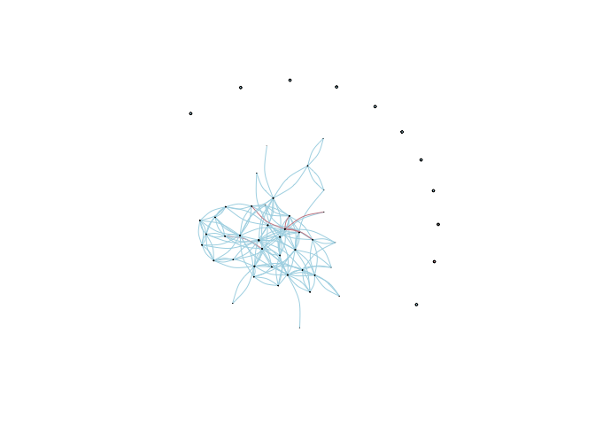
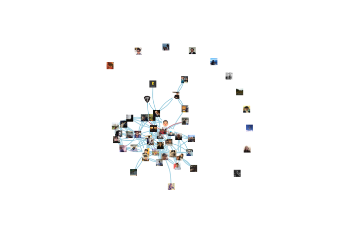

# 데이터 과학자와 함께 하는 제19대 대통령 선거

## 페북 친구 네트워크 시각화 [^kateo-facebook-viz] [^facebook-igraph]

[^facebook-igraph]: [How to analyze your Facebook friends network with R](http://blog.revolutionanalytics.com/2013/11/how-to-analyze-you-facebook-friends-network-with-r.html)

페북 친구 네트워크를 시각화하는 코드는 지속적으로 진화를 해왔다. `igraph`를 활용하여 정적 네트워크 그래프 시각화 방법을 지나서,

[rthreejs](https://github.com/bwlewis/rthreejs)를 활용하여 웹브라우져에서도 정말 가볍게 네트워크 시각화가 가능하게 되었다.

1. `getNetwork()` 함수를 활용해서 본인 네트워크 정보를 가져온다.
1. `graph_from_adjacency_matrix` 함수로 인접행렬(Adjacent Matrix)을 `igraph` 객체로 변환한다.
    - `igraph` 함수 `degree` 정보를 추가한다.
1. 3D 자바스크립트 [three.js](https://threejs.org/)를 R에서 구현한 `threejs` 팩키지 `graphjs` 함수를 활용하여 3차원 시각화한다.

~~~{.r}
# 0. 환경설정 ---------------------------------------------------
## 0.1. 팩키지 불러오기

## 0.2. 토큰 설정
me_token <- "EAACEdEose0cBAFJbE5lwlt8s9lbZAmx5Nsrw5W4FgXraBViIqHi4L4MYXJ6bVlhYo4HG2ZBwyK8ZCTzr5bqLLK9xeZA1qeRHj8XmwOU1rDNM2zOAEmiZAQZBHgD3HYZChf9xEWZBoaZBpEpT2O8zEZChsjoMLkByZCXQqAg9XHgxFGp2FlcClZBl6MwGJg1gIkvK6lQZD"

# 1. 데이터 긁어오기 ---------------------------------------------------

my_network <- getNetwork(token = me_token, format="adj.matrix")
~~~

~~~{.output}
Only friends who use the application will be returned
See ?getFriends for more details

~~~

~~~{.output}

  |                                                                       
  |                                                                 |   0%
  |                                                                       
  |=                                                                |   2%
  |                                                                       
  |===                                                              |   4%
  |                                                                       
  |====                                                             |   6%
  |                                                                       
  |=====                                                            |   8%
  |                                                                       
  |======                                                           |  10%
  |                                                                       
  |========                                                         |  12%
  |                                                                       
  |=========                                                        |  14%
  |                                                                       
  |==========                                                       |  16%
  |                                                                       
  |===========                                                      |  18%
  |                                                                       
  |=============                                                    |  20%
  |                                                                       
  |==============                                                   |  22%
  |                                                                       
  |===============                                                  |  24%
  |                                                                       
  |=================                                                |  25%
  |                                                                       
  |==================                                               |  27%
  |                                                                       
  |===================                                              |  29%
  |                                                                       
  |====================                                             |  31%
  |                                                                       
  |======================                                           |  33%
  |                                                                       
  |=======================                                          |  35%
  |                                                                       
  |========================                                         |  37%
  |                                                                       
  |=========================                                        |  39%
  |                                                                       
  |===========================                                      |  41%
  |                                                                       
  |============================                                     |  43%
  |                                                                       
  |=============================                                    |  45%
  |                                                                       
  |===============================                                  |  47%
  |                                                                       
  |================================                                 |  49%
  |                                                                       
  |=================================                                |  51%
  |                                                                       
  |==================================                               |  53%
  |                                                                       
  |====================================                             |  55%
  |                                                                       
  |=====================================                            |  57%
  |                                                                       
  |======================================                           |  59%
  |                                                                       
  |========================================                         |  61%
  |                                                                       
  |=========================================                        |  63%
  |                                                                       
  |==========================================                       |  65%
  |                                                                       
  |===========================================                      |  67%
  |                                                                       
  |=============================================                    |  69%
  |                                                                       
  |==============================================                   |  71%
  |                                                                       
  |===============================================                  |  73%
  |                                                                       
  |================================================                 |  75%
  |                                                                       
  |==================================================               |  76%
  |                                                                       
  |===================================================              |  78%
  |                                                                       
  |====================================================             |  80%
  |                                                                       
  |======================================================           |  82%
  |                                                                       
  |=======================================================          |  84%
  |                                                                       
  |========================================================         |  86%
  |                                                                       
  |=========================================================        |  88%
  |                                                                       
  |===========================================================      |  90%
  |                                                                       
  |============================================================     |  92%
  |                                                                       
  |=============================================================    |  94%
  |                                                                       
  |==============================================================   |  96%
  |                                                                       
  |================================================================ |  98%
  |                                                                       
  |=================================================================| 100%

~~~

~~~{.r}
# 2. 시각화 위한 데이터 변환 ---------------------------------------------------
# 인접행렬(Adjacent Matrix)를 igraph 객체로 변환
my_network_g <- graph_from_adjacency_matrix(my_network, weighted=TRUE)

my_network_g$degree <- degree(my_network_g)

# 3. 시각화 ---------------------------------------------------
# threejs 동적 페이스북 그래프
graphjs(my_network_g, 
        layout=layout_with_fr(my_network_g, dim=3), 
        vertex.label.cex=0.5,
        edge.arrow.size=1,
        edge.curved=TRUE,
        vertex.size = jsonlite::toJSON(my_network_g$degree/20),
        vertex.color="darkkhaki",
        edge.color="darkgrey",
        vertex.label=V(my_network_g)$name)
~~~

<!--html_preserve-->

<!--/html_preserve-->

~~~{.r}
# 애니메이션
# graphjs(my_network_g, 
#         layout=list(layout_randomly(my_network_g, dim=3),
#                     layout_on_sphere(my_network_g),
#                     layout_with_drl(my_network_g, dim=3),
#                     layout_with_fr(my_network_g, dim=3)),
#         main=list("random layout", "sphere layout", "drl layout", "fr layout"), fpl=300,
#         vertex.label.cex=0.5,
#         edge.arrow.size=3,
#         edge.curved=TRUE,
#         vertex.size = jsonlite::toJSON(my_network_g$degree/20),
#         vertex.color="darkkhaki",
#         edge.color="darkgrey",
#         vertex.label=V(my_network_g)$name)
~~~

## 페북 친구 프로파일 사진 시각화 [^kateo-facebook-viz]

[^kateo-facebook-viz]: [Facebook data collection and photo network visualization with Gephi and R](http://kateto.net/2014/04/facebook-data-collection-and-photo-network-visualization-with-gephi-and-r/)

페북 친구 네트워크를 친구 프로파일에 있는 사진을 노드에 넣어 시각화하는 것도 상기와 유사한 과정을 거치게 된다.
다만, 친구 사진 다운로드하는 과정이 추가되고 이를 `Gephi`, `igraph`, `qgraph` 등에 담는 과정이 추가될 따름이다.

~~~{.r}
# 0. 환경설정 ---------------------------------------------------
## 0.1. 팩키지 불러오기
#library(png)
#library(jpeg)
#library(igraph)

## 0.2. 토큰 설정
me_token <- "EAACEdEose0cBAFJbE5lwlt8s9lbZAmx5Nsrw5W4FgXraBViIqHi4L4MYXJ6bVlhYo4HG2ZBwyK8ZCTzr5bqLLK9xeZA1qeRHj8XmwOU1rDNM2zOAEmiZAQZBHgD3HYZChf9xEWZBoaZBpEpT2O8zEZChsjoMLkByZCXQqAg9XHgxFGp2FlcClZBl6MwGJg1gIkvK6lQZD"

# 1. 데이터 긁어오기 ---------------------------------------------------
## 1.1. 친구정보 가져오기
my_friends <- getFriends(token=me_token, simplify = FALSE)
~~~

~~~{.output}
Only friends who use the application will be returned
See ?getFriends for more details

~~~

~~~{.r}
## 1.2. 친구네트워크 가져오기
my_network <- getNetwork(token = me_token, format="adj.matrix") + 0
~~~

~~~{.output}
Only friends who use the application will be returned
See ?getFriends for more details

~~~

~~~{.output}

  |                                                                       
  |                                                                 |   0%
  |                                                                       
  |=                                                                |   2%
  |                                                                       
  |===                                                              |   4%
  |                                                                       
  |====                                                             |   6%
  |                                                                       
  |=====                                                            |   8%
  |                                                                       
  |======                                                           |  10%
  |                                                                       
  |========                                                         |  12%
  |                                                                       
  |=========                                                        |  14%
  |                                                                       
  |==========                                                       |  16%
  |                                                                       
  |===========                                                      |  18%
  |                                                                       
  |=============                                                    |  20%
  |                                                                       
  |==============                                                   |  22%
  |                                                                       
  |===============                                                  |  24%
  |                                                                       
  |=================                                                |  25%
  |                                                                       
  |==================                                               |  27%
  |                                                                       
  |===================                                              |  29%
  |                                                                       
  |====================                                             |  31%
  |                                                                       
  |======================                                           |  33%
  |                                                                       
  |=======================                                          |  35%
  |                                                                       
  |========================                                         |  37%
  |                                                                       
  |=========================                                        |  39%
  |                                                                       
  |===========================                                      |  41%
  |                                                                       
  |============================                                     |  43%
  |                                                                       
  |=============================                                    |  45%
  |                                                                       
  |===============================                                  |  47%
  |                                                                       
  |================================                                 |  49%
  |                                                                       
  |=================================                                |  51%
  |                                                                       
  |==================================                               |  53%
  |                                                                       
  |====================================                             |  55%
  |                                                                       
  |=====================================                            |  57%
  |                                                                       
  |======================================                           |  59%
  |                                                                       
  |========================================                         |  61%
  |                                                                       
  |=========================================                        |  63%
  |                                                                       
  |==========================================                       |  65%
  |                                                                       
  |===========================================                      |  67%
  |                                                                       
  |=============================================                    |  69%
  |                                                                       
  |==============================================                   |  71%
  |                                                                       
  |===============================================                  |  73%
  |                                                                       
  |================================================                 |  75%
  |                                                                       
  |==================================================               |  76%
  |                                                                       
  |===================================================              |  78%
  |                                                                       
  |====================================================             |  80%
  |                                                                       
  |======================================================           |  82%
  |                                                                       
  |=======================================================          |  84%
  |                                                                       
  |========================================================         |  86%
  |                                                                       
  |=========================================================        |  88%
  |                                                                       
  |===========================================================      |  90%
  |                                                                       
  |============================================================     |  92%
  |                                                                       
  |=============================================================    |  94%
  |                                                                       
  |==============================================================   |  96%
  |                                                                       
  |================================================================ |  98%
  |                                                                       
  |=================================================================| 100%

~~~

~~~{.r}
my_network_el <- as.data.frame(getNetwork(token = me_token, format = "edgelist"))
~~~

~~~{.output}
Only friends who use the application will be returned
See ?getFriends for more details

~~~

~~~{.output}

  |                                                                       
  |                                                                 |   0%
  |                                                                       
  |=                                                                |   2%
  |                                                                       
  |===                                                              |   4%
  |                                                                       
  |====                                                             |   6%
  |                                                                       
  |=====                                                            |   8%
  |                                                                       
  |======                                                           |  10%
  |                                                                       
  |========                                                         |  12%
  |                                                                       
  |=========                                                        |  14%
  |                                                                       
  |==========                                                       |  16%
  |                                                                       
  |===========                                                      |  18%
  |                                                                       
  |=============                                                    |  20%
  |                                                                       
  |==============                                                   |  22%
  |                                                                       
  |===============                                                  |  24%
  |                                                                       
  |=================                                                |  25%
  |                                                                       
  |==================                                               |  27%
  |                                                                       
  |===================                                              |  29%
  |                                                                       
  |====================                                             |  31%
  |                                                                       
  |======================                                           |  33%
  |                                                                       
  |=======================                                          |  35%
  |                                                                       
  |========================                                         |  37%
  |                                                                       
  |=========================                                        |  39%
  |                                                                       
  |===========================                                      |  41%
  |                                                                       
  |============================                                     |  43%
  |                                                                       
  |=============================                                    |  45%
  |                                                                       
  |===============================                                  |  47%
  |                                                                       
  |================================                                 |  49%
  |                                                                       
  |=================================                                |  51%
  |                                                                       
  |==================================                               |  53%
  |                                                                       
  |====================================                             |  55%
  |                                                                       
  |=====================================                            |  57%
  |                                                                       
  |======================================                           |  59%
  |                                                                       
  |========================================                         |  61%
  |                                                                       
  |=========================================                        |  63%
  |                                                                       
  |==========================================                       |  65%
  |                                                                       
  |===========================================                      |  67%
  |                                                                       
  |=============================================                    |  69%
  |                                                                       
  |==============================================                   |  71%
  |                                                                       
  |===============================================                  |  73%
  |                                                                       
  |================================================                 |  75%
  |                                                                       
  |==================================================               |  76%
  |                                                                       
  |===================================================              |  78%
  |                                                                       
  |====================================================             |  80%
  |                                                                       
  |======================================================           |  82%
  |                                                                       
  |=======================================================          |  84%
  |                                                                       
  |========================================================         |  86%
  |                                                                       
  |=========================================================        |  88%
  |                                                                       
  |===========================================================      |  90%
  |                                                                       
  |============================================================     |  92%
  |                                                                       
  |=============================================================    |  94%
  |                                                                       
  |==============================================================   |  96%
  |                                                                       
  |================================================================ |  98%
  |                                                                       
  |=================================================================| 100%

~~~

~~~{.r}
## 1.3. 친구 사진 다운로드 -----------------------------------------------------------------
dir.create("FbImages")

my_friends$picture.dld <- NA

for (i in 1:dim(my_friends)[1]) { 
  # Fb images 프로파일 사진 거의 대부분이 JPEG
  pic_ext <- ".jpg" 
  if(grepl(".gif$", my_friends$picture[i])) pic_ext <- ".gif"
  
  # 페북사용자 이름에 파일확장자 추가
  my_friends$picture.dld[i] <- paste0("FBImages/", sub(" ", "_", my_friends$name[i]), pic_ext)
  
  # UTF-8 인코딩을 갖지 않는 사용자 처리로직:
  if (Encoding(my_friends$name[i])=="UTF-8") {
    my_friends$picture.dld[i] <- paste0("FBImages/", "FbID_", my_friends$id[i], pic_ext) }
  
  download.file(my_friends$picture[i],  my_friends$picture.dld[i],  mode = 'wb')  
}

# 사진 정보 저장
colnames(my_network_el) <- c("Source", "Target")
my_friends$ID <- my_friends$name
my_friends$image <- gsub("FBImages/(*.)", "\\1", my_friends$picture.dld)

# write.csv(my_network_el, file="Facebook-friend-EDGES.csv", row.names=F)
# write.csv(my_friends, file="Facebook-friend-NODES.csv", row.names=F)

# 2. 네트워크 데이터 준비 ---------------------------------------------------

fb_net <- graph.adjacency(my_network)

my_friends$degree <- degree(fb_net)
my_friends$color <- "gray45"
my_friends$color[my_friends$gender=="female"] <- "lightpink3"
my_friends$color[my_friends$gender=="male"]   <- "lightblue"
my_network_el$color <- my_friends$color[match(my_network_el$Source, my_friends$name)]
~~~

시각화를 위해 사진이 들어가지 않는 그래프와 사진이 들어간 그래프를 넣어 시각화한다.

~~~{.r}
# 3. 페북 프로파일 사진 시각화 ---------------------------------------------------

## 3.1. 사진없이 시각화
l <- layout.fruchterman.reingold(fb_net, niter=10000, 
                                 area=vcount(fb_net)^2.3,
                                 repulserad=vcount(fb_net)^2.65)
~~~

~~~{.output}
Warning in layout_with_fr(structure(list(52, TRUE, c(0, 0, 0, 0, 0, 0, 0, :
Argument `area' is deprecated and has no effect

~~~

~~~{.output}
Warning in layout_with_fr(structure(list(52, TRUE, c(0, 0, 0, 0, 0, 0, 0, :
Argument `repulserad' is deprecated and has no effect

~~~

~~~{.r}
plot(fb_net, vertex.size=my_friends$degree/20, vertex.label=NA, 
     vertex.color=my_friends$color, edge.color=my_network_el$color,
     edge.width=1, edge.arrow.size=0, edge.curved=0.3,  layout=l)
~~~

~~~{.r}
## 3.2. 프로필 사진 넣어 시각화
# 레이아웃 -1에서 1로 척도 재조정
l <- layout.norm(l, -1, 1, -1, 1)

plot(fb_net, vertex.size=4, vertex.label=NA, edge.color=my_network_el$color, 
     vertex.shape="square",vertex.color="white", vertex.frame.color="white",
     edge.width=1.5, edge.arrow.size=0, edge.curved=0.2,  layout=l)

img.sc <- 0.05 #Image scaling
for (i in 1:dim(l)[1]) {
  img <- my_friends$picture.dld[i]
  img <- if(grepl(".jpg", img)) readJPEG(img) else "gray20"
  rasterImage(img, l[i,1]-img.sc, l[i,2]-img.sc, l[i,1]+img.sc, l[i,2]+img.sc)
}
~~~

