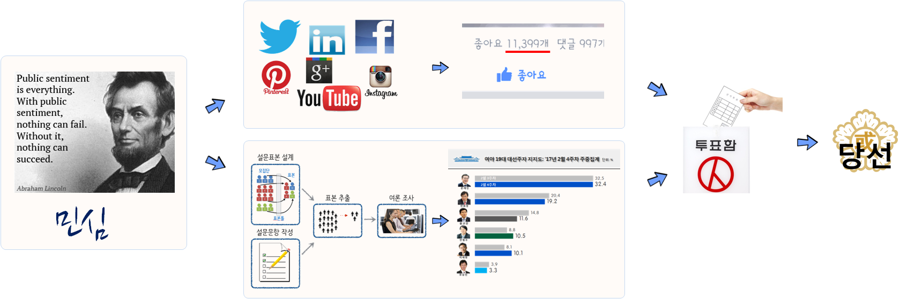

```{r setOptions, message=FALSE, include=FALSE}
source("tools/chunk-options.R")
options(warn=-1)
library(RCurl)
library(RJSONIO)
library(tidyverse)
library(tibble)
library(stringr)
library(lubridate)
library(plyr)
library(ggthemes)
library(extrafont)
library(rvest)
loadfonts()

fb_page_fan_likes <- read_csv("data/fb_page_fan_likes.csv")
survey_df_lng <- read_csv("data/fb_page_fan_survey.csv")
```

## 민심, 페북(SNS), 여론조사, 투표, 당선

민심이 SNS(페이스북 등)와 여론조사 지지율에 반영되고 그리고 종국에는 투표로 이어지게 된다.

> **"Public sentiment is everything. With public sentiment, nothing can fail; without it nothing can succeed. 
> Abraham Lincoln - first Lincoln-Douglas Debate at Ottawa, Illinois (21 August 1858)"**

링컨 대통령이 말씀하신 것과 같이 민심을 읽게 되면 대권을 얻게 되는데, 과거 여론조사는 민심을 읽어내는 한
방식이었다. 이제 민심을 읽을 수 있는 대안이 생겼다. SNS가 그것이고, 페이스북 좋아요가 민심을 표현한다.
따라서, 페이스북 좋아요를 읽게 되면 대권을 얻게 되는 대안이 생기게 되었고, 중간 여론조사기관이라는 중간관리자/업체를
들어내고 직접민주주의에 더 다가서게 되었다. 물론 페이스북 같은 또다른 형태의 중간관리자/업체가 생긴 것으로 볼 수도 있겠으나 
생긴지도 얼마되지 않았고, 특히 대한민국에서는 새로운 형태의 선거형태로 혜성처럼 등장했다.



## 페이스북 페이지 좋아요와 여론조사 

페이스북 좋아요와 여론조사 지지율을 관계를 살펴보기 위해서 
주요 대선 후보 여론조사 지지율과 각 후보 공식 페이스북 페이지 좋아요 추세를 시각화해서 살펴본다.

### 환경설정

```{r fb-survey-setup, eval=FALSE}
# 0. 환경설정 ---------------------------------------------------------------
library(RCurl)
library(RJSONIO)
library(tidyverse)
library(tibble)
library(stringr)
library(lubridate)
library(plyr)
library(ggthemes)
library(extrafont)
library(rvest)
loadfonts()
```

### 데이터 가져오기

페이스북 각 후보 페이지에서 일자별 팬 좋아요 데이터를 가져오고, 
여론조사 데이터는 나무위키 리얼미터 주별 여론조사 데이터를 긁어와서 활용한다.

```{r fb-survey-import, eval=FALSE}
# 1. 데이터 가져오기 ---------------------------------------------------------------
## 1.1. 페북 좋아요 --------------------------------------
fb_page_fan_likes <- read_csv("data/fb_page_fan_likes.csv")

## 1.2. 나무위키 지지율 데이터---------------------------------
url <- "https://namu.wiki/w/%EC%A0%9C19%EB%8C%80%20%EB%8C%80%ED%86%B5%EB%A0%B9%20%EC%84%A0%EA%B1%B0/%EC%97%AC%EB%A1%A0%EC%A1%B0%EC%82%AC"
Sys.setlocale("LC_ALL", "C")
survey_2016 <- read_html(url, encoding="utf-8") %>%
  html_nodes("table") %>%
  .[5] %>%
  html_table(fill=TRUE)

survey_2017 <- read_html(url, encoding="utf-8") %>%
  html_nodes("table") %>%
  .[7] %>%
  html_table(fill=TRUE)

### 1.2.1. 데이터프레임 변환---------------------------------------------------- 
# 2016년 정리
Sys.setlocale("LC_ALL", "Korean")

survey_2016_tbl <- do.call(rbind, lapply(survey_2016, data.frame, stringsAsFactors=FALSE))
names(survey_2016_tbl) <- survey_2016_tbl[1,]

survey_2016_df <- survey_2016_tbl %>% slice(2:53) %>% dplyr::select(`주차`,`문재인`, `이재명`, `안희정`, `안철수`, `유승민`,`손학규`) %>% 
  mutate(`문재인` = as.numeric(str_replace_all(`문재인`, "%", "")),
         `이재명` = as.numeric(str_replace_all(`이재명`, "%", "")),
         `안희정` = as.numeric(str_replace_all(`안희정`, "%", "")),
         `안철수` = as.numeric(str_replace_all(`안철수`, "%", "")),
         `유승민` = as.numeric(str_replace_all(`유승민`, "%", "")),
         `손학규` = as.numeric(str_replace_all(`손학규`, "%", "")),
         `황교안` = 0) %>% 
  mutate(wdate = seq(ymd("2016-01-01"), length = 52, by = "1 week")) %>% 
  dplyr::select(-`주차`)

# survey_2016_df[is.na(survey_2016_df)] <- 0

# 2017년 정리
survey_2017_tbl <- do.call(rbind, lapply(survey_2017, data.frame, stringsAsFactors=FALSE))
names(survey_2017_tbl) <- survey_2017_tbl[1,]

survey_2017_df <- survey_2017_tbl %>% slice(2:9) %>% dplyr::select(`주차`,`문재인`, `이재명`, `안희정`, `안철수`, `유승민`,`손학규`, `황교안`) %>% 
  mutate(`문재인` = as.numeric(str_replace_all(`문재인`, "%", "")),
         `이재명` = as.numeric(str_replace_all(`이재명`, "%", "")),
         `안희정` = as.numeric(str_replace_all(`안희정`, "%", "")),
         `안철수` = as.numeric(str_replace_all(`안철수`, "%", "")),
         `유승민` = as.numeric(str_replace_all(`유승민`, "%", "")),
         `손학규` = as.numeric(str_replace_all(`손학규`, "%", "")),
         `황교안` = as.numeric(str_replace_all(`황교안`, "%", ""))) %>% 
  mutate(wdate = seq(ymd("2017-01-01"), length = 8, by = "1 week")) %>%  
  dplyr::select(-`주차`)

# survey_2017_df[is.na(survey_2017_df)] <- 0

survey_df <- bind_rows(survey_2016_df, survey_2017_df) %>% 
  dplyr::rename(fdate = wdate) %>% dplyr::select(fdate, 손학규, 문재인, 안철수, 이재명, 황교안, 안희정)

survey_df_lng <- survey_df %>% gather(person, survey, -fdate)

# 2. 데이터 정리 ---------------------------------------------------------------

survey_df_lng <- survey_df_lng %>% 
  mutate(person = factor(person, 
                         levels=c("문재인","안희정", "이재명", "안철수", "손학규", "황교안")))

# write_csv(survey_df_lng, "output/fb_page_fan_survey.csv")
```

## 페북 좋아요 vs. 설문조사 시각화

주요 대선후보 페북 좋아요와 설문조사 데이터가 준비되면 `ggplot`을 통해 각 후보별로 
지지율과 페북 좋아요를 시각화한다.

```{r fb-survey-fb-viz, fig.width=12}
# 3. 시각화 ---------------------------------------------------------------
# 3.1. 페이스북 좋아요 ---------------------------------------------------------------
dlist <- unique(fb_page_fan_likes$fdate)

ggplot(fb_page_fan_likes, aes(x=fdate, y=fan_likes, color=person)) +
  geom_line(size=0.9) +
  # geom_vline(xintercept=as.numeric(ymd("2008-01-01")), linetype=2) +
  scale_x_date(breaks=seq(dlist[1], tail(dlist, n=1) + days(1), "30 day"),
               date_labels= "%y-%m", limits=c(dlist[1],tail(dlist, n=1) + days(1))) +
  scale_y_continuous(label=scales::comma) +
  theme_fivethirtyeight(base_family="NanumGothic") +
  theme(legend.position="none",
        plot.caption=element_text(hjust=0,size=7),
        plot.subtitle=element_text(face="italic"),
        axis.text=element_text(size=7.5),
        axis.text.x = element_text(angle = 90, hjust = 1))+
  labs(x="",y="",title="주요 대선후보 공식 페북 페이지 팬좋아요 추세",
       caption="\n 자료출처: facebook for develoopers, https://developers.facebook.com/tools/explorer") +
  facet_wrap(~person)
```

```{r fb-survey-fb-survey, fig.width=12}
# 3. 시각화 ---------------------------------------------------------------
# 3.2. 설문조사 ---------------------------------------------------------------
dlist <- unique(survey_df$fdate)

ggplot(survey_df_lng, aes(x=fdate, y=survey/100, color=person)) +
  geom_line(size=0.9) +
  # geom_vline(xintercept=as.numeric(ymd("2008-01-01")), linetype=2) +
  scale_x_date(breaks=seq(dlist[1], tail(dlist, n=1), "30 day"),
               date_labels= "%y-%m", limits=c(dlist[1],tail(dlist, n=1))) +
  scale_y_continuous(label=scales::percent) +
  theme_fivethirtyeight(base_family="NanumGothic") +
  theme(legend.position="none",
        plot.caption=element_text(hjust=0,size=7),
        plot.subtitle=element_text(face="italic"),
        axis.text=element_text(size=7.5),
        axis.text.x = element_text(angle = 90, hjust = 1))+
  labs(x="",y="",title="주요 대선후보 여론조사(리얼미터) 추세",
       caption="\n 자료출처: facebook for develoopers, https://developers.facebook.com/tools/explorer") +
  facet_wrap(~person)
```
