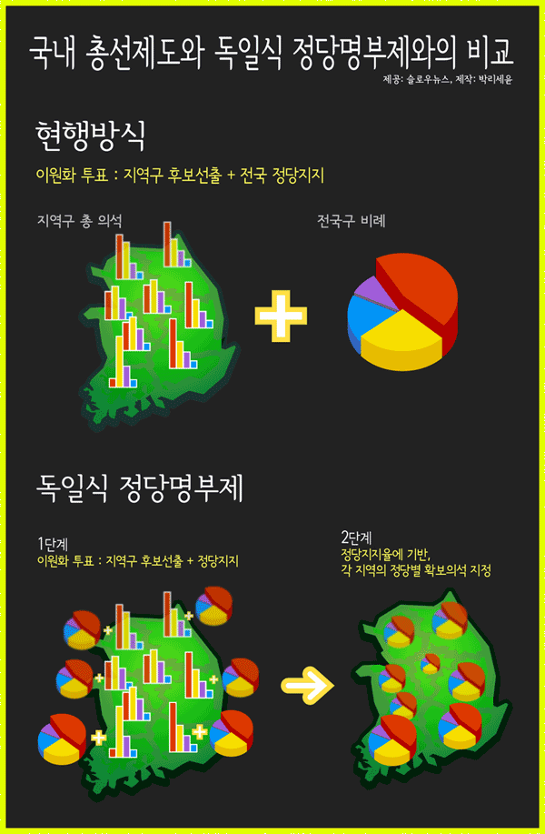
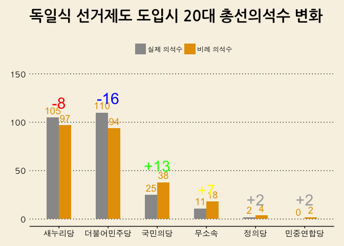
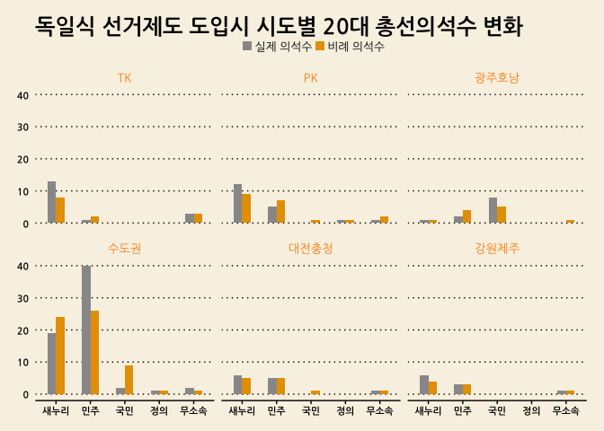
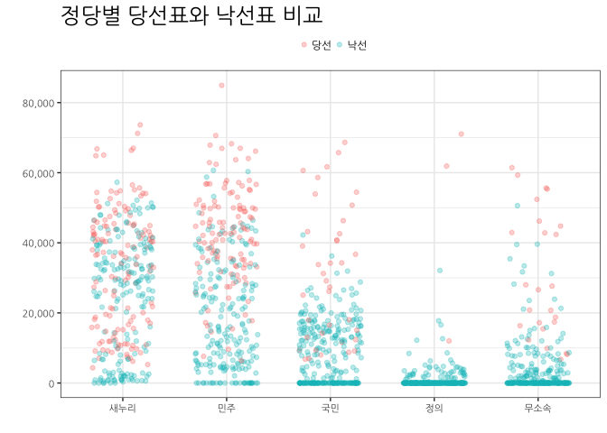
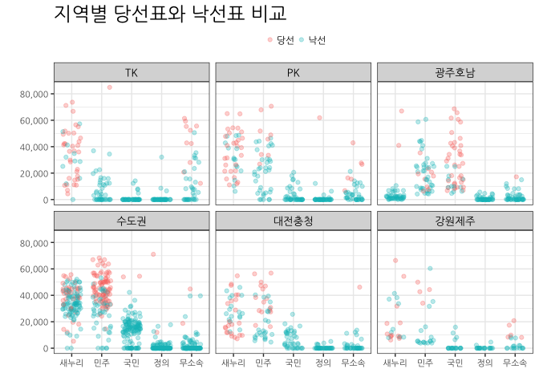
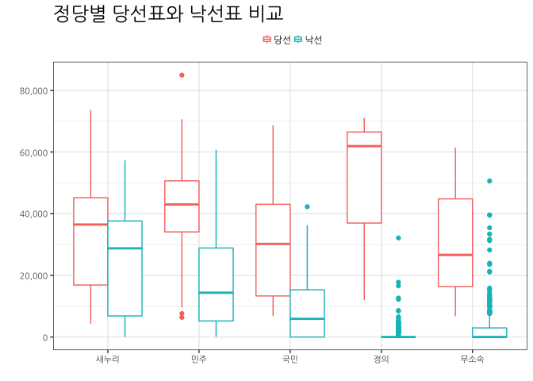
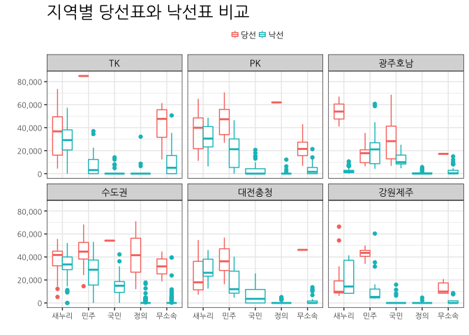

# 데이터 과학자와 함께 하는 제19대 대통령 선거

## 왜 독일식 비례대표제인가? [^hani-2014] 

지역구 의원(253명)을 선출하고 나서 비례국회의원(47명)을 선출하여 300명을 채우는 
현재 선거제도는 다음과 같은 문제점을 지속적으로 야기하고 있는 것으로 밝혀졌다.

- 인구대비 국회의원 수가 OECD 소속국가 기준으로 봤을 때 너무 적다.
- 각 정당을 대표하여 출마한 국회의원의 득표율과 각 정당별 의석수에 괴리가 심각하다.

[^hani-2014]: [19대 총선에 ‘독일식 비례대표제’ 적용해보니 양당 구도 흔들](http://www.hani.co.kr/arti/politics/assembly/664754.html)

[^slownes-2012]: [19대 총선에 독일식 정당명부제를 도입했다면, 특집](http://slownews.kr/2387)

## 국내 총선제도와 독일식 정당명부제 비교 [^slownes-2012]

국내 총선제도는 현재 이원화 투표를 통해 지역구 후보선출과 전국정당지지를 혼합한 형태다.
독일식 정당명부제 투표는 정당지지율에 기반하여 각 지역의 정당별 확보의석을 지정하는 방식이다.

## 20대 총선 

20대 총선을 통해 살펴본 지역구 투표율 분석을 통해 국회의원수 불일치 문제를 데이터를 통해 확인히 살펴볼 수 있다.
즉, 거대정당 새누리당과 더불어민주당은 실제 득표율보다 높은 의석수를 점하고, 소수정당인 국민의당, 정의당 등은 
실제 극표율보다 낮은 의석수를 갖게되어 소선구제 투표제도하에서는 제도적으로 양대 거대 정당의 출현이 반복되고 있지만,
촛불 민의는 그 이전에도 다당제를 선호하는 방식으로 표출되었다.

### 20대 총선 데이터

중앙선거관리위원회 [분야별 정보 > 선거정보 > 자료실](http://www.nec.go.kr/portal/bbs/list/B0000338.do?menuNo=200061)에서 
제20대 국회의원선거 투표구별 개표결과 자료를 다운로드 받는다. 제20대 국회의원선거 정당별 득표수 현황(지역구 기준)도 제공되어 
엑셀 파일을 데이터프레임으로 변환한 결과가 맞는지 사전 검정하는 것도 데이터 정합성 확보를 위해 상호 검정한다.

~~~{.r}
# 0. 환경설정-------------------------------------------
library(tidyverse)
library(readxl)
library(RColorBrewer)
library(scales)
library(stringr)

# 1. 엑셀 --> 데이터프레임 변환 -------------------------------------------
# http://stackoverflow.com/questions/28549045/dplyr-select-error-found-duplicated-column-name
read_19_xlsx <- function(filename){
  temp <- read_excel(path = filename, skip=4)
  names(temp)[c(1:4, 16:17)] <-  c("읍면동명", "투표구명", "선거인수", "투표수", "무효\n투표수", "기권수")
  temp <- temp[, str_detect(names(temp), "^(?!\n)")] %>% slice(1)
  names(temp) <- str_replace_all(names(temp), "\n(.*)", "")
  valid_column_names <- make.names(names=names(temp), unique=TRUE, allow_ = TRUE)
  names(temp) <- valid_column_names
  temp <- temp %>% mutate_each(funs(gsub(",", "", .)), 선거인수:기권수) %>% 
    mutate_each(funs(as.numeric(.)), 선거인수:기권수)
  temp$무당파 <- rowSums(temp[, grepl("무소속", colnames(temp))])
  temp <- temp[, names(temp) %in% c("선거인수", "투표수", "새누리당", "민주통합당", "자유선진당", "통합진보당", "창조한국당", "국민생각", "대국민중심당", "국가재건친박연합", "국민행복당", "기독당", "녹색당", "대한국당", "미래연합", "불교연합당", "정통민주당", "진보신당", "청년당", "한국기독당", "한국문화예술당", "한나라당", "무당파")]
  return(temp)
}

read_20_xlsx <- function(filename){
  temp <- read_excel(path = filename, skip=4)
  names(temp)[c(1:4, 27:28)] <-  c("읍면동명", "투표구명", "선거인수", "투표수", "무효\n투표수", "기권수")
  valid_column_names <- make.names(names=names(temp), unique=TRUE, allow_ = TRUE)
  names(temp) <- valid_column_names
  temp <- temp[, str_detect(names(temp), "^(?!NA)")] %>% slice(2)
  temp$무당파 <- rowSums(temp[, grepl("무소속", colnames(temp))])
  names(temp) <- str_replace_all(names(temp), "\\..(.*)", "")  
  temp <- temp[, names(temp) %in% c("선거인수", "투표수", "새누리당", "더불어민주당", "국민의당", "정의당", "기독자유당", "민주당", "가자코리아", "일제·위안부·인권정당", "개혁국민신당", "고용복지연금선진화연대", "공화당", "그린불교연합당", "기독민주당", "노동당", "녹색당", "민중연합당", "복지국가당", "친반통일당", "통일한국당", "한국국민당", "한나라당", "무당파")]
}

dir_name <- list.files("data/제20대 국회의원선거 투표구별 개표결과/지역구/")

dir_file_lists <- list()

for(i in 1:length(dir_name)) {
  dir_file_lists[[i]] <- paste0("data/제20대 국회의원선거 투표구별 개표결과/지역구/", dir_name[i], "/",list.files(path=paste0("data/제20대 국회의원선거 투표구별 개표결과/지역구/", dir_name[i]), pattern="*.xlsx"))
  print(dir_file_lists[[i]])
}

# 리스트를 언리스트
dir_file_unlists <- unlist(dir_file_lists)

# 엑셀파일을 데이터프레임으로 변환
for (i in 1:length(dir_file_unlists)) {
  assign(dir_file_unlists[i], read_20_xlsx(dir_file_unlists[i]))
}

c_name <- list()
for(i in 1:length(dir_file_unlists)) {
  c_name[[i]] <- as.name(dir_file_unlists[i])
}

df_dat <- do.call(plyr::rbind.fill, c_name)
df_sigun <- as.data.frame(dir_file_unlists)

df <- bind_cols(df_sigun, df_dat)

# write_csv(df, "output/congressmen_20.csv")
~~~

### 소선구제와 독일식 비례대표제 기준 정당별 시각화

엑셀 파일을 데이터 프레임으로 저장한 후 엑셀로 일부 전처리를 한 후 파일을 불러 읽어 드리고 시각화한다.
소선구제와 독일식 비례대표제 기준으로 정당별 시각화한다. 
거대 양당은 득표율보다 많은 의석수를 갖고, 상대적으로 중소 정당은 높은 득표율을 갖고 있음에도 불구하고 
그에 걸맞지 못한 득표를 갖는 폐혜가 나타나고 있다.

~~~{.r}
# 1. 데이터 가져오기 -------------------------------------------

vote_20_df <- read_excel("data/제20대_총선_종합.xlsx", sheet="Sheet1") %>% dplyr::rename("무소속"=무당파, sido=시도)

# 2. 데이터 전처리 -------------------------------------------

vote_20_df <- vote_20_df %>% mutate(sido = str_replace_all(sido, "[0-9]", ""))

datatable(vote_20_df)
~~~

<!--html_preserve-->

<!--/html_preserve-->

~~~{.r}
sido_party_tbl <- vote_20_df %>% dplyr::select(-선거구) %>% group_by(sido) %>% summarise_each(funs(sum))

sido_party_tbl_lng <- sido_party_tbl %>% gather(party, votes, -sido)

party_stat_tbl <- sido_party_tbl_lng %>% group_by(party) %>% summarise(vote_sum = sum(votes)) %>% arrange(desc(vote_sum)) %>% 
  dplyr::filter(!(party %in% c("선거인수", "투표수"))) %>% 
  mutate(vote_tlt = sum(vote_sum),
         pcnt = vote_sum/vote_tlt,
         cumpcnt = cumsum(pcnt),
         est_seats = round(253 * pcnt,0))

actual_seats_df <- tibble(party=c("새누리당", "더불어민주당", "국민의당", "무소속", "정의당", 
                                      "민중연합당", "노동당", "녹색당", "민주당", "친반통일당", "공화당", 
                                      "한나라당", "고용복지연금선진화연대", "기독자유당", "복지국가당", 
                                      "한국국민당", "통일한국당"),
                              act_seats = c(105, 110, 25, 11, 2, 
                                            0, 0, 0, 0, 0, 0, 0, 0, 0, 0, 0, 0))

party_stat_tbl <- bind_cols(party_stat_tbl, actual_seats_df[,2])

party_stat_tbl <- party_stat_tbl %>% mutate(win_lose = act_seats - est_seats) %>% 
  dplyr::filter(party %in% c("새누리당", "더불어민주당", "국민의당", "무소속", "정의당", "민중연합당"))

party_stat_tbl_lng <- party_stat_tbl %>% dplyr::select(party, act_seats, est_seats) %>% gather(type, value, -party)

party_stat_tbl_lng <- party_stat_tbl_lng %>% 
  mutate(party = factor(party, levels=c("새누리당", "더불어민주당", "국민의당", "무소속", "정의당", "민중연합당")),
         type = plyr::revalue(type, c(act_seats = "실제 의석수",
                                      est_seats = "비례 의석수"))) %>% 
  mutate(type = factor(type, levels=c("실제 의석수", "비례 의석수")))

# 3. 시각화 -------------------------------------------
# 3.1. 의석수 변화

ggplot(party_stat_tbl_lng, aes(party, value, fill=type, label=value)) +
  geom_bar(stat="identity", width=0.5, position ="dodge") + theme_wsj(base_family='AppleGothic') + 
  scale_y_continuous(labels = comma, limits = c(0, 150)) +
  labs(x="",y="",title="독일식 선거제도 도입시 20대 총선의석수 변화",
       subtitle="") +
  theme(legend.position="top", plot.caption=element_text(hjust=0,size=8), 
        plot.subtitle=element_text(face="italic"),
        axis.text=element_text(size=11.5), legend.title=element_blank(),
        plot.title = element_text(size=22, family="NanumGothic"),
        text=element_text(family="AppleGothic")) +
  scale_fill_manual(values=c("#999999", "#E69F00")) +
  geom_text(aes(label = value), size = 5.0, vjust = -0.5, color="#E69F00", position=position_dodge(width=0.5), hjust=0.5) +
  annotate("text", x = 1, y = 120, label = "-8", color="red", size=8) +
  annotate("text", x = 2, y = 125, label = "-16", color="blue", size=8) +
  annotate("text", x = 3, y = 55, label = "+13", color="green", size=8) +
  annotate("text", x = 4, y = 30, label = "+7", color="yellow", size=8) +
  annotate("text", x = 5, y = 20, label = "+2", color="darkgray", size=8) +
  annotate("text", x = 6, y = 20, label = "+2", color="darkgray", size=8)
~~~

### 소선구제와 독일식 비례대표제 기준 정당별 지역별 시각화

전반적으로 거대 양당은 득표율보다 많은 의석수를 갖고, 상대적으로 중소 정당은 높은 득표율을 갖고 있음에도 불구하고 
그에 걸맞지 못한 득표를 갖는 폐혜가 나타나고 있는데, 지역별로 폐혜가 나타나는 곳을 집중적으로 살펴보자.
지역을 편의상 6개 facet에 맞춰 통폐합한다.

- 수도권 : 서울, 경기, 인천
- 대전충청 : 충남, 충북, 대전, 세종
- PK : 경남, 부산
- TK : 대구, 울산, 경북
- 광주호남 : 광주, 전북, 전남
- 강원제주 : 강원, 제주

~~~{.r}
# 1. 데이터 가져오기 -------------------------------------------
## 1.1. 비례 의석수
vote_20_df <- read_excel("data/제20대_총선_종합.xlsx", sheet="Sheet1") %>% dplyr::rename("무소속"=무당파, sido=시도)

## 1.2. 실제 의석수
# url <- "https://ko.wikipedia.org/wiki/%EB%8C%80%ED%95%9C%EB%AF%BC%EA%B5%AD_%EC%A0%9C20%EB%8C%80_%EA%B5%AD%ED%9A%8C%EC%9D%98%EC%9B%90_%EC%84%A0%EA%B1%B0"
# Sys.setlocale("LC_ALL", "C")
# 
# seats_20_df <- url %>%
#   read_html() %>%
#   html_nodes(xpath='//*[@id="mw-content-text"]/table[29]') %>%
#   html_table(fill = TRUE) %>% 
#   .[[1]]
# Sys.setlocale("LC_ALL", "Korean")
# 
# names(seats_20_df) <- c("시도", "새누리당", "더불어민주당", "국민의당", "정의당", "무소속", "합　계")
# write_csv(seats_20_df, "data/총선20대_의석수.csv")
seats_20_df <- read_csv("data/총선20대_의석수.csv")
~~~

~~~{.output}
Parsed with column specification:
cols(
  시도 = col_character(),
  새누리당 = col_integer(),
  더불어민주당 = col_integer(),
  국민의당 = col_integer(),
  정의당 = col_integer(),
  무소속 = col_integer(),
  `합　계` = col_integer()
)

~~~

~~~{.r}
seats_20_df[is.na(seats_20_df)] <- 0

datatable(seats_20_df)
~~~

<!--html_preserve-->

<!--/html_preserve-->

~~~{.r}
# 2. 데이터 전처리 -------------------------------------------
## 2.1. 비례 의석수
vote_20_df <- vote_20_df %>% mutate(sido = str_replace_all(sido, "[0-9]", ""))

sido_party_tbl <- vote_20_df %>% dplyr::select(-선거구) %>% group_by(sido) %>% summarise_each(funs(sum))
sido_party_tbl <- sido_party_tbl %>% gather(party, votes, -sido)

sido_party_stat <- sido_party_tbl %>% group_by(sido, party) %>% summarise(vote_sum = sum(votes)) %>% arrange(desc(vote_sum)) %>% 
  dplyr::filter(!(party %in% c("선거인수", "투표수"))) %>% 
  mutate(vote_tlt = sum(vote_sum),
         pcnt = vote_sum/vote_tlt,
         cumpcnt = cumsum(pcnt),
         est_seats = 0) %>% 
  mutate(est_seats = ifelse(sido=="강원", floor(0.5 + pcnt *  8), est_seats)) %>% 
  mutate(est_seats = ifelse(sido=="경기", floor(0.5 + pcnt * 60), est_seats)) %>% 
  mutate(est_seats = ifelse(sido=="경남", floor(0.5 + pcnt * 16), est_seats)) %>% 
  mutate(est_seats = ifelse(sido=="경북", floor(0.5 + pcnt * 13), est_seats)) %>% 
  mutate(est_seats = ifelse(sido=="광주", floor(0.5 + pcnt *  8), est_seats)) %>% 
  mutate(est_seats = ifelse(sido=="대구", floor(0.5 + pcnt * 12), est_seats)) %>% 
  mutate(est_seats = ifelse(sido=="대전", floor(0.5 + pcnt *  7), est_seats)) %>% 
  mutate(est_seats = ifelse(sido=="부산", floor(0.5 + pcnt * 18), est_seats)) %>% 
  mutate(est_seats = ifelse(sido=="서울", floor(0.5 + pcnt * 49), est_seats)) %>% 
  mutate(est_seats = ifelse(sido=="세종", floor(0.5 + pcnt *  1), est_seats)) %>% 
  mutate(est_seats = ifelse(sido=="울산", floor(0.5 + pcnt *  6), est_seats)) %>% 
  mutate(est_seats = ifelse(sido=="인천", floor(0.5 + pcnt * 13), est_seats)) %>% 
  mutate(est_seats = ifelse(sido=="전남", floor(0.5 + pcnt * 10), est_seats)) %>% 
  mutate(est_seats = ifelse(sido=="전북", floor(0.5 + pcnt * 10), est_seats)) %>% 
  mutate(est_seats = ifelse(sido=="제주", floor(0.5 + pcnt *  3), est_seats)) %>% 
  mutate(est_seats = ifelse(sido=="충남", floor(0.5 + pcnt * 11), est_seats)) %>% 
  mutate(est_seats = ifelse(sido=="충북", floor(0.5 + pcnt *  8), est_seats))

sido_party_stat <- sido_party_stat %>% ungroup %>% 
  dplyr::filter(party %in% c("새누리당", "더불어민주당", "국민의당", "무소속", "정의당")) %>% 
  dplyr::select(sido, party, est_seats) 
  
## 2.2. 실제 의석수

seats_20_df <- seats_20_df %>% dplyr::select(-`합　계`) %>% gather(party, act_seats, -시도) %>% 
  dplyr::select(sido=시도, party, act_seats)

## 2.3. 비례 + 실제 의석수

precinct_20_df <- left_join(sido_party_stat, seats_20_df) %>% 
  mutate(sido = plyr::revalue(sido, c("서울" = "수도권" ,
                                      "경기" = "수도권" ,
                                      "인천" = "수도권" ,
                                      "충남" = "대전충청" ,
                                      "충북" = "대전충청" ,
                                      "대전" = "대전충청" ,
                                      "세종" = "대전충청" ,
                                      "경남" = "PK"   ,
                                      "부산" = "PK"   ,
                                      "대구" = "TK"   ,
                                      "울산" = "TK"   ,
                                      "경북" = "TK"   ,
                                      "광주" = "광주호남" ,
                                      "전북" = "광주호남" ,
                                      "전남" = "광주호남" ,
                                      "강원" = "강원제주",
                                      "제주" = "강원제주"))) %>% 
  mutate(sido=factor(sido, levels=c("TK", "PK", "광주호남", "수도권", "대전충청", "강원제주"))) %>% 
  mutate(party = plyr::revalue(party, c("새누리당" = "새누리",
                                        "더불어민주당" ="민주",
                                        "국민의당" = "국민",
                                        "정의당" = "정의",
                                        "무소속" = "무소속"))) %>% 
  mutate(party=factor(party, levels=c("새누리", "민주", "국민", "정의", "무소속")))
~~~

~~~{.output}
Joining, by = c("sido", "party")

~~~

~~~{.r}
precinct_20_df_lng <- precinct_20_df %>% 
  gather(type, value, -sido, -party) %>% 
  mutate(type = plyr::revalue(type, c("est_seats" = "비례 의석수",
                                      "act_seats" = "실제 의석수"))) %>% 
  mutate(type = factor(type, levels=c("실제 의석수", "비례 의석수")))

# 3. 시각화 -------------------------------------------

# 3.2. 시도 

ggplot(precinct_20_df_lng, 
       aes(party, value, fill=type, label=value)) +
  geom_bar(stat="identity", width=0.5, position ="dodge") + theme_wsj(base_family='NanumGothic') +
  facet_wrap(~sido) +
  theme(legend.position=c(0.5, 1.135), plot.caption=element_text(hjust=0,size=8), 
        plot.subtitle=element_text(face="italic"),
        axis.text=element_text(size=8), 
        legend.title=element_blank(),
        axis.text.x = element_text(angle = 00, hjust = 0.5),
        plot.title = element_text(size=18, family="NanumGothic"),
        text=element_text(family="NanumGothic"),
        strip.text.x = element_text(size = 10, colour = "darkorange", angle = 0),
        legend.key.width = unit(0.3, "cm"),
        legend.key.height = unit(0.3, "cm")) +
  scale_fill_manual(values=c("#999999", "#E69F00")) +
  labs(x="",y="",title="독일식 선거제도 도입시 시도별 20대 총선의석수 변화",
       subtitle="") 
~~~

  
### 선거구별 당선과 낙선 비교 (상자그림)

각 정당별 평균 당선표와 낙선표를 지역별로 살펴보면, 새누리가 당선과 낙선 표차이가 가장 작고,
민주당와 국민의당, 정의당의 당선과 낙선 표차이가 크게 벌어지는 것이 확인된다.

지역별로 보면 민주당의 경우 낙선자의 표가 당선자의 표보다 평균적으로 더 많은 기현상도 광주호남에서 관찰된다.
TK지역에서는 5만표를 얻고도 낙선한 사례가 있다. 전주시병과 순천시가 그곳이다.
`precinct_20_df %>% dplyr::filter(winlose=="낙선" & sido=="광주호남" & vote >50000)`

~~~{.r}
# 1. 데이터 가져오기 -------------------------------------------
## 1.1. 실제 지역구별 득표
vote_20_df <- read_excel("data/제20대_총선_종합.xlsx", sheet="Sheet1") %>% dplyr::rename("무소속"=무당파, sido=시도)
vote_20_df <- vote_20_df %>% mutate(sido = str_replace_all(sido, "[0-9]", "")) %>% 
  dplyr::select(sido, precinct = 선거구, 새누리당, 더불어민주당, 무소속, 국민의당, 정의당) %>% 
  gather(party, vote, -sido, -precinct)

## 1.2. 당선 및 낙선 
vote_20_rank <- vote_20_df %>% group_by(sido, precinct) %>% 
  mutate(the_rank = rank(-vote, ties.method="random")) %>% 
  arrange(sido, precinct)

## 2.3. 지역 및 당선/낙선
precinct_20_df <- vote_20_rank %>% ungroup %>%  mutate(sido = plyr::revalue(sido, c("서울" = "수도권" ,
                                      "경기" = "수도권" ,
                                      "인천" = "수도권" ,
                                      "충남" = "대전충청" ,
                                      "충북" = "대전충청" ,
                                      "대전" = "대전충청" ,
                                      "세종" = "대전충청" ,
                                      "경남" = "PK"   ,
                                      "부산" = "PK"   ,
                                      "대구" = "TK"   ,
                                      "울산" = "TK"   ,
                                      "경북" = "TK"   ,
                                      "광주" = "광주호남" ,
                                      "전북" = "광주호남" ,
                                      "전남" = "광주호남" ,
                                      "강원" = "강원제주",
                                      "제주" = "강원제주"))) %>% 
  mutate(sido=factor(sido, levels=c("TK", "PK", "광주호남", "수도권", "대전충청", "강원제주"))) %>% 
  mutate(party = plyr::revalue(party, c("새누리당" = "새누리",
                                        "더불어민주당" ="민주",
                                        "국민의당" = "국민",
                                        "정의당" = "정의",
                                        "무소속" = "무소속"))) %>% 
  mutate(party=factor(party, levels=c("새누리", "민주", "국민", "정의", "무소속", "투표수"))) %>% 
  mutate(winlose = ifelse(the_rank == 1, "당선", "낙선"),
         winlose = factor(winlose, levels=c("당선", "낙선")))

# 3. 시각화 -------------------------------------------
# 3.3. 정당별
ggplot(precinct_20_df, 
       aes(party, vote, color=factor(winlose))) +
  geom_point(position = position_jitter(w = 0.3, h = 0), alpha=0.3) + theme_bw(base_family='NanumGothic') +
  scale_y_continuous(labels = comma, limits = c(0, 85000)) +
  theme(legend.position="top", plot.caption=element_text(hjust=0,size=8), 
        plot.subtitle=element_text(face="italic"),
        axis.text=element_text(size=8), 
        legend.title=element_blank(),
        axis.text.x = element_text(angle = 00, hjust = 0.5),
        plot.title = element_text(size=18, family="NanumGothic"),
        text=element_text(family="NanumGothic"),
        strip.text.x = element_text(size = 10, colour = "black", angle = 0),
        legend.key.width = unit(0.3, "cm"),
        legend.key.height = unit(0.3, "cm")) +
  scale_fill_manual(values=c("#999999", "#E69F00")) +
  labs(x="",y="",title="정당별 당선표와 낙선표 비교")
~~~

~~~{.r}
# 3.4. 정당별, 지역별 당선과 낙선
ggplot(precinct_20_df, 
       aes(party, vote, color=factor(winlose))) +
  geom_point(position = position_jitter(w = 0.3, h = 0), alpha=0.3) + theme_bw(base_family='NanumGothic') +
  scale_y_continuous(labels = comma, limits = c(0, 85000)) +
  facet_wrap(~sido) +
  theme(legend.position="top", plot.caption=element_text(hjust=0,size=8), 
        plot.subtitle=element_text(face="italic"),
        axis.text=element_text(size=8), 
        legend.title=element_blank(),
        axis.text.x = element_text(angle = 00, hjust = 0.5),
        plot.title = element_text(size=18, family="NanumGothic"),
        text=element_text(family="NanumGothic"),
        strip.text.x = element_text(size = 10, colour = "black", angle = 0),
        legend.key.width = unit(0.3, "cm"),
        legend.key.height = unit(0.3, "cm")) +
  scale_fill_manual(values=c("#999999", "#E69F00")) +
  labs(x="",y="",title="지역별 당선표와 낙선표 비교")
~~~

### 선거구별 당선과 낙선 비교 (상자그림)

~~~{.r}
# 3.1. 정당별 
ggplot(precinct_20_df, 
       aes(party, vote, color=factor(winlose))) +
  geom_boxplot() + theme_bw(base_family='NanumGothic') +
  scale_y_continuous(labels = comma, limits = c(0, 85000)) +
  theme(legend.position="top", plot.caption=element_text(hjust=0,size=8), 
        plot.subtitle=element_text(face="italic"),
        axis.text=element_text(size=8), 
        legend.title=element_blank(),
        axis.text.x = element_text(angle = 00, hjust = 0.5),
        plot.title = element_text(size=18, family="NanumGothic"),
        text=element_text(family="NanumGothic"),
        strip.text.x = element_text(size = 10, colour = "black", angle = 0),
        legend.key.width = unit(0.3, "cm"),
        legend.key.height = unit(0.3, "cm")) +
  scale_fill_manual(values=c("#999999", "#E69F00")) +
  labs(x="",y="",title="정당별 당선표와 낙선표 비교")
~~~

~~~{.r}
# 3.2. 정당별, 지역별 당선과 낙선
ggplot(precinct_20_df, 
       aes(party, vote, color=factor(winlose))) +
  geom_boxplot() + theme_bw(base_family='NanumGothic') +
  scale_y_continuous(labels = comma, limits = c(0, 85000)) +
  facet_wrap(~sido) +
  theme(legend.position="top", plot.caption=element_text(hjust=0,size=8), 
        plot.subtitle=element_text(face="italic"),
        axis.text=element_text(size=8), 
        legend.title=element_blank(),
        axis.text.x = element_text(angle = 00, hjust = 0.5),
        plot.title = element_text(size=18, family="NanumGothic"),
        text=element_text(family="NanumGothic"),
        strip.text.x = element_text(size = 10, colour = "black", angle = 0),
        legend.key.width = unit(0.3, "cm"),
        legend.key.height = unit(0.3, "cm")) +
  scale_fill_manual(values=c("#999999", "#E69F00")) +
  labs(x="",y="",title="지역별 당선표와 낙선표 비교")
~~~

