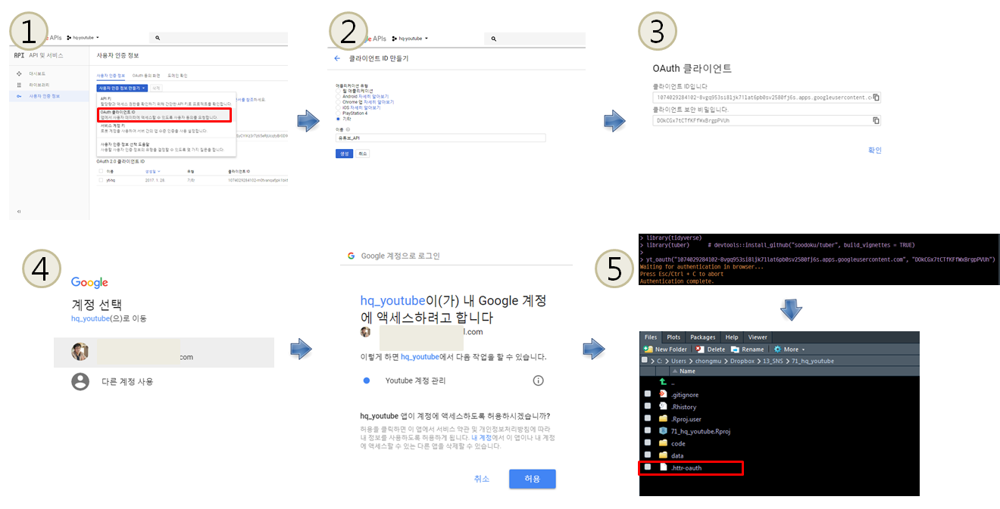

```{r setOptions, message=FALSE, include=FALSE}
source("tools/chunk-options.R")
knitr::opts_chunk$set(echo = TRUE, warning=FALSE, message=FALSE)

library(tidyverse)
library(readxl)
library(ggthemes)
library(ggrepel)
library(DT)
library(plotly)
library(extrafont)
loadfonts()

diff_df <- readRDS("data/diff_df.rds")
```

# 1. 구글 SNS 서비스 {#google-sns-service}

페이스북과의 경쟁에서는 실질적으로 패배를 했지만, 그래도 구글은 SNS 관련 압도적인 서비스가 몇개 존재한다.
대표적인 것이 [유튜브](https://www.youtube.com/), [구글 트렌드](https://trends.google.com/trends/)가 그것이다.
직접 유튜브나 구글 트렌드 웹페이지에서 데이터를 긁어들이는 대신 수년동안 개발된 R 팩키지가 있어 이를 활용하면 수월하다.

- 유튜브: [tuber: Client for the YouTube API](https://cran.r-project.org/web/packages/tuber/index.html)
- 구글 트렌드: [R functions to perform and display Google Trends queries](https://github.com/PMassicotte/gtrendsR)

<div class = "row">
  <div class = "col-md-6">

[SocialMediaLab: Tools for Collecting Social Media Data and Generating Networks for Analysis](https://cran.r-project.org/web/packages/SocialMediaLab/index.html) 팩키지도 
유튜브에서 데이터를 가져오는데 유용하다. 이후 후속 분석에 대해서 인도인이 만든 유튜브 동영상이 있으니 참조하면 좋을 듯 싶다.

  </div>
  <div class = "col-md-6">

<iframe width="300" height="180" src="https://www.youtube.com/embed/3gJngOCyrZg" frameborder="0" allow="autoplay; encrypted-media" allowfullscreen></iframe>

  </div>
</div>


# 2. 유튜브 [^youtube-channel] [^creation-stories] [^youtube-election] {#google-youtube}

[^youtube-channel]: [insightR: Using the tuber package to analyse a YouTube channel, Posted on December 11, 2017](https://insightr.wordpress.com/2017/12/11/using-the-tuber-package-to-analyse-a-youtube-channel/)

[^creation-stories]: [A Random Walker, Creation Stories: Analyzing YouTube Data With R OCTOBER 11, 2017 BY ADAM WALKER](https://www.arandomwalker.com/blog/2017/10/11/creation-stories-analyzing-youtube-data-with-r)

[^youtube-election]: [Florian Teschner (2016), Analysing the US election using Youtube data](http://flovv.github.io/US_Election/)

[Google APIs](https://console.developers.google.com)를 통해서 구글에서 제공하는 다양한 서비스에 접속할 수 있다.
너무 나도 다양하고 많은 서비스가 제공되기 때문에 **인증(Authentication)**을 통해 구글 시스템 접근 시, 등록된 사용자인지 여부를 확인하는 것을 
거치고 나서 **인가(Authorization)**과정을 거쳐 인증된 사용자에게 권한을 부여하여 권한에따라 사용 가능한 서비스가 확정된다.

- [Google Cloud Platform](https://console.developers.google.com) 접속한다.
- 좌측메뉴 `API APIs & Servcies`를 클릭한다.
- `Credentials`를 클릭한다.
- `Credentials` &rarr; `Create credentials`를 클릭해서 API 인증키를 생성한다.


``` {r youtube-authorization, eval = FALSE}
> library(tidyverse)
> library(tuber)      # devtools::install_github("soodoku/tuber", build_vignettes = TRUE)
> 
> yt_oauth("1074785124544102-8vgq953si8lat6sv2580fj6s.apps.googleusercontent.com", "DOkx7tCKFfWrgpPVUh")
Waiting for authentication in browser...
Press Esc/Ctrl + C to abort
Authentication complete.
```

다음 단계로 생성된 구글 API키를 `tuber` 팩키지에서 사용하는 `yt_oauth()` 함수를 통해 인증과정을 거친다.
그러고 나면 `.httr-oauth` 파일이 하나 생성되면 준비가 되었다. 
인증과정에 문제가 생기는 경우 `.httr-oauth` 파일을 제거하고 다시 앞의 코드를 실행시키게 되면 
원활히 다음 단계로 넘어갈 수 있다.




