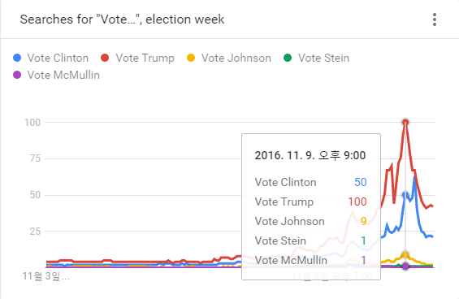

```{r setOptions, message=FALSE, include=FALSE}
source("tools/chunk-options.R")
# 0. 환경설정-------------------------------------------
library(gtrendsR)
library(tidyverse)
library(extrafont)
loadfonts()
par(family = "NanumGothic")
```

## 구글 추세(Google Trend)

[구글 추세(Google Trends)](https://trends.google.com) 서비스를 통해 사용자들이 가장 많이 검색하는 검색어를 통해 추세를 대세(?)를 살펴볼 수 있다.
특히, 안드로이드, iOS 탑재된 스마트폰이 널리 보급되고 검색 인터페이스가 기존 입력방식에서 음성언어를 폭넓게 지원하고,
인식률도 현저히 높아짐에 따라 사람들의 검색량도 증가하고 구글 추세 분석 결과도 신빙성을 높혀가고 있다.



미국 대선에서 소셜미디어로 대표되는 새로운 선거예측방식이 기존 설문에 기반한 여론조사보다 정확하게 대통령을 예측하면서 크게 주목을 받고 있다.

### `gtrendsR` 환경설정

[gtrendsR](https://github.com/PMassicotte/gtrendsR) 팩키지는 현재 한창 활발히 개발되고 있고, 구글 추세 서비스를 R에 연결시키는 
핵심 팩키지로 자리잡아가고 있다.

``` {r google-trend-setup, eval=FALSE}
# 0. 환경설정 --------------------------------------------------
# devtools::install_github("PMassicotte/gtrendsR")
library(gtrendsR)
library(tidyverse)
library(extrafont)
loadfonts()
par(family = "NanumGothic")
```

### `gtrendsR` 팩키지 살펴보기

`ls("package:gtrendsR")` 명령어를 던져보면 많은 함수는 없다. 
다국어 지원 및 처리를 위해 몇가지 설정을 해야 한다.

``` {r google-trend-gtrendsR}
# 활용가능한 함수 
ls("package:gtrendsR")

# 0.1. 비영어권 언어 --------------------------------------------------
# 로컬(locale) 문자집합 확인
localeToCharset()

kw <- "webzen"

if (!(Encoding(kw) == "utf-8")) {
    kw <- iconv(kw, "latin1", "utf-8", sub = "byte")
}
```

### 검색어 하나 던져보기

검색어 하나 [웹젠](http://www.webzen.co.kr/)에 대한 추세를 살펴본다.

``` {r google-trend-gtrendsR-single}
# 1. 단일 검색어 추세 --------------------------------------------------
gtrends("webzen") %>% 
    plot()
```

### 다수 검색어 던져서 비교하기

[웹젠](http://www.webzen.co.kr/)에서 서비스하는 주요 게임에 대한 구글 추세를 살펴보자.


``` {r google-trend-gtrendsR-multiple}
# 2. 다수 검색어 추세 --------------------------------------------------
wz <- gtrends(c("webzen", "mu origin", "metin2", "R2", "Shot Online"))

# 2.1. 데이터 살펴보기
head(wz$interest_over_time)
head(wz$interest_by_region %>% dplyr::filter(location =="South Korea"))

# 2.2. 시각화
plot(wz)
```

## 추억의 격자그림(Trellis)

[trelliscopejs R (https://github.com/hafen/trelliscopejs) 팩키지는 데이터를 작은 조각으로 나누고 
각 조각에 대한 그래프 시각화를 하고 나서 특정 변수에 맞춰 배열하는 격자(trellis) 그림을 R로 구현한 것이다.
[Analyze and Visualize Large Complex Data in R](http://deltarho.org/)에서 복잡성 높은 대용량 데이터를 분석하고 시각화하는 방법에 대한
다양한 정보를 얻을 수 있다.


### 구글 추세 검색어

`gtrends()` 함수는 최대 5개까지 검색어 지정이 가능하다. 더 많은 검색어를 통해 추세를 확인하고자 하면 `bind_rows` 함수를 통해
합하면 된다.

``` {r google-trend-gtrendsR-trellis}
# 1. 검색어 불러오기 --------------------------------------------------
terms <- c("webzen", "mu origin", "metin2", "mu online", "r2")

trend <- gtrends(terms) 

# 2. 검색어 데이터 정제 --------------------------------------------------
df <- trend$interest_over_time %>% dplyr::select(date, hits, keyword)
```

### 정적 구글 추세 시각화

`ggplot()` 함수를 활용하여 한장에 모아찍거나, `facet_wrap` 기능을 활용하여 데이터를 쪼개서 시각화도 가능하다.

``` {r google-trend-gtrendsR-ggplot2}
# 3. 정적 데이터 시각화 --------------------------------------------------
## 3.1. 한장에 모아찍기
ggplot(df, aes(x=date, y=hits, fill=keyword, color=keyword)) +
    geom_line() +
    theme_tufte(base_family="NanumGothic") +
    theme(legend.position="top", 
          plot.caption=element_text(hjust=0,size=8),
          plot.subtitle=element_text(face="italic"),
          axis.text=element_text(size=7.5),
          axis.text.x = element_text(angle = 90, hjust = 1),
          text=element_text(family="NanumGothic"))+
    labs(x="",y="",title="웹젠 관련 주요 키워드",
         caption="\n 자료출처: 구글 추세(Google Trends), https://trends.google.com/trends/")

## 3.2. facet으로 나눠 찍기
ggplot(df, aes(x=date, y=hits, fill=keyword, color=keyword)) +
    geom_line() +
    theme_tufte(base_family="NanumGothic") +
    theme(legend.position="none", 
          plot.caption=element_text(hjust=0,size=8),
          plot.subtitle=element_text(face="italic"),
          axis.text=element_text(size=7.5),
          axis.text.x = element_text(angle = 90, hjust = 1),
          text=element_text(family="NanumGothic"))+
    labs(x="",y="",title="웹젠 관련 주요 키워드",
         caption="\n 자료출처: 구글 추세(Google Trends), https://trends.google.com/trends/") +
    facet_wrap(~keyword)
```

### `trelliscope` 격자 시각화

`facet_wrap`의 문제는 격자가 한 화면에 담기에 너무 많은 경우 발생된다. 이를 해결하는 방식이 
`trelliscopejs` 를 활용하는 방법이다.


``` {r google-trend-gtrendsR-trelliscope}
# 4. 동적(plot.ly) 격자(Trellis) 시각화 --------------------------------------------------
#devtools::install_github("hafen/trelliscopejs")
library(trelliscopejs)
library(rbokeh)
library(plotly)

qplot(date, hits, data=df, geom=c("point", "smooth"), color=keyword, size=I(0.7)) +
    ylim(0,100) +
    theme_bw(base_family="NanumGothic") +
    theme(legend.position="none") +
    labs(x="",y="",title="Webzen Keywords",
         caption="\n Source: Google Trends, https://trends.google.com/trends/") +
    facet_trelliscope( ~keyword, width=600, nrow=2, ncol=3, as_plotly = TRUE)
```
