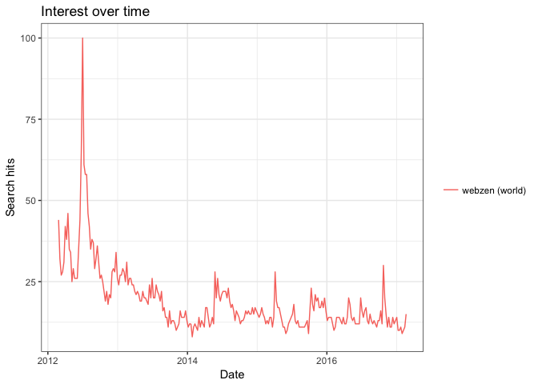
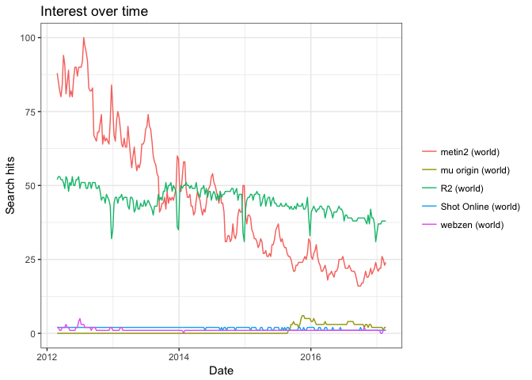

# 데이터 과학자와 함께 하는 제19대 대통령 선거

## 구글 추세(Google Trend)

[구글 추세(Google Trends)](https://trends.google.com) 서비스를 통해 사용자들이 가장 많이 검색하는 검색어를 통해 추세를 대세(?)를 살펴볼 수 있다.
특히, 안드로이드, iOS 탑재된 스마트폰이 널리 보급되고 검색 인터페이스가 기존 입력방식에서 음성언어를 폭넓게 지원하고,
인식률도 현저히 높아짐에 따라 사람들의 검색량도 증가하고 구글 추세 분석 결과도 신빙성을 높혀가고 있다.

미국 대선에서 소셜미디어로 대표되는 새로운 선거예측방식이 기존 설문에 기반한 여론조사보다 정확하게 대통령을 예측하면서 크게 주목을 받고 있다.

### `gtrendsR` 환경설정

[gtrendsR](https://github.com/PMassicotte/gtrendsR) 팩키지는 현재 한창 활발히 개발되고 있고, 구글 추세 서비스를 R에 연결시키는 
핵심 팩키지로 자리잡아가고 있다.

~~~{.r}
# 0. 환경설정 --------------------------------------------------
# devtools::install_github("PMassicotte/gtrendsR")
library(gtrendsR)
library(tidyverse)
library(extrafont)
loadfonts()
par(family = "NanumGothic")
~~~

### `gtrendsR` 팩키지 살펴보기

`ls("package:gtrendsR")` 명령어를 던져보면 많은 함수는 없다. 
다국어 지원 및 처리를 위해 몇가지 설정을 해야 한다.

~~~{.r}
# 활용가능한 함수 
ls("package:gtrendsR")
~~~

~~~{.output}
[1] "categories" "countries"  "gtrends"   

~~~

~~~{.r}
# 0.1. 비영어권 언어 --------------------------------------------------
# 로컬(locale) 문자집합 확인
localeToCharset()
~~~

~~~{.output}
[1] "UTF-8"

~~~

~~~{.r}
kw <- "webzen"

if (!(Encoding(kw) == "utf-8")) {
    kw <- iconv(kw, "latin1", "utf-8", sub = "byte")
}
~~~

### 검색어 하나 던져보기

검색어 하나 [웹젠](http://www.webzen.co.kr/)에 대한 추세를 살펴본다.

~~~{.r}
# 1. 단일 검색어 추세 --------------------------------------------------
gtrends("webzen") %>% 
    plot()
~~~

### 다수 검색어 던져서 비교하기

[웹젠](http://www.webzen.co.kr/)에서 서비스하는 주요 게임에 대한 구글 추세를 살펴보자.

~~~{.r}
# 2. 다수 검색어 추세 --------------------------------------------------
wz <- gtrends(c("webzen", "mu origin", "metin2", "R2", "Shot Online"))

# 2.1. 데이터 살펴보기
head(wz$interest_over_time)
~~~

~~~{.output}
        date hits keyword   geo gprop
1 2012-02-26    2  webzen world   web
2 2012-03-04    2  webzen world   web
3 2012-03-11    1  webzen world   web
4 2012-03-18    1  webzen world   web
5 2012-03-25    2  webzen world   web
6 2012-04-01    2  webzen world   web

~~~

~~~{.r}
head(wz$interest_by_region %>% dplyr::filter(location =="South Korea"))
~~~

~~~{.output}
     location hits     keyword   geo gprop
1 South Korea    0      webzen world   web
2 South Korea    0   mu origin world   web
3 South Korea    0      metin2 world   web
4 South Korea    4          R2 world   web
5 South Korea    0 Shot Online world   web
6 South Korea   40          R2 world   web

~~~

~~~{.r}
# 2.2. 시각화
plot(wz)
~~~

