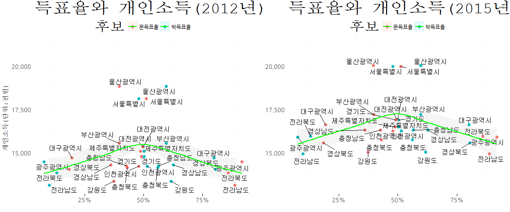
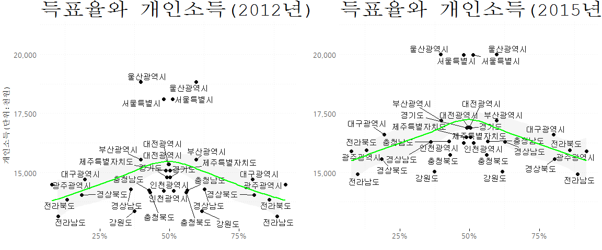
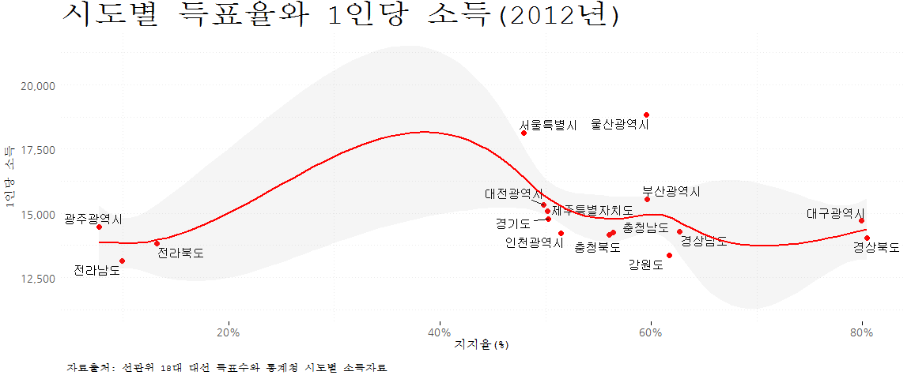
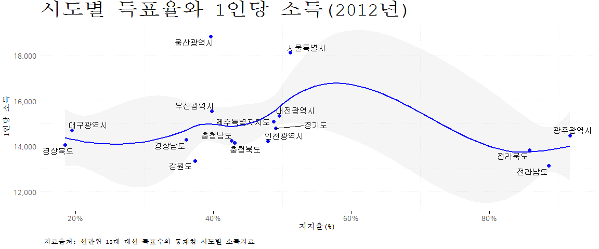
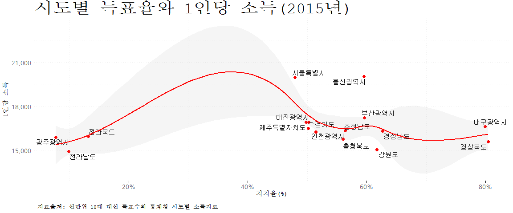
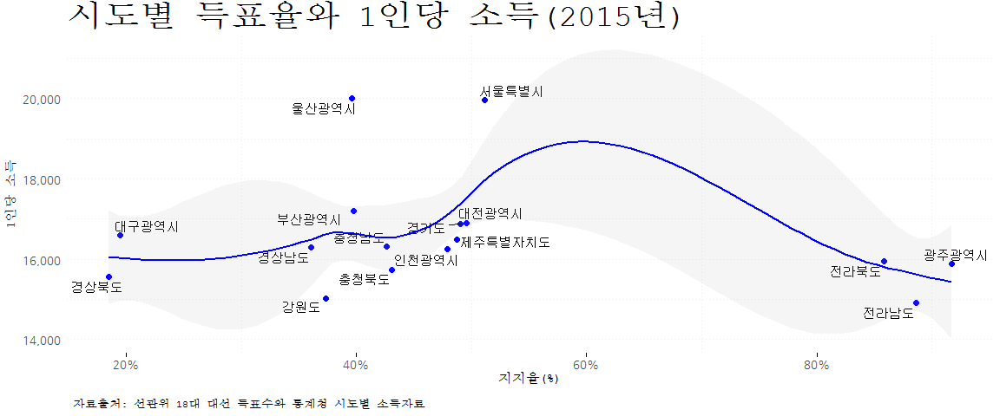

# 데이터 과학자가 바라본 20대 총선

## 정치 경제

정치 경제라고하여 정치와 경제는 밀접한 관계가 있다. 
정치의 중요한 척도인 대선 득표율과 경제를 대표한다고 볼 수 있는 1인당 소득에 대한 관계를 살펴보자.
2012년 문재인 후보와 박근혜 후보가 보수와 진보를 대표하여 맞짱을 뜬 대선 득표율과 
각 시도별 1인당 소득의 상관관계를 살펴보자.

## 데이터

[통계청 KOSIS](http://kosis.kr/)에서 1인당 개인소득 자료를 중앙선거관리위원회에서 18대선 투표구별 개표결과 데이터를 가공하여 
정치 경제 관계를 살펴본다.

- [행정구역(시도)별 1인당 지역내총생산, 지역총소득, 개인소득](http://kosis.kr/statHtml/statHtml.do?orgId=101&tblId=DT_1C65#)
- 중앙선거관리위원회 &rarr; 분야별 정보 &rarr; 선거정보 &rarr; 하단 자료실
    - [제18대 대통령선거 투표구별 개표결과 다운로드](http://www.nec.go.kr/portal/cmm/fms/FileDown.do?atchFileId=FILE_000000000061613&fileSn=1&bbsId=)

## 환경설정

엑셀 파일을 불러읽어오기 위해 `readxl` 팩키지와 시각화에 필요한 팩키지를 불러온다.

~~~{.r}
library(tidyverse)
library(readxl)
library(ggrepel)
library(ggthemes)
library(extrafont)
loadfonts()
~~~
## 데이터 가져오기

2012년 대선 득표율 데이터와 2012년 시도별 소득데이터를 불러와서 각 후보별 득표율을 계산한다.

~~~{.r}
# 1. 데이터 가져오기 ---------------------------------------------
## 1.1. 2012년 대선 득표율 ---------------------------------------
vote_df <- read_excel("data/제18대 대선 투표구별 개표자료.xls", skip=3)
# http://stackoverflow.com/questions/28549045/dplyr-select-error-found-duplicated-column-name
valid_column_names <- make.names(names=names(vote_df), unique=TRUE, allow_ = TRUE)
names(vote_df) <- valid_column_names

names(vote_df) <- c("시도명", "구시군명", "읍면동명", "투표구명", "선거인수", "투표수", 
  "박근혜", "문재인", "X.1", "X.2", "X.3", "X.4", "X.5", "무효.투표수", "기권수")

votes_df <- vote_df %>% 
  dplyr::filter(`구시군명` =="합계" & `시도명` !="전국" & `시도명` !="세종특별자치시") %>% 
  dplyr::select(`시도명`, `투표수`, `박근혜`, `문재인`) %>% 
  mutate_each(funs(as.numeric), matches("^[박|문|투]")) %>% 
  mutate(`박득표율` = `박근혜`/`투표수`*100, 
         `문득표율` = `문재인`/`투표수`*100)

## 1.2. 2012년 1인당 소득 ---------------------------------------

income_12_df <- read_excel("data/행정구역_시도_별_1인당_지역내총생산__지역총소득__개인소득_20170430200327.xlsx")
names(income_12_df) <- c("시도명", "총소득", "개인소득", "민간소비")

income_15_df <- read_excel("data/행정구역_시도_별_1인당_지역내총생산__지역총소득__개인소득_20170504151830.xlsx", skip=1)
names(income_15_df) <- c("시도명", "총소득", "개인소득")

incomes_12_df <- income_12_df %>% 
  dplyr::filter(`시도명` !="행정구역(시도)별" & `시도명` !="세종특별자치시") %>% 
  dplyr::select(`시도명`, `개인소득`) %>% 
  mutate_each(funs(as.numeric), dplyr::matches("^[개]"))

incomes_15_df <- income_15_df %>% 
  dplyr::filter(`시도명` !="행정구역(시도)별" & `시도명` !="세종특별자치시") %>% 
  dplyr::select(`시도명`, `개인소득`) %>% 
  mutate_each(funs(as.numeric), dplyr::matches("^[개]"))

## 1.3. 데이터 결합 --------------------------------------------

vote_inc_12_df <- votes_df %>% left_join(incomes_12_df, by="시도명")
vote_inc_15_df <- votes_df %>% left_join(incomes_15_df, by="시도명")

# 2. 데이터 정제 ---------------------------------------------

ratio_12_df <- vote_inc_12_df %>% 
  dplyr::select(시도명, 박득표율, 문득표율, 개인소득) %>% 
  gather(후보, 득표율, -시도명, -개인소득)

ratio_15_df <- vote_inc_15_df %>% 
  dplyr::select(시도명, 박득표율, 문득표율, 개인소득) %>% 
  gather(후보, 득표율, -시도명, -개인소득)
~~~

## 데이터 시각화

2012년 개인소득(경제)과 대선 후보별득표율(정치) 간의 관계를 산점도를 그려보고 `lowess` 적합을 통해 추세를 시각화한다.

### 득표율과 2012년 2015년 개인소득 비교 (박근혜, 문재인)

~~~{.r}
# 3. 데이터 시각화 ---------------------------------------------

ratio_12_g <- ggplot(ratio_12_df, aes(y=`개인소득`, x=`득표율`/100, label=`시도명`, fill=`후보`)) +
  geom_point(aes(y=`개인소득`, x=`득표율`/100, color=`후보`), size=2) +
  geom_text_repel(aes(y=`개인소득`, x=`득표율`/100, label=`시도명`)) +
  geom_smooth(aes(group = 1), se=TRUE, level=0.67, size=1, color="green", alpha=0.1) +
  theme_minimal(base_family="NanumGothic") +
  scale_x_continuous(labels=scales::percent) +
  scale_y_continuous(labels=scales::comma, limits=c(13000, 21000)) +
  theme(legend.position="top", 
        plot.caption=element_text(hjust=0,size=8),
        plot.subtitle=element_text(face="italic"),
        axis.text=element_text(size=9.5),
        axis.title=element_text(size=10.5)) +
  labs(x="",y="개인소득(단위:천원)",title="득표율와 개인소득(2012년)")

ratio_15_g <- ggplot(ratio_15_df, aes(y=`개인소득`, x=`득표율`/100, label=`시도명`, fill=`후보`)) +
  geom_point(aes(y=`개인소득`, x=`득표율`/100, color=`후보`), size=2) +
  geom_text_repel(aes(y=`개인소득`, x=`득표율`/100, label=`시도명`)) +
  geom_smooth(aes(group = 1), se=TRUE, level=0.67, size=1, color="green", alpha=0.1) +
  theme_minimal(base_family="NanumGothic") +
  scale_x_continuous(labels=scales::percent) +
  scale_y_continuous(labels=scales::comma, limits=c(13000, 21000)) +
  theme(legend.position="top", 
        plot.caption=element_text(hjust=0,size=8),
        plot.subtitle=element_text(face="italic"),
        axis.text=element_text(size=9.5),
        axis.title=element_text(size=10.5)) +
  labs(x="",y="",title="득표율와 개인소득(2015년)")

grid.arrange(ratio_12_g, ratio_15_g, ncol=2)
~~~

~~~{.output}
`geom_smooth()` using method = 'loess'
`geom_smooth()` using method = 'loess'

~~~

### 득표율과 2012년 2015년 개인소득 비교 (전체)

~~~{.r}
# 3. 데이터 시각화 ---------------------------------------------

ratio_12_gg <- ggplot(ratio_12_df, aes(y=`개인소득`, x=`득표율`/100, label=`시도명`)) +
  geom_point(aes(y=`개인소득`, x=`득표율`/100), size=2) +
  geom_text_repel(aes(y=`개인소득`, x=`득표율`/100, label=`시도명`)) +
  geom_smooth(aes(group = 1), se=TRUE, level=0.67, size=1, color="green", alpha=0.1) +
  theme_minimal(base_family="NanumGothic") +
  scale_x_continuous(labels=scales::percent) +
  scale_y_continuous(labels=scales::comma, limits=c(13000, 21000)) +
  theme(legend.position="top", 
        plot.caption=element_text(hjust=0,size=8),
        plot.subtitle=element_text(face="italic"),
        axis.text=element_text(size=9.5),
        axis.title=element_text(size=10.5)) +
  labs(x="",y="개인소득(단위:천원)",title="득표율와 개인소득(2012년)")

ratio_15_gg <- ggplot(ratio_15_df, aes(y=`개인소득`, x=`득표율`/100, label=`시도명`)) +
  geom_point(aes(y=`개인소득`, x=`득표율`/100), size=2) +
  geom_text_repel(aes(y=`개인소득`, x=`득표율`/100, label=`시도명`)) +
  geom_smooth(aes(group = 1), se=TRUE, level=0.67, size=1, color="green", alpha=0.1) +
  theme_minimal(base_family="NanumGothic") +
  scale_x_continuous(labels=scales::percent) +
  scale_y_continuous(labels=scales::comma, limits=c(13000, 21000)) +
  theme(legend.position="top", 
        plot.caption=element_text(hjust=0,size=8),
        plot.subtitle=element_text(face="italic"),
        axis.text=element_text(size=9.5),
        axis.title=element_text(size=10.5)) +
  labs(x="",y="",title="득표율와 개인소득(2015년)")

grid.arrange(ratio_12_gg, ratio_15_gg, ncol=2)
~~~

~~~{.output}
`geom_smooth()` using method = 'loess'
`geom_smooth()` using method = 'loess'

~~~

### 후보별 득표율과 시도별 개인소득

#### 2012년

2012년 박근혜, 문재인 후보 모두 지지율이 올라가면서 1인당 개인소득이 증가하다가 50%를 넘게되면 다시 감소하는 패턴을 보이고 있다.

~~~{.r}
ggplot(ratio_12_df %>% dplyr::filter(후보=="박득표율"), aes(y=`개인소득`, x=`득표율`/100, label=`시도명`)) +
  geom_point(aes(y=`개인소득`, x=`득표율`/100), size=2, color="red") +
  geom_text_repel(aes(y=`개인소득`, x=`득표율`/100, label=`시도명`)) +
  geom_smooth(aes(group = 1), se=TRUE, level=0.67, size=1, color="red", alpha=0.1) +
  theme_minimal(base_family="NanumGothic") +
  scale_x_continuous(labels=scales::percent) +
  scale_y_continuous(labels=scales::comma) +
  theme(legend.position="none", 
        plot.caption=element_text(hjust=0,size=8),
        plot.subtitle=element_text(face="italic"),
        axis.text=element_text(size=9.5),
        axis.title=element_text(size=10.5)) +
  labs(x="지지율(%)",y="1인당 소득",title="시도별 득표율와 1인당 소득(2012년)",
       caption="\n 자료출처: 선관위 18대 대선 득표수와 통계청 시도별 소득자료")
~~~

~~~{.output}
`geom_smooth()` using method = 'loess'

~~~

~~~{.r}
ggplot(ratio_12_df %>% dplyr::filter(후보=="문득표율"), aes(y=`개인소득`, x=`득표율`/100, label=`시도명`)) +
  geom_point(aes(y=`개인소득`, x=`득표율`/100), size=2, color="blue") +
  geom_text_repel(aes(y=`개인소득`, x=`득표율`/100, label=`시도명`)) +
  geom_smooth(aes(group = 1), se=TRUE, level=0.67, size=1, color="blue", alpha=0.1) +
  theme_minimal(base_family="NanumGothic") +
  scale_x_continuous(labels=scales::percent) +
  scale_y_continuous(labels=scales::comma) +
  theme(legend.position="none", 
        plot.caption=element_text(hjust=0,size=8),
        plot.subtitle=element_text(face="italic"),
        axis.text=element_text(size=9.5),
        axis.title=element_text(size=10.5)) +
  labs(x="지지율(%)",y="1인당 소득",title="시도별 득표율와 1인당 소득(2012년)",
       caption="\n 자료출처: 선관위 18대 대선 득표수와 통계청 시도별 소득자료")
~~~

~~~{.output}
`geom_smooth()` using method = 'loess'

~~~

#### 2015년

2015년에도 박근혜, 문재인 후보 모두 지지율이 올라가면서 1인당 개인소득이 증가하다가 50%를 넘게되면 다시 감소하는 패턴을 보이고 있다.

~~~{.r}
ggplot(ratio_15_df %>% dplyr::filter(후보=="박득표율"), aes(y=`개인소득`, x=`득표율`/100, label=`시도명`)) +
  geom_point(aes(y=`개인소득`, x=`득표율`/100), size=2, color="red") +
  geom_text_repel(aes(y=`개인소득`, x=`득표율`/100, label=`시도명`)) +
  geom_smooth(aes(group = 1), se=TRUE, level=0.67, size=1, color="red", alpha=0.1) +
  theme_minimal(base_family="NanumGothic") +
  scale_x_continuous(labels=scales::percent) +
  scale_y_continuous(labels=scales::comma) +
  theme(legend.position="none", 
        plot.caption=element_text(hjust=0,size=8),
        plot.subtitle=element_text(face="italic"),
        axis.text=element_text(size=9.5),
        axis.title=element_text(size=10.5)) +
  labs(x="지지율(%)",y="1인당 소득",title="시도별 득표율와 1인당 소득(2015년)",
       caption="\n 자료출처: 선관위 18대 대선 득표수와 통계청 시도별 소득자료")
~~~

~~~{.output}
`geom_smooth()` using method = 'loess'

~~~

~~~{.r}
ggplot(ratio_15_df %>% dplyr::filter(후보=="문득표율"), aes(y=`개인소득`, x=`득표율`/100, label=`시도명`)) +
  geom_point(aes(y=`개인소득`, x=`득표율`/100), size=2, color="blue") +
  geom_text_repel(aes(y=`개인소득`, x=`득표율`/100, label=`시도명`)) +
  geom_smooth(aes(group = 1), se=TRUE, level=0.67, size=1, color="blue", alpha=0.1) +
  theme_minimal(base_family="NanumGothic") +
  scale_x_continuous(labels=scales::percent) +
  scale_y_continuous(labels=scales::comma) +
  theme(legend.position="none", 
        plot.caption=element_text(hjust=0,size=8),
        plot.subtitle=element_text(face="italic"),
        axis.text=element_text(size=9.5),
        axis.title=element_text(size=10.5)) +
  labs(x="지지율(%)",y="1인당 소득",title="시도별 득표율와 1인당 소득(2015년)",
       caption="\n 자료출처: 선관위 18대 대선 득표수와 통계청 시도별 소득자료")
~~~

~~~{.output}
`geom_smooth()` using method = 'loess'

~~~

# 4. 데이터 표 ---------------------------------------------

~~~{.r}
DT::datatable(votes_df %>% mutate(`박득표율` = `박득표율`/100, `문득표율`=`문득표율`/100)) %>% 
  DT::formatCurrency(c(2,3,4), currency="", interval=3, mark=",", digits=0) %>% 
  DT::formatPercentage(c('박득표율','문득표율'), digits=1)
~~~

<!--html_preserve-->

<!--/html_preserve-->

~~~{.r}
incomes_12_df <- incomes_12_df %>% dplyr::rename(`개인소득_12` = 개인소득)
incomes_15_df <- incomes_15_df %>% dplyr::rename(`개인소득_15` = 개인소득)
  
incomes_df <- incomes_12_df %>% left_join(incomes_15_df)
~~~

~~~{.output}
Joining, by = "시도명"

~~~

~~~{.r}
DT::datatable(incomes_df) %>% 
  DT::formatCurrency(c(2,3), currency="", interval=3, mark=",", digits=0)
~~~

<!--html_preserve-->

<!--/html_preserve-->
