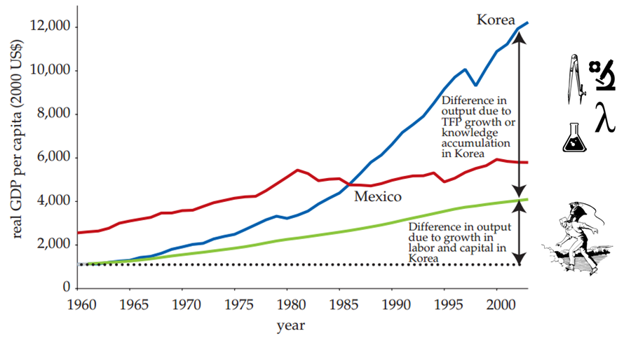
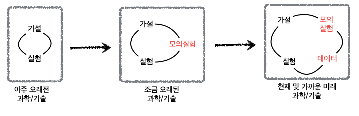

## 패러다임의 변화

과학기술이 국민총생산에 지대한 영향을 미친 것은 세계은행 보고서를 통해 알려졌다.
특히, [한국개발연구원(KDI)](http://www.kdi.re.kr/) 출신 연구원들이 [세계은행](http://www.worldbank.org/)에서 
발간한 ''[Korea as a Knowledge Economy : Evolutionary Process and Lessons Learned](https://openknowledge.worldbank.org/handle/10986/6755)'' [^worldbank-kdi] 에 따르면 과학기술에 대한 기여분이 **노동**과
**자본** 에 대한 기여분보다 월등히 1인당 국민총생산(GDP)에 기여하는 것으로 나타난다. 상대적으로 멕시코의 동일기간 성장률에 비해 한국의 경제성장에 대한 기여를 확연히 알수 있다.

[^worldbank-kdi]: "Suh, Joonghae; Chen, Derek H. C.. 2007. Korea as a Knowledge Economy : Evolutionary Process and Lessons Learned. WBI Development Studies. Washington, DC: World Bank. © World Bank. https://openknowledge.worldbank.org/handle/10986/6755 License: CC BY 3.0 IGO."

### 과학기술 패러다임의 변화

과거 가설을 갖고 이를 수학적 도구를 통해 머릿속으로 상상하고 이를 실험을 통해서 과학기술을 진전시켜 나가는 과정이 수백년동안 지속되었다. 물론 이 기간동안 수학도 엄청난 발전을 이루었다. 특히 미적분을 빼놓을 수는 없다. 조금 오래된 과학기술로 지금도 여전히 유효한 과학기술 발전 방법은 컴퓨터를 활용하는 것이다. 선형대수와 접목된 컴퓨터 기술은 실험을 직접적으로 수행하지 않고도 모의실험을 통해서 더 적은 비용을 들여, 더 정확하고, 더 빨리 과학기술을 발전시킬 수 있게 되었다. 

현재 및 가까운 미래에는 가설, 실험, 모의실험에 더하여 많은 데이터가 사용가능하게 됨에 따라 데이터에서 좋은 가설을 만들어 내고 이를 실험으로 증명하는 사례도 늘어나면서 패러다임의 변화가 목도되고 있다. 

## 정치 경제학

**[정치경제학(政治經濟學)](https://en.wikipedia.org/wiki/Political_economy)**은 원래 생산, 매입과 매각 행위, 그리고 이들 행위들이 각각 법, 관습과 정부와 맺는 관계를 연구하는 학문으로, 18세기 당시 국가 경제를 연구하면서 발달하였다. 국가는 "정치 주체"라고도 불리는데 정치경제학이라는 단어에서 "정치"는 이에 유래한 것으로, 토지 소유 여부를 부의 원천으로 여기는 이론과 이에 반해 노동 가치론을 주장한 학자도 있다.[^wiki-political-economy](https://ko.wikipedia.org/wiki/정치경제학)

## 20대 국회의원 선거 [^survey-fail01] [^survey-fail02]

갤럽 및 이와 유사한 여론조사 방법론을 동원한 여론조사 전문기관들이 대통령 선거를 비롯한
다양한 선거에서 점쟁이(?), 쪽집게(?) 노릇을 톡톡히 했다. 하지만, 이번 제20대 총선에서 
새누리 압승으로 예상한 것이 틀렸고, 제1당의 위치도 내려놓게 되었다.

[^survey-fail01]: [실제보다 여당이 높게 보이는 여론조사의 비밀](http://www.mediatoday.co.kr/?mod=news&act=articleView&idxno=129177)
[^survey-fail02]: [4‧13 총선, 여론조사가 빗나간 세 가지 이유](http://www.mediatoday.co.kr/?mod=news&act=articleView&idxno=129414)

### 여론조사 데이터

| 구분    | XX일보      |   YY일보  | ZZ일보       |  KK일보      |
|--------|------------|----------|-------------|-------------|
| 표본크기	 | 1,000	  |   511	 |  500        |  600        |
| 응답율	 |  4.4%	  |   2.8%	 |  7.7%       |  4.0%       |
| 조사방법	 | 휴대전화/
ARS |  유무선전화 |
 RDD(임의걸기) |  유선전화      |    
| 조사날짜	 | 2/20일"	  |  3/15일	 | 3/19        |  4/1        |
| 조사시간	 | 11시~20시   | 
09시~22시 |  
10시~22시   |   
14시~19시" |
| 조사기관	 | OO리서치	  |  리얼미터	 | 리서치앤리서치  |  엠브레인     |

ARS: 전화자동응답전화, RDD: Random Digit Dialing

[중앙선거관리위원회 - 중앙선거 여론조사 공정심의위원회](https://www.nesdc.go.kr/)

### 왜 국회의원이 되려고 할까요?

[국회의원이 누리는 특권 어디까지...?](https://www.facebook.com/yonhapvideo/videos/1585369938441868/)

연합뉴스 통통영상 - 국회의원 세비 1억4천만원, 특권은 200가지...

### 후보 선택 기준 [^voting-criteria]

선거관리위원회에서 16년 3월말 발표한 설문조사에 의하면, 국회의원 투표를 하는 기준은 인물/능력(35.1%), 정책/공약(27.3%), 소속정당(16.0%) 순으로 조사되었다. 선택기준 3가지가 78.4%를 차지한다.

| 구 분  |17대총선	|18대총선	|19대총선	|20대총선 |
|-------|-------|-------|-------|-------|
|인물/능력	|41.7%	|34.2%	|30.8%	|35.1%  |
|정책/공약	|15.2%	|30.8%	|34.0%	|27.3%  |
|소속정당	|24.2%	|15.8%	|13.8%	|16.0%  |
|정치경력	|6.6%	|4.2%	|4.4%	|5.8%   |
|기타	    |12.4%	|14.9%	|17.0%	|15.8%  |

[^voting-criteria]: [국회의원선거에 "반드시 투표하겠다" 63.9%](http://www.nec.go.kr/portal/bbs/viewPop/B0000342/33190.do?menuNo=200602&searchYear=&searchMonth=&searchWrd=&searchCnd=&viewType=&pageIndex=1), 선거관리위원회, 16.03.30. 

## 투표율

#### 사전투표율

|  구 분  |  제19대   | 제20대(예측) |  증감율 |
|---------|---------|-----------|--------|
| 전체	  |  65.6%	|70.8%	    |  5.2%  |
| 19-29세  |  48.2%	|63.3%	    |  15.1% |
| 30대	  |  64.2%	|70.5%	    |  6.3%  |
| 40대	  |  69.7%	|70.6%	    |  0.9%  |
| 50대	  |  71.9%	|73.5%	    |  1.6%  |
| 60세이상  |  72.1%	|74.4%	    |  2.3%  |

### 선거구 현황

|  구 분  |  제19대   | 제20대(예측) |제20대(실제)|  증감율 |
|---------|---------|-----------|----------|-------|
| 전체	  |     	|    	    |          | 5.2%  |
| 19-29세  |     	|    	    |          | 15.1% |
| 30대	  |     	|    	    |          | 6.3%  |
| 40대	  |     	|    	    |          | 0.9%  |
| 50대	  |     	|    	    |          | 1.6%  |
| 60세이상  |     	|    	    |          | 2.3%  |

[제20대 국회의원선거 투표구별 개표결과 자료](http://www.nec.go.kr/portal/bbs/list/B0000338.do?menuNo=200061)

### 참고 자료

- [Shapefiles](http://facweb.knowlton.ohio-state.edu/pviton/courses2/crp87105/spatial-data.html)
