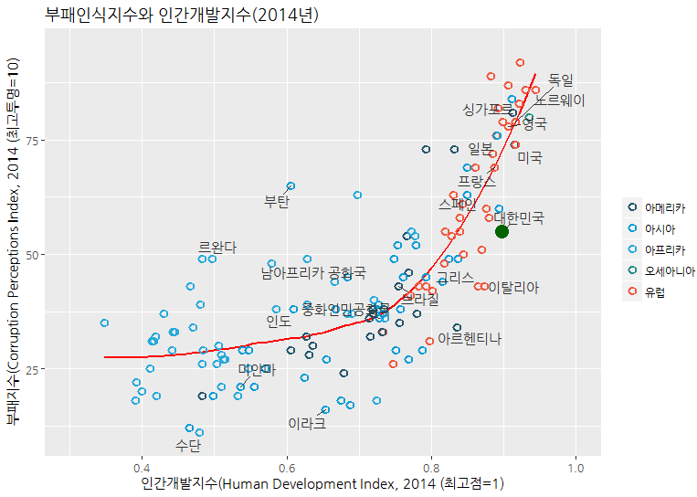
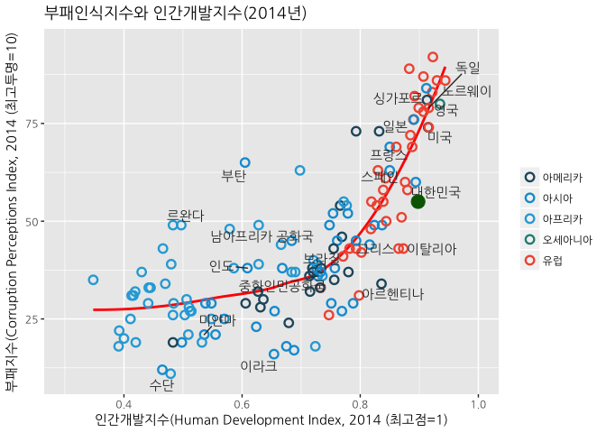

# 데이터 과학자와 함께 하는 제19대 대통령 선거

## 1. 대한민국 부패인식지수와 인간개발지수 [^hdi-news] [^cpi-news]

[^hdi-news]: [유엔, “세계 노동빈곤층 8억명”…인간개발지수 日 20위, 韓 17위](http://www.47news.jp/korean/international_diplomacy/2015/12/128423.html)

[^cpi-news]: [뉴스플러스, 재벌총수 구속하면 과연 경제가 무너질까?](http://news.kbs.co.kr/news/view.do?ncd=3412040)

저녁이 있는 삶이 2012년 손학규 대표가 대통령 출마를 선언하면서 한국사회에 던진 출사표다.
저녁이 있는 삶을 보장받기 위해서 부패가 없는 투명한 세상이 선결되어야 하고, 이는 인간개발(Human Development)과 연관되어 있다.
유엔개발계획(UNDP)은 ‘인간개발 보고서’를 발표하여 각국의 인간개발현황에 정보를 보고서 형태로 제공하고 있고,
국제투명성기구라는 NGO가 발표하는 부패인식지수(CPI)에 따르면 100점 만점에 56점에 불과해 90점대인 북유럽은 물론, 경제협력개발기구(OECD)평균인 69.6점에도 크게 못미친다.

지금의 촛불 사태는 인간개발지수에서 크게 앞선 한국의 상황이 부패인식지수에서 크게 뒤져 있어 "내가 나를 대표한다"는 한국의 민심이 들고 일어난 것으로 해석하는 것도 가능하다.
또한, 부패경제학(Corruption Economics) 전문가들은 대체로 부패인식지수가 10포인트 오르면 경제성장률은 0.7%p 오르는 것으로 파악하고 있어,
지금 상황에서 김영란법 등을 통해 부패인식지수를 30포인트만 높혀도 2%이상의 추가 경제성장이 가능한 것으로 추산된다.

## 2. 부패인식지수와 인간개발지수 시각화

위키피디아 공개 데이터를 구글에서 검색하여 [부패인식지수(Corruption Perceptions Index)](https://en.wikipedia.org/wiki/Corruption_Perceptions_Index) 데이터를 긁어온다.
인간개발지수 데이터는 [인간개발계획(UNDP) 웹사이트](http://hdr.undp.org/en/data)에서 "Human Development Data (1980-2015)"를 다운로드한다.

### 2.1. 환경설정

`hdr` 팩키지를 통해 인간개발지수 데이터를 받아올 수 있으나 2013년이 가장 최신이라 직접 인간개발계획 웹사이트를 통해 데이터를 받아온다.

~~~{.r}
# 0. 환경설정 --------------------------------------------------------------------------
library(countrycode) # ISO 코드에 국가명 붙이기
library(stringr)
library(hdr) # devtools::install_github("expersso/hdr")
library(ggrepel)
library(showtext)
library(rvest)
library(tidyverse)
~~~

### 2.2. 데이터 가져오기

데이터를 불러와서 한국을 비롯한 주요 국가를 선택하고, 한글화 작업을 한다.

~~~{.r}
# 1. 데이터 불러오기 ----------------------------------------------
## 1.1. HDI 데이터-------------------------------------------------
# "http://hdr.undp.org/en/data"
hdi_dat <- read_csv("data/Human development index (HDI).csv", col_names = TRUE, skip=1) %>% 
  mutate(Country = plyr::revalue(Country,  c("Korea (Republic of)"="Korea, Republic of")))

hdi_df <- right_join(countrycode_data, hdi_dat, by=c("country.name"="Country")) %>% dplyr::select(-`1980`, -`1985`, -`1990`, -`1995`, -`2000`) %>% 
  dplyr::filter(!is.na(iso3c))

## 1.2. CPI 데이터-------------------------------------------------
url <- "https://en.wikipedia.org/wiki/Corruption_Perceptions_Index"

cpi_dat <- url %>%
  read_html() %>%
  html_nodes(xpath='//*[@id="mw-content-text"]/table[2]') %>%
  html_table(fill = TRUE) %>% 
  .[[1]]

names(cpi_dat) <- c("rank","country","2015","2015x","2014","2014x","2013","2013x", "2012")

cpi_dat <- cpi_dat %>% dplyr::filter(rank != "Rank") %>% dplyr::select(-rank, country, `2015`, `2014`, `2013`, `2012`) %>% 
  mutate(country = str_replace_all(country, "\\s", "")) %>% 
  dplyr::filter(country != "SouthSudan") %>% 
  mutate(`2015`=as.numeric(`2015`),
         `2014`=as.numeric(`2014`),
         `2013`=as.numeric(`2013`),
         `2012`=as.numeric(`2012`)) %>% 
  dplyr::select(country, `2015`, `2014`, `2013`, `2012`) 
  # gather(year, cpi, -country) 

cpi_dat <- cpi_dat %>% mutate(country = plyr::revalue(country,
                                              c("SouthKorea"="Korea, Republic of",
                                                "UnitedKingdom" = "United Kingdom",
                                                "UnitedStates" = "United States",
                                                "CostaRica" = "Costa Rica",
                                                "CzechRepublic" = "Czech Republic",
                                                "SaudiArabia" = "Saudi Arabia",
                                                "SouthAfrica" =  "South Africa",
                                                "SriLanka" = "Sri Lanka",
                                                "DominicanRepublic" = "Dominican Republic",
                                                "SierraLeone" = "Sierra Leone")))

cpi_df <- right_join(countrycode_data, cpi_dat, by=c("country.name"="country")) %>% dplyr::filter(!is.na(iso3c))

# 2. 데이터 병합 ----------------------------------------------

cpi_14_df <- cpi_df %>% dplyr::select(country_nm = country.name, iso3c, cpi_14=`2014`)
hdi_14_df <- hdi_df %>% dplyr::select(country_nm = country.name, iso3c, hdi_14=`2014`)

cpi_hdi_14_df <- left_join(cpi_14_df, hdi_14_df, by=c("country_nm", "iso3c")) %>% dplyr::filter(complete.cases(.))

cpi_hdi_14_df <- left_join(cpi_hdi_14_df, kor_iso, by=c("iso3c"="alpha-3")) %>% 
  dplyr::rename(country_knm = `나라 이름`, country_num = `숫자`, iso2c =`alpha-2`)

cpi_hdi_14_df <- left_join(cpi_hdi_14_df, countrycode_data, by="iso3c")

cpi_hdi_14_df <- cpi_hdi_14_df %>% mutate(continent = plyr::revalue(continent,
                                                        c("Africa"="아프리카",
                                                          "Americas" = "아메리카",
                                                          "Asia" = "아시아",
                                                          "Europe" = "유럽",
                                                          "Oceania" = "오세아니아")))
~~~

### 2.3. 분패인식지수와 인간개발지수 데이터 시각화

인간개발지수는 0.7 까지 부패지수가 낮은 상태에서 완만히 증가하지만, 이후 인간개발지수와 부패인식지수는 급격히 높아져 최고 투명도 10을 행해 강한 
선형관계를 띄고 나아간다.

~~~{.r}
points_to_label <- c("러시아", "이라크", "미얀마", "수단",
                   "아프카니스탄", "그리스", "아르헨티나", "브라질",
                   "인도", "이탈리아", "중화인민공화국", "남아프리카 공화국", "스페인",
                   "부탄", "르완다", "프랑스",
                   "미국", "독일", "영국", "노르웨이", "일본",
                   "뉴질랜드", "싱가포르", "대한민국")

ggplot(cpi_hdi_14_df, aes(x = hdi_14, y = cpi_14, color=continent)) +
  geom_smooth(aes(group = 1),
              method = "loess",
              se = FALSE,
              color = "red") +
  geom_point(shape = 1, size = 2.5, stroke = 1.25) +
  geom_text_repel(aes(label = country_knm, family = "NanumGothic"),
                  color = "gray20",
                  data = subset(cpi_hdi_14_df, country_knm %in% points_to_label),
                  force = 10) +
  scale_x_continuous(name = "인간개발지수(Human Development Index, 2014 (최고점=1)",
                     limits = c(.3, 1.0)) +
  scale_y_continuous(name = "부패지수(Corruption Perceptions Index, 2014 (최고투명=10)",
                       limits = c(10, 95)) +
  scale_color_manual(name = "",
                       values = c("#24576D",
                                  "#099DD7",
                                  "#28AADC",
                                  "#248E84",
                                  "#F2583F",
                                  "#96503F")) +
  ggtitle("부패인식지수와 인간개발지수(2014년)") +
  theme(text=element_text(family="NanumGothic")) +
  geom_point(data=cpi_hdi_14_df %>% dplyr::filter(country_knm=="대한민국"), aes(x=hdi_14, y=cpi_14), colour="darkgreen", size=5)
~~~

