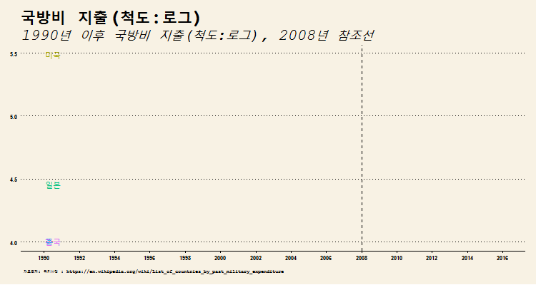
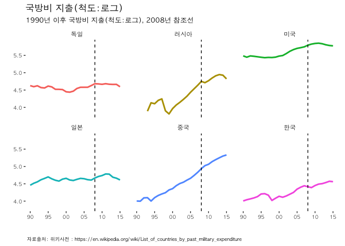
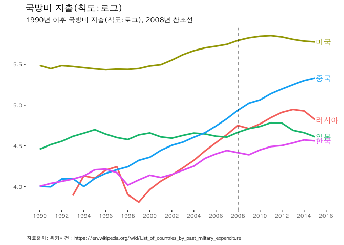

# 데이터 과학자와 함께 하는 제19대 대통령 선거

## 1. 한국을 둘러싼 주요국 군사비 지출 [^wiki-military-expenditure] [^chosun-sipri]

[^wiki-military-expenditure]: [Wikipedia, List of countries by past military expenditure](https://en.wikipedia.org/wiki/List_of_countries_by_past_military_expenditure)

[^chosun-sipri]: [조선일보, 2015년 중국 실제 군사비 2150억 달러…아시아 전체의 49%](http://pub.chosun.com/client/news/viw.asp?cate=C01&mcate=&nNewsNumb=20160419917&nidx=19918)

저녁이 있는 삶이 2012년 손학규 대표가 대통령 출마를 선언하면서 한국사회에 던진 출사표다.
저녁이 있는 삶을 보장받기 위해서 국방이 튼튼해야 한다. 
하지만, 스웨덴 스톡홀름 국제평화연구소(SIPRI) 에서 매년 발표하는 한국을 둘러싼 주요국 군사비 지출을 보면 지난 20년간의 변화가 눈에 띈다.

## 2. 한국을 둘러싼 주요국 군사비 지출 추이 시각화

위키사전 공개 데이터를 구글에서 검색하면 쉽게 [국가별 군사비 지출](https://en.wikipedia.org/wiki/List_of_countries_by_past_military_expenditure) 데이터에 접근이 가능하다.
엑셀이나 `.csv` 등 분석에 용이한 형태로 다운로드 받아 활용해도 되고, 직접 `rvest` 팩키지를 활용하여 크롤링하는 것도 좋다.

### 2.1. 환경설정

~~~{.r}
# 0. 환경설정 --------------------------------------------------------------------------
library(rvest)
library(tidyverse)
library(stringr)
library(lubridate)
library(extrafont)
library(ggthemes)
library(animation)
loadfonts()
theme_set(theme_tufte(base_family='NanumGothic'))
~~~

### 2.2. 한국을 둘러싼 주요국 군사비 지출 데이터

데이터를 불러와서 시계열 데이터형태로 변형한 후에,
한국을 비롯한 주요 국가를 선택하고, 한글화 작업을 한다.

~~~{.r}
## 1. 국방비 데이터 긁어오기-------------------------------------------------
url <- "https://en.wikipedia.org/wiki/List_of_countries_by_past_military_expenditure"

mil_dat_1990 <- url %>%
  read_html() %>%
  html_nodes(xpath='//*[@id="mw-content-text"]/table[2]') %>%
  html_table(fill = TRUE) %>% 
  .[[1]]

mil_dat_2000 <- url %>%
  read_html() %>%
  html_nodes(xpath='//*[@id="mw-content-text"]/table[3]') %>%
  html_table(fill = TRUE) %>% 
  .[[1]]

mil_dat_2010 <- url %>%
  read_html() %>%
  html_nodes(xpath='//*[@id="mw-content-text"]/table[4]') %>%
  html_table(fill = TRUE) %>% 
  .[[1]]

## 2. 국방비 데이터 정제-------------------------------------------------

mil_1990 <- mil_dat_1990 %>% dplyr::slice(-(1:21)) %>% dplyr::select(1:11) %>% 
  dplyr::rename(country=X1, 
                `1990` = X2, 
                `1991` = X3, 
                `1992` = X4,
                `1993` = X5,
                `1994` = X6,
                `1995` = X7,
                `1996` = X8,
                `1997` = X9,
                `1998` = X10,
                `1999` = X11) %>% 
  dplyr::mutate(`1990` = as.numeric(str_replace_all(`1990`, ",", "")),
                `1991` = as.numeric(str_replace_all(`1991`, ",", "")),
                `1992` = as.numeric(str_replace_all(`1992`, ",", "")),
                `1993` = as.numeric(str_replace_all(`1993`, ",", "")),
                `1994` = as.numeric(str_replace_all(`1994`, ",", "")),
                `1995` = as.numeric(str_replace_all(`1995`, ",", "")),
                `1996` = as.numeric(str_replace_all(`1996`, ",", "")),
                `1997` = as.numeric(str_replace_all(`1997`, ",", "")),
                `1998` = as.numeric(str_replace_all(`1998`, ",", "")),
                `1999` = as.numeric(str_replace_all(`1999`, ",", "")))

mil_2000 <- mil_dat_2000 %>% dplyr::slice(-(1:21)) %>% dplyr::select(1:11) %>% 
  dplyr::rename(country=X1, 
                `2000` = X2, 
                `2001` = X3, 
                `2002` = X4,
                `2003` = X5,
                `2004` = X6,
                `2005` = X7,
                `2006` = X8,
                `2007` = X9,
                `2008` = X10,
                `2009` = X11) %>% 
  dplyr::mutate(`2000` = as.numeric(str_replace_all(`2000`, ",", "")),
                `2001` = as.numeric(str_replace_all(`2001`, ",", "")),
                `2002` = as.numeric(str_replace_all(`2002`, ",", "")),
                `2003` = as.numeric(str_replace_all(`2003`, ",", "")),
                `2004` = as.numeric(str_replace_all(`2004`, ",", "")),
                `2005` = as.numeric(str_replace_all(`2005`, ",", "")),
                `2006` = as.numeric(str_replace_all(`2006`, ",", "")),
                `2007` = as.numeric(str_replace_all(`2007`, ",", "")),
                `2008` = as.numeric(str_replace_all(`2008`, ",", "")),
                `2009` = as.numeric(str_replace_all(`2009`, ",", "")))

mil_2010 <- mil_dat_2010 %>% dplyr::slice(-(1:21)) %>% dplyr::select(1:7) %>% 
  dplyr::rename(country=X1, 
                `2010` = X2, 
                `2011` = X3, 
                `2012` = X4,
                `2013` = X5,
                `2014` = X6,
                `2015` = X7) %>% 
  dplyr::mutate(`2010` = as.numeric(str_replace_all(`2010`, ",", "")),
                `2011` = as.numeric(str_replace_all(`2011`, ",", "")),
                `2012` = as.numeric(str_replace_all(`2012`, ",", "")),
                `2013` = as.numeric(str_replace_all(`2013`, ",", "")),
                `2014` = as.numeric(str_replace_all(`2014`, ",", "")),
                `2015` = as.numeric(str_replace_all(`2015`, ",", "")))

mil_dat <- mil_1990 %>% left_join(mil_2000) %>% left_join(mil_2010)

mil_df <- mil_dat %>% dplyr::filter(country != "United Arab Emirates") %>% 
  gather(year, mil_exp, `1990`:`2015`)

mil_df <- mil_df %>% mutate(year = ymd(paste0(year, "-01-01"))) %>% 
  mutate(country = recode(country,
                          `United States` = "미국",
                          `South Korea` = "한국",
                          Japan = "일본",
                          "People's Republic of China" = "중국",
                          Russia = "러시아",
                          Germany = "독일")) 
~~~

### 2.3. 한국을 둘러싼 주요국 군사비 지출 시각화

"미국", "한국", "일본", "중국", "러시아", "독일" 총 6개국에 대해 시각화한다.

~~~{.r}
## 3. 국방비 지출 시각화-------------------------------------------------
### 3.1. 국가별 국방비지출 비교----------------------------------------------------
dlist <- unique(mil_df$year)

mil_df %>% dplyr::filter(country %in% c("미국", "한국", "일본", "중국", "러시아", "독일")) %>% 
  ggplot(., aes(year, log10(mil_exp), color=country, label=country)) +
  geom_line(size=1.1) +
  facet_wrap(~country) +
  geom_vline(xintercept=as.numeric(ymd("2008-01-01")), linetype=2) +
  scale_x_date(breaks=seq(dlist[1], tail(dlist, n=1)+years(1), "5 year"),
               date_labels= "%y", limits=c(dlist[1],tail(dlist, n=1)+years(1))) +
  theme(legend.position="none",plot.caption=element_text(hjust=0,size=7),plot.subtitle=element_text(face="italic"),
        axis.text=element_text(size=7.5))+
  labs(x="",y="",title="국방비 지출(척도:로그)",
       caption="\n 자료출처: 위키사전 : https://en.wikipedia.org/wiki/List_of_countries_by_past_military_expenditure",
       subtitle="1990년 이후 국방비 지출(척도:로그), 2008년 참조선") +
  theme_tufte(base_family='AppleGothic') +
  theme(legend.position="none",plot.caption=element_text(hjust=0,size=7),plot.subtitle=element_text(face="italic"),
        axis.text=element_text(size=7.5))
~~~

### 2.4. 한국, 미국, 일본, 중국, 러시아 국방비지출 일괄비교

facet 그래프가 아니라 한국, 일본, 미국, 중국, 러시아 5개국 군사비 지출 추이를 일괄비교하는 시각화 그래프를 생성한다.

~~~{.r}
### 3.2. 한국, 미국, 일본, 중국, 러시아 국방비지출 비교----------------------------------------------------
dlist <- unique(mil_df$year)

mil_df %>% dplyr::filter(country %in% c("미국", "한국", "일본", "중국", "러시아")) %>% 
  ggplot(., aes(year, log10(mil_exp), color=country, label=country)) +
  geom_line(size=1.1) +
  geom_vline(xintercept=as.numeric(ymd("2008-01-01")), linetype=2) +
  scale_x_date(breaks=seq(dlist[1], tail(dlist, n=1)+years(1), "2 year"),
               date_labels= "%Y", limits=c(dlist[1],tail(dlist, n=1)+years(1))) +
  geom_text(data=. %>% dplyr::filter(year == tail(dlist, n=1) & country %in% c("미국", "한국", "일본", "중국", "러시아")), hjust=0, nudge_x=30, family="AppleGothic") +
  theme(legend.position="none",plot.caption=element_text(hjust=0,size=7),plot.subtitle=element_text(face="italic"),
        axis.text=element_text(size=7.5))+
  labs(x="",y="",title="국방비 지출(척도:로그)",
       caption="\n 자료출처: 위키사전 : https://en.wikipedia.org/wiki/List_of_countries_by_past_military_expenditure",
       subtitle="1990년 이후 국방비 지출(척도:로그), 2008년 참조선") +
  theme_tufte(base_family='AppleGothic') +
  theme(legend.position="none",plot.caption=element_text(hjust=0,size=7),plot.subtitle=element_text(face="italic"),
        axis.text=element_text(size=7.5))
~~~

### 2.5. 한국을 포함한 주요국가 군사비 지출 애니메이션

1990년 이래 한국을 포함한 5개국 군사비 지출 변화를 애니메이션으로 시각화한다.

~~~{.r}
mil_plot <- function(i){
  mil_df %>% dplyr::filter(year<=dlist[i] & country %in% c("미국", "한국", "일본", "중국", "러시아")) %>% 
    ggplot(. , aes(year, log10(mil_exp), color=country, label=country)) +
    geom_line(size=1.1) +
    geom_vline(xintercept=as.numeric(ymd("2008-01-01")), linetype=2) +
    scale_x_date(breaks=seq(dlist[1], tail(dlist, n=1)+years(1), "2 year"),
                 date_labels= "%Y", limits=c(dlist[1],tail(dlist, n=1)+years(1))) +
    geom_text(data=. %>% dplyr::filter(year == tail(dlist[i], n=1) & country %in% c("미국", "한국", "일본", "중국", "러시아")), hjust=0, nudge_x=30) +
    theme(legend.position="none",plot.caption=element_text(hjust=0,size=7),plot.subtitle=element_text(face="italic"),
          axis.text=element_text(size=7.5))+
    labs(x="",y="",title="국방비 지출(척도:로그)",
         caption="\n 자료출처: 위키사전 : https://en.wikipedia.org/wiki/List_of_countries_by_past_military_expenditure",
         subtitle="1990년 이후 국방비 지출(척도:로그), 2008년 참조선") +
    theme_wsj() +
    theme(legend.position="none",plot.caption=element_text(hjust=0,size=7),plot.subtitle=element_text(face="italic"),
          axis.text=element_text(size=7.5))
}

oopt = ani.options(interval = 0.5)
saveGIF({for (i in 1:length(dlist)) {
  g <- mil_plot(i)
  
  print(g)
  print(i)
  ani.pause()
}
  
  for (i2 in 1:20) {
    print(g)
    ani.pause()
  }
}, movie.name="military_expenditure_compare_international.gif", ani.width = 750, ani.height = 400)
~~~

