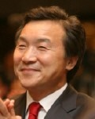
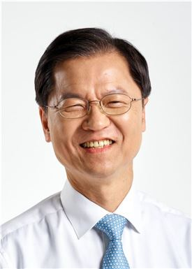

```{r setOptions, message=FALSE, include=FALSE}
source("tools/chunk-options.R")
library(httr)
library(XML)
library(ggplot2)
library(png)
library(grid)
library(jsonlite)
library(tidyverse)
library(lubridate)
library(magick)
library(dygraphs)
library(purrr)
library(extrafont)
loadfonts()
options(warn=-1)
```

## 1. 국민의당 대선 후보 

네이버 인물검색 속 사진을 대상으로 인공지능 기계가 판단하는 사진속 국민의당 대선후보 나이와 감정을 분석해 본다.

- [손학규](https://search.naver.com/search.naver?where=nexearch&query=%EC%86%90%ED%95%99%EA%B7%9C&sm=top_hty&fbm=0&ie=utf8)
- [안철수](https://search.naver.com/search.naver?where=nexearch&query=%EC%95%88%EC%B2%A0%EC%88%98&sm=top_hty&fbm=1&ie=utf8)
- [천정배](https://search.naver.com/search.naver?where=nexearch&query=%EC%B2%9C%EC%A0%95%EB%B0%B0&sm=top_hty&fbm=1&ie=utf8)

|                   손학규                             |                        안철수                       |                       천정배                        |
|------------------------------------------------------|-----------------------------------------------------|-----------------------------------------------------|
|  |  | |


## 2. 국민의당 대선후보 프로필 사진 나이

정보과학교육연합회-R을 이용한 [인공지능 튜토리얼](http://statkclee.github.io/deep-learning/ms-oxford-kcode-tutorial.html)에 나와 있는 코드를 기반으로 
국민의당 대선후보 프로필 사진을 분석했다.

### 2.1. 환경설정

``` {r ml-people-age-emotion-setup, eval=FALSE}
# 0. 환경설정--------------------------------------------------
library(httr)
library(XML)
library(ggplot2)
library(png)
library(grid)
library(jsonlite)
library(tidyverse)
library(lubridate)
library(magick)
library(dygraphs)
library(purrr)
library(extrafont)
loadfonts()
```

### 2.2. 프로필 사진 속 나이 추정

손학규, 안철수, 천정배 사진 데이터를 불러와서 이를 인공지능 API에 던져
사진속 사람의 나이를 추정한다.

``` {r ml-people-age-api}
# 1. 데이터 불러오기 ----------------------------------------------

img_list <- list.files("data/")

hq <- image_read("data/sohn.jpg") %>% image_convert(., "png")
ahn <- image_read("data/ahn.jpg") %>% image_convert(., "png")
chun <- image_read("data/chun.jpg") %>% image_convert(., "png")

hq_g <- rasterGrob(hq, interpolate=TRUE)
ahn_g <- rasterGrob(ahn, interpolate=TRUE)
chun_g <- rasterGrob(chun, interpolate=TRUE)

# 2. 얼굴인식 API 호출 ------------------------------------------------

face_api_url <- "https://api.projectoxford.ai/face/v1.0/detect?returnFaceAttributes=age,gender"

source("code/secret_key_from_api.R")

img_age_bucket <- list()

for(lst in seq_along(img_list)){
    img_name <- paste0("data/", img_list[lst])
    img <- httr::upload_file(img_name)
    
    result <- POST(url = face_api_url,
                   body = img,
                   add_headers(.headers = c('Content-Type' = 'application/octet-stream',
                                            'Ocp-Apim-Subscription-Key' = face_key))
    )
    
    img_age_bucket[[lst]] <- as.data.frame(content(result))[,c("faceAttributes.gender", "faceAttributes.age")]
}

# 3. 데이터 정리-------------------------------------

img_age_buckets <- map(img_age_bucket, rbind) %>% tibble() %>% unnest() %>% 
    mutate(name = c("안철수", "천정배", "손학규")) %>% 
    dplyr::select(name, gener= faceAttributes.gender, age=faceAttributes.age)
```

### 2.3. 프로필 사진 속 나이 시각화

인공지능 기계가 사진 속 나이는 다음과 같이 추정했다.

- 손학규: 42
- 안철수: 43.5
- 천정배: 52.1

보기 좋게 `ggplot` `ggthemes` 팩키지를 통해 시각화한다.


``` {r ml-people-age-viz}
# 4. 시각화-------------------------------------

ggplot(img_age_buckets, aes(x=name, y=age, label=age)) +
    geom_bar(stat = "identity", fill="lightblue", width=.3) + theme_pander(base_family='NanumGothic') + 
    scale_y_continuous(limits=c(0,80)) +
    geom_text(aes(label = age), size = 7.5, hjust = 0.5, vjust = -0.5, color="blue") +
    theme(legend.position="top", 
          plot.caption=element_text(hjust=0,size=10),
          plot.subtitle=element_text(face="italic"),
          plot.title = element_text(size=22),
          text=element_text(family="NanumGothic"), 
          axis.text=element_text(size=17, color="black"),
          axis.text.x = element_text(angle = 00, hjust = 0.5, size=15),
          strip.text.x = element_text(size = 15))+
    annotation_custom(hq_g,  xmin=1-0.7, xmax=1+0.7,  ymin=50, ymax=70) +
    annotation_custom(ahn_g,  xmin=2-0.7, xmax=2+0.7,  ymin=55, ymax=75) +
    annotation_custom(chun_g,  xmin=3-0.7, xmax=3+0.7,  ymin=65, ymax=85) +
    labs(x="",y="",title="인공지능이 바라본 국민의당 대권주자 사진속 나이",
         caption="\n 사진자료출처: 네이버 인물검색 대표사진",
         subtitle="",
         fill="")
```


## 3. 국민의당 대선후보 프로필 사진 속 감정

프로필 사진 속 나이를 추정했으면 이번에는 얼굴에 나타난 감정을 분석해보자.

### 3.1. 얼굴에 나타난 감정

``` {r ml-people-emo-api}
# 1. 데이터 불러오기 ----------------------------------------------

img_list <- list.files("data/")

# 2. 얼굴인식 API 호출 ------------------------------------------------

emoface_url <- 'https://api.projectoxford.ai/emotion/v1.0/recognize'

source("code/secret_key_from_api.R")

img_emo_bucket <- list()

for(lst in seq_along(img_list)){
    img_name <- paste0("data/", img_list[lst])
    img <- httr::upload_file(img_name)
    
    result <- POST(url = emoface_url,
                   body = img,
                   add_headers(.headers = c('Content-Type' = 'application/octet-stream',
                                            'Ocp-Apim-Subscription-Key' = emotion_key))
    )
    
    img_emo_bucket[[lst]] <- as.data.frame(content(result)[[1]])
}

# 3. 데이터 정리 -------------------------------------

img_eom_buckets <- map(img_emo_bucket, rbind) %>% tibble() %>% unnest() %>% 
    mutate(name = c("안철수", "천정배", "손학규")) %>% 
    dplyr::select(name, height=faceRectangle.height,
                  left=faceRectangle.left,
                  top=faceRectangle.top,
                  width=faceRectangle.width,
                  분노=scores.anger,
                  경멸=scores.contempt,
                  혐오감=scores.disgust,
                  두려움=scores.fear,
                  행복=scores.happiness,
                  중립감정=scores.neutral,
                  슬픔=scores.sadness,
                  놀람=scores.surprise)


img_emo_buckets_lng <- img_eom_buckets %>% dplyr::select(-height, -left, -top, -width) %>% 
    gather(emotion, value, -name)
```

### 3.2. 국민의당 후보별 얼굴에 나타난 감정

``` {r ml-people-emo-viz-facet}
# 4. 시각화 -------------------------------------
ggplot(img_emo_buckets_lng, aes(emotion, value, fill=name, group=name)) +
    geom_bar(stat="identity") +
    facet_wrap(~name) +
    theme_tufte(base_family="NanumGothic") +
    theme(legend.position="none", 
          plot.caption=element_text(hjust=0,size=10),
          plot.subtitle=element_text(face="italic"),
          text=element_text(family="NanumGothic"), 
          axis.text=element_text(size=7.5),
          axis.text.x = element_text(angle = 90, hjust = 1, size=9),
          strip.text.x = element_text(size = 15))+
    labs(x="",y="",title="인공지능이 바라본 국민의당 대권주자 사진속 감정표현",
         caption="\n 사진자료출처: 네이버 인물검색 대표사진",
         subtitle="",
         fill="")
```

### 3.3. 국민의당 후보별 얼굴에 나타난 감정 전체 후보 분석

``` {r ml-people-emo-viz-ggplot}
ggplot(img_emo_buckets_lng, aes(x=emotion, y=value, fill=name)) +
    geom_bar(stat="identity", position=position_dodge())  +
    theme_tufte(base_family="NanumGothic") +
    theme(legend.position="top", 
          plot.caption=element_text(hjust=0,size=10),
          plot.subtitle=element_text(face="italic"),
          text=element_text(family="NanumGothic"), 
          axis.text=element_text(size=7.5),
          axis.text.x = element_text(angle = 00, hjust = 1, size=9),
          strip.text.x = element_text(size = 15))+
    labs(x="",y="",title="인공지능이 바라본 국민의당 대권주자 사진속 감정표현",
         caption="\n 사진자료출처: 네이버 인물검색 대표사진",
         subtitle="",
         fill="")
```


