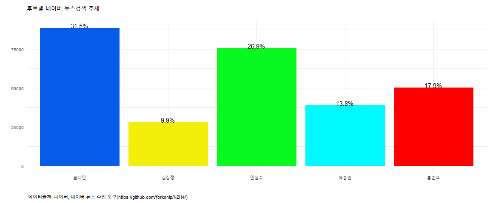

# 데이터 과학자가 바라본 20대 총선

## 네이버, 구글 뉴스 추세

제19대 대통령선거가 치뤄지고 있는 2017년 현재 기존 PC 패러다임의 강자 네이버와 안드로이드를 품고 있는 
모바일 강자 구글이 각자 분야에서 양강을 이루는 것은 확실하다. 즉, 이동할 때는 모바일 구글, 이동하지 않고 
자리를 잡고 있을 때는 PC 네이버가 확실한 경쟁우위를 갖추고 있다.

[구글 추세(Google Trends)](https://trends.google.com/) 서비스를 통해 사용자들이 가장 많이 검색하는 검색어를 통해 추세를 대세(?)를 살펴볼 수 있다. 
특히, 안드로이드, iOS 탑재된 스마트폰이 널리 보급되고 검색 인터페이스가 기존 입력방식에서 음성언어를 폭넓게 지원하고, 
인식률도 현저히 높아짐에 따라 사람들의 검색량도 증가하고 구글 추세 분석 결과도 신빙성을 높혀가고 있다.

그럼 구글 추세를 네이버에 적용이 가능할까? 

## 네이버 뉴스 추세(nTrend)

[네이버 뉴스 수집을 위한 도구](https://github.com/forkonlp/N2H4)를 활용하여 원데이터를 가져오고 나서,
해당기간 최대 뉴스에 대한 값을 최대값으로 정하고 이에 대한 상대적인 비율을 적용하여 추세정보를 생성한다.

### 최근 한달간 추세

17년 4월 1일부터 최근까지 한달간 추세는 다음과 같다.

<!--html_preserve-->

<!--/html_preserve--><!--html_preserve-->

<!--/html_preserve-->

~~~{.r}
# 0. 환경설정 ---------------------------------------------------------------
# if (!require("devtools")) install.packages("devtools")
# devtools::install_github("forkonlp/N2H4")
library(N2H4)
library(ggplot2)
library(tidyverse)
library(plotly)
library(lubridate)

# 1. 데이터 긁어오기 --------------------------------------------------------

start_date<-"2017-04-01"
end_date<-"2017-05-01"

candidates <- c("문재인", "홍준표", "안철수", "유승민", "심상정")

trend_df <- c()

for(candidate in candidates){
  print(candidate)
  tmp <- getNewsTrend(candidate, start_date, end_date)
  trend_df <- rbind(trend_df, cbind(data.frame(`후보`=candidate,tmp)))
}

# 2. 데이터 정제 --------------------------------------------------------

trends_df <- trend_df %>% mutate(global_max = max(cnt)) %>% 
  group_by(date) %>% 
  mutate(ntrend = cnt / global_max *100)

trends_hist_df <- trend_df %>% group_by(후보) %>% 
  summarise(tlt_cnt = sum(cnt)) %>% 
  mutate(cnt_pcnt = tlt_cnt/sum(tlt_cnt)) %>% 
  mutate(후보=factor(후보, levels=c("문재인","홍준표","안철수","유승민","심상정")))

# 3. 데이터 시각화 --------------------------------------------------------

ntrend_g <- ggplot(trends_df,aes(x=date, y=ntrend, color=후보)) +
  geom_line() +
  scale_x_date(date_labels="%m-%d") +
  theme_minimal() +
  theme(legend.position="none", 
        plot.caption=element_text(hjust=0,size=8),
        plot.subtitle=element_text(face="italic"),
        axis.text=element_text(size=7.5))+
  labs(x="",y="",title="후보별 네이버 뉴스검색 추세",
       caption="\n 데이터출처: 네이버, 네이버 뉴스 수집 도구(https://github.com/forkonlp/N2H4/)",
       subtitle="") +
  scale_colour_manual(name="",
                      values=c(문재인="#065ce8", 
                               홍준표="#ff0000",
                               안철수="#07f91f",
                               유승민="#00faff",
                               심상정="#f2ee09")) +
  geom_vline(xintercept=as.numeric(ymd("2017-04-19")), linetype=4, color="darkgrey", size=0.5) +
  geom_vline(xintercept=as.numeric(ymd("2017-04-23")), linetype=4, color="darkgrey", size=0.5) +
  geom_vline(xintercept=as.numeric(ymd("2017-04-25")), linetype=4, color="darkgrey", size=0.5) +
  geom_vline(xintercept=as.numeric(ymd("2017-04-28")), linetype=4, color="darkgrey", size=0.5) +
  annotate(geom="text",x=as.Date("2017-04-19"), y=3,label="KBS",fontface="bold", size=3) +
  annotate(geom="text",x=as.Date("2017-04-23"), y=3,label="1차",fontface="bold", size=3) +
  annotate(geom="text",x=as.Date("2017-04-25"), y=3,label="JTBC",fontface="bold", size=3) +
  annotate(geom="text",x=as.Date("2017-04-28"), y=3,label="2차",fontface="bold", size=3)

ntrend_hist_g <- ggplot(trends_hist_df, aes(x=후보, y=tlt_cnt)) +
  geom_bar(stat="identity", data=subset(trends_hist_df, 후보=="문재인"), fill="#065ce8") +
  geom_bar(stat="identity", data=subset(trends_hist_df, 후보=="홍준표"), fill="#ff0000") +
  geom_bar(stat="identity", data=subset(trends_hist_df, 후보=="안철수"), fill="#07f91f") +
  geom_bar(stat="identity", data=subset(trends_hist_df, 후보=="유승민"), fill="#00faff") +
  geom_bar(stat="identity", data=subset(trends_hist_df, 후보=="심상정"), fill="#f2ee09") +
  theme_minimal() +
  theme(legend.position="none", 
        plot.caption=element_text(hjust=0,size=8),
        plot.subtitle=element_text(face="italic"),
        axis.text=element_text(size=7.5))+
  labs(x="",y="",title="후보별 네이버 뉴스검색 추세",
       caption="\n 데이터출처: 네이버, 네이버 뉴스 수집 도구(https://github.com/forkonlp/N2H4/)",
       subtitle="") +
  geom_text(data=trends_hist_df,aes(x=후보,y=tlt_cnt, label=scales::percent(cnt_pcnt)),vjust=0)

# 4. 표 --------------------------------------------------------------

DT::datatable(trends_df %>% dplyr::select(후보, date, cnt) %>% 
                spread(후보, cnt)) %>% 
  DT::formatCurrency(c(2:6), "", interval=3, mark=',', digits=0)
~~~

