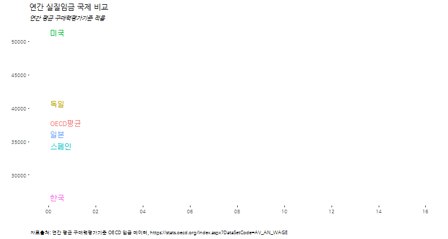

```{r setOptions, message=FALSE, include=FALSE}
source("tools/chunk-options.R")
library(tidyverse)
library(lubridate)
library(ggthemes)
library(animation)
library(extrafont)
loadfonts()
```

## 1. OECD 주요국가 연간 실질 임금 국제비교 [^oecd-annual-wage] [^yonhapnews-oecd-labor-hours]

[^oecd-annual-wage]: [OECD.Stat Average annual wages](https://stats.oecd.org/Index.aspx?DataSetCode=AV_AN_WAGE)

[^yonhapnews-oecd-labor-hours]: [연합뉴스, yulsid@yna.co.kr, 韓 노동시간 OECD 2위…日보다 두달 더 일하고 임금은 4분의3](http://www.yonhapnews.co.kr/bulletin/2016/08/13/0200000000AKR20160813053100009.HTML)

저녁이 있는 삶이 2012년 손학규 대표가 대통령 출마를 선언하면서 한국사회에 던진 출사표다.
저녁이 있는 삶을 보장받기 위해서 물리적으로 최소한 일정금액 이상의 실질임금이 보장되어야 한다.
OECD에서 매년 조사하고 있는 주요국가 연간 실질임금을 시각화해서 더 나아질 여유가 있는지 살펴보자.



## 2. OECD 주요 국가별 연간 실질임금 추이 시각화

OECD 공개 데이터를 구글에서 검색하면 쉽게 OECD [OECD.Stat Average annual wages](https://stats.oecd.org/Index.aspx?DataSetCode=AV_AN_WAGE)
웹사이트에 접속하게 된다. 엑셀이나 `.csv` 등 분석에 용이한 형태로 다운로드 받는다. 

### 2.1. 환경설정

``` {r oecd-wage-setup, eval=FALSE}
# 0. 환경설정 --------------------------------------------------------------------------
library(tidyverse)
library(lubridate)
library(ggthemes)
library(animation)
library(extrafont)
loadfonts()
```

### 2.2. OECD 연간 실질임금 데이터

데이터를 불러와서 시계열 데이터형태로 변형한 후에,
한국을 비롯한 주요 국가를 선택하고, 한글화 작업을 한다.

``` {r oecd-wage-data-import, warn=FALSE, message=FALSE}
# 1. 데이터 가져오기 --------------------------------------------------------------------------
wage_dat <- read_csv("data/AV_AN_WAGE_19012017103102543.csv", col_names=TRUE)

# 2. 데이터 정제 --------------------------------------------------------------------------
wage_dat <- wage_dat %>% dplyr::filter(Series=="In 2015 constant prices at 2015 USD PPPs") %>% 
  dplyr::select(country=Country, Time, wage=Value) %>% 
  mutate(date = ymd(paste0(Time,"-01-01"))) %>% dplyr::select(-Time)

wage_dat$country <- plyr::revalue(wage_dat$country, c("Germany" ="독일",
                                                "Korea" = "한국",
                                                "Spain" = "스페인",
                                                "United States" = "미국",
                                                "Japan" = "일본",
                                                "OECD countries" = "OECD평균"))
dlist<-unique(wage_dat$date)
```

### 2.3. 한국을 포함한 6개국 연간 실질임금 시각화

"한국", "독일", "스페인", "일본", "미국", 5개국과 "OECD평균" 총 6곳에 대해 
시각화한다.

``` {r oecd-wage-facet}
# 3. 연간 실질 임금 시각화  --------------------------------------------------------------------------

# korea_friends <- c("Korea", "Germany", "Spain", "Japan", "United States", "OECD countries")
korea_friends <- c("한국", "독일", "스페인", "일본", "미국", "OECD평균")

# 3.1. 연간 실질 임금 국제 비교 ------------------------------------------------------------------

ggplot(data=wage_dat %>% dplyr::filter(country %in% korea_friends),
       aes(x=date, y=wage, color=country, label=country))+
  geom_line(size=1.1)+
  scale_x_date(breaks=seq(dlist[1], tail(dlist,1)+years(1), "2 year"),
               date_labels="%y",limits=c(dlist[1],tail(dlist,1)+years(1)))+
  facet_wrap(~country)+
  theme_tufte() +
  theme(legend.position="none", plot.caption=element_text(hjust=0,size=8),plot.subtitle=element_text(face="italic"),
        axis.text=element_text(size=7.5))+
  labs(x="",y="",title="연간 실질임금 국제 비교",
       caption="\n 자료출처: 연간 평균 구매력평가기준 OECD 임금 데이터, https://stats.oecd.org/Index.aspx?DataSetCode=AV_AN_WAGE",
       subtitle="연간 평균 구매력평가기준 적용") +
  theme(text=element_text(family="NanumGothic"))
```

### 2.4. 한국, 일본, 미국, 독일, OECD 평균 일괄비교

facet 그래프가 아니라 한국, 일본, 미국, 독일, OECD 평균, 연간 노동시간을 일괄비교하는 시각화 그래프를 생성한다.


``` {r oecd-wage-major-country}
# 3.2. OECD 실질임금 국제 비교 ------------------------------------------------------------------

ggplot(data=wage_dat %>% dplyr::filter(country %in% korea_friends), 
       aes(x=date, y=wage, color=country, label=country))+
  geom_line(size=1.1)+
  scale_x_date(breaks=seq(dlist[1], tail(dlist,1)+years(1), "2 year"),
               date_labels="%y", limits=c(dlist[1],tail(dlist,1)+years(1)))+
  geom_text(data=wage_dat %>% dplyr::filter(country %in% korea_friends & date==tail(dlist,1)), hjust=0, nudge_x=30) +
  theme_tufte() +
  theme(legend.position="none", plot.caption=element_text(hjust=0,size=8),plot.subtitle=element_text(face="italic"),
        axis.text=element_text(size=7.5))+
  labs(x="",y="",title="연간 실질임금 국제 비교",
       caption="\n 자료출처: 연간 평균 구매력평가기준 OECD 임금 데이터, https://stats.oecd.org/Index.aspx?DataSetCode=AV_AN_WAGE",
       subtitle="연간 평균 구매력평가기준 적용") +
  theme(text=element_text(family="NanumGothic"))

```

### 2.5. 한국을 포함한 6개국 연간 실질임금 변화 애니메이션

한국을 포함한 6개국 연간 실질임금 변화를 애니메이션으로 시각화한다.

``` {r oecd-wage-animation, eval=FALSE}
# 3.3. 연간 실질임금 변동 애니메이션----------------------------------------------------

wage_plot<-function(i){
  ggplot(data=wage_dat %>% dplyr::filter(date<=dlist[i] & country %in% korea_friends), 
         aes(x=date, y=wage, color=country, label=country))+
    geom_line(size=1.1)+
    scale_x_date(breaks=seq(dlist[1], tail(dlist,1)+years(1), "2 year"),
                 date_labels="%y", limits=c(dlist[1],tail(dlist,1)+years(1)))+
    geom_text(data=wage_dat %>% dplyr::filter(country %in% korea_friends & date==tail(dlist[i],1)), hjust=0, nudge_x=30) +
    theme_tufte() +
    theme(legend.position="none", plot.caption=element_text(hjust=0,size=8),plot.subtitle=element_text(face="italic"),
          axis.text=element_text(size=7.5))+
    labs(x="",y="",title="연간 실질임금 국제 비교",
         caption="\n 자료출처: 연간 평균 구매력평가기준 OECD 임금 데이터, https://stats.oecd.org/Index.aspx?DataSetCode=AV_AN_WAGE",
         subtitle="연간 평균 구매력평가기준 적용") +
    theme(text=element_text(family="NanumGothic"))
}


oopt = ani.options(interval = 0.5)
saveGIF({for (i in 1:length(dlist)) {
  g <- wage_plot(i)
  
  print(g)
  print(i)
  ani.pause()
}
  
  for (i2 in 1:20) {
    print(g)
    ani.pause()
  }
}, movie.name="wage_compare international.gif",ani.width = 750, ani.height = 400)
```