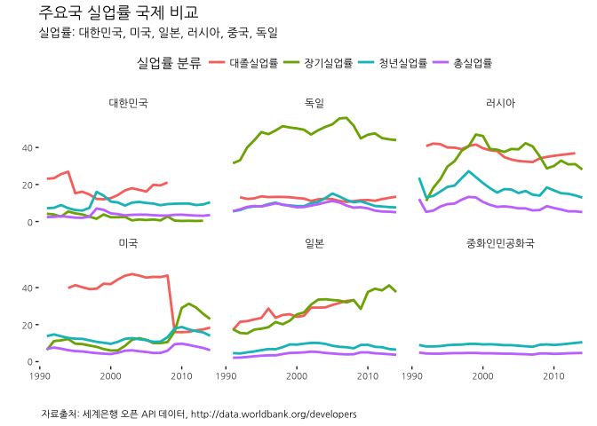
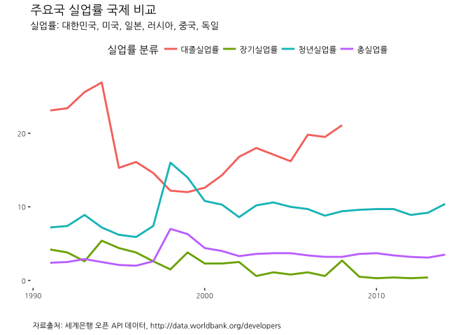

# 데이터 과학자와 함께 하는 제19대 대통령 선거

## 1. 세계은행 API를 통한 주요국가 실업률 국제 비교 [^wbstats-pkg] [^yonhap-unemp-20170123]

[^wbstats-pkg]: [wbstats: Programmatic Access to Data and Statistics from the World Bank API](https://cran.r-project.org/web/packages/wbstats/index.html)

[^yonhap-unemp-20170123]: ['사실상 백수' 450만명..자력형 취준생 8년만에 최대 증가](http://media.daum.net/v/20170123060802357)

저녁이 있는 삶이 2012년 손학규 대표가 대통령 출마를 선언하면서 한국사회에 던진 출사표다.
저녁이 있는 삶을 보장받기 위해서 누구나 일자리를 갖고 있고 있어야 한다.
세계은행 API를 통해 주요국가 및 한국의 실업률을 시각화해서 더 나아질 여유가 있는지 살펴보자.

## 2. 실업률 국제비교 및 대한민국 실업률 

세계은행 데이터를 오픈 API형태로 공개 데이터하기 때문에 [http://data.worldbank.org/developers](http://data.worldbank.org/developers) 사이트를 통해 데이터를 전달 받을 수 있다.
R을 사용하게 되면 몇가지 혜택이 더 있는데, 가장 큰 혜택은 R 팩키지를 통해 인자만 지정하면 직접 세계은행 데이터를 API를 통해 바로 데이터프레임으로 작업이 가능하다는 점이다.

[WDI: World Development Indicators (World Bank)](https://cran.r-project.org/web/packages/WDI/index.html)가 2013년 개발되어 한 동안 잘 활용되었고,
최근에 [wbstats: Programmatic Access to Data and Statistics from the World Bank API](https://cran.r-project.org/web/packages/wbstats/)가 더욱 향상된 기능을 제공하여 
세계은행 오픈 데이터를 API형태로 자유로이 활용이 가능하게 되었다.

### 2.1. 환경설정

~~~{.r}
# 0. 환경설정 --------------------------------------------------------------------------
library(ggplot2)
library(scales)
library(tidyverse)
library(rvest)
library(countrycode) # ISO 코드에 국가명 붙이기
library(wbstats) # install.packages("wbstats")
library(extrafont)
library(ggthemes)
library(purrr)
loadfonts()
~~~

### 2.2. IOS 국가코드

주요국가를 비교하기 위해 국가명 한글화가 필요한데 ISO 2자리 국가코드, ISO 3자리 국가코드를 한글 국가명과 매칭을 해야 하는데,
이를 자동화하는 방법으로 [위키 국가명 웹페이지 국가코드표](https://ko.wikipedia.org/wiki/ISO_3166-1)를 긁어와서 병합하여 매칭한다.

~~~{.r}
# 1. IOS 국가명 매칭  --------------------------------------------------------------------------
# 한국과 주요 5개국(미국, 일본, 러시아, 중국, 독일)
kor_six <- c("Korea", "Japan", "United States", "Russia", "China", "Germany")
kor_six_code <- countrycode(kor_six, 'country.name', 'iso3c')
kor_cd <- data.frame(country_nm=kor_six, country_cd=kor_six_code)

# IOS 코드에 국가명 매칭
url <- "https://ko.wikipedia.org/wiki/ISO_3166-1" 

kor_iso <- url %>%
  read_html() %>%
  html_nodes(xpath='//*[@id="mw-content-text"]/table[1]') %>%
  html_table(fill = TRUE) %>% 
  .[[1]]

kor_cd <- left_join(kor_cd, kor_iso, by=c("country_cd" = "alpha-3")) %>% 
  dplyr::rename(country_knm = `나라 이름`, country_num = `숫자`, iso2c =`alpha-2`)
~~~

~~~{.output}
Warning in left_join_impl(x, y, by$x, by$y, suffix$x, suffix$y): joining
character vector and factor, coercing into character vector

~~~

### 2.3. 실업률 데이터 추출

`wbsearch` 함수가 정규표현식을 지원하여 이를 활용하여 연관된 데이터를 추출한다.

- SL.UEM.TOTL.ZS: 총실업률(Unemployment, total (% of total labor force) (modeled ILO estimate))
- SL.UEM.TERT.ZS: 대졸실업률(Unemployment with tertiary education (% of total unemployment))
- SL.UEM.LTRM.ZS: 장기실업률(Long-term unemployment (% of total unemployment))
- SL.UEM.1524.ZS: 청년실업률(Unemployment, youth total (% of total labor force ages 15-24) (modeled ILO estimate))

~~~{.r}
# 2. 실업률 데이터 추출  --------------------------------------------------------------------------

unemply_vars <- wbsearch(pattern = "unemployment")

unemp_df <- wb(country=kor_cd$country_cd,
           indicator = c("SL.UEM.TOTL.ZS",
                         "SL.UEM.TERT.ZS",
                         "SL.UEM.LTRM.ZS",
                         "SL.UEM.1524.ZS"), startdate = 1991, enddate = 2015, POSIXct = TRUE) %>% as.data.frame()

unemp_m_df <- left_join(unemp_df, kor_cd, by="iso2c") %>% mutate(unemp_group = plyr::revalue(indicator,
                                                  c("Long-term unemployment (% of total unemployment)"="장기실업률",
                                                    "Unemployment with tertiary education (% of total unemployment)"="대졸실업률",
                                                    "Unemployment, total (% of total labor force) (modeled ILO estimate)"="총실업률",
                                                    "Unemployment, youth total (% of total labor force ages 15-24) (modeled ILO estimate)"="청년실업률")))
~~~

### 2.4. 실업률 국제비교

~~~{.r}
# 실업률 국제비교
ggplot(unemp_m_df, aes(x = date_ct, y = value, colour = unemp_group)) + geom_line(size = 1) +
  labs(title = "실업률", x = "Date", y = "") +
  facet_wrap(~country_knm) +
  theme_tufte() +
  theme(legend.position="top", plot.caption=element_text(hjust=0,size=8),plot.subtitle=element_text(face="italic"),
        axis.text=element_text(size=7.5))+
  labs(x="",y="",title="주요국 실업률 국제 비교", color = "실업률 분류", 
       caption="\n 자료출처: 세계은행 오픈 API 데이터, http://data.worldbank.org/developers",
       subtitle="실업률: 대한민국, 미국, 일본, 러시아, 중국, 독일") +
  theme(text=element_text(family="NanumGothic"))
~~~

### 2.5. 대한민국 실업률 

~~~{.r}
# 대한민국 실업률
ggplot(unemp_m_df %>% dplyr::filter(country_knm=="대한민국"), aes(x = date_ct, y = value, colour = unemp_group)) + geom_line(size = 1) +
  theme_tufte() +
  theme(legend.position="top", plot.caption=element_text(hjust=0,size=8),plot.subtitle=element_text(face="italic"),
        axis.text=element_text(size=7.5))+
  labs(x="",y="",title="주요국 실업률 국제 비교", color = "실업률 분류", 
       caption="\n 자료출처: 세계은행 오픈 API 데이터, http://data.worldbank.org/developers",
       subtitle="실업률: 대한민국, 미국, 일본, 러시아, 중국, 독일") +
  theme(text=element_text(family="NanumGothic"))
~~~

