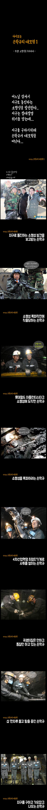
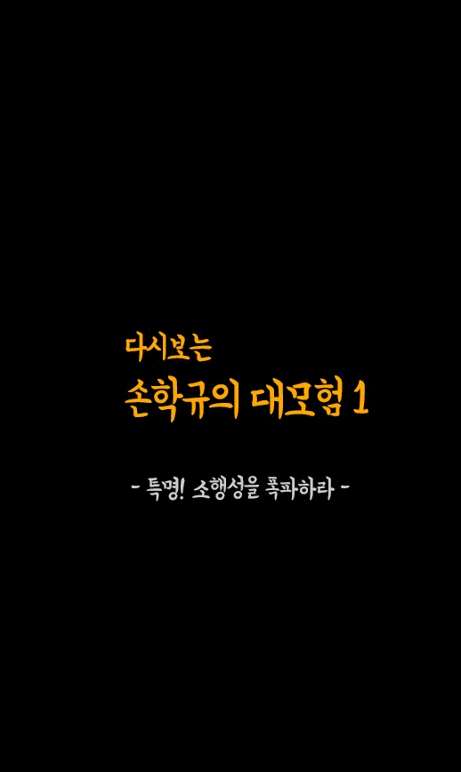

# 데이터 과학자와 함께 하는 제19대 대통령 선거

## 손학규 대모험 애니메이션 

손학규 대모험 시리즈는 손학규 후보의 든든한 정치적 자산이기도 하지만, 우선 재미지다.
지나간 손하규 대모험 시리즈를 현재 감각에 맞게 애니메이션으로 만들어 보자.

### 환경설정 

우선 카드 뉴스 형태로 제작된 이미지를 구해서 이를 핸드폰에서 올려볼 수 있도록 쭉 붙여보자.
이를 위해 우선 R에서 사용할 수 있도록 환경을 설정한다.

~~~{.r}
# 0. 환경설정--------------------------------------------------
library(png)
library(grid)
library(dplyr)
library(magick)
library(stringr)
~~~

### 스마트폰에서 쭉 올려보기

스마트폰에서 쭉 올려볼 수 있도록 손학규 대모험 시리즈 1편에 나온 이미지를 R 작업공간에 올려넣는다.
그리고 나서, `image_append` 함수에 `stack = FALSE` 인자를 넣어 하나의 이미지로 만들어 낸다.

~~~{.r}
# 1. 데이터 불러오기 ----------------------------------------------

adven_part_1 <- list.files("data/손학규_대모험_1/") 

adven_part_1_bucket <- list()

# 2. 사진 정보 확인 ------------------------------------------------
for(lst in seq_along(adven_part_1)){
    tmp <- image_read(paste0("data/손학규_대모험_1/", adven_part_1[lst]))
    adven_part_1_bucket[[lst]] <- image_info(tmp)
}

adven_part_1_buckets <- do.call(rbind, adven_part_1_bucket)

# 3. 이미지 쫙 붙이기 ------------------------------------------------
# 전체 이미지 불러오기
for(lst in seq_along(adven_part_1)){
    img_name <- adven_part_1[lst]
    assign(img_name, image_read(paste0("data/손학규_대모험_1/", adven_part_1[lst])))
}

adven_part_1_vec <- c(KakaoTalk_20170321_152931122.jpg, KakaoTalk_20170321_152937319.jpg, KakaoTalk_20170321_152939486.jpg, 
KakaoTalk_20170321_152941452.jpg, KakaoTalk_20170321_152942992.jpg, KakaoTalk_20170321_152944822.jpg, KakaoTalk_20170321_152950266.jpg, 
KakaoTalk_20170321_152952331.jpg, KakaoTalk_20170321_152954191.jpg, KakaoTalk_20170321_152957528.jpg)

adven_part_1_stack <- image_append(adven_part_1_vec, stack = FALSE)

adven_part_1_stack
~~~

~~~{.output}
  format width height colorspace filesize
1   JPEG  5180    868       sRGB        0

~~~

~~~{.r}
# image_write(adven_part_1_stack, "output/adven_part_1_horizon.png", format = "png")
~~~

### 손학규 대모험 애니메이션

동일한 이미지를 사용하는 것은 같으나 각 사진을 애니메이션 프레임으로 넣고 `fps` 값을 조정하여 애니메이션을 실행시킨다.

~~~{.r}
start_img <- KakaoTalk_20170321_152931122.jpg

adven_part_1_vec <- c(KakaoTalk_20170321_152931122.jpg, KakaoTalk_20170321_152937319.jpg, KakaoTalk_20170321_152939486.jpg, 
KakaoTalk_20170321_152941452.jpg, KakaoTalk_20170321_152942992.jpg, KakaoTalk_20170321_152944822.jpg, KakaoTalk_20170321_152950266.jpg, 
KakaoTalk_20170321_152952331.jpg, KakaoTalk_20170321_152954191.jpg, KakaoTalk_20170321_152957528.jpg)

frames <- lapply(adven_part_1_vec, function(frame) {
    image_composite(start_img, frame)
})

animation <- image_animate(image_join(frames), fps=0.2)

animation
~~~

~~~{.output}
   format width height colorspace filesize
1     gif   518    868       sRGB        0
2     gif   518    868       sRGB        0
3     gif   518    868       sRGB        0
4     gif   518    868       sRGB        0
5     gif   518    868       sRGB        0
6     gif   518    868       sRGB        0
7     gif   518    868       sRGB        0
8     gif   518    868       sRGB        0
9     gif   518    868       sRGB        0
10    gif   518    868       sRGB        0

~~~

~~~{.r}
# image_write(animation, "output/adven_1.gif")
~~~

