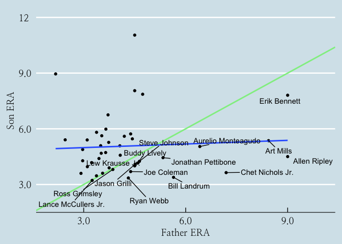

# Following the 19th Korean presidential election with a Data Scientist

## 1. Hypothesis Test

One weekend, as I was reading ['Kang-jin diaries'](http://www.kyobobook.co.kr/product/detailViewKor.laf?mallGb=KOR&ejkGb=KOR&barcode=9791195823086&orderClick=JAI) by [Sohn Hak-kyu](https://namu.wiki/w/손학규), 
which he wrote when he returned to politics as the executive director of the [East Asia Future Foundation](http://www.future21.or.kr) last year, 
I got the inspiration to code this. This is the outcome of the R coding of the first weekend of 2017.

Is the talent of MLB pitchers inherited? 
Can a son outrun his father? Jumping to the conclusion, 
a son may or may not outrun his father. 
However, the talent of the son shows regression to the mean. 
In other words, the son of an outstanding father tends to be more average than his father, 
and the son of a not-so-talented father tends to outrun his father, as he skews towards average.

## 2. Data

I got a list of families that have three consecutive generations of Major League pitchers from Wikipedia, 
and gathered the records of pitchers’ performances from Lahman’s Baseball Database. 
The hypothesis was verified based on the records and ERA.

- [Wikipedia, List of second-generation Major League Baseball players](https://en.wikipedia.org/wiki/List_of_second-generation_Major_League_Baseball_players) : 46 families in total
- [Lahman](http://seanlahman.com/) :Lahman’s Baseball Database: Records of innings, points lost, ERA, etc.

## 3. R Code

### 3.1. Setting it up

One can notice that Lahman’s database is easy to access via R package.

~~~{.r}
# 0. Configuration ----------------------------------------
library(ggplot2)
library(tidyverse)
library(Lahman)
library(stringr)
library(ggthemes)
library(extrafont)
library(gridExtra)
library(ggrepel)
library(DT)
library(rvest)
library(httr)
loadfonts()
~~~

### 3.2. Import Data - Wikipedia

First, get the list of fathers and sons who were baseball players. 
Thankfully, Wikipedia has a neat list, which on can use for analysis. 
Use specifically fathers-and-sons who were both pitchers.

~~~{.r}
url <- "https://en.wikipedia.org/wiki/List_of_second-generation_Major_League_Baseball_players" 

player <- url %>%
  read_html() %>%
  html_nodes(xpath='//*[@id="mw-content-text"]/table[2]') %>%
  html_table(fill = TRUE) %>% 
  .[[1]]

names(player) <- c("father", "f_posi", "son", "son_posi")

player_pitcher <- player %>% dplyr::filter(f_posi =="Pitcher" & son_posi =="Pitcher") %>% 
                     mutate(father = str_replace_all(father, "\\*", ''),
                            son = str_replace_all(son, "\\*", '')) %>% 
                     mutate(father = str_replace_all(father, ",", ''),
                            son = str_replace_all(son, ",", '')) %>% 
                     mutate(father = str_replace_all(father, "†", ''),
                            son = str_replace_all(son, "†", '')) %>% 
                     mutate(family_key = paste0("fam", seq(1, 46,1)))
datatable(player_pitcher)                     
~~~

<!--html_preserve-->

<!--/html_preserve-->

To join the data with Lahman’s database, 
use nameLast and nameFirst as the keys. 
Therefore, one needs to separate the first and last names and convert the **wide** data format to **long** data format.

~~~{.r}
player_f_df <- player_pitcher %>% dplyr::select(pitcher_name=father, family_key) %>% 
  mutate(family="father")
player_s_df <- player_pitcher %>% dplyr::select(pitcher_name=son, family_key) %>% 
  mutate(family="son")

player_fs_df <- bind_rows(player_f_df, player_s_df)

player_fs_df <- player_fs_df %>% 
                  tidyr::separate(pitcher_name, into=c("nameFirst", "nameLast"), sep=" ", remove = FALSE)

datatable(player_fs_df)
~~~

<!--html_preserve-->

<!--/html_preserve-->

### 3.3. Merging the names and Lahman performance records

#### 3.3.1. Appending playerID to the pitcher name list

There were many overlapping values among the first and last names due to them containing special characters, 
fathers and sons sharing the same family names, and often having common first names. 
Through data cleansing works, I gave the overlapping names unique playerIDs. 
In fact, I spent the whole weekend writing this code.

~~~{.r}
player_db <- playerInfo("")
player_m <- left_join(player_fs_df, player_db, by=c("nameFirst", "nameLast"))

player_m_f <- player_m %>% dplyr::filter(family=="father") %>% group_by(family, nameFirst, nameLast, pitcher_name, family_key) %>% 
  summarise(playerID = first(playerID)) %>% 
  mutate(playerID = ifelse(nameLast == "Monteagudo" & family=="father", "montere01", playerID),
         playerID = ifelse(nameFirst == "Pedro" & family=="father", "borbope01", playerID),
         playerID = ifelse(nameFirst == "Pedro" & family=="son", "borbope02", playerID))
         

player_m_s <- player_m %>% dplyr::filter(family=="son") %>% group_by(family, nameFirst, nameLast, pitcher_name, family_key) %>% 
  summarise(playerID = last(playerID)) %>% 
  mutate(playerID = ifelse(nameFirst == "Pedro" & family=="son", "borbope02", playerID),
         playerID = ifelse(nameFirst == "Tom" & family=="son", "jacquto01", playerID),
         playerID = ifelse(nameFirst == "Gilberto" & family=="son", "rondogi01", playerID))

# merge father and son
player_m_list <- bind_rows(player_m_f, player_m_s)

datatable(player_m_list)
~~~

<!--html_preserve-->

<!--/html_preserve-->

#### 3.3.2. Merging the pitcher names and performance record

The process of combining the father and sons’ names(player_m_list) and 
their records(Pitching) can be summarized in one line; the key is playerID. 
The ERA is the most important indicator for a pitcher’s performance. 
The formula for calculating the ERA for each pitchers’ entire career is as follows:

$$\frac{\text{ER}}{\frac{\text{IPouts}}{3}} \times 9$$

- ERA(Earned Run Average): The average of the points the pitcher lost per game
- ER(Earned Run): A run that scores against a pitcher without an error or passed ball
- IPouts(Outs Pitched): Innings pitched \(\times\) 3.

~~~{.r}
player_pitch <- left_join(player_m_list, Pitching, by="playerID")

player_pitch_father <- player_pitch %>% group_by(playerID, nameFirst, nameLast, family, family_key) %>% 
  summarise(ERA = sum(ER, na.rm=TRUE)/(sum(IPouts, na.rm=TRUE)/3)*9) %>% 
  dplyr::filter(family =="father")

player_pitch_son <- player_pitch %>% group_by(playerID, nameFirst, nameLast, family, family_key) %>% 
  summarise(ERA = sum(ER, na.rm=TRUE)/(sum(IPouts, na.rm=TRUE)/3)*9) %>% 
  dplyr::filter(family =="son")

player_pitch_m <- bind_rows(player_pitch_father, player_pitch_son)

datatable(player_pitch_m) %>% 
  formatRound("ERA", digits = 2)
~~~

<!--html_preserve-->

<!--/html_preserve-->

### 3.4. Visualize the father and sons’ ERA

#### 3.4.1. Sons who outperformed their fathers

If the father’s ERA is higher than the son’s, 
one can say the son has outperformed his father. 
If the father’s ERA is higher than average, 
the son’s ERA tends to be better, due to the data regressing to the mean.

~~~{.r}
player_era_mean <- player_pitch_m[,-c(1:3)] %>% spread(key=family, value=ERA) %>% 
  dplyr::rename(father_era=father, son_era=son)

player_viz_df <- player_era_mean %>% left_join(player_pitcher, by="family_key")

# the son’s ERA tends to be better father
ggplot(player_viz_df, aes(father_era, son_era)) +
  geom_abline(intercept = 0, slope = 1, size=1, color="lightgreen") +
  geom_point() +
  geom_smooth(method="lm", se=FALSE) +
  labs(
    x="Father ERA",
    y="Son ERA") +
  theme_economist(base_size = 14, base_family="NanumMyeongjo") +
  scale_y_continuous(breaks = seq(3, 12, 3),
                     labels = c('3.0', '6.0', '9.0', '12'), 
                     limits = c(2, 12)) +
  scale_x_continuous(breaks = seq(3, 12, 3),
                     labels = c('3.0', '6.0', '9.0', '12'), 
                     limits = c(2, 10)) +
  geom_text_repel(aes(label=ifelse(son_era < father_era, son,'')))
~~~

~~~{.r}
player_viz_df %>% dplyr::filter(son_era<father_era) %>% arrange(son_era) %>% 
  dplyr::select(family_key, father, father_era, son, son_era) %>% 
  datatable() %>% 
  formatRound("father_era", digits = 2) %>% 
  formatRound("son_era", digits = 2)
~~~

<!--html_preserve-->

<!--/html_preserve-->

#### 3.4.2. Sons who performed worse than their fathers

If the father’s ERA is lower than the son’s, 
one can say than the son didn’t perform as well as his father. 
If the father’s ERA is low, due to the data regressing towards the mean, 
the son’s ERA tends to be higher than the father’s, 
and shows that the sons didn’t perform as well as their fathers.

~~~{.r}
# Sons who performed worse than their fathers
ggplot(player_viz_df, aes(father_era, son_era)) +
  geom_abline(intercept = 0, slope = 1, size=1, color="lightgreen") +
  geom_point() +
  geom_smooth(method="lm") +
  labs(
    x="Father ERA",
    y="Son ERA") +
  theme_economist(base_size = 14, base_family="NanumMyeongjo") +
  scale_y_continuous(breaks = seq(3, 12, 3),
                     labels = c('3.0', '6.0', '9.0', '12'), 
                     limits = c(2, 12)) +
  scale_x_continuous(breaks = seq(3, 12, 3),
                     labels = c('3.0', '6.0', '9.0', '12'), 
                     limits = c(2, 9)) +
  geom_text_repel(aes(label=ifelse(son_era > father_era, son,'')))
~~~

~~~{.r}
player_viz_df %>% dplyr::filter(son_era>father_era) %>% arrange(father_era) %>% 
  dplyr::select(family_key, father, father_era, son, son_era) %>% 
  datatable() %>% 
  formatRound("father_era", digits = 2) %>% 
  formatRound("son_era", digits = 2)
~~~

<!--html_preserve-->

<!--/html_preserve-->

