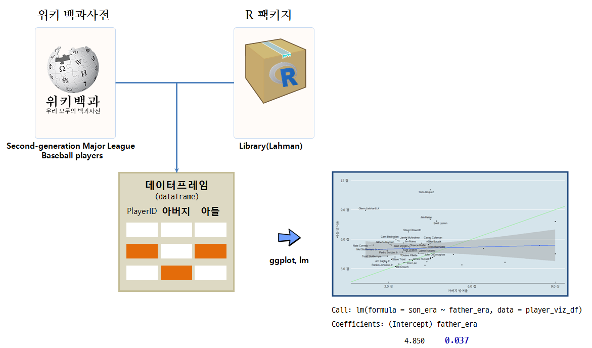

```{r setOptions, message=FALSE, include=FALSE}
source("tools/chunk-options.R")
library(ggplot2)
library(tidyverse)
library(Lahman)
library(stringr)
library(ggthemes)
library(extrafont)
library(gridExtra)
library(ggrepel)
library(DT)
loadfonts()
theme_set(theme_gray(base_family='NanumGothic'))
```

## 1. 가설 검정 개요

MLB 투수 유전자는 유전이 될까? 아버지보다 나은 아들은 존재하는가?
데이터를 통해 나온 결론부터 말한다면, 
아버지보다 나은 아들이 나오기도 하고, 나오지도 않는다.
다만, 아들은 아버지 평균에 회귀하는 성향이 나온다.
즉, 뛰어난 아버지를 가진 아들은 평균으로 회귀하고,
뛰어나지 못한 아버지를 가진 아들은 평균으로 회귀하여 더 좋은 성적을 갖게 된다.



## 2. 데이터

부자 혹은 할아버지, 아버지, 아들까지 3대에 걸쳐 미국 메이져리그에서 
투수로서 활약을 했던 명단을 위키피디아에서 입수하여 이를 `Lahman` 데이터베이스의
투수 기록을 전부 취합하여 방어율(ERA)을 기준으로 가설을 검정한다.

- [위키피디아, List of second-generation Major League Baseball players](https://en.wikipedia.org/wiki/List_of_second-generation_Major_League_Baseball_players) : 총 46 가족
- [Lahman](http://seanlahman.com/) 데이터베이스 투수 경기기록: 년도별 인닝, 실점, 방어율 등

## 3. R 코드


### 3.1. 환경설정

`Lahman` 데이터베이스를 R 팩키지를 통해 쉽게 가져올 수 있는 점이 눈에 띈다.

``` {r pe-baseball-wiki, message=FALSE, eval=FALSE}
# 0. 환경설정 ----------------------------------------
library(ggplot2)
library(tidyverse)
library(Lahman)
library(stringr)
library(ggthemes)
library(extrafont)
library(gridExtra)
library(ggrepel)
library(DT)
loadfonts()
```

### 3.2. 데이터 가져오기 - 위키

가장 먼저 부자 야구선수 명부를 확보하는 것이 급선무다. 
다행히도, 위키피디아에 잘 정리되어 있어 이를 바탕으로 명부를 확보하고 자료를 분석한다.
특히, 부자 야구선수 중 투수만을 선택하여 분석한다.

``` {r pe-baseball-wiki, message=FALSE}
url <- "https://en.wikipedia.org/wiki/List_of_second-generation_Major_League_Baseball_players" 

player <- url %>%
  read_html() %>%
  html_nodes(xpath='//*[@id="mw-content-text"]/table[2]') %>%
  html_table(fill = TRUE) %>% 
  .[[1]]

names(player) <- c("father", "f_posi", "son", "son_posi")

player_pitcher <- player %>% dplyr::filter(f_posi =="Pitcher" & son_posi =="Pitcher") %>% 
                     mutate(father = str_replace_all(father, "\\*", ''),
                            son = str_replace_all(son, "\\*", '')) %>% 
                     mutate(father = str_replace_all(father, ",", ''),
                            son = str_replace_all(son, ",", '')) %>% 
                     mutate(father = str_replace_all(father, "†", ''),
                            son = str_replace_all(son, "†", '')) %>% 
                     mutate(family_key = paste0("fam", seq(1, 46,1)))
datatable(player_pitcher)                     
```

`lahman` 데이터베이스에 병합(join)을 하려면 `nameLast`, `nameFirst`를 키값으로 
활용해야 되기 때문에 투수이름에서 성과 이름을 분리하고 **wide** 형태 데이터를 **long** 형태 데이터로 변환한다.


``` {r pe-baseball-lahman, message=FALSE}
player_f_df <- player_pitcher %>% dplyr::select(pitcher_name=father, family_key) %>% 
  mutate(family="father")
player_s_df <- player_pitcher %>% dplyr::select(pitcher_name=son, family_key) %>% 
  mutate(family="son")

player_fs_df <- bind_rows(player_f_df, player_s_df)

player_fs_df <- player_fs_df %>% 
                  tidyr::separate(pitcher_name, into=c("nameFirst", "nameLast"), sep=" ", remove = FALSE)

datatable(player_fs_df)
```

### 3.3. 부자 투수명과 Lahman 투수 성적 병합

#### 3.3.1. 부자투수명 명부에 `playerID` 붙이기

영문 이름과 성에 특히 중복이 많은데 이유는 특수문자도 들어 있고, 가족의 경우 성은 동일하고, 이름도 드물지 않게 
동일한 경우가 있다. 사전 데이터 정제 작업을 통해 결측값과 중복된 이름에 `playerID` 값을 부여한다.
사실 주말을 아래 코드를 작성하면서 날렸다. ㅠ.ㅠ

``` {r pe-baseball-playerID, message=FALSE}
player_db <- playerInfo("")
player_m <- left_join(player_fs_df, player_db, by=c("nameFirst", "nameLast"))

player_m_f <- player_m %>% dplyr::filter(family=="father") %>% group_by(family, nameFirst, nameLast, pitcher_name, family_key) %>% 
  summarise(playerID = first(playerID)) %>% 
  mutate(playerID = ifelse(nameLast == "Monteagudo" & family=="father", "montere01", playerID),
         playerID = ifelse(nameFirst == "Pedro" & family=="father", "borbope01", playerID),
         playerID = ifelse(nameFirst == "Pedro" & family=="son", "borbope02", playerID))
         

player_m_s <- player_m %>% dplyr::filter(family=="son") %>% group_by(family, nameFirst, nameLast, pitcher_name, family_key) %>% 
  summarise(playerID = last(playerID)) %>% 
  mutate(playerID = ifelse(nameFirst == "Pedro" & family=="son", "borbope02", playerID),
         playerID = ifelse(nameFirst == "Tom" & family=="son", "jacquto01", playerID),
         playerID = ifelse(nameFirst == "Gilberto" & family=="son", "rondogi01", playerID))

# 아버지 아들 명부와 경기 데이터 병합
player_m_list <- bind_rows(player_m_f, player_m_s)

datatable(player_m_list)
```

#### 3.3.2. 부자 투수명부에 투구 경기결과 병합

부자 투수명부(`player_m_list`)에 투구 경기결과(`Pitching`)를 병합하는 과정은 한 줄로 요약된다.
키값이 `playerID`가 된다. 그 다음 투수의 가장 중요한 성능지표인 방어율(ERA)를 `Pitching` 데이터에서
선수 전체 기간에 대한 방어율을 계산하는 공식은 다음과 같다.

$\frac{\text{ER}}{\frac{\text{IPouts}}{3}} \times 9$

- 평균자책점(ERA, Earned Run Average): 게임당 투수가 내준 점수, 즉 투수 자책점의 평균이다.
- 자책점(ER, Earned Run): 다른 수비에러 없이 실점하는 경우, 해당 실점은 투수 책임으로 투수 자책점이 된다.
- 아웃수(IPouts, Outs Pitched): 투구한 이닝수 $\times$ 3.

``` {r pe-baseball-merge, message=FALSE}
player_pitch <- left_join(player_m_list, Pitching, by="playerID")

player_pitch_father <- player_pitch %>% group_by(playerID, nameFirst, nameLast, family, family_key) %>% 
  summarise(ERA = sum(ER, na.rm=TRUE)/(sum(IPouts, na.rm=TRUE)/3)*9) %>% 
  dplyr::filter(family =="father")

player_pitch_son <- player_pitch %>% group_by(playerID, nameFirst, nameLast, family, family_key) %>% 
  summarise(ERA = sum(ER, na.rm=TRUE)/(sum(IPouts, na.rm=TRUE)/3)*9) %>% 
  dplyr::filter(family =="son")

player_pitch_m <- bind_rows(player_pitch_father, player_pitch_son)

datatable(player_pitch_m) %>% 
  formatRound("ERA", digits = 2)
```

### 3.4. 부자 투수 방어율 시각화

#### 3.4.1. 아버지보다 나은 성적을 보인 아들 

아버지 투수 방어율이 아들 투수 방어율보다 높은 경우 아들이 더 나은 것으로 판단한다.
[청출어람](http://krdic.naver.com/search.nhn?dic_where=krdic&query=청출어람)에 해당하는 경우로, 아버지 방어율이 원래 높은 경우 평균으로 회귀하는 특성이 반영되서
아들의 방어율이 아버지보다 좋게 된다.

``` {r pe-baseball-son-win, message=FALSE}
player_era_mean <- player_pitch_m[,-c(1:3)] %>% spread(key=family, value=ERA) %>% 
  dplyr::rename(father_era=father, son_era=son)

player_viz_df <- player_era_mean %>% left_join(player_pitcher, by="family_key")

# 아버지보다 더 좋은 성적은 거둔 아들
ggplot(player_viz_df, aes(father_era, son_era)) +
  geom_abline(intercept = 0, slope = 1, size=1, color="lightgreen") +
  geom_point() +
  geom_smooth(method="lm", se=FALSE) +
  labs(
    x="아버지 방어율",
    y="아들 방어율") +
  theme_economist(base_size = 14, base_family="NanumMyeongjo") +
  scale_y_continuous(breaks = seq(3, 12, 3),
                     labels = c('3.0 점', '6.0 점', '9.0 점', '12 점'), 
                     limits = c(2, 12)) +
  scale_x_continuous(breaks = seq(3, 12, 3),
                     labels = c('3.0 점', '6.0 점', '9.0 점', '12 점'), 
                     limits = c(2, 10)) +
  geom_text_repel(aes(label=ifelse(son_era < father_era, son,'')))

player_viz_df %>% dplyr::filter(son_era<father_era) %>% 
  dplyr::select(family_key, father, father_era, son, son_era) %>% 
  datatable() %>% 
  formatRound("father_era", digits = 2) %>% 
  formatRound("son_era", digits = 2)
```

#### 3.4.2. 아버지보다 못한 성적을 보인 아들 

아버지 투수 방어율이 아들 투수 방어율보다 낮은 경우 아들이 아버지 보다 못한 성적을 거둔 것으로 판단한다.
청출어람이 적용되지 않는 경우로, 아버지 방어율이 원래 낮은 경우 평균으로 회귀하는 특성이 반영되서
아들의 방어율이 아버지보다 높게 올라가 성적이 좋지 못하게 된다.

``` {r pe-baseball-father-win, message=FALSE}
# 아버지보다 못한 성적은 거둔 아들
ggplot(player_viz_df, aes(father_era, son_era)) +
  geom_abline(intercept = 0, slope = 1, size=1, color="lightgreen") +
  geom_point() +
  geom_smooth(method="lm") +
  labs(
    x="아버지 방어율",
    y="아들 방어율") +
  theme_economist(base_size = 14, base_family="NanumMyeongjo") +
  scale_y_continuous(breaks = seq(3, 12, 3),
                     labels = c('3.0 점', '6.0 점', '9.0 점', '12 점'), 
                     limits = c(2, 12)) +
  scale_x_continuous(breaks = seq(3, 12, 3),
                     labels = c('3.0 점', '6.0 점', '9.0 점', '12 점'), 
                     limits = c(2, 9)) +
  geom_text_repel(aes(label=ifelse(son_era > father_era, son,'')))

player_viz_df %>% dplyr::filter(son_era>father_era) %>% 
  dplyr::select(family_key, father, father_era, son, son_era) %>% 
  datatable() %>% 
  formatRound("father_era", digits = 2) %>% 
  formatRound("son_era", digits = 2)
```


