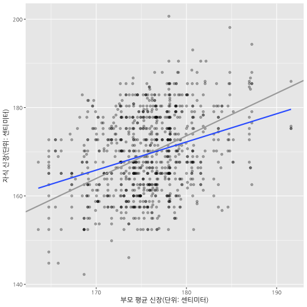

## 1. 회귀분석

### 1.1. 평균으로 회귀

프랜시스 골턴(Sir Francis Galton)은 진화론으로 유명한 찰스 다윈의 배다른 외사촌 형으로 
부모의 신장과 자식들의 신장 사이의 연관 관계를 연구하면서
부모와 자식 신장 사이에는 선형적인 관계가 있고, 
신장이 커지거나 작아지는 것보다는 전체 신장 평균으로 
**회귀(regression)**하는 경향이 있다는 가설을 세웠고,  
이를 데이터를 수집하여 증명하였다. 즉, 회귀계수가 1 보다 작다는 것으로 
부모신장이 평균보다 큰 경우 자식의 신장은 부모보다 작게 되고, 
부모신장이 평균보다 작은 경우 자식의 신장은 부모보다 크게 되어 평균으로 회귀하게 된다.

원본 데이터가 인치로 되어 있어 이를 센티미터로 변환한 후 회귀분석을 실행한다.

~~~{.r}
# 0. 환경설정 ----------------------------------------
# library(HistData) # install.packages("HistData")
# library(ggplot2)
# library(broom)
# library(tidyverse)
# library(gridExtra)

# 1. 데이터 ----------------------------------------
data(GaltonFamilies)

# 1 인치 = 2.54 센티미터
GaltonFamilies <- GaltonFamilies %>% 
  mutate(father = 2.54 * father,
         mother = 2.54 * mother,
         midparentHeight = 2.54 * midparentHeight,
         childHeight = 2.54 * childHeight)
~~~

### 1.2. 회귀모형

세가지 회귀모형을 세워 회귀계수 기울기(slope)가 1보다 작다는 것을 증명한다.

- $\text{자식 신장} = \text{절편} + \text{기울기} \times \text{부모/아버지/어머니 신장} + \text{오차}$
    - $\text{자식 신장} = \beta_0 + \beta_1 \times \text{부모 평균 신장} + \epsilon$
    - $\text{자식 신장} = \beta_0 + \beta_1 \times \text{아버지 신장} + \epsilon$
    - $\text{자식 신장} = \beta_0 + \beta_1 \times \text{어머니 신장} + \epsilon$

~~~{.r}
# 2. 회귀분석 ----------------------------------------
parent_mod <- lm(childHeight ~ midparentHeight, data=GaltonFamilies)
father_mod <- lm(childHeight ~ father, data=GaltonFamilies)
mother_mod <- lm(childHeight ~ mother, data=GaltonFamilies)

coef(parent_mod)
~~~

~~~{.output}
FALSE     (Intercept) midparentHeight 
FALSE      57.4960510       0.6373609

~~~

~~~{.r}
coef(father_mod)
~~~

~~~{.output}
FALSE (Intercept)      father 
FALSE  101.953809    0.384505

~~~

~~~{.r}
coef(mother_mod)
~~~

~~~{.output}
FALSE (Intercept)      mother 
FALSE 118.3312440   0.3145428

~~~

- 부모 신장을 평균내어 자식 신장을 예측한 모형 (`parent_mod`) 회귀계수: 0.6373609
- 아버지 신장으로 자식 신장을 예측한 모형 (`father_mod`) 회귀계수: 0.384505
- 어머니 신장으로 자식 신장을 예측한 모형 (`mother_mod`) 회귀계수: 0.3145428

### 1.3. 시각화

부모 평균신장과 아버지, 어머니 신장으로 자식 신장을 예측하게 되면 기울기가 모두 1보다 작아 
평균으로 회귀하는 것이 시각적으로 확인된다.

~~~{.r}
# 3. 시각화 ------------------------------------------ 
# 3.1. 어머니, 아버지 부모평균신장으로 자식신장 예측
ggplot(GaltonFamilies) +
  aes(midparentHeight, childHeight) +
  geom_point(alpha=0.3) +
  geom_abline(intercept = 0, slope = (mean(GaltonFamilies$childHeight) / mean(GaltonFamilies$midparentHeight)), color="darkgray", size=1) +
  stat_smooth(method="lm", se=FALSE) +
  labs(
    x = "부모 평균 신장(단위: 센티미터)",
    y = "자식 신장(단위: 센티미터)"
  )
~~~

~~~{.r}
# 3.2. 어머니, 아버지 각각 신장으로 자식신장 예측
father_g <- ggplot(GaltonFamilies, aes(father, childHeight)) +
  geom_point(alpha=0.3) +
  geom_abline(intercept = 0, slope = (mean(GaltonFamilies$childHeight) / mean(GaltonFamilies$father)), color="darkgray", size=1) +
  stat_smooth(method="lm", se=FALSE) +
  labs(
    x = "아버지 신장(단위: 센티미터)",
    y = "자식 신장(단위: 센티미터)"
  )

mother_g <- ggplot(GaltonFamilies, aes(mother, childHeight)) +
  geom_point(alpha=0.3) +
  geom_abline(intercept = 0, slope = (mean(GaltonFamilies$childHeight) / mean(GaltonFamilies$mother)), color="darkgray", size=1) +
  stat_smooth(method="lm", se=FALSE) +
  labs(
    x = "어머니 신장(단위: 센티미터)",
    y = "자식 신장(단위: 센티미터)"
  )

grid.arrange(father_g, mother_g, ncol=2)
~~~

