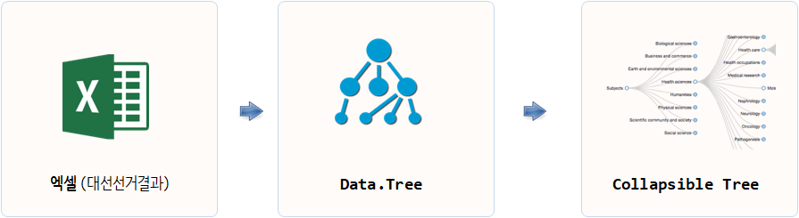

```{r setOptions, message=FALSE, include=FALSE}
source("tools/chunk-options.R")

library(tidyverse)
library(readxl)
library(stringr)
library(data.tree)
library(collapsibleTree) # devtools::install_github("AdeelK93/collapsibleTree")

```

## 1. 데이터 나무(Data Tree) {#data-tree}

[data.tree](https://cran.r-project.org/web/packages/data.tree/vignettes/data.tree.html) 팩키지는 기존 사각형 데이터프레임을 벗어나
최근 많이 데이터분석에서 다뤄지고 있는 **계층형 나무데이터(Hierachical Tree Data)** 데이터 자료구조에 방점을 두고 있다.
사실, 나무 자료구조는 의사결정과학, 인공지능, 금융, 컴퓨터 공학을 비롯한 다방면에서 많이 다뤄지고 있다.
나무 자료구조에 바탕을 두고 [collapsibleTree](https://github.com/AdeelK93/collapsibleTree) 팩키지를 함께 사용하면 흥미로운 데이터분석 결과를 제공한다.

- [data.tree](https://cran.r-project.org/web/packages/data.tree/vignettes/data.tree.html)
- [collapsibleTree](https://github.com/AdeelK93/collapsibleTree)




## 2. 제18대 대통령 선거 데이터 {#president-18-데이터}

[중앙선거관리위원회](http://www.nec.go.kr/portal/main.do) 홈페이지 [분야별 정보 > 선거정보 > 자료실](http://www.nec.go.kr/portal/bbs/list/B0000338.do?menuNo=200061)에서
대선, 총선, 지방선거 선거결과 데이터를 받아볼 수 있다.

`tidyverse`, `readxl` 팩키지를 활용하여 데이터를 불러와서 전처리한다.

``` {r collapsible-tree-setup}
# 0. 환경설정 ------------------------
# library(tidyverse)
# library(readxl)
# library(stringr)
# library(data.tree)
# library(collapsibleTree) # devtools::install_github("AdeelK93/collapsibleTree")

# 1. 제18대 대통령 선거  ------------------------

presid_18_dat <- read_excel("data/제18대 대선 투표구별 개표자료.xls", skip=4)

names(presid_18_dat) <- c("시도명", "구시군명", "읍면동명", "투표구명", "선거인수", "투표수", "박근혜", 
                          "문재인", "무소속\n박종선", "무소속\n김소연", "무소속\n강지원", 
                          "무소속\n김순자", "계", "무효투표수", "기권수")

presid_18_df <- presid_18_dat %>% 
  select_("시도명", "구시군명", "읍면동명", "투표구명", "선거인수", "투표수", "박근혜", "문재인", "무효투표수") %>% 
  mutate(읍면동명 = ifelse(구시군명 == "합계", "합계", 읍면동명)) %>% 
  mutate(읍면동명 = zoo::na.locf(읍면동명, fromLast = FALSE)) %>% 
  mutate(투표구명 = ifelse(is.na(투표구명), 읍면동명, 투표구명))

presid_18_df <- presid_18_df %>% 
  mutate(전국 = "전국") %>% 
  mutate(전국 = ifelse(시도명 == "전국", NA, 전국)) %>% 
  select(전국, 시도명, everything()) %>% 
  filter(투표구명 != "소계",
         읍면동명 != "소계")   
```

## 3. 접을 수 있는 나무 그래프 {#president-collapsible-tree}

`data.tree` 나무자료구조에 맞춰 데이터를 준비한다.
그리고 나서, `collapsibleTree` 팩키지 `collapsibleTree()` 함수를 활용하여 
제18대 대통령선거 결과를 접을 수 있는 나무 그래프로 인터랙티브 시각화를 한다.

``` {r collapsible-tree-viz, fig.width=12}

presid_18_df$pathString <- paste("대선", 
                                 presid_18_df$전국, 
                                 presid_18_df$시도명, 
                                 presid_18_df$구시군명,
                                 presid_18_df$읍면동명,
                            sep = "/")

# 2. 시각화  ------------------------

presid_18_df$tooltip <- paste0(
  "<br>박근혜: ", scales::comma(presid_18_df$박근혜),
  "<br>문재인: ", scales::comma(presid_18_df$문재인)
)

collapsibleTree(presid_18_df, 
                hierarchy = c("전국", "시도명", "구시군명", "읍면동명", "투표구명", "tooltip"),
                attribute = "투표수",
                tooltipHtml = "tooltip",
                tooltip = TRUE,
                zoom = TRUE,
                width= 800,
                root= "제18대선"
)
```