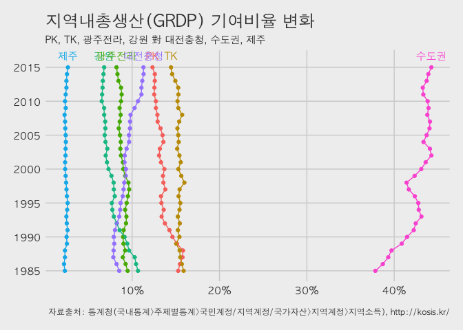

# 데이터 과학자와 함께 하는 제19대 대통령 선거

## 지역내총생산(GRDP) [^wiki-grdp] 변화

[^wiki-grdp]: [위키, 지역내총생산](https://ko.wikipedia.org/wiki/%EC%A7%80%EC%97%AD%EB%82%B4%EC%B4%9D%EC%83%9D%EC%82%B0)

지역내총생산(GRDP: Gross Regional Domestic Product)은 어떤기간 동안 어떠한 지역에서 생산된 상품과 서비스의 가치를 시장가격으로 평가한 수치로 
지역내총생산이 높다는 것은 그 지역 재정자립도가 높다는 것을 의미하고 반대로 지역내총생산이 낮다는 것은 재정자립도가 낮아 중앙정부의 지원이 필요하다는 것을 의미한다. 
국내에선 통계청이 1985년부터 16개 광역 시·도의 GRDP를 산출해 발표하고 있으며 지역 경제 분석과 정책 수립에 필요한 기초자료로 활용한다. 
국가로 치면 국내총생산(GDP)과 같은 개념이다.

## 지역내총생산 변화 시각화

통계청에서 1985년부터 16개 광역 시도 GRDP를 연도별로 시각화하는데 대선 기간에 맞물려서 
해당기간 GRDP가 지속적으로 줄어들고 있는 TK, PK, 강원과 GRDP가 꾸준히 증가하는 대전충청, 수도권을 중심으로 시각화한다.

### 환경설정

~~~{.r}
# 0. 환경설정 ------------------------------------------------------------------
library(DT)
library(stringr)
library(tidyverse)
library(readxl)
library(scales)
library(lubridate)
library(ggthemes)
library(extrafont)
loadfonts()
~~~

### 데이터 가져오기 및 정제

자료는 통계청 [http://kosis.kr/](http://kosis.kr/) "국내통계>주제별통계>국민계정/지역계정/국가자산>지역계정>지역소득"
에서 시도 지역내총생산(GRDP) 데이터를 가져온다.

가져온 데이터를  TK, PK, 강원과 GRDP가 꾸준히 증가하는 대전충청, 수도권을 중심으로 재정리한다.

~~~{.r}
# 1. 데이터 가져오기 ------------------------------------------------------------------
grdp <- read_excel("data/행정구역_시도_별_경제활동별_지역내총생산_20170215215258.xlsx")

# 2. 데이터 정제 ------------------------------------------------------------------

grdp <- grdp %>% slice(-1) %>% dplyr::rename(sido=`행정구역(시도)별`, "2015" = `2015 p)`) %>% dplyr::select(-경제활동별)

datatable(grdp) %>%
 formatCurrency(c(as.character(rep(1985:2015))), "", interval=3, mark=",", digit=0)
~~~

<!--html_preserve-->

<!--/html_preserve-->

~~~{.r}
grdp <- grdp %>% mutate(sido = plyr::revalue(sido, 
                                            c( "서울특별시"   = "수도권"  ,
                                               "경기도"       = "수도권"  ,
                                               "인천광역시"   = "수도권"  ,
                                               "대전광역시"   = "대전충청",
                                               "광주광역시"   = "광주전라",
                                               "전라남도"     = "광주전라",
                                               "전라북도"     = "광주전라",
                                               "충청북도"     = "대전충청",
                                               "충청남도"     = "대전충청",
                                               "대구광역시"   = "PK"      ,
                                               "경상북도"     = "PK"      ,
                                               "울산광역시"   = "TK"      ,
                                               "부산광역시"   = "TK"      ,
                                               "경상남도"     = "TK"      ,
                                               "강원도"       = "강원"    ,
                                               "제주특별자치도" = "제주"))) 

grdp_df <- grdp %>% group_by(sido) %>% 
  mutate_at(vars(starts_with("1")),funs(as.numeric)) %>% 
  mutate_at(vars(starts_with("2")),funs(as.numeric)) %>% 
  summarise_each(funs(mean)) %>% dplyr::filter(sido!="전국") %>% 
  mutate(sido = factor(sido, levels=c("PK", "TK", "광주전라", "강원", "제주", "대전충청", "수도권")))

datatable(grdp_df) %>% 
  formatCurrency(c(as.character(rep(1985:2015))), "", interval=3, mark=",", digit=0)
~~~

<!--html_preserve-->

<!--/html_preserve-->

~~~{.r}
grdp_df_lng <- grdp_df %>% gather(year, grdp, -sido)

grdp_df_lng <- grdp_df_lng %>% 
  group_by(year) %>% 
  mutate(grdp_sum = sum(grdp)) %>%
  group_by(sido) %>% 
  mutate(pcnt = grdp / grdp_sum,
         year = ymd(paste0(year, "-01-01"))) 
~~~

### 데이터 시각화

지역내총생산 변화를 시각적으로 가장 잘 나타낼 수 있는 방법 중 하나로 시간의 흐름에 따른 시계열 그림을 `ggplot`으로 시각화한다.

~~~{.r}
# 3. 시각화 ------------------------------------------------------------------
dlist <- unique(grdp_df_lng$year)

ggplot(grdp_df_lng , aes(year, pcnt, group=sido, color=sido, label=sido)) +
  geom_point() +
  geom_line() +
  theme_fivethirtyeight(base_family="AppleGothic") +
  coord_flip() +
  geom_text(data=grdp_df_lng %>% dplyr::filter(year==tail(dlist,1)), vjust=-1, family="AppleGothic") +
  scale_x_date(breaks=seq(dlist[1], tail(dlist,1)+years(1), "5 year"),
               date_labels="%Y",limits=c(dlist[1],tail(dlist,1)+years(1)))+ 
  scale_y_continuous(labels=percent) +
  labs(x="",y="",title="지역내총생산(GRDP) 기여비율 변화",
       caption="\n 자료출처: 통계청(국내통계>주제별통계>국민계정/지역계정/국가자산>지역계정>지역소득), http://kosis.kr/",
       subtitle="PK, TK, 광주전라, 강원 對 대전충청, 수도권, 제주") +
  theme(legend.position="none", plot.caption=element_text(hjust=0,size=9),plot.subtitle=element_text(face="italic"),
        axis.text=element_text(size=11))
~~~

