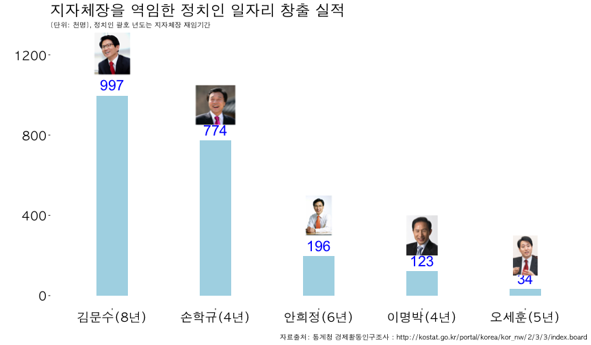

## 1. 광역지방자치 단체장

[위키백과 광역지방자치단체장](https://ko.wikipedia.org/wiki/광역지방자치단체장)에 따르면 
서울시장부터 세종특별시장까지 총 17 명의 광역지방자치단체장이 현재 재직하고 있다.
이중에서 이번 대선에서 직간접적인 영향을 갖는 정치인을 뽑아 일자리 창출 실적을 팩트체크 해보자.

| 광역지방자치단체장 |     정당      |  이름  |
|--------------------|---------------|--------|
| 서울특별시장       | 더불어민주당  | 박원순 |
| 부산광역시장       | 새누리당      | 서병수 |
| 인천광역시장       | 새누리당      | 유정복 |
| 대구광역시장       | 새누리당      | 권영진 |
| 광주광역시장       | 더불어민주당  | 윤장현 |
| 대전광역시장       | 더불어민주당  | 권선택 |
| 울산광역시장       | 새누리당      | 김기현 |
| 경기도지사         | 바른정당      | 남경필 |
| 강원도지사         | 더불어민주당  | 최문순 |
| 충청북도지사       | 더불어민주당  | 이시종 |
| 충청남도지사       | 더불어민주당  | 안희정 |
| 전라북도지사       | 더불어민주당  | 송하진 |
| 전라남도지사       | 더불어민주당  | 이낙연 |
| 경상북도지사       | 새누리당      | 김관용 |
| 경상남도지사       | 새누리당      | 홍준표 |
| 제주특별자치도지사 | 바른정당      | 원희룡 |
| 세종특별자치시장   | 더불어민주당  | 이춘희 |

## 2. 일자리 창출 팩트 체크용 데이터

일자리 창출 팩트체크 데이터는 생각보다 쉽게 인터넷에서 찾을 수 있다.
[국가통계포털(KOSIS), 지역통계, 주제별, 고용노동임금, 경제활동인구조사, 행정구역(시도)별 경제활동인구](http://kosis.kr/statisticsList/statisticsList_02List.jsp?vwcd=MT_ATITLE01&parmTabId=M_02_01_01#SubCont)를 통해
일자리 창출 실적자료를 뽑을 수 있다. 
동일한 자료를 바탕으로 정부에서 공식적으로 산출하는 실업률 데이터도 바로 산출이 가능하다.

## 3. 지자체장 출신 정치인

### 3.1. 손학규 [^kyunggi-sohn]

[^kyunggi-sohn]: [위키백과 경기도지사](https://ko.wikipedia.org/wiki/%EA%B2%BD%EA%B8%B0%EB%8F%84%EC%A7%80%EC%82%AC)

- 경기도 지사(2002 - 2006): 2002년 6월13일 민선 31대 경기도 지사로 당선
    - 재임기간: 2002년 7월 1일 ~ 2006년 6월 30일
    - 일자리 창출 산정 기간(4년): 2003년, 2004년, 2005년, 2006년

### 3.2. 안희정 [^choongnam-ahn]

[^choongnam-ahn]: [위키백과 충청남도지사](https://ko.wikipedia.org/wiki/%EC%B6%A9%EC%B2%AD%EB%82%A8%EB%8F%84%EC%A7%80%EC%82%AC)

- 충청남도 지사(2010 - 현재): 민선 36대, 37대 충청남도 지사로 당선
    - 재임기간: 2010년 7월 1일 ~ 2014년 6월 30일(36대), 2014년 7월 1일 ~ 현재 (37대)
    - 일자리 창출 산정 기간(6년): 2011년, 2012년, 2013년, 2014년, 2015년, 2016년

### 3.3. 이명박 [^seoul-lee]

[^seoul-lee]: [위키백과 서울특별시장](https://ko.wikipedia.org/wiki/%EC%84%9C%EC%9A%B8%ED%8A%B9%EB%B3%84%EC%8B%9C%EC%9E%A5)

- 서울시장(2002 - 2006): 민선 32대 서울특별시장으로 당선
    - 재임기간: 2002년 7월 1일 ~ 2006년 6월 30일
    - 일자리 창출 산정 기간(4년): 2003년, 2004년, 2005년, 2006년

### 3.4. 오세훈 

- 서울시장(2006 - 2011): 민선 33대, 민선 34대 서울특별시장으로 당선
    - 재임기간: 2006년 7월 1일 ~ 2011년 8월 26일
    - 일자리 창출 산정 기간(5년): 2007년, 2008년, 2009년, 2010년, 2011년    

### 3.5. 김문수

- 경기도 지사(2006 - 2014): 민선 32대, 33대 경기도 지사로 당선
    - 재임기간: 2006년 7월 1일 ~ 2014년 6월 30일
    - 일자리 창출 산정 기간(8년): 2007년, 2008년, 2009년, 2010년, 2011년, 2012년, 2013년, 2014년

## 4. 일자리 창출 데이터

[국가통계포털(KOSIS), 지역통계, 주제별, 고용노동임금, 경제활동인구조사, 행정구역(시도)별 경제활동인구](http://kosis.kr/statisticsList/statisticsList_02List.jsp?vwcd=MT_ATITLE01&parmTabId=M_02_01_01#SubCont)를 
 통해 일자리 창출 실적자료를 뽑아 지자체장을 역임한 정치인들이 창출한 일자리 통계를 다운로드 받아 정리한다.

일자리 창출 계산 공식 = 임기 최종연도 취업자수 - 취임 년도 취업자수 

예) 손학규 경기지사 취임연도 2002년 취업자수 4,485천명 임기 최종연도 취업자수 5,229천명
따라서, 5,229천명 - 4,485천명 = 7,440천명

### 4.1. 손학규 

기준년도 2002년 경제활동인구 중 취업자수가 4,485천명, 
2006년 경제활동인구 중 취업자수 5,229천명으로 경기지사 재임기간 중 **744천명** 일자리가 증가된 것으로 추정된다.

| 연도  |  시도  | 경제활동인구 | 취업자수 |
|-------|--------|--------|---------|
| 2002  | 경기도 | 4,614  |   4,485 |
| 2003  | 경기도 | 4,784  |   4,622 |
| 2004  | 경기도 | 5,060  |   4,874 |
| 2005  | 경기도 | 5,250  |   5,045 |
| 2006  | 경기도 | 5,411  |   5,229 |

### 4.2. 안희정 

2010년 경제활동인구 중 취업자수가 974천명, 2015년 경제활동인구 1,170 천명으로 안희정 충남지사 
재임기간 중 **196천명** 으로 추정된다.

| 연도  |  시도  | 경제활동인구 | 취업자수 |  
|-------|--------|--------|---------|
| 2010  | 충  남 |   999  |  974   |
| 2011  | 충  남 |  1,022 |  1,001 |
| 2012  | 충  남 | 1,077  |  1,056 |
| 2013  | 충  남 | 1,165  |  1,137 |
| 2014  | 충  남 | 1,191  |  1,158 |
| 2015  | 충  남 | 1,204  |  1,170 |

### 4.3. 이명박

기준년도 2002년 경제활동인구 중 취업자수가 4,783천명, 
2006년 경제활동인구 중 취업자수 4,906천명으로 경기지사 재임기간 중 **123천명** 일자리가 증가된 것으로 추정된다.

| 연도  |  시도  | 경제활동인구 | 취업자수 |  
|-------|--------|--------|---------|
| 2002  | 서 울  | 4,992  | 4,783  |
| 2003  | 서 울  | 4,977  | 4,753  |
| 2004  | 서 울  | 5,062  | 4,831  |
| 2005  | 서 울  | 5,129  | 4,890  |
| 2006  | 서 울  | 5,132  | 4,906  |

### 4.4. 오세훈 

기준년도 2002년 경제활동인구 중 취업자수가 4,906천명, 
2006년 경제활동인구 중 취업자수 4,940천명으로 경기지사 재임기간 중 **34천명** 일자리가 증가된 것으로 추정된다.

| 연도  |  시도  | 경제활동인구 | 취업자수 |  
|-------|--------|--------|---------|
| 2006  | 서 울  | 5,132  | 4,906  |
| 2007  | 서 울  | 5,236  | 5,012  |
| 2008  | 서 울  | 5,170  | 4,936  |
| 2009  | 서 울  | 5,058  | 4,835  |
| 2010  | 서 울  | 5,120  | 4,922  |
| 2011  | 서 울  | 5,144  | 4,940  |

### 4.5. 김문수

기준년도 2006년 경제활동인구 중 취업자수가 5,229천명, 
2006년 경제활동인구 중 취업자수 6,226천명으로 경기지사 재임기간 중 **997천명** 일자리가 증가된 것으로 추정된다.

| 연도  |  시도  | 경제활동인구 | 취업자수 |  
|-------|--------|--------|---------|
| 2006  | 경기도 | 5,411  | 5,229  |
| 2007  | 경 기  | 5,571  | 5,398  |
| 2008  | 경 기  | 5,697  | 5,529  |
| 2009  | 경 기  | 5,746  | 5,539  |
| 2010  | 경 기  | 5,890  | 5,673  |
| 2011  | 경 기  | 6,022  | 5,833  |
| 2012  | 경 기  | 6,098  | 5,923  |
| 2013  | 경 기  | 6,147  | 5,988  |
| 2014  | 경 기  | 6,413  | 6,226  |

## 5. 지자체장을 역임한 주요 정치인 일자리 창출실적 시각화

앞에서 산출한 일자리 창출실적을 바탕으로 주요 대선주자 일자리 창출 실적을 시각화 해보자.
`png` 팩키지 `raterGrob` 함수를 활용하여 이미지 객체로 저장하고 나서,
`ggplot`의 `annotation_custom()` 함수를 활용하여 사진을 그래프에 함께 겹쳐 넣는다.

~~~{.r}
library(png)
library(grid)
library(ggplot2)

kim <- readPNG("fig/kim.png")
kim_g <- rasterGrob(kim, interpolate=TRUE)
sohn <- readPNG("fig/sohn.png")
sohn_g <- rasterGrob(sohn, interpolate=TRUE)
hj <- readPNG("fig/hj.png")
hj_g <- rasterGrob(hj, interpolate=TRUE)
mb <- readPNG("fig/mb.png")
mb_g <- rasterGrob(mb, interpolate=TRUE)
oh <- readPNG("fig/oh.png")
oh_g <- rasterGrob(oh, interpolate=TRUE)

jobs_df <- data.frame(candidate=c("김문수(8년)", "손학규(4년)", "안희정(6년)", "이명박(4년)", "오세훈(5년)"),
                      jobs_created = c(997, 774, 196, 123, 34))

jobs_df <- jobs_df %>% mutate(candidate = factor(candidate, levels=c("김문수(8년)", "손학규(4년)", "안희정(6년)", "이명박(4년)", "오세훈(5년)")))

ggplot(jobs_df, aes(x=candidate, y=jobs_created)) +
  geom_bar(stat = "identity", fill="lightblue", width=.3) + theme_tufte(base_family='AppleGothic') + 
  scale_y_continuous(limits=c(0,1250)) +
  geom_text(aes(label = jobs_created), size = 7.5, hjust = 0.5, vjust = -0.5, color="blue") +
  annotation_custom(kim_g, xmin=1-0.7, xmax=1+0.7,  ymin=1100) +
  annotation_custom(sohn_g,   xmin=2-0.7, xmax=2+0.7,  ymin=850, ymax=1050) +
  annotation_custom(hj_g,  xmin=3-0.7, xmax=3+0.7,  ymin=300, ymax=500) +
  annotation_custom(mb_g,  xmin=4-0.7, xmax=4+0.7,  ymin=200, ymax=400) +
  annotation_custom(oh_g, xmin=5-0.7, xmax=5+0.7,  ymin=100, ymax=300) +
  labs(x="",y="",title="지자체장을 역임한 정치인 일자리 창출 실적",
       caption="자료출처: 통계청 경제활동인구조사 : http://kostat.go.kr/portal/korea/kor_nw/2/3/3/index.board",
       subtitle="[단위: 천명], 정치인 괄호 년도는 지자체장 재임기간") +
  theme(axis.text=element_text(size=18, color="black"), plot.title = element_text(size=22))
~~~

