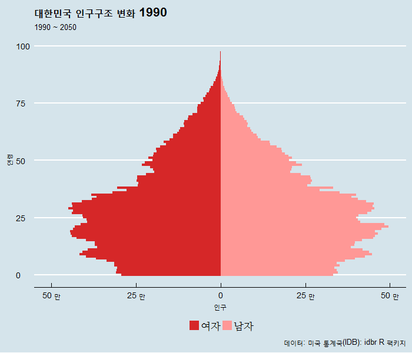
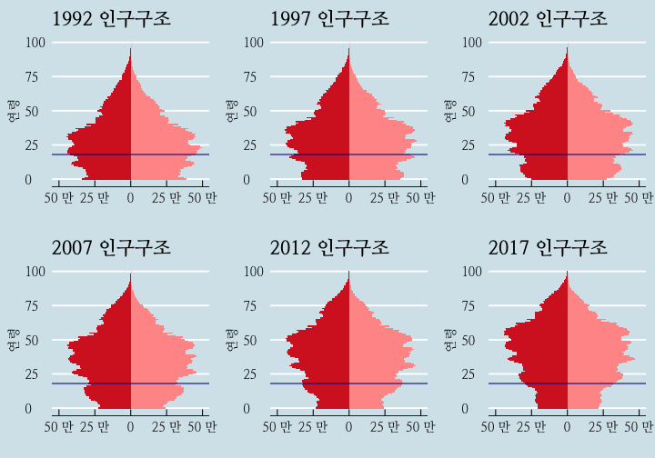
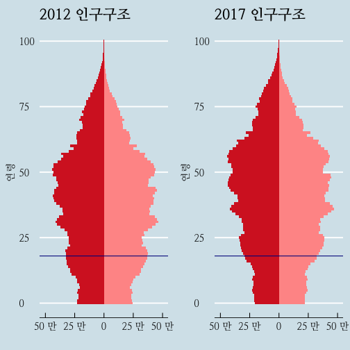
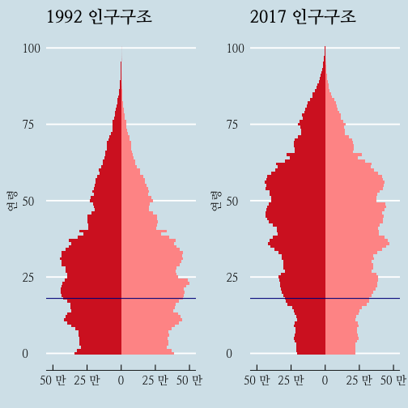

## 1. 인구 피라미드 [^idbr]

[^idbr]: [idbr: access the US Census Bureau International Data Base in R](http://www.arilamstein.com/blog/2016/06/06/idbr-access-us-census-bureau-international-data-base-r/)

1990년도부터 2050년까지 대한민국 인구구조 변화를 [미국 통계국 데이터베이스(IDB)](http://www.census.gov/population/international/data/idb/informationGateway.php)를 
활용하여 인구 피라미드 구조 변화를 통해 시각적으로 이해한다.

### 1.1. 국가코드 확인

IDB를 팩키지화하여 데이터 추출작업을 편리하게 만든 것이 `idbr` 팩키지다. 
대한민국을 찾아 뽑아내야 하기 때문에 가장 먼저 국가코드를 확인한다.
`countrycode()` 함수를 활용하여 대한민국 국가코드는 "KS" 임이 확인된다.

~~~{.r}
library(idbr) #install.packages('idbr')

library(countrycode)
countrycode('Korea', 'country.name', 'fips104')
~~~

~~~{.output}
[1] "KS"

~~~

### 1.2. 데이터 가져오기

API를 통한 인증방식을 통해 데이터를 열어주고 있기 때문에 
미국 통계국 인증웹페이지 <http://api.census.gov/data/key_signup.html> 에서 전자우편을 통해 API키를 발급받는다.
`idb1()` 함수 국가코드, 기간, 인증키를 설정하면 데이터를 쭉 불러와서 데이터프레임으로 정리한다.

~~~{.r}
library(tidyverse)
library(idbr) # devtools::install_github('walkerke/idbr')
library(ggplot2)
library(animation)
library(dplyr)
library(ggthemes)
library(extrafont)
loadfonts()

idb_api_key("7aexxxxxxxxxxxxxxxxxxxxxxxxxxxxxxxx")

male <- idb1('KS', 1990:2050, sex = 'male') %>%
  mutate(SEX = 'Male')

female <- idb1('KS', 1990:2050, sex = 'female') %>%
  mutate(POP = POP * -1,
         SEX = 'Female')

korea <- bind_rows(male, female) %>%
  mutate(abs_pop = abs(POP))

korea <- korea %>% mutate(SEX = ifelse(SEX == "Male", "남자", "여자"))
~~~

### 1.3. 인구 피라미드 애니메이션

1990년부터 2050년까지 각 연도별 `ggplot`을 활용하여 인구 피라미드를 생성하고 나서 이를 `gif` 파일로 변환시키면 
인구 피라미드 애니메이션이 완성된다.

~~~{.r}
saveGIF({  
  for (i in 1990:2050) {    
    title <- as.character(i)    
    year_data <- dplyr::filter(korea, time == i)
    
    g1 <- ggplot(year_data, aes(x = AGE, y = POP, fill = SEX, width = 1)) +
      coord_fixed() + 
      coord_flip() +
      geom_bar(data = subset(year_data, SEX == "남자"), stat = "identity") +
      geom_bar(data = subset(year_data, SEX == "여자"), stat = "identity") +
      scale_y_continuous(breaks = seq(-500000, 500000, 250000),
                         labels = c('50 만', '25 만', '0', '25 만', '50 만'), 
                         limits = c(min(korea$POP)-50000, max(korea$POP))) +
      theme_economist(base_size = 14) + 
      scale_fill_manual(values = c('#ff9896', '#d62728')) + 
      labs(
        title = paste0("대한민국 인구구조 변화 ", title),
        subtitle = "1990 ~ 2050",
        caption = "데이터: 미국 통계국(IDB): idbr R 팩키지",
        x = "연령",
        y = "인구"
      ) +
      # theme_minimal(base_family="NanumMyeongjo") +
      theme(legend.position = "bottom", legend.title = element_blank(), 
            legend.text=element_text(family="NanumMyeongjo")) + 
      guides(fill = guide_legend(reverse = TRUE))
    print(g1)
  }
}, movie.name = 'korea_pyramid.gif', interval = 0.3, ani.width = 700, ani.height = 600)
~~~

## 2. 대선이 있던 년도별 인구구조 변화

### 2.1. 최근 6번 대선 인구구조 변화

1992년 ~ 2017년 대선 년도별 인구구조 변화를 시각화하면 다음과 같다.
`ggplot` 짝꿍 `gridExtra` 팩키지를 활용하여 `grid.arrange()` 함수를 활용하여 시각화하면 다음과 같다.

~~~{.r}
# library(gridExtra)

korea <- read_csv("data/korea_pop_idb.csv")
korea <- korea %>% mutate(SEX = ifelse(SEX == "Male", "남자", "여자"))

vis_election <- function(df, title) { 
  g1 <- ggplot(df, aes(x = AGE, y = POP, fill = SEX, width = 1)) +
    coord_fixed() + coord_flip() +
    geom_bar(data = subset(df, SEX == "남자"), stat = "identity") +
    geom_bar(data = subset(df, SEX == "여자"), stat = "identity") +
    geom_vline(xintercept = 18, color="darkblue") +
    scale_y_continuous(breaks = seq(-500000, 500000, 250000),
                       labels = c('50 만', '25 만', '0', '25 만', '50 만'), 
                       limits = c(min(korea$POP)-50000, max(korea$POP))) +
    theme_economist(base_size = 14, base_family="NanumMyeongjo") + 
    scale_fill_manual(values = c('#ff9896', '#d62728')) + 
    labs(
      title = paste0(title, " 인구구조"),
      x = "연령",
      y = ""
    ) + guides(fill=FALSE)
}

election_year <- c(1992, 1997, 2002, 2007, 2012, 2017)

for(i in seq_along(election_year)) {
  df <- korea %>% dplyr::filter(time == election_year[i])
  p_name <- paste0("p", election_year[i])
  assign(p_name, vis_election(df, election_year[i]))
}

grid.arrange(p1992, p1997, p2002, p2007, p2012, p2017, nrow=2, ncol=3)
~~~

### 2.2. 1990년 대선과 2017년 대선 인구구조 비교

~~~{.r}
grid.arrange(p2012, p2017, ncol=2)
~~~

### 2.3. 2012년 대선과 2017년 대선 인구구조 비교

~~~{.r}
grid.arrange(p1992, p2017, ncol=2)
~~~

