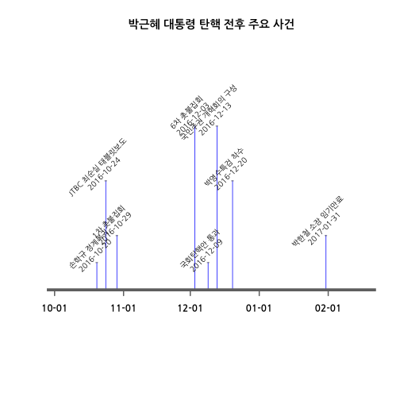

## 1. 제19대 대통령 선거 일정

박근혜 대통령 탄핵으로 제19대 대통령선거 일정이 기존 "2017-12-20"에서 앞당겨질 가능성이 커졌다.
박근혜 대통령 탄핵 이후 제19대 대통령 선거 일정에 다음과 같은 시나리오가 가능하다.

- 박근혜 대통령 탄핵 기각 : 탄핵안이 기각되면 제19대 대통령 선거일정에 맞춰 "2017-12-20" 실시
- 박근혜 대통형 탄행 인용 
    - 최장("2017-06-01"): 탁핵이 인용되더라도 박근혜 대통령 변호인단의 의견이 최대한 반영(총10개월: 탄핵심판 6개월, 조기대선 2개월, 대통령 취입 2개월)
    - 합리적 추론("2017-05-01"): **박영수** 특검의 조사결과를 반영하여 탄핵인용("2016-12-21" 특검 출범후 70일 기간 반영)
    - 최단("2017-04-01"): **박한철** 헌법재판소 소장 임기 반영("2017-01-31" 만료) 

~~~{.r}
options(warn=-1)
suppressPackageStartupMessages(library(googleVis))

election.dat <- data.frame(type=c("탄핵기각","탄핵기각","탄핵기각","탄핵기각",
                                  "탄핵인용(최장)","탄핵인용(최장)","탄핵인용(최장)","탄핵인용(최장)",
                                  "탄핵인용(특검)","탄핵인용(특검)","탄핵인용(특검)","탄핵인용(특검)",
                                  "탄핵인용(최단)","탄핵인용(최단)","탄핵인용(최단)","탄핵인용(최단)"),
                           subtype=c("탄핵전", "헌재심판", "대통령 업무복귀", "19대 인수위",
                                     "탄핵전", "헌재심판", "조기대선", "19대 인수위",
                                     "탄핵전", "헌재심판", "조기대선", "19대 인수위",
                                     "탄핵전", "헌재심판", "조기대선", "19대 인수위"),
                           start=as.POSIXct(c("2016-10-24","2016-12-9","2017-6-10","2017-12-20",
                                              "2016-10-24","2016-12-9","2017-6-10","2017-8-11",
                                              "2016-10-24","2016-12-9","2017-3-1","2017-5-1",
                                              "2016-10-24","2016-12-9","2017-2-1","2017-4-1")),
                           end=as.POSIXct(c("2016-12-9","2017-6-9","2017-12-19","2018-2-25",
                                            "2016-12-9","2017-6-9","2017-8-10","2017-10-11",
                                            "2016-12-9","2017-2-28","2017-4-30","2017-8-1",
                                            "2016-12-9","2017-1-31","2017-3-31","2017-5-30")))

plt <- gvisTimeline(data=election.dat,
                    rowlabel="type", barlabel="subtype",
                    start="start", end="end",
                    options=list(width="1024px", height="270px", timeline="{showRowLabels:true}"))

plt_header <- plt$html$header
plt_header <- gsub("charset=utf-8", "charset=euc-kr", plt_header)
plt$html$header <- plt_header

plot(plt)
~~~

<!-- Timeline generated in R 3.3.2 by googleVis 0.6.1 package -->
<!-- Sun Jan  1 17:07:01 2017 -->

<!-- jsHeader -->

 
<!-- jsChart -->  

 
<!-- divChart -->
  

## 2. 박근혜 대통령 탄핵 

박근혜 대통령 탄핵 직후 중요 사건을 열거하면 다음과 같다.

- 손학규 정계복귀, 2016-10-20
- JTBC 최순실 태블릿보도, 2016-10-24
- 1차 촛불집회, 2016-10-29
- 6차 촛불집회, 2016-12-03
- 국회탄핵안 통과, 2016-12-09
- 국민주권 개혁회의 구성, 2016-12-13
- 박영수특검 착수, 2016-12-20
- 박한철 소장 임기만료, 2017-01-31

~~~{.r}
library(timelineS)
library(readr)

pe_event <- read_csv("data/presential-election-schedule-events.csv")
~~~

~~~{.output}
Parsed with column specification:
cols(
  Event = col_character(),
  Date = col_date(format = "")
)

~~~

~~~{.r}
par(family="NanumGothic")
timelineS(pe_event,  buffer.days = 17, main="박근혜 대통령 탄핵 전후 주요 사건", label.direction = "up", label.length = c(0.2,0.8,0.4,1.2), label.position = 3,
label.color = "blue", pch = "-", labels=paste0(pe_event[[1]], "\n", pe_event[[2]]), scale = "month", scale.format="%m-%d", label.angle=45)
~~~

