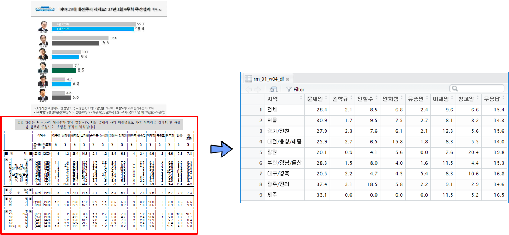
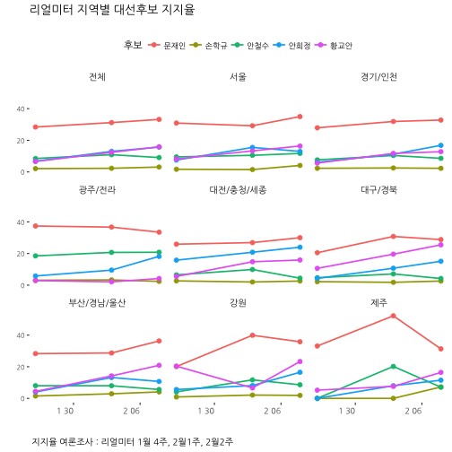

## 1. 여론조사기관 PDF 파일

[리얼미터](http://www.realmeter.net/)에서 발간하는 PDF 파일을 파싱하여 대선후보 지지율을 시각화한다.
우리나라에서는 상당수 정보가 웹과 인터넷이 보급되었음에도 불구하고 여전히 PC 패러다임을 벗어나지 못해 PDF, HWP, ODCX 등 
파일형태로 데이터를 제공하는 기관이 상당수 있다. 

따라서, 통계, 데이터과학, 기계학습에 필요한 데이터를 파일형태로 받아 파일에서 텍스트를 추출하고 이를 가공하여 
데이터 분석에 사용하는 과정을 거친다.

[리얼미터 주간 여론조사](http://www.realmeter.net/category/pdf/) 웹사이트에서 PDF 파일을 다운로드 받아 디렉토리에 저장한다.

~~~{.r}
# 0. 환경설정 -----------------------------------------------
library(pdftools)
library(tidyverse)
library(stringr)
library(lubridate)
library(testthat)
library(ggthemes)
library(extrafont)
loadfonts()
~~~

## 2. PDF 파일 內 표를 데이터프레임으로 변환

PDF 파일 內 표를 데이터프레임으로 변환하는 과정을 통해 데이터 분석을 위한 준비를 한다.

1. PDF 파일에서 텍스트 추출: `pdftools` 팩키지 사용
1. 추출된 텍스트 정제: SPSS 출력물 표를 R 데이터프레임으로 변환하기 위한 전처리 과정을 거쳐 데이터 정제
1. 리스트 자료형 표를 데이터프레임으로 변환

`pdf_text()` 함수를 사용해서 PDF 파일에서 테스트를 추출한다.
자체 개발한 `rm_jan_fun()`를 통해 해당주차 지지율 데이터프레임을 생성시킨다.
`testthat` 팩키지 단위 테스트 함수 `test_that()`을 사용해서 PDF 지역별 후보 지지율값이 제대로 추출되어 
변환되었는지 검정한다. `write_csv()` 함수를 통해 결과값을 저장한다.

~~~{.r}
## 리얼미터 1월 추출 함수 ------------------------------------------------------------------
rm_jan_fun <- function(list_dat) {
  person <- unlist(strsplit(list_dat[6], split = "\\r\\n"))
  person <- str_replace_all(person, "\\s", "")
  support <- strsplit(person[c(6,12,15:22)], split = "\\|")
  
  support[[1]] <- append("V1", support[[1]])
  support_df <- do.call(rbind, support) %>% as_tibble()
  support_df[1,2:3] <-  c("V2", "V3")
  
  names(support_df) <- support_df[1,]
  support_df <- support_df %>% dplyr::select(-V1) %>% 
    dplyr::filter(V2 != "V2")
  
  support_df <- support_df %>% dplyr::rename("지역"=V2, "조사완료"=V3, "목표할당" = 사례수) %>% 
    mutate(조사완료 = str_replace_all(조사완료, "\\(|\\)", ""),
               목표할당 = str_replace_all(목표할당, "\\(|\\)", ""),
               지역 = str_replace_all(지역, "\\s|■", "")) %>% 
    mutate_at(grep("지역",colnames(.), invert=TRUE),funs(as.numeric)) %>% 
    mutate(무응답=없음+잘) %>% 
    dplyr::select(지역, 문재인, 손학규, 안철수, 안희정, 유승민, 이재명, 황교안, 무응답)
  return(support_df)
}

# 1. 데이터 생성 ---------------------------------------------------------------------------------------
## 1.1. 1월 데이터 추출---------------------------------------------------------------------------------
# realmeter_w170130212.pdf : 1월23~26, 발표: 1월 26일
rm1701_w4 <- pdf_text("03.data/realmeter_w170130212.pdf")

## 1.2. PDF파일을 데이터프레임 변환---------------------------------------------------------------------------------
# realmeter_w170130212.pdf : 1월23~26, 발표: 1월 26일
rm_01_w04_df <- rm_jan_fun(rm1701_w4)

## 1.3. 단위테스트를 통한 데이터변환 검증---------------------------------------------------------------------------------

test_that("리얼미터 1월 4주차",{
  expect_equivalent(rm_01_w04_df %>% slice(1) %>% collect %>% .[["문재인"]], 28.4)
  expect_equivalent(rm_01_w04_df %>% slice(1) %>% collect %>% .[["안철수"]], 8.5)
  expect_equivalent(rm_01_w04_df %>% slice(1) %>% collect %>% .[["손학규"]], 2.1)
})

## 1.4. 데이터 내보내기---------------------------------------------------------------------------------
write_csv(rm_01_w04_df, "rm_jan_w04.csv")
~~~

## 3. 지역별 지지율 데이터 시각화

리얼미터 주차별 보고서 PDF 파일에서 지역별 후보 지지율을 추출한 데이터를 
불러들여 데이터 정제과정을 거쳐 시각화한다.

~~~{.r}
# 1. 지지도 데이터 불러오기 -----------------------------------------------

rm_jan_w04_df <- read_csv("data/rm_jan_w04.csv") %>% mutate(sdate = ymd("2017-01-26"))
~~~

~~~{.output}
Parsed with column specification:
cols(
  지역 = col_character(),
  문재인 = col_double(),
  손학규 = col_double(),
  안철수 = col_double(),
  안희정 = col_double(),
  유승민 = col_double(),
  이재명 = col_double(),
  황교안 = col_double(),
  무응답 = col_double()
)

~~~

~~~{.r}
rm_feb_w01_df <- read_csv("data/rm_feb_w01.csv") %>% mutate(sdate = ymd("2017-02-03"))
~~~

~~~{.output}
Parsed with column specification:
cols(
  지역 = col_character(),
  문재인 = col_double(),
  손학규 = col_double(),
  안철수 = col_double(),
  안희정 = col_double(),
  유승민 = col_double(),
  이재명 = col_double(),
  황교안 = col_double(),
  무응답 = col_double()
)

~~~

~~~{.r}
rm_feb_w02_df <- read_csv("data/rm_feb_w02.csv") %>% mutate(sdate = ymd("2017-02-08"))
~~~

~~~{.output}
Parsed with column specification:
cols(
  지역 = col_character(),
  문재인 = col_double(),
  손학규 = col_double(),
  안철수 = col_double(),
  안희정 = col_double(),
  유승민 = col_double(),
  이재명 = col_double(),
  황교안 = col_double(),
  무응답 = col_double()
)

~~~

~~~{.r}
# 2. 데이터 정제 -----------------------------------------------

rm17_df <- rm_jan_w04_df %>% bind_rows(rm_feb_w01_df) %>% 
  bind_rows(rm_feb_w02_df) %>% dplyr::select(-유승민, - 무응답, - 이재명) %>% 
  mutate(지역 = factor(지역, levels=c("전체", "서울", "경기/인천", "광주/전라", "대전/충청/세종", "대구/경북", "부산/경남/울산",
                                  "강원", "제주")))

rm17_df_lng <- rm17_df %>% gather(후보, 지지율, -지역, -sdate)

# 3. 데이터 시각화 -----------------------------------------------

ggplot(rm17_df_lng, aes(x=sdate, y=지지율, group=후보, color=후보)) +
  geom_line(size=0.8) +
  geom_point(size=2) +
  facet_wrap(~지역) +
  scale_y_continuous(limits=c(0,53)) +
  theme_tufte(base_family="NanumGothic") +
  theme(legend.position="top", 
        plot.caption=element_text(hjust=0,size=10),
        plot.subtitle=element_text(face="italic"),
        text=element_text(family="NanumGothic"), 
        axis.text=element_text(size=7.5),
        axis.text.x = element_text(angle = 00, hjust = 1, size=9),
        strip.text.x = element_text(size = 10))+
  labs(x="",y="",title="리얼미터 지역별 대선후보 지지율",
       caption="\n 지지율 여론조사 : 리얼미터 1월 4주, 2월1주, 2월2주",
       subtitle="",
       fill="")
~~~

