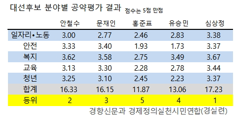

```{r setOptions, message=FALSE, include=FALSE}
source("tools/chunk-options.R")
library(tidyverse)
library(radarchart)
```

## 대선후보별 정책 공약 평가 [^khan-policy-01] [^khan-policy-02]

경향신문과 경제정의실천시민연합에서 대선후보별 5개분야에 대한 공약평가를 실시했다.

- 일자리/노동
- 안전
- 복지
- 교육
- 청년

[^khan-policy-01]: [경향신문과 경제정의실천시민연합 대선 공약 평가](http://m.khan.co.kr/view.html?artid=201704280600015&code=910110&med_id=khan)
[^khan-policy-02]: [2017 시민의 선택 - 공약 점수·순위·등급 금지…“정책 검증 막는 공직선거법 바꿔야”](http://m.khan.co.kr/view.html?med_id=khan&artid=201704281032005&code=910110)



## 대선후보별 정책 공약 평가결과 시각화

경향신문과 경제정의실천시민연합에서 대선후보별 5개분야에 대한 공약평가결과를 레이더 챠트(Radar Chart)를 통해 시각화할 경우 
시각적으로 쉽게 표현하면 후보에 대한 정책, 정책별로 후보가 강조하는 것을 파악한는데 도움이 된다.

### 3.1. 환경설정 [^radar-ggplot]

[^radar-ggplot]: [The Grammar of Graphics and Radar Charts](http://www.r-chart.com/2016/10/the-grammar-of-graphics-and-radar-charts.html)

다양한 레이더 챠트가 존재해서 늘 선택이 쉽지 않다. 그래프문법을 활용하여 작성하는 것도 가능하지만,
[radarchart: Radar Chart from 'Chart.js'](https://cran.r-project.org/web/packages/radarchart/)을 사용하면
레이터 챠트 뿐만 아니라 인터랙티브하게 후보별 정책, 정책별 후보의 차이점에 대해 파악하는데 도움이 된다.

``` {r radarchart-setup, eval=FALSE}
# 0. 환경설정 ----------------------------------------------------------
devtools::install_github("MangoTheCat/radarchart")

library(tidyverse)
library(radarchart)
```

### 3.2. 데이터 가져오기와 각 후보별 색상

경향신문과 경실련에서 발표한 표를 R 데이터프레임으로 변환시킨다.
그리고, 각 후보별 색상을 레이터 챠트에 사용하기 위해 정리한다.
HEX 색상코드를 RGB 숫자로 변환하는데 `col2rgb` 함수를 활용한다.

``` {r radarchart-import}
# 1. 데이터 가져오기 ----------------------------------------------------------

# policy_by_candidate <- read_excel("data/policy.xlsx", sheet="Sheet1")
policy_by_candidate <- structure(list(분야 = c("일자리노동", "안전", "복지", "교육", "청년"), 
                      안철수 = c(3, 3.33, 3.62, 3.13, 3.25), 
                      문재인 = c(2.77, 3.4, 3.58, 3.3, 3.1), 
                      홍준표 = c(2.46, 1.93, 2.75, 2.28, 2.45), 
                      유승민 = c(2.83, 1.73, 3.49, 2.78, 2.23), 
                      심상정 = c(3.38, 3.37, 3.67, 3.44, 3.37)), 
                      class = c("tbl_df", "tbl", "data.frame"), 
                      row.names = c(NA, -5L), 
                      .Names = c("분야", "안철수", "문재인", "홍준표", "유승민", "심상정"))

# 2. 각 후보별 색상 ----------------------------------------------------------

party_colMatrix <- c(col2rgb("#07f91f"), 
                     col2rgb("#065ce8"), 
                     col2rgb("#f70202"), 
                     col2rgb("#01f7f2"), 
                     col2rgb("#f2ee09")) 

party_colMatrix <- matrix(party_colMatrix, nrow=3)

DT::datatable(policy_by_candidate)

```
### 3.3. 정책별 후보의 정책평가 결과 시각화

`chartJSRadar` 함수에 대해서 적절히 환경을 설정한 후에 시각화한다.
이를 통해 각 정책별로 후보가 취하는 정책평가결과에 대한 비교가 각 분야별로 가능하다.

``` {r radarchart-by-candidate, fig.width=12}
# 3. 정책별 레이더 챠트 ----------------------------------------------------------

chartJSRadar(scores = policy_by_candidate, maxScale = 5, scaleLineWidth=5, scaleStepWidth = 1,  
             main="대선후보 분야별 공약평가 결과", 
             polyAlpha=0.01,
             colMatrix=party_colMatrix)
```

### 3.4. 후보별 정책에 대한 우선순위에 대한 정책평가 결과 시각화

이번에는 후보별로 정책에 대한 우선순위와 그에 대한 정책평가 결과를 비교할 수 있다.

이를 위해서, 정책과 후보로 되어 있던 자료구조를 후보와 정책으로 전치시켜야 하는데,
`tidyverse`의 깔끔한 데이터 처리 개념을 반영하여 `gather`, `spread` 함수를 사용한다.

``` {r radarchart-by-policy, fig.width=12}
candidate_by_policy <- policy_by_candidate %>% gather(`후보`, `점수`, -`분야`) %>% 
  spread(`분야`, `점수`)

DT::datatable(candidate_by_policy)

chartJSRadar(scores = candidate_by_policy, maxScale = 5, scaleLineWidth=5, scaleStepWidth = 1,  
                                          main="분야별 대선후보 공약평가 결과", 
                                          polyAlpha=0.01,
                                          colMatrix=party_colMatrix)
```