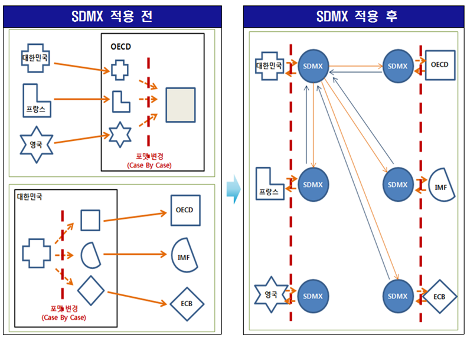

## 1. OECD를 포함한 국제기구 데이터셋 [^read-oecd-data]

[^read-oecd-data]: [Reading OECD.Stat into R](https://www.r-bloggers.com/reading-oecd-stat-into-r/)

경제개발협력기구(OECD)에서 취합하여 발간하는 데이터를 [OECD.Stat](http://stats.oecd.org/)에서 직접 가져오는 
방법은 다음과 같이 크게 세가지가 있다.

- 추출하고자 하는 데이터에 대한 명칭을 찾아 [http://stats.oecd.org/Index.aspx?DataSetCode=PNNI_NEW](http://stats.oecd.org/Index.aspx?DataSetCode=PNNI_NEW)처럼
웹브라우져 주소창에 넣어 데이터를 긁어오는 것으로 그다지 권장하고 싶지는 않다.
- [OECD Open API](http://stats.oecd.org/OpenDataAPI/OData.html)를 활용하여 데이터를 받아오는 방법.
- SDMX 질의문 쿼리를 사용해서 데이터셋, 국가, 관측점 범위를 특정하여 가져오는 방법.

> ### 통계데이터 및 메타데이터 교환(SDMX, Statistical Data and Metadata eXchange) {.callout}
>
> - 여러 국제기구가 유사하거나 동일한 자료를 요구함에 따라 회원국의 업무량이 증가하나, SDMX는국가가 게시한 자료를 국제기구가 가져가는 형태이므로 회원국의 자료제공 부담이 경감.
> - SDMX의 자동검증 기능으로 기존 수동 자료제공 방식에서 발생할 수 있는 수치의 불일치 등 오류 발생 가능성을 감소.
> - 각 국가가 개별적으로 투입하는 통계정보처리 표준의 개발과 유지에 소요되는 노력의 중복을 방지하고 비용을 감소.

SDMX는 데이터와 메타데이터로 구성되고, SDMX에 참여하고 있는 국제기구는  다음과 같다.

- [Bank for International Settlements (BIS)](https://en.wikipedia.org/wiki/Bank_for_International_Settlements)
- [European Central Bank (ECB)](https://en.wikipedia.org/wiki/European_Central_Bank)
- [Eurostat (the statistical office of the European Union)](https://en.wikipedia.org/wiki/Eurostat)
- [International Monetary Fund (IMF)](https://en.wikipedia.org/wiki/International_Monetary_Fund)
- [Organisation for Economic Co-operation and Development(OECD)](https://en.wikipedia.org/wiki/Organisation_for_Economic_Co-operation_and_Development)
- [United Nations Statistics Division(UNSD)](https://en.wikipedia.org/wiki/United_Nations_Statistics_Division)
- [World Bank](https://en.wikipedia.org/wiki/World_Bank)

## 2. 통계데이터 및 메타데이터 교환 표준(SDMX) 활용 

SDMX을 활용하여 데이터를 불러올 경우 다음 세가지 정보가 필수적이다. 사례를 통해 좀더 자세히 한걸음 들어가 보자.

[http://stats.oecd.org/restsdmx/sdmx.ashx/GetData/UN_DEN/AUS+CAN+FRA+DEU+NZL+GBR+USA+OECD/OECD?startTime=1960&endTime=2012](http://stats.oecd.org/restsdmx/sdmx.ashx/GetData/UN_DEN/AUS+CAN+FRA+DEU+NZL+GBR+USA+OECD/OECD?startTime=1960&endTime=2012)

- **UN_DEN**: 데이터셋 코드를 지칭(Trade Union Density)
- **AUS+CAN+FRA+DEU+NZL+GBR+USA+OECD**: ISO 국가코드
- **startTime=1960&endTime=2012**: 데이터 추출 시점

## 3. R 팩키지

각 국제기구에 직접 붙어 데이터를 추출하기 보다 데이터 형식으로 SDMX를 지원하는 R 팩키지를 통해 데이터를 추출하면
효율적으로 작업을 수행할 수 있다. 다수 팩키지가 국제기구 SDMX 데이터 형식을 지원하기 위해 개발되었고 선의의 경쟁을 
펼치고 있다. 개발당시에는 동작을 잘 했으나, 국제기구에서 인터페이스와 자료를 변경하여 지금은 동작하지 않는 팩키지도 존재하는 것이 사실이다.

- [XML2R](https://cran.r-project.org/web/packages/XML2R/): 2014-03-10 개발 최종일
- [rsdmx: Tools for Reading SDMX Data and Metadata](https://cran.r-project.org/web/packages/rsdmx/): 2016-11-15 개발 최종일

`rsdmx` 팩키지는 SDMX-ML 형태로 데이터와 메타데이터를 읽어들일 수 있는 저수준 도구 모음이다.
  

### 3.1. OECD 데이터 목록 확인

`rsdmx` 팩키지를 불러와서 OECD에서 추출 가능한 데이터를 확인한다.

~~~{.r}
library(rsdmx)
# 1. 데이터 확인  --------------------------------------------------------------------------
# https://en.wikipedia.org/wiki/SDMX
# https://www.r-bloggers.com/deaths-from-assault-over-time-in-40-relatively-rich-countries/

## 1.1. OECD 데이터 목록
dsUrl <- "http://stats.oecd.org/restsdmx/sdmx.ashx/GetDataStructure/ALL"
ds <- readSDMX(dsUrl)
dsdf <- as.data.frame(ds)
head(dsdf)
~~~

~~~{.output}
           id agencyID
1         QNA     OECD
2     PAT_IND     OECD
3 SNA_TABLE11     OECD
4   EO78_MAIN     OECD
5       ANHRS     OECD
6    GOV_DEBT     OECD
                                                                                    Name.fr
1                                                            Comptes nationaux trimestriels
2                                                                     Brevets - Indicateurs
3                            11. Dépense des administrations publiques par fonction (COFOG)
4 Perspectives économiques No 78 - décembre 2005 - Projections annuelles pour les pays OCDE
5                                         Heures moyennes annuelles ouvrées par travailleur
6                                                        Dette de l'administration centrale
                                                                         Name.en
1                                                    Quarterly National Accounts
2                                                              Patent indicators
3                                 11. Government expenditure by function (COFOG)
4 Economic Outlook No 78 - December 2005 - Annual Projections for OECD Countries
5                                Average annual hours actually worked per worker
6                                                        Central Government Debt
  version  uri  urn isExternalReference isFinal validFrom validTo
1    <NA> <NA> <NA>                  NA      NA      <NA>    <NA>
2    <NA> <NA> <NA>                  NA      NA      <NA>    <NA>
3    <NA> <NA> <NA>                  NA      NA      <NA>    <NA>
4    <NA> <NA> <NA>                  NA      NA      <NA>    <NA>
5    <NA> <NA> <NA>                  NA      NA      <NA>    <NA>
6    <NA> <NA> <NA>                  NA      NA      <NA>    <NA>

~~~

~~~{.r}
## 1.1. 데이터구조 정의 (DataStructureDefinition, DSD)
dsdUrl <- "http://stats.oecd.org/restsdmx/sdmx.ashx/GetDataStructure/TABLE1"
dsd <- readSDMX(dsdUrl)

# DSD에서 코드 목록(codelist) 받아오기
cls <- slot(dsd, "codelists")
codelists <- sapply(slot(cls, "codelists"), function(x) slot(x, "id"))
codelist <- as.data.frame(slot(dsd, "codelists"), codelistId = "CL_TABLE1_FLOWS")

# DSD에서 concepts 확인
concepts <- as.data.frame(slot(dsd, "concepts"))
~~~

### 3.2. OECD 데이터 가져오기

`readSDMX` 함수를 활용하여 추출하고자 하는 데이터와 기간을 넣어 자료를 추출한다.

~~~{.r}
# 2. 데이터 불러오기 --------------------------------------------------------------------------
sdmx <- readSDMX(providerId = "OECD", resource = "data", flowRef = "WEALTH",
                 start = 2010, end = 2015)
~~~

~~~{.output}
-> Fetching 'http://stats.oecd.org/restsdmx/sdmx.ashx/GetData/WEALTH/all/all?startPeriod=2010&endPeriod=2015'

~~~

~~~{.r}
df <- as.data.frame(sdmx)
head(df)
~~~

~~~{.output}
  LOCATION          VAR AGE TIME_FORMAT  UNIT POWERCODE obsTime
1      AUS          MNW  TP         P1Y   AUD         0    2012
2      AUS         MENW  TP         P1Y   AUD         0    2012
3      AUS     MNW_MENW  TP         P1Y RATIO         0    2012
4      AUS    RATIO_TOP  TP         P1Y RATIO         0    2012
5      AUS RATIO_BOTTOM  TP         P1Y RATIO         0    2012
6      AUS      SHARE10  TP         P1Y    PC         0    2012
      obsValue
1 5.958200e+05
2 3.650000e+05
3 1.632384e+00
4 9.506181e+00
5 9.591151e-01
6 4.493983e+01

~~~
