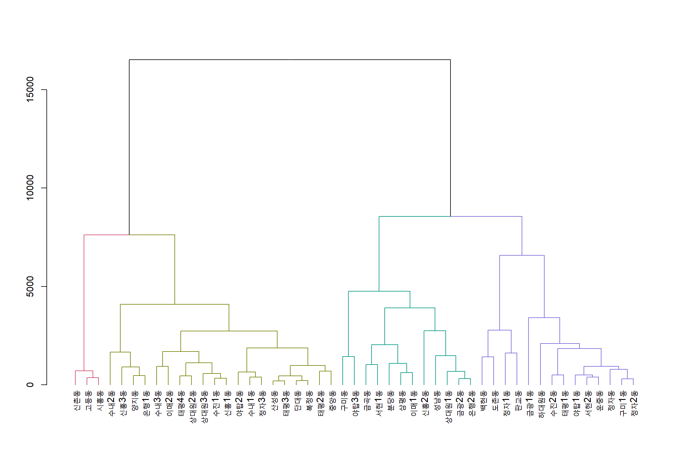

## 1. 성남시 최근 주요 선거 데이터 {#sungnam-vote}

최근 성남시에 있었던 주요 선거는 다음과 같다.

- "제18대 대선" (2012년, 12월)
- "제6회 지선" (2014년, 6월)
- "제20대 총선" (2016년, 4월)
- "제19대 대선" (2017년, 5월)

이를 바탕으로 성남시 민주당 동별 득표수를 바탕으로 군집분석을 수행한다.

## 2. 민주당 득표 군집 분석 {#sungnam-vote-cluster}

### 2.1. 데이터 전처리 {#sungnam-vote-preporcess}

2012년부터 있었던 선거 데이터를 선거관리위원회로부터 입수하여 이를 각 동별로 민주당 득표수를 데이터프레임으로 정제작업을 수행한다.
위례동은 신도시로 분석대상에서 제외하고, 정자동은 정자동과 정자1동으로 분화되어 이를 보정한다.

~~~{.r}
# 0. 환경설정 ------------------
library(tidyverse)
library(readxl)
library(xts)
library(stringr)
library(DT)
library(dendextend)
library(extrafont)
loadfonts()
library(ggthemes)
library(heatmaply)

# 1. 데이터 가져오기 ------------------

sn_eda_df <- readRDS("data/cluster/sn_eda_df.rds") %>% 
    filter(!읍면동명 %in% c("위례동"))

sn_eda_df %>% 
    datatable() %>% 
    formatCurrency(c(3:6), currency="", digits=0)
~~~

<!--html_preserve-->

<!--/html_preserve-->

### 2.2. 군집분석 {#sungnam-vote-clustering}

다양한 군집분석이 있지만 계층적 군집분석 모형을 바탕으로 유클리드 거리를 바탕으로 `complete` 방법으로 선택한다.
수형도(Dendrogram) 시각화결과 4개 군집이 유의미한 군집 갯수로 파악된다.

~~~{.r}
# 2. 군집분석 ------------------

sn_cl_df <- column_to_rownames(as.data.frame(sn_eda_df[,-1]), var = "읍면동명")

sn_cl_dist <- dist(sn_cl_df, method = "euclidean")

sn_cl_hclust <- hclust(sn_cl_dist, method="complete")

## 2.1. 군집분석 시각화 ------------------
sn_cl_hclust_dend <- as.dendrogram(sn_cl_hclust)

dend_colored <- color_branches(sn_cl_hclust_dend, k = 4)
plot(dend_colored)
~~~

### 2.3. 민주당 득표 시각화 {#sungnam-vote-clustering-viz}

4가지 군집을 바탕으로 각동별 민주당 득표수 변화를 시각화해보자.

~~~{.r}
# 3. 시각화 ------------------
cluster_assignments <- cutree(sn_cl_hclust, k = 4)

sn_eda_cl_df <- sn_eda_df %>% 
    mutate(cluster = cluster_assignments)

sn_eda_cl_df %>% 
    gather(선거, 득표수, -구시군명, -읍면동명, -cluster) %>% 
    mutate(선거 = factor(선거, levels = c("제18대 대선", "제6회 지선", "제20대 총선", "제19대 대선") )) %>% 
    ggplot(aes(x=선거, y=득표수, color=factor(cluster), group=읍면동명)) +
    geom_line() +
    geom_point() +
    theme_bw(base_family = "NanumGothic") +
    labs(x="", color="군집") +
    theme(legend.position = "top") +
    scale_y_continuous(labels = scales::comma)
~~~

~~~{.r}
sn_eda_cl_df %>% 
    gather(선거, 득표수, -구시군명, -읍면동명, -cluster) %>% 
    mutate(선거 = factor(선거, levels = c("제18대 대선", "제6회 지선", "제20대 총선", "제19대 대선") )) %>% 
    ggplot(aes(x=선거, y=득표수, color=factor(cluster), group=읍면동명)) +
    geom_line() +
    geom_point() +
    facet_wrap(~cluster) +
    theme_bw(base_family = "NanumGothic") +
    labs(x="", color="군집") +
    theme(legend.position = "top") +
    scale_y_continuous(labels = scales::comma)
~~~

### 2.4. 민주당 득표 표작성 {#sungnam-vote-clustering-tbl}

각동별 주요 선거에 군집을 붙여 표로 작성하여 군집별 특성도 살펴본다.

~~~{.r}
# 4. 표 ------------------

sn_eda_cl_df  %>% 
    datatable() %>% 
    formatCurrency(c(3:6), currency="", digits=0)
~~~

<!--html_preserve-->

<!--/html_preserve-->

### 2.5. 민주당 득표 인터랙티브 군집분석 시각화 {#sungnam-vote-clustering-heatmap}

`heatmaply` 팩키지 인터랙티브 기능을 활용하여 군집분석 결과를 결합하여 분석해보자.

~~~{.r}
heatmaply(sn_cl_df, k_col = 2, k_row = 4, 
          margins = c(35, 100), 
          fontsize_col = 15, fontsize_row = 8,
          column_text_angle = 0) %>% 
    layout(font=list(family = "NanumGothic"))
~~~

<!--html_preserve-->

<!--/html_preserve-->
