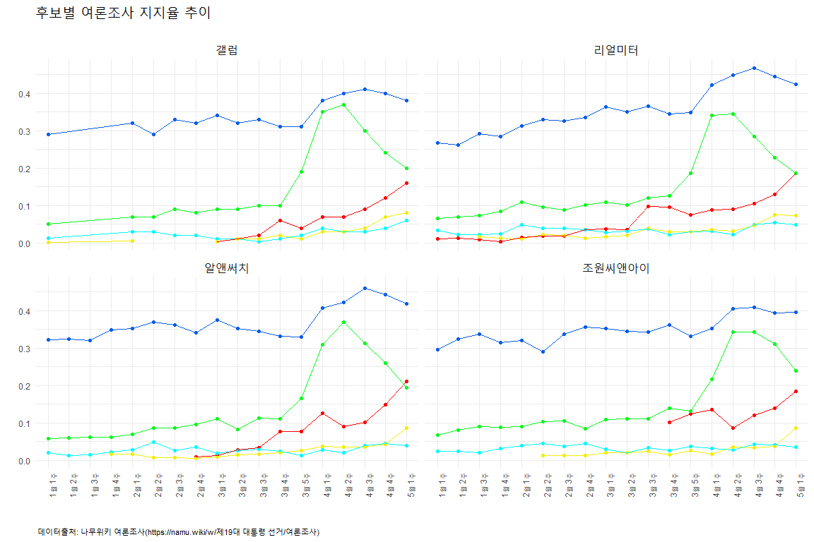

# 데이터 과학자가 바라본 20대 총선

## 나무위키 여론조사

[나무위키 여론조사](https://namu.wiki/w/%EC%A0%9C19%EB%8C%80%20%EB%8C%80%ED%86%B5%EB%A0%B9%20%EC%84%A0%EA%B1%B0/%EC%97%AC%EB%A1%A0%EC%A1%B0%EC%82%AC) 웹사이트에서 국내 주요 여론조사업체가 실시한 여론조사 결과가 표형태로 잘 정리되어 있다.

- 갤럽 : 한국갤럽에서 자체적으로 조사한 2017년 대선 후보 지지도 주간집계 결과임
- 리얼미터 : MBN·매일경제·CBS가 의뢰하여 리얼미터에서 조사한 2017년 대선주자 지지도 주간집계 결과임
- 알앤써치 : 데일리안이 의뢰하여 알앤써치에서 조사한 2017년 대선주자 여론조사 주간집계 결과임
- 조원씨앤아이 : 쿠키뉴스가 의뢰하여 조원씨앤아이에서 조사한 2017년 대선주자 여론조사 주간집계 결과임

5월3일부터 여론조사 결과 공표가 금지되어 5월 첫째주 공표결과를 끝으로 공식적인 모든 여론조사는 마무리 되었다.

### 나무위키 여론조사 결과 가져오기

`rvest` 팩키지 `read_html` 함수로 웹페이지를 긁어오고 나서, `html_table` 함수로 
각 여론조사 결과를 데이터프레임으로 변환한다.

~~~{.r}
# 0. 환경설정 --------------------------------------------------
library(tidyverse)
library(rvest)
library(stringr)
library(plotly)

# 1. 데이터 가져오기 ------------------------------------------

namu_url <- "https://namu.wiki/w/%EC%A0%9C19%EB%8C%80%20%EB%8C%80%ED%86%B5%EB%A0%B9%20%EC%84%A0%EA%B1%B0/%EC%97%AC%EB%A1%A0%EC%A1%B0%EC%82%AC"
namu_html <- read_html(namu_url, encoding="UTF-8")

# Sys.setlocale("LC_ALL", "Korean")

gallop_tbl <- html_table(namu_html) [[7]]
real_tbl <- html_table(namu_html) [[8]]
rns_tbl <- html_table(namu_html) [[9]]
jwi_tbl <- html_table(namu_html) [[10]]

# 2. 데이터 정제 ------------------------------------------

## 2.1. 갤럽 ----------------------------
names(gallop_tbl) <- gallop_tbl[1,]
gallop_tbl <- gallop_tbl %>% dplyr::select(`주차`, `문재인`, `홍준표`, `안철수`, `유승민`, `심상정`)

gallop_df <- gallop_tbl %>% dplyr::filter(stringr::str_detect(gallop_tbl$주차, pattern="[0-9]{1}[월]")) %>%
  gather(후보, 지지율, -주차) %>% 
  mutate(`지지율` = str_replace_all(`지지율`, "%", "")) %>%
  mutate(`지지율` = as.numeric(`지지율`)) %>% 
  mutate(조사업체 = "갤럽")

## 2.2. 리얼미터 ----------------------------
names(real_tbl) <- real_tbl[1,]
real_tbl <- real_tbl %>% dplyr::select(`주차`, `문재인`, `홍준표`, `안철수`, `유승민`, `심상정`)

real_df <- real_tbl %>% dplyr::filter(stringr::str_detect(real_tbl$주차, pattern="[0-9]{1}[월]")) %>%
  gather(후보, 지지율, -주차) %>% 
  mutate(`지지율` = str_replace_all(`지지율`, "%", "")) %>%
  mutate(`지지율` = as.numeric(`지지율`)) %>% 
  mutate(조사업체 = "리얼미터")

## 2.3. 알앤써치 ----------------------------
names(rns_tbl) <- rns_tbl[1,]
rns_tbl <- rns_tbl %>% dplyr::select(`주차`, `문재인`, `홍준표`, `안철수`, `유승민`, `심상정`)

rns_df <- rns_tbl %>% dplyr::filter(stringr::str_detect(real_tbl$주차, pattern="[0-9]{1}[월]")) %>%
  gather(후보, 지지율, -주차) %>% 
  mutate(`지지율` = str_replace_all(`지지율`, "%", "")) %>%
  mutate(`지지율` = as.numeric(`지지율`)) %>% 
  mutate(조사업체 = "알앤써치")

## 2.4. 조원씨앤아이 ----------------------------
names(jwi_tbl) <- jwi_tbl[1,]
jwi_tbl <- jwi_tbl %>% dplyr::select(`주차`, `문재인`, `홍준표`, `안철수`, `유승민`, `심상정`)

jwi_df <- jwi_tbl %>% dplyr::filter(stringr::str_detect(real_tbl$주차, pattern="[0-9]{1}[월]")) %>%
  gather(후보, 지지율, -주차) %>% 
  mutate(`지지율` = str_replace_all(`지지율`, "%", "")) %>%
  mutate(`지지율` = as.numeric(`지지율`)) %>% 
  mutate(조사업체 = "조원씨앤아이")

## 2.5. 데이터 병합 ----------------------------

write_csv(gallop_df, "data/survey_gallop.csv")
write_csv(real_df, "data/survey_real.csv")
write_csv(rns_df, "data/survey_rns.csv")
write_csv(jwi_df, "data/survey_jwi.csv")
~~~

### 나무위키 여론조사 시각화

나무위키에 등록된 4개 여론조사업체의 5월 1째주 여론조사 결과를 시각화한다.
먼저, 각 여론조사업체 조사결과를 취합하고 `ggplot`에 시각화를 위한 형태로 데이터를 정제하고 나서,
가시성을 높이기 위해 각 후보별 색상을 선택하여 입혀 인터랙티브 데이터 분석이 가능하도록 코드를 작성한다.

#### 인터랙티브 여론조사 지지율

~~~{.r}
# gallop_df <- read_csv("data/survey_gallop.csv")
# real_df   <- read_csv("data/survey_real.csv")
# rns_df    <- read_csv("data/survey_rns.csv")
# jwi_df    <- read_csv("data/survey_jwi.csv")

survey_df <- gallop_df %>% 
  bind_rows(real_df) %>% 
  bind_rows(rns_df) %>% 
  bind_rows(jwi_df)

survey_df <- survey_df %>% mutate(주차 = factor(주차, levels=c("1월 1주차", "1월 2주차", "1월 3주차", "1월 4주차", "2월 1주차", 
                                              "2월 2주차", "2월 3주차", "2월 4주차", "3월 1주차", "3월 2주차", 
                                              "3월 3주차", "3월 4주차", "3월 5주차", "4월 1주차", "4월 2주차", 
                                              "4월 3주차", "4월 4주차", "5월 1주차"))) %>% 
  mutate(지지율 = 지지율/100) %>% 
  mutate(주차 = stringr::str_replace_all(주차, "차", ""))

# 3. 데이터 시각화 -------------------------------------------------------------------

survey_g <- ggplot(survey_df, aes(x=주차, y=지지율, group=interaction(조사업체,후보), color=후보)) +
  geom_point() +
  geom_line() +
  scale_y_continuous(labels = scales::percent) +
  theme_minimal() +
  theme(legend.position="none", 
        plot.caption=element_text(hjust=0,size=8),
        plot.subtitle=element_text(face="italic"),
        axis.text = element_text(size=9.5),
        axis.text.x = element_text(angle = 90, hjust = 1))+
  labs(x="",y="",title="후보별 여론조사 지지율 추이",
       caption="\n 데이터출처: 나무위키 여론조사(https://namu.wiki/w/제19대 대통령 선거/여론조사)",
       subtitle="") +
  scale_colour_manual(name="",
                      values=c(문재인="#065ce8", 
                                  홍준표="#ff0000",
                                  안철수="#07f91f",
                                  유승민="#00faff",
                                  심상정="#f2ee09"))

ggplotly(survey_g)
~~~

<!--html_preserve-->

<!--/html_preserve-->

#### 각 조사기관별 여론조사 지지율 추이

~~~{.r}
ggplot(survey_df, aes(x=주차, y=지지율, group=후보, color=후보)) +
  geom_point() +
  geom_line() +
  facet_wrap(~조사업체) +
  theme_minimal() +
  theme(legend.position="none", 
        plot.title = element_text(size=18),
        plot.caption=element_text(hjust=0,size=8),
        plot.subtitle=element_text(face="italic"),
        strip.text = element_text(size=14),
        axis.text.x = element_text(angle = 90, hjust = 1))+
  labs(x="",y="",title="후보별 여론조사 지지율 추이",
       caption="\n 데이터출처: 나무위키 여론조사(https://namu.wiki/w/제19대 대통령 선거/여론조사)",
       subtitle="") +
  scale_colour_manual(name="",
                      values=c(문재인="#065ce8", 
                                  홍준표="#ff0000",
                                  안철수="#07f91f",
                                  유승민="#00faff",
                                  심상정="#f2ee09"))
~~~

#### 각 조사기관별 여론조사 시각화 표 데이터 

~~~{.r}
# 4. 데이터 표 -------------------------------------------------------------------
survey_candid_df <- survey_df %>% dplyr::select(주차, 후보, 지지율)
survey_tbl <- dcast(setDT(survey_df), 주차 ~ 후보+조사업체, value.var =c("지지율"))

DT::datatable(survey_tbl) %>% 
  DT::formatPercentage(c(2:21), digits=1)
~~~

<!--html_preserve-->

<!--/html_preserve-->
