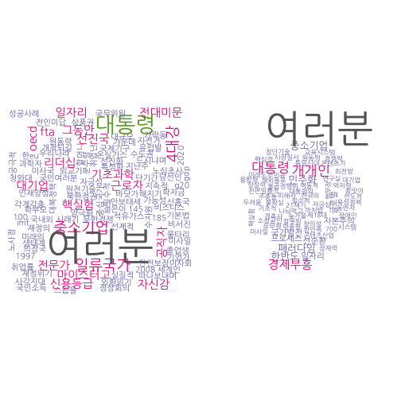

## 1. 대한민국 이명박 대통령 퇴임사와 박근혜 취임사

최근에 있었던 미국 오바마 전임 대통령 퇴임사와 함께 트럼프 신임 대통령 취임사를 분석했으니 동일한 방식으로 2012년도 있었던
이명박 대통령 퇴임사와 박근혜 대통령 취임사를 텍스트 분석해 보자.

~~~{.r}
# 0. 환경설정 -------------------------------------------------------
library(KoNLP)
library(Rtextrankr)

library(tm)
library(qdap)
library(tidyverse)
library(wordcloud)
library(tibble)
library(plotrix)
library(stringr)
library(purrr)
library(ggplot2)
library(gridExtra)
library(extrafont)
par(family="NanumGothic")
~~~

## 2. 퇴임사와 취임사 텍스트 마이닝

### 2.1. 취임사와 퇴임사 연설문 데이터 입수 [^mb-farewell] [^gh-inauguration]

전임 이명박 대통령 퇴임 연설문과 박근혜 대통령 취임 연설문은 여러 언론사와 블로그 등에 올라가 있다.
연설문 전문을 다운로드 받아 분석을 시작한다.

[^mb-farewell]: [전문 -이명박 대통령 퇴임 연설](http://www.skyedaily.com/news/news_view.html?ID=8552&keyWord=%B8%B6%C0%CC%BD%BA%C5%CD%B0%ED)
[^gh-inauguration]: [속보 - 박근혜 대통령 취임사 ‘전문’ 훑어보니…](http://news.khan.co.kr/kh_news/khan_art_view.html?artid=201302251134391&code=910100)

~~~{.r}
# 1. 데이터 불러오기 -------------------------------------------------------
# http://www.skyedaily.com/news/news_view.html?ID=8552&keyWord=%B8%B6%C0%CC%BD%BA%C5%CD%B0%ED
mb <- readLines("data/mb_farewell.txt", encoding = "UTF-8")
# http://news.khan.co.kr/kh_news/khan_art_view.html?artid=201302251134391&code=910100
gh <- readLines("data/gh_inauguration.txt", encoding = "UTF-8")
~~~

### 2.2. 연설문 텍스트 정제

연설문 데이터를 받아 `qdap` 팩키지 전처리 기능을 활용하여 데이터를 정제한다.
그리고 나서 `KoNLP` 팩키지의 `extractNoun()` 함수를 호출하여 명사를 추출한다. 
두 글자 이상되는 명사를 대상으로 말뭉치를 생성시킨다.

~~~{.r}
# 2. 데이터 전처리 -------------------------------------------------------
## 2.1. 문장단위 정리
clean_text <- function(text){
  text <- bracketX(text)
  text <- removePunctuation(text)
  text <- stripWhitespace(text)
  text <- xplit(text)
  text <- get_sentences(text)
  return(text)
}

mb_text <- clean_text(mb)
gh_text <- clean_text(gh)

## 2.2. 명사 추출

useNIADic()
~~~

~~~{.output}
Backup was just finished!
983012 words dictionary was built.

~~~

~~~{.r}
user_dictionary <- data.frame(term=c("노사정", "핵실험", "친서민", "취업률", "박근혜","중국", "한국", "마이스터고",
                       "재정", "이광춘"),
                       tag='ncn')

buildDictionary(ext_dic = c('sejong', 'woorimalsam'),
                user_dic = user_dictionary, category_dic_nms=c('political'))
~~~

~~~{.output}
718253 words dictionary was built.

~~~

~~~{.r}
mb_noun <- map(mb_text, extractNoun) %>% map(function(x) x[nchar(x) >= 2])
gh_noun <- map(gh_text, extractNoun) %>% map(function(x) x[nchar(x) >= 2])

mb_noun_lst <- unlist(mb_noun)
gh_noun_lst <- unlist(gh_noun)

make_corpus <- function(text) {
  text_source <- VectorSource(text)
  text_corpus <- VCorpus(text_source)
  # corpus <- clean_corpus(text_corpus)
  return(text_corpus)
}

mb_corpus <- make_corpus(mb_noun_lst)
gh_corpus <- make_corpus(gh_noun_lst)
~~~

### 2.3. 연설문 텍스트 정제

말뭉치가 생성되면 `TermDocumentMatrix()` 함수를 통해 단어문서행렬을 생성시키고 나서,
`as.matrix` 명령어로 강제로 행렬변환하고 나서 데이터프레임으로 자료형을 정리시키고 나서
통계분석과 시각화를 수행한다.

~~~{.r}
# 3. 말뭉치를 데이터프레임으로 변환 --------------------------------------

word_freq <- function(corpus) {
    doc_tdm <- TermDocumentMatrix(corpus)
    doc_m <- as.matrix(doc_tdm)
    doc_term_freq <- rowSums(doc_m)
    doc_word_freqs <- data.frame(term = names(doc_term_freq),
                             num = doc_term_freq) %>% arrange(desc(num))
    doc_word_freqs$term <- str_replace_all(doc_word_freqs$term, "\n", "")
    return(doc_word_freqs)
}

mb_word_freqs <- word_freq(mb_corpus)
gh_word_freqs <- word_freq(gh_corpus)
~~~

### 2.4. 연설문 시각화

#### 2.4.1. 최다 빈도 단어 시각화

막대그래프를 통해 가장 많이 퇴임사와 취임사에 등장하는 단어를 시각화한다.

~~~{.r}
# 4. 시각화 --------------------------------------------------------------
## 4.1. 단어빈도----------------------------------------------------------
theme_set(theme_gray(base_family="NanumGothic"))

mb_p <- ggplot(mb_word_freqs %>% slice(1:20), aes(x=reorder(term,num), y=num)) +
  geom_bar(stat = "identity") + coord_flip() +labs(y="단어빈도수", x="")
gh_p <- ggplot(gh_word_freqs %>% slice(1:20), aes(x=reorder(term,num), y=num)) +
  geom_bar(stat = "identity") + coord_flip() +labs(y="단어빈도수", x="")

grid.arrange(mb_p, gh_p, ncol=2)
~~~

#### 2.4.2. 퇴임사와 취임사 단어구름

이명박 대통령 퇴임사와 박근혜 대통령 취임사 각각 등장하는 단어를 단어구름을 사용하여 시각화한다.

~~~{.r}
## 4.2. 단어구름----------------------------------------------------------
par(mfrow=c(1,2))
pal <- brewer.pal(8, "Dark2")[-(1:2)]

wordcloud(mb_word_freqs$term, mb_word_freqs$num,  min.freq = 1, scale=c(4,.5),
          rot.per = 0.1, family="NanumGothic", colors=pal)
wordcloud(gh_word_freqs$term, gh_word_freqs$num,  min.freq = 1, scale=c(4,.5),
          rot.per = 0.1, family="NanumGothic", colors=pal)
~~~

#### 2.4.3. 퇴임사와 취임사 공통 단어구름

이명박 대통령 퇴임사와 박근혜 대통령 취임사 공통으로 등장하는 단어를 사용하여 단어구름을 사용하여 시각화한다.

~~~{.r}
## 4.3. 공통 단어구름

mb_tdm <- TermDocumentMatrix(mb_corpus)
mb_m <- as.matrix(mb_tdm)
row.names(mb_m) <- str_replace_all(row.names(mb_m), "\n", "")
mb_m <- rowSums(mb_m)

gh_tdm <- TermDocumentMatrix(gh_corpus)
gh_m <- as.matrix(gh_tdm)
row.names(gh_m) <- str_replace_all(row.names(gh_m), "\n", "")
gh_m <- rowSums(gh_m)

mb_gh_m <- merge(mb_m, gh_m, by = "row.names", all = TRUE)
row.names(mb_gh_m) <- mb_gh_m[,1]
mb_gh_m <- mb_gh_m[,-1]

mb_gh_m$x <- ifelse(is.na(mb_gh_m$x), 0, mb_gh_m$x)
mb_gh_m$y <- ifelse(is.na(mb_gh_m$y), 0, mb_gh_m$y)

commonality.cloud(mb_gh_m, max.words=30, scale=c(4,.5),  rot.per = 0.1, family="NanumGothic", colors=pal)
~~~

#### 2.4.4. 퇴임사와 취임사 비교 단어구름

이명박 대통령 퇴임사와 박근혜 대통령 취임사의 공통되는 단어보다 
차이가 나는 단어에 초점을 두고 활용하는 비교 단어구름(comparison wordcloud)를 사용하여 시각화한다.

~~~{.r}
## 4.3. 비교 단어구름
par(family="NanumGothic")
colnames(mb_gh_m) <- c("이명박", "박근혜")
comparison.cloud(mb_gh_m, colors = c("blue", "red"), max.words = 50)
~~~

#### 2.4.5. 퇴임사와 취임사 공통 단어 피라미드 시각화 

이명박 대통령 퇴임사와 박근혜 대통령 취임사의 공통 단어를 추출하여 
각 단어별 빈도를 통해 동일한 단어의 강조점을 시각화한다.

~~~{.r}
## 4.4. 피라미드 그래프
par(family="NanumGothic")

mb_gh_m$label <- row.names(mb_gh_m)
mb_gh_df <- as_tibble(mb_gh_m)
colnames(mb_gh_df) <- c("MB", "GH", "label")

par(mfrow=c(1,1))
common_words_25 <- mb_gh_df %>%
  dplyr::filter(MB > 0 & GH >0) %>% 
  mutate(diff = abs(MB - GH)) %>% 
  arrange(desc(diff)) %>% slice(1:25)

plotrix::pyramid.plot(common_words_25$MB, common_words_25$GH,
                      labels = common_words_25$label, gap = 8,
                      top.labels = c("이명박", "단어", "박근혜"),
                      main = "이명박근혜 이취임사 공통 단어", laxlab = NULL, 
                      raxlab = NULL, unit = NULL)
~~~

~~~{.output}
[1] 5.1 4.1 4.1 2.1

~~~

