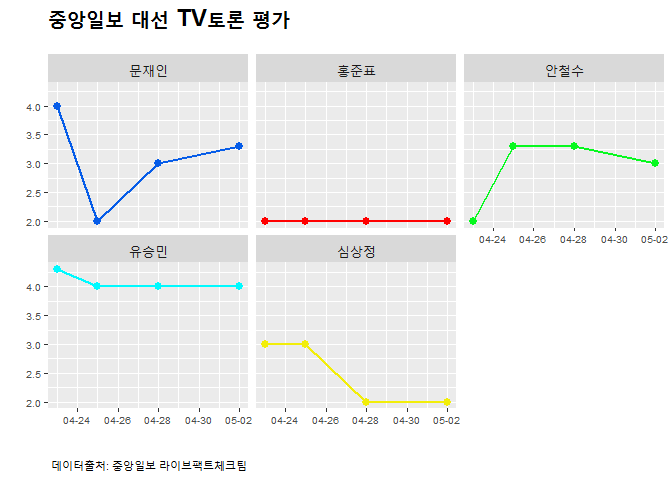

# 데이터 과학자와 함께 하는 제19대 대통령 선거

## TV 토론

최근에 실시된 5차례 TV 토론은 다음과 같다.

- **대선 후보 TV 토론 일정** 
    - ~~KBS 비법정 토론: 4월 19일~~
    - ~~1차 TV 토론 (정치): 4월 23일~~
    - ~~JTBC 비법정 토론 (양극화와 안보): 4월 25일~~
    - ~~2차 TV 토론 (경제): 4월 28일~~
    - ~~3차 TV 토론 (사회): 5월 2일~~

## TV 토론 평가

4월 23일 이후 실시된 최근 TV토론 평가 결과를 구해 데이터베이스로 구축한다.
4월 19일 실시된 KBS 비법정 토론은 평가결과를 찾지 못해 제외한다.

- 4월 23일 : [http://news.joins.com/article/21505362](http://news.joins.com/article/21505362)
- 4월 25일 : [http://news.joins.com/article/21513664](http://news.joins.com/article/21513664)
- 4월 28일 : [http://news.joins.com/article/21526476](http://news.joins.com/article/21526476)
- 5월 02일 : [http://news.joins.com/article/21537123](http://news.joins.com/article/21537123)

중앙일보 TV 토론 결과가 A+, A, A-, B+, B, B-, C+, C, C- 와 같이 대학교 학점체계로 구현되어 이를 A+가
4.3 만점인 것으로 평점을 내는 것으로 수치변환한다. [^credit-conversion]

[^credit-conversion]: [학점인플레 최소대학.. 홍대(세종) 단대(천안) 중대(안성) 톱 3](http://www.veritas-a.com/news/articleView.html?idxno=81267)

## TV 토론 시각화

<!--html_preserve-->

<!--/html_preserve-->

## R 코드 

~~~{.r}
# 0. 환경설정 ----------------------------------------------------------------------
# library(tidyverse)
# library(plotly)
# library(ggthemes)
# library(png)
# library(grid)

# 1. 데이터 가져오기 ----------------------------------------------------------------------

mapping_tbl <- data.frame(credit=c("A+", "A", "A-", "B+", "B", "B-", "C+", "C"),
                        score=c(4.3, 4.0, 3.7, 3.3, 3.0, 2.7, 2.3, 2.0))
debate_date <- data.frame(debate=c("debate0423", "debate0425", "debate0428", "debate0502"),
                          ddate=c("2017-04-23", "2017-04-25", "2017-04-28", "2017-05-02"))

debate_tbl <- data.frame(후보 =c("문재인", "홍준표", "안철수", "유승민", "심상정"),
                        debate0423=c("A", "C", "C", "A+", "B"),
                        debate0425=c("C", "C", "B+", "A", "B"),
                        debate0428=c("B", "C", "B+", "A", "C"),
                        debate0502=c("B+", "C", "B", "A", "C"))

# 2. 데이터 정제 ----------------------------------------------------------------------

debate_df <- debate_tbl %>% gather(debate, credit, -후보)

debate_df <- left_join(debate_df, mapping_tbl, by="credit")
debate_df <- left_join(debate_df, debate_date, by="debate")

debate_df <- debate_df %>% 
  mutate(ddate = lubridate::ymd(ddate)) %>% 
  mutate(후보=factor(후보, levels=c("문재인","홍준표","안철수","유승민","심상정")))

# 3. 데이터 시각화 ----------------------------------------------------------------------

moon <- readPNG("fig/moon.png")
moon_g <- rasterGrob(moon, interpolate=TRUE)
ahn <- readPNG("fig/ahn.png")
ahn_g <- rasterGrob(ahn, interpolate=TRUE)
yoo <- readPNG("fig/yoo.png")
yoo_g <- rasterGrob(yoo, interpolate=TRUE)
sim <- readPNG("fig/sim.png")
sim_g <- rasterGrob(sim, interpolate=TRUE)
hong <- readPNG("fig/hong.png")
hong_g <- rasterGrob(hong, interpolate=TRUE)

debate_g <- ggplot(debate_df, aes(x=ddate, y=score, color=후보, group=후보)) +
  geom_point(size=2.5, alpha=0.7) +
  geom_line(size=0.9) +
  theme_minimal() +
  scale_x_date(date_labels= "%m-%d", limits=c(ymd("2017-04-23"), ymd("2017-05-04"))) +
  scale_y_continuous(limits=c(2,4.7)) +
  scale_colour_manual(name="",
                      values=c(문재인="#065ce8", 
                                  홍준표="#ff0000",
                                  안철수="#07f91f",
                                  유승민="#00faff",
                                  심상정="#f2ee09")) +
  theme(legend.position="none",
        plot.title = element_text(size = 18, face = "bold"),
        plot.caption=element_text(hjust=0,size=8),
        plot.subtitle=element_text(face="italic"),
        axis.text=element_text(size=7.5)) +
  labs(x="",y="",title="중앙일보 대선 TV토론 평가",
       caption="\n 데이터출처: 중앙일보 라이브팩트체크팀",
       subtitle="") +
  annotation_custom(moon_g, xmin=as.numeric(max(debate_df$ddate))+0.5, xmax=as.numeric(max(debate_df$ddate))+1.5,  ymin=3.0, ymax=3.7) +
  annotation_custom(ahn_g,  xmin=as.numeric(max(debate_df$ddate))+1.5, xmax=as.numeric(max(debate_df$ddate))+2.5,  ymin=3.0, ymax=3.7) +
  annotation_custom(yoo_g,  xmin=as.numeric(max(debate_df$ddate))+0.5, xmax=as.numeric(max(debate_df$ddate))+1.5,  ymin=4.0, ymax=4.7) +
  annotation_custom(hong_g, xmin=as.numeric(max(debate_df$ddate))+1.5, xmax=as.numeric(max(debate_df$ddate))+2.5,  ymin=2.0, ymax=2.7) +
  annotation_custom(sim_g,  xmin=as.numeric(max(debate_df$ddate))+0.5, xmax=as.numeric(max(debate_df$ddate))+1.5,  ymin=2.0, ymax=2.7)

debate_facet_g <- ggplot(debate_df, aes(x=ddate, y=score, color=후보, group=후보)) +
  geom_point(size=2.5) +
  geom_line(size=0.9) +
  scale_x_date(date_labels= "%m-%d") +
  scale_colour_manual(name="",
                      values=c(문재인="#065ce8", 
                                  홍준표="#ff0000",
                                  안철수="#07f91f",
                                  유승민="#00faff",
                                  심상정="#f2ee09")) +
  theme(legend.position="none",
        strip.text = element_text(size=12), 
        plot.title = element_text(size = 18, face = "bold"),
        plot.caption=element_text(hjust=0,size=8),
        plot.subtitle=element_text(face="italic"),
        axis.text=element_text(size=7.5)) +
  labs(x="",y="",title="중앙일보 대선 TV토론 평가",
       caption="\n 데이터출처: 중앙일보 라이브팩트체크팀",
       subtitle="") +
  facet_wrap(~후보)
~~~

