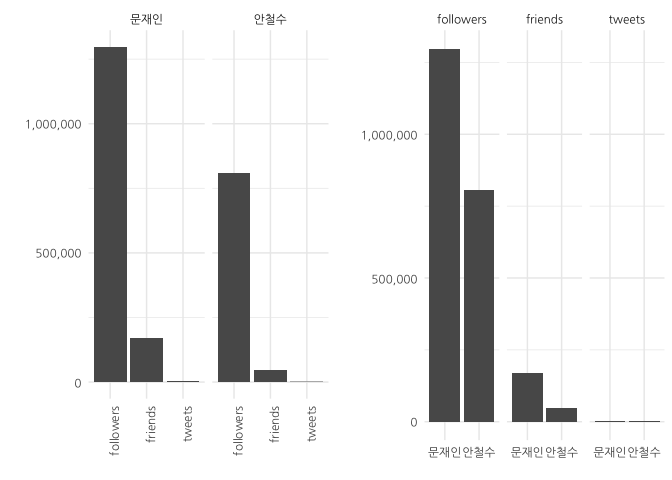
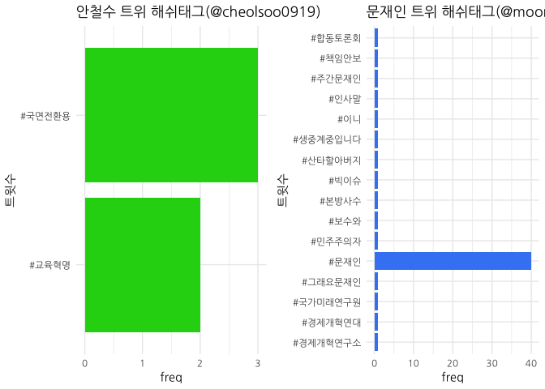

# 데이터 과학자와 함께 하는 제19대 대통령 선거

## 트위터 현황 팔로워와 친구

~~~{.output}
[1] "Using direct authentication"

~~~

<!--html_preserve-->

<!--/html_preserve-->

## 트위터 해쉬태그

## 인기있는 트윗

<!--html_preserve-->

<script type="application/json" data-for="htmlwidget-eed6943fe9443ef1da7a">{"x":{"filter":"none","data":[["1","2","3","4","5","6","7","8","9","10","11","12","13","14","15","16","17","18","19","20","21","22","23","24","25","26","27","28","29","30","31","32","33","34","35","36","37","38","39","40","41","42","43","44","45","46","47","48","49","50","51","52","53","54","55","56","57","58","59","60","61","62","63","64","65","66","67","68","69","70","71","72","73","74","75","76","77","78","79","80","81","82","83","84","85","86","87","88","89","90","91","92","93","94","95","96","97","98","99","100","101","102","103","104","105","106","107","108","109","110","111","112","113","114","115","116","117","118","119","120","121","122","123","124","125","126","127","128","129","130","131","132","133","134","135","136","137","138","139","140","141","142","143","144","145","146","147","148","149","150","151","152","153","154","155","156","157","158","159","160","161","162","163","164","165","166","167","168","169","170","171","172","173","174","175","176","177","178","179","180","181","182","183","184","185","186","187","188","189","190","191","192","193","194","195","196","197","198","199","200","201","202","203","204","205","206","207","208","209","210","211","212","213","214","215","216","217","218","219","220","221","222","223","224","225","226","227","228","229","230","231","232","233","234","235","236","237","238","239","240","241","242","243","244","245","246","247","248","249","250","251","252","253","254","255","256","257","258","259","260","261","262","263","264","265","266","267","268","269","270","271","272","273","274","275","276","277","278","279","280","281","282","283","284","285","286","287","288","289","290","291","292","293","294","295","296","297","298","299","300","301","302","303","304","305","306","307","308","309","310","311","312","313","314","315","316","317","318","319","320","321","322","323","324","325","326","327","328","329","330","331","332","333","334","335","336","337","338","339","340","341","342"],["moonriver365","moonriver365","moonriver365","moonriver365","moonriver365","moonriver365","moonriver365","moonriver365","moonriver365","moonriver365","moonriver365","moonriver365","moonriver365","moonriver365","moonriver365","moonriver365","moonriver365","moonriver365","moonriver365","moonriver365","moonriver365","moonriver365","moonriver365","moonriver365","moonriver365","moonriver365","moonriver365","moonriver365","moonriver365","moonriver365","moonriver365","moonriver365","moonriver365","moonriver365","moonriver365","moonriver365","moonriver365","moonriver365","moonriver365","moonriver365","moonriver365","moonriver365","moonriver365","moonriver365","moonriver365","moonriver365","moonriver365","moonriver365","moonriver365","moonriver365","moonriver365","moonriver365","moonriver365","moonriver365","moonriver365","moonriver365","moonriver365","moonriver365","moonriver365","moonriver365","moonriver365","moonriver365","moonriver365","moonriver365","moonriver365","moonriver365","moonriver365","moonriver365","moonriver365","moonriver365","moonriver365","moonriver365","moonriver365","moonriver365","moonriver365","moonriver365","moonriver365","moonriver365","moonriver365","moonriver365","moonriver365","moonriver365","moonriver365","moonriver365","moonriver365","moonriver365","moonriver365","moonriver365","moonriver365","moonriver365","moonriver365","moonriver365","moonriver365","moonriver365","moonriver365","moonriver365","moonriver365","moonriver365","moonriver365","moonriver365","moonriver365","moonriver365","moonriver365","moonriver365","moonriver365","moonriver365","moonriver365","moonriver365","moonriver365","moonriver365","moonriver365","moonriver365","moonriver365","moonriver365","moonriver365","moonriver365","moonriver365","moonriver365","moonriver365","moonriver365","moonriver365","moonriver365","moonriver365","moonriver365","moonriver365","moonriver365","moonriver365","moonriver365","moonriver365","moonriver365","moonriver365","moonriver365","moonriver365","moonriver365","moonriver365","moonriver365","moonriver365","moonriver365","moonriver365","moonriver365","moonriver365","moonriver365","moonriver365","moonriver365","moonriver365","moonriver365","moonriver365","moonriver365","moonriver365","moonriver365","moonriver365","moonriver365","moonriver365","moonriver365","moonriver365","moonriver365","moonriver365","moonriver365","moonriver365","moonriver365","moonriver365","moonriver365","moonriver365","moonriver365","moonriver365","moonriver365","moonriver365","moonriver365","moonriver365","moonriver365","moonriver365","moonriver365","moonriver365","moonriver365","moonriver365","moonriver365","moonriver365","moonriver365","moonriver365","moonriver365","moonriver365","moonriver365","moonriver365","moonriver365","moonriver365","moonriver365","moonriver365","moonriver365","moonriver365","moonriver365","moonriver365","moonriver365","moonriver365","moonriver365","moonriver365","moonriver365","moonriver365","moonriver365","moonriver365","moonriver365","moonriver365","moonriver365","moonriver365","moonriver365","moonriver365","moonriver365","moonriver365","moonriver365","moonriver365","moonriver365","moonriver365","moonriver365","moonriver365","moonriver365","moonriver365","moonriver365","moonriver365","moonriver365","moonriver365","moonriver365","moonriver365","moonriver365","moonriver365","moonriver365","moonriver365","moonriver365","moonriver365","moonriver365","moonriver365","moonriver365","moonriver365","moonriver365","moonriver365","moonriver365","moonriver365","moonriver365","moonriver365","moonriver365","moonriver365","moonriver365","moonriver365","moonriver365","moonriver365","moonriver365","moonriver365","moonriver365","moonriver365","moonriver365","moonriver365","moonriver365","moonriver365","moonriver365","moonriver365","moonriver365","moonriver365","moonriver365","moonriver365","moonriver365","moonriver365","moonriver365","moonriver365","moonriver365","moonriver365","moonriver365","moonriver365","moonriver365","moonriver365","moonriver365","moonriver365","moonriver365","moonriver365","moonriver365","moonriver365","moonriver365","moonriver365","moonriver365","moonriver365","moonriver365","moonriver365","moonriver365","moonriver365","moonriver365","moonriver365","moonriver365","moonriver365","moonriver365","moonriver365","moonriver365","moonriver365","moonriver365","moonriver365","moonriver365","moonriver365","moonriver365","moonriver365","moonriver365","moonriver365","moonriver365","moonriver365","moonriver365","moonriver365","moonriver365","moonriver365","moonriver365","moonriver365","moonriver365","moonriver365","moonriver365","moonriver365","moonriver365","moonriver365","moonriver365","moonriver365","moonriver365","moonriver365","moonriver365","moonriver365","moonriver365","moonriver365","moonriver365","moonriver365","moonriver365","moonriver365","moonriver365","moonriver365","moonriver365","moonriver365","moonriver365","moonriver365","moonriver365","moonriver365","moonriver365","moonriver365","moonriver365","moonriver365","moonriver365","moonriver365","moonriver365","moonriver365","moonriver365","moonriver365","moonriver365"],["800006946220691460","840029586482122752","810773720558026754","853632899341369344","816828645347966976","812503606641332224","810828289082171392","817290452999077889","787507989213171713","822998058824658944","799544674528673793","849940839337938944","823368593555353600","812530714012811264","819857967717621761","809222632016990208","798446497884815360","851325840818294784","815700224513445888","702163573653438464","790081385843220480","829162403199807489","811873333306265600","809614233310666753","814255028487622656","808195696310435840","818240849607700482","817719171563687937","817691311696441344","850967922835038209","850687523189792768","799204301503545344","853884295630409728","815154170479005696","790146727105789953","813920358319333376","794434558460624896","837330269422108672","851613320830304257","836021819693912065","779927956332224512","854944142605959168","815176602678018048","797263657352560640","854843865089449984","710276377186938880","813237410381205505","809285703892750344","846353199019679744","816912539413979136","849098048819146757","797263962794360832","854190839903297536","832408616170688512","849851740174274560","841098193895006209","853798397488144385","702851289378476033","813005151858364417","812452620040159233","792972530302656512","854320313038815232","846325634368323585","855443211401048064","702280781175992320","828769637139484672","829660991449296898","816145179526578177","822037129777672192","700554427262857217","854573070597607424","821551787299643394","791499927138381824","840756647924387840","850558713215672320","843298867000967168","849587629569921024","838234992840859648","850324597085843456","832831921155567616","821263777215574016","817254739691720704","692240682984083457","702357519931277312","854599268648091648","846300736627490816","822311570713645056","820468823929147392","830615673789304832","852842972374720512","816213837770670080","770796514599849984","811065678723567616","851766750983077888","817354517821857793","848720896600690688","854868497033080832","854666615186522114","853172017704517632","783159958216937472","847082810988912641","814336265311096832","820624160552468480","784046367253536768","838668126459834369","851049524134989824","853558987983278080","853228000610992129","811461751615066112","838396335447400449","855208501747924992","853182332118761473","698071068532060160","775301746646130688","703387636992315392","714802683119448064","790507436775923716","815874835549069313","836748664986968064","775989322671456256","775642758417571841","808555626720727040","846598326581575682","828974723178471425","848871724556763137","765515366097297412","852399847491514368","829280955152101380","796900372161785856","850914492686884864","707419189837897728","814035487337762816","832588018145910785","698059826358648832","790827650478514176","782563058056957953","838953404609126401","818371567226744832","779980084320972800","818722203696889856","814759579984621568","832529595895144448","836886945615777793","769550198183858177","809768512046526464","811926646391336963","834385157511471104","791159122175619072","854237644338810880","827746496724348929","786119027550621696","853474025007308800","851288107022376960","850151943922098176","847611874090733568","827786101523820545","823702234756042753","821643751923863552","692671481499639809","847665816841605121","775542924872298497","810501229121916928","819807832270745600","778551345682845696","833903548349886464","786954261636591616","835067738288615425","829190615179079680","773345651136483328","813236535554285568","700595357227462656","701047089833181184","843103360764928000","818805818434801665","846695966740639744","829984211889119232","822702308332949504","841093762419896320","784038037139226625","816576396143144962","818378662810513408","822070815566876674","841149859017048065","852768775283671040","841934147572649985","853862940012716033","837632155597484032","775494867443064832","771263946384814080","698769075049107458","851712987463245825","787258054043537408","819476017785946112","782051754070249472","852034758183755776","716509052432289792","808483345621360640","808993932440809472","777400454011432960","855063843591995392","853952557621755904","849475422798712832","787112960845950976","813313036794499072","829289476677566466","848507526433751041","782460482271805440","688227120108048385","688269456401776640","854515900099186689","817649577431953410","696243608609910784","842354866575958017","854317383434985472","778811671733149696","782048414380924928","811499282662506496","779302199713116162","835777170014253061","851967801086619648","855420586863939586","770080919428468737","706107567630495745","819134447375106049","815878013178888192","830338746696364034","828899679706288128","840519478647508992","851423036557348864","841904016690929664","838688047470272512","823494778520092672","828163354472505344","820569390055706624","812878890272104449","836533952756097024","829931765057753089","854559079523467264","827853057731891200","782731437581578241","842587532198141952","782456882485014529","841940472834740224","697655682653229056","770801315165241344","796511897885491200","832456223261745152","830721341535850497","811755339775295488","777057747124629504","821615182325678081","696932689862074369","851064833332060160","775298119282008065","785045542220931072","831436610642128896","692671640740564992","833105409598566404","715056753226956800","714796547670585344","789285896193400833","849603978627137536","828551742782464001","778947487184728064","822011038971244546","695513686291513344","694127320592830464","850288302418608128","786759258977083392","775298749333577729","780707296020082689","831070448615960576","770798197094572033","834704036234268673","850653198331256832","845850126950133760","838930332954963968","820477452921151488","847667522610405377","837526124108226562","852849631079784448","845972873936195584","834991228500353024","689251678462185472","838327325481586688","688964870985797633","777834041370218497","834353325487239168","821677201351475200","776994776193175552","853213575518707713","692985460998721536","834004114828767234","777686482114928640","834348095848669184","831824032949415936","841241485387288577","833645733609758720","714398646163214337","777031190217756672","851710131628679168","840886698548445184","849927412649402369","714677492183920641","822367603070943234","848168975389278208","837916792412491777","837277312655581184","846938569780342784","714018269032632320","836889934623559682","842675811953983488","852496693182349313","821548443898286080","764322280943910913","838705913108168704","695899163964284928","839056645615321088","852778129139523584","695182209397829632","833332423165239296","852154390618046466","828894326872608768","846216341493202944","714317992033525760","716489547006095360","714710664888127489","842308663121399810","843059326449139712","777752699097927680","827791792032477184","836144318943354884","841947743765577730","843050145994301440","846232221899898880","695234224341671941","852746756144091138","855602703048757248","632466674143199232","633480677019676672","632878478480687104","635721230738329601"],["2016-11-19T16:04:54Z","2017-03-10T02:40:35Z","2016-12-19T09:08:13Z","2017-04-16T15:35:17Z","2017-01-05T02:08:19Z","2016-12-24T03:42:10Z","2016-12-19T12:45:03Z","2017-01-06T08:43:23Z","2016-10-16T04:18:30Z","2017-01-22T02:43:22Z","2016-11-18T09:27:59Z","2017-04-06T11:04:21Z","2017-01-23T03:15:44Z","2016-12-24T05:29:52Z","2017-01-13T10:45:46Z","2016-12-15T02:24:44Z","2016-11-15T08:44:14Z","2017-04-10T06:47:51Z","2017-01-01T23:24:23Z","2016-02-23T16:10:16Z","2016-10-23T06:44:16Z","2017-02-08T02:58:16Z","2016-12-22T09:57:41Z","2016-12-16T04:20:49Z","2016-12-28T23:41:41Z","2016-12-12T06:24:04Z","2017-01-08T23:39:55Z","2017-01-07T13:06:57Z","2017-01-07T11:16:15Z","2017-04-09T07:05:37Z","2017-04-08T12:31:25Z","2016-11-17T10:55:28Z","2017-04-17T08:14:15Z","2016-12-31T11:14:33Z","2016-10-23T11:03:54Z","2016-12-28T01:31:49Z","2016-11-04T07:02:13Z","2017-03-02T15:54:27Z","2017-04-11T01:50:12Z","2017-02-27T01:15:09Z","2016-09-25T06:18:09Z","2017-04-20T06:25:42Z","2016-12-31T12:43:41Z","2016-11-12T02:24:03Z","2017-04-19T23:47:14Z","2016-03-17T01:27:39Z","2016-12-26T04:18:02Z","2016-12-15T06:35:22Z","2017-03-27T13:28:21Z","2017-01-05T07:41:41Z","2017-04-04T03:15:24Z","2016-11-12T02:25:15Z","2017-04-18T04:32:20Z","2017-02-17T01:57:34Z","2017-04-06T05:10:18Z","2017-03-13T01:26:50Z","2017-04-17T02:32:55Z","2016-02-25T13:43:00Z","2016-12-25T12:55:07Z","2016-12-24T00:19:33Z","2016-10-31T06:12:38Z","2017-04-18T13:06:49Z","2017-03-27T11:38:49Z","2017-04-21T15:28:49Z","2016-02-23T23:56:00Z","2017-02-07T00:57:33Z","2017-02-09T11:59:29Z","2017-01-03T04:52:28Z","2017-01-19T11:04:59Z","2016-02-19T05:36:05Z","2017-04-19T05:51:11Z","2017-01-18T02:56:24Z","2016-10-27T04:41:02Z","2017-03-12T02:49:40Z","2017-04-08T03:59:34Z","2017-03-19T03:11:32Z","2017-04-05T11:40:50Z","2017-03-05T03:49:30Z","2017-04-07T12:29:16Z","2017-02-18T05:59:37Z","2017-01-17T07:51:57Z","2017-01-06T06:21:28Z","2016-01-27T07:00:14Z","2016-02-24T05:00:56Z","2017-04-19T07:35:17Z","2017-03-27T09:59:53Z","2017-01-20T05:15:30Z","2017-01-15T03:13:05Z","2017-02-12T03:13:03Z","2017-04-14T11:16:24Z","2017-01-03T09:25:18Z","2016-08-31T01:33:04Z","2016-12-20T04:28:21Z","2017-04-11T11:59:53Z","2017-01-06T12:57:57Z","2017-04-03T02:16:44Z","2017-04-20T01:25:07Z","2017-04-19T12:02:54Z","2017-04-15T09:03:54Z","2016-10-04T04:20:59Z","2017-03-29T13:47:34Z","2016-12-29T05:04:29Z","2017-01-15T13:30:20Z","2016-10-06T15:03:15Z","2017-03-06T08:30:37Z","2017-04-09T12:29:52Z","2017-04-16T10:41:35Z","2017-04-15T12:46:22Z","2016-12-21T06:42:12Z","2017-03-05T14:30:37Z","2017-04-20T23:56:10Z","2017-04-15T09:44:53Z","2016-02-12T09:08:06Z","2016-09-12T11:55:15Z","2016-02-27T01:14:15Z","2016-03-29T13:13:34Z","2016-10-24T10:57:14Z","2017-01-02T10:58:13Z","2017-03-01T01:23:22Z","2016-09-14T09:27:26Z","2016-09-13T10:30:19Z","2016-12-13T06:14:18Z","2017-03-28T05:42:24Z","2017-02-07T14:32:30Z","2017-04-03T12:16:05Z","2016-08-16T11:47:40Z","2017-04-13T05:55:35Z","2017-02-08T10:49:21Z","2016-11-11T02:20:29Z","2017-04-09T03:33:18Z","2016-03-09T04:14:12Z","2016-12-28T09:09:18Z","2017-02-17T13:50:26Z","2016-02-12T08:23:26Z","2016-10-25T08:09:39Z","2016-10-02T12:49:07Z","2017-03-07T03:24:13Z","2017-01-09T08:19:20Z","2016-09-25T09:45:18Z","2017-01-10T07:32:39Z","2016-12-30T09:06:36Z","2017-02-17T09:58:17Z","2017-03-01T10:32:51Z","2016-08-27T15:00:39Z","2016-12-16T14:33:52Z","2016-12-22T13:29:32Z","2017-02-22T12:51:38Z","2016-10-26T06:06:48Z","2017-04-18T07:38:20Z","2017-02-04T05:11:58Z","2016-10-12T08:19:16Z","2017-04-16T05:03:58Z","2017-04-10T04:17:55Z","2017-04-07T01:03:13Z","2017-03-31T00:49:53Z","2017-02-04T07:49:20Z","2017-01-24T01:21:31Z","2017-01-18T09:01:50Z","2016-01-28T11:32:05Z","2017-03-31T04:24:14Z","2016-09-13T03:53:36Z","2016-12-18T15:05:26Z","2017-01-13T07:26:33Z","2016-09-21T11:08:00Z","2017-02-21T04:57:53Z","2016-10-14T15:38:11Z","2017-02-24T10:03:58Z","2017-02-08T04:50:22Z","2016-09-07T02:22:25Z","2016-12-26T04:14:33Z","2016-02-19T08:18:44Z","2016-02-20T14:13:45Z","2017-03-18T14:14:39Z","2017-01-10T13:04:54Z","2017-03-28T12:10:23Z","2017-02-10T09:23:51Z","2017-01-21T07:08:10Z","2017-03-13T01:09:14Z","2016-10-06T14:30:09Z","2017-01-04T09:25:58Z","2017-01-09T08:47:32Z","2017-01-19T13:18:50Z","2017-03-13T04:52:08Z","2017-04-14T06:21:34Z","2017-03-15T08:48:37Z","2017-04-17T06:49:23Z","2017-03-03T11:54:03Z","2016-09-13T00:42:39Z","2016-09-01T08:30:28Z","2016-02-14T07:21:44Z","2017-04-11T08:26:14Z","2016-10-15T11:45:21Z","2017-01-12T09:28:02Z","2016-10-01T02:57:22Z","2017-04-12T05:44:51Z","2016-04-03T06:14:04Z","2016-12-13T01:27:05Z","2016-12-14T11:15:58Z","2016-09-18T06:54:46Z","2017-04-20T14:21:21Z","2017-04-17T12:45:30Z","2017-04-05T04:14:57Z","2016-10-15T02:08:48Z","2016-12-26T09:18:33Z","2017-02-08T11:23:13Z","2017-04-02T12:08:53Z","2016-10-02T06:01:31Z","2016-01-16T05:11:46Z","2016-01-16T08:00:00Z","2017-04-19T02:04:01Z","2017-01-07T08:30:25Z","2016-02-07T08:06:26Z","2017-03-16T12:40:25Z","2017-04-18T12:55:11Z","2016-09-22T04:22:26Z","2016-10-01T02:44:06Z","2016-12-21T09:11:20Z","2016-09-23T12:51:37Z","2017-02-26T09:02:59Z","2017-04-12T01:18:47Z","2017-04-21T13:58:55Z","2016-08-29T02:09:33Z","2016-03-05T13:22:17Z","2017-01-11T10:50:45Z","2017-01-02T11:10:51Z","2017-02-11T08:52:38Z","2017-02-07T09:34:18Z","2017-03-11T11:07:14Z","2017-04-10T13:14:05Z","2017-03-15T06:48:54Z","2017-03-06T09:49:47Z","2017-01-23T11:37:09Z","2017-02-05T08:48:24Z","2017-01-15T09:52:42Z","2016-12-25T04:33:24Z","2017-02-28T11:10:11Z","2017-02-10T05:55:26Z","2017-04-19T04:55:36Z","2017-02-04T12:15:24Z","2016-10-02T23:58:11Z","2017-03-17T04:04:56Z","2016-10-02T05:47:12Z","2017-03-15T09:13:45Z","2016-02-11T05:37:31Z","2016-08-31T01:52:08Z","2016-11-10T00:36:49Z","2017-02-17T05:06:44Z","2017-02-12T10:12:56Z","2016-12-22T02:08:49Z","2016-09-17T08:12:58Z","2017-01-18T07:08:18Z","2016-02-09T05:44:36Z","2017-04-09T13:30:42Z","2016-09-12T11:40:50Z","2016-10-09T09:13:37Z","2017-02-14T09:35:09Z","2016-01-28T11:32:43Z","2017-02-19T00:06:22Z","2016-03-30T06:03:09Z","2016-03-29T12:49:11Z","2016-10-21T02:03:16Z","2017-04-05T12:45:48Z","2017-02-06T10:31:43Z","2016-09-22T13:22:07Z","2017-01-19T09:21:18Z","2016-02-05T07:45:59Z","2016-02-01T11:57:04Z","2017-04-07T10:05:03Z","2016-10-14T02:43:19Z","2016-09-12T11:43:20Z","2016-09-27T09:54:58Z","2017-02-13T09:20:10Z","2016-08-31T01:39:45Z","2017-02-23T09:58:44Z","2017-04-08T10:15:01Z","2017-03-26T04:09:20Z","2017-03-07T01:52:32Z","2017-01-15T03:47:23Z","2017-03-31T04:31:00Z","2017-03-03T04:52:43Z","2017-04-14T11:42:51Z","2017-03-26T12:17:05Z","2017-02-24T04:59:56Z","2016-01-19T01:03:00Z","2017-03-05T09:56:24Z","2016-01-18T06:03:20Z","2016-09-19T11:37:41Z","2017-02-22T10:45:08Z","2017-01-18T11:14:45Z","2016-09-17T04:02:45Z","2017-04-15T11:49:03Z","2016-01-29T08:19:43Z","2017-02-21T11:37:30Z","2016-09-19T01:51:20Z","2017-02-22T10:24:22Z","2017-02-15T11:14:38Z","2017-03-13T10:56:14Z","2017-02-20T11:53:25Z","2016-03-28T10:28:04Z","2016-09-17T06:27:26Z","2017-04-11T08:14:54Z","2017-03-12T11:26:26Z","2017-04-06T10:11:00Z","2016-03-29T04:56:06Z","2017-01-20T08:58:10Z","2017-04-01T13:43:36Z","2017-03-04T06:45:05Z","2017-03-02T12:24:01Z","2017-03-29T04:14:25Z","2016-03-27T09:16:35Z","2017-03-01T10:44:43Z","2017-03-17T09:55:44Z","2017-04-13T12:20:24Z","2017-01-18T02:43:07Z","2016-08-13T04:46:46Z","2017-03-06T11:00:46Z","2016-02-06T09:17:44Z","2017-03-07T10:14:27Z","2017-04-14T06:58:44Z","2016-02-04T09:48:49Z","2017-02-19T15:08:26Z","2017-04-12T13:40:13Z","2017-02-07T09:13:02Z","2017-03-27T04:24:32Z","2016-03-28T05:07:35Z","2016-04-03T04:56:34Z","2016-03-29T07:07:55Z","2017-03-16T09:36:49Z","2017-03-18T11:19:41Z","2016-09-19T06:14:28Z","2017-02-04T08:11:57Z","2017-02-27T09:21:55Z","2017-03-15T09:42:39Z","2017-03-18T10:43:12Z","2017-03-27T05:27:38Z","2016-02-04T13:15:30Z","2017-04-14T04:54:04Z","2017-04-22T02:02:35Z","2015-08-15T08:19:40Z","2015-08-18T03:28:57Z","2015-08-16T11:36:02Z","2015-08-24T07:52:07Z"],[6173,5413,4567,4477,4474,4286,4229,4124,3959,3919,3788,3666,3511,3480,3379,3374,3320,3198,3132,3105,3077,3015,3003,3000,2991,2942,2936,2936,2931,2891,2886,2881,2868,2867,2858,2853,2844,2828,2822,2782,2779,2759,2746,2729,2712,2699,2633,2610,2572,2569,2565,2547,2506,2493,2492,2475,2420,2412,2372,2370,2365,2364,2360,2332,2301,2278,2247,2244,2233,2223,2205,2184,2178,2172,2167,2127,2125,2120,2110,2098,2096,2094,2088,2087,2078,2053,2048,2039,2034,1997,1980,1977,1961,1951,1940,1900,1892,1888,1881,1869,1857,1846,1836,1821,1814,1811,1806,1803,1792,1790,1784,1777,1772,1762,1761,1760,1756,1746,1733,1732,1726,1720,1717,1712,1711,1687,1673,1670,1669,1660,1644,1610,1607,1604,1598,1597,1593,1584,1570,1554,1547,1536,1529,1529,1524,1513,1511,1484,1474,1472,1461,1440,1439,1439,1435,1433,1430,1428,1409,1408,1403,1394,1384,1382,1368,1357,1355,1352,1351,1349,1337,1333,1332,1331,1325,1324,1321,1320,1318,1305,1300,1297,1295,1294,1293,1278,1278,1275,1271,1268,1263,1260,1259,1259,1258,1258,1248,1245,1240,1238,1227,1216,1216,1210,1182,1180,1160,1151,1148,1146,1142,1142,1138,1137,1136,1133,1130,1126,1124,1111,1110,1108,1104,1103,1103,1094,1093,1091,1090,1090,1086,1081,1079,1078,1078,1077,1075,1073,1071,1063,1060,1055,1049,1049,1048,1042,1036,1035,1034,1033,1025,1020,1013,1012,1009,1002,1002,991,990,977,976,972,972,965,962,962,949,947,942,941,940,930,928,926,925,922,917,907,897,897,895,894,893,892,890,887,878,873,871,871,870,870,854,854,852,852,851,848,843,839,835,834,832,827,826,823,822,821,819,819,816,814,813,810,802,782,782,777,775,775,766,765,763,760,760,756,753,751,749,743,713,696,676,661,644,638,606,453,270,160,132,81],[15828,7592,5611,4558,7716,5738,5008,4565,5552,4106,5566,4193,3260,4394,3646,3740,4081,4524,3255,5100,3585,7214,3146,3774,3662,3011,3319,3747,3149,3636,2888,3688,3904,2859,3505,3075,3776,4208,3260,3417,6077,3100,2295,3523,2926,3747,2962,2825,2533,2949,3339,3196,2607,2601,2667,2553,2520,4112,2125,2452,3582,2600,2217,2634,4382,2223,2639,2265,2909,3257,2361,3379,2873,2353,2078,2298,2084,2756,1936,2406,2778,2439,2808,3313,2285,2226,2408,2184,2291,2255,2504,2467,2211,2391,1763,2255,2765,2463,2638,2134,2219,1923,1768,3937,2247,2190,2012,1769,1499,2124,2176,2125,3038,6117,2676,2640,2306,1955,2003,1729,3071,1862,2325,1594,1544,2143,1747,1931,2320,1962,2041,1546,1853,2928,2774,2173,1527,1363,2352,1579,1470,1546,1587,1905,1439,2062,1456,2054,1858,1647,2279,1759,1773,1377,1663,1142,1518,1655,3036,1794,2682,1408,1371,2608,1199,1597,1326,1651,2189,1215,2223,1148,1666,1219,1559,1248,1203,1587,1936,1367,1256,1440,1455,1517,1634,1491,1309,1882,1549,1946,1437,1624,1281,1739,1467,2349,1181,1332,1638,1297,1367,1349,1678,1216,1101,1133,1501,2169,2219,1242,1072,1535,1421,1241,1696,1559,1185,1634,1158,1325,1395,1516,1272,1009,988,1032,1194,1045,1193,1048,1225,1071,1015,1007,1084,1065,1097,1281,935,1331,1304,1370,1186,1863,1403,1368,1135,963,1085,1389,1126,1456,951,1906,1462,980,2389,885,1690,1764,1168,968,985,1214,983,1684,1354,1016,1242,1872,1264,864,1180,863,974,948,933,767,823,928,962,825,927,1428,877,1522,1433,882,848,1166,960,1296,822,1009,832,821,813,773,1408,1047,927,758,863,1546,741,736,836,888,775,1114,812,816,825,817,1004,803,882,744,912,947,690,850,753,713,1153,1106,1221,826,794,1011,594,617,751,706,567,798,607,548,851,562,374,226],["박 대통령이 세월호 때 관저집무실을 이용했다고 청와대가 공식적으로 밝혔네요. 관저집무실을 이용했다는 건 출근하지 않았다는 뜻입니다. 관저집무실은 대통령이 출근 전이나 퇴근 후 관저에서 이용하는 곳입니다. 그 긴박했던 시간에 출근 않고 뭘 했는지요?","\"대한민국은 민주공화국이다. 대한민국의 주권은 국민에게 있고, 모든 권력은 국민으로부터 나온다.\" \n\n오늘 우리는, 헌법 제1조의 숭고하고 준엄한 가치를 확인했습니다... https://t.co/PRjh4dzyxS","박근혜대통령이 한나라당대표시절 북한 김정일위원장에게 보낸 편지가 문제되고있습니다.당당하지 못하고 지나친 과공의 부적절한 표현이 있지만, 남북관계발전을 위한 충정으로 이해합니다.문제는,자기는 해도 되고 남이 하면 종북이라는 이중잣대,이제 버려야합니다.","사랑하는 국민여러분.\n저는 오늘, 길을 나섭니다. 국민만 믿고 가겠습니다. 여기까지 온 것도 국민 덕분이고, 가야 할 이유도 국민입니다. 반드시 이길 것입니다. 22일 후, 승리를 보고드리겠습니다. https://t.co/Zry8NLhY3K","대한민국 18세는 투표권이 없습니다. 군대가고 세금낼 의무는 있는데 투표할 권리는 없습니다. OECD국가중 우리나라가 유일합니다. 우리청년들의 정치의식은 세계 최고인데 권리는 OECD 최저입니다. 부끄럽고 미안한일입니다. 이제 정치가 제몫을 해야합니다","세월호 고 김관홍 잠수사 집을 찾아 사랑스런 다은,라은,효에게 성탄선물했더니, 부인 김혜연님이 예쁜 꽃바구니를 선물해줬습니다. 직접 하던 꽃집을 그만두고 꽃배달일을 하고있는데, 손석희앵커가 언급을 해줘서 주… https://t.co/pIbcldJ4R1","시민혁명, 촛불혁명... 남은 말해도 괜찮고 문재인이 말하면 불온합니까? \n선거를 좌지우지 하려는 일부 언론의 구태가 또 시작되는 것 같아 심히 우려됩니다.","&amp;lt;동지들에게 절박한 마음으로 호소합니다.&amp;gt;\n우리의 지상목표는 정권교체입니다. \n그러려면 하나가 돼야 합니다.\n경쟁을 하더라도 \n나중엔 하나될 준비를 해야 합니다.\n집권을 위해서도 국정운영 성공을 위해서도\n우… https://t.co/wKS1Xz4fHS","내통이라....대단한 모욕이네요. 당대표란 분이 금도도 없이. 내통이라면 새누리당이 전문 아닌가요? 앞으로 비난하면서 등뒤로 뒷거래, 북풍, 총풍. 선거만 다가오면 북풍과 색깔론에 매달릴뿐 남북관계에 철학이 없는 사람들. 이제 쫌 다른 정치합시다.","안희정 충청남도 도지사님의 출마선언을 환영합니다. 우리는 One Team! 언제나 동지입니다. 후보가 누구든, 우리는 이깁니다. 멋진 경선 기대합니다. https://t.co/5ICygBhUtm","100만 촛불로 안된다면, 이번에는 200만이 모이면 되지 않겠습니까? 지역에서도 나서주십시오. 저는 내일 부산에서 촛불을 들겠습니다.","우리가 무슨 홍길동입니까? '3'을 '삼'이라고 읽지 못하고 '쓰리'라고 읽어야 합니까?","이재명 성남시장님의 출마선언을 환영합니다. 힘+힘은 더욱 큰 힘, 아름다운 경쟁으로 정권교체를 이뤄냅시다. https://t.co/4gSt8zscZR","어제밤 홍대 길거리에서 노숙자와 홈리스들을 위한 '빅이슈' 잡지 판매를 도왔는데, 평소 하루 15권 정도 팔던 것을 순식간에 700부나 팔 수 있었다고 무척 고마워했습니다. 추위 속에서 줄을 서서 잡지를 사주신 많은 분들께 깊이 감사드립니다.","전국 중증장애아동수는 6만 3천여명. 하지만 국내 어린이 재활병원은 단 1곳. 일본은 200개가 넘는다는데요. 병원이 집이자 학교이자 세상의 전부인 중증장애아들에게 치료와 재활, 교육과 돌봄을 함께 받을 수… https://t.co/y9CIxGnBAH","부패한 대통령은 탄핵 당했습니다.\n억울한 시인은 무죄를 받았습니다.\n역사는 굽이굽이 올바로 갑니다. \n안도현 시인, 다시 시를 쓰십시오.\n아름다운 국어로 다시 희망을 노래해 주십시오.","국민과 함께 전국적인 퇴진운동에 나서겠습니다. 박근혜·최순실 게이트’를 계기로 대한민국은 과거와 결별하고 국가를 대개조하는 명예혁명에 나서야 합니다.  https://t.co/uHjDNZOpgD","단호히 말씀드립니다. 한반도에서의 군사적 행위는 한국 동의 없이 이뤄져서는 안 됩니다. 집권하게 되면 빠른 시일내 미국을 방문해서 안보위기를 돌파하고 북핵문제를 근원적으로 해결할 방안을 협의하겠습니다.… https://t.co/oa8OnUHPlc","정유년 새해가 밝았습니다.\n역사 속 정유년은 파란만장합니다.\n1597 정유년은\n이순신 장군이 불과 열 세척의 배로 왜군을 격파한 명량대첩의 해였습니다.\n1897 정유년은\n고종이 대한제국을 선포한 해였습니다.… https://t.co/o02Rf9oqPI","김광진 잘했다 !!!","&amp;lt;저의 길을 가겠습니다&amp;gt; 국민을 편 가르고 증오하게 만드는 새누리당의 사악한 종북공세에 끝까지 맞설 것입니다. 더 이상 구시대적 색깔론이 이 땅에 발붙일 수 없도록 결연한 의지로 맨 앞에서 싸우겠습니다. https://t.co/bhwt6fAmI0","헌법재판소의 대통령 탄핵 2월 선고가 사실상 무산되었습니다.   \n박근혜 대통령은 헌법유린 국정농단도 모자라 \n헌재를 무력화하려는 의도를 노골적으로 드러내고 있습니다. \n당당하게 심판에 응할 생각은 하지 않… https://t.co/TdPZwngVtG","지난 대선때 저의 슬로건이었던 &amp;lt;사람이 먼저다&amp;gt;는 신영복선생님 작품이었습니다. 이번에 1주기를 맞아 고인의 유지에 따라 선생의 서체가 무료로 배포된다고 합니다. 뭉클합니다.","박근혜 정부가 양승태 대법원장과 사법부를 불법 사찰한 정황이 드러났습니다. 사실이라면 삼권분립의 민주주의 근간을 훼손한 심각한 사태입니다. \n우리 헌법이 삼권분립을 명시한 이유는, 그것이 민주주의 공화국을… https://t.co/BAAx02zFCd","소녀상은 살아있는 역사교과서입니다. 부산 시민들의 소녀상 설치는 진정한 독립선언입니다. 부산동구청과 그 배후 세력은 설치를 두려워합니다. 청산되지 못한 친일행위와 다름 없습니다. 소녀상에는 국가를 대신해 위… https://t.co/oKTV41I3DX","불의한 세력이 국민을 잠깐 이길 수는 있지만, 역사는 국민과 함께 한 사람을 기억합니다. 독재정권에겐 무서운 적이었지만 약자와 노동자에겐 듬직한 친구였던 조영래 선배, 국민이 승리하고 있습니다. 하늘에서 보고 계시죠? 그립습니다.","세월호 1000일의 슬픔, 1000만 번의 분노\n304명의 희생자를 떠나보낸 세월호의 참극은 아직 끝나지 않았습니다.\n미수습자 9명은 지금도 차가운 바다에서 세번째 겨울을 맞고 있습니다.\n1000일간 유가족… https://t.co/I6rOaMGZPz","부산 소녀상에 대해 일본이 주한대사와 부산 총영사를 본국 소환하고 통화스와프 중단 등 초강수 보복조치. 도대체 우리 정부는 일본과 무슨 합의를 한 것인가? 민간의 소녀상 설치까지 막겠다고 약속했다는 건가? 윤병세 장관이 분명하게 밝혀줄 것을 요구한다.","세월호 998일, 광화문 촛불집회에 세월호에서 구조된 단원고 학생들이 무대에 올랐습니다. 세월호 유가족들, 미수습자 가족들도 무대에 올랐습니다. 부끄럽고 미안합니다. 천만촛불이 잊지않을것입니다. 적폐청산,정권교체로 세월호를 인양하고 진상규명하겠습니다","제가 ‘배우 김영애’ 님을 특별한 연기인으로 기억하게 된 계기는 영화 &amp;lt;변호인&amp;gt;이었습니다. 정의로운 아들은 따뜻하고 성실한 어머니 품에서 길러진다는 사실을 보여주셨습니다. 삼가 고인의 명복을 빕니다.… https://t.co/VUjK1y3bvT","안희정 충남지사님, 이재명 성남시장님, 최성 고양시장님과 다시 만났습니다. 이번에는 양복을 벗고 맥주 한 잔 했습니다. 김대중 노무현 정신을 공유하는 우리는 한 팀, 우리는 더불어민주당입니다.… https://t.co/DCuBzHWXH3","조직적이고 악의적인 흑색선전과 허위사실 유포 행위를 그냥 좌시하지 않겠습니다. 더 이상 대한민국 정치에 발붙이지 못하도록 강력히 대응하고 발본색원해 나갈 것입니다. https://t.co/IKS7UON8qs","오늘 아침, 대구로 가는 길에 너무도 안타까운 소식을 들었습니다. 우리 유세차량과 추돌한 오토바이 운전자께서 운명을 달리하셨습니다. 36살의 젊은 나이에 아내를 남겨 두셨다고 하니 가슴이 아려옵니다. https://t.co/9WQU2CDtQB","2016년 달력을 서랍에 넣습니다.\n국민 여러분 수고하셨습니다.\n\n촛불을 드신 분도\n촛불에 마음을 보태신 분도\n보수의 가치를 믿었던 분도\n진보의 가치에 헌신해온 분도,\n한 해 동안 수고 많으셨습니다.\n\n이… https://t.co/SZEPVl2svb","얼마만입니까? SBS  '그것이 알고싶다 '. 실로 오랫만에 지상파에서 수준높은 참언론의 모습을 봤습니다.","고은 선생님, 그리고 수많은 문화예술인들께 미안합니다. \n가장 아름다운 복수는, 우리가 그들과 다르다는 것을 보여주는 것이라고 생각합니다. 대한민국에 다시는 그런 일이 없도록 하겠습니다.","&amp;lt;박근혜대통령에게 다시 요구합니다&amp;gt;대통령은 국정을 진심으로 걱정하는 최소한의 애국심을 보여주시기바랍니다. 대통령이 끝내 국민에게 맞선다면 중대한 결심을 더 이상 늦출수 없습니다.국민과 함께 행동에 나서겠습니다https://t.co/UP3JjSWO5l","동물학대에 대한 처벌을 강화하는 동물보호법 개정안이 국회에서 통과되었습니다. 생명을 존중하는 마음은 강아지와 고양이 등 동물만을 위한 것만이 아닙니다. 인간 스스로를 위한 것입니다. 인간과 동물, 자연이 함께 조화로운 대한민국을 바랍니다.","국민여러분 걱정하지 마십시오. 저와 우리당은 강력한 안보와 외교 노력을 바탕으로 북한의 도발을 단호하고 확실하게 억제하겠습니다. 북핵 문제를 근원적으로 해결하고 전쟁 위험이 없는 한반도를 만들겠습니다. https://t.co/9QaeOk3woY","아직 진실이 다 드러나지 않았습니다. \n박근혜 대통령과 국정농단 세력들은 여전히 진실을 은폐하고 범죄를 은닉해 왔습니다. 심지어 특검 수사와 헌재 심리 등 헌법적 절차를 노골적으로 능멸하고 방해해 왔습니다. https://t.co/PcMvX0YA4x","백남기선생의 명복을 빕니다. 부당한 공권력행사에 의한 죽음인데도 대통령,경찰청장,누구의 사과도 없었습니다. 설령 정당한 공권력행사였다해도 사과해야할 일인데요. 국민에 대한 무한책임, 그게 국가가 할일 아닌가요. 그분의 죽음에 우리 모두가 죄인입니다.","2012년 대선 첫 광화문 유세때, 그리고 12월 18일 마지막 서울역 유세때 정권교체를 위해 기꺼이 저의 유세 무대에 섰던 가수 전인권씨를 기억합니다. 본인 노래를 부르는 것이 선거법위반이라 하여 부득불… https://t.co/RwWWc5tTi5","저는 오늘 전주 촛불집회에 참석했습니다. 한해를 보내고 새해를 맞는 제야, 소중한 사람과 함께하고 싶은 귀한 시간까지 송박영신의 촛불을 들어준 시민들께 감사드립니다. 새해, 우리가 만들 새 시대 속에서 모두 복 많이 받으세요.","오늘은 대한민국 역사의 중대한 갈림길입니다. 국정농단과 권력형비리로 국정파탄을 초래한 박근혜 대통령과 새누리당에 준엄한 경고를 보내는 날입니다. 그러나 분노의 표출은 어떤 경우든, 무조건, 평화적으로 질서있게 이뤄져야 합니다.","송영길 총괄본부장님! 새벽부터 고생이 많으십니다. 함께 해 주셔서 든든하고 힘이 됩니다. 다만 식사는 제대로, 앉아서 해 주십시오. 저는 지금 최문순 지사님 만나러 강원도로 갑니다. 오늘도 더 힘 내겠습니다… https://t.co/KG3vwy18VL","정청래 의원이 어렵고 아픈 결정을 했습니다. 제물이 아닙니다. 쓰러진 것도 아닙니다. 아픈 지지자들을 일으켜세우는 디딤돌이 될 것입니다. 크게 봐야 합니다. 분노를 변화의 에너지로 승화시켜야 합니다. 그의 아름다운 헌신에서 승리의 희망을 봅니다.","연화무염(蓮華無染). 연꽃은 진흙에서 자라도 더럽혀지지 않는다. 진흙탕 같은 정치에서 꽃을 피워야하는 정치인들이 특히 새겨야할 가르침입니다.","&amp;lt;외신기자클럽 초청 간담회 모두발언&amp;gt;\n \n\"대한민국 촛불혁명은 역사상 가장 위대한 시민혁명\"\n\n외신기자 여러분 반갑습니다. \n대전환기 대한민국을 취재하느라 고생이 많습니다. \n지금 대한민국은, 혁명 중입니다… https://t.co/Q6T4aFbAp5","광주, 전남, 전북의 뜻은 정권교체였습니다. 오늘 압도적인 지지로 정권교체의 뜨거운 염원을 제게 주셨습니다. 진심으로 감사드립니다. 그 믿음, 반드시 정권교체로 보답하겠습니다. https://t.co/2nMU8fRfaa","&amp;lt;권력기관 대개혁으로 새로운 나라를 만들겠습니다.&amp;gt; \n권력적폐 청산을 위한 긴급좌담회 \n문재인 기조발제문\n\n첫째,청와대 특권을 버리고 국민과소통\n둘째,검찰개혁으로 법치의 기본을\n셋째,국정원을 해외안보정보원으로\nhttps://t.co/rBnTdWrNMS","일본군 위안부 피해자 이순덕 할머니가 돌아가셨습니다. 할머니의 삶은 신산하였지만, 모진 세월을 견디면서도 고고하셨기에 ‘동백꽃 할머니’라 우리는 불렀습니다. 이제 무거웠던 짐을 내려 놓으시고 편히 쉬십시오. https://t.co/NRBIVlYpD8","청와대로 가지 말고 국민들 마음 속으로 갑시다. 국민이 권력을 이깁니다. \n저는 오늘 국민들과 함께 할 것입니다. 광장에서 뵙겠습니다.","안희정 지사님과 저는 한 팀이고 동지입니다. 아드님까지 함께 해 주시니 더욱 든든하고 마음이 놓입니다. 감사합니다! https://t.co/wup0hzasN4","결국 국민의 힘입니다.\n\n이재용 삼성전자 부회장의 구속으로\n박근혜 최순실의 국정농단 처벌, \n재벌적폐 청산의 한 고비를 넘었습니다.\n당연한 일이지만 힘든 일이었습니다.\n\n“이게 나라냐”라는 국민의 분노에\n마… https://t.co/ac744sBs6d","https://t.co/ul65l2JFIO 은화야, 다윤아, 현철아, 영인아, 고창석 선생님, 양승진 선생님, 이영숙님, 권재근님, 그리고 혁규야. 같이 살아 있지 못해서, 우리만 살아 있어서 미안하다.","원효로 화재로 부상당한 소방대원 두 분의 소식이 감동적입니다. 아이들과 시민들을 구하기 위해 온몸으로 불길을 막았다고 합니다. 국가의 역할도 이와 같을 것입니다. 김성수, 최길수 두 분 구조대원의 용기와 헌신에 감사드리며 빠른 쾌유를 기원합니다.","조응천 의원님, 이재정 의원님 감사합니다. 꼭 이기겠습니다! https://t.co/yn6Npjmpgg","강기정의 필리버스터를 보느라니 마음이 짠합니다. 공천배제라는 말이 당에서 나오고 있는데도 당을 위해 있는 힘을 다하고 있습니다. 광주가 어려울 때 끝까지 당을 지켰던 사람답습니다. 강기정 멋있다. 힘내라 !!","&amp;lt;성탄절 미사&amp;gt;\n아흔인 노모와 함께 성탄미사를 봤습니다. 부산 신선동 성당. 제가 55년 전 어릴 때 영세를 받은 성당입니다. 제겐 고향같은 성당이지요. 함께 영세받은 동기를 비롯해 그 시절 신도들이 지금도… https://t.co/lmSZX0C1iF","촛불을 든 백만의 예수를 보았습니다.\n이웃과 함께 사랑을 실천하는 사람들,\n추위 속에서 세상을 밝히는 사람들,\n국민들 모두 이 시대의 예수입니다.\n\n작은 촛불 속에 사람 사랑이 담겼습니다.\n예수가 사랑으로… https://t.co/BetwTzJGE3","&amp;lt;대통령이 국정에서 손을 떼는 수순이 해법입니다&amp;gt; https://t.co/bwg4VJGOee","한 달 뒤 5.18 민주항쟁 기념식에, 제19대 대통령의 자격으로 참석해 우리의 노래, '임을 위한 행진곡'을 다함께 부를 것입니다. 대한민국 대통령으로 제3기 민주정부의 출범을 자랑스럽게 보고 드리겠습니다… https://t.co/PhjcZp30vl","우리 힘든 청춘들, 오늘 하루 고생 많았습니다. 힘내세요. 화이팅! 응원합니다! - '이니' https://t.co/oFDUl7aSNk","김부겸 의원님, 오늘은 동지라고 부르고 싶습니다. 올리신 페이스북 글, '참 힘듭니다' 라는 첫 마디에 가슴이 아픕니다. 김대중과 노무현이 평생을 걸어온 그 길, 김부겸 동지가 걷는 길에 함께하겠습니다. https://t.co/1cmLwftD6w","은수미 대단하다. 힘내라 !!!","고민정 아나운서의 남편 조기영 시인이 블로그에 올린 글입니다. 험난한 여정에 동참한 아내에 대한 걱정과 사랑, 정권교체에 대한 기대와 소망이 절절합니다. 미안하고 고맙습니다.두 분께 다시 한 번 감사드립니다. https://t.co/RrTqK4unaA","개성공단 폐쇄, 1년이 되었습니다. 박근혜 정부의 어처구니없는 결정으로 입주기업들은 엄청난 피해와 고통에 내몰렸습니다. 남북경협과 한반도 평화의 꿈도 무너졌습니다. 개성공단은 작은 통일입니다. 남북경협의 성… https://t.co/NFIdnYl03k","국회 사무총장과 국회 청소근로자들께서 맞절을 하는 모습이 너무나 감격스럽습니다. 비정규직 파견업체직원이었던 분들께서 국회 정식직원이 되셨습니다. 제가 당대표 때 약속드린 일이 이제 이루어졌습니다. 서로가..… https://t.co/kQ9ij0iJcH","KBS판 블랙리스트, 사실인가요? \n\n맛칼럼니스트 황교익씨가 저를 지지하는 전문가 네트워크에 참여했다는 이유만으로 KBS로부터 방송출연 금지를 당한 사건, 있을 수 없는 일입니다. \n정치적 신념은 검열의 대… https://t.co/r2awTiuLyF","정동영 국민의당 합류. 잘 됐습니다. 구도가 간명해졌습니다. 자욱했던 먼지가 걷히고나니 누가 적통이고 중심인지도 분명해졌고요. 결국 총선승리의 책임은 더민주의 몫이 됐습니다. 야권분열을 극복하고 야당의 승리를 이끄는 것, 더민주가 할 일입니다.","오늘 밤 토론회는 자료 없이, 서서 진행하는 방식입니다. 어떤 형식이든 좋습니다. 오늘도 국민을 위한 정책 위주의 토론이 되도록 최선을 다 해 임하겠습니다. 오늘 밤 10시. KBS 1TV 입니다. https://t.co/X3kNDfX68Y","맞습니다. 아이를 낳고 키우는 것은 부모모두와 사회의 책임이죠. 아빠의 출산,육아휴직도 엄마와 같이 보장되어야 합니다. 과로를 성실로 포장하지 않고 출산육아를 핑계로 여성들을 차별하지 않도록, 직장문화도 바… https://t.co/mjYj7S87Qn","오늘은 마왕 신해철씨의 기일입니다. 요즘처럼 참담하고 무거운 상황일수록, 그가 그립고 그의 노래가 그립습니다. https://t.co/8wYVBUnaTM","&amp;lt;대한민국의 전진은 멈추지 않을 것입니다&amp;gt;\n존경하는 국민여러분\n무겁고 긴 시간이었습니다. 그러나 민심과 헌법은 일치했습니다. 헌법은 대통령을 파면했습니다. 상식의 힘을 헌법적 가치로 재확인했습니다.\n전문보기… https://t.co/s6KHC13nHw","“그야말로 새로운 세상, 삶이 바뀌는 진짜 정권교체에 대한 국민의 기대를 충족시켜 주십시오.” 어제 성남시청에서 함께 한 이재명 시장님의 말씀입니다. 우리는 치열하게 경쟁했고 다시 하나가 되었습니다.… https://t.co/Tgb6OB2rPe","&amp;lt;멀리 가는 물&amp;gt; 도종환. https://t.co/WUWPzcsKzW","&amp;lt;더 낮은 곳으로&amp;gt; \n- 정양\n \n어찌 보면 물길이\n하늘로 치솟는 것 같은\n흘러간 물길이 \n되돌아올 것도 같은\n아무리 둘러봐도 \n아늑한 이 광야에.......\n  \n늘 두려운 마음으로 더 낮은 자세로 \n국민… https://t.co/wWq8tom8re","대통령 탄핵심판을 앞두고 국정원이 헌법재판소를 상대로 불법적으로 정치정보를 수집해 온 정황이 드러났습니다. 보도내용이 사실이라면 지난번 국정조사에서 드러난 대법원장 사찰보다 훨씬 심각한 사태입니다. 묵과할… https://t.co/0BBGPnVTKU","“사랑하는 사이는 원래 그렇게 다투면서 사랑을 깊이 하는 것입니다.”   \n오늘 함께 충혼탑을 참배한 안희정 지사님의 말씀입니다. 그렇습니다. 한 팀인 우리는 같은 곳을 바라보고 있습니다.… https://t.co/pB2pkPXPTz","&amp;lt;다시 촛불로 힘을 모아야 합니다.&amp;gt;\n존경하는 국민 여러분\n지금 대한민국은 비상상황입니다. 아직 탄핵도 장담할 수 없고, 경제도 위중한 상황입니다. 안보 외교 등 모든 분야는 난마처럼 꼬여 있습니다.\n전문보… https://t.co/0GT6hn1rW8","세종청사에서 과로로 숨진 여성 공무원의 소식에 또 한 번 가슴이 무너집니다. 야근과 과로를 당연시하는 사회, 더 이상은 안됩니다. 우리 국민은 OECD 국가 중 두 번째로 많은 장시간 근로에...\n[관련기사… https://t.co/2uH5rlmkMw","영국 파이넨셜타임스가 ‘외국의 투자자들이 한국의 개혁에 베팅하고 있다’&amp;lt;Foreign buyers bet on South Korean reforms&amp;gt;는 제목의 기사를 썼습니다. 저는 지난달 외신기자클럽 간담… https://t.co/a4pyCQ5vxU","낙엽이 떨어져야 새 잎이 돋고 꽃이 피는 법입니다. 저의 퇴진이 우리 당의 변화와 발전과 진보의 계기가 된다면 더 바랄 게 없습니다. 당을 잘 부탁합니다. (전문) https://t.co/xmsBHAzSbu","은수미, 눈물로 마친 10시간 18분의 필리버스터. 감동 !!","오늘 아침에 국민주 문재인 펀드가 열린지 한 시간 만에 마감되었습니다. 감사합니다. 국민들께만 빚지고 이자 붙여 갚겠습니다. 정권교체, 나라다운 나라로 만들어 계속 갚아 나가겠습니다. 거듭 감사드립니다. https://t.co/9k8SGXF1t6","https://t.co/ZHF0xFDPap 공무원 시험을 준비하는 '주니' 를 만났습니다. 같이 이불빨래도 하고 소주 한 잔 했습니다. 주니는 7월, 저는 5월. 공무원 시험에 도전합니다. 착한 주니의 앞날… https://t.co/1lo608Jboa","매 주 금요일마다 찾아올 정책제안 &amp;lt;주간 문재인&amp;gt;, 첫 번째는 '치매국가책임제'입니다. 우리나라 치매환자는 70만명. 가족의 삶과 경제를 위협하는 치매를 국가가 책임지는 다섯 가지 정책을 제안합니다.… https://t.co/3bHn1ENQtW","1987년 6월 민주항쟁의 상징이었던 박종철 열사 30주기 추도식이 어제 마석 모란공원 묘역에서 열렸습니다. 매섭게 추운 날씨였습니다. 저녁의 광화문 집회까지 하루종일 꽁꽁 언 날이었습니다. \n\n1987년… https://t.co/qjrIhmSM9M","북한의 오늘 미사일 발사는 무모하고 어리석기 짝이 없는 일이다. 여러차례 경고에도 불구하고 북한이 도발을 감행한 것을 강력히 규탄한다. 게다가 한국의 최근 정치상황에 어떤 목적을 가지고 그런 도발을 하는지… https://t.co/l34SKqkxwG","가난한 피난민이었던 제 부모님은 장사로 자식들을 키우셨습니다. 저는 뼈 속 까지 자영업, 골목상인의 아들입니다. 불평등, 불공정 경제구조를 바꿔 소상공인과 자영업 사장님들의 지갑을 두툼하게 만들겠습니다.… https://t.co/k35zaaOipM","책을 만드는게 힘겨운 세상이 됐습니다.출판 불황이 깊어지고 있습니다. 대형 서적유통업체 송인서적의 부도로 출판계가 휘청이고 있습니다. 무려 2000여 곳의 출판사가 타격을 입을 것으로 예상된다고 합니다...… https://t.co/8Eidjqyo4s","노무현 대통령이 살아계셨으면 내일이 고희입니다. 봉하마을에선 파전, 신김치에 막걸리 한 잔을 곁들인 소박한 동네잔치라도 벌어지겠죠. \n마침 이때 생신선물처럼, 그의 영원한 대변인 윤태영이 &amp;lt;대통령의 말하기&amp;gt;라는 책을 냈습니다.","을지로위원회는 우리당의 자랑입니다. 이학영 의원님 을지로위원회 위원장 선임을 축하합니다. 4년동안 을지로를 이끌어오신 우원식 의원님, 그동안 고생 많으셨습니다. 을지로위원회는 우리당이 중산층과 서민을 위한… https://t.co/VnIgA7bFgf","한반도에서 또다시 참화가 벌어진다면 국민의 생명과 국가 안위를 걸고 저부터 총을 들고 나설 것입니다. 우리 군은 북한의 모든 전력을 순식간에 무력화시키고 재기불능의 타격을 가할 압도적인 전력을 갖고 있습니다… https://t.co/3pDzPfauEa","[일정] 광화문 촛불집회 참석\n1월7일(토) 오후5시30분 https://t.co/3wJaWzN2KE","오늘은 제주4.3희생자 추념일입니다. \n저는 오늘 참석하지 못하지만 마음은 유가족과 함께 있습니다. 정권교체를 이루고 내년 추념일에는 대통령의 자격으로 기념일에 참석하겠습니다. 인권과 평화를 향한 제주도민들… https://t.co/2XVPHiic3y","작년 10월 26일, 드라마 &amp;lt;혼술남녀&amp;gt; 신입 PD였던 이한빛 씨가 이른 나이에 생을 마쳤습니다. 삼가 고인의 명복을 빕니다. 상상할 수조차 없었을 고인의 죽음에 비통해하실 가족들께 삼가 조의를 표합니다.… https://t.co/rld1088iJc","[캠프] 미국 타임 매거진 메인 페이지에 문재인 후보의 인터뷰 기사가 게재되었습니다. Can He Save The World From War? 전문과 번역본을 공유합니다.… https://t.co/dhEsNzF7Uq","아직도 육아를 ‘도와준다’ 고 생각하는 남편들, 임신부와 어린 아이 엄마들에 대한 배려가 부족한 기업 문화. 그 속에서 일하며 양육하는 여성들의 고군분투가 눈물겹습니다. 좋은 기사, 같이 읽어보시죠. https://t.co/BDCWXwfjJx","이재명시장에게 격려와 성원 보내주십시오.","난임 부부들과 함께 아기를 맞이할 나라 만들겠습니다. 난임 부부들이 병원에 갈 때마다 돈 걱정을 하고 회사 눈치를 보는 일은 사라져야 합니다. 그제야 비로소 대한민국이 아기를 맞이할 최소한의 자격을 갖추게… https://t.co/MgdjUc6Y8e","&amp;lt;민주주의자 김근태 선생 5주기 추모제 추도사&amp;gt;\n\n2017년을 점령하겠습니다.\n\n촛불집회에 참석하고 있으면 늘 김근태 선배님 생각이 많이 납니다. \n늘 제 머리를 떠나지 않는 말씀은 선배님이 세상을 떠나기… https://t.co/1PnDGealFb","어제 마석 모란공원묘역 공원에서 박종철 열사 추도식에 이어 문익환 목사님 23주기 추도식이 열렸습니다. 매섭게 추운 날씨였습니다. 문 목사님 추도식 때마다 날씨가 추웠던 것 같습니다. 우리를 정신 번쩍 들게… https://t.co/5FQkF9oeVN","고 강기봉소방관의 빈소에도 다녀왔습니다. 동료소방관\n들은 눈물을 흘리며 인원부터 늘려달라고 호소했습니다. 과거 2교대하던 인원 그대로 3교대를 하고있어서, 간호학과를 나와 구급담당인 고인이 담당업무가 아닌 구조업무를 하다가 변을 당했다는 것입니다.","특검 수사결과가 가리키는 사실은 분명합니다. 탄핵을 피할 수 없고 사법처리도 피할 수 없습니다. 사유가 명확합니다.\n     \n대통령은 헌법을 유린하고 국정을 농단했습니다. 국민 모두를 부끄럽게 만들었습니다… https://t.co/sOV4yXkg03","오늘 발표한 &amp;lt;도시재생 뉴딜&amp;gt; 공약은 쇠락해가는 구도심을 되살려 국민들의 주거 환경을 개선하고 경제에도 활력을 불어넣는 내용입니다. 선대위 SNS 본부에서 만든 공약 동영상, 같이 보실까요? https://t.co/9j3HsBB1kT","4월 17일 일정 [파란을 일으키자!] \n공식선거운동 첫 날. 국민통합의 의미로 대구, 대전, 수원을 거쳐 저녁 6시에 서울 광화문 유세로 시민들과 만납니다. 문재인과 함께, 정권교체의 파란을 일으킵시다. https://t.co/XYvkE7eYTz","산악인 여러분과 만났습니다. 엄홍길 대장님의 친필 사인이 들어간 스카프도 선물받고 간절한 염원과 응원이 담긴 편지도 받았습니다. 감사합니다. 힘이 납니다. 산악인의 도전정신으로 꼭! 정권교체 하겠습니다.… https://t.co/qFpK9egC5L","지난 주말 부산에서 &amp;lt;판도라&amp;gt; 영화 보러 갔을때 받은 선물입니다. 트친이셨군요. 아프로님 아드님, 고맙습니다. 아들래미가 몇 살이신가요? https://t.co/IKYfRZawmS","연극을 본 아이가 성인이 되어서도 극장을 찾는다고 합니다. 소설을 읽고 합창을 하고 그림을 그리는 일은 단지 여가생활이 아니라 세상을 이해하고 인간을 성찰하는 일입니다. 아이들에게 예술을 가르치는 일, 그것… https://t.co/N30yMVxE5O","과학기술의 혁신과 발전, 사람에게 투자해 이루겠습니다.\n오늘은 과학의 날입니다. 과학자는 인간과 자연에 대한 무한한 탐구심을 가진 지혜의 탐험가들입니다. 사람의 꿈과 상상력이 과학기술과 만나 지금의 세계를… https://t.co/0IAuazxFwi","양산 집에서 가장 행복한 시간은 마루와 함께하는 산책시간입니다. 반려동물은 우리의 삶을 풍성하게 하는 소중한 동반자죠. 그렇기에 진정 살기 좋은 나라는 사람 뿐 아니라 동물들도 행복한 나라일 것입니다.… https://t.co/a5gBdTXe29","개성공단 입주업체들과 종사자들에게 무한한 책임감과 미안함을 느낍니다. 정부의 정책을 믿고 개성공단에 진출하고 투자한 분들에게 큰 보상이 주어져야 하는데 거꾸로 뒤통수를 맞게 만들었으니, 무슨 이런 나라가 있는지 모르겠습니다.","국민안전처는 지진대처요령을 긴급문자와 트윗 등으로 국민들에게 알려주시기 바랍니다.","테러방지법 필리버스터를 응원합니다. (전문) https://t.co/98ZWQCU99U","창원 성산 단일후보 노회찬에게 축하를 보냅니다. 지는 단일화를 결단해서 정정당당하게 승부하고 노 후보의 선대본부장까지 맡아준 우리당의 허성무 후보, 참 장합니다. 그런 자세라면 야권후보 단일화 무엇이 어렵겠습니까? 이제 우리당은 노회찬과 하나입니다.","박근혜표 개헌, 정권연장을 위한 제2의 유신헌법이라도 만들자는 것인가? 대통령은 최순실 게이트 의혹 해소와 경제민생 살리기에 전념하십시오 https://t.co/gsswNAauL4","[성명] &amp;lt;김정은 정권과 북한에 분명히 경고한다.&amp;gt;\n\n김정은 신년사에서 드러난 북한의 도발적이고 호전적인 자세는 한반도 평화에 대단히 심각한 위협이 아닐 수 없다.... \n전문보기 https://t.co/lWyFG774dO","지체된 정의는 정의가 아닙니다.\n(Justice delayed is justice denied)\n\n박영수 특검 70일 수사가 종료됐습니다. 수사팀은 한정된 기간 역사적 소임에 충실했습니다. 왜 검찰이 아니라… https://t.co/Jt9GU0frjP","모두에게 감사드립니다. 좋은 사람들과 더 아끼고 더 사랑하는 한가위되시기 바랍니다. 힘들고 아픈 이웃들에게도 다 따뜻한 마음 보내주시고요.","국민안전처의 뒷북 긴급재난문자는 안전에 주의하라는 내용이 다였습니다. 어떻게 행동하라는 요령이 없었습니다. 각자 알아서 주의하라는 거죠. 어떻게 행동해야할지 몰라 더 불안한 국민들에게 뒤늦게 보낸 맹탕문자. 그 맹탕이 보여주는 무능이 더 걱정입니다.","정책공간 &amp;lt;국민성장&amp;gt; 대한민국 바로 세우기 1차 포럼 '촛불민심과 새로운 대한민국'\n\n기조연설 &amp;lt;완전히 새로운 대한민국을 만듭시다&amp;gt;\n\n존경하는 국민여러분!\n우리는 지금 역사의 큰 고비를 넘고 있습니다...\nhttps://t.co/BlVb8TkGeL","맑은 하늘, 깨끗한 공기는 아이들의 권리입니다. 3월 21일부터 &amp;lt;국민이 만드는 대선공약&amp;gt; 캠페인으로 정책제안을 문자로 받고 있는데 미세먼지 대책 제안을 2천 여 건이나 받았습니다. https://t.co/gwoz6Q3zPL","김부겸 의원은 감동의 정치인입니다. \n대구경북에서 지역구도에 맞서 \n뚝심있게 성공을 이뤄냈습니다.\n\n지역주의를 극복하는 것이 \n우리정치의 미래이며 대한민국 발전의 토대입니다. \n김부겸 의원의 노력으로\n지역주… https://t.co/iWyiJMJUvJ","[문재인 일정] 4월4일(화)\n- 08:00 현충원 참배\n- 10:00 의원총회\n- 16:30 노무현 대통령 묘역 참배 및 권양숙 여사 예방 https://t.co/YI3FNKnepx","뼈만 남은 몸에 형형한 눈빛으로 제 손을 부여잡고, 내년 대선에서 정권교체를 위해 꼭 역할을 하겠다고 다짐하던 모습과 그 여윈 손의 힘을 못잊을 겁니다. 백무현 화백님 이제 편히 쉬십시오. 정말 고마웠습니다.","[캠프] 오늘 밤 10시, 첫 대선후보자 TV 토론이 SBS 에서 방송됩니다. 많은 시청 바랍니다. https://t.co/7WmY5cL9GA","법원의 월성 1호기 수명 연장 결정 취소 판결을 환영합니다. \n설계수명이 다한 노후원전의 가동을 중단해야 한다는 국민의 요구에 부합하는 판결입니다.\n차제에 월성 1호기 수명연장을 밀어붙였던 원전 마피아들과… https://t.co/y4M0Q6uiVP","&amp;lt;국민에게 드리는 글&amp;gt; https://t.co/XHUkQR2pLM","개발이익만 추구해온 확장적 도시개발을 넘어, 도시의 역사성을 살리고 구도심의 삶의 질을 높여 사람이 살기 좋은 곳을 만드는 '도시재생 뉴딜' 정책을 발표했습니다. 좋은 정책으로 국민의 삶을 바꾸겠습니다.… https://t.co/xfaoBvTFuh","매화가 한창인데 밤새 눈이 꽤 왔습니다. 설중매. 눈 속에 피는 것이 아니라 꽃이 먼저 핀 후 눈이 오는 것이지요. 매화는 눈이 와도 꽃잎을 오무리지 않아 활짝 핀 꽃잎 주변에 눈이 쌓이는 것입니다.춘래불사춘이어도 매화가 눈과 추위를 견디는 것이지요.","[일정] 민주주의자 김근태 선생 5주기 추모제\n - 일시 : 12.29(목) 12:00 \n - 장소 : 마석 모란공원\n * 추모 문화제 : 19:30 (서강대 메리홀)\n\n#민주주의자_김근태 선생의 뜻을 받들… https://t.co/wY2QXA5j21","한진해운 파산은 \n박근혜정부 경제실패의 극단적인 모습을 보여줍니다.\n\n세계 유수의 해운업체가 경영상 어려움을 겪을 때, \n한진해운처럼 이렇게 기업을 파산시킨 사례는 없습니다. \n기업주의 잘못이 있다면, 이에… https://t.co/Dwu6rmjHqa","개성공단 폐쇄결정은 박근혜 정권 최악의 잘못입니다. 개성공단 폐쇄를 제재수단으로 사용해선 안됩니다. 오히려 어떤 정세 속에서도 흔들림 없이 운영된다는 신뢰를 국제사회에 심어줘야 합니다. 그것이 남북간의 합의고 약속이었습니다. 철회를 강력히 요구합니다.","&amp;lt;문재인 전 대표 특별성명&amp;gt; https://t.co/44CtIKufeL","제왕적대통령의 폐단을 바로잡는 길은 입법부의 위상을 올바로 세우는 것 뿐입니다. 국회의원들이 스스로 해야할 일입니다. 국회의 품격을 지키고 위상을 높이는 노력을 의원들이 해야합니다. 국회의원이 국회를 존중하지 않는다면 누가 국회를 존중하겠습니까?","어머님의 투병에 걱정이 많으시겠습니다. 치료 잘 받으시고 빨리 회복하시길 기원합니다. 어머님이 암과 싸우시는 동안, 우리는 정권교체를 위해 뛰겠습니다. 응원을 보냅니다. 힘내십시오. https://t.co/G6iLBcZJUh","[일정] 1월 9일 'SBS 8뉴스' 출연\n'대선주자 릴레이 첫 인터뷰'(생방송) https://t.co/jjTEUa4ftI","백남기 선생의 죽음에 대한 진실을 밝히고 농민의 삶을 지키겠다고 약속드립니다. 다시 한 번 고인의 명복을 빕니다. https://t.co/nPIC85E3VV","[대한민국 바로세우기 3차 포럼_재벌적폐 청산 좌담회 기조연설문] \n재벌개혁 없이 경제민주화도, 경제성장도 없습니다\n존경하는 국민여러분!...\n#문재인  전문보기 https://t.co/7CyghbSrns","[일정] 전주, 광주 방문\n\n12.31(토)_전주\n16:00 전주지역 작가들과 송년 시국대화 (경기전 앞)\n17:30 전주 촛불집회 (풍남문광장) 등\n\n1.1(일)_광주\n05:00 광주 무등산 해맞이 등반… https://t.co/eMgqfSvDIS","[일정] 2.18(토) 광화문 촛불집회\n\n탄핵에 집중해야 합니다.\n촛불을 높이 들어주십시오.\n#문재인 https://t.co/4fqWyQ9H4S","나라의 공헌자들, 새로운 대한민국은 찾아내고 기리겠습니다.\n98년 전 오늘, 조선팔도에 대한독립만세의 함성이 울려 퍼졌습니다. 한 달 보름이 지난 4월 13일, 새로운 나라를 향한 2,000만의 염원과 의지… https://t.co/LvPw1MFayA","이제 다시 하나가 돼야 합니다 https://t.co/TLRFIChE7i","[일정] 문재인 전 대표 부산,울산 방문\n\n* 울산 촛불집회 참석\n   12월 17일(토) 오후 6시\n   남구 삼산로 롯데백화점\n\n* 영화 \"판도라\" 관람 및 무대인사\n  12월 18일(일) 오후 3시 2… https://t.co/SwJMCODKkl","[일정] 홈리스의 자립을 돕는 잡지 #빅이슈 거리판매 \n- 일시 : 12월 23일 (금) 오후 7:30\n- 장소 : 홍대역 9번 출구\n#산타할아버지 #문재인 #The_Big_Issue https://t.co/4yUuc3y0Dk","여수 일정 중에 &amp;lt;진남관&amp;gt;에 방문했습니다. 진남관은 임진왜란 당시, 조선이 절체절명의 위기에 처했을 때 삼도수군통제사를 맡게 된 이순신 장군이 지휘본부로 사용했던 곳입니다. 해설사님과 함께 진남관을 둘러보며… https://t.co/SsyONube96","&amp;lt;표류하는 국정을 수습할 길을 찾아야 합니다&amp;gt;  https://t.co/cz2ZGK5eYA","65세 이상 소득하위 70% 어르신들께 국민연금과 연계없이, 차등없이 30만원을 드리겠습니다. 치매환자는 국가가 돌보고 틀니, 임플란트 본인부담금을 절반으로 낮추겠습니다. 어르신들께 문재인이 약속드립니다.… https://t.co/cUcWqcsqbS","[일정] 문재인 TV출연 예고\n2.5(일) 23:00 SBS스페셜 ‘대통령의 탄생’ \n2.7(화) 23:00 채널A ‘외부자들’ 전화연결\n2.9(목) 22:50 JTBC ‘썰전’ 출연\n2.10(금) 21:0… https://t.co/La7Hf5Hk2Y","문화와 예술, 그리고 예술인들을 건드리지 마십시오.\nhttps://t.co/zaTjzh2a2k","문재인의 교통혁신 공약은 '출퇴근은 편하게, 교통비는 가볍게' 입니다. 저는 대한민국 교통을 더욱 싸고, 빠르고, 편리하게 바꾸겠습니다. 고속도로 요금은 내리고 무료구간은 늘려 단계적으로 무료화 하겠습니다.… https://t.co/jeOL7Ej2aT","지금까지의 대기업 중심 성장을 넘어, 일자리가 만들어지고, 노동자의 임금이 올라가며, 공정한 분배가 이루어지는, 정의로운 경제성장이 필요합니다. 오늘 '대한민국 균형발전을 위한 중소기업정책'을 발표했습니다.… https://t.co/EhVidx50kH","오늘은 신문의 날입니다. 뉴스가 있는 현장이라면 어디든 달려가 혼신을 다 하는 신문인 여러분께 감사의 인사를 드립니다. 신문을 통해 세상을 바라보는 창을 배웠고, 신문을 통해 여론을 듣는 귀를 열었습니다. https://t.co/TMZn1TkN1d","더불어민주당 경선에 참여해 주신 여러분 감사드립니다. 오늘과 내일 이틀 동안 수도권, 강원, 제주와 2차 선거인단 신청자 분들께 전화를 드립니다. 02-2630-7088 번호의 전화를 받아주시고 소중한 한… https://t.co/A2kKndC0ME","많은 분들이 오전부터 북콘서트 입장을 위해 기다려주셨다는 소식 들었습니다. 추운 날씨에 먼 길 와주시고 기다려주셔서 감사합니다. 잠시 후에 여러분과 만나겠습니다. https://t.co/OJ3f1WxPoV","박근혜 대통령을 풍자한 누드그림이 국회에 전시된 것은 대단히 민망하고 유감스런 일입니다. 작품은 예술가 자유이고 존중돼야 하지만 그 작품이 국회에서 정치인 주최로 전시된 것은 적절치 않았습니다. 예술의 영역… https://t.co/YunduriyNY","&amp;lt;대한민국이 묻는다&amp;gt; 북 콘서트를 엽니다. 이번 책은 저의 비전과 정책을 알리며 국민여러분과 대화 나누고 싶은 마음을 담아 만들었습니다. 많이 신청해 주시고 2월 4일, 입춘 날에 만나뵙겠습니다. https://t.co/c2SUddL3qT","백남기 선생 문병을 다녀왔습니다. 여전히 뇌파는 있지만 자기호흡을 못하는 상태입니다. 발을 밟거나 어깨만 부딪쳐도 사과하는 법인데 어쩌면 정부가 사과 한마디 없을 수 있냐며, 부인과 딸이 눈물을 흘렸습니다.","여러분 지.옥.고를 아십니까?  ‘지옥고’는 지하방, 옥탑방, 고시원의 첫 글자를 따서 부르는 말로, 청년들이 가장 많이 거주하는 곳입니다.\n청년주택문제 해결을 위한 문재인의 약속입니다.\n#주간문재인 \nhttps://t.co/u4ultGlsW2","원전안전을 독립적으로 담당하는 기구가 원자력안전위원회인데, 위원 9인중 5인이 8월 4일자로 임기가 만료되어 결원상태입니다. 지진상황속에서도 아무 결정을 할수 없는 공백이 한달이상 계속된다는 것은  심각한 시스템결함입니다. 제도보완이 시급합니다.","[일정] 권력기관 희생자들과 적폐대청소를 위한 대화 \n - 12. 19(월) 오전 10시30분\n - 마이크임팩트스퀘어(종로 관철동)\n\no 흥남철수의 영웅, 현봉학 선생 동상 제막식\n - 12. 19(월) 오… https://t.co/KZj9890cNL","[일정] 1월 14일(토) 일정\n10:30 박종철 열사 30주기 추도식\n11:00 문익환 목사 23주기 추도식\n       (마석모란공원)\n14:00 더불어포럼 창립식(국회 헌정기념관)\n17:30 광화문 촛… https://t.co/EHCK6OsBjI","일본 히라타 지진조사위원장이 한국에 진도 7이상 지진발생 가능성이 있다며, 집안의 가구배치부터 바꾸라고 권고했네요. 그말대로 지진때 넘어지거나 떨어지기 쉬운 물건이 머리맡에 있다면, 또 아이들 방에 있다면 당장 안전한 쪽으로 옮기는 것이 좋겠습니다.","반가운 사진이네요. 노무현 전 대통령이 생전에 봉하마을에 조성한 차밭에서 난 장군차를 대통령께 헌다하는 행사였습니다. 명차로 이름난 장군차는 김해의 특산차로 노 전 대통령님도 봉하에 내려가 연구하고 널리 알… https://t.co/TGPS6MHvsX","누구보다 가슴 뜨거운 정치인 정청래가 쓴 재미있는 책 &amp;lt;국회의원 사용법&amp;gt;. 국가와 국민, 민족과 통일에 대한 피끓는 가슴없이 기득권과 사익만 추구하는 정치인들이 득세하는 현실 속에서 좋은 정치인을 어떻게 분별할 것인가? 일독을 권한다.","[일정] 광화문 촛불집회 참석\n - 2.25(토) 17:30 광화문광장\n#문재인 https://t.co/AOHv4njI0c","더불어민주당의 공식앱이 나왔습니다. 온오프 네크워크 정당으로 국민과 함께하려는 노력입니다. 앱으로 입당하고 당의 소식, 논평, 사진들과 국민경선에 대한 모든 정보를 실시간 공유할 수 있습니다. 당원들과 정권… https://t.co/6XEW7soWxM","추석 앞두고 임금체불신고근로자 22만명, 체불액 1조원. 이미 사상최대이고 일본의 30배입니다. 조선, 해운산업의 구조조정과 물류대란으로 임금체불액이 더 크게 늘어날 전망입니다. 더불어 행복한 추석을 위해 정부의 비상한 대책을 주문합니다.","천태종을 중창한 상월원각대조사 탄신 105주년 봉축법요식이 구인사에서 열렸습니다. 법요식을 마치고 나서는데 축복처럼 눈이 펑펑 내렸습니다. 대조사님이 남긴 법어가 유명한데, 제게 특히 와닿는 구절은 ‘연화무염(蓮華無染)’입니다.","북핵과 미사일, 드디어 개성공단폐쇄까지 박근혜 정부 대북정책의 완전한 실패입니다. 그런데 실패자들이 오히려 기세등등 과거정부 탓을 하면서 책임을 가립니다. 거기에  일부 야당인사들까지 햇볕정책 재검토 등 부화뇌동하는 것은 참으로 딱한 노릇입니다.","글쓰기에 관심있는 분들께 카피라이터 정철의 새책 《카피 책》을 권합니다. 카피에 관한 책이지만 모든 글쓰기에 참고됩니다. 좋은 글의 기본은 쉬운 글입니다. 직업상 글을 꽤 쓴 편이고 책도 쓰고 했는데도, 쉬운 글쓰기는 여전히 어렵기만 합니다.","산업은행 등 채권단이 금호타이어 매각을 추진 중입니다. \n향토기업인 금호타이어 상황을 바라보는 호남인들의 마음은 착잡합니다. \n금호타이어는 광주, 곡성, 평택에 공장이 있고 3,800명의 직원이 근무하는 일… https://t.co/i8Zg97DFGK","[일정] 1월 11일(수) 충청 천안, 청주 방문\n\n09:00 국립 망향의 동산 위안부 피해자 할머니 묘소 참배\n11:30 천안 성환이화시장방문\n14:50 충북지역 기자간담회\n16:00 청주 상공회의소 회장… https://t.co/LFTzWCH8SE","더불어민주당 국민참여경선의 ARS 투표가 지역별로 이루어지고 있습니다. 총 다섯 번 전화를 드리고 전화를 못 받으신 분들께는 거는 ARS 번호도 안내해 드립니다. https://t.co/LPuAiFHR3O","[일정] 2.11(토) 촛불집회 등\n\n13:00 포럼 대구경북 출범식(대구 엑스코)\n17:20 광화문 촛불집회 \n# 문재인 https://t.co/KHFOi5BFBL","[일정] 포럼광주 출정식\n\n일시: 1월 22일 오후 3시 \n장소: 김대중컨벤션센터\n#문재인 https://t.co/MZfxt5d9vU","더불어민주당 국민경선에 참여해 주십시오.\n\"저도 참여합니다\"\n#문재인\n\nhttps://t.co/DkTG5870Sf","울산 태화시장과 우정시장일대의 침수피해상황이 참혹하기 이를데 없습니다. 아직 지하층과 지하주차장 은 물이 채 빠지지 않았습니다. 하지만 제가 눈으로 직접 본 피해만 해도 특별재난지역 선포기준을 훨씬 넘어보입니다. 신속한 판단과 결정을 요망합니다.","[일정] 청와대,검찰,국정원등 권력적폐 청산을 위한 긴급 좌담회\n- 새로운 대한민국을 위한 문재인의 정책구상\n\n일시 : 1.5(목) 오후 2시30분\n장소 : 국회 의원회관 제3세미나실\n\n* 페북 라이브 예정… https://t.co/AuLQP6z2Nj","[일정] 재벌적폐 청산 좌담회_대한민국 바로세우기 3차 포럼\n 기조연설: 문재인 전 더불어민주당 대표\n\n일시: 1월 10일(화) 14:00~16:00\n장소: 국회 헌정기념관 대강당\n주최: 정책공간 국민성장 https://t.co/t5i6l7XETf","&amp;lt;북한 김정은은 대륙간탄도미사일(ICBM) 개발의 헛된 꿈을 버려야 합니다&amp;gt;\n\n김정은이 신년사를 통해 “대륙간탄도미사일(ICBM) 개발이 마감단계”라고 이야기한 이후 북한 외무성 대변인은 또 다시 “대륙간탄… https://t.co/nF9zrxUCmx","여러분과 함께 출마선언문을 작성하고 싶습니다.\n출마선언에 담고싶은 여러분의 목소리를 남겨주세요. \n#문재인\n* 영상으로 제작, 공개될 예정입니다.\nhttps://t.co/htHPvhlwAK\nhttps://t.co/3ug0fBJ9D5","내 삶을 바꾸는 정권교체 - 문재인의 안심육아 7대책. 아이를 키우는 것은 국가의 책임입니다. 0세 부터 11세 까지의 우리 아이들, 나라에서 키우겠습니다. 안심하고 아이 키울 수 있는 나라 만들겠습니다.… https://t.co/E1hxlFtSeO","카톡친구가 되고 싶습니다.\n언제 어디서든 여러분의 이야기를 듣겠습니다.\n카톡 친구가 되려면\n- https://t.co/mJwEZF9kiv (모바일에서만 가능합니다)\n- 카카오톡 화면에서 '문재인'을 검색하셔서 친구추가를 꾸~욱 누르시면 됩니다.","일자리가 성장이고 복지입니다. 청년백수, 명퇴가장, 빈손노인. 기막힌 현실입니다. 일자리는 국민의 권리입니다. 저는 일자리 대통령이 되겠습니다. 일자리 정책은 취임 직후 100일 동안 즉시 실행할 것입니다.… https://t.co/AGqFdXl5Mt","[일정] 19차 촛불집회 참석\n*끝날때 까지 끝난게 아닙니다.\n3.4(토) 18:00 광화문\n#문재인 https://t.co/aVrHIJux8W","경주와 울산, 양산 등 인근주민들은 어제밤 편안히 잠들지 못했습니다. 아직도 계속되는 여진 때문에 원전이 걱정돼 지금 월성으로 가고 있습니다.","대통령의 고희에 만난 또 한권의 책. 이명행의 소설 &amp;lt;대통령의 골방&amp;gt;. 작가가 퇴임후의 대통령을 봉하 사저에서 만나 나눈 대화가 소설의 모티브가 모티브가 됐다네요. 사드배치결정 전에 나온 소설인데도, 그 문제를 연상하게 되는 대목들이 흥미롭습니다.","정부가 국민을 이렇게 불안하게 해도 되는 것입니까. 안보든 외교든 감정으로 풀어가선 안 됩니다. 국민 최우선, 국익 중심으로 현 상황을 냉정하고 차분하게 풀어가야 합니다. (전문) https://t.co/0pDlCJ9TnN","내 삶을 바꾸는 정권교체 - '대한민국 경제균형발전을 위한 중소기업정책'. 일한 만큼 보람있고 공정하고 정의로운 중소기업 강국을 만들겠습니다. 연대보증제 없애고 중소벤처기업부를 신설하겠습니다. https://t.co/xzpxBqDy53","&amp;lt;뭣이 중헌디?&amp;gt; https://t.co/siafDDy2UR","[일정] 함께 여는 미래 '18세 선거권' 이야기\n\n일시: 1월 13일(금) 오전 10:30~11:30\n장소: 신한류플러스 프리미엄라운지 https://t.co/d1XOZWC8Ex","헬기사고 하루만에 우리 해군이 수심 1,000미터 해저바닥에서 순직자들을 찾아내고 인양한 것을 높이 평가합니다. 지금 할일은 사고원인을 규명하는 것입니다. 순직자들의 명예와 사고재발방지를 위해 꼭 필요합니다. 유족들도 제게 눈물로 당부했습니다.","오늘 발표한 '문재인의 경제비전' 핵심은 '사람중심 사람경제' 입니다. 산업화 시대 관행을 4차 산업혁명 시대에 맞게 바꾸고 사람에 투자해 일자리를 늘리고 재정을 투명하게 하고  국가부채를 줄여나가겠습니다.… https://t.co/8A5qnFePms","김병기후보는우리당으로선 특별한 영입인사입니다. 국정원 정무직출신은 있었지만 정규직출신은 처음입니다. 인사처장출신이어서 국정원개혁에 적임자입니다. 김대중 대통령 인수위와 참여정부 국정원개혁TF에서 활동했습니다. 국정원의 정치개입 선거개입 막아야합니다.","[일정] 정책공간 &amp;lt;국민성장&amp;gt; 대한민국 바로 세우기 1차 포럼 '촛불민심과 새로운 대한민국'\n- 12월13일(화) 오후2~5시 \n- 국회 헌정기념관(https://t.co/NrR5zfJhV8)\n※페이스북라이… https://t.co/eGZ2cgx0C4","[일정] 문재인 전 대표 외신기자클럽 초청 기자간담회\n- 일시 : 12월 15일 (목) 오후 3시\n- 장소 : 프레스센터 19층 (https://t.co/8tYdbvdvOI)\n\n※ 페이스북 라이브 ☞… https://t.co/WODKzwBzog","김민석대표님 환영합니다. 이제 우리당은 뿌리깊은 전통야당의 당명이었던 '민주당 '을 약칭당명으로 사용할 수있게 됐습니다. 우리당의 뿌리인 민주당창당 61주년을 맞는 날에 발표돼서 더 각별한 의미를 주고 싶습니다.","4.21(금) 파란을 일으키자!! \n10:00 '모두를 위한 미래, 성평등이 답이다’ 대통령 후보 초청 성평등정책 간담회 (한국여성단체협의회)\n18:30 인천 유세 (부평역)\n21:30 SBSx페이스북 라이… https://t.co/dcYTtmMF5H","[일정] 4.18(화)\n09:00 제주 4.3 평화공원 참배\n09:10 제주 4.3 희생자유족과의 만남\n09:50 &amp;lt;문재인의 제주비전&amp;gt;기자회견\n10:40 제주 유세\n15:00 전북 전주 유세\n15:40 어르… https://t.co/LNWnFnnBki","[러시아 테러에 대한 입장]\n평범한 오후, 러시아 상트페테르부르크에서 \n시민들이 희생되었습니다.\n테러는 어떤 이유로도 용납될 수 없는 야만입니다.\n무고한 사람들을 희생시켜 얻을 수 있는 것은 없습니다.\n세계… https://t.co/HCizmD4ZqP","&amp;lt;노무현 정부에게서 배워라&amp;gt; https://t.co/T5iXTKo5b7","[정책공간&amp;lt;국민성장&amp;gt; 대한민국 바로 세우기 제2차포럼 기조연설]\n‘강한 안보, 튼튼한 대한민국’준비가 돼 있습니다.\n\nhttps://t.co/zsVvfzGxDx","[일정] 대한민국 바로세우기 6차포럼\n_'안전한 나라가 잘 사는 나라'\n\n일시: 2.9(목) 14:00\n장소: 광나루 서울안전체험관(서울 광진구 능동)\n# 문재인\n\n* 22:50 JTBC '썰전' 방송출연 https://t.co/bAAlhb8TEa","[일정] 13:00 더불어민주당 대선후보경선 수도권. 강원 합동연설회 (고척스카이돔) *문재인 후보 페이스북, 유튜브로 생중계 합니다. https://t.co/FEu2FtpuKV","김제 공덕농협에서 작은 희망을 봤습니다. 해마다 쌀이 남아돌아 대책이 필요하지만 정부식으로 논을 없애는 것은 옳지 않습니다. 공덕농협에선 논을 유지하면서 고구마를 심고 고구마말랭이로 부가가치를 높여 벼농사보다 더 높은 소득을 올리고 있었습니다.","신영복 선생님은 대선패배에 누구보다 아파하시고, 다 함께 정권교체 꼭 해내자고 격려해주셨던 분입니다. 선생님이 제게 써주신 '처음처럼'과 노무현대통령에게 써주신 '우공이산'은 저의 정신이 되고 마음가짐이 됐습니다. 선생님께 소주 한잔 올립니다.","우리당 당명 공모때 '더불어민주당' 제안자는 공존과 연대를 강조한 신영복 선생의《더불어 숲》의 정신을 본받자는 취지라고 밝혔습니다. 선생님은 떠나셔도 선생님의 정신이 우리당 당명 속에 살아 있습니다. 정신을 거두지 않는 좋은 세상으로 편히 떠나십시오.","과학의 날 50주년을 맞아 문미옥 의원님의 권유로 [함께하는 과학행진]의 슬로건 공모에 함께 합니다. 제가 제안하는 슬로건은 “과학 ‘사람’을 말하다‘입니다. https://t.co/0dX7Sl1f9j https://t.co/Dqr9XxJuB9","[일정] 1월 8일(일) 경북지역 방문\n\n09:40 경주 지진피해 지역 방문(경주시 내남면)\n10:35 경주 주민과의 간담회\n14:00 경북기자 간담회\n16:00 구미 화학재난 합동방재센터 방문 https://t.co/PSy0d2nA29","근하신년! 새해엔 가슴벅찬 감동과 환희의 새 세상이 열리기를 기원합니다. 더 나은 삶 더 살맛나는 세상을 위해 더 더 더 더 사랑해야 겠습니다. 모두 새해 복많이 받으십시오.","해외에 계신 재외동포, 주재원, 유학생 여러분 이번 제19대 대통령 선거에서 소중한 한 표를 행사해 주십시오.\n#문재인\n\n* 아래 동영상에 재외선거인/국외부재자 등록방법이 소개되어 있습니다\nhttps://t.co/u7QxKTcMl0","[4/19(수) 파란을 일으키자!]\n08:00 57주년 4.19혁명 국립 4.19 민주묘지 참배\n09:20 '브라보! 5060 新중년’ 정책발표\n10:30 김덕룡 전 민화협 대표 상임의장과 국민통합을 위한… https://t.co/tRVUg77PHx","국민안전처의 할일이 무척 많습니다. 지진안전보강을 긴급하게 해야할 최우선 대상은 우리 아이들의 생명이 걸린 학교입니다. 전국적으로 40년 넘은 노후 학교건물이 6,300동, 안전진단 최하등급 학교수도 26개나 됩니다. 정부와 국회의 관심을 당부합니다.","헬기사고순직장병들을 조문했습니다. 김경민대위는 학사장교로 육군복무마친 후, 박유신대위는 해병대 사병전역후 다시 해군에 재입대하는 등 세분 다 군인정신이 투철한 분들이었습니다. 이렇게 국가를 위해 희생한 분들을 끝까지 책임지는 것이 국가의 의무입니다.","[일정] 보수와 진보, 함께 개혁을 찾는다\n#국가미래연구원 #경제개혁연구소 #경제개혁연대 합동 토론회 &amp;lt;탄핵 이후 한국 사회의 과제와 전망&amp;gt;\n-12/22(목) 오전9:30\n-여의도 중소기업중앙회 2층 릴리홀… https://t.co/yhS01Oxfuz","야당은 돕겠다는데 대통령은 야당 탓을 합니다.\nhttps://t.co/ePuG5ZNlRH","[일정] JTBC 뉴스룸 출연\n일시: 2.27(월) 21:05\n#문재인 https://t.co/i3KFFu1yQf","&amp;lt;문재인캠프&amp;gt;\n내일 밤 10시 19대 대통령후보 첫 합동토론회가 열립니다. \n'주도권 검증토론'시간에 다른 네 후보께 드릴 질문을 댓글로 남겨주시면 문재인후보가 대신 질문드리겠습니다~! https://t.co/rghoTpYEZe","4.22(토) 파란을 일으키자!\n12:00 울산유세 (삼산동 롯데백화점 울산점 옆) \n15:30 창원유세(성남동 분수광장)\n18:00 부산유세(서면 쥬디스 태화 옆 젊음의 거리)\n18:40 부산 시민과의 만… https://t.co/1mxF85dmVk","&amp;lt;민주주의는 우리 역사이자 정신입니다&amp;gt; \nhttps://t.co/cgS6diL3ap","신영복 선생의 유작 &amp;lt;처음처럼&amp;gt;을 읽었습니다. 일주일 넘게 책을 잡고 있습니다. 되도록 느리게 느리게 읽고, 봐야하는 책입니다. (전문) https://t.co/RdnYl099Do","[일정] 한중 한류콘텐츠산업 현장 간담회\n일 시 : 1월 12일(목) 오후 2 시\n장 소 : 마이크임팩트스퀘어(종로구 우정국로 2길21)\n#문재인 https://t.co/YnUXRcNTq2","[일정] 1.3(화) 16:30 성북구 장위시장 방문 https://t.co/dQfByYqT1t","[일정] 전북지역 방문\n10:00 전주혁신도시 국민연금 방문 및 간담회\n12:10 도청 구제역 상황실 방문\n13:00 전북기자협회 기자간담회\n15:00 새로운 전북포럼 출범식 등\n*방송출연\n23:00 SBS… https://t.co/UVeYixAAey","시도교육감협의회에서 교육대통령이 완수해야할 교육과제를 제시했습니다. 우리 학생들의 학력 수준은 높지만 행복감과 학습 흥미도는 OECD 최저입니다. 행복한 공부를 위해, 교육의 방법을 바꿔야 합니다. 또한..… https://t.co/wecihHEqcH","[일정] 문재인 전 대표 기자회견\n일시 : 3.12(일) 11:00\n장소 : 중앙당 브리핑룸\n* 페이스북, 유튜브 라이브 예정입니다.\n유튜브에서 보기 : https://t.co/nERgGeLF3v https://t.co/KU4ahKAeQy","[일정] 4.11(화)\n10:00 가계통신비 부담 절감 8대 정책 발표\n10:20 '동남권 경제혁신의 중심, 경남'\n13:20 동북아 해양수도 부산\n14:40 민주당 부산시당 불교특별위원회 평화기원대법회\n1… https://t.co/UGEESj6UkU","최정희님 식당의 청국장 맛은 정말 최고였습니다. 조만간 또 먹으러 가겠습니다. 참여해주셔서 고맙습니다! #그래요문재인 https://t.co/3E1BCZtQbQ","오늘 북한이 탄도미사일을 발사했습니다. \n중장거리 탄도미사일을 발사한지 22일 만에 \n또다시 도발을 감행했습니다. \n     \n북한의 미사일 도발을 강력히 규탄합니다. \n미사일을 쏘고 핵무기를 개발할수록 고… https://t.co/W5pYY3CJJ2","[일정] 트럼프정부 출범좌담회\n _미 트럼프 취임과 한국의 외교, 안보 정책방향\n\n일시: 1월 24일(화) 10:30\n장소: 여의도 메리어트호텔 미팅룸(2층)\n#문재인 https://t.co/Upl5xhWquJ","[일정] 공시생 응원, 공공일자리 약속 현장 방문\n\n일시: 2.6(월) 14:40\n장소: 노량진 학원(동작구 노량진로 윌비스학원)\n#문재인 https://t.co/1vVFZu44ad","[일정] 여수수산시장 화재현장 방문\n금일 1.15(일) 오후 9시47분 여수엑스포역 도착 후 현장 이동예정 \n#문재인 https://t.co/0iWUqEfDcP","[일정] 정책공간 '국민성장' 대한민국 바로세우기 2차 포럼 &amp;lt;#책임안보_강한_대한민국&amp;gt;\n- 12월26일(월) 오후3시\n- 국회 도서관 강당 (https://t.co/VoIbc15C2A)\n※ 페이스북라이브… https://t.co/xoGLwgzEsP","[일정] &amp;lt;임시정부기념관&amp;gt; 건립추진 현장방문 등\n11:30 3.1절 기념 만세운동 재현 행사&amp;lt;1919 그날의 함성 2017&amp;gt;\n12:20 &amp;lt;임시정부기념관&amp;gt; 건립추진 현장방문(서대문구의회)\n17:00 광화문 촛… https://t.co/qzxrfSRCAu","[주간 문재인 4회] - 스펙없는 이력서. 실력과 인성만으로 평가할 수 있는 블라인드 채용은 기회의 균등, 공정사회를 위한 문재인의 약속입니다. #문재인  https://t.co/7qVPmd1xRX","4.19혁명을 겪은 5060의 삶은 조국에 대한 사랑과 헌신이었습니다. 그러나 불안한 노후와 일자리 부족에 시달리고 있습니다. 오늘 50대와 60대를 위한 종합대책 '5060 신중년 정책을 발표했습니다.… https://t.co/dNfaWLT04u","[일정] 보호자없는 환자안심병원 방문\n11:00 서울의료원(서울 중랑구 신내동)\n#문재인 https://t.co/QFRow9Ubt0","‘사람이 먼저’인 사회가 ‘홍익인간’의 세상입니다.  https://t.co/3bF8GVqDEu","[주간 문재인 8회] \nICT산업이 우리나라 주역 산업으로 자리 잡을 수 있도록 문재인이 드리는 3가지 약속\n\n1. 공인인증서 폐지\n2. 전자금융거래법 이용자 중대과실 조항 전면 수정\n3. 액티브X 폐지\nhttps://t.co/uGoD4V8pqA","김제는 논면적이 가장 넓고, 전국에서 유일하게 지평선이 있는 곳입니다.벽골제는 그 너른 들의 농경을 위해 330년 백제 비류왕 때 축조된 세계최고최대 수리시설입니다. 선조들 지혜가 놀랍죠?유실된 제방복원과 세계문화유산 등재, 우리가 할 일입니다.","*더문캠 김광두 원장, 김상조 소장, 김호기 교수 영입 발표*\n 국민의 절박함을 책임감으로 감당하겠습니다. \n보수와 진보의 차이를 넘어 원칙 있는 국민통합을 이루겠습니다.\n발표문 전문보기 https://t.co/dlogsvhS2o","지금 한반도는 평화냐 무력충돌이냐의 갈림길에 서 있습니다. 정부는 개성공단 중단 결정을 철회하고, 6자회담 당사국 등 긴밀한 국제공조의 틀을 복원해야 합니다. (전문) https://t.co/hED82of4I5","정치는 소통입니다. 박근혜정부는 정치가 없습니다. 통하지 않고 꽉 막혀서 숨막히는 불통정권입니다. 그들에게 책읽기 과제로 드리고 싶은 책입니다.","&amp;lt;미국 대선 결과에 대한 문재인 전 대표 메시지&amp;gt; https://t.co/QwjIEjLUUl","[주간 문재인 5화] 비정규직의 눈물\n미래를 꿈꾸면서 안심하며 살 수 있는 좋은 일자리를 만들기 위해 문재인이 드리는 약속입니다\n1. 상시 비정규직 정규직으로 전환\n2. 민간기업의 동일가치노동 동일임금 법제화\nhttps://t.co/AUpD3MIgcu","[일정] 공공일자리 창출 약속 현장 #7\n일시: 2.13(월) 14:00\n장소: 한국시설안전공단(고양시 일산서구)\n# 문재인 https://t.co/LXQ28Vu5CP","&amp;lt;진정한 민주공화국, 공정사회, 국민성장&amp;gt;\nhttps://t.co/PuIaRmdy1N\n#문재인 #보수와_진보_함께_개혁을_찾는다 #합동토론회 #인사말","최고의 환경,보건전문기자 안종주의 &amp;lt;빼앗긴 숨&amp;gt;을 읽는 내내 부끄러웠습니다.단군이래 최대의 환경병, 가습기살균제 재앙의 진실을 다룬 책입니다. 우리 정치가 좀 더 일찍 관심을 가졌다면 피해가 그토록 커지지 않았을테고, 피해자들이 덜 외로웠을 겁니다.","대한민국 바로세우기 제4차포럼 \n_‘일자리' 국민성장의 맥박 기조연설\n\n\"일자리가 경제이고, 복지입니다. \"\n\n[전문 바로보기]  https://t.co/tZ0e6vu1Pk \n#문재인","이광재 장편소설 《나라없는 나라》를 읽었습니다. 동학농민전쟁, 뻔히 아는 소재 같은데도 재미가 있으면서 오늘 우리의 현실을 돌아보게 합니다. 갑오년에 쏜 총알이 지금도 날아다닌다는 작가의 역사인식이 와닿습니다. 제5회 혼불문학상 수상작입니다.","[문재인 일정] 4.10(월)\n08:30 국민주권선거대책위원회 회의 \n10:00  ‘바른 경제, 더 공정한 나라, 중소기업이 만든다’ 중소기업단체협의회 초청 강연회 \n14:00  ‘문재인과 박원순이 부르는… https://t.co/Wx1I4F2gE0","지금 양산집에서 지진보도를 보고 있는 이 시각에 더 큰 지진이 발생했습니다. 처음 지진과 함께 제가 살면서 체감한  지진중 가장 강력한 지진입니다. 강한 지진이 계속돼서 집밖으로 피해야하나 어째야하나 겁이 나네요.","사드 문제에 대한 제안  https://t.co/5uJObdeibw","[일정] 2.15(수) 전남방문\n\n10:10 여수수산시장 화재현장 방문\n11:10 여수엑스포 사후활용/영호남 화합간담회\n14:30 지역경제 현장방문(여수광양항만공사)\n19:00 더불어포럼 전남 출범식 및 탄… https://t.co/WbIDR8BVcJ","지금은 병상에서 백남기란 이름까지 가리고 있다며 사진을 보여줬습니다. https://t.co/9Su6PJqEl2","[일정] 시각장애인용 녹음도서 제작\n일시: 2.19(일) 14:00\n장소: 이마트 성수점\n#문재인 https://t.co/8dDM3N4yGD","경주에 왔더니 여기서도 우리당 이상덕 후보와 민변의 무소속 권영국 후보간에 단일화가 논의되고 있었습니다. 꼭 단일화해서 경북의 정치가 바뀌기를 바라는 많은 시민들에게 희망을 주시기 바랍니다.","부산 사상 배재정 후보의 후원회장 문재인입니다. 문재인의 동지, 배재정 후보를 후원해주십시오. 여러분들의 힘으로 당당히 이길 수 있게 도와주십시오. 부산이 바뀌면 대한민국이 바뀝니다. \n\n국회의원배재정후원회\n농협 301-0108-7159-11","&amp;lt;경찰의 날을 맞아&amp;gt; 경찰의 근무여건을 개선해야합니다. 국민안전의 보루로 거듭나야 합니다.국민에게 봉사하는 인권경찰로 거듭나야 합니다. https://t.co/kjM9PjL3qy","[문재인 일정] 4월6일(목) \n- 09:30 광양제철소 방문\n- 11:30 국립 5.18 민주묘지 참배\n- 14:00 세월호 인양 현장 방문\n- 16:00 목포대학교 학생들과의 대화 &amp;lt;청년일자리 창출과 지… https://t.co/tGlsfhb1Ng","[일정] 2.7(화) 대전충남지역 방문\n10:30 대전충청 기자간담회\n11:20 어린이재활병원 설립추진 단체간담회\n12:00 대전지역 오피니언리더 간담회\n13:20 제2의 과학입국을 위한 과학기술인 간담회… https://t.co/YrCCy8gIBn","조비오신부님 조문, 그리고 추모미사 마치고 돌아갑니다. 김희중대주교님이 집전하셨습니다. 광주민주항쟁의 상징 이후에도 평생 자비와 사랑을 실천하신 분입니다. 신부님 빈자리를 저희가 메우겠습니다. 편히 잠드소서.","[일정] 1.20(금) 부산 방문 일정\n\n10:00 한진해운, 부산항만공사 방문\n11:10 남포서점 1일 책 판매\n14:00 부산상공회의소 간담회\n19:40 더불어민주당 부산시당 신입당원 환영회\n#문재인 https://t.co/sWMeP5heGW","서형수 전 한겨레신문 사장의 입당을 격하게 환영합니다. 제가 사는 양산 매곡은 달성 서씨 집성촌인데, 그는 바로 이마을, 말하자면 우리동네 사람입니다. 그의 가세로 송인배와 함께, 선거구가 분구될 양산 두곳 모두의 석권을 기대할 수있게 됐습니다.","새로운 '류'로 승부하라!《조훈현, 고수의 생각법》은 바둑인들은 물론이고 바둑을 모르는 분들도 읽어볼만한 재미있는 책입니다. 밑줄을 긋고 싶은 대목이 많습니다. \"새로운 '류'로 승부해라\". 머리가 끄덕여지는 말입니다.","[일정] 4월8일(토)\n10:00 김영태 후보 선거사무소 격려\n10:30 상주 유세 및 거리인사 (서문사거리, 중앙시장)\n14:00 '문재인의 강원도 비전' 기자회견\n15:00 '어르신이 행복한 대한민국'… https://t.co/tY2QKYAUJB","&amp;lt;노벨상과 학술 한류&amp;gt; ‘문화 한류’에 이어 ‘학술 한류’가 세계로 진출할 수 있어야 합니다. 정부는 학문과 문화예술을 위해 지원하되 간섭해서는 안 됩니다. 블랙리스트 따위는 있어선 안 됩니다. https://t.co/zBSfVVigpc","고리와 월성의 원전들은 괜찮은지 걱정이네요.","&amp;lt;뒷북조문&amp;gt; 의로움은 반드시 보상받아야 합니다. https://t.co/aE0XECJlu2","[일정] 국가균형발전선언 13주년 기념행사\n일시: 2.14(화) 14:00\n장소: 정부세종컨벤션센터 국제회의장(세종시 다솜로)\n#문재인 https://t.co/i1F1u8cJSh","말 때문에 부당한 공격을 많이 받았던 그의 말의 진면목, 재미있고 서민적이고 감동있는 그의 말들을 그의 숨결과 함께 만날 수 있습니다. \"정치는 말이다\"라는 게 그의 소통법이었습니다.","[소상공인·자영업 정책 발표]\n\"소상공인 자영업자가 안심하고 돈 버는 시대를 만들겠습니다\"\nhttps://t.co/Xt8Xg4XC0G https://t.co/JnI2CB534L","[문재인_일정]  4월 9일(일)\n- 09:30 &amp;lt;내 삶을 바꾸는 정권교체&amp;gt; 도시재생 뉴딜 정책 발표 (중앙당사 브리핑룸)\n- 15:00 국민과 함께 미래를 열어가는 체육인대회 축사\n(우리금융아트홀 구올림픽… https://t.co/lgJ6VJQ3F2","[대변인 논평]\n- 영해와 영토 수호 다짐하는 날, 행동으로 국민 안전 지켜나갈 것 \n 오늘은 천안함 피격 7주기를 맞는 날이며 우리의 영해와 영토 수호의지를 다지는 날입니다. ... https://t.co/yqx9HjU6HE","3.8 세계여성의 날을 기념하여, 내일 제33회 한국여성대회가 있습니다. 엠마 왓슨 유엔여성친선대사가 유엔에서 한 연설을 봤습니다. 함께 지혜를 나누고 싶습니다. #heforshe … https://t.co/9lVQrbXAGz","[일정] 신영복 선생 1주기 추모식\n\n 일시: 1월 15일(일) 15:00\n 장소: 성공회대 성미가엘 성당\n#문재인 https://t.co/STLtsuhsbH",".@moonriver365 #Periscope에서 생방송 중 더불어민주당 제 19대 대통령후보자 영남권역 선출대회 https://t.co/HAsxuaU4eI","[주간 문재인 7회] 자영업 사장님이 살 맛 나는 나라\n소상공인, 자영업자가 돈 버는 나라, 맘 편히 일할 수 있는 세상을 만들기 위한 문재인의 약속 1. 신용카드 수수료 대폭인하 등\nhttps://t.co/Ky5AYGlVbi","[일정] 4.15(토)\n-12:20 내 삶을 바꾸는 정권교체 정책시리즈 8 \n- 정책제안 시민과 함께하는 반려동물정책 발표\n- 17:30 &amp;lt;문재인, 산악인과 만나다&amp;gt; https://t.co/bqV7rhOtvt","[일정]3.27(월)\n14:00 더불어민주당 대선후보 경선 호남권 순회투표(광주여대 시립유니버시아드 체육관)*페이스북, 유튜브 라이브 진행합니다 https://t.co/BqojNzj7X0 https://t.co/jDbMdvj7Lt","[주간 문재인 6회] 이상한 사장님_특수고용노동자 \n택배기사, 학습지교사, 보험설계사, 골프장경기보조원등 특수고용노동자들에게 고용보험,산재보험 의무가입 뿐만 아니라 노동3권을 보장하겠다는 문재인의 약속!\n\nhttps://t.co/ilBov1IEAn","[문재인 더불어민주당 대표 신년기자회견] \"불평등 해소, 국민 모두 존중받는 나라\" (전문) https://t.co/NkVV6RUO2G","[일정] 더불어민주당 대통령 예비후보자 합동토론회\n일시: 3.6(월) 10:00~12:00\n장소: 오마이 TV 스튜디오\n* 시청은 주관하는 인터넷 방송 각 SNS 채널을 통해 생중계로 시청 하실 수 있습니다… https://t.co/GqlSPv9tfH","언약은 강물처럼 흐르고 만남은 꽃처럼 피워나리. 탁현민이 추도사에서 울면서 말했습니다. \"울지 마요. 나중에 또 만나면 되지...\"  신영복 선생님의 영면을 빕니다.","또 지진인데요. 여진인가요? 꽤 진동이 강하네요.","[더불어 국방안보 포럼 인사말]\n“우리나라에서 진짜 안보세력은 과연 누구인가”\n인사말 전문보기 https://t.co/1knGv16lfK\n#문재인 https://t.co/OuNjkd2qcL","[일정] 1.19(목) 좋은 일자리 현장 방문등\n\n12:40 한국불교지도자 신년하례법회(조계사)\n15:00 좋은 일자리 현장을 가다\n          _대원제약 중앙연구소(서울 광진구)\n\n#문재인 https://t.co/PW1C7qZlcu","지진에 대비한 대한민국의 안전을 강화하는 것이 새로운 국가적 과제가 됐습니다. 국민안전처는 전국적으로 지진에 취약한 시설과 장소의 안전을 점검하고 강화하는 일에 하루빨리 나서야겠습니다. https://t.co/LYGrkFDmQu","[4.16일(일) 일정] \n10:10 「내 삶을 바꾸는 정권교체」 9. 대중교통정책(중앙당사) 11:00 염수정 안드레아 추기경 예방(명동성당) 12:00 예수 부활 대축일 미사(명동성당) 15:00 세월호… https://t.co/YXp3UeaC8u","오래 별러 드디어 가본《1950 흥남 그해겨울》특별전. 영화 《국제시장》처럼 제 가족사가 거기 있었습니다. 전쟁통에 고향 흥남을 떠난 부모님의 막막한 삶과 피난살이로 남루했던 어릴 때 제 삶도 거기 있었습니다. 우리는 과거를 얼마나 기억하고 있을까요?","[일정] 2.22(수) '더불어 국방 안보포럼'등\n10:00 '국민과 함께 하는 안보, 완전히 새로운 대한민국'\n&amp;lt;더불어 국방 안보포럼&amp;gt; (백범기념관)\n14:00 안성 RPC(미곡종합처리장) 현장방문 및 지… https://t.co/NNCPk3kaIh","이호철선생의 문학과 삶에는 언제나 분단과 실향의 아픔이 절절했습니다. 민주화운동과 시민운동을 할 때 몇번 뵌적이 있는데, 늘 뿌리잃은 삶의 쓸쓸함과 허허로움이 느껴져서, 제 아버지의 삶을 생각하곤 했습니다. 삼가 명복을 빕니다.\n.","[일정] 2.23(목) 소상공인과 자영업 정책구상 발표등\n\n09:30 영입인사 발표(여의도 대산빌딩 4층)\n14:30 소상공인 자영업 정책구상 발표 및 전통시장 상인 간담회(영천시장)\n#문재인 https://t.co/79AlPn6Bxo","[일정] 2.16(목) 외교자문그룹&amp;lt;국민아그레망&amp;gt; 참석등\n\n10:30 외교자문그룹 '국민아그레망'\n14:00 대한민국 바로세우기 제7차 포럼\n   '새로운 대한민국, 성평등으로 열겠습니다'\n#문재인 https://t.co/KGs6W7oGFQ","[일정] 3.14(화) 지상파TV 토론 등\n11:00 공명경선 선언식(더불어민주당사)\n14:00 지상파 TV토론(KBS본관)\n#문재인 https://t.co/M9nD3YQr76","[일정] 2.21 우체국 현장방문과 불교계 방문09:00 우체국 현장방문과 집배원과의 대화\n15:00 태고종 방문\n16:10  진각종 방문\n#문재인 https://t.co/kxwgl9J1XC","거제 대우조선에서 변광용 후보와 함께 퇴근인사. 여기서 일하는 사람만 3만8천여명. 단위시간당 악수 기록세웠습니다. 이분들만 다 투표해도 거제 정치가 바뀔텐데 투표율이 매우 낮습니다. 특히 협력업체 2만6천명은 근무하기 때문에 투표할 여유가 없다네요.","국민안전처가 오늘 오후 3시 울산지역에 호우경보가 내려진 사실을 불과 2분 후인 3시 2분에 안전안내문자로 알려왔네요. 큰 지진으로 국민들이 불안해하는 때여서 신속한 정보전달이 돋보입니다.  호우에 대비한 안전에 더 각별히 조심해야겠습니다.","[문재인 대통령 후보 일정 추가 공지]\n20:00 안보상황점검회의(중앙당사 4층 대회의실)","[일정]  더문캠 일자리위원회 출범식 &amp;lt;일자리가 성장이고 복지입니다&amp;gt;\n일시: 3월 13일(월) 오전 10시 30분\n장소: 국회의원회관 제1소회의실\n#문재인 https://t.co/cdZGC3520W","[문재인 일정] 4월7일(금)\n10:00 충남도청 방문\n10:30 내포 첨단산업단지 조성현장 방문 \n13:30 충북 일자리 창출의 중심, 바이오산업의 현장을 가다 - '메타바이오메드' 방문\n16:00 탄도탄… https://t.co/pQxKogLJ5O","당진 어기구 후보, 분위기가 아주 좋습니다. 그런데 국민의당 후보가 단일화를 말하더니, 요구조건 다 들어주고, 바둑에 몇점 놓아주듯이 10점을 점수에 더해주겠다고 해도 이제와서 막무가내로 못하겠다고 버틴다니 참 안타깝습니다. 도대체 어떠자는 것일까요?","[일정] 여민포럼 초청강연회\n\n일시: 1월 21일(토) 14:00\n장소: 금천구청\n#문재인 https://t.co/TKawLqLL1y","[문재인 일정] 4월 2일 (일) - 11:00  문재인, 문화예술 비전을 듣다(대학로 동양예술극장 2관) https://t.co/sAn0ll8a0K","[일정] 문재인 북콘서트 in 부산\n* 촛불이 묻는다. 대한민국이 묻는다\n일시: 3.5(일) 15:00\n장소: 부산 벡스코 오디토리움\n#문재인 https://t.co/5XmBlq4d5d","[일정] CBS &amp;lt;정관용의 시사자키&amp;gt; 출연_더불어민주당 대선주자 첫 합동토론회\n일시: 3.3(금) 18:00~20:00\n#문재인 https://t.co/j7aBoXb1Lc",".@moonriver365 #Periscope에서 생방송 중\n더불어민주당 제19대 대통령후보자 충청권역 선출대회https://t.co/TbfakCObB8","김병관 후보와 함께 분당 성요한성당에서 부활절미사를 봤습니다. \"예수죽음은 우리의 죽음, 예수부활은 우리의 부활이다. 그런데 예수님이 부활하신게 맞나? 기쁨을 말하기 전에 궐기대회라도 하고 싶다\". 대리구장 신부님의 강론 첫머리 말씀이었습니다.","[일정] 민간이 만드는 좋은 일자리_ICT 현장 리더들과의 대화\n일시: 3.2(목) 14:00 \n장소: 지-벨리 컨벤션(서울 구로구)\n#문재인\n* ICT현장 리더들과 '4차 산업혁명시대에 맞는 좋은일자리 창… https://t.co/T9RnK5MgQg","[일정] 공무원노동조합총연맹 출범식\n일시: 3.18(토) 14:00\n장소: 킨텍스\n#문재인 https://t.co/5QS6WgcWtN","[일정] 4.14(금)\n10:10 보육정책발표\n11:00 대한상공회의소 초청 강연\n14:00 ‘미래성장과 일자리 창출을 위한 디지털경제 국가전략 초청 포럼’\n15:30 전국직능시민사회단체 전국대표자 회의\n*… https://t.co/Nj5BqRFHPN","[일정] 대한민국 바로세우기 4차포럼\n'일자리' 국민성장의 맥박\n\n일시: 2017. 1. 18(수) 14:00~16:00\n장소: 국회 의원회관 제 1소회의실\n\n*페이스북 라이브 예정 https://t.co/hQSgejUNJz","백령도는 개신교 역사에서도 우리나라 최초의 복음전래지입니다. 중화동교회는 1896년에 세워졌는데, 자생적으로 설립된 한국 최초의 교회라네요. 수령이 100년 넘고 키가 6.3미터로 우리나라에서 가장 오래되고 키 큰 무궁화나무가 여기 있습니다.","[일정] 제1차 경제현안 점검회의_위기의 한국경제, 블랙스완에 대비하자\n일시: 3.7(화) 10:30\n장소: 의원회관 제2간담회실\n\n* 저녁 11시에는 채널A '외부자들' 출연합니다.\n#본방사수 #문재인 https://t.co/0tgtj0ARuw","오현스님의 한글 선시 가운데 제가 가장 좋아하는 시입니다. 사실 이 시를 보여드리고 싶어서 먼저 시 두편을 올린 것입니다. 많은 것을 생각하게 합니다. https://t.co/04F5YE8yza","[일정] 3.8 세계여성의 날 기념 \n제33회 한국여성대회&amp;lt;대선주자 초청 성평등 마이크&amp;gt;\n일시: 3.8(수) 11:50\n장소: 서울시청 8층 다목적홀\n#문재인 https://t.co/Xq48Jr4jNy","[캠프] 문재인과 가장 가깝게 만날 수 있는 방법! 재인이의 카톡 친구가 되어주세요~\n#이니 와 친구하기 ▶https://t.co/mJwEZERITV https://t.co/0KVa6WwSd9","오현스님의 한글 선시(禪詩)를 한편 소개합니다. 그냥 좋아서, 보여드리고 싶어서 올립니다. 시의 형식은 시조입니다. 시조의 격조와 선시(禪詩)의 심오함이 잘 어우러졌습니다. https://t.co/b5mWoAJxIt","[일정] 정책홍보영상&amp;lt;주간문재인&amp;gt;공개촬영\n일시: 2.20(월) 15:00\n장소: 세인트엠 스튜디오 \n#문재인 https://t.co/9Em8oRceuM","[4.13(목) 일정] \n13:00  정책발표, 민주정책통합포럼 출범\n14:00 성균관장 취임식\n14:40 세월호 3주기 추모\n15:30 한농연 토론회\n방송\n22:00 2017 대통령 후보자 초청 토론회\n2… https://t.co/6MHTN9Aboj","[일정] 여성공감 일자리투어, 일가정양립 일자리기업을 가다\n\n일시: 2.8(수) 14:30\n장소: ISC현장 방문(성남시 중원구)\n#문재인 https://t.co/PP7PgqYGfv",".@moonriver365 #Periscope에서 생방송 중 제목 없음 https://t.co/YV06i9whAV","산청함양거창합천의 권문상 후보와 함께 합천장을 돌았습\n니다. 그의 조부 추연 권용현 선생은 영남유림의 마지막 유학자로 추앙받는 분으로 선생을 기리는 태동서원이 합천에 있습니다. 권 후보도 할아버지처럼 시류를 따르지 않고 인권변호사 외길을 걸었습니다.","동작갑 김병기 후보와 함께 신대방성당에서 미사를 봤습니다. 김 후보는 모태신앙으로 가족 모두가 카톨릭입니다. \"부활을 믿는 사람이 할 일은 용서와 평화이다, 부활의 기쁨은 자비를 실천하는데 있다\" 부활 제2주일인 오늘 신부님 강론말씀이었습니다.","승리의 그릇에 민심을 담아야 합니다. https://t.co/lDFji8jNMw","[일정] 더불어민주당 대선후보자 4개방송사 경선토론\n일시: 3.17(금) 13:30\n장소: 매경미디어센터\n* 채널A, TV조선, MBN, 연합뉴스TV 동시 생중계\n* 페이스북 라이브 예정\n#문재인 https://t.co/auAFQBcFw8","* 공무원노동조합총연맹 출범식\n\"공무원 노조 가입 범위 확대, 근로시간면제제도 도입, 중앙부처 공무원 노조 설립단위를 완화하자는 공무원노조법 개정 요구 적극 추진하겠습니다.\"\n인사말 전문보기… https://t.co/RFx3Ps9ECb","해운산업이 위기입니다. 해운산업은 국가 경제 핵심의 한 축이며 안보상으로도 중요합니다. 정부의 책임지는 자세를 촉구합니다. https://t.co/Tw7N4Vvr44","문재인 북콘서트 '대한민국이 묻는다'\n#생중계중입니다\n\n일시: 2.4(토) 오후 5시\n장소: 경희대 평화의 전당\n\n라이브 주소:\n유튜브 https://t.co/m1fnaNELmo\n\n페이스북 https://t.co/YwRqf9VfbJ","[일정] '정책공간 국민성장' 회원의날 참석\n - 2.28(화) 13:10 세종문화회관 세종홀\n#문재인 https://t.co/YYdQv8Lkyl","[일정] 3.16(목) 전국지역맘카페와 만남등\n09:30 비상경제대책단 제2차 경제현안 점검회의\n&amp;lt;위기의 가계부채, 서민을 위한 해법&amp;gt;\n11:00 전국지역맘카페와 함께하는 문재인과의 만남\n&amp;lt;우리아이들과 함께… https://t.co/45VVHFk1Fy","[일정] 3.19(일) KBS일요토론 / 부산방문등\n09:00 KBS 일요토론 (KBS)\n14:20 부산 방문 기자회견 (부산항컨벤션센터)\n16:00 조선산업 살리기 정책수립을 위한 대화 (민주노총 경남본부… https://t.co/cBUSZEnYLB",".@moonriver365 #Periscope에서 생방송 중 제목 없음 https://t.co/YNyjQ6zKF1","오현스님의 한글선시(禪詩)를 한편 더 올립니다.한글선시가 이렇게 기막힌 줄을 오현스님 시를 보고 처음 알았습니다.선시라면 옛 조사나 도 높은 스님들의 아리송한 한시(漢詩)만 생각했었습니다.이 시도 시조입니다. https://t.co/rqCRMpedby","[캠프] 문재인 후보의 게임 실력은? &amp;lt;미래성장과 일자리 창출을 위한 디지털경제 국가전략 문재인 대선후보 초청 포럼&amp;gt; 2시부터 라이브로 확인하세요~ https://t.co/HWbQNDOKpL","정보통신의 날입니다. 1994년 정보통신부가 태어난 이래 지난 20여 년 동안 대한민국은 전 세계의 정보통신산업을 선도했습니다. 정보통신인들의 노고에 감사드립니다. \nhttps://t.co/NOjrReTBpW","약산 김원봉 선생. 일제 경찰이 백범 김구선생보다 높은 현상금을 내걸정도로 항일투쟁의 치열함에 있어서 어느 누구에게도 뒤지지 않는 분. 하지만 정작 해방된 조국에서는 남에서도 북에서도 불우했던 독립투사. (전문)http://t.co/5s85kbBO1l","경색된 남북관계를 풀기 위한 저와 우리 당의 생산적 제안을 새누리당은 거부만 하지 말고 대안을 제시해야 합니다. 강경일변도는, 가장 쉽지만 가장 무책임한 방식입니다. (전문) http://t.co/Jg58DQCKkN","[광복70주년 기자회견] 한반도 신경제지도 구상 \"우리가 살 길은 '경제통일'입니다\" (전문) http://t.co/Xctqgewz9M","[의원실] 새정치민주연합 경제정의ㆍ노동민주화 특별위원회 1차 회의에서의 문재인 대표 발언을 공유합니다. http://t.co/VYtVmj1uHm"]],"container":"<table class=\"display\">\n  <thead>\n    <tr>\n      <th> <\/th>\n      <th>screenName<\/th>\n      <th>id<\/th>\n      <th>created<\/th>\n      <th>favoriteCount<\/th>\n      <th>retweetCount<\/th>\n      <th>text<\/th>\n    <\/tr>\n  <\/thead>\n<\/table>","options":{"columnDefs":[{"className":"dt-right","targets":[4,5]},{"orderable":false,"targets":0}],"order":[],"autoWidth":false,"orderClasses":false}},"evals":[],"jsHooks":[]}</script><!--/html_preserve--><!--html_preserve-->

<script type="application/json" data-for="htmlwidget-64e3001cf8904a128f55">{"x":{"filter":"none","data":[["1","2","3","4","5","6","7","8","9","10","11","12","13","14","15","16","17","18","19","20","21","22","23","24","25","26","27","28","29","30","31","32","33","34","35","36","37","38","39","40","41","42","43","44","45","46","47","48","49","50","51","52","53","54","55","56","57","58","59","60","61","62","63","64","65","66","67","68","69","70","71","72","73","74","75","76","77","78","79","80","81","82","83","84","85","86","87","88","89","90","91","92","93","94","95","96","97","98","99","100","101","102","103","104","105","106","107","108","109","110","111","112","113","114","115","116","117","118","119","120","121","122","123","124","125","126","127","128","129","130","131","132","133","134","135","136","137","138","139","140","141","142","143","144","145","146","147","148","149","150","151","152","153","154","155","156","157","158","159","160","161","162","163","164","165","166","167","168","169","170","171","172","173","174","175","176","177","178","179","180","181","182","183","184","185","186","187","188","189","190","191","192","193","194","195","196","197","198","199","200","201","202","203","204","205","206","207","208","209","210","211","212","213","214","215","216","217","218","219","220","221","222","223","224","225","226","227","228","229","230","231","232","233","234","235","236","237","238","239","240","241","242","243","244","245","246","247","248","249","250","251","252","253","254","255","256","257","258","259","260","261","262","263","264","265","266","267","268","269","270","271","272","273","274","275","276","277","278","279","280","281","282","283","284","285","286","287","288","289","290","291","292","293","294","295","296","297","298","299","300","301","302","303","304","305","306","307","308","309","310","311","312","313","314","315","316","317","318","319","320","321","322","323","324","325","326","327","328","329","330","331","332","333","334","335","336","337","338","339","340","341","342","343","344","345","346","347","348","349","350","351","352","353","354","355","356","357","358","359","360","361","362","363","364","365","366","367","368","369","370","371","372","373","374","375","376","377","378","379","380","381","382","383","384","385","386","387","388","389","390","391","392","393","394","395","396","397","398","399","400","401","402","403","404","405","406","407","408","409","410","411","412","413","414","415","416","417","418","419","420","421","422","423","424","425","426","427","428","429","430","431","432","433","434","435","436","437","438","439","440","441","442","443","444","445","446","447","448","449","450","451","452","453","454","455","456","457","458","459","460","461","462","463","464","465","466","467","468","469","470","471","472","473","474","475","476","477","478","479","480","481","482","483","484","485","486","487","488","489","490","491","492","493","494","495","496","497","498","499","500","501","502","503","504","505","506","507","508","509","510","511","512","513","514","515","516","517","518","519","520","521","522","523","524","525","526","527","528","529","530","531","532","533","534","535","536","537","538","539","540","541","542","543","544","545","546","547","548","549","550","551","552","553","554","555","556","557","558","559","560","561","562","563","564","565","566","567","568","569","570","571","572","573","574","575","576","577","578","579","580","581","582","583","584","585","586","587","588","589","590","591","592","593","594","595","596","597","598","599","600","601","602","603","604","605","606","607","608","609","610","611","612","613","614","615","616","617","618","619","620","621","622","623","624","625","626","627","628","629","630","631","632","633","634","635","636","637","638","639","640","641","642","643","644","645","646","647","648","649","650","651","652","653","654","655","656","657","658","659","660","661","662","663","664","665","666","667","668","669","670","671","672","673","674","675","676","677","678","679","680","681","682","683","684","685","686","687","688","689","690","691","692","693","694","695","696","697","698","699","700","701","702","703","704","705","706","707","708","709","710","711","712","713","714","715","716","717","718","719","720","721","722","723","724","725","726","727","728","729","730","731","732","733","734","735","736","737","738","739","740","741","742","743","744","745","746","747","748","749","750","751","752","753","754","755","756","757","758","759","760","761","762","763","764","765","766","767","768","769","770","771","772","773","774","775","776","777","778","779","780","781","782","783","784","785","786","787","788","789","790","791","792","793","794","795","796","797","798","799","800","801","802","803","804","805","806","807","808","809","810","811","812","813","814","815","816","817","818","819","820","821"],["cheolsoo0919","cheolsoo0919","cheolsoo0919","cheolsoo0919","cheolsoo0919","cheolsoo0919","cheolsoo0919","cheolsoo0919","cheolsoo0919","cheolsoo0919","cheolsoo0919","cheolsoo0919","cheolsoo0919","cheolsoo0919","cheolsoo0919","cheolsoo0919","cheolsoo0919","cheolsoo0919","cheolsoo0919","cheolsoo0919","cheolsoo0919","cheolsoo0919","cheolsoo0919","cheolsoo0919","cheolsoo0919","cheolsoo0919","cheolsoo0919","cheolsoo0919","cheolsoo0919","cheolsoo0919","cheolsoo0919","cheolsoo0919","cheolsoo0919","cheolsoo0919","cheolsoo0919","cheolsoo0919","cheolsoo0919","cheolsoo0919","cheolsoo0919","cheolsoo0919","cheolsoo0919","cheolsoo0919","cheolsoo0919","cheolsoo0919","cheolsoo0919","cheolsoo0919","cheolsoo0919","cheolsoo0919","cheolsoo0919","cheolsoo0919","cheolsoo0919","cheolsoo0919","cheolsoo0919","cheolsoo0919","cheolsoo0919","cheolsoo0919","cheolsoo0919","cheolsoo0919","cheolsoo0919","cheolsoo0919","cheolsoo0919","cheolsoo0919","cheolsoo0919","cheolsoo0919","cheolsoo0919","cheolsoo0919","cheolsoo0919","cheolsoo0919","cheolsoo0919","cheolsoo0919","cheolsoo0919","cheolsoo0919","cheolsoo0919","cheolsoo0919","cheolsoo0919","cheolsoo0919","cheolsoo0919","cheolsoo0919","cheolsoo0919","cheolsoo0919","cheolsoo0919","cheolsoo0919","cheolsoo0919","cheolsoo0919","cheolsoo0919","cheolsoo0919","cheolsoo0919","cheolsoo0919","cheolsoo0919","cheolsoo0919","cheolsoo0919","cheolsoo0919","cheolsoo0919","cheolsoo0919","cheolsoo0919","cheolsoo0919","cheolsoo0919","cheolsoo0919","cheolsoo0919","cheolsoo0919","cheolsoo0919","cheolsoo0919","cheolsoo0919","cheolsoo0919","cheolsoo0919","cheolsoo0919","cheolsoo0919","cheolsoo0919","cheolsoo0919","cheolsoo0919","cheolsoo0919","cheolsoo0919","cheolsoo0919","cheolsoo0919","cheolsoo0919","cheolsoo0919","cheolsoo0919","cheolsoo0919","cheolsoo0919","cheolsoo0919","cheolsoo0919","cheolsoo0919","cheolsoo0919","cheolsoo0919","cheolsoo0919","cheolsoo0919","cheolsoo0919","cheolsoo0919","cheolsoo0919","cheolsoo0919","cheolsoo0919","cheolsoo0919","cheolsoo0919","cheolsoo0919","cheolsoo0919","cheolsoo0919","cheolsoo0919","cheolsoo0919","cheolsoo0919","cheolsoo0919","cheolsoo0919","cheolsoo0919","cheolsoo0919","cheolsoo0919","cheolsoo0919","cheolsoo0919","cheolsoo0919","cheolsoo0919","cheolsoo0919","cheolsoo0919","cheolsoo0919","cheolsoo0919","cheolsoo0919","cheolsoo0919","cheolsoo0919","cheolsoo0919","cheolsoo0919","cheolsoo0919","cheolsoo0919","cheolsoo0919","cheolsoo0919","cheolsoo0919","cheolsoo0919","cheolsoo0919","cheolsoo0919","cheolsoo0919","cheolsoo0919","cheolsoo0919","cheolsoo0919","cheolsoo0919","cheolsoo0919","cheolsoo0919","cheolsoo0919","cheolsoo0919","cheolsoo0919","cheolsoo0919","cheolsoo0919","cheolsoo0919","cheolsoo0919","cheolsoo0919","cheolsoo0919","cheolsoo0919","cheolsoo0919","cheolsoo0919","cheolsoo0919","cheolsoo0919","cheolsoo0919","cheolsoo0919","cheolsoo0919","cheolsoo0919","cheolsoo0919","cheolsoo0919","cheolsoo0919","cheolsoo0919","cheolsoo0919","cheolsoo0919","cheolsoo0919","cheolsoo0919","cheolsoo0919","cheolsoo0919","cheolsoo0919","cheolsoo0919","cheolsoo0919","cheolsoo0919","cheolsoo0919","cheolsoo0919","cheolsoo0919","cheolsoo0919","cheolsoo0919","cheolsoo0919","cheolsoo0919","cheolsoo0919","cheolsoo0919","cheolsoo0919","cheolsoo0919","cheolsoo0919","cheolsoo0919","cheolsoo0919","cheolsoo0919","cheolsoo0919","cheolsoo0919","cheolsoo0919","cheolsoo0919","cheolsoo0919","cheolsoo0919","cheolsoo0919","cheolsoo0919","cheolsoo0919","cheolsoo0919","cheolsoo0919","cheolsoo0919","cheolsoo0919","cheolsoo0919","cheolsoo0919","cheolsoo0919","cheolsoo0919","cheolsoo0919","cheolsoo0919","cheolsoo0919","cheolsoo0919","cheolsoo0919","cheolsoo0919","cheolsoo0919","cheolsoo0919","cheolsoo0919","cheolsoo0919","cheolsoo0919","cheolsoo0919","cheolsoo0919","cheolsoo0919","cheolsoo0919","cheolsoo0919","cheolsoo0919","cheolsoo0919","cheolsoo0919","cheolsoo0919","cheolsoo0919","cheolsoo0919","cheolsoo0919","cheolsoo0919","cheolsoo0919","cheolsoo0919","cheolsoo0919","cheolsoo0919","cheolsoo0919","cheolsoo0919","cheolsoo0919","cheolsoo0919","cheolsoo0919","cheolsoo0919","cheolsoo0919","cheolsoo0919","cheolsoo0919","cheolsoo0919","cheolsoo0919","cheolsoo0919","cheolsoo0919","cheolsoo0919","cheolsoo0919","cheolsoo0919","cheolsoo0919","cheolsoo0919","cheolsoo0919","cheolsoo0919","cheolsoo0919","cheolsoo0919","cheolsoo0919","cheolsoo0919","cheolsoo0919","cheolsoo0919","cheolsoo0919","cheolsoo0919","cheolsoo0919","cheolsoo0919","cheolsoo0919","cheolsoo0919","cheolsoo0919","cheolsoo0919","cheolsoo0919","cheolsoo0919","cheolsoo0919","cheolsoo0919","cheolsoo0919","cheolsoo0919","cheolsoo0919","cheolsoo0919","cheolsoo0919","cheolsoo0919","cheolsoo0919","cheolsoo0919","cheolsoo0919","cheolsoo0919","cheolsoo0919","cheolsoo0919","cheolsoo0919","cheolsoo0919","cheolsoo0919","cheolsoo0919","cheolsoo0919","cheolsoo0919","cheolsoo0919","cheolsoo0919","cheolsoo0919","cheolsoo0919","cheolsoo0919","cheolsoo0919","cheolsoo0919","cheolsoo0919","cheolsoo0919","cheolsoo0919","cheolsoo0919","cheolsoo0919","cheolsoo0919","cheolsoo0919","cheolsoo0919","cheolsoo0919","cheolsoo0919","cheolsoo0919","cheolsoo0919","cheolsoo0919","cheolsoo0919","cheolsoo0919","cheolsoo0919","cheolsoo0919","cheolsoo0919","cheolsoo0919","cheolsoo0919","cheolsoo0919","cheolsoo0919","cheolsoo0919","cheolsoo0919","cheolsoo0919","cheolsoo0919","cheolsoo0919","cheolsoo0919","cheolsoo0919","cheolsoo0919","cheolsoo0919","cheolsoo0919","cheolsoo0919","cheolsoo0919","cheolsoo0919","cheolsoo0919","cheolsoo0919","cheolsoo0919","cheolsoo0919","cheolsoo0919","cheolsoo0919","cheolsoo0919","cheolsoo0919","cheolsoo0919","cheolsoo0919","cheolsoo0919","cheolsoo0919","cheolsoo0919","cheolsoo0919","cheolsoo0919","cheolsoo0919","cheolsoo0919","cheolsoo0919","cheolsoo0919","cheolsoo0919","cheolsoo0919","cheolsoo0919","cheolsoo0919","cheolsoo0919","cheolsoo0919","cheolsoo0919","cheolsoo0919","cheolsoo0919","cheolsoo0919","cheolsoo0919","cheolsoo0919","cheolsoo0919","cheolsoo0919","cheolsoo0919","cheolsoo0919","cheolsoo0919","cheolsoo0919","cheolsoo0919","cheolsoo0919","cheolsoo0919","cheolsoo0919","cheolsoo0919","cheolsoo0919","cheolsoo0919","cheolsoo0919","cheolsoo0919","cheolsoo0919","cheolsoo0919","cheolsoo0919","cheolsoo0919","cheolsoo0919","cheolsoo0919","cheolsoo0919","cheolsoo0919","cheolsoo0919","cheolsoo0919","cheolsoo0919","cheolsoo0919","cheolsoo0919","cheolsoo0919","cheolsoo0919","cheolsoo0919","cheolsoo0919","cheolsoo0919","cheolsoo0919","cheolsoo0919","cheolsoo0919","cheolsoo0919","cheolsoo0919","cheolsoo0919","cheolsoo0919","cheolsoo0919","cheolsoo0919","cheolsoo0919","cheolsoo0919","cheolsoo0919","cheolsoo0919","cheolsoo0919","cheolsoo0919","cheolsoo0919","cheolsoo0919","cheolsoo0919","cheolsoo0919","cheolsoo0919","cheolsoo0919","cheolsoo0919","cheolsoo0919","cheolsoo0919","cheolsoo0919","cheolsoo0919","cheolsoo0919","cheolsoo0919","cheolsoo0919","cheolsoo0919","cheolsoo0919","cheolsoo0919","cheolsoo0919","cheolsoo0919","cheolsoo0919","cheolsoo0919","cheolsoo0919","cheolsoo0919","cheolsoo0919","cheolsoo0919","cheolsoo0919","cheolsoo0919","cheolsoo0919","cheolsoo0919","cheolsoo0919","cheolsoo0919","cheolsoo0919","cheolsoo0919","cheolsoo0919","cheolsoo0919","cheolsoo0919","cheolsoo0919","cheolsoo0919","cheolsoo0919","cheolsoo0919","cheolsoo0919","cheolsoo0919","cheolsoo0919","cheolsoo0919","cheolsoo0919","cheolsoo0919","cheolsoo0919","cheolsoo0919","cheolsoo0919","cheolsoo0919","cheolsoo0919","cheolsoo0919","cheolsoo0919","cheolsoo0919","cheolsoo0919","cheolsoo0919","cheolsoo0919","cheolsoo0919","cheolsoo0919","cheolsoo0919","cheolsoo0919","cheolsoo0919","cheolsoo0919","cheolsoo0919","cheolsoo0919","cheolsoo0919","cheolsoo0919","cheolsoo0919","cheolsoo0919","cheolsoo0919","cheolsoo0919","cheolsoo0919","cheolsoo0919","cheolsoo0919","cheolsoo0919","cheolsoo0919","cheolsoo0919","cheolsoo0919","cheolsoo0919","cheolsoo0919","cheolsoo0919","cheolsoo0919","cheolsoo0919","cheolsoo0919","cheolsoo0919","cheolsoo0919","cheolsoo0919","cheolsoo0919","cheolsoo0919","cheolsoo0919","cheolsoo0919","cheolsoo0919","cheolsoo0919","cheolsoo0919","cheolsoo0919","cheolsoo0919","cheolsoo0919","cheolsoo0919","cheolsoo0919","cheolsoo0919","cheolsoo0919","cheolsoo0919","cheolsoo0919","cheolsoo0919","cheolsoo0919","cheolsoo0919","cheolsoo0919","cheolsoo0919","cheolsoo0919","cheolsoo0919","cheolsoo0919","cheolsoo0919","cheolsoo0919","cheolsoo0919","cheolsoo0919","cheolsoo0919","cheolsoo0919","cheolsoo0919","cheolsoo0919","cheolsoo0919","cheolsoo0919","cheolsoo0919","cheolsoo0919","cheolsoo0919","cheolsoo0919","cheolsoo0919","cheolsoo0919","cheolsoo0919","cheolsoo0919","cheolsoo0919","cheolsoo0919","cheolsoo0919","cheolsoo0919","cheolsoo0919","cheolsoo0919","cheolsoo0919","cheolsoo0919","cheolsoo0919","cheolsoo0919","cheolsoo0919","cheolsoo0919","cheolsoo0919","cheolsoo0919","cheolsoo0919","cheolsoo0919","cheolsoo0919","cheolsoo0919","cheolsoo0919","cheolsoo0919","cheolsoo0919","cheolsoo0919","cheolsoo0919","cheolsoo0919","cheolsoo0919","cheolsoo0919","cheolsoo0919","cheolsoo0919","cheolsoo0919","cheolsoo0919","cheolsoo0919","cheolsoo0919","cheolsoo0919","cheolsoo0919","cheolsoo0919","cheolsoo0919","cheolsoo0919","cheolsoo0919","cheolsoo0919","cheolsoo0919","cheolsoo0919","cheolsoo0919","cheolsoo0919","cheolsoo0919","cheolsoo0919","cheolsoo0919","cheolsoo0919","cheolsoo0919","cheolsoo0919","cheolsoo0919","cheolsoo0919","cheolsoo0919","cheolsoo0919","cheolsoo0919","cheolsoo0919","cheolsoo0919","cheolsoo0919","cheolsoo0919","cheolsoo0919","cheolsoo0919","cheolsoo0919","cheolsoo0919","cheolsoo0919","cheolsoo0919","cheolsoo0919","cheolsoo0919","cheolsoo0919","cheolsoo0919","cheolsoo0919","cheolsoo0919","cheolsoo0919","cheolsoo0919","cheolsoo0919","cheolsoo0919","cheolsoo0919","cheolsoo0919","cheolsoo0919","cheolsoo0919","cheolsoo0919","cheolsoo0919","cheolsoo0919","cheolsoo0919","cheolsoo0919","cheolsoo0919","cheolsoo0919","cheolsoo0919","cheolsoo0919","cheolsoo0919","cheolsoo0919","cheolsoo0919","cheolsoo0919","cheolsoo0919","cheolsoo0919","cheolsoo0919","cheolsoo0919","cheolsoo0919","cheolsoo0919","cheolsoo0919","cheolsoo0919","cheolsoo0919","cheolsoo0919","cheolsoo0919","cheolsoo0919","cheolsoo0919","cheolsoo0919","cheolsoo0919","cheolsoo0919","cheolsoo0919","cheolsoo0919","cheolsoo0919","cheolsoo0919","cheolsoo0919","cheolsoo0919","cheolsoo0919","cheolsoo0919","cheolsoo0919","cheolsoo0919","cheolsoo0919","cheolsoo0919","cheolsoo0919","cheolsoo0919","cheolsoo0919","cheolsoo0919","cheolsoo0919","cheolsoo0919","cheolsoo0919","cheolsoo0919","cheolsoo0919","cheolsoo0919","cheolsoo0919","cheolsoo0919","cheolsoo0919","cheolsoo0919","cheolsoo0919","cheolsoo0919","cheolsoo0919","cheolsoo0919","cheolsoo0919","cheolsoo0919","cheolsoo0919","cheolsoo0919","cheolsoo0919","cheolsoo0919","cheolsoo0919","cheolsoo0919","cheolsoo0919","cheolsoo0919","cheolsoo0919","cheolsoo0919","cheolsoo0919","cheolsoo0919","cheolsoo0919","cheolsoo0919","cheolsoo0919","cheolsoo0919","cheolsoo0919","cheolsoo0919","cheolsoo0919","cheolsoo0919","cheolsoo0919","cheolsoo0919","cheolsoo0919","cheolsoo0919","cheolsoo0919","cheolsoo0919","cheolsoo0919","cheolsoo0919","cheolsoo0919","cheolsoo0919","cheolsoo0919","cheolsoo0919","cheolsoo0919","cheolsoo0919","cheolsoo0919","cheolsoo0919","cheolsoo0919","cheolsoo0919","cheolsoo0919","cheolsoo0919","cheolsoo0919","cheolsoo0919","cheolsoo0919","cheolsoo0919","cheolsoo0919","cheolsoo0919","cheolsoo0919","cheolsoo0919","cheolsoo0919","cheolsoo0919","cheolsoo0919","cheolsoo0919","cheolsoo0919","cheolsoo0919","cheolsoo0919","cheolsoo0919","cheolsoo0919","cheolsoo0919","cheolsoo0919","cheolsoo0919","cheolsoo0919","cheolsoo0919","cheolsoo0919","cheolsoo0919","cheolsoo0919","cheolsoo0919","cheolsoo0919","cheolsoo0919","cheolsoo0919","cheolsoo0919","cheolsoo0919","cheolsoo0919","cheolsoo0919","cheolsoo0919","cheolsoo0919","cheolsoo0919","cheolsoo0919","cheolsoo0919","cheolsoo0919","cheolsoo0919","cheolsoo0919","cheolsoo0919","cheolsoo0919","cheolsoo0919","cheolsoo0919","cheolsoo0919","cheolsoo0919","cheolsoo0919","cheolsoo0919","cheolsoo0919","cheolsoo0919","cheolsoo0919","cheolsoo0919","cheolsoo0919","cheolsoo0919","cheolsoo0919","cheolsoo0919","cheolsoo0919","cheolsoo0919","cheolsoo0919","cheolsoo0919","cheolsoo0919","cheolsoo0919","cheolsoo0919","cheolsoo0919","cheolsoo0919","cheolsoo0919","cheolsoo0919","cheolsoo0919","cheolsoo0919","cheolsoo0919","cheolsoo0919"],["804689062153945089","815159554753204224","803536917769822208","793756216811859968","847793555766624256","816578510844112896","840462943007399936","821322874078130176","824564245064929281","821889990212755457","853185419164303360","797041197084614657","806110056777252864","824592039505338370","753022728236478466","850996303597248512","853876810219520000","835859201335279616","850574880093294592","808905282382336000","826650903755190272","804341194931085312","831779790860468224","808667518206287873","849226149699870720","849517948884660224","804201813050159104","807122475410563072","794388271665033216","816624953109815296","832370974263644160","814662022293950464","845955319276617728","816791905061060608","827037017842208768","817674284101292032","824811486660792320","832371094984105984","841899004388614144","840091136635023360","824955006310764544","852136820292956160","807122241863368704","820983664339128320","834724891148505089","853926689155436544","826343923882696705","824161898316832768","824487288809795584","804341047455195136","822628681759727617","798031325127057408","808667328476917760","822329243656781825","817311376183934976","810795106022391808","841531190850994177","836755001460441088","850981110087532544","844454836464701441","845955184211603462","832371056820121600","824078931485593601","831068579067944960","808208340975132672","806332483721510912","830644543896772608","819099222960009216","850981022464212992","824818055796584448","807838967013904384","849485528416309252","832371019931279360","822446602291855362","819103881489620993","833584136023465984","824040466014310401","822306397865947136","852774436096720896","807122385795051520","846682220911722496","851947802460659715","836523800099315713","823463412445261826","818309516898897921","805716031943516161","796649117644689408","826297069753077761","846285032427732992","847668123096317952","843816588826488832","825585334419271680","800506978573258752","851994790556295168","807156452687114240","845621467886772225","835017446767505408","818769922113171456","853185043912511490","835786863298265088","820501477206593536","854279559864176641","844778338807799808","820930369784426496","843361712690491392","836100325152940032","841166369206890496","821642300241702913","849535710105415680","825533597180309505","806876003104473088","844454735302311936","803141583902097408","853909913960972290","807122431622057984","791530036884942848","832509778316320768","849867602268573696","837640395248979969","805780216706568192","845581571398631424","839780962485485568","849888895307177984","839054137144692736","851694410366500864","830599067398856704","790852145172000769","834295513197355009","804171849990930432","854270580329074688","845621245689323522","824519970084118528","849907903146319872","849513536531386368","821313436126625792","810353649914413056","800636549247307777","849916585561083904","808134160577462273","850596605757607936","848414571979194368","817249747824017410","763270250812977152","849552375618654210","842585887791702017","688323573824356352","851349816919576576","822690225042272257","807122303267942401","806669160562331648","823442503894376448","809216001451573248","834688133564289026","821661316955963393","824808953355788289","839687399751872512","823872810053341184","817271100904087552","791917497410740224","853800169682247683","837930755950948352","836526745876488192","829878614007046144","821309650993758208","819104223547703296","798118985447284737","849165544695582721","849525723807326213","830302253965668352","842611939884720128","839668398292271106","838661074811396097","803826118277079044","806832088804564992","829289031892664321","823775542910468096","808865946068582401","808563725342937088","841888287916724224","834627170672660480","825566122736881664","800278556517371904","696842726407442432","832464380344164352","843707494379610113","834237098295128066","826343718487629824","824473235987116032","817672762487508992","794072856581865472","846196423272022017","845879635279675393","829838450446569473","822446473786687488","834946448873574400","833973332118638592","803557551245651969","795584242302390272","828903018170982401","851988289036931072","850256436479139842","848898880049528832","846646948773806080","846244353223770113","843750985159737344","839114565690392578","837531436852785153","854606690456489985","835001826051158016","854979186569617410","841458511619932161","832157660279500800","852855154764271616","852833785078890496","850286596762910720","844454608579825666","841912165057597442","840055843001266176","836822219145760768","833267235057577984","764629568829263872","691517236712845312","852794471045414912","850248653709033472","827065721133821953","809028852932411392","850936350987526144","834358336455716864","851309364711366656","834036050884374528","804135761444384769","853217936777007104","839102964409106432","796958576480616448","817673833104609280","849904234715783169","823800773423177728","823430866193874944","823090036388204544","807811737739087872","772231211225870336","847358715644608512","844020497201340419","841137001038462977","816952484073590788","849544873548161024","843297886855032832","831424431670976512","830966981780086784","834320147586244612","854516950092759040","851748585242640384","843737452195938305","829212389883133957","854251026987180032","805998298922250240","688321363044519936","836528836351176704","809597786110836740","688320560627990528","854242076971499520","794375068226752512","737515560905236483","852002580246876160","850893288852803584","848115837508526080","842690971045257216","796315293727354880","847737353254846464","846682280944816128","845573462345236480","826748819228418049","817193001311080449","804630583477354497","792615525897547776","849505042369531905","846196369198989313","843717043929079808","838305194785955842","830043164056498176","829534766210838528","819356403814932480","809702246304747520","806773790382264320","844101829298282500","842557923213504512","805958285069144064","842967381366398976","842225422762881024","695087167236747264","854149588558544896","845903844043243520","838713254071287810","837580782126276608","837538069481840641","829890382989123584","823783834520911872","818721667228676097","814328255977115648","810675166179102720","852072102379368448","851745101097213953","839044928382492672","823767474147495936","818345039579389952","811106144391335936","809029079701667840","806087954976256000","795868064831062016","842701367399538690","829151289539911680","807079437493620736","852084476150788096","801623405111803905","853603779534401537","834347431076655105","830598940651245572","825659308092256256","824473157838925824","804193506465955841","848057984605278209","831701355312017412","794374928824840192","854345565651456000","842693822568058880","832109228022116352","817673350252085249","814310976061259780","802506304413536256","695088540938428416","834971947221950464","831747664886784003","850293702731849728","845135108642258945","839719006680440833","835008550128644096","845135262225072129","829180330942685184","811032369410949120","854226263908601856","829275836855496706","809681232472608768","834660741173030912","833926299164893184","852024653887397888","833635137858318336","829630004954755074","819167073288892416","709552029480259584","695086336361955328","852354318397079552","849508457740939268","849247341622120449","839391439700144128","833610701797089281","854595869789769728","842313247399206912","842273987405144064","839401987804258305","831716868847067136","814292535124180992","839347260668297216","835804773827792896","803177194088382464","767886974824833025","757354074127728640","849956354525503489","849564257096273922","842697686348324864","831799714383228928","791839810134519809","837223180859158528","831765680664039425","843005664435687424","842685685278490625","839446596521635841","855003619262775296","852101997344026624","851339939740397568","845842268112109568","834696327623692288","833636124513820672","831811382857175040","829992162217517056","817673580867530752","847061016349323264","842333705414705152","839422745079238656","836878298735071233","834993343809503232","813993526891380736","839676426114629632","809694837976895488","803855825127153664","801752155543642112","764969731509981184","852091981220196354","834952927483576321","834613464458948608","834253611232174080","832862766616567809","695087984194924544","837973746438721536","834274566537043968","814292437057212417","806731335297445889","853866278049599489","847327597201469443","792955518234927105","852710831192023040","849174975437131776","855359176960229376","854175951013371905","844118998006472704","841947632914296832","821540437320007680","803785364884205568","737264705115283456","794374787388751872","854664355866058757","846218570895802368","844768448475414528","851015825817456640","848514469374197760","834006585777065985","851980214825607169","849501171404468225","848444007495548929","830757766478204928","806682208844943362","851751281215406080","833998774355664900","831134584167288834","807047532958261248","851630669235077120","834961729922609152","852064666889179137","847335125281001472","836163332931375104","829271314137489408","803569973021048832","797991376751247360","761443094856204288","697336842975256576","847813155480756225","842952740464545792","834576687597621249","764970108661882880","853968250454933505","850667282652999682","839703820737241088","832096174723043328","830318265972858880","852115013527621632","845134861576814594","831448108445818880","701591547234488320","845972741652041728","845215902924648448","803521593007738880","699758529532420096","844813598513815554","842337652955205633","840872221887287296","809588179552518144","713226541652520961","698385421185581057","838989376231071744","833293373918191617","832083720622313472","806756744852475904","804617202431201280","854186721130405888","853822034484183040","839460486747824128","839027961315536896","834719527552180224","789397662172786688","847377344268353536","841593357830823936","839306080765132800","839082025269153792","833916433675325441","704495345489702912","837508108691787777","833883260304322560","852445286769205248","845528392921317376","838699440433061888","832087489544216576","785394516526178304","775312150868787205","848084619278680065","847299578281943040","838707189992718340","833949621399408640","831400503879700481","803159450290831360","697681740148535296","848158297559400449","842715829418434560","795867945884753920","791433612751020035","702426273100992513","848022910966972416","832541957956120578","807782475946606592","795791664929337348","699761260129177602","844794505865834497","841976471648329728","837247770087981056","826592129476550656","848796184118386688","821554186751864832","782819257532854272","718235625237975041","852126729791578112","838580600822865920","839442278494035968","837619440405524481","790429218609831936","847396184104685569","846598007076241408","846574115595042817","845589423601336321","838332352082259969","837232134364393472","792989708993212418","765884467378475012","758537548465516544","744515287030980608","852504154740097024","848351941918728192","833657276363743232","819115250792288257","811115525266763776","809613492810489856","786155107410857985","784252579148464133","770452660923215872","770190926337552384","698062640409550848","845135176216698880","832091344008941568","854260970901823489","764969398754869248","845475808156168193","844170488687411200","845187129743294464","848388042276519937","845558693382926336","845169517223264256","844519280368541696","702426740208046080","848433394165755904","806038014593880064","737423310745526272","855392698550722561","770840423468183552","757810017709854721","851756146251620353","848135348026613760","847993082264002561","798011508378566656","764969064926093312","697642900557987840","846339209984040960","839450703600898049","702321708246564864","845180053197488128","698785779678457856","698008041237532672","843655094436425729","782379452948885504","773714096315248641","848368330255720449","845211961755250689","845175529179250688","798089713982636032","700630750442328064","694432008739487744","848041175948836864","846704134732431360","837565546820321280","783564535932203008","752019990119788544","852132238997303296","809227161668177921","793232588282273792","702425511746785280","778481259655729152","843002657149132801","834353029310590976","814269348030222336","811037761494859776","709685833058529280","802743875802570752","846907619952377856","778897424320303104","718191063295348736","698384198868971521","692910918653599744","769474763206959104","697549147612680192","795868013123616768","698638970444341249","848073719809400833","844853244727734272","809714939564654592","798099432323461120","845566993914748928","847657232296583168","846206694963109889","691517502791102464","846642949844692992","773828084021678081","792917444021002240","783936414287208448","692908555221934080","846625035884253184","845871364925931520","795900168151310336","795867883507052545","775489601020399618","851427403301666816","695081165686870017","846614548173877250","784328232938057728","700160209759539200","788559467956703234","769820526856458240","757354357398437888","845471090507841536","801360898380140544","766485747700371456","715496577729626112","844869630006984707","844836303967477761","843787538120630272","796272138353135616","778136587431477249","757809519263031296","811082009179078656","788922160240701441","717658569298948096","845473478710968320","845469091297017860","789804600744218624","785793743219666945","773416870900883456","771201556507074564","753747678039642112","787827241929416704","786870039739629568","845262023902441473","784956869668253696","782512731182080001","713230654377340928","698641378847293440","845474601857527808","737272529635540992","802691896615190528","715071452005793792","695087762173628423","781435349801107456","766488652209721345","715068370912083969","784283512140464128","775939903033008129","757809840341159936","700958596834553856","775903886074843136","753748270384422912","701971744186183680","700959605648596992","845472463295148032","844862581688827905","788368917987110916","783124388493139968","713231059144421376","774204631618465792","714810362223140864","700951586143498240","855428765312139264","772984568248840192","699759334503243776","695087357440077824","772677804940988416","786084968476864512","786084591970975744","775494896358559744","775313135221604352","772231079579136000","707917535610408964","700959156816117761","760661583173332992","845208525479460865","845204406618374144","788922061368336384","788231732130492416","786512116031246336","782512684667244544","771511162320019456","698785284557709312","783936351611727872","778040722272378880","745587495979491333","702322289447084032","714212740571615232","786512197744668672","753748006176890881","786512509524070400","760711782344327168","711402611379871744","699760708242665472","844866844913651717","772303881212526592","702426033748885505","695086732249661440","774092596050141188","708237987033690113","790782958441418753","785679256672018432","775917802993573889","700892994040279040","788195891010080768","783564465480409088","715161806088450048","711028808644567040","709005055676981252","694991192354729984","845207386478469120","775309888637374468","713681938670686208","701972325336416256","698774949599715328","694431213696647168","845208087069843456","785742935912394752","803492515349266432","785743084021702656","715531873695326208","708277200244453376","695086524803579904","757809681481932801","715858775928733697","708638716344999936","844865435702968322","704147616573952000","798028146956083200","698781866967433216","698777262879977473","783208570653245440","716594460885319681","786084461108690945","785742991734349824","781435260407910401","713616261050015744","774092687527989248","745598955245842434","716420850010820608","713228320444289024","700892781170991108","786084867381616641","712271559960846336","783208631260942336","772735040652312576","713003500024627200","782512633958150144","718038616669159424","714415057162018816","700892188960358401","713229412729139202","775917414210863104","786084735814688769","783208501787045889","760620528830820352","714777707024818176","712580779553923072","717502290836348928","710813085468987392","710793332130062336","713334726354804741","712955157441437696","717697662280052736","711130011806277632","710279628888346625","775917701151674369","742186221443502080","709364851416510464","708601801633730560","753338289826828289","769074548633395200","714059465897549825","713329746914848768","803505994508562433","742186737833639936","716213916141944832","710007159988350979","775324553790619652","712921865501544448","775917506879827968","717310041070510080","711782373474459649","711426920596971520","711175412747862017","716942823753273345","712244332229623808","742187189937659904","712932571055665152","775917607081738240","710774736146464768","714742916682481664","742185697340096512","717305738071126016","708998779106537473","712992163089416192","714407807894695937","742185162373373953","712270765970759680"],["2016-12-02T14:09:57Z","2016-12-31T11:35:57Z","2016-11-29T09:51:44Z","2016-11-02T10:06:44Z","2017-03-31T12:51:49Z","2017-01-04T09:34:22Z","2017-03-11T07:22:35Z","2017-01-17T11:46:47Z","2017-01-26T10:26:50Z","2017-01-19T01:20:18Z","2017-04-15T09:57:10Z","2016-11-11T11:40:04Z","2016-12-06T12:16:28Z","2017-01-26T12:17:17Z","2016-07-13T00:26:23Z","2017-04-09T08:58:24Z","2017-04-17T07:44:30Z","2017-02-26T14:28:57Z","2017-04-08T05:03:48Z","2016-12-14T05:23:42Z","2017-02-01T04:38:28Z","2016-12-01T15:07:39Z","2017-02-15T08:18:50Z","2016-12-13T13:38:55Z","2017-04-04T11:44:26Z","2017-04-05T07:03:56Z","2016-12-01T05:53:48Z","2016-12-09T07:19:28Z","2016-11-04T03:58:17Z","2017-01-04T12:38:55Z","2017-02-16T23:27:59Z","2016-12-30T02:38:56Z","2017-03-26T11:07:19Z","2017-01-04T23:42:20Z","2017-02-02T06:12:45Z","2017-01-07T10:08:35Z","2017-01-27T02:49:17Z","2017-02-16T23:28:28Z","2017-03-15T06:28:59Z","2017-03-10T06:45:09Z","2017-01-27T12:19:35Z","2017-04-12T12:30:24Z","2016-12-09T07:18:32Z","2017-01-16T13:18:53Z","2017-02-23T11:21:37Z","2017-04-17T11:02:42Z","2017-01-31T08:18:38Z","2017-01-25T07:48:03Z","2017-01-26T05:21:02Z","2016-12-01T15:07:04Z","2017-01-21T02:15:36Z","2016-11-14T05:14:29Z","2016-12-13T13:38:10Z","2017-01-20T06:25:44Z","2017-01-06T10:06:31Z","2016-12-19T10:33:11Z","2017-03-14T06:07:25Z","2017-03-01T01:48:33Z","2017-04-09T07:58:01Z","2017-03-22T07:44:56Z","2017-03-26T11:06:47Z","2017-02-16T23:28:19Z","2017-01-25T02:18:22Z","2017-02-13T09:12:44Z","2016-12-12T07:14:18Z","2016-12-07T03:00:19Z","2017-02-12T05:07:46Z","2017-01-11T08:30:47Z","2017-04-09T07:57:40Z","2017-01-27T03:15:23Z","2016-12-11T06:46:33Z","2017-04-05T04:55:07Z","2017-02-16T23:28:10Z","2017-01-20T14:12:04Z","2017-01-11T08:49:18Z","2017-02-20T07:48:39Z","2017-01-24T23:45:31Z","2017-01-20T04:54:57Z","2017-04-14T06:44:04Z","2016-12-09T07:19:07Z","2017-03-28T11:15:46Z","2017-04-11T23:59:19Z","2017-02-28T10:29:50Z","2017-01-23T09:32:31Z","2017-01-09T04:12:46Z","2016-12-05T10:10:46Z","2016-11-10T09:42:05Z","2017-01-31T05:12:27Z","2017-03-27T08:57:29Z","2017-03-31T04:33:24Z","2017-03-20T13:28:46Z","2017-01-29T06:04:17Z","2016-11-21T01:11:51Z","2017-04-12T03:06:02Z","2016-12-09T09:34:29Z","2017-03-25T13:00:43Z","2017-02-24T06:44:07Z","2017-01-10T10:42:16Z","2017-04-15T09:55:40Z","2017-02-26T09:41:31Z","2017-01-15T05:22:51Z","2017-04-18T10:24:53Z","2017-03-23T05:10:25Z","2017-01-16T09:47:06Z","2017-03-19T07:21:15Z","2017-02-27T06:27:06Z","2017-03-13T05:57:45Z","2017-01-18T08:56:04Z","2017-04-05T08:14:31Z","2017-01-29T02:38:41Z","2016-12-08T15:00:04Z","2017-03-22T07:44:32Z","2016-11-28T07:40:49Z","2017-04-17T09:56:03Z","2016-12-09T07:19:17Z","2016-10-27T06:40:41Z","2017-02-17T08:39:33Z","2017-04-06T06:13:20Z","2017-03-03T12:26:47Z","2016-12-05T14:25:48Z","2017-03-25T10:22:11Z","2017-03-09T10:12:38Z","2017-04-06T07:37:57Z","2017-03-07T10:04:29Z","2017-04-11T07:12:25Z","2017-02-12T02:07:04Z","2016-10-25T09:46:59Z","2017-02-22T06:55:25Z","2016-12-01T03:54:44Z","2017-04-18T09:49:12Z","2017-03-25T12:59:50Z","2017-01-26T07:30:54Z","2017-04-06T08:53:29Z","2017-04-05T06:46:24Z","2017-01-17T11:09:17Z","2016-12-18T05:19:00Z","2016-11-21T09:46:43Z","2017-04-06T09:27:59Z","2016-12-12T02:19:32Z","2017-04-08T06:30:08Z","2017-04-02T05:59:31Z","2017-01-06T06:01:38Z","2016-08-10T07:06:23Z","2017-04-05T09:20:44Z","2017-03-17T03:58:24Z","2016-01-16T11:35:03Z","2017-04-10T08:23:08Z","2017-01-21T06:20:09Z","2016-12-09T07:18:47Z","2016-12-08T01:18:09Z","2017-01-23T08:09:26Z","2016-12-15T01:58:23Z","2017-02-23T08:55:33Z","2017-01-18T10:11:38Z","2017-01-27T02:39:13Z","2017-03-09T04:00:51Z","2017-01-24T12:39:19Z","2017-01-06T07:26:29Z","2016-10-28T08:20:19Z","2017-04-17T02:39:57Z","2017-03-04T07:40:34Z","2017-02-28T10:41:32Z","2017-02-10T02:24:14Z","2017-01-17T10:54:14Z","2017-01-11T08:50:39Z","2016-11-14T11:02:49Z","2017-04-04T07:43:37Z","2017-04-05T07:34:50Z","2017-02-11T06:27:38Z","2017-03-17T05:41:56Z","2017-03-09T02:45:21Z","2017-03-06T08:02:36Z","2016-11-30T05:00:55Z","2016-12-08T12:05:34Z","2017-02-08T11:21:27Z","2017-01-24T06:12:49Z","2016-12-14T02:47:24Z","2016-12-13T06:46:29Z","2017-03-15T05:46:24Z","2017-02-23T04:53:18Z","2017-01-29T04:47:56Z","2016-11-20T10:04:10Z","2016-02-08T23:47:07Z","2017-02-17T05:39:09Z","2017-03-20T06:15:16Z","2017-02-22T03:03:18Z","2017-01-31T08:17:49Z","2017-01-26T04:25:12Z","2017-01-07T10:02:32Z","2016-11-03T07:04:56Z","2017-03-27T03:05:23Z","2017-03-26T06:06:35Z","2017-02-09T23:44:38Z","2017-01-20T14:11:34Z","2017-02-24T02:02:00Z","2017-02-21T09:35:11Z","2016-11-29T11:13:44Z","2016-11-07T11:10:39Z","2017-02-07T09:47:34Z","2017-04-12T02:40:11Z","2017-04-07T07:58:26Z","2017-04-03T14:03:59Z","2017-03-28T08:55:37Z","2017-03-27T06:15:50Z","2017-03-20T09:08:05Z","2017-03-07T14:04:37Z","2017-03-03T05:13:49Z","2017-04-19T08:04:47Z","2017-02-24T05:42:03Z","2017-04-20T08:44:57Z","2017-03-14T01:18:37Z","2017-02-16T09:20:21Z","2017-04-14T12:04:48Z","2017-04-14T10:39:53Z","2017-04-07T09:58:16Z","2017-03-22T07:44:02Z","2017-03-15T07:21:16Z","2017-03-10T04:24:55Z","2017-03-01T06:15:39Z","2017-02-19T10:49:24Z","2016-08-14T01:07:49Z","2016-01-25T07:05:31Z","2017-04-14T08:03:40Z","2017-04-07T07:27:30Z","2017-02-02T08:06:48Z","2016-12-14T13:34:44Z","2017-04-09T05:00:10Z","2017-02-22T11:05:03Z","2017-04-10T05:42:23Z","2017-02-21T13:44:24Z","2016-12-01T01:31:20Z","2017-04-15T12:06:22Z","2017-03-07T13:18:31Z","2016-11-11T06:11:46Z","2017-01-07T10:06:48Z","2017-04-06T08:38:54Z","2017-01-24T07:53:04Z","2017-01-23T07:23:11Z","2017-01-22T08:48:51Z","2016-12-11T04:58:21Z","2016-09-04T00:34:02Z","2017-03-30T08:03:55Z","2017-03-21T02:59:02Z","2017-03-13T04:01:03Z","2017-01-05T10:20:25Z","2017-04-05T08:50:56Z","2017-03-19T03:07:38Z","2017-02-14T08:46:46Z","2017-02-13T02:29:01Z","2017-02-22T08:33:18Z","2017-04-19T02:08:11Z","2017-04-11T10:47:42Z","2017-03-20T08:14:19Z","2017-02-08T06:16:54Z","2017-04-18T08:31:30Z","2016-12-06T04:52:23Z","2016-01-16T11:26:15Z","2017-02-28T10:49:51Z","2016-12-16T03:15:28Z","2016-01-16T11:23:04Z","2017-04-18T07:55:56Z","2016-11-04T03:05:49Z","2016-05-31T05:26:26Z","2017-04-12T03:36:59Z","2017-04-09T02:09:03Z","2017-04-01T10:12:27Z","2017-03-17T10:55:58Z","2016-11-09T11:35:35Z","2017-03-31T09:08:29Z","2017-03-28T11:16:01Z","2017-03-25T09:49:58Z","2017-02-01T11:07:33Z","2017-01-06T02:16:08Z","2016-12-02T10:17:35Z","2016-10-30T06:34:02Z","2017-04-05T06:12:39Z","2017-03-27T03:05:10Z","2017-03-20T06:53:13Z","2017-03-05T08:28:28Z","2017-02-10T13:18:06Z","2017-02-09T03:37:54Z","2017-01-12T01:32:44Z","2016-12-16T10:10:33Z","2016-12-08T08:13:55Z","2017-03-21T08:22:13Z","2017-03-17T02:07:17Z","2016-12-06T02:13:23Z","2017-03-18T05:14:19Z","2017-03-16T04:06:03Z","2016-02-04T03:31:09Z","2017-04-18T01:48:25Z","2017-03-26T07:42:47Z","2017-03-06T11:29:56Z","2017-03-03T08:29:54Z","2017-03-03T05:40:11Z","2017-02-10T03:11:00Z","2017-01-24T06:45:45Z","2017-01-10T07:30:31Z","2016-12-29T04:32:40Z","2016-12-19T02:36:35Z","2017-04-12T08:13:14Z","2017-04-11T10:33:51Z","2017-03-07T09:27:54Z","2017-01-24T05:40:45Z","2017-01-09T06:33:56Z","2016-12-20T07:09:09Z","2016-12-14T13:35:38Z","2016-12-06T10:48:39Z","2016-11-08T05:58:27Z","2017-03-17T11:37:17Z","2017-02-08T02:14:06Z","2016-12-09T04:28:27Z","2017-04-12T09:02:24Z","2016-11-24T03:08:07Z","2017-04-16T13:39:34Z","2017-02-22T10:21:43Z","2017-02-12T02:06:33Z","2017-01-29T10:58:13Z","2017-01-26T04:24:53Z","2016-12-01T05:20:47Z","2017-04-01T06:22:34Z","2017-02-15T03:07:10Z","2016-11-04T03:05:16Z","2017-04-18T14:47:10Z","2017-03-17T11:07:18Z","2017-02-16T06:07:54Z","2017-01-07T10:04:52Z","2016-12-29T03:24:00Z","2016-11-26T13:36:27Z","2016-02-04T03:36:36Z","2017-02-24T03:43:19Z","2017-02-15T06:11:11Z","2017-04-07T10:26:31Z","2017-03-24T04:48:06Z","2017-03-09T06:06:27Z","2017-02-24T06:08:46Z","2017-03-24T04:48:43Z","2017-02-08T04:09:30Z","2016-12-20T02:15:59Z","2017-04-18T06:53:06Z","2017-02-08T10:29:01Z","2016-12-16T08:47:03Z","2017-02-23T07:06:42Z","2017-02-21T06:28:17Z","2017-04-12T05:04:41Z","2017-02-20T11:11:19Z","2017-02-09T09:56:21Z","2017-01-11T13:00:24Z","2016-03-15T01:29:21Z","2016-02-04T03:27:51Z","2017-04-13T02:54:40Z","2017-04-05T06:26:14Z","2017-04-04T13:08:39Z","2017-03-08T08:24:49Z","2017-02-20T09:34:13Z","2017-04-19T07:21:47Z","2017-03-16T09:55:02Z","2017-03-16T07:19:01Z","2017-03-08T09:06:43Z","2017-02-15T04:08:48Z","2016-12-29T02:10:43Z","2017-03-08T05:29:15Z","2017-02-26T10:52:41Z","2016-11-28T10:02:20Z","2016-08-23T00:51:36Z","2016-07-24T23:17:36Z","2017-04-06T12:06:01Z","2017-04-05T10:07:57Z","2017-03-17T11:22:39Z","2017-02-15T09:38:00Z","2016-10-28T03:11:37Z","2017-03-02T08:48:55Z","2017-02-15T07:22:46Z","2017-03-18T07:46:27Z","2017-03-17T10:34:58Z","2017-03-08T12:03:59Z","2017-04-20T10:22:02Z","2017-04-12T10:12:02Z","2017-04-10T07:43:53Z","2017-03-26T03:38:06Z","2017-02-23T09:28:07Z","2017-02-20T11:15:14Z","2017-02-15T10:24:22Z","2017-02-10T09:55:26Z","2017-01-07T10:05:47Z","2017-03-29T12:20:58Z","2017-03-16T11:16:19Z","2017-03-08T10:29:12Z","2017-03-01T09:58:29Z","2017-02-24T05:08:21Z","2016-12-28T06:22:34Z","2017-03-09T03:17:15Z","2016-12-16T09:41:07Z","2016-11-30T06:58:58Z","2016-11-24T11:39:44Z","2016-08-14T23:39:31Z","2017-04-12T09:32:14Z","2017-02-24T02:27:45Z","2017-02-23T03:58:50Z","2017-02-22T04:08:55Z","2017-02-18T08:02:12Z","2016-02-04T03:34:24Z","2017-03-04T10:31:24Z","2017-02-22T05:32:11Z","2016-12-29T02:10:20Z","2016-12-08T05:25:13Z","2017-04-17T07:02:39Z","2017-03-30T06:00:16Z","2016-10-31T05:05:02Z","2017-04-14T02:31:19Z","2017-04-04T08:21:05Z","2017-04-21T09:54:54Z","2017-04-18T03:33:11Z","2017-03-21T09:30:26Z","2017-03-15T09:42:12Z","2017-01-18T02:11:18Z","2016-11-30T02:18:59Z","2016-05-30T12:49:38Z","2016-11-04T03:04:42Z","2017-04-19T11:53:55Z","2017-03-27T04:33:23Z","2017-03-23T04:31:07Z","2017-04-09T10:15:58Z","2017-04-02T12:36:28Z","2017-02-21T11:47:19Z","2017-04-12T02:08:06Z","2017-04-05T05:57:16Z","2017-04-02T07:56:29Z","2017-02-12T12:37:40Z","2016-12-08T02:10:00Z","2017-04-11T10:58:24Z","2017-02-21T11:16:17Z","2017-02-13T13:35:01Z","2016-12-09T02:21:40Z","2017-04-11T02:59:08Z","2017-02-24T03:02:43Z","2017-04-12T07:43:41Z","2017-03-30T06:30:11Z","2017-02-27T10:37:28Z","2017-02-08T10:11:03Z","2016-11-29T12:03:05Z","2016-11-14T02:35:44Z","2016-08-05T06:05:55Z","2016-02-10T08:30:33Z","2017-03-31T14:09:42Z","2017-03-18T04:16:09Z","2017-02-23T01:32:42Z","2016-08-14T23:41:01Z","2017-04-17T13:47:51Z","2017-04-08T11:10:59Z","2017-03-09T05:06:06Z","2017-02-16T05:16:02Z","2017-02-11T07:31:15Z","2017-04-12T11:03:45Z","2017-03-24T04:47:07Z","2017-02-14T10:20:51Z","2016-02-22T02:17:14Z","2017-03-26T12:16:33Z","2017-03-24T10:09:09Z","2016-11-29T08:50:51Z","2016-02-17T00:53:28Z","2017-03-23T07:30:32Z","2017-03-16T11:32:00Z","2017-03-12T10:28:55Z","2016-12-16T02:37:18Z","2016-03-25T04:50:33Z","2016-02-13T05:57:14Z","2017-03-07T05:47:09Z","2017-02-19T12:33:16Z","2017-02-16T04:26:33Z","2016-12-08T07:06:11Z","2016-12-02T09:24:24Z","2017-04-18T04:15:58Z","2017-04-17T04:06:50Z","2017-03-08T12:59:11Z","2017-03-07T08:20:29Z","2017-02-23T11:00:18Z","2016-10-21T09:27:23Z","2017-03-30T09:17:57Z","2017-03-14T10:14:27Z","2017-03-08T02:45:37Z","2017-03-07T11:55:18Z","2017-02-21T05:49:05Z","2016-03-01T02:35:53Z","2017-03-03T03:41:07Z","2017-02-21T03:37:16Z","2017-04-13T08:56:08Z","2017-03-25T06:50:52Z","2017-03-06T10:35:03Z","2017-02-16T04:41:31Z","2016-10-10T08:20:19Z","2016-09-12T12:36:36Z","2017-04-01T08:08:24Z","2017-03-30T04:08:56Z","2017-03-06T11:05:51Z","2017-02-21T08:00:58Z","2017-02-14T07:11:41Z","2016-11-28T08:51:49Z","2016-02-11T07:21:03Z","2017-04-01T13:01:10Z","2017-03-17T12:34:45Z","2016-11-08T05:57:59Z","2016-10-27T00:17:32Z","2016-02-24T09:34:08Z","2017-04-01T04:03:12Z","2017-02-17T10:47:25Z","2016-12-11T03:02:04Z","2016-11-08T00:54:52Z","2016-02-17T01:04:20Z","2017-03-23T06:14:40Z","2017-03-15T11:36:48Z","2017-03-02T10:26:38Z","2017-02-01T00:44:55Z","2017-04-03T07:15:54Z","2017-01-18T03:05:56Z","2016-10-03T05:47:09Z","2016-04-08T00:34:51Z","2017-04-12T11:50:18Z","2017-03-06T02:42:49Z","2017-03-08T11:46:49Z","2017-03-03T11:03:31Z","2016-10-24T05:46:25Z","2017-03-30T10:32:48Z","2017-03-28T05:41:08Z","2017-03-28T04:06:12Z","2017-03-25T10:53:23Z","2017-03-05T10:16:22Z","2017-03-02T09:24:30Z","2016-10-31T07:20:54Z","2016-08-17T12:14:21Z","2016-07-28T05:40:19Z","2016-06-19T13:00:51Z","2017-04-13T12:50:03Z","2017-04-02T01:50:39Z","2017-02-20T12:39:17Z","2017-01-11T09:34:28Z","2016-12-20T07:46:25Z","2016-12-16T04:17:53Z","2016-10-12T10:42:38Z","2016-10-07T04:42:40Z","2016-08-30T02:46:43Z","2016-08-29T09:26:40Z","2016-02-12T08:34:37Z","2017-03-24T04:48:22Z","2017-02-16T04:56:50Z","2017-04-18T09:11:01Z","2016-08-14T23:38:11Z","2017-03-25T03:21:55Z","2017-03-21T12:55:03Z","2017-03-24T08:14:49Z","2017-04-02T04:14:06Z","2017-03-25T08:51:16Z","2017-03-24T07:04:50Z","2017-03-22T12:01:01Z","2016-02-24T09:35:59Z","2017-04-02T07:14:18Z","2016-12-06T07:30:12Z","2016-05-30T23:19:52Z","2017-04-21T12:08:06Z","2016-08-31T04:27:33Z","2016-07-26T05:29:22Z","2017-04-11T11:17:44Z","2017-04-01T11:29:59Z","2017-04-01T02:04:40Z","2016-11-14T03:55:44Z","2016-08-14T23:36:52Z","2016-02-11T04:46:43Z","2017-03-27T12:32:46Z","2017-03-08T12:20:18Z","2016-02-24T02:38:38Z","2017-03-24T07:46:42Z","2016-02-14T08:28:07Z","2016-02-12T04:57:40Z","2017-03-20T02:47:03Z","2016-10-02T00:39:32Z","2016-09-08T02:46:30Z","2017-04-02T02:55:46Z","2017-03-24T09:53:29Z","2017-03-24T07:28:43Z","2016-11-14T09:06:30Z","2016-02-19T10:39:22Z","2016-02-02T08:07:47Z","2017-04-01T05:15:46Z","2017-03-28T12:42:51Z","2017-03-03T07:29:22Z","2016-10-05T07:08:37Z","2016-07-10T06:01:52Z","2017-04-12T12:12:12Z","2016-12-15T02:42:44Z","2016-10-31T23:26:01Z","2016-02-24T09:31:07Z","2016-09-21T06:29:30Z","2017-03-18T07:34:30Z","2017-02-22T10:43:58Z","2016-12-29T00:38:35Z","2016-12-20T02:37:25Z","2016-03-15T10:21:02Z","2016-11-27T05:20:28Z","2017-03-29T02:11:26Z","2016-09-22T10:03:11Z","2016-04-07T21:37:47Z","2016-02-13T05:52:23Z","2016-01-29T03:23:31Z","2016-08-27T10:00:54Z","2016-02-10T22:34:11Z","2016-11-08T05:58:15Z","2016-02-13T22:44:45Z","2017-04-01T07:25:05Z","2017-03-23T10:08:04Z","2016-12-16T11:01:00Z","2016-11-14T09:45:07Z","2017-03-25T09:24:15Z","2017-03-31T03:50:07Z","2017-03-27T03:46:12Z","2016-01-25T07:06:35Z","2017-03-28T08:39:43Z","2016-09-08T10:19:26Z","2016-10-31T02:33:45Z","2016-10-06T07:46:20Z","2016-01-29T03:14:07Z","2017-03-28T07:28:32Z","2017-03-26T05:33:43Z","2016-11-08T08:06:01Z","2016-11-08T05:57:44Z","2016-09-13T00:21:43Z","2017-04-10T13:31:26Z","2016-02-04T03:07:18Z","2017-03-28T06:46:52Z","2016-10-07T09:43:17Z","2016-02-18T03:29:37Z","2016-10-19T01:56:42Z","2016-08-28T08:54:50Z","2016-07-24T23:18:44Z","2017-03-25T03:03:10Z","2016-11-23T09:45:01Z","2016-08-19T04:03:37Z","2016-03-31T11:10:52Z","2017-03-23T11:13:11Z","2017-03-23T09:00:45Z","2017-03-20T11:33:20Z","2016-11-09T08:44:06Z","2016-09-20T07:39:54Z","2016-07-26T05:27:23Z","2016-12-20T05:33:14Z","2016-10-20T01:57:55Z","2016-04-06T10:21:51Z","2017-03-25T03:12:40Z","2017-03-25T02:55:14Z","2016-10-22T12:24:25Z","2016-10-11T10:46:42Z","2016-09-07T07:05:26Z","2016-09-01T04:22:33Z","2016-07-15T00:27:05Z","2016-10-17T01:27:06Z","2016-10-14T10:03:31Z","2017-03-24T13:12:25Z","2016-10-09T03:21:16Z","2016-10-02T09:29:08Z","2016-03-25T05:06:53Z","2016-02-13T22:54:19Z","2017-03-25T03:17:07Z","2016-05-30T13:20:43Z","2016-11-27T01:53:56Z","2016-03-30T07:01:34Z","2016-02-04T03:33:31Z","2016-09-29T10:08:00Z","2016-08-19T04:15:10Z","2016-03-30T06:49:19Z","2016-10-07T06:45:35Z","2016-09-14T06:11:03Z","2016-07-26T05:28:40Z","2016-02-20T08:22:07Z","2016-09-14T03:47:56Z","2016-07-15T00:29:26Z","2016-02-23T03:28:00Z","2016-02-20T08:26:07Z","2017-03-25T03:08:38Z","2017-03-23T10:45:10Z","2016-10-18T13:19:31Z","2016-10-04T01:59:38Z","2016-03-25T05:08:30Z","2016-09-09T11:15:42Z","2016-03-29T13:44:05Z","2016-02-20T07:54:15Z","2017-04-21T14:31:25Z","2016-09-06T02:27:37Z","2016-02-17T00:56:40Z","2016-02-04T03:31:54Z","2016-09-05T06:08:39Z","2016-10-12T06:03:55Z","2016-10-12T06:02:26Z","2016-09-13T00:42:45Z","2016-09-12T12:40:30Z","2016-09-04T00:33:31Z","2016-03-10T13:14:27Z","2016-02-20T08:24:20Z","2016-08-03T02:20:28Z","2017-03-24T09:39:50Z","2017-03-24T09:23:28Z","2016-10-20T01:57:31Z","2016-10-18T04:14:24Z","2016-10-13T10:21:15Z","2016-10-02T09:28:57Z","2016-09-02T00:52:49Z","2016-02-14T08:26:09Z","2016-10-06T07:46:05Z","2016-09-20T01:18:58Z","2016-06-22T12:01:26Z","2016-02-24T02:40:56Z","2016-03-27T22:09:21Z","2016-10-13T10:21:35Z","2016-07-15T00:28:23Z","2016-10-13T10:22:49Z","2016-08-03T05:39:56Z","2016-03-20T04:02:54Z","2016-02-17T01:02:08Z","2017-03-23T11:02:07Z","2016-09-04T05:22:48Z","2016-02-24T09:33:11Z","2016-02-04T03:29:25Z","2016-09-09T03:50:31Z","2016-03-11T10:27:49Z","2016-10-25T05:12:03Z","2016-10-11T03:11:46Z","2016-09-14T04:43:14Z","2016-02-20T04:01:26Z","2016-10-18T01:51:59Z","2016-10-05T07:08:21Z","2016-03-30T13:00:36Z","2016-03-19T03:17:32Z","2016-03-13T13:15:52Z","2016-02-03T21:09:47Z","2017-03-24T09:35:18Z","2016-09-12T12:27:36Z","2016-03-26T11:00:08Z","2016-02-23T03:30:19Z","2016-02-14T07:45:05Z","2016-02-02T08:04:37Z","2017-03-24T09:38:05Z","2016-10-11T07:24:48Z","2016-11-29T06:55:18Z","2016-10-11T07:25:24Z","2016-03-31T13:31:07Z","2016-03-11T13:03:38Z","2016-02-04T03:28:36Z","2016-07-26T05:28:02Z","2016-04-01T11:10:06Z","2016-03-12T13:00:10Z","2017-03-23T10:56:31Z","2016-02-29T03:34:08Z","2016-11-14T05:01:51Z","2016-02-14T08:12:34Z","2016-02-14T07:54:16Z","2016-10-04T07:34:09Z","2016-04-03T11:53:27Z","2016-10-12T06:01:54Z","2016-10-11T07:25:02Z","2016-09-29T10:07:39Z","2016-03-26T06:39:09Z","2016-09-09T03:50:53Z","2016-06-22T12:46:58Z","2016-04-03T00:23:35Z","2016-03-25T04:57:37Z","2016-02-20T04:00:35Z","2016-10-12T06:03:31Z","2016-03-22T13:35:47Z","2016-10-04T07:34:23Z","2016-09-05T09:56:05Z","2016-03-24T14:04:16Z","2016-10-02T09:28:44Z","2016-04-07T11:32:01Z","2016-03-28T11:33:17Z","2016-02-20T03:58:14Z","2016-03-25T05:01:57Z","2016-09-14T04:41:42Z","2016-10-12T06:03:00Z","2016-10-04T07:33:52Z","2016-08-02T23:37:20Z","2016-03-29T11:34:19Z","2016-03-23T10:04:31Z","2016-04-06T00:00:51Z","2016-03-18T13:00:20Z","2016-03-18T11:41:50Z","2016-03-25T12:00:26Z","2016-03-24T10:52:10Z","2016-04-06T12:57:11Z","2016-03-19T09:59:41Z","2016-03-17T01:40:34Z","2016-09-14T04:42:50Z","2016-06-13T02:45:59Z","2016-03-14T13:05:34Z","2016-03-12T10:33:29Z","2016-07-13T21:20:19Z","2016-08-26T07:30:35Z","2016-03-27T12:00:17Z","2016-03-25T11:40:39Z","2016-11-29T07:48:52Z","2016-06-13T02:48:02Z","2016-04-02T10:41:18Z","2016-03-16T07:37:52Z","2016-09-12T13:25:53Z","2016-03-24T08:39:52Z","2016-09-14T04:42:04Z","2016-04-05T11:16:55Z","2016-03-21T05:11:56Z","2016-03-20T05:39:30Z","2016-03-19T13:00:06Z","2016-04-04T10:57:43Z","2016-03-22T11:47:36Z","2016-06-13T02:49:49Z","2016-03-24T09:22:25Z","2016-09-14T04:42:28Z","2016-03-18T10:27:57Z","2016-03-29T09:16:05Z","2016-06-13T02:43:54Z","2016-04-05T10:59:49Z","2016-03-13T12:50:56Z","2016-03-24T13:19:13Z","2016-03-28T11:04:29Z","2016-06-13T02:41:46Z","2016-03-22T13:32:38Z"],[664,575,506,492,491,479,463,460,454,448,446,437,433,429,417,416,410,403,398,394,393,392,387,386,384,383,383,381,381,380,373,372,369,369,367,358,357,355,354,354,354,349,349,347,346,344,344,344,342,342,340,337,336,335,334,330,329,328,325,325,324,324,321,318,318,318,317,317,316,316,316,315,315,315,315,314,314,314,312,312,311,310,310,310,310,310,310,309,308,307,307,307,307,304,304,301,298,297,296,295,295,294,294,293,292,292,291,291,290,290,290,289,289,288,288,288,287,286,286,286,285,284,282,281,280,280,280,279,279,278,278,278,276,275,275,275,274,273,273,272,271,271,271,270,270,270,269,269,269,268,267,267,266,266,265,264,264,264,264,263,262,262,262,262,262,262,261,260,260,259,259,259,259,258,257,257,257,257,256,256,256,256,255,254,253,253,253,253,253,253,252,252,252,252,251,251,251,251,250,249,249,249,249,249,249,249,249,248,248,247,247,247,246,246,246,246,245,245,245,245,245,245,244,244,244,244,243,243,242,242,241,240,240,240,239,238,238,238,238,238,238,237,237,237,237,236,236,236,236,235,234,234,234,234,233,233,233,232,232,232,231,231,231,230,230,230,230,230,229,229,229,229,229,229,229,228,228,228,228,228,228,228,228,228,227,227,227,226,226,226,225,225,225,225,225,225,225,225,225,225,224,224,224,224,224,224,224,224,224,223,223,223,222,222,221,221,221,221,221,221,220,220,220,219,219,219,219,219,219,219,218,218,217,217,217,217,216,216,216,215,215,215,214,214,213,213,213,213,213,213,212,212,212,212,212,211,211,211,211,211,211,210,210,210,210,210,209,209,209,208,208,207,207,206,206,206,205,205,205,205,205,205,205,205,205,204,204,204,204,204,204,203,203,203,203,203,202,202,202,202,202,202,201,201,201,201,200,200,200,199,199,198,198,198,198,198,198,198,197,196,196,196,195,195,195,194,194,194,194,194,193,193,193,193,192,192,191,191,191,191,191,191,191,191,190,190,190,190,189,189,189,189,189,188,188,188,188,187,187,187,187,186,186,186,186,186,186,185,185,185,185,185,184,184,184,184,184,184,183,183,183,183,183,183,182,182,181,181,181,181,181,181,180,180,180,180,180,180,180,179,179,179,179,179,178,178,178,178,178,177,177,177,177,176,176,176,176,175,175,174,174,174,173,173,173,173,173,173,173,173,173,173,172,172,172,172,172,172,172,172,172,172,172,171,171,170,170,169,169,168,167,167,167,167,167,166,166,166,165,165,165,164,164,164,164,164,164,163,163,163,161,161,161,160,160,160,159,159,159,159,159,159,158,158,158,158,158,157,157,157,157,156,155,155,155,155,155,153,152,152,152,152,152,151,151,150,150,149,149,149,149,148,147,147,147,146,146,145,145,145,144,144,144,144,144,143,143,142,142,142,141,141,141,140,140,140,140,139,139,139,139,139,139,138,138,138,137,137,137,137,137,137,137,136,136,135,135,135,134,134,133,133,132,132,132,131,131,131,130,130,130,130,129,129,129,128,126,126,126,126,126,125,125,124,123,123,123,123,122,121,121,121,121,121,121,121,120,119,119,119,119,119,119,119,119,118,118,118,118,117,116,116,115,115,115,115,114,114,113,113,112,112,111,111,111,111,110,110,110,110,110,110,109,109,109,109,108,108,107,107,106,106,106,106,105,104,103,103,102,102,101,100,100,99,99,98,98,97,97,96,96,96,96,96,94,94,93,93,93,92,92,92,92,91,90,89,89,89,89,89,88,88,88,87,87,86,86,86,85,85,85,85,84,83,83,83,82,81,81,81,80,80,79,77,77,77,76,75,75,74,74,73,72,68,66,64,63,62,58,51,51],[752,364,751,483,441,383,295,456,277,449,347,398,428,276,302,382,433,285,296,351,291,325,247,299,238,262,536,320,433,347,275,313,240,265,234,257,232,279,403,238,223,293,275,282,169,282,357,275,240,278,243,239,293,306,263,276,253,206,268,225,225,266,227,190,257,295,226,292,233,215,230,194,262,210,256,302,254,227,242,298,213,289,237,251,234,255,300,253,204,220,198,212,270,284,243,211,151,223,262,211,226,251,236,244,242,177,183,289,210,191,165,224,324,243,249,317,261,214,187,248,259,204,185,197,245,183,290,212,407,259,187,259,194,179,221,263,239,216,287,218,232,224,300,143,198,295,220,194,241,226,236,235,172,228,159,204,126,227,261,202,176,194,207,215,249,232,174,155,217,191,190,210,354,199,171,217,243,231,197,166,182,235,431,180,182,222,229,185,208,253,193,163,181,192,171,175,262,253,177,220,172,151,203,206,195,160,188,167,177,222,188,190,150,202,201,193,189,132,164,192,251,306,208,169,167,245,210,187,212,197,264,167,184,221,193,173,159,189,176,159,238,194,162,160,215,123,141,184,171,154,175,239,152,136,192,204,272,124,210,232,179,304,251,184,179,202,198,239,145,168,147,164,179,176,212,138,172,155,191,151,199,180,201,170,157,166,203,162,166,2911,176,149,144,171,177,182,161,186,210,187,182,265,169,163,173,190,207,210,293,162,166,176,197,222,176,171,162,101,171,140,158,161,285,154,167,152,174,175,199,832,144,145,134,143,149,149,149,164,195,178,122,231,152,165,194,182,108,204,248,305,157,117,111,145,167,196,147,178,185,141,162,187,126,198,205,188,125,99,139,106,195,147,118,143,148,165,141,160,168,130,132,178,116,150,163,141,157,151,113,135,188,138,176,191,195,236,170,131,121,141,120,1173,124,177,156,169,193,157,203,167,113,191,172,172,183,159,210,269,241,132,128,150,138,111,137,202,107,98,142,173,189,129,120,170,158,126,179,150,117,137,164,202,143,256,127,143,141,204,128,117,172,115,126,175,129,120,285,118,142,130,252,142,112,109,166,248,216,117,108,124,158,102,158,145,120,152,94,151,122,113,124,105,132,218,151,145,156,141,125,120,177,272,84,141,108,153,163,192,244,126,109,246,177,367,106,107,129,160,253,148,113,99,115,135,169,186,260,149,136,144,110,198,115,129,117,111,105,117,185,180,199,197,123,104,103,139,131,165,192,192,185,159,206,107,113,133,189,100,112,163,90,135,145,105,319,79,151,251,156,150,172,161,97,103,174,197,241,115,113,350,116,207,212,99,210,172,92,123,113,203,272,228,100,126,107,122,215,106,187,176,327,129,99,101,138,162,192,124,141,130,181,200,221,162,230,254,187,84,118,157,238,111,131,109,240,95,148,166,132,247,98,84,164,205,156,110,218,106,149,209,158,185,141,78,131,141,167,93,103,108,197,140,157,123,106,195,80,84,128,158,166,153,134,157,150,92,130,118,182,188,79,169,119,164,706,134,120,181,144,152,134,216,102,132,171,219,68,103,132,126,172,150,128,195,93,147,236,647,160,115,131,145,162,146,105,213,152,71,66,122,127,135,102,123,186,104,142,149,294,148,117,134,118,110,158,184,103,137,295,209,143,115,93,127,139,187,129,109,89,152,91,191,74,195,88,151,181,170,60,141,116,150,99,106,191,119,105,103,89,138,93,175,184,105,92,109,110,104,97,108,106,92,178,159,99,87,116,116,114,88,92,71,230,166,102,104,106,120,78,86,96,97,90,80,111,83,94,77,108,125,87,88,116,98,66,93,63,113,86,89,94,75,90,70,80,77,87,78,92,111,79,88,85,63,99,59,65,73,51,76,32],["제가 4월퇴진론을 제안했다는 악의적 괴담이 퍼지고 있습니다. 저는 4월 퇴진론은 꺼낸 적도 없고 새누리당과의 연대는 생각도 안했습니다. 심지어 대통령의 퇴진과 탄핵, 강제수사를 가장 먼저 말씀드렸습니다. 조직적인 괴담유포를 중단할 것을 경고합니다.","정유년 새해입니다. 힘든 세상이지만 함께 희망을 나누어야 할 시간입니다. 넘어졌다고 주저앉지 않고 일어서고 또 일어서서 앞으로 나아가면 끝내 이길 수 있습니다.\n새해 복 많이 받으세요.\nhttps://t.co/BOnrpCDkSd","새누리당 의원 중 한 분이 박대통령이 '사실상' 하야한 것으로 생각한다고 합니다. 그런 식이면 파리도 '사실상' 새라고 볼 수 있지요.","[더 이상 박근혜 대통령은 대한민국의 대통령이 아닙니다. 박근혜 대통령은 즉각 물러나십시오]\n저는 위대한 국민들과 함께 정의를 되찾기 위한 그 길을 가겠습니다.\n안철수 긴급기자회견 영상입니다.… https://t.co/OKRGMpvChs","오늘 사면에 대해 말씀드린 것은 비리 정치인과 경제인에 대한 사면권을 자의적으로 행사하지 않겠다는 공약을 재확인한 것입니다. 박 전 대통령은 재판은 물론 기소도 되지 않은 상황에서 사면 여부에 대한 논의 자체가 부적절하다는 사실을 재차 말씀드립니다.","새해 첫 일정으로 1월3일 팽목항을 다녀왔습니다. 정치를 하면서 국가의 존재이유를 가장 아프게 질문했던 순간이 세월호 참사입니다. 팽목항에서 국가의 책임을, 정치의 책임을 묻고 또 묻습니다.… https://t.co/X0k5ifAqa0","저는 이번 경선에서 반드시 승리하여 국민의당 대통령후보가 되고, 제 모든 것을 바쳐 국민의당의 집권을 이뤄, 국민과 함께 새로운 대한민국을 만들어 내겠습니다.\n전문 https://t.co/xAaXqCFPqn","세 아이를 둔 30대 워킹맘이 지난 일요일 정부세종청사의 비상계단에서 숨진 채 발견되었습니다. 육아휴직을 마친 첫주에 70시간이 넘게 쉴틈없이 일하다 목숨을 잃었습니다. 억장이 무너집니다. 삼가 고인의 명복을 빕니다. 근본적인 대책을 세우겠습니다.","사랑하는 국민 여러분, 설 연휴 잘 보내고 계십니까?\n저는 다가오는 대선에서 국민의당과 함께 반드시 정권교체를 이루고, 부패 기득권을 극복하겠습니다. 항상 소통하고 정직하게 오직 국민만을 위한 강한 대한민국… https://t.co/Hes8APHlPo","삼성 이재용 부회장에 대한 영장이 기각되었습니다. 법원은 공정하고, 삼성은 책임져야 합니다. 특검의 수사는 엄정하게 계속되어야하며 법원은 정의로운 대한민국을 위해 다시 결단해야 합니다.\n전문보기 https://t.co/Tf0SnI6Pt0","저는 오늘 등록과 함께 국회의원직을 내려놓습니다. 그것이 반드시 이기겠다는 제 의지를 보여드리는 것이라고 생각합니다. 국민을 위해서 반드시 이기겠습니다. 국민이 승리합니다. https://t.co/TPg0bXiQQN","오늘 제가 교수로 재직했던 대학이기도 한 카이스트 교수 293명이 “박근혜, 국정 손떼라”는 제하의 시국선언을 발표했습니다. 1971년 개교이래 시국선언은 처음입니다. 과학기술인들까지 대통령 자격상실을 선언했습니다. 대통령은 즉각 물러나야 합니다!","기사를 보는 순간 너무 참담해서 눈을 감았다. 배가 침몰하고 국민의 생명이 촌각을 다투는 상황에서 대통령이 미용사를 청와대에 불러 올림머리를 하느라 보고를 받지 못했다는 사실은 분노를 넘어 허탈감마저 느끼게 만든다.","평생 바이러스와 싸우는 게 제 운명인가 봅니다. 컴퓨터 바이러스와 싸우고, 그다음에 의사로서 살아 있는 바이러스와 싸우고, 지금은 낡은 정치 바이러스와 싸우고 있습니다.\nYTN 생방송 인터뷰 영상 공유합니다.\nhttps://t.co/H7LdzRtbpv","저는 지금까지 안주하지 않고 계속 도전해왔고, 가는 곳마다 변화를 만들어 왔습니다. 그리고 기득권의 공격 대상이 되었습니다. 이러한 일은 정치를 하면서도 계속되고 있습니다. 과거의 기득권은 미래를 두려워하기 때문입니다. 반드시 변화를 이루어 내겠습니다","끝장토론을 제안했지만 돌아온 것은 네거티브입니다. 네거티브 뒤에 숨지 말고 정정당당하게 정책대결하자고 말씀드립니다. 결국 피한다면 국민들이 다 판단해서 선거결과에 반영될 것입니다.\n연합뉴스와의 인터뷰입니다.\nhttps://t.co/x5rfVRpMj4","고 신해철 씨의 ‘그대에게’와 ‘민물장어의 꿈’을 공식 선거로고송으로 등록했습니다. 곡 사용을 허락하신 유족께 감사의 마음을 전합니다. 새로운 대한민국을 꿈꿨던 고인의 소망을 국민들과 함께 이루어나가겠습니다.\nhttps://t.co/9ajCINBJGG","강력하게 요구합니다. 황교안 총리는 특검수사기간 연장을 즉각 수용하십시오. 국회의 모든 동료의원들께서는 마지막까지 개혁법안 처리를 위해 최선을 다해주실 것을 호소합니다.\n@국민의당 의원총회 (2월26일)… https://t.co/RuwGJEQp7Q","마스크 없는 봄날을 위해 미세먼지를 국가재난에 포함시켜 관리하겠습니다. 미세먼지는 국민의 건강과 직결되는 문제인 만큼 ‘환경도 안보’라는 차원에서 ‘미세먼지 6대 대책’을 발표 드렸습니다.\nhttps://t.co/IwG8Ppz2VC","그 어떤 상황에서도 새누리당과의 연대는 없습니다. 새누리당은 즉각 해체돼야 됩니다. 만약 이 시간 이후에도 저 또는 국민의당과 새누리당의 연대를 말한다면 이것은 악의적 음해이고 정치공작입니다.\n전체영상… https://t.co/7hEwH3Tl2o","이번 대선은 결국 안철수와 문재인의 대결이 될 것이고, 저는 이길 자신이 있습니다. 지난 총선에서 3당 돌풍의 기적을 만들어낸 힘으로 대선을 승리로 이끌겠습니다.\n대구 언론인 기자회견 모두발언 전문입니다.… https://t.co/zoGjEtH69v","탄핵안은 발의보다 가결이 중요한 헌법절차입니다. 야3당의 확고한 공조와 새누리당 압박으로 탄핵안이 5일 처리될 수 있도록 최선을 다하겠습니다. 헌법을 파괴한 대통령이 국정에 복귀하는 것은 또다른 재앙입니다. 새누리당은 참회하고 탄핵에 동참해야 합니다.","대통령 면접 보고 왔습니다. 국민들께서 SNS를 통해 보내주신 촌철살인의 질문에 답하느라 혼을 뺐습니다. 제가 어떻게 면접 통과했을지 궁금하신가요? 오늘밤 11시10분 SBS 대선주자 국민면접에서 뵙겠습니다.\nhttps://t.co/ybSWxokJhw","그 날은 그야말로 광야에 홀로 선 느낌이었습니다. 이제는 그렇지 않습니다. 제 마음속엔 항상 시민들의 정의로운 목소리가 살아 있습니다. 광장에서 만난 시민들의 말씀, 언제나 어디서나 가슴에 새기겠습니다. https://t.co/o27pHvAcX7","저 안철수,\n압도적 대선승리로 오늘의 선택에 보답하겠습니다.\n강한 대한민국, 만들겠습니다.\n빛나는 대한민국, 만들겠습니다.\n고맙습니다.\n국민의당 제19대 대통령 후보 수락 연설 전문입니다.… https://t.co/JlRJIYvecq","국립현충원을 찾아 우선 사병 묘역부터 참배 드렸습니다. 우리나라는 그분들이 지킨 나라입니다. 방명록에는 이렇게 썼습니다. “나뉘어진 대한민국을 희망과 사랑으로 하나되게 하겠습니다.”\nhttps://t.co/qAQntVO0EB","대통령 사퇴선언이 나오지 않는 한, 탄핵은 국회의원에게 주어진 매우 중대한 의무입니다. 국민의 명령입니다. 저는 내일 탄핵안이 통과될 수 있도록 마지막까지 최선을 다하겠습니다.\n국민의당 의원총회 모두발언 전문 https://t.co/xQm22FdlZd","오늘 우리는 또 한 번 역사적 교훈을 마주하고 있습니다. 국민을 이기는 권력은 없습니다.  국민의 위대함에 저절로 머리 숙여지는 오늘입니다.","박근혜 대통령 퇴진 촉구 서명운동을 시작합니다.\n국민여러분의  많은 참여를 바랍니다.\n함께 잘사는 정의로운 대한민국을 만들기 위한 큰 길에서 만납시다!\n서명 참여 : https://t.co/RqAFiTES0J https://t.co/dONpS2HEPb","안녕하십니까? 궁금해 하시는 분들을 위해 연초에 정리한 몇 가지 생각 말씀드리려고 합니다.\n전문 첨부드립니다. https://t.co/j2BHhsPyKE","이재용 삼성전자 부회장이 오늘 새벽 박근혜 대통령측에 수백억원대 뇌물을 공여한 혐의 등으로 구속됐습니다. 이번 법원의 결정은 공정한 법집행의 의지를 보여준 판단입니다.","저는 짬날 때마다 아내와 함께 중랑천을 달립니다. 운동도 되고 참 행복한 시간입니다. 힘들 때나 좋을 때나 늘 든든하게 곁을 지켜준 아내 김미경 교수의 인터뷰 공유합니다.\nhttps://t.co/3HNCB9V5vQ","현장 투표라는 헌정 사상 첫 역사를 써가고 있는 우리 당과 당직자들이 자랑스럽습니다. 호남의 바람을 안고 이틀 뒤에는 부산 시민들을 만납니다. 국민의당과 안철수의 돌풍은 계속 이어질 것입니다. 끝까지 최선을 다하겠습니다.","이번 대선은 민주당 후보와 국민의당 후보의 대결이 될 거라고 보고 있습니다. 만약에 제가 노력해서 인정받아서 국민의당 후보가 된다면 저는 국민들께 선택받을 자신이 있습니다.\n경향신문 인터뷰 공유합니다.\nhttps://t.co/hJl61JHkL6","국민의당이 첫돌을 맞았습니다. 감회가 새롭습니다. 저는 국민의당과 함께 이번 대선에서 반드시 승리해 정권교체와 부패기득권 체제 청산이라는 역사적 과제를 완성할 것입니다.\n[국민의당 창당1주년 기념식 모두발언… https://t.co/X0ekdk4oE9","많은 사람이 이런 기술의 전쟁터에서 현장을 봐야 우리나라 경제가 얼마나 심각한지, 우리에게 다가올 미래가 무엇인지를 깨달을 수 있다. 낡은 과거를 버리고 미래로 나아가지 않으면 도태된다. 개혁의 골든타임을… https://t.co/l66pgOSRlH","제가 돌파력이 약하다, 리더십이 부족하다는 말은 정말 흑색선전입니다. 혼자 창당해 40석에 가까운 정당을 만든 건 한국 정치사에 몇 사람 없습니다.\n뉴스1과 신년인터뷰 진행했습니다.\nhttps://t.co/LaHVjLbcLa","아울러 황교안 총리는 특검의 수사기간 연장 요청을 즉시 받아들여야 합니다. 다시 한 번 법의 평등정신을 가슴깊이 새깁니다.","자유한국당은 대통령 파면에 석고대죄를 해야 할 정당입니다. 이런 사람들이 개헌을 하겠다고 나서는 것은 있을 수 없습니다. 저는 국민 의사가 반영되지 않은 개헌에는 반대하며 공론화 과정이 꼭 필요하다고 봅니다.\nhttps://t.co/P1Fz7Vz8B5","[기자회견문]\n오늘 헌재는 ‘대한민국의 주권은 국민에게 있고 모든 권력은 국민으로부터 나온다’는 헌법 제1조를 다시 확인했습니다.\n기자회견 전문입니다.\nhttps://t.co/VpA3INaoDN https://t.co/gylSUDRdzs","오늘 설 명절을 맞아 안랩을 방문했습니다. 제게 고향 같은 안랩에서 품었던 초심을 잃지 않고, 바이러스 잡는 안철수가 깨끗하고 정직한 정치, 공정하고 정의로운 나라를 꼭 만들겠습니다.\n방문 영상입니다. https://t.co/Oa8gnJBzPN","제 아내 김미경 교수의 인터뷰 공유합니다.\n아내의 믿음처럼 온 국민을 하나로 뭉치게 하고 대한민국이 처한 어려움들을 잘 헤쳐 나가는 선봉장이 되겠습니다. 이념과 지역, 세대를 넘어 화합과 통합을 이끌겠습니다.\nhttps://t.co/WSH8yX8biv","오늘 국민의 준엄한 명령에 따라 박근혜 대통령에 대한 탄핵소추안이 국회에서 가결되었습니다. 대한민국 헌법에서 모든 권력은 국민으로부터 나온다고 되어 있습니다. 권력의 주인인 국민이 대통령에게 위임한 권력을 돌려달라고 명령하셨습니다.","제가 꿈꾸는 나라는 반듯한 나라입니다. 국민이 신뢰할 수 있고 함께 잘 사는 정의로운 대한민국입니다. &amp;lt;SBS 8시 뉴스&amp;gt; 인터뷰 영상입니다.\nhttps://t.co/GhGRi1GE7v","(의원실)\n전원책이 절대 편집하지 말라고 한 안철수의 답변은 무엇이었을까요?\n오늘 밤 10시 50분, JTBC &amp;lt;썰전&amp;gt;에 평생을 바이러스와 싸워온 ‘백신맨’ 안철수가 출연합니다.\n본방사수!\n영상 공유합니다.\nhttps://t.co/SF4MVhlRbY","저는 위대한 국민의 숨결이 가득한 광화문에서 첫 유세와 함께 19대 대선 선거운동을 시작하며, 19대 대선이 \"국민의 선거\"임을 선언했습니다.\n누가 더 좋은 정권교체인지 선택해 주십시오.\n국민이 이깁니다!… https://t.co/9XVAIwcatv","문재인 전 대표께서 2013년 저서에서 저에 대해 하신 말씀입니다. 그런데 얼마 전 책을 보니까 그 내용이 완전히 바뀌었습니다. 이런 것에 대해 문 전 대표께서 본인의 생각을 직접 밝히시길 요구합니다.\nhttps://t.co/E0ei4Zm7W8","우리나라의 2016년 국가청렴도가 53점을 받아 조사대상 176개국 중 52위로 추락했습니다. 조사 이래 가장 낮은 순위입니다. 심지어 최순실 사태 이전의 통계라는 점이 더 충격적입니다. 정말 부끄러운 일입니다. 다음 정부는 무엇보다 깨끗해야 합니다.","군 복무기간 단축보다 더 중요하고 시급한 일은 군 복무기간 중 구타나 안전문제에 대한 실효성 있는 방지대책을 세우고 국군장병들이 자기계발 할 수 있도록 실질적인 투자를 강화하는 것입니다.","긴 하루였습니다.  저는 일관되게 2일 탄핵안 처리를 주장했지만 뜻대로 되지 않았습니다. 탄핵안이 빨리 통과되길 원하신 국민들께 죄송한 마음입니다. 국민의당은 5일 탄핵안을 처리하기로 당론을 모았습니다.","김기춘 전 비서실장과 조윤선 문화체육부장관이 문화계 블랙리스트 작성과 실행을 주도한 혐의로 구속됐습니다. 이번 구속을 계기로 다시는 블랙리스트 망령이 재현하지 않도록 제도적 장치를 만들겠습니다.\n전문보기 https://t.co/qAM2K3XT4o","#Periscope 생방송 중 https://t.co/FUfHX5Uyt5","늦은 밤 귀가 길에 광화문 집회에서 만난 시민들의 말씀이 생각났습니다. 정치를 처음 시작했을 때의 마음도 생각났습니다. 오늘은 제가 새정치연합을 나온 지 꼭 1년 되는 날입니다.","우리사회에 만연해 있는 삼성 예외주의를 넘어서지 않으면 공정한 나라를 만들 수 없습니다. 삼성 예외주의를 깨야합니다. 그래야 공정한 나라로 바로 설 수 있습니다.\n연석회의 모두발언입니다.\n전문보기 https://t.co/KkaTk72WXY","지금 저는 세계 최대의 가전박람회인 CES가 열리고 있는 라스베가스에 있습니다. 혁신과 기술의 전쟁터에서 대한민국의 미래를 구상하고 준비하겠습니다.\nhttps://t.co/mo9MPSIplO https://t.co/lo13LqPHnd","정치는 책임지는 것입니다. 책임질 사람들을 모두 감옥으로 보내야 합니다. 지난 대선 때 박근혜 대통령을 도와 당선시켰던 사람들은 다시 정권을 가질 자격이 없습니다.\n비상시국 정책간담회 모두발언입니다.\n전문보기 https://t.co/klhrUplxbw","부모의 경제적 능력이 아이의 미래를 결정하는 불공정한 세상을 더 이상 방치해서는 안 됩니다. 이 고리를 끊어내기 위해서는 교육에 혁명적인 변화가 필요합니다. 사교육비 걱정 없는 세상, 반드시 만들겠습니다.\nhttps://t.co/6H3kgGBhEa","98년 전 우리 민족의 3.1운동은 전세계 피압박 민족의 모범이었습니다. 우리는 지금 또 다른 위대한 역사를 쓰고 있습니다. 국민의 힘으로 만들어내고 지켜낸 민주주의의 위대함을 끝까지 증명합시다.\n전문 https://t.co/MOqZDPcklJ","세월호는 우리 모두의 아픔입니다. 절대 잊지 않겠습니다. 제가 발의한 세월호 특별법 통과시켜서, 다시는 이러한 불행이 되풀이되지 않도록 하겠습니다. 국민의 생명과 안전을 최우선으로 하는 국정을 펼치겠습니다.","세월호 인양을 바라보는 국민들의 마음도 간절할 것입니다. 세월호가 무사히 인양되기를 국민과 함께 기원합니다. 9명의 미수습자도 가족의 품으로 돌아오기 바랍니다.","오늘 경선에서도 전북도민과 국민의당은 뜨거운 열기와 공정함이라는 두 마리 토끼를 다 잡았습니다. 대선에서 반드시 이기라는 전북도민들의 염원을 확인했습니다. 저는 국민의당 중심으로 정권을 교체하라, 문재인을 이기라는 호남의 명령을 기필코 완수하겠습니다.","뇌물수수자인 박근혜 대통령도 더 이상 수사를 회피할 명분이 없습니다. 청와대 압수수색을 거부하고 대면조사를 미룰 이유도 없습니다. 대통령은 특검수사에 즉시 응해야 합니다.","대통령은 시대가 요구하는 사람이 된다는 믿음을 갖고 있습니다. 4차산업혁명에 대한 이해를 하는 것은 이 시대를 헤쳐 나가는 데 정말 중요합니다. 우리나라도 전문가들과 토론 가능한 대통령을 가질 때가 됐습니다… https://t.co/2dEmqjP5Us","“약속 지키기 위해 자기가 희생하고, 다 버리고 다시 시작할 수 있는 사람은 많지 않고 어쩌면 안철수밖에 없지 않나 생각합니다.” 항상 믿어주고 힘이 되어주는 아내 김미경 교수와 함께 첫 방송 나들이했습니다.\nhttps://t.co/41lFKzhWgq","[헌법재판소에서는 국민의 염원을 받들어 신속하고 공정하게 판단을 내려주시기를 촉구합니다]\n서명에 참여해주신 국민들께 감사와 존경의 말씀을 드립니다.\n'박근혜 퇴진 촉구 서명’ 헌법재판소 전달 영상입니다.… https://t.co/iNopILQAqf","3당합의로 마련된 박근혜 대통령 탄핵소추안의 세월호 관련 내용은 단 한 글자도 빼서도, 건드려서도 안 됩니다.","창의교육 현장을 다녀왔습니다. 제가 제안한 학제개편은 10년 후에나 제대로 효과가 발휘할 텐데, 그럼 지금 학생들은 어떻게 하는가 고민해야 될 부분입니다. 지금 학생들이 기존 교육제도 하에서도 어떤 노력을… https://t.co/ei8cTTZDZK","오늘 우리당 박선숙·김수민 의원을 비롯한 기소된 7명 전원이 무죄판결을 받았습니다. 이는 저 안철수와 국민의당을 죽이기 위한 기획수사였음을 증명합니다. 이제 국민께서 제대로 평가해 주실 것이라 믿습니다.\nhttps://t.co/Ow4j25W9tH","물 밖으로 올라온 세월호 선체를 보니 가슴이 미어집니다. 아직 찾지 못한 9명의 미수습자들이 모두 가족의 품으로 돌아올 수 있기를 진심으로 바랍니다. 또한 모든 세월호 유가족 여러분께 깊은 위로의 말씀을 드립니다.","정권교체 자격이 있는 정당은 국민의당과 민주당 뿐이며, 결국 안철수-문재인 대결이 될 것입니다. 국민들께서 걱정할 필요 없이 어느 선택이 더 좋은 정권교체인지, 나라 살리는 정권교체인지 판단하게 될 것입니다.\nhttps://t.co/QFFVb2fi0I","탄핵은 끝이 아니라, 시작입니다. 저는 부패 기득권 세력과 전면전을 선포합니다. 상식과 정의가 살아 있는 진짜 민주공화국을 위한 여정을 우리 위대한 국민과 함께하겠습니다.\n기자간담회 모두발언 전문입니다.\nhttps://t.co/WqxwOeUYsp","저는 역사의 흐름과 국민들의 집단지성을 믿습니다. 모든 건 국민이 만들어 주시고 역사의 흐름이 만들어 주십니다. 국민만 믿고 뚜벅뚜벅 가겠습니다. 그 각오로 선거 임하고자 합니다.\n기자간담회 모두발언입니다.… https://t.co/JBYcgMw1xu","특히 재벌 오너 일가의 경영권 승계를 위해 국민연금을 이용한 것은 있을 수 없는 일입니다. 이 부회장 구속으로 이번 최순실 국정농단 사건은 대기업과 대통령 간의 ‘검은 거래’라는 사실이 드러났습니다. 정경유착의 실체가 드러났습니다.","그러나 두려워할 필요는 없습니다. 잘 대처하면 위기를 큰 기회로 만들 수도 있습니다. 우리의 역량을 믿을 때입니다. 지금까지 우리가 이룩한 기적을 생각하면 새로운 도전에 맞서 승리할 수 있습니다.","아소 다로 일본 부총리는 10일에 통화스와프 문제와 관련해서 \"한국에 빌려 준 돈을 돌려받지 못할 수도 있다\"고 말했습니다. 입에 담을 수도 없고 담아서도 안되는 최악의 망언입니다. 저는 제가 가진 모든 분노의 마음을 담아 아소의 망언을 규탄합니다.","당장 2월국회에서 할 수 있는 일이 고위공직자비리수사처 신설입니다. 그렇게 되면 검찰 고위관료, 청와대 고위관료, 대통령 친인척들과 측근들을 수사할 수 있습니다.\n대한민국 검찰개혁, 지금이 골든타임입니다.… https://t.co/ONDTDDvwiO","어제 KBS '대선주자에게 듣는다' 생방송 인터뷰에 출연했습니다. 다양한 주제의 질문에 1시간이 짧게 느껴질 정도로 저의 생각과 비전, 각오에 대해 진솔한 이야기 나누고 돌아왔습니다. 인터뷰 전체영상입니다.\nhttps://t.co/d5SGc4RJDQ","이번 주 일요일 22일, 국민의당 쓰까요정 김경진, 버럭요정 이용주 의원과 광주에서 '강철수와 국민요정들' 토크쇼를 엽니다. 얘기 주제는 ‘정정당당(정직한 정부, 당당한 국민) 대한민국’입니다. 국민 여러분… https://t.co/y0BMOEg5Wz","제가 대통령이 되면 당파를 초월한 국민내각을 출범시켜 넓은 의미의 협치의 틀을 만들겠습니다. 상대 당, 상대 캠프에 있는 사람도 그 분야 최고의 전문가라면 기꺼이 모시겠습니다.\n문화일보와의 인터뷰 공유합니다.\nhttps://t.co/87if27On2K","박근혜 대통령은 국민과 국회의 준엄한 결정을 받들어 죄를 고백하고 성실하게 특검수사에 임해야 합니다. 나아가 광장에 모인 수백만 촛불의 최종 목적지는 단지 대통령만이 아닙니다. 뿌리까지 썩은 이 나라 부패 기득권 세력과의 싸움은 이제부터 시작입니다.","평일인데도 불구하고 많은 시민들이 투표에 참여해 주셨습니다. 고향인 부산·울산·경남 시민들께서 뜨거운 지지를 보내주셨습니다. 진심으로 감사드립니다. 호남에 이은 부산·울산·경남의 지지가 대선 승리의 밑거름이 될 것이라 확신합니다.","법원이 우병우 구속영장을 또 기각했다. 특검에 이어 검찰이 신청한 구속영장이 기각된 것은 법 앞의 평등으로 볼 때 매우 잘못된 결정이다. 나는 이 결정에 대해 국민과 함께 분노한다.\n전문 https://t.co/SqznMLwBWm","선진국들이 교육예산의 7%정도를 평생교육에 씁니다. 우리나라는 0.07% 씁니다. 그래서 평생교육을 100배 정도 강화해서 OECD 평균 수준으로 올리자는 게 제 생각입니다.\nICT 재교육현장 방문 발언 전… https://t.co/OpEB4zKb3X","대통령 결선투표제가 필요하다고 판단되면 어떤 어려움을 뚫고라도 해야 하고, 2월 국회에서 통과시켜야 합니다. 누가 대통령이 되든 국정 추진력을 확보하기 위해서는 국민의 50% 지지를 얻는 지도자가 필요합니다.\nhttps://t.co/0ChH45Yzg5","세월호 1000일입니다. 잊지 않겠습니다. 참사의 진실을 규명하고 책임자를 가려내겠습니다. 제 마음을 다해 약속드립니다. 국민의 안전과 생명이 최우선의 가치인 국가를 만들겠습니다. 희생자들의 넋을 기립니다.… https://t.co/cyAocP7Rxw","[의원실]\n오늘 jtbc 뉴스룸에 안철수 전 대표가 출연합니다. 2부 시작과 함께 인터뷰가 진행될 예정입니다. 탄핵정국에 대한 안철수 전 대표의 분명한 입장을 들으실 수 있습니다.\n많은 관심과 시청 바랍니다.","오늘 박근혜 대통령 퇴진을 촉구하는 거리서명을 했습니다. 정말 많은 분들이 오셔서 마음을 모아주셨습니다. 깊이 감사드립니다.\n박근혜 대통령이 물러나는 것이 혼란의 조기수습을 위한 유일한 길입니다.\n전체보기… https://t.co/c0PRAcDGlL","지금 대한민국이 처한 수출절벽, 내수절벽, 일자리절벽, 인구절벽, 외교안보절벽의 5대 절벽과 엄청난 파괴력으로 다가오는 4차 산업혁명을 헤쳐나가기 위해서 우리 대한민국은 창업국가가 되어야 합니다.\n전문보기… https://t.co/e0As9jPost","내일부터 부산, 울산, 경남에서 국민의당 대선후보 경선 현장투표가 진행됩니다.\n\n투표가 개혁입니다!\n투표가 경제입니다!\n투표가 안보입니다!\n\n문재인이 가장 두려워하는 후보, 바로 저 안철수입니다!\n\n내일 부… https://t.co/loIE6WeLID","저는 청년의 눈물을 닦아주고 아픔을 공감하며 정치를 시작했습니다. 초심은 전혀 달라지지 않았습니다. 시작했을 때의 그 마음과 모습으로, 더 큰 간절함과 강철 같은 의지로, 국민이 주인되는 정치로 바꾸겠습니다.\nhttps://t.co/JYj8XobqKq","혹독한 겨울을 견딘 새 봄에,\n제 의지는 단단해지고, 제 행동은 과감하며, 제 꿈은 담대합니다.\n\n삼월의 바람과 사월의 비가 오월의 꽃을 데려옵니다.\n오월은 통합입니다.\n오월은 희망입니다.\n오월은 미래입니다.\nhttps://t.co/i4TROQSHZ5","이번 대선은 반드시 정권교체 하라는 국민의 준엄한 명령 속에 치러지게 됩니다. 정권교체의 의미는 과거청산과 미래대비, 두 가지입니다. 광주MBC와 진행한 &amp;lt;안철수에게 듣는다&amp;gt; 인터뷰 전체영상입니다.… https://t.co/uhzI4dahoX","박근혜 대통령은 70년대의 낡은 사고방식으로 기업에서 돈을 받는 것에 대한 죄의식이 없었고, 권위주의, 불통, 무능이 겹쳐서 결국 파국을 초래했습니다.\n국민의당 연석회의 모두발언 전문입니다.\nhttps://t.co/sWoWAVSFUu","저는 문재인 후보가 정권교체의 자격이 없다고 얘기하지 않았습니다. 그리고 문 후보의 지지자들도 존중합니다. 저는 대통령이 되면 지지자의 대통령이 아니라 국민의 대통령이 될 것입니다.\n뉴시스와의 인터뷰입니다.\nhttps://t.co/Lt20QucPLY","이번 기회를 모든 사회구조적인 모순들을 해소할 수 있는 도약의 계기로 삼을 수 있다고 봅니다. 이런 마음을 모아서 우리가 국난 극복을 할 수 있도록 저도 모든 노력 다하겠습니다.\nSBS와 인터뷰 공유합니다.\nhttps://t.co/348tKW2NLP","안철수를 중심으로 정권교체 꼭 해달라는 강력한 요구입니다. 대선에서 반드시 승리해 보답하겠습니다. 짧은 시간에 정당사상 처음 도입한 현장투표를 잘 준비한 관계자 여러분께 깊은 감사드립니다. 내일 전북에서도 많은 참여로 이 열기를 이어갔으면 합니다.","(의원실)\n\"안철수 의원에 대해 새로운 면을 봤다. 거침없는 진솔한 인간적인 모습과 함께, 문제 해결 능력과 미래 비전을 가진 인물이라는 생각이 들었다.\"\nJTBC &amp;lt;썰전&amp;gt; 안철수 출연 방송에 대한 반응입니… https://t.co/TzTRHFhFD8","세계 최대 가전박람회인 미국 CES에 다녀왔습니다. 최첨단기술의 시험작들을 현장에서 접하면서 일자리에 대한 심각한 우려도 되었습니다. 다가온 미래에 펼쳐질 문제들에 대해 가장 앞장서 준비하겠습니다.… https://t.co/oe9j6PFTiP","국민의당 19대 대선 후보 등록했습니다. 이번 선거는 대한민국의 미래를 선택하는 선거입니다. 과거로 다시 돌아갈 것인지, 새로운 미래를 열 것인지를 선택하는 선거입니다. 저는 지금까지 항상 국민만 바라보고… https://t.co/xdIKCMAder","주승용 원내대표께서 특검연장과 개혁법안 처리를 요구하는 철야농성을 벌이고 있습니다. 황교안 총리는 특검연장을 즉각 수용하십시오. 동료의원들께서는 개혁법안 처리를 위해 최선을 다해주실 것을 호소합니다.\n전문… https://t.co/rxkXuSHw2q","여수 수산시장에 화재가 발생했습니다. 인명피해가 없어 다행이지만 설을 앞둔 상인들의 아픔을 생각하니 너무 마음이 무겁습니다. 관계당국은 화재복구에 만전을 기해 피해상인들이 이중으로 상처받는 일이 없도록 해야 할 것입니다. 저도 최선을 다하겠습니다.","저는 우리나라가 앞으로 20년간 먹고살 수 있는 미래 먹거리, 미래 일자리를 만들겠습니다. 미래를 여는, 4차 산업혁명시대를 여는 첫 번째 대통령이 되겠습니다. 반드시 승리하겠습니다.\n월간중앙과 인터뷰입니다.\nhttps://t.co/FxxKOu9aEe","“반드시 이번에 됩니다. 국민들이 남편의 진면목을 알아봐 주실 거라고 생각합니다. 그 집단 지성을 믿습니다.”\n믿음에 용기를 얻습니다. 더욱 강하게 돌파하겠습니다.\n제 아내 김미경 교수의 인터뷰 공유합니다.\nhttps://t.co/Rv201cMf2z","국민은 올해 대선에서 안철수와 문재인의 당당한 경쟁을 원하고 있습니다. 정권교체를 바라는 국민께서 누가 더 나라를 살릴 수 있는지, 누가 더 나은 선택인지 판단을 하게 될 것입니다. 연합뉴스와 인터뷰입니다.\nhttps://t.co/oHah64ZU5F","[대한민국을 사랑하는 모든 사람들에게 보내는 안철수의 편지]\n\n'국민과 함께 미래를 열겠습니다!‘\n\n19대 대통령 출마선언문 전문입니다.\nhttps://t.co/uC1rOyDWQE https://t.co/pK6yeNXF9a","(의원실)\n“안철수는 스스로 판단할 역량이 되는 혁신형 리더다. 대통령이 스스로 판단할 역량이 부족하면 관료집단과 재벌에 휘둘릴 수 있다.”\n40대 스타트업 창업자의 안철수 지지선언, 기사 공유합니다.\nhttps://t.co/Boi9WUc3Rs","통합이란 다른 생각을 하는 사람도 품고 인정하는 데서 오는 것입니다. 다른 사람을 자기와 같은 생각으로 만들려고 하고 그것을 통합이라 착각하면, 오히려 갈등이라는 반대의 결과를 만들게 됩니다.\nhttps://t.co/EriamBhuvj","국민들은 저 안철수와 문재인의 당당한 대결을 바라고 계십니다. 만약 이번 대선의 대결이 안과 문의 대결이 된다면 제가 문을 꺾겠습니다. 승리할 자신이 있습니다. 전북 언론사 기자간담회 전문입니다.\nhttps://t.co/Zg8dBnFSbv","(의원실)\n“계파 패권주의는 말 잘 듣고, 줄 잘 서는 사람 씁니다. 저는 대한민국 최고의 인재들, 널리 찾아 쓰겠습니다.”\n안철수 후보, 2017년 4월 4일 국민의당 19대 대통령후보 수락연설에서 https://t.co/BngSF2AmXh","[의원실] 오늘 저녁 8시부터 안철수-김미경 부부의 설날 민심 따라잡기 ‘올 댓(글) 토크쇼’를  페이스북 생방송으로 진행합니다. 수평적 파트너십을 가진 부부로 유명한 두 분에게 평소 궁금했던 질문이나 의견… https://t.co/k9HrwEZj10","#Periscope 생방송 중: 탄핵의 날 https://t.co/PaQbxX9i6r","오늘 3년동안 팽목항에서 자식이 돌아오기만을 기다렸던 세월호 미수습자 은화엄마와 다윤엄마 모습이 담긴 사진을 보았습니다. 얼마나, 얼마나 간절하시겠습니까? 비록 억만분의 일도 헤아리기 어렵다는 사실을 알지만, 깊은 위로의 말씀 드립니다.","박근혜 대통령이 내일로 예정된 검찰의 대면조사를 또 거부했습니다. 이는 헌법을 파괴한 대통령이 검찰의 정당한 법적 절차마저 무시한 폭거이자, 대국민 사과에서 이야기한 수사협조 약속 위반입니다. 검찰은 강제수사를 통해 혐의사실을 낱낱이 밝혀야 합니다.","실력이 빽을 이기는 공정한 나라 만들겠습니다. 청년의 꿈을 뺏는 입시비리, 병역비리, 취업비리 완전히 뿌리 뽑겠습니다. 국민이 공정하다고 하실 때까지 모든 불공정과 전면적으로 투쟁하겠습니다.\n전북 유세 전문… https://t.co/vx8OT43mVF","국가의 운명이 부패체제 청산 여부에 달려 있습니다. 겸허한 마음으로 국민만 바라보고 나아가겠습니다. 국민 여러분의 간절함과 함께하겠습니다.","[이 사건은 '최순실 게이트'가 아니라 '박근혜 대통령 헌법 파괴 사건'입니다]\n국기붕괴 사건이 국가붕괴로 이어지지 않도록 구국운동의 심정으로 대응하겠습니다.\n국민의당 의원총회 모두발언 영상입니다.… https://t.co/yzzTiZnIiw","재벌대기업이 장악한 불공정한 경제구조를 반드시 개혁해야 합니다. 재벌개혁의 시작점으로서, 공정거래위원회의 권한과 책임을 경제검찰 수준으로 만들어야 합니다.\n대한민국 재벌개혁, 지금이 골든타임입니다.… https://t.co/YQHLhFXtt0","상속받은 사람이 아니라 자수성가한 사람이 성공하는 나라, 꼭 만들고 싶습니다. 청년이 꿈꾸는 나라, 꼭 만들고 싶습니다. 저는 미래를 여는 첫 번째 대통령 되고 싶습니다.\n5일 기자간담회 전문 기사입니다.\nhttps://t.co/9ZKnDrERiz","정치는 갈등을 치유하는 역할을 해야지 갈등을 만들거나 증폭시켜선 안 됩니다. 총체적 사회개혁을 위해서 가장 필요한 것은 통합의 리더십입니다.\n‘중앙일보 논설위원실 페이스북 라이브’ 생방송 출연 영상입니다.\nhttps://t.co/Txahz8KUoF","오늘 jtbc 뉴스룸에 출연해 인터뷰를 진행하였습니다.\n인터뷰 전문과 영상 링크 공유합니다. (2016.12.05.)\n전문보기 https://t.co/TUM5tumjlO \n영상보기 https://t.co/QXZbs8XLlo","SBS 여성 아나운서들이 대선 후보 여성공약 점수를 매겼는데 제가 최고점으로 보석 같은 공약이란 칭찬을 받았습니다. 전문가들과 토론해 발표한 모든 공약에 제 생각이 담겨 있습니다.\n여성신문과의 인터뷰입니다.\nhttps://t.co/C0e3R2YfJ9","어떤 결과가 나오더라도 저를 포함한 정치인들은 국민 통합에 나서야 할 것입니다. 헌법 질서 하에 모든 것을 풀어가야 합니다. 박근혜 대통령은 승복하는 것이 당연합니다.\nSBS 출연 인터뷰 영상 공유합니다.\nhttps://t.co/7UhRm4iHLp","오직 국민만 보고 가겠습니다. 저 안철수, 국민을 위해 반드시 이기겠습니다. 경제와 안보를 위해 반드시 이기겠습니다. 통합과 미래를 위해 반드시 이기겠습니다.\n관훈클럽 초청토론회 모두발언 전문입니다.… https://t.co/ZCRgUQ6gVE","한국을 둘러싼 4대 강국의 지도자가 모두 강성이고 자국우선주의의 상징들입니다. 강대국간 역학관계가 바뀔 때마다 한반도가 최대 피해자입니다. 절대 그런 일이 있어선 안 됩니다. 먼저 안보부터 단디 챙기겠습니다.\nhttps://t.co/6HjkPo6eq4","많은 국민의 지지를 얻고 시작해야 개혁과제들을 해결해나갈 수 있습니다. 다음 대통령의 막중한 임무를 생각해서라도 국민들께서 50%이상 득표를 만들어주시라고 호소 드립니다.\n조선일보와의 인터뷰 영상입니다.\nhttps://t.co/17CJYcYtwy","강대강의 정면충돌이 아닌 한반도의 긴장완화를 위한 대화의 노력이 그 어느 때보다 절실하다. 정부는 안보위기 관리에 전념해야 한다. 저와 국민의당은 안보위기 대응에 초당적인 협력을 아끼지 않을 것이다.","[최순실 국정농단사건에 대한 안철수 긴급기자회견]\n특검을 포함한 성역 없는 수사로 짓밟힌 국민들의 자존심을 다시 세워야 합니다.\n전체 영상입니다. https://t.co/7rbGfTZsAu https://t.co/CBpuFdQ0aw","지금 우리에게 필요한 것은 다양한 콘텐츠와 플랫폼이 공생하는 열린 인터넷 생태계입니다. 크고 작은 다양한 회사들이 만들어내는 콘텐츠와 플랫폼이 어우러진 건강한 인터넷을 꿈꿉니다.\nhttps://t.co/Y80K2CGAdp","‘안철수, 박근혜 퇴진 촉구 서명운동’ 현장에서 기자 질의응답(22일차)\n저는 2일에 탄핵소추안이 통과되어야 한다고 생각합니다. 내일 탄핵안이 통과될 수 있도록 마지막 순간까지 최선을 다 하겠습니다.\n전문보기 https://t.co/EnzUrKrutB","북한의 대남 선전매체가 오늘 저를 두고 차악을 선택하는 것이라고 비난했습니다. 김정은 정권이 저를 두려워하고 있는 것입니다. 저는 한미동맹, 자강안보에 기초해 대한민국을 최고의 안보국가로 만들 것입니다.\nhttps://t.co/LgbS6PEotJ","오늘 국민의당 첫 경선이 뜨거운 열기 속에 공정하게 치러졌습니다. 국민의당이 대선에서 압도적으로 이겨 달라는 광주, 전남, 제주 시민들의 뜨거운 의지를 확인했습니다. 오늘 저의 승리는 문재인을 꺾고 국민의당 중심의 정권교체를 하라는 요구입니다.","[의원실]\n안철수가 달라졌다!\n막힘없는 솔직한 토크, 장안의 화제였던 KBS 특별대담-안철수편!\n1시간짜리 영상을 10분으로 재편집했습니다.\n널리 공유해 주시기 바랍니다.\nhttps://t.co/T4k7yYDIRO","대세론의 시대가 가고 대탕평의 시대가 올 것입니다. 우리 편 저쪽 편 구분하지 않고 분야 최고의 인재를 등용하겠습니다.\n관훈클럽 초청토론회 일문일답, 연합뉴스 기사 공유합니다.\nhttps://t.co/8HVcdEqS7g","(의원실)\n“저는 지지율 낮을 때도 대통령 결선투표제 주장했습니다. 단 한 번도 유불리 계산하지 않았습니다. 이제는 국민의 힘으로 결선투표 해주실 때가 되었습니다.”\n안철수 후보, 2017년 4월 4일 국민… https://t.co/1eLI2G8lb3","지금 가장 시급한 일은 기본과 상식을 바로세우는 일입니다. 그게 출발점입니다. 지금이 기본을 다시 세우고 개혁을 해야 할 최적기입니다. 그래야 우리 앞에 희망이 있습니다. 전자신문과 인터뷰했습니다.\nhttps://t.co/EPC6EqPlas","(성명) 지금은 촛불을 끄려는 수구세력들에 맞서 싸울 때입니다!\n성명 전문입니다. https://t.co/rLGZ0IQUc7","[국회에서의 탄핵과 박근혜 퇴진운동을 병행하겠습니다]\n대통령 탄핵에 필요한 정치적 도덕적 요건은 이미 갖춰졌고, 국민들의 의사는 차고 넘치도록 확인했습니다.\n국민의당 연석회의 모두발언 영상입니다.\n전체영상보… https://t.co/T9fv9VTTDJ","위안부 피해자 할머니들이 아직 생존해 계십니다. 위안부 합의는 당사자들과의 합의를 바탕으로 고쳐야합니다. 일본 정부의 소녀상 철거 요구는 이해할 수 없습니다.\n일본 지지통신과의 인터뷰, 뉴스1 기사입니다.\nhttps://t.co/xi05HiwL9g","서명 하나하나에 정의의 촛불이 빛나고 있습니다. 헌법재판소에서는 국민의 염원을 받들어 신속하고 공정하게 판단을 내려주시기를 촉구합니다.\n[‘박근혜 대통령 퇴진 촉구 서명’ 헌법재판소 전달 현장에서]\n발언전문… https://t.co/UN4lWo9cdL","&amp;lt;마스크 없는 봄날을 위한 제언&amp;gt;\n미세먼지 문제를 일으키는 대표적인 3대 요소에 대한 6가지 대책입니다.\n‘미세먼지 대책 간담회’, 대책 발표 전문입니다.\nhttps://t.co/rnyeodBksD https://t.co/hawGUSm2TZ","무능력한 상속자가 국민 삶을 결정하게 해서는 결코 안 됩니다. 스스로 노력해서 자수성가한 사람이 정치 이끌고 경제 이끌고 나라 이끌어야 합니다.\n국민의당 전국순회경선 ‘서울·인천’ 후보 연설 전문입니다.… https://t.co/JDzQw2KGq5","지금이 개혁의 골든타임입니다. 대선 후에 당선되면 하겠다는 공약 보다는 지금 무엇을 하겠다를 밝히고 거기에 힘을 모으는 것이 정말로 중요한 시기입니다. 대통령 결선투표제 도입도 지금 할 수 있는 일입니다.\nhttps://t.co/v5Zhgnx7Qx","지난 1일, '이해충돌 방지' 조항을 담은 김영란법 개정안을 발의했습니다.\n보다 정의롭고 투명한 사회를 만들기 위해 김영란법 개정안이 통과될 수 있도록 최선을 다하겠습니다. https://t.co/Fj33CU912O","(의원실)\n“상속받은 사람이 아니라, 자수성가한 사람이 성공하는 나라, 만들겠습니다.”\n안철수 후보, 2017년 4월 4일 국민의당 19대 대통령후보 수락연설에서 https://t.co/Z5paY42opy","어린이 기자들께서 의원실을 찾아주셨어요.\n“무엇이든 하고 싶은 것을 무서워하지 말고 시도해보세요. 실수했던 경험이 모이면 다시 그 실수를 반복하지 않게 됩니다.“\n뜻 깊고 소중한 인터뷰 공유합니다.\nhttps://t.co/y6PIT4ragj","3. 정치도 국민에게 위로가 될 수 있어야 하겠습니다. 저는 모두가 기회를 가질 수 있는 세상, 성실한 사람이 대접받는 세상, 서로에 대해 배려하는 세상을 꿈꿉니다. 더 노력하겠습니다.","향후 5년간 사상 최악의 청년실업 문제에 맞닥뜨릴 것입니다. 청년은 취업난에, 중소기업은 구인난에 허덕이는 이유는 바로 임금 격차 때문입니다. 청년고용보장제는 선택이 아닌 필수입니다.\nhttps://t.co/deJTwcDPBC","내일 22일 광주에서 열리는 '강철수와 국민요정들' 토크쇼 오프닝 영상입니다. 광주 토크쇼에 많이 참석하셔서 함께 이야기 나누는 시간 가졌으면 합니다. 자세한 사항은 행사 웹자보 참조 바랍니다.\n행사 웹자보… https://t.co/yUZ35g2cYg","국회는 국민의 명령을 성실하게 수행한 것입니다. 이 모든 것은 오롯이 국민의 힘으로 이루어진 일입니다. 헌법재판소의 공정한 인용으로 탄핵절차가 신속하게 마무리되어야 합니다.","내일은 탄핵의 날입니다. 박구용 교수의 글이 생각납니다. \"혁명의 아침, 정치인과 지식인의 유일한 의무는 시민들의 말을 받아쓰는 것이다.\"","4차 산업혁명은 첨단기술의 융합혁명으로 대통령이 이해하지 못한 채 주변 보고서로 대체할 수 있는 성격의 혁명이 아닙니다. 창조도 안 해본 사람이 창조경제하겠다는 전철, 다시 밟을 수는 없습니다.\n전문보기 https://t.co/57CblWC7vC","[부패 기득권 세력과 전면전을 선포합니다. 부패세력 척결은 국민의 명령입니다]\n오직 국민과 함께 저 거대한 부패 기득권 세력을 몰아내고 상식과 정의가 통하는 나라를 반드시 만들겠습니다.\n기자간담회 영상입니다… https://t.co/8z8BW5n7Lb","(의원실)\n드디어 오늘입니다!\n안철수 전 대표가 JTBC &amp;lt;썰전&amp;gt;의 '차기 대선주자 릴레이 썰전' 코너에 전격 출연합니다.\n녹화장을 초토화시킨 안철수!\n오늘 밤 10시 50분에 확인하세요~\n본.방.사.수! https://t.co/LoUOD5HtUk","다음 정권을 책임질 자격이 있는 정당은 국민의당과 민주당 밖에 없습니다. 만약 제가 국민의당 후보가 된다면 결국 문재인 안철수의 대결이 될 것입니다. 국민들께 선택받을 자신이 있습니다. 전북일보 인터뷰입니다.\nhttps://t.co/Qu2vFVXj2U","대통령이란 자리는 시대가 요구해야 되는 것입니다. 시대는 정직한 대통령, 깨끗하고 신세지지 않은 대통령, 책임지는 대통령, 미래를 준비할 수 있는 유능한 대통령을 요구하고 있습니다.\n뉴스1과 신년인터뷰입니다.\nhttps://t.co/vQPGTFlGZC","'정치인 안철수'의 장점은?\n\"돌파력이다. 복잡하고 어려운 사안이 있을 때 문제의 핵심을 파악하는 능력이 있다. 그리고 약속은 반드시 지키고 책임을 진다.“\n제 아내 김미경 교수의 조선일보 인터뷰 영상입니다.\nhttps://t.co/edEChUM1YE","[의원실]\n잠시 후 10시부터 안철수 전 대표가 KBS1 특별기획 '대선주자에게 듣는다' 생방송에 출연합니다. 많은 관심과 시청 바랍니다.","CES 참관차 라스베이거스로 날아간 안철수…4차 산업혁명의 리더? \n\"미래 먹거리 위한 리더로서 적절한 행보라는 평가 다수\"\nhttps://t.co/Cqr2lT1bfg","[최순실 사건을 즉각 수습하지 않으면 강제로 수습될 것임을 경고합니다]\n저는 국민들과 함께 이 나라의 정의를 지키기 위해 제가 가진 모든 힘을 쏟겠습니다.\n안철수 광주 성명 영상입니다.… https://t.co/sJEbpnRI1s","존경하는 국민 여러분! 위대한 국민의 숨결이 가득한 이곳 광화문에서 19대 대선 선거운동을 시작합니다. 저는 이곳 광화문에서 19대 대선이 “국민의 선거”임을 선언합니다.\n서울 광화문 유세 전문입니다.… https://t.co/HgOdSAsgYN","부산에서 학부모님들과 ‘4차 산업혁명이란 무엇이고 거기에 맞춰서 교육이 어떻게 변화해야 되는가’라는 두 가지 주제로 말씀 드리고, 대화의 시간을 가졌습니다.\n‘부산 학부모와의 교육 간담회’ 강연 전문입니다.… https://t.co/PpQG6DusBK","여성이 정치에 관심을 가져야 하는 이유는 무엇일까요?\n\n‘안철수의 아내’로만 알고 있기에는 참으로 아쉬운 제 아내 김미경 교수의 여성중앙 인터뷰입니다.\nhttps://t.co/nWT4oDsh0R","'은서가 꿈꾸는 학교'\n\n4차 산업혁명 시대, 창의적인 인재양성을 위한 학제개편이 필요합니다.\n\n학제개편, 교육혁명\n안철수라면 가능합니다.\n\n은서의 미래 학교생활을 통해서 본 안철수의 교육혁명 이야기입니다. https://t.co/tnPRj699Rw","이번 대선에서 국민은 누가 더 정직한가, 누가 더 능력을 증명했는가, 누가 더 책임져 왔는가, 누가 더 미래를 준비할 수 있는가의 기준으로 판단할 것입니다. 그렇다면 자신 있습니다. 파이낸셜뉴스 인터뷰입니다.\nhttps://t.co/2Bz5Ll9tbB","아울러 대한민국을 모욕하고 대한민국 국민의 자존심을 공격한 아소의 즉각적이고 정중한 사과를 요구합니다. 특히 대한민국이 어려움에 처해 있는 이 때, 이웃나라가 총공세로 나오는 것은 한일관계에 커다란 후폭풍을… https://t.co/yrKZPVkGww","사랑하는 전국의 수험생 여러분, 그동안 정말 고생 많으셨습니다. 무한한 사랑과 응원 보냅니다.\n수능을 앞둔 수험생 여러분께 드리는 영상입니다.\nhttps://t.co/Sxz4BSjsqP https://t.co/AG0xRCukI4","저 안철수, 대한민국을 위해서 이기겠습니다. 국민을 위해서 이기겠습니다. 미래를 위해서 이기겠습니다. 반드시, 기필코, 대선승리 하겠습니다.\n국민의당 순회경선 ‘대전·충남·충북·세종’ 후보 연설 전문입니다.… https://t.co/9TiPnUlJ5c","(의원실)\n“이 나라, 진보의 나라도, 보수의 나라도 아닙니다. 국민의 나라입니다.”\n안철수 후보, 2017년 4월 4일 국민의당 19대 대통령후보 수락연설에서 https://t.co/axou5jDLNJ","방역도 국가 안보입니다. 국민의 생명과 안전, 재산을 최우선적으로 생각해야합니다. 구멍 난 정부의 구제역 방역 체계 개선을 위해 근본적인 3가지 제안을 합니다.\n'구제역-AI 재난안전대책본부' 방문 모두발언… https://t.co/3IGmfYRJgG","국민들께서는 계파정치나 기득권정치가 아니라 진짜 개혁정치를 누가 할 수 있는지를 판단하시게 될 겁니다. 국민의당의 이름으로 총선의 기적을 대선의 승리로 반드시 이어 가겠습니다.\n국민의당 예비경선 정견발표 전… https://t.co/Q2DDk8LdNB","대기업과 창업으로 인한 일자리 창출에는 한계가 있어 결국 중소기업의 강화가 정답입니다. 대기업의 80% 수준의 임금을 지원하는 방안으로 중소기업들도 경쟁력을 갖출 수 있습니다.\n한국일보 인터뷰 영상입니다.\nhttps://t.co/sr6zLGbp1t","특검이 수사결과를 발표했습니다. 박근혜 대통령의 혐의를 자세하게 밝혔습니다. 특검수사로 박근혜 대통령이 헌법유린과 법률위반, 나아가 사적 집단의 이익을 위해 국가권력을 총동원했다는 사실이 밝혀졌습니다.\n전문 https://t.co/kPqpF60sbo","[탄핵의 주도권은 오롯이 국민이 가지고 계십니다]\n하루라도 빨리 탄핵안이 상정될 수 있도록 노력해야 합니다. 12월 2일 상정을 미리 먼저 포기해서는 안됩니다.\n국민의당 연석회의 모두발언 영상입니다.… https://t.co/Sj1g6sCmTF","국민여러분의 불안을 함께 나누고 탄핵결의를 다지고자 오늘 밤 12시 트위터와 페이스북 페이지에서 &amp;lt;탄핵의 날&amp;gt; 생방송을 진행하려고 합니다. 위대한 국민여러분의 다양한 이야기들, 답글로 달아주시면 오늘 밤 생방송에서 함께 이야기 나누도록 하겠습니다.","국가 대개혁의 핵심은 교육입니다. 우리 학제는 일제강점기 이후 변한 것이 거의 없습니다. 지금의 오래된 6‧3‧3제도 대신 5‧5‧2제도로 학제 개편을 제안합니다.\n“대한민국 미래교육혁명 토론회” 축사 영상\nhttps://t.co/WgEiXdvb3O","빛의 속도로 진행되고 있는 세계 기술혁신의 전쟁에서 정부가 국회가 해야할 일은 기반기술에 대한 투자를 강화하고, 국제표준화에 적극적으로 참여하여 선도하고, 제도적으로 미리 대비하는 것입니다.\n전문보기 https://t.co/yzm21GB62E","새누리당은 박근혜 게이트의 공범입니다. 그 어떤 상황에서도 새누리당과의 연대는 없습니다. 새누리당은 해체해야 하고, 불법으로 모은 새누리당의 자산은 국고에 환수해야 합니다.\n연석회의 모두발언입니다. https://t.co/K1W2xyYs2s","울산 군부대 예비군훈련장에서 폭발사고가 나서 현역장병 23명이 부상을 당했습니다. 소식을 듣고 가슴이 철렁 내려 앉았습니다. 무엇보다 부상병사들의 빠른 쾌유를 바라며, 가족분들께도 깊은 위로의 말씀 드립니다. 당국의 신속한 대응을 촉구합니다.","&amp;lt;대한민국 정치혁명, 국민주권의 시대로!&amp;gt;\n국민이 중심이 되는 대한민국, 균형 있고 공정하고 투명하고 효율적인 정치로 국가의 주인인 국민의 제자리를 찾겠습니다.\n정치개혁 정책공약 발표 전문입니다.… https://t.co/4hsD8iJ2PU","지도자가 직접 전문가들과 치열하게 토론해서 미래먹거리와 미래일자리를 만들어야 합니다. 그래야 다음 세대가 대한민국을 더 번영시킬 수 있습니다. 누구와도 언제든지 토론을 통해 제 경쟁력을 입증할 자신 있습니다.\nhttps://t.co/pdRBUfKCJ6","짬을 내어 아내 김미경 교수와 켄 로치 감독의 영화 &amp;lt;나, 다니엘 블레이크&amp;gt;를 봤습니다. 국가란 무엇일까, 정치란 무엇일까, 생각이 많아진 하루였습니다.\n전문보기 https://t.co/SAUhQ4moOW… https://t.co/894tHHFYT9","[질서있는 퇴진, 여야합의총리 선임, 그리고 탄핵 병행 추진]\n이미 국민들은 박근혜 대통령이 우리나라 대한민국 대통령이 아니라고 판단을 내렸습니다.\n‘비상시국 정치회의’ 모두발언 영상입니다.… https://t.co/XnQEb6j0iF","V3 안철수,\n국민의당 안철수,\n정치 바이러스를 잡는 백신이 되겠습니다.","오늘 제1의 국적선사였던 한진해운의 파산은 재벌의 도덕적 해이와 정부의 무능·무책임이 빚어낸 대참사입니다. 저와 국민의당은 경제구조를 혁신하기 위해 초당적 협력을 아끼지 않겠습니다.\n전문 https://t.co/8QsK8YJ8rP","삼월의 바람과 사월의 비가 오월의 꽃을 데려옵니다.\n오월은 통합입니다.\n오월은 희망입니다.\n오월은 미래입니다.\n19대 대통령선거 출마선언, 머니투데이 영상 공유합니다.\nhttps://t.co/dlPR0lMhNo","[우병우 구속영장 기각에 대해]\n우병우 전 민정수석에 대한 영장이 기각되었다. 정의롭지 않고 형평성에도 맞지 않은 일이다. 특검은 영장을 재청구해야 한다. 특검 수사기간 연장은 반드시 필요하다.\n전문보기 https://t.co/KToahoJzAC","\"저의 당선을 위해 열심히 지원했다. 기존의 여의도 방식과 달라 소극적이란 말을 들었지만, 저는 그가 자신의 스타일로 최선을 다해 줬다고 생각한다. 선거 당일 출국하는 것도 안 후보가 사전에 저에게 연락해줬고, 필요할 경우의 연락 채널도 알려 줬다.\"","우리 인구 변화의 추세, 세계적인 국방무기 발전 상황, 여러 국제 정세를 종합적으로 고려해 중장기적 병력 계획을 세워야 합니다. 안보는 국가의 뿌리이자 생명선입니다. 굳건한 한-미 동맹을 근간으로 우리 스스로 지킬 수 있도록 국방력을 강화해야 합니다.","이번 박람회의 가장 큰 특징은 신기술 개발 경쟁에서 사용 편의성 경쟁으로 옮겨가고 있다는 것이다. 기존 기술을 잘 융합하고 다른 회사와 잘 협업하고 다자인과 소프트웨어가 발전해야 경쟁에서 이길 수 있다. 이… https://t.co/O57687H1fY","이 사상초유의 헌법적 국난 사태를 수습하는데 오직 국민의 삶과 국가의 미래를 걱정하는 마음으로 행동해 주실 것을 호소합니다.\n국회 본회의 연설 전문입니다. (2016.11.03.)\nhttps://t.co/goNZ4QOIIt","박근혜 전 대통령이 혐의를 부인하고 진실을 숨기려 한다면 검찰과 법원은 국민이 진실을 알 수 있도록 할 의무가 있다. 구속영장 청구는 박근혜 전 대통령이 자초한 일이다.","압도적 지지를 보내주십시오! 반드시, 기필코! 대선승리로 보답하겠습니다.\n국민의당 전국순회경선 ‘전북’ 후보연설 전문입니다.\nhttps://t.co/D6iKh0Jx6A https://t.co/jfShvDUcDt","(의원실)\n안철수 전 대표의 jtbc 뉴스룸 생방송 인터뷰 전체영상입니다. 인터뷰 엔딩곡은 영화 ‘나, 다니엘 블레이크‘에 나오는 ‘Sailing By‘입니다. 안철수 전 대표가 추천한 곡이라네요.\nhttps://t.co/cbvoypBwRM","도널드 트럼프 미국 대통령 시대가 열렸습니다. 국제 정치ㆍ경제 질서에 큰 변화가 예상됩니다. 한국도 큰 도전에 직면했습니다. 4대 열강이 국익을 위해 치열하게 경쟁하면서 한반도를 둘러싼 불확실성 또한 커졌습니다.","헌재에서 탄핵이 인용되면 모든 기준이 다 바뀝니다. 과거청산에서 미래대비라는 기준으로 바뀌게 됩니다. 그 기준으로 저와 문재인 전 대표를 비교한다면 저는 너무나 자신이 있습니다.\n월간조선과의 인터뷰입니다.\nhttps://t.co/19Tg9316ez","정부의 고용정책기조를 먼저 일자리의 질적 개선에 두겠습니다. 청년과 경력단절여성이 새 직장을 갖기 어려운 근본적 이유가 양질의 일자리가 부족하고 임금격차가 너무 크기 때문입니다. 일자리 표준을 바꿔야 합니다.\nhttps://t.co/Iz94pK1Qlj","대통령의 3차 담화는 민심을 외면한 수사 회피용, 탄핵 물타기용 담화입니다. 임기를 단축하는 방법은 스스로 퇴진하거나 헌법적 절차에 의한 탄핵뿐입니다.\n‘박근혜 대통령 3차 담화에 대한 입장’ 전문입니다.\nhttps://t.co/lTRi4bPL80","대통령이 물러나는 것이 문제를 근본적으로 해결하고 이 상황을 빨리 수습할 수 있는 유일한 길입니다.\n이 난국 수습에 제가 가진 모든 것을 쏟겠습니다.\n오늘 SBS &amp;lt;3시 뉴스브리핑&amp;gt; 인터뷰 영상 공유합니다.\nhttps://t.co/sG1iZ5e6cP","지진 관련한 안전 문제 특히 원전이 걱정입니다. 국민의당은 원전 기술, 앞으로 나아갈 4차 산업혁명에 가장 관심이 많은 정당입니다. 그래서 현황 파악을 위해 방문했습니다.\n울산 신고리원전 방문 모두발언입니다… https://t.co/yI9xgB7cdj","정치는 최종 심판관이 국민입니다. 저는 정치를 국민만 보고 합니다. 제가 가진 비전, 정책, 리더십을 이야기하고 행동으로 증명하고 그걸로 평가받겠습니다.\n매일경제와의 인터뷰 공유합니다.\nhttps://t.co/gYOKhyW6nn","사립대학 총장님들 만나 뵙고 말씀 나누고 왔습니다. 4차 산업혁명시대와 우리의 미래, 그리고 거기에 맞는 교육의 3대 개혁방향에 대해 말씀드렸습니다.\n한국사립대학총장협의회 초청 간담회 모두발언 전문입니다.… https://t.co/kb37bn6Cwo","(의원실)\n안철수 후보 4월 4일(화) 오전10시30분 충남대 강연을 시작으로 일정입니다.\n오후 1시30분 전국순회경선 후보 연설과 오후 7시30분 국민의당 제19대 대통령후보 수락연설을 페이스북에서 생중계… https://t.co/TvrMkLZR27","분명히 약속드립니다. 재벌이 장악한 불공정한 경제구조, 확 뜯어고치겠습니다. 20년 미래 먹거리 확실하게 준비하겠습니다. 함께 잘사는 정의로운 대한민국 꼭 만들겠습니다.\n부산·울산·경남 후보연설 전문입니다.… https://t.co/amQ6I2yL4B","“아이들이 정신적으로, 신체적으로 건강하게 자랄 수 있는 방향으로 교육환경이 개선되었으면 하는 바람입니다.”\n청소년 교육환경 개선에 관심이 많은 제 아내 김미경 교수의 월간 여성지 퀸과의 인터뷰 공유합니다.\nhttps://t.co/rMHxvdYurx","아직도 1970년대 사고방식으로 국가를 이끌려 한다면 박근혜 전 대통령과 다를 것이 없습니다. 정치주체가 교체돼야 대한민국을 글로벌 경쟁에서 이끌어갈 수 있습니다.\n\n월간중앙과의 인터뷰 공유합니다.\nhttps://t.co/EslIq0d4wh","4차 산업혁명을 위한 과학기술혁명을 이끌 것입니다. 미래를 준비할 리더십을 국민들이 요구하고 있습니다. 4차 산업혁명시대를 이끌기 위한 기본적 이해가 확실한 사람이 대통령이 돼야합니다.\n인터뷰 공유합니다.\nhttps://t.co/J29FAxEZLQ","“정치인은 다음 선거를 생각하고, 위대한 정치가는 다음 세대를 생각합니다.”\n3월 2일, 외신기자클럽 초청 토론회 기조연설 전문입니다.\n&amp;lt;‘평화로운 한반도’를 위한 한국의 전략&amp;gt;\nhttps://t.co/T5kkTbQJIK","4월 19일(수) 오늘밤 10시,\nKBS1에서 대선후보 초청토론이 방송됩니다.\n\n원고 없이 진행되는 첫 번째 스탠딩 토론,\n많은 시청과 응원 바랍니다.\n\n더 좋은 정권교체, 국민이 이깁니다! https://t.co/RyG3XiTj70","자강안보란 굳건한 한미동맹을 기반으로 우리 스스로 지켜갈 수 있는 안보능력을 강화 하자는 겁니다. 스스로 강력한 힘을 갖추고 확실한 대북우위 군사력을 유지할 때 진정한 안보가 실현됩니다.\n안보정책 영상입니다… https://t.co/SOWGtKa8Wo","50대 젊은 도전자 저 안철수가 대한민국을 세계 최고의 혁신국가로 만들겠습니다. 세계가 감탄하는 새로운 미래, 제가 확실히 열어가겠습니다. 미래를 여는 첫 번째 대통령이 되겠습니다.\n서울 유세 전문입니다.… https://t.co/5s0CHniIap","통합은 민주공화국의 원칙 아래서만 가능하다.\n박근혜 전 대통령은 지금이라도 헌재 결정에 대한 분명한 승복 의사를 밝혀야 한다. 검찰수사에도 성실히 응해 대한민국에 법치가 살아있음을 스스로 입증해야 한다.\n전문 https://t.co/OBimC7dckC","육아와 교육, 가사에 대한 부담을 고스란히 여성이 떠안고 있는 구조 바뀌어야 됩니다. 이를 위해서 성평등 일터문화, 돌봄의 공공성 강화, 돌봄노동자 처우개선 등을 실시하겠습니다.\n세종시 기자간담회 발언 전문… https://t.co/qJ0HR6nBCj","(의원실)\n안철수 후보 4월15일(토) 일정입니다.\n9:00 대통령 선거 후보 등록 / 중앙선거관리위원회 (경기 과천시) https://t.co/J2JBKOwg8P","보육과 교육, 국가가 책임지겠습니다. 유아교육부터 공평한 교육의 기회를 가질 수 있는 대한민국의 미래를 만들겠습니다. 그 미래를 여는 첫 번째 대통령 되겠습니다.\n'육아정책 간담회' 모두발언 전문입니다.… https://t.co/OFGKkfqTGg","(의원실)\n안철수 후보의 대선 공약과 정책들을 모았습니다.\n※안철수의 주요 정책\n1 https://t.co/3yJPyuMZts \n2 https://t.co/KqUYdcNAZe \n3 https://t.co/TLijiIuvDJ \n&amp;lt;2017년4월5일 기준&amp;gt;","세월호 인양이 시작되었습니다. 3년만에 세월호 인양을 바라보는 유가족분들, 특히 9명의 미수습자 가족분들의 마음을 생각하니 저 또한 가슴이 미어집니다.","지금 대한민국은 과거 청산과 미래 준비의 리더십을 필요로 합니다. 누가 더 정직하고 깨끗한지, 정치적 결과를 만들어냈고 책임져왔는지, 미래를 제대로 대비할 수 있는지의 기준으로 국민들이 평가할 것입니다.\nhttps://t.co/8mb9yFsqGQ","(의원실)\n잠시 후 오후 3시부터 안철수 전 대표의 기자회견이 국회 정론관에서 진행됩니다.\n페이스북 페이지에서 생중계합니다.\n많은 관심과 시청 바랍니다.","오늘은 3·1운동 98주년이 되는 날입니다.\n독립운동의 숭고한 뜻을 이어받아 평화로운 한반도를 만들겠습니다.\n안중근의사기념관 방문 발언 전문입니다.\nhttps://t.co/3FgwKgzshF https://t.co/bJZNGYqH3B","이번 대선은 과거청산과 미래혁명을 모두 할 수 있는 지도자를 뽑는 선거입니다. 저 안철수는 이번 대선에서 승리할 자신이 있습니다.\n'국민의당 CHANGE 2017 경기도당 10만전사 출정식' 연설 전문… https://t.co/1am8SMFENY","서민부담이 큰 가정용 전기요금 누진제도를 개편해야 합니다. 국민의당의 선도적인 주장 이후 정부가 한시적으로 3개월 전기료를 인하하기로 한 것은 다행한 일이지만 미봉책에 불과합니다. 누진제를 6단계에서 4단계로 줄이는 근본적인 개편이 필요합니다.","1. 국민의당과 국민회의가 통합에 합의했습니다. 두 정치세력을 하나로 묶어준 것은 양당의 이름에 들어 있는 국민입니다. 양당의 통합은 정치인을 위한 것이 아닙니다. 국민을 위한 것입니다.","실력만 있으면 성공할 수 있는 환경, 공정한 경쟁이 가능한 경제구조를 만들겠습니다. 그것이 경제가 다시 활력을 찾고, 일자리를 만들고, 경제 성장할 수 있는 방법입니다.\n‘무역인과의 간담회’ 모두발언입니다.… https://t.co/QJOR0vOD71","안보가 구멍이 뚫리면 그때부터는 아무런 다른 일도 할 수가 없습니다. 그래서 저는 안보는 기본 중에 기본이라는 철학을 가지고 자강안보를 주장하고 있습니다.\n17사단 신병교육대대 방문 모두발언 전문입니다.… https://t.co/vcLT625tJD","이세돌-알파고 4국을 보면서, 굴하지 않고 계속 도전하는 것이 사람만이 가질 수 있는 강함이겠다는 생각이 들었습니다. 바둑을 보면서 얻을 수 있는 교훈이 아닌가 싶습니다.\n한국기원 방문 모두발언 전문입니다.… https://t.co/v9Dv0iOhun","오늘 문화예술계의 자율성 보장을 위한 ‘블랙리스트 방지법’(공운법 개정안)을 대표발의했습니다. 문화예술 분야 준정부기관의 장은 이사 중에서 호선하도록 선출 방식을 바꾸고, 해당 공공기관에 관한 민원 처리 등을 위한 옴부즈만위원회를 설치하도록 했습니다.","(의원실)\n안철수 후보, 5.18 민주묘지에서\n\"전두환 회고록은 사람들 마음에 큰 상처를 줬습니다. 국민의당이 발의한 5.18특별법 꼭 통과시키겠습니다. 5월18일 다시 오겠다고 방명록에 적었습니다. 그 날… https://t.co/m8W8X5XXyB","많은 청년들이 낮은 월급의 중소기업 지원을 망설이고 있습니다. 중소기업에서도 대기업 못지않은 급여를 받을 수 있다면, 청년들이 보다 폭넓은 선택을 할 수 있지 않을까요? 안철수의 일자리 대책 미래 시나리오,… https://t.co/JOvUk9dwYo","창의적인 인재들이 넘치고, 우리만의 과학기술력이 있고, 실력만으로 성공할 수 있는 경제구조를 만드는 것이 저는 우리나라 경제를 살릴 수 있는 유일한 방법이라고 믿습니다.\n대한상공회의소 초청 강연 전문입니다.… https://t.co/rCMHWIXDBH","평균적인 수준의 임금을 받으면서 고용은 최대한 보장되는 새로운 유형의 정규직을 만들어 나가야 합니다. 공공부문부터 시작하는 '직무형 정규직' 도입은 그 출발선입니다.\n보람 씨 이야기를 통해서 본 안철수의 일… https://t.co/f687yv12nN","박근혜 대통령의 담화는 탄핵을 모면하려는 시간 끌기에 불과합니다. 국회에서 반드시 탄핵을 가결하라는 것이 국민의 뜻이며 늦어도 내년 상반기까지는 새로운 리더십이 세워져야 합니다.\n국제신문과 인터뷰 공유합니다.\nhttps://t.co/9MKwvVEq3U","[4월 16일(일) 일정]\n10:45 부활절 예배 - 순복음노원교회 / 서울 노원구\n15:00 안산 세월호 3주기 추모식 / 안산 합동분향소 (경기 안산시) https://t.co/0EYAbI1SNs","지난해 10월, 저는 영비법 개정안을 대표 발의했습니다. 영화산업에 대한 정부 정책은 ‘지원은 하되 간섭은 하지 않는다’는 것이 원칙이 돼야 합니다.\n영화주간지 &amp;lt;씨네 21&amp;gt;과의 인터뷰 공유합니다.\nhttps://t.co/enXdb04Wc7","[박근혜 대통령은 여야 합의 총리에게 모든 권한을 넘기고 물러나야 합니다]\n박근혜 대통령 퇴진 서명운동 영상입니다.(2016.11.10)\n12일, 책임있는 여야 정치인들이 모두 현장에 참여하기를 제안합니다.… https://t.co/trQDyLy5FN","기술혁명의 시대에 정부가 해야 할 일은 첫째 기반기술 개발을 지원하고 둘째 표준화 작업을 통해 세계의 많은 기업과 협업을 할 수 있도록 하며 셋째 기술발전을 저해하지 않도록 미리 법규를 정비하고 인프라를 구… https://t.co/jKuSr8uF89","저는 항상 정치하는 기간 내내 국민들의 집단지성을 믿었습니다. 이제 과연 어떤 정권교체가 우리나라를 위해서 더 좋은 선택인지를 국민들께서 판단해주실 겁니다.\n지역언론인클럽 합동인터뷰 모두발언 전문입니다.… https://t.co/JIQXjzym6X","2월 국회는 비폭력 평화혁명을 이끌어주신 국민들께서 만들어주신 개혁의 골든타임입니다. 개혁 입법들이 2월 국회에서 제대로 통과할 수 있도록 저와 국민의당이 앞장서겠습니다.\n광주 기자 간담회 모두발언입니다.\nhttps://t.co/thXnI8gIe5","어제 광주 토크쇼에 정말 많은 분들이 와 주셨습니다. 영상은 ‘버럭쓰까’ 청문회에서 저를 검증하는 내용입니다. 김경진, 이용주 의원의 날카로운 질문에 대한 저의 대답을 확인하실 수 있습니다.(영상-오마이뉴스)\nhttps://t.co/uROT32lgem","혁신적인 출판을 통해 50년 넘게 ‘지식축적의 시간’을 후대에 물려주신 민음사 박맹호 회장께서 별세하셨습니다. 고인의 생전 소원대로 아름다운 책과 사람들이 있는 곳에서 영면하시길 기원합니다.\n전문보기 https://t.co/rNBS5yi5o5","#Periscope 생방송 중: 안철수, 기자간담회 (생방송@국회) https://t.co/y6sX6mbeNu","냉전시대에 동과 서를 나누었던 장벽이 아무런 차이가 없어진 도심 한복판에 홀로 섬처럼 서 있습니다. 우리도 통일이 되면 휴전선으로 가로막힌 남북이 아무런 차이도 못 느낄 정도로 동화되는 미래를 꿈꾸어 봅니다. https://t.co/v8sQSkLvmM","각 당의 경선이 마무리되고 후보가 정해지면 지지율은 다시 크게 움직일 것입니다. 이미 '안철수의 시간'이 시작됐고, 지지율에도 대격변이 일어날 것입니다. 자신 있습니다.\n아이뉴스24와의 인터뷰 공유합니다.\nhttps://t.co/lf4i1KYLXT","검찰은 국민만 보고, 법만 보고 철저하게 조사해야 합니다. 박근혜 전 대통령도 당당하게, 그리고 책임지는 자세로 임해주시기 바랍니다.\nhttps://t.co/N0R8xYF2wd","종교개혁은 통합의 가치를 교훈으로 전해주고 있다고 생각합니다. 정치권도 갈등을 완화하고 치유하기 위해서 온 힘을 다해야 할 때입니다.\n종교개혁 500주년 국제포럼 모두발언 전문입니다.… https://t.co/c3Z5qJwVOC","[안철수, 라스베가스 CES 출국 기자간담회]\n전문 첨부합니다. (@인천공항, 2017.01.05.)\nhttps://t.co/IDvQ9Y9HlS https://t.co/9oGYo2rxX3","(의원실)\n“안철수의 시간이 오니 문재인의 시간이 가고 있습니다. 국민통합의 시간이 오니 패권의 시간이 가고 있습니다.”\n안철수 후보, 2017년 4월 4일 국민의당 19대 대통령후보 수락연설에서 https://t.co/IidbnS7ypx","(의원실)\n출마선언 현장입니다.\n안철수 전 대표의 19대 대통령선거 출마선언을 오후 2시부터 페이스북에서 생중계합니다.\n많은 관심과 시청 바랍니다.\n일시: 2017년 3월 19일 (일) 오후 2시\n장소: 마… https://t.co/CuFYZWVbvr","“전문가들과 토론이 가능한 대통령을 가질 때가 됐지 않습니까?”\n\nJTBC 정치부 마크맨 분들과 진행한 소셜라이브 인터뷰, 하이라이트 영상 공유합니다.\nhttps://t.co/qRAWpe9sGq","지금 국민들의 요구는 정권교체, 부패구체제 청산, 미래대비입니다. 저는 과거청산과 미래대비 둘 다 자신 있습니다. 함께 잘 사는 대한민국, 평화로운 한반도를 기필코 만들어내겠습니다.\n광주전남 토론회 모두발언… https://t.co/JldB0DHQnd","국가의 가장 기본은 교육입니다. 저는 아무리 어려울 때라도 교육을 바꿔야 국가가 다시 회생할 수 있다고 굳게 믿고 있습니다.\n'제4차 산업혁명시대 교육정책 및 과학기술정책 세미나' 모두발언 전문입니다.… https://t.co/c97pOJSSRJ","4.19혁명 57주년을 맞아 국립4.19민주묘지에 참배 드렸습니다.\n4.19정신 계승하여 국민이 이기는 대한민국 만들겠습니다. https://t.co/Iz6OQe90sl","오늘 유치원 정책과 관련해 전달 과정에 오보가 있었습니다. 저의 유치원 공약은 기본적으로 보육 및 유아교육 시설 확대 등으로 출발선이 평등한 교육입니다.\n전문입니다. https://t.co/eKR249siYQ","시작했을 때의 마음으로, 시작했을 때의 모습으로, 더 큰 간절함과 강철 같은 의지를 담아 정치를 바꾸겠습니다.\n대신할 수 없는 미래, 저 안철수가 앞장서겠습니다.\n\n대선출마 선언, 뉴스1 영상 공유합니다.\nhttps://t.co/HWvyMAeZjK","오랜만에 아내 김미경 교수와 우리들의 추억이 서린 곳에 다녀왔습니다. 서울의대 캠퍼스, 아내의 직장입니다. 정갈하고 소박한 공간입니다. 아내를 닮은 곳이죠.\n여성조선 인터뷰 공유합니다.\nhttps://t.co/WcAxLl9vW9","저는 역사의 흐름과 국민의 집단지성을 믿습니다. 다음 정부는 미래를 준비할 수 있는 정부, 유능한 정부, 국민을 통합시킬 수 있는 정부여야 합니다. 저는 거기에 부합한다고 자부합니다.\n서울신문과 인터뷰입니다.\nhttps://t.co/Co6FIFcBLE","탄핵 D-3, 서명운동을 진행했습니다.\n국민을 이기는 권력은 없습니다.\n국민을 이기는 국회도 없습니다.\n탄핵안이 가결되는 9일까지 모든 역량을 동원해서 탄핵안이 통과될 수 있도록 최선을 다하겠습니다.\n[서명… https://t.co/pct4gimSJ5","2. 응팔은 쌍문동 지하방에서도 서울대 갈 수 있고, 주인집과 전세집 아이들이 열등감 없이 어울리고, 나쁜 사람이 한 명도 안 나오는 드라마입니다. 지금 대한민국에서 찾아보기 어려운 것들입니다. 결핍때문에 더 귀하게 느끼게 하는 것들입니다.","(의원실)\n안철수 전 대표 3월 1일(수) 일정입니다.\n13:00 안중근의사기념관 방문 / 서울 중구 https://t.co/0t78TyJKXl","기득권체제의 힘은 정말로 강고합니다. 구시대, 구체제를 깨고 새로운 나라를 만드는 일, 고단하고 힘든 여정입니다. 하지만 기필코 가야 할 길입니다.\n국민의당 시국토론회 축사입니다.\n전문보기 https://t.co/j8Piwnjnth","1. 오늘 응팔이 끝납니다. 이제 무슨 낙으로 살지 하고 이야기하는 분이 많습니다. 전 잘 보지 못했지만, 힘든 시간에 위로가 되어주어서 참 고맙다 싶었습니다.","오늘 대전 카이스트를 찾아 과학기술인들과 대화를 나누고 왔습니다. 제가 생각하는 과학기술의 혁신적인 변화를 위한 ‘4차 산업혁명시대에 대처하는 정부의 세 가지 역할’에 대해 말씀드렸습니다.\n전문입니다.… https://t.co/T8TtbeNoy2","지금 우리 국민들의 요구는 분명하다. 대통령이 외교를 포함 모든 권한을 여야합의총리에게 이양하고 즉각 물러나야한다는 것이다. 그것만이 이 사상 초유의 국정붕괴사태를 끝내고 국정을 수습할 수 있는 유일한 길임을 다시 한번 밝힌다.\n#국면전환용_대국민담화","구의역 스크린도어 사망 사고에 거듭 애도를 표합니다.\n\n더 크고 무거운 책임감으로 해당분야 청년노동자 뿐만 아니라 다른 분야에서도 열악한 노동환경에 희생되는 일이 반복되지 않도록 노력하겠습니다.","미국은 아직 대통령 취임 6개월이 안 돼 다른 국가들과 관계가 정립되는 골든타임입니다. 대통령 특사 등으로 해서 국가 간 정지작업들을 하고 빠른 시간 내 정상회담을 할 것입니다.\n뉴시스와의 인터뷰 공유합니다.\nhttps://t.co/dEUclgVzaE","(의원실)\n안철수 후보가 지금 광주 5.18민주묘지 참배 중입니다.\n“진실을 밝히고 미래를 열겠습니다.\n5월 18일 다시 오겠습니다.\n2017. 4. 9.\n국민의당 대통령후보 안철수“ https://t.co/2enEmXhk09","최악의 청년 고용절벽을 해소하기 위해 모든 청년을 대상으로 5년 한시적인 고용보장 계획을 실시하겠습니다. 취업을 원하는 청년들에게 훈련과 구직을 위한 지원을 강화하겠습니다.\n잡스엔과의 인터뷰 공유합니다.\nhttps://t.co/K4Tu11r2eN","(의원실)\n”영화는 자유입니다. 잘 만들지 못한 영화는 있어도 만들어져선 안 될 영화는 없습니다. 블랙리스트는 끔찍합니다. 안철수의 다양성을 지지합니다. 자유는 선택하고 책임지는 것입니다.”\n\n안철수의 5대… https://t.co/SpQ3iJYl8d","[박근혜 대통령이 즉각 퇴진하고 새로운 리더십을 세우는 것이 가장 빠른 사태 수습의 길입니다]\n안철수, 박원순 긴급회동 영상입니다. (2016.11.09.)\nhttps://t.co/GghFDmxnAe https://t.co/SEBKSw52N3","(의원실)\n피키캐스트 ‘안철수 페이지’ 문이 열렸습니다. 피키 검색창에 안철수를 입력하면 활짝 웃는 얼굴로 안철수 후보가 인사드립니다. 첫 이야기도 올라 있습니다. 많은 분들의 구독과 관심 부탁드립니다.\nhttps://t.co/01HkUSYGHB","대구와 경북, 강원과 수도권, 충청에서도 최선을 다하겠습니다. 국민의당 중심의 정권교체, 저 안철수의 대선승리로 보답하겠습니다.","3월25일(토) 광주, 전남, 제주 지역에서 국민의당 순회경선의 막이 올랐습니다. 한 분 한 분의 소중한 투표 참여가 새로운 대한민국을 만듭니다. 새로운 미래를 만듭니다.\n\n내일은 전북입니다. https://t.co/PHLB5pheBM","(의원실) 안철수 전 대표 2월 2일(목) 일정입니다.\n11:00 국민의당 창당1주년 기념식 / 국민의당 중앙당사 5층\n14:00 인공지능과의 한판승부, 한국기원 방문 / 한국기원 4층 대회장\n20:00 T… https://t.co/hOniDZBo52","[광주 KBS 신년 특집 인터뷰 영상입니다.]\n정직하고 유능하고 결과에 대해서 책임질 줄 아는 것, 그것이 국민들이 바라는 새정치의 모습이라고 생각하고 결과물로 만들기 위해서 계속 열심히 노력하겠습니다.\nhttps://t.co/QnNBA5u6gl","[‘박근혜 대통령 퇴진 촉구 국회 결의안’ 채택을 제안합니다!]\n지금 청와대와 새누리당은 박근혜 퇴진을 바라는 전국민을 우롱하고 있습니다. 결의안에 많은 동료 국회의원 여러분의 참여를 바랍니다.\n전문보기 https://t.co/5nCxh7XxpC","국민의 분노와 절망 앞에 더 이상 길이 없습니다. 저는 대한민국 절체절명의 위기를 극복하는데 제가 가진 모든 힘을 쏟겠습니다. 나라를 구하기 위한 길에 제 모든 것을 걸겠습니다.\n&amp;lt;비상시국 간담회 모두발언&amp;gt;\nhttps://t.co/CvLrdOzMvZ","(의원실)\n“국민만 보고 가겠습니다. 국민께 도와달라고 손 내밀지 않겠습니다. 국민께 도와드리겠다고 손 내밀겠습니다.”\n안철수 후보, 2017년 4월 4일 국민의당 19대 대통령후보 수락연설에서 https://t.co/MqHcdzNQ7L","국민이 원하는 것은 진실과 사과다. 유감스럽게도 그동안 둘 다 이루어지지 않았다. 검찰은 오직 국민과 법만 보고 수사해야 한다.","공정한 나라, 깨끗한 나라 만들겠습니다.\n자유의 가치를 드높이겠습니다.\n책임지는 정치 하겠습니다.\n평화로운 한반도를 만들겠습니다.\n국민과 함께 미래를 열겠습니다.\n\n경향신문 영상 공유합니다.\nhttps://t.co/PC5nudmTym","내년부터 소프트웨어교육, 코딩교육이 시작됩니다. 아이들이 4차 산업혁명시대에 제대로 문제해결능력을 길러갈 수 있도록 예산과 제도, 제가 책임지고 열심히 노력하겠습니다.\n창의교육실현 코딩수업 현장 방문 발언… https://t.co/FO0w7x8n7S","(의원실)\n대통령 취임 뒤 첫 대북메시지는?\n안철수의 깜짝 놀랄 순발력!\n철저하게 준비된 후보 안철수, SBS 국민면접 트레일러!\n과거청산, 미래대비 안철수면 든든하다!\n2월15일 밤11시10분에 확인하세요.\nhttps://t.co/DCmJYqXmtM","성평등을 위한 돌봄 사회로 전환할 수 있는 정책이 필요합니다. 또한 성평등 개념에 여성의 안전이 포괄적으로 포함되어야 합니다. 미래는 여성의 시대입니다.\n\"성평등 정책 중장기 비전수립을 위한 토론회\" 축사… https://t.co/TbSYyLD029","벤처 스타트업 창업자들과의 간담회-4차 산업혁명과 대한민국의 미래/판교테크노밸리 스타트업캠퍼스(생방송) https://t.co/gMfllQm2um","미국의 금리인상 흐름은 시차를 두고 우리 경제에 큰 부담을 안겨 온 것이 역사적인 경험입니다. 저와 국민의당은 경제위기를 막고 민생경제를 회복하는데 모든 역량을 투입할 것입니다.\n연석회의 모두발언 영상입니다… https://t.co/uYfmHGFYVW","국민과 함께 탄핵가결을 기도하는 마음으로 본회의장에 앉아 있습니다. https://t.co/kIccG1D19S","이번 대선 반드시 승리하겠습니다. 국민의 위대함, 광주의 숭고함을 증명하겠습니다. 이곳 광주에서 가장 먼저 저 안철수의 승리를 선언해주시기 바랍니다.\n광주 당원간담회 모두발언 전문입니다.… https://t.co/4XripRjvzP","이제는 국민대통합을 이뤄내야 합니다. 민주주의는 생각이 다른 사람들이 함께 살아가는 지혜입니다. 저 안철수는 국민대통합을 위해 혼신의 힘으로 책임을 다하겠습니다.\n전남매일과의 인터뷰 공유합니다.\nhttps://t.co/y1LgZPqf53","탄핵은 즉각 퇴진을 거부한 대통령에 대한 국민의 명령입니다.\n만에 하나 국회가 탄핵안을 부결시킨다면 촛불이 횃불이 되어 여의도를 불태울 것입니다.\n의원총회 모두발언입니다. (2016.12.06.)\n전문보기 https://t.co/Q6gwpWaEDK","(의원실)\n\n&amp;lt;안철수 19대 대통령선거 출마선언&amp;gt;\n\n이제 국민과 함께\n새로운 미래를 위한 도전을 시작합니다.\n\n일시: 2017년 3월19일(일) 오후2시\n장소: 마이크임팩트스퀘어(서울 종로)\n\n※ 페이스북에… https://t.co/nvA5t4faqU","&amp;lt;공정한 대한민국, 경제개혁으로부터!&amp;gt;\n경제개혁은 더 이상 미룰 수 없는 시대적 과제입니다. 공정성장의 기반을 마련하기 위한 경제개혁을 충실히 시행해 나갈 것을 약속드립니다.\n경제개혁 정책공약 발표 전문… https://t.co/1K5FrjACVh","젊은이들이 아이를 낳고 키우기를 포기하는 척박한 세상과 싸우겠습니다. (주먹)","국립대전현충원을 찾아 국가와 국민을 위해 희생하신 장병과 소방관, 의사자들께 참배 드렸습니다.\n튼튼한 자강안보로 국민의 생명과 안전을 지키겠다고 다짐하고 왔습니다. https://t.co/PX0GHxcGtL","국민의당이 대선에서 압도적으로 이겨 정권교체 꼭 해달라는 호남과 제주 시민들의 뜨거운 의지와 요구를 확인했습니다. 대선에서 반드시 승리해 보답하겠습니다.\n'광주·전남·제주' 후보연설, 머니투데이 영상입니다.\nhttps://t.co/N8rG8xagZb","지금은 대북제재국면입니다. 제재의 목적은 우리가 원하는 시기에 원하는 조건의 협상테이블을 만들기 위한 것입니다. 제재의 끝에는 협상 테이블이 놓여져 있습니다.\n'뉴스1 강원TV' 인터뷰 영상 공유합니다.\nhttps://t.co/4T77GNen8P","지금 대한민국은 5대 절벽 낭떠러지 끝에 서있습니다. 수출절벽, 내수절벽, 일자리절벽, 인구절벽, 그리고 외교절벽이 우리가 지금 당장 해결해야 될 과제입니다.\n직능경제인단체총연합회 정책간담회 모두발언 전문… https://t.co/FKu3lKCHHK","노력하는 모습이 아름다운 천정배 전 대표의 랩 영상입니다.\n정말 직접 랩을 하시는 영상입니다.\n저도 분발해야겠습니다.\nhttps://t.co/Ii24VR625h","70년 된 낡은 교육정책과 이별하고, 4차 산업혁명시대를 이끌어갈 창의적인 인재를 키울 수 있는 새로운 교육정책과 학제개편이 필요합니다.\n미림여자정보과학고등학교 방문 영상입니다.\nhttps://t.co/arIckRcoIl","문화예술인들이 자유롭게 생각하고 표현할 수 있는 대한민국, 문화와 예술을 통해서 존엄과 다양성이 숨쉬는 대한민국을 만들기 위해서 저와 국민의당이 최선을 다하겠습니다.\n문화계 블랙리스트 대상자 간담회 모두발언… https://t.co/xySBgaLqCZ","이번 대선은 개혁과 수구의 대결이 될 것입니다. 오늘 할 수 있는 개혁을 내일로 미루자는 사람, 개혁입법이 위헌소지가 있다고 시도도 하지 않는 사람이 바로 수구입니다.\n[경북도당 당원대표자대회 축사]\n전문보기 https://t.co/bMCmMcy6UA","\"이번 대선은 개혁과 수구의 싸움이 될 것이다.”\n헤럴드경제 인터뷰 공유합니다.\nhttps://t.co/kFWOXMQuRt","불공정하고 낡은 경제지배구조를 완전히 뜯어 고쳐야 합니다. 우리나라 전반적으로 공정한 사회를 만들 때까지 더욱 열심히 노력하겠습니다.\n‘한국영화산업 불공정 생태계 개선을 위한 공청회’ 인사말입니다.\n전문보기 https://t.co/Obmgrw7pzx","다음 정부는 수많은 개혁과제들을 해결해야 하기 때문에 국민들께서 50%이상 득표를 모아주실 거라고 믿습니다. 저는 당선되면 지지자의 대통령이 아니라 국민의 대통령이 될 것입니다.\n경향신문과 인터뷰 영상입니다.\nhttps://t.co/TWcOjZuXXI","제 유치원 공약은 기본적으로 보육 및 유아교육 시설을 확대해 출발선이 평등한 교육을 하겠다는 것입니다. 교육은 국가가 책임진다는 원칙을 관철해 나갈 것입니다. 유치원 교육의 공교육화를 강화해 ‘교육 불평등… https://t.co/iud4X0KJhW","향후 5년간 10만 명의 인재를 길러내겠습니다. 청년실업 문제 등을 해소하고 국가경쟁력을 키우기 위해, 최소한의 전문화된 인력 육성을 국가가 책임져야 합니다.\n과학기술·창업혁명 정책발표, 기사 공유합니다.\nhttps://t.co/FtoTsm62ZT","이제는 전문가, 과학자와 토론할 수 있는 대통령이 나와야 합니다. 지금 4차 산업 혁명 시대에는 융합혁명이라는 본질·기술에 대한 기본적인 이해가 없으면 어떤 판단도 정확하게 내릴 수 없습니다.\nhttps://t.co/h2PdSRMflv","사랑하는 당원동지 여러분, 반갑습니다! 우리는 위대한 역사를 새로 쓰기 위해 이 자리에 모였습니다. 우리 모두 정권교체의 큰 길에서 함께 합시다.\n충남도당 당원대표자 대회 축사입니다.\n전문보기 https://t.co/e7xU7eFJ2F","새누리당은 박근혜 게이트의 공범입니다. 박근혜 게이트에 봉사한 친박 의원들은 정계를 떠나야 합니다. 비박의원들 역시 깊이 사죄하고 새누리당을 해체하는데 앞장서야 합니다.\n의원총회 모두발언 영상입니다.… https://t.co/JNhdYvy97c","문화예술의 핵심은 자율성이고 이를 바탕으로 상상력이 존중되는 사회가 돼야 합니다. 하지만 부당한 간섭과 정치적 검열행위가 계속 발생하고 있습니다. 문체부의 정치검열 행위는 중단되어야 합니다. 이 법이 문화예술계의 자율성 강화에 기여하기를 바랍니다.","[D-3] 박근혜 대통령이 오늘 끝내 즉각퇴진을 거부했습니다. 이제 다른 길은 없습니다. 탄핵안이 가결되는 9일까지 모든 역량을 동원해서 탄핵안을 압도적으로 통과시키겠습니다.\n[국회 본청 현관 앞 국민의당… https://t.co/P438KaI6Sn","완전 권한위임 약속 이전에 총리를 선임하는 것은 국민의 뜻을 거스르는 것이다. 박대통령이 총리에게 모든 권한을 위임할 것을 약속하고, 선임되는 대로 물러나는 것이 대한민국을 위해 마지막 애국을 할 수 있는 유일한 길임을 밝힌다.","(의원실)\n\"현재 교육은 동그란 아이, 세모, 네모를 다 네모란 틀에 우겨넣습니다. 미래를 준비할 적응력을 키워줘야 합니다. 그게 우리의 책임입니다. 안철수는 통찰력으로 미래를 봅니다”\n안철수의 5대 가치… https://t.co/hE2gFkAoqG","대한민국 미래교육혁명 토론회 https://t.co/Lvmd2qV9Sw","[탄핵안 가결은 정의이고 부결은 수치입니다]\n탄핵안 가결은 정치의 존재 이유이고 부결은 20대 국회의 종말입니다. 마지막 순간까지 간절함으로 결과를 만들어 내겠습니다.\n의원총회 모두발언 영상입니다.… https://t.co/YJWGM1pQ1x","미국 대통령은 집행권 하나만 가지고 있는데 한국 대통령은 예산권, 인사권, 입법권, 감사권까지 5대 권한을 다 가지고 있습니다. 예산권이나 입법권은 국회로 돌려줘야 합니다.\n더300과의 인터뷰 공유합니다.\nhttps://t.co/u6xipXPVIT","정치권은 탄핵절차를 신속히 마무리해야 합니다. 정치적 계산이나 좌고우면하는 것은 차가운 거리에 나선 국민들을 또 한 번 배신하는 일입니다.\n“국민과 함께 하는 탄핵, 어떻게 할 것인가“ 간담회 모두발언 전문\nhttps://t.co/5J5qjycaiz","[4월17일 일정]\n00:00 인천 VTS 및 서해5도 특별경비단\n08:00 광화문 출근 인사(페이스북 생중계)\n14:00 전북유세 및 발대식(페이스북 생중계)\n16:00 자동차부품산업단지\n17:20 광주… https://t.co/R0AEeaFFem","실력이 빽을 이기는 나라, 그래서 중소기업도 실력만으로 대기업이 될 수 있는 나라 만들자는 겁니다. 그 일에 저는 더 각오를 불태우고 있습니다.\n'한국청년유권자연맹 19대 대선 킹메이커 발대식' 발언 전문… https://t.co/ub3zTgajE3","북한의 미사일발사는 유엔결의 위반이고 한반도의 군사적 긴장을 고조시킨다는 점에서 단호히 규탄한다. 트럼프 행정부를 겨냥한 북한의 미사일발사는 위험천만한 도발행위이다.","[의원실]\n잠시 후 8시부터 안철수-김미경 부부의 설날 민심 따라잡기 ‘올 댓(글) 토크쇼’를  페이스북 생방송으로 진행합니다. 많은 시청과 참여 바랍니다.\n안철수 페이스북 바로가기… https://t.co/5yj719zyrM","입영 가능한 젊은이들이 줄어드는 등 여러 측면에서 더 이상 군 복무기간 단축은 국방력 유지에 어려움이 따릅니다. 여러 면에서 부적절합니다. 선거 때만 되면 군 복무 단축 주장이 나오는데 진의가 의심스럽습니다.","#Periscope 생방송 중: 생방송@국민의당 의원총회 https://t.co/8ApXwM9wdG","영양교사의 법정정원을 확보하고 적정한 배치를 통해서 학생의 건강권을 보장하겠습니다. 영유아 보육시설 및 유치원 영양사 배치를 강화하겠습니다. 그리고 보건소 영양사의 정규직 전환 등 노동조건과 환경개선을 위해… https://t.co/9XjvBvHyCA","[우리 스스로 힘을 기르는 자강안보를 강력하게 추진하겠습니다]\n국방과학연구소 방문 모두발언 영상입니다.\n(페이스북 생중계 예정이었으나 국방과학연구소 보안 규정으로 생중계를 진행하지 못한 점 양해 바랍니다.)\nhttps://t.co/Mmsjghrjsf","검찰수사를 받겠다고 했지만, 사실상 대통령 자신은 잘못이 없다고 하면서 수사 가이드라인을 제시한 것과 같다. 총리 문제는 언급하지도 않았다. 질문도 받지 않았다. 사실상 국정을 계속 주도하겠다는 선언이다.\n#국면전환용_대국민담화","[4월 19일(수) 일정]\n\n6:50 국립4.19민주묘지 참배 (서울 강북구)\n\n9:30 한국노총 방문 (서울 영등포구)\n\n22:00 &amp;lt;2017 대선 후보 KBS 초청 토론&amp;gt; 생방송 출연 (KBS1) https://t.co/plzTpC03eV","(의원실)\n”대한민국의 기득권자들은 착각하고 있습니다. 국정을 농단한 자들도 책임지지 않고 있습니다. 요즘엔 아이들도 탄핵이 뭔지 아는데 말입니다. 제가 봐온 안철수는 말과 행동이 일치하는 사람입니다.”… https://t.co/7MF1Y8rMN9","함께 잘 사는 대한민국을 만들기 위해 기득권 정치와 싸우는 것이 안철수의 새정치입니다. 과거의 낡은 것을 청산하고, 현재의 위기를 극복하고, 우리의 미래를 열어가기 위한 것입니다.\n충남 기자간담회 발언 전문… https://t.co/S7fzEWGAPa","자동차부문의 세 가지 흐름은 다음과 같다. 첫째 자율주행, 자동주차, 사고방지 등 인공지능과의 결합 둘째 상호연결 셋째 휴대폰을 통해 누구인지 인지한 후 그 사람에 맞는 좌석 및 거울 재조정, 음악선곡 등을… https://t.co/yfm22JMbEU","저는 대통령 결선투표제는 대한민국의 운명을 위해서 꼭 도입되어야 할 제도라고 생각합니다. 크게 세 가지 이유를 말씀드렸습니다.\n'결선투표제의 필요충분조건 – 민의와 정의의 길찾기’ 토론회 축사입니다.\n전문보기 https://t.co/UqZzjmux8n","[기득권 정치를 깨부술 때가 바로 지금입니다!]\n우리 모두의 힘으로 반드시 해낼 것입니다!\n5차 촛불집회 국민의당 당원보고대회 발언 영상입니다. (2016.11.26. @서울 청계광장)\n전체영상 보기 https://t.co/g56c70Lj0Q","오늘 서울과 평양에서 태어난 아이들이, 성인이 되어서도 총부리를 겨누는 세상을 물려주지 않기 위하여, 낡은 분단체제와 싸우겠습니다. (✊������)","4차 산업혁명시대를 준비하는 핵심중의 핵심은 바로, 교육입니다. 교육을 바꿔야 나라가 근본적으로 바뀔 수 있습니다.\n'국민과 함께하는 전문가광장' 창립대회 기조연설, 교육정책 영상입니다.… https://t.co/6jpepdHpJm","[의원실]\n오늘밤 11시10분 ‘SBS 대선주자 국민면접’에 드디어 안철수 전 대표가 출연합니다. 장장 5시간의 녹화가 어떤 편집본이 되어 나올지 참 궁금합니다.\n많은 관심과 시청 바랍니다. https://t.co/FwV156JOdL","(의원실)\n안철수 후보 4월 8일(토) 일정입니다.\n\n11:10 '환경이 안보다' 미세먼지 대책간담회 / 한양대학교 기상변화센터 (서울 성동구) https://t.co/rWcBlCuIul","안보는 국가의 근본이자 뿌리입니다. 강력한 힘을 갖추고 우리나라를 우리 스스로를 지킬 수 있는 것이 진짜 안보입니다. 그것이 ‘자강안보’입니다.","성평등을 실현함에 있어, 리더가 성평등 철학의 중요성을 인식하고 사명감을 가지고 추진할 때 분명 더 나은 성평등 사회로의 변화를 이룰 수 있습니다. 성평등 공약이 꼭 실현될 수 있도록 최선을 다하겠습니다.\nhttps://t.co/Q7NktyYDFn","민간과 기업이 일자리를 제대로 잘 만들 수 있도록 기반을 만들어주는 일과, 질 낮은 일자리들을 질 좋은 일자리로 바꾸는 것, 이 두 가지가 제 일자리정책의 가장 핵심적인 철학입니다.\n일자리정책 영상입니다.\nhttps://t.co/EPPvPOKdS8","방산비리와 병역비리를 뿌리 뽑고, 국방력을 강화해 압도적 정예강군을 육성하겠습니다. 다시는 일체의 도발도 용납치 않겠습니다. 튼튼한 국방으로 국민을 안심시켜드리겠습니다.","국가 대개혁의 핵심은 교육입니다. 국가 위기상황에서 가장 먼저 해야 할 일도 교육이고, 경제위기를 헤쳐 나갈 가장 중요한 것도 교육입니다.\n“대한민국 미래교육혁명 토론회” 축사 전문입니다.… https://t.co/dhlKgLpBFN","박근혜 대통령의 헌재 답변서를 보고 경악을 금치 못했습니다. 분노를 넘어서 자괴감을 느낍니다. 어떻게 이런 사람이 대통령이 됐을까 생각하지 않을 수 없습니다.\n의원총회 모두발언입니다.\n전문보기 https://t.co/WDGlzf1AWp","저 안철수, 청년의 꿈 좌절시키는 상속자의 나라 끝장내겠습니다. 청와대에 청년수석을 두고, 청년들이 분노하는 것, 매일매일 하나하나 철저히 깨뜨려 나가겠습니다.\n&amp;lt;대구·경북&amp;gt; 국민 승리 유세 전문입니다.… https://t.co/OPDcopOBMn","(의원실)\n안철수 전 대표의 2월 9일(목) 일정입니다.\n10:00 성평등 정책 중장기 비전수립을 위한 토론회 / 의원회관 제3세미나실\n11:00 &amp;lt;교육혁신, 직업교육의 현장&amp;gt; 방문 / 미림여자정보과학고등학… https://t.co/uYnkcAaJIE","국회는 국민의 명령을 실행에 옮겨 부패한 관료와 재벌, 검찰의 공생 사슬을 깨야 합니다. 공수처 설치, 공정거래위의 경제검찰 수준 강화, 전관예우에 가담한 현직관료 처벌을 실행해야 합니다.\n기사 공유합니다.\nhttps://t.co/lVYaZCFNpJ","미래를 준비하기 위한 우리 사회의 총체적인 개혁이 필요합니다. 교육정책, 안보정책, 일자리정책에 대한 제 정책방향들을 말씀드리고자 합니다.\n'국민과 함께하는 전문가광장' 창립대회 기조연설 전문입니다.… https://t.co/cC6vOjn8EN","(의원실)\n안철수 전 대표가 20일 저녁 &amp;lt;JTBC 썰전&amp;gt; 녹화를 진행했습니다.\n‘독한 혀들의 전쟁’에서 안철수는 어떤 승부를 했을까요? ^^\n2월 23일(목) 밤 10시 50분, 방송에서 확인하시죠.\n본방… https://t.co/cMFw0ZcGCM","돈과 빽이 실력을 이길 수 있는 이런 사회구조 하에서는 아무도 희망을 가지지 않고, 도전하지 못합니다. 누구나 실력만 있으면 성공할 수 있는 공정한 산업구조를 만들겠습니다.\n한국(일보)포럼 축사 전문입니다.… https://t.co/m0nkoYApJz","중소기업에서 대기업의 80% 정도 임금을 받을 수 있도록 한시적으로 3년 내지 5년, 그 차이를 메워주는 일을 정부가 해야 한다고 봅니다. 재원조달도 충분히 실현 가능합니다.\n한국보건안전교육원 방문 모두발언\nhttps://t.co/5KH48iNpBk","(의원실)\n안철수 전 대표의 TV 출연 일정입니다.\n2월 9일(목) 밤 9시 5분 jtbc 뉴스룸 생방송\n시작 시간이 변경되었으니 착오 없으시기 바라며, 많은 관심과 시청을 바랍니다. https://t.co/xT4PR7bEa2","오늘 정치공학적 연대론의 시나리오를 완전히 불사를 것을 제안합니다. 대신에 우리 당의 문호를 활짝 개방해서 누구나 부담 없이 개혁의 길에 동참할 수 있도록 해야 합니다.\n서울시당 당원대표자 대회 축사입니다.\nhttps://t.co/mkvZtJS4aU","권투에서 중요한 것은 강펀치를 날리는 것이 아니라 강펀치를 맞고도 얼마나 잘 버티느냐에 있다고 합니다. 어려운 순간들 잘 이겨내시기 바랍니다.","성실하게 일하는 사람들이 인정받고, 선한 사람들이 마음 상처 받지 않도록 국민 편에서 싸우겠습니다.","(의원실)\n4월13일(목) 오늘 밤 10시, SBS에서\n&amp;lt;대통령후보 초청 합동토론회&amp;gt;가 방송됩니다.\n\n대신할 수 없는 미래, 안철수!\n\n많은 관심과 시청 바랍니다.\n본방사수! 채널고정! https://t.co/eBiLzBm4yd","(의원실)\n“정치인에 의한 공학적 연대, 탄핵 반대세력에게 면죄부 주는 연대, 특정인을 반대하기 위한 연대, 하지 않겠습니다. 오직 국민에 의한 연대만이 진정한 승리의 길입니다.”\n안철수 후보, 2017년4… https://t.co/cbWepuxMUB","(의원실)\n안철수 후보 4월5일(수) 일정입니다.\n\n08:00 국립묘지 참배\n\n10:00 최고위원-국회의원 연석회의\n\n11:00 기자간담회\n※페이스북에서 생중계합니다. 많은 관심과 시청 바랍니다.\n\n14:0… https://t.co/75FXkVIJBg","몇 년 전 ‘청춘콘서트’ 하던 때가 생각납니다.\n그 때 많은 청년들과 고민을 나눴고,\n대한민국의 문제를 풀어야겠다는 다짐을 했습니다.\n채널A &amp;lt;청년, 대선주자에게 길을 묻다&amp;gt; 출연 영상 공유합니다.\nhttps://t.co/sGDBiMr7XC","문화예술인 블랙리스트는 자유민주주의 대한민국에서 다시는 일어나서는 안 됩니다. 민주주의는 생각이 다른 사람과 함께 사는 지혜입니다.\n부패세력 청산, 지금이 골든타임입니다.… https://t.co/BOyy4xHT0m","저는 박근혜 정부에서 추진된 잘못된 정책, 실패한 정책들을 반드시 바로 잡겠습니다. 비정규직을 대폭 줄이고, 중소기업 임금을 높여 청년이 가고 싶어 하는 좋은 일자리로 만들겠습니다.\n한국노총 방문 발언입니다… https://t.co/e3LzV8Ms2C","서로 다른 생각을 가진 사람들끼리 민주적 절차를 거쳐서 결정된 것에 대해서는 존중하는 것이 민주주의의 가장 기본으로 돌아가는 것이고, 통합의 가장 핵심이라고 생각합니다.\n전문가 광장 토론회 모두발언 전문… https://t.co/9QdCzK1H5F","(의원실)\n&amp;lt;대한민국 정치혁명, 국민주권의 시대로!&amp;gt;\n정치를 국민께 돌려드립니다.\n위대한 대한민국을 위한 안철수의 정치혁명이 시작됩니다.\nhttps://t.co/IImYN6Mip4 https://t.co/Zvp324Q8rc","'여성가족부'를 국민 모두의 '성평등인권부'로 개편하겠습니다. 현재 국무총리 산하에 있는 '양성평등위원회'를 대통령 직속 '국가성평등위원회'로 위상을 강화하겠습니다.\n'한국여성대회' 참석 영상 공유합니다.\nhttps://t.co/hdRKQPzJNx","[자강안보 추진을 위한 5대 과제를 제시합니다]\n스스로 강한 안보역량을 갖추지 않으면 생존과 번영을 가져올 수 없음을 깊이 인식하고, 자강안보를 강력하게 추구하여 평화로운 한반도 반드시 만들겠습니다.\n전문… https://t.co/hzv6CRLUa0","독재와 폭력에 맞서 가장 앞에서 싸우고도 누구보다 겸손하고 따뜻했던 김근태 선생님이 더욱 그립습니다. 두려움을 넘어서는 용기로 이 땅에 민주주의를 선물하고 가셨습니다. 부디 평안하소서.","2015년 OECD 국가의 여성 장관 비율은 평균 29.3%인 반면, 한국은 5.9%입니다. 여성의 정치적 대표성 강화를 위해 여성 장관의 비율을 OECD 평균으로 끌어올려 진정한 민주주의를 실현하겠습니다.\nhttps://t.co/8MgUYjGhxn","(의원실)\n안철수 전 대표 2월 27일(월) &amp;lt;전남&amp;gt; 일정입니다.\n\n13:40 2017 인성교육연찬회 특강 '4차 산업혁명과 미래교육'\n※페이스북에서 생중계합니다. 많은 관심과 시청 바랍니다.\n\n16:40… https://t.co/5tlAq3du28","[11월12일로 시작된 시민혁명, 저와 국민의당이 끝까지 완수하겠습니다!]\n꼭 200명 이상 의원 찬성을 받아 탄핵 해내겠습니다.\n박근혜 퇴진 촉구 서명운동 발언 영상입니다. (11월27일, 광주)\n영상보기… https://t.co/TUjG5MjmOe","‘안철수의 미래혁명’은 매주 화요일 유튜브에 업로드 됩니다.\n43일간 진행했던 ‘안철수, 국민속으로’ 시즌2입니다.\n더욱 폭넓게, 직접 국민 여러분과 소통하겠습니다.\nhttps://t.co/bFQoBN3Bem https://t.co/SWAisybFFP","우리 사회와 교육의 문제를 다룬 조정래선생님의 '풀꽃도 꽃이다'를 읽고 있습니다. 제가 지금 고민하고 있는 문제를, 더 깊고 묵직한 시선으로 바라보고 계십니다. 교육이 기회를 막는 담벼락이 아니라 기회를 주는 사다리가 될 수 있도록 고쳐 나가겠습니다.","(의원실)\n안철수 후보 4월 7일(금) 일정입니다.\n\n10:50 자강안보현장 방문 / 17사단 신병교육대대 (인천 부평구)\n\n13:30 한국사립대학총장협의회 초청 간담회 / 숙명여자대학교 백주년기념관 (서울… https://t.co/GXKPf8RGoL","(의원실)\n안철수 후보 4월 6일(목) 일정입니다.\n10:00 관훈클럽 초청토론회 / 프레스센터\n14:00 지역언론인클럽 합동인터뷰 / 국민의당 당사\n16:10 완전국민경선보고대회 당직자 노고 격려 / 국회… https://t.co/qOABwSPer8","(의원실)\n”저는 40여 년 군생활을 했습니다. 국가에 기여하기 위해 군인이 됐습니다. 평화와 안보는 국가의 존립 근간이고 보루입니다. 자강안보를 얘기한 안철수의 안보철학을 지지합니다.”\n\n안철수의 5대 가… https://t.co/JUX750tXDw","(의원실)\nQ : 취임 후 안철수의 첫 대북 메시지는?\nA : \"정은아, OOOOO!\"\n오늘밤 2월 15일(수) 11시 10분,\nSBS &amp;lt;대선주자 국민면접&amp;gt;에서 직접 확인하세요! https://t.co/ERhM40Pv0G","저는 국민들과 함께 이 나라의 정의를 지키고 민주공화국의 시민으로서 부끄럼없이, 당당하게 살아갈 대한민국을 만들기 위해 제가 가진 모든 힘을 쏟겠습니다.\n빛고을 광주에서 안철수\nhttps://t.co/ZO9Nsa1jpv","&amp;lt;‘평화로운 한반도’를 위한 한국의 전략&amp;gt;\n외교, 안보, 남북관계 분야에서 추구하는 다섯 가지 정책목표와 그것들을 성취하기 위한 세 가지 전략을 말씀드리고자 합니다.\n외신기자클럽 초청 토론회 기조연설문 전문… https://t.co/G8y1bsZXAZ","우리는 정보화를 성공적으로 이루고 20년간 먹고 살 수 있었습니다. 그러나 이제 한계에 부딪쳤습니다. 저는 4차 산업혁명을 계기로 앞으로 20년 미래 먹거리를 만들겠습니다.\n충북 기자간담회 모두발언 전문… https://t.co/nYBAQn5qIY","우리 대한민국은 새로운 미래를 준비하고 있습니다. 지금의 위기를 극복하고 더 좋은 미래를 후손들에게 물려주기 위해 공무원의 역할이 어느 때보다도 중요한 시기입니다.\n공무원노동조합총연맹 출범식 모두발언 전문… https://t.co/xzEvqcPmYI","(의원실)\n\"무에서 유를 창조하는 것은 매우 어렵습니다. 공정한 룰 속에서 도전이 일어나야 하는 이유입니다. 전 세계의 변화를 알고 빠르게 결정할 수 있는 리더십이 필요합니다.\"\n\n안철수의 5대 가치 중 '… https://t.co/nBY7nFtVeR","저는 국가에서 가장 기본이 교육이라고 생각합니다. 특히 국가적으로 어려울 때 교육개혁을 통해 위기에서 탈출할 수 있고, 그것이 근본적인 방향이라고 생각합니다.\n‘교육개혁 비전과 전략’ 토론회 발언 전문입니다… https://t.co/1L7wVm0KuY","[4월 21일(금) 서울·울산·부산 일정]\n10:00 대선후보 초청 한국신문방송편집인협회 세미나\n15:10 울산 그린카기술센터 방문\n16:30 울산 국민승리유세\n19:00 부산 국민승리유세 https://t.co/P804I5qsaz","안보는 국정에서 가장 중요한 부분입니다. 북한에 대한 상시대응태세를 확립하고, 북핵 대응전력을 통합 지휘하는 전략사령부와 청와대 안보실 내 북핵대응센터를 만들어 위기에 대처하겠습니다.\n더300과 인터뷰입니다.\nhttps://t.co/8zBxwc2JY9","(의원실)\n4월12일(수) 오전 9시,\n제19대 대통령선거 예비후보자,\n안철수 후원회 모금이 시작됩니다!\n\n대신할 수 없는 미래와의 동행!\n안철수후원회 모금에 많은 관심과 참여 바랍니다. https://t.co/Eam4rCKscC","국민들께서 누가 더 좋은 정권교체인지, 누가 문재인을 이길 후보인지 선택해 주실 것입니다.\n전북일보 인터뷰 공유합니다.\nhttps://t.co/BlGyaOAtLw","경제, 창업의 주체는 민간이고, 정부는 그들을 지원하고 기반을 만들어주는 일을 해야 합니다. 한양대학교 창업보육센터를 방문해서 청년 창업가분들과 이런 이야기 나눴습니다.\n모두발언 전문입니다.… https://t.co/I4nP8sbdpB","교육의 큰 개혁방향을 저는 세 가지 정도로 봅니다. 교육을 이끌어가는 국가조직체계의 틀을 바꿔야 합니다. 그리고 학제개편과 평생교육 강화입니다.\n‘4차 산업혁명시대 인재양성-고등직업 교육에서 길을' 축사 전… https://t.co/4JolZhFbBs","(의원실)\n안철수 전 대표 2월 16일(목) &amp;lt;충남/세종&amp;gt; 일정입니다.\n10:00 충남지역 기자간담회\n11:30 한서대 항공교육시설 방문\n14:00 충남 국민광장 발대식\n17:00 세종시 기자간담회\n18:0… https://t.co/v16wxmIjwZ","(의원실)\n안철수 전 대표의 2월 11일(토) 일정입니다.\n11:40 구제역- AI 재난안전대책본부 방문 / 경기도청 신관1층\n18:00 MBN &amp;lt;뉴스와이드&amp;gt; 생방송 출연 (안철수, 김미경 부부)… https://t.co/GexJ2DWShw","규모가 작은 벤처기업들은 다양한 방법으로 사업 기회를 찾는다. 모든 사물을 인터넷으로 연결하고 틈새시장을 공략하는 전략, 또 복잡하고 정확한 기술보다는 조금 부족해도 기술을 단순화시켜서 단가를 낮추고 보편화… https://t.co/yc4BsCrGRp","(의원실)\n안철수 후보 3월30일(목) 오전9시 칠성시장 방문을 시작으로 대구 일정입니다.\n13:30 순회경선 후보연설은 페이스북에서 생중계합니다. 많은 관심과 시청 바랍니다.\n23:05 MBC 100분 토… https://t.co/J7iW7Qu4T4","이제는 외교에 가장 중요한 세 축으로 경제와 안보뿐만 아니라 환경까지도 함께 외교활동을 통해서, 정상회담을 통해서 문제를 해결하는 노력을 해야 된다고 생각합니다.\n한국환경단체협의회 정책간담회 모두발언 전문… https://t.co/TX9SgCDZem","지금 대한민국이 어디에 와 있는가.\n그리고 우리 미래에는 무엇이 놓여져 있는가.\n그리고 우리는 무엇을 해야 하는가.\n이렇게 3가지 주제로 말씀 드리고 왔습니다.\n‘이데일리 퓨쳐스포럼’ 강연 전문입니다.… https://t.co/twlyuit53f","(의원실)\n안철수 전 대표 3월 2일(목) 일정입니다.\n\n11:30 한국불교태고종 방문 / 한국불교태고종 총무원, 서울 종로구\n\n15:00 외신기자클럽 초청 토론회 / 한국프레스센터, 서울 중구\n※페이스북에… https://t.co/TDxzFb42hC","산업화, 민주화 세력을 넘어 미래 세력으로 리더십이 교체돼야 합니다. 분열과 갈등의 패권정치를 청산하고, 통합과 희망의 정치를 반드시 실현하겠습니다.\nhttps://t.co/svQALPTb7N","지금이 개혁 골든타임입니다. 국민께서 요구한 개혁법안을 2월 국회에서 통과시켜야 합니다. 지금 할 수 있는 일을 다음으로 미뤄선 안 됩니다. 서울신문 인터뷰 공유합니다.\nhttps://t.co/G5sVbyZdmj","미래창조과학부 조사 결과 청년 3명 중 1명이 실업자입니다. 이런 문제들을 바꿔야 되겠다고 생각한 게 제가 정치를 하게 된 직접적인 계기입니다.\n채널A ‘청년, 대선주자에게 길을 묻다’ 출연 기사 공유합니다.\nhttps://t.co/EMoB0jyfT3","탄핵은 끝이 아니고 시작입니다. 우리 사회의 근본적인 변화를 알리는 종소리입니다. 국회는 국민의 명령을 실행해야 합니다. 부패한 관료, 재벌, 검찰의 공생 사슬을 깨야 합니다.\n시국토론회 축사 영상입니다.\nhttps://t.co/xeO5mCgMPB","대구 서문시장에 큰 화재가 발생했습니다. 삶의 터전을 잃은 상인들의 깊은 절망을 느낍니다. 복구의 손길이 절실합니다. 정부와 대구시는 물론 국민들께서도 화재복구에 나서주실 것을 호소 드립니다. 저도 대책마련을 위해 최선을 다하겠습니다.","[지금 국회가 추진하는 대통령 탄핵은 대통령을 퇴진시키는 헌법적 절차입니다]\n“국민과 함께 하는 탄핵, 어떻게 할 것인가“ 간담회 모두발언 영상입니다. (2016.11.24.)\n전체영상 보기… https://t.co/gu5vUSrgdw","세 번째, 4차 산업혁명 시대 국가의 미래를 준엄하게 생각합니다. 미국의 스마트팩토리, 독일의 인더스트리4.0 같은 국가미래전략을 세워야 합니다. 여야를 넘어 교육혁명, 과학기술혁명, 창업혁명 등 미래를 위한 담대한 도전에 나서야 합니다.","4차 산업혁명시대에 대한민국이 국제표준이 돼야 합니다. 세계적인 인재, 세계적인 기업들이 대한민국에서 나와야 합니다. 미래산업, 미래일자리가 넘쳐나는 대한민국을 만들겠습니다.\n더300과의 인터뷰 공유합니다.\nhttps://t.co/3TXbAifG6x","일자리를 만드는 두 주체는 기업과 민간입니다. 정부는 기업과 민간이 일자리를 제대로 만들도록 토대를 만들어주고, 기존의 질 낮은 일자리를 질 좋은 일자리로 만들어야 합니다.\n세계일보와의 인터뷰 공유합니다.\nhttps://t.co/d5PvpJqQQ7","(의원실)\n안철수 전 대표의 오늘 2월 23일(목) 방송 출연 일정입니다.\n오후 4시 15분, 연합뉴스TV &amp;lt;뉴스1번지&amp;gt; 생방송 인터뷰\n밤 10시 50분, JTBC &amp;lt;썰전&amp;gt; 출연\n많은 관심과 시청 바랍니다. https://t.co/S2ZnS1ndH2","(의원실)\n\"낡은 정치 바이러스와 싸우겠다고 말하는 바이러스맨 안철수 의원\"이라는 김구라의 말에 \"바이러스맨이 아니라 백신맨\"이라고 답한 안철수!\n2/23(목) 밤10시50분, JTBC 썰전에서 확인하세요.\nhttps://t.co/H6EQg3DIAy","(의원실)\n안철수 전 대표 2월 19일(일) 일정입니다.\n\n13:00 해양경비안전센터 방문 / 대부해양경비안전센터 (경기 안산시)\n15:00 국민의당 경기도당 ‘10만당원 만들기’ 출정식 / 안산문화예술의전… https://t.co/vwiiZ0ykVe","대한민국의 문제를 해결하지 못하는 기득권 양당구조와 싸우겠습니다. (주먹)","(의원실)\n안철수 전 대표 3월 5일(일) 일정입니다.\n11:00 창의교육실현 코딩 수업 현장 방문 / 핸즈온캠퍼스 (서울 용산구 전자랜드)\n18:30 채널A &amp;lt;청년, 대선주자에게 길을 묻다&amp;gt; 녹화 https://t.co/peJjsqqc7b","성평등 일터문화를 만드는 일, 그리고 남성과 여성 모두가 출산과 육아에 있어서 평등한 권리와 책임을 가지는 것을 제도적 문화적으로 정착시키기 위해 최선을 다하겠습니다.\n여성일자리 창출 모범현장 방문 발언전문… https://t.co/N9UNF4F0zz","고 김근태 선생님의 5주기입니다. '민주주의자 김근태'라는 말처럼 고인은 민주주의의 상징이셨습니다. 우리 모두는 그 분에게 큰 빚을 졌습니다. 민주주의가 무너진 오늘, 그 분의 빈자리가 너무 커 보입니다. 그 분의 가치와 신념이 우리를 깨웁니다.","[D-1] 내일 대통령 탄핵안 표결이 있습니다. 국회는 탄핵의 종을 힘껏 울려야 합니다. 탄핵은 부패세력의 척결을 알리는 신호탄입니다. 압도적 탄핵으로 국민들의 숭고한 애국심에 동참하겠습니다.\n[용산역, 2… https://t.co/uwmvVckBfF","&amp;lt;‘안철수, 국민속으로!’ 페이스북 라이브 #1&amp;gt;\n오늘밤 9시30분, 대전에서 김민전 교수와 함께 국민소환제, 국민발안제, 국민투표제 등 정치혁신 과제를 이야기합니다.\n많은 관심과 시청 바랍니다.\n\n더 좋은… https://t.co/0dRtN7zDFF","드디어 시작됐습니다. 안철수의 시간이 시작됐습니다. 안보를 생각해도, 경제를 생각해도, 혁신을 생각해도, 통합을 생각해도 저 안철수입니다.\n국민의당 전국순회경선 ‘대구·경북·강원’ 후보 연설 전문입니다.… https://t.co/6sUXPJfGRz","오늘 저는 대기업이 영화 제작과 상영을 겸할 수 없도록 하는 내용의 ‘영화 및 비디오물 진흥법’ 개정안을 대표발의했습니다. 중소제작자가 성공할 수 있도록 영화산업의 불공정한 생태계가 개선되기를 기대합니다.\nhttps://t.co/y18ffwr2B1","(의원실)\n4월14일(금) 오늘 오후 1시30분, 안철수 후보의 ‘함께하는 육아정책 간담회’를 페이스북에서 생중계합니다.\n오후 5시에는 안철수 후보가 TV조선 &amp;lt;전원책의 이것이 정치다&amp;gt;에 생방송 출연합니다.\n여러분의 많은 관심과 시청 바랍니다.","(의원실)\n오늘 국민의당 대선후보경선이 모두 마무리됩니다. 오후 7시30분 페이스북에서 생중계하는 대통령후보 수락연설을 보시기 전에, 3월19일에 있었던 안철수 후보의 대선 출마선언을 다시 한 번 보시죠.\nhttps://t.co/BJuw9Hv0Xd","50대 젊은 도전자, 저 안철수가 대한민국을 세계 최고의 혁신국가로 만들겠습니다. 세계가 감탄하는 새로운 미래, 제가 확실히 열어가겠습니다. 미래를 여는 첫 번째 대통령 되겠습니다.\n울산 유세 전문입니다.… https://t.co/39ad6VMmeQ","어르신이 편안하고 활기찬 사회가 행복한 사회입니다. 저 안철수, 그 행복의 미래를 여는 첫 번째 대통령이 되겠습니다.\n‘어르신이 건강하고 활기찬 대한민국’ 노인정책 공약 발표 전문입니다.… https://t.co/UzdqI49Vyu","모든 분야에서 격차가 심각하게 진행되고 있고, 한 분야의 격차가 다른 분야의 격차를 악화시킵니다. 이 악순환의 고리를 끊고 격차를 해소해가야 우리나라의 미래가 있습니다.\n공무직 근로자 간담회 모두발언 전문… https://t.co/aBmcOZDyDs","미국우선주의, 보호무역주의를 앞세우는‘트럼프노믹스’는 세계 경제 질서의 대변환을 예고하고 있습니다. 이를 위해서 우리가 해야 할 5대 과제를 제시합니다.\nTV조선 국제포럼 모두발언 전문입니다.… https://t.co/ziEQYXv12W","세계 혁신경쟁의 전쟁터에서 기업이 화려하게 경쟁하고 있습니다. 그러나 그 뒤엔 이들을 지원하는 국가가 있습니다. 국가가 기업을 통해 전쟁을 치르고 있는 것입니다. 파이낸셜뉴스 인터뷰입니다.\nhttps://t.co/yEXp5F2Sx5","만약 국회가 대통령을 물러나게 하지 못한다면 성난 민심은 청와대를 넘어 국회로 오게 될 것입니다. 탄핵의 주도권은 국회가 아니라 오롯이 국민이 가지고 계십니다.\n국민의당 연석회의 모두발언입니다.\n전문 보기 https://t.co/7Z84PFHfQq","1. 20살도 채 되지 않은 젊은이가 사고로 목숨을 잃었습니다. 수 많은 사람의 안전을 지키는 일을 하다가 당한 참담한 일입니다. 이미 여러 사람이 똑 같은 사고로 목숨을 잃었습니다.","대통령의 2차 대국민담화는 1차 때와 마찬가지로 국민들의 마음을 헤아리지 못한 ‘국면전환용, 책임전가용 담화’다. 대통령은 박근혜-최순실 게이트를 최순실 개인의 일탈 문제로 전가하면서 대통령 자신은 책임이 없는 것처럼 발표했다.\n#국면전환용_대국민담화","[4월20일(목) 일정]\n11:00 방송기자클럽 초청토론회 ※생방송\n13:00 주한미국대사대리 마크 네퍼 접견\n14:00 이룸센터 내 장애인 관련단체 방문 간담회\n15:00 산업기술 유망기업 채용, 창업 박… https://t.co/uwNkBOkqnE","저는 국민의당 중심으로 정권교체하라는, 문재인을 이기라는 호남의 명령을 기필코 완수하겠습니다. 다음 경선은 28일 부산·울산·경남입니다. 호남의 바람을 안고 끝까지 최선을 다하겠습니다.\n부산일보 인터뷰입니다.\nhttps://t.co/yxdnvm2xul","전남 목포 김대중 노벨평화상 기념관에서 호남발전에 대한 구상과, 광주전남 미래 프로젝트, 전북 미래 프로젝트, 전남북 공동체 프로젝트의 3대 호남 미래 프로젝트를 말씀드렸습니다.\n호남 공약 발표 전문입니다.… https://t.co/eJ2cM9mxaU","(의원실)\n안철수 후보 4월10일(월) 일정입니다.\n8:00 &amp;lt;공정성장과 미래&amp;gt; 특강 / 대한상공회의소 국제회의장 (서울 중구)\n10:00 청년일자리 be정상회담 / 국회의원회관 제1세미나실\n13:30 하남… https://t.co/44gK6wXMCk","(의원실)\n안철수 후보 4월 3일(월) 제주 일정입니다.\n9:45 제69주년 4.3희생자 추념식 / 제주4.3평화공원 https://t.co/Q528ziuAuE","정부는 먼저 질 낮은 일자리를 개선하고, 기업들이 새로운 일자리를 만들 수 있는 기반을 만드는 일을 해야 합니다.\n이를 위해서 정책 목표별 5대 일자리 대책을 말씀 드립니다.\nhttps://t.co/yIxJrnT8GU","(의원실)\n안철수 후원회 모금이 시작되었습니다.\n대신할 수 없는 미래,\n안철수 예비후보를 후원해주십시오!\n안철수 후원회 페이지: https://t.co/WJNqip5bkO \n문의: 02-786-9573~4,… https://t.co/xBFUwqvdW0","(의원실)\n“저는 오늘, 이 순간, 겸허한 마음과 엄숙한 각오로 국민의당 19대 대통령 후보직을 수락합니다.”\n안철수 후보, 2017년 4월 4일 국민의당 19대 대통령후보 수락연설에서 https://t.co/Lv3Hr9i4ao","(의원실)\n4월 2일(일) &amp;lt;서울·인천&amp;gt; 지역에서 국민의당 대선후보 경선 현장투표가 진행되고 있습니다. 한 분 한 분의 소중한 투표 참여가 새로운 대한민국을 만듭니다. 국민 여러분의 많은 관심과 투표 참여… https://t.co/J1c0eODn9y","(의원실)\n안철수 전 대표가 2월13일(월)~16일(목), 3박4일 일정으로 13일 광주, 14일 전북/대전, 15일 대전/충북, 16일 충남/세종을 방문합니다.\n\n13일 광주 일정입니다.\n오후2시 사이언스… https://t.co/4oKad9Tuh5","[D-1] 국회는 탄핵의 종을 힘껏 울려야 합니다. 탄핵은 정의의 불씨이고 희망의 등불입니다. 압도적 탄핵으로 국민들의 숭고한 애국심에 동참합시다.\n국민의당 의원총회 모두발언입니다.\n전문보기 https://t.co/Gd3xt4peN9","[뉴스] 安 유치원 공약, 행사장 관중 소음에 잘못 보도되는 '해프닝'\nhttps://t.co/wQLAEn8HHQ","(의원실)\n안철수 전 대표 2월 22일(수) 일정입니다.\n오후 3시 &amp;lt;제4차 산업혁명시대 교육정책 및 과학기술정책 방향 탐색 기획 세미나&amp;gt;와 오후 7시 30분 &amp;lt;안철수, 김미경과 함께하는 청춘데이트&amp;gt;는 페이… https://t.co/aTA0HE1IFk","(의원실)\n안철수 전 대표 2월14일(화) &amp;lt;전북/대전&amp;gt; 일정입니다.\n전북지역위원장 및 시군구의원 조찬간담회\n전북기자협회 토론회\n전북지식인네트워크 오찬\n군산 조선소 존치 범도민총궐기대회\n4차산업혁명과 우리의… https://t.co/OWRx54Zk4r","[탄핵의 날] 혁명의 아침입니다. 권력의 원래 주인인 국민이 대통령에게 위임했던 권력을 다시 내놓으라고 명령하십니다. 마지막 순간까지 간절함으로 결과를 만들어 내겠습니다.\n의원총회 모두발언입니다.\n전문보기 https://t.co/2ehJRfa4fe","(의원실)\n4월12일(수) 내일 오전 9시,\n제19대 대통령선거 예비후보자,\n안철수 후원회 모금이 시작됩니다!\n\n대신할 수 없는 미래와의 동행!\n안철수후원회 모금에 많은 관심과 참여 바랍니다. https://t.co/KNyjSDXX7f","연합뉴스TV와 생방송 인터뷰를 진행했습니다. 제가 발표한 일자리정책과 교육정책에 대해 설명하고, 4차 산업혁명시대의 미래대비 방안 등에 대한 견해를 밝히고 왔습니다.\n인터뷰 영상 공유합니다.\nhttps://t.co/75M2NmiKMN","저는 오래전부터 4차 산업혁명시대의 미래 변화와 대응을 준비해 왔습니다. 4차 산업혁명의 미래를 철저히 대비해 향후 20년간의 미래 먹거리와 일자리를 만들어내겠습니다.\n매일경제와의 인터뷰 공유합니다.\nhttps://t.co/FVrJpH904a","낙동강의 수질 개선과 함께 스마트워터그리드를 육성해 대구·경북을 글로벌 물 산업 허브로 육성하겠습니다. 물의 수질과 수량 관리에 IT를 도입하면 21세기 먹거리산업이 될 수 있습니다.\n영남일보와 인터뷰입니다.\nhttps://t.co/ACxlAuvA6C","(의원실)\n안철수 전 대표 2월 28일(화) 일정입니다.\n14:00 ICT 재교육 현장  ‘한경닷컴 IT교육센터’ 방문 (서울 영등포구) https://t.co/B16BgohlUj","(의원실)\n안철수 전 대표의 TV 출연 일정입니다.\n2월 8일(수) 밤 8시55분 MBC특집 “대선주자를 검증하다”\n2월 9일(목) 밤 8시30분 jtbc 뉴스룸 생방송\n많은 관심과 시청을 바랍니다. https://t.co/PVEsq7I744","[11월 시민혁명은 역사의 물줄기를 바로잡는 광주정신의 연장입니다]\n지금은 탄핵 국면입니다. 탄핵 추진과정에서 여야의 정파적인 이해득실을 완전히 뛰어넘어야 합니다.\n‘광주 비상시국강연회’ 영상입니다.\n영상보… https://t.co/Z83PYF9N2K","내년 6월말까지는 새로운 리더십이 나와야 합니다.\n박근혜 대통령이 퇴진한 후 우리는 충분히 질서 있게 수습할 수 있습니다. 정국수습 3단계 해법을 제안했습니다.\n인터뷰 기사 공유합니다.\nhttps://t.co/kw4s2Xltoo","초등학교 방문중 받은, 학생들이 만든 과자입니다. https://t.co/Jy001DH7e3","V3 안철수,\n국민의당 안철수,\n백신 무료배포의 마음처럼 공익을 가장 중요하게 생각하겠습니다.","(의원실)\n안철수 후보 4월1일(토) 일정입니다.\n10:50 전국영양사 대회 참석\n13:30 전국순회경선 후보연설\n※페이스북에서 생중계합니다. 많은 관심과 시청 바랍니다.\n&amp;lt;투표 독려&amp;gt;\n16:00 인천 부평… https://t.co/PdV0bQSuY3","(의원실)\n\n&amp;lt;공정한 대한민국, 경제개혁으로부터&amp;gt;\n\n경제개혁은 공정성장의 기반입니다.\n\n기본에 충실한 경제개혁, 안철수가 해내겠습니다. https://t.co/8ZXjcuEWYG","(의원실)\n고용은 안정, 임금은 공정, 근무시간은 적정.\n안철수가 그리는 미래 대한민국 일자리의 모습입니다.\n안철수라면, 할 수 있습니다!\nhttps://t.co/o6YrMbbFCF","광복 71년. 우리는 빠른 추격자 전략으로 선진국의 문턱에 다다랐습니다. 하지만 미래는 예전과 다를 것입니다. 시행착오의 경험과 지식을 축적해 미래를 선도해야 살아남을 수 있습니다. 미래를 대비하는 가장 확실한 방법은 미래를 만들어가는 것입니다.","[4월18일(화) 대전, 대구 일정]\n08:00 국립대전현충원 참배\n09:00 노인정책간담회(공약 발표)\n10:00 과학기술인과의 대화\n11:00 &amp;lt;대전&amp;gt; 유세 ※페이스북 생중계\n13:30 대구 서문시장 방… https://t.co/xPlGvuejEm","(의원실)\n안철수 후보 4월 9일(일) 광주·전남 일정입니다.\n\n9:30 김희중 대주교 예방 / 천주교 광주대교구청 (광주 서구)\n\n10:30 5.18민주묘지 참배 / 광주 북구\n\n13:30 목포신항 방문… https://t.co/z4PHLHfFpB","(의원실)\n성평등이 민주주의의 완성이다!\n\n남녀노소 모두가 법 앞에 ‘실제로’ 평등한 나라!\n차별과 폭력으로부터 자유로운 나라!\n안철수가 약속합니다.\n안철수가 만들겠습니다.\n\n안철수의 여성정책 카드뉴스입니다.\nhttps://t.co/F6dUEzxTOr","(의원실)\n[안철수 전 대표의 ‘SBS 국민면접 동영상’ 4편]\n안철수 전 대표의 안보 위기관리 능력과 4차 산업혁명시대를 교육혁명으로 돌파하겠다는 의지, 영상으로 확인해보시죠.\nhttps://t.co/ywb9W0Jsuf","(의원실)\n안철수 전 대표 2월 12일(일) 일정입니다.\n11:20 융합인재교육센터 &amp;lt;드론메이킹&amp;gt; 교실 방문 / 영등포구청 자기주도학습센터 2층 https://t.co/tfHUQFe8pc","정부의 운영철학과 기조가 바뀌어야만 합니다. 정부가 먼저 결정하는 것이 아니라 민간에서 자율성을 가지고 결정하면 그것을 뒤에서 밀어주는 방식으로 가야합니다.\n동아일보 이코노미 서밋 축사 전문입니다.… https://t.co/KS6NI1TmER","오늘 서해를 바라보며, 나라를 지키기 위해 목숨을 바친 호국영령들의 숭고한 희생을 기립니다. 우리가 일상생활을 영위할 수 있는 것은 영령들의 숭고한 희생과 지금 이 시간에도 항상 국토방위에 여념 없는 국군 장병들의 헌신 덕입니다.","(의원실)\n안철수 전 대표 2월 15일(수) &amp;lt;대전/충북&amp;gt; 일정입니다.\n‘국방과학연구소 방문’과 ‘대전지역 기자간담회’는 안철수 페이스북 페이지에서 생중계합니다.\n많은 관심과 시청 바랍니다.… https://t.co/UuJGKO73sa","국민의당 온라인 당원가입이 가능해졌습니다. PC 또는 모바일로 https://t.co/Tn4Ngx2Q8A 에 접속하시면 5분내에 가입하실 수 있습니다. 국민에 의한, 국민을 위한, 국민의당이 되겠습니다.","(의원실)\n안철수 후보 3월27일(월) 오전 11시10분 경남 양산 남부시장 방문을 시작으로 경남·부산 일정입니다.\n오후 6시5분 &amp;lt;19대 대통령 선거 국민의당 후보경선 토론회&amp;gt;가 KNN, UBC, TBC에… https://t.co/N9F3nyaBLJ","내일부터 경선 시작입니다. 이제부터 작년의 녹색돌풍이 아니라 녹색태풍으로 만들어주시면 반드시 대선에서 승리하고 우리나라를 위기상황에서 제대로 잘 구해내겠습니다.\n전북 지역위원회 간담회 모두발언 전문입니다.… https://t.co/7dyClxf0cU","#Periscope 생방송 중: 박근혜 대통령 3차 담화에 대한 안철수의 입장 발표 (생방송, @국민의당 긴급의총) https://t.co/Ripxbs8pOv","국민께 묻고 싶습니다. 담합이 좋습니까? 경쟁이 좋습니까? https://t.co/8PjX5eS9V7","정권교체는 확정되었습니다. 이제는 정권교체를 국민의당 후보로 할 것인가, 민주당 후보로 할 것인가의 선택만 남았습니다. 그러면 제가 확실하게 승리할 수 있습니다.\n전남 지역위원회 간담회 발언 전문입니다.… https://t.co/waF0c3F4wB","(의원실)\n안철수 전 대표 3월17일(금) 일정입니다.\n11:00 국민의당 예비경선 / 국회도서관 지하1층 대강당 https://t.co/6iAeNn3CVX","(의원실)\n안철수 전 대표 3월 13일(월) 일정입니다.\n09:00 종교개혁 500주년 국제포럼 / 국민일보 (서울 영등포구)\n11:00 조계사 총무원장 예방 (서울 종로구)\n13:00 시민안전 지킴이 경찰… https://t.co/Nj3DnJqbaG","미국 연준이 기준금리를 0.25%p 올렸습니다. 한마디로 위기입니다. 저와 국민의당은 무엇보다 경제위기를 막고 민생경제를 회복하는데 우선적으로 모든 역량을 투입할 것입니다.\n연석회의 모두발언입니다.\n전문보기 https://t.co/MJ6i6vWnmH","1. 지금 초등학교에 입학한 아이들은 절반 이상이 아직 세상에 존재하지 않는 직업을 갖게 될거라고 합니다. 그러나 전세계가 미래 준비에 골몰하는데, 우리 정치는 여전히 과거에 머물러 있습니다. 국민의당은 미래를 만들어가는데 혼신의 힘을 다하겠습니다.","V3 안철수,\n국민의당 안철수,\n벤처정신은 안전한 길 대신에, 누군가 꼭 가야할 길이라면 내가 가겠다는 마음가짐입니다. 국민에게 좋은 일이라면 힘든 길이라도 도전하겠습니다.","북한 핵 문제는 대한민국 안보에 직접적으로 위협이 되고, 안보문제는 미국과의 동맹을 통해 해결할 수밖에 없다는 점과, 한반도 불안정이 중국의 국익에도 해가 된다는 점을 중국 정부에 적극 설득해야 합니다.\nhttps://t.co/y3AbrxnqNI","(의원실)\n안철수 전 대표 2월20일(월) 일정입니다.\n12:20 청년일자리 고충 경청 / 한국보건안전교육원, 서울 중랑구\n14:00 4차 산업혁명시대 인재양성 - 고등직업 교육에서 길을 / 한국프레스센터,… https://t.co/mpAP29oE5T","(의원실)\n[안철수 전 대표의 ‘SBS 국민면접 동영상’ 1편]\n헌재에서 탄핵이 인용되는 순간, 대선 후보를 평가하는 국민들의 기준은 바뀔 것입니다.\n”이번 대선은 안철수 대 문재인의 대결이 될 것이다.”\nhttps://t.co/BTW5RoJKFI","[탄핵은 정의의 불씨이고 희망의 등불입니다]\n내일 대통령 탄핵안 표결이 있습니다. 국회는 새로운 시간이 다가왔음을 알리는 탄핵의 종을 힘껏 울려야 합니다.\n국민의당 의원총회 모두발언 영상입니다.\n전체영상보기… https://t.co/8MplGu2nVk","#Periscope 생방송 중 https://t.co/tN7eBqjO4z","북핵 위협, 계속된 도발 두고만 볼 수 없습니다. 한미동맹과 자강안보로 평화 지키겠습니다. 안보 대통령 저 안철수가 대한민국 확실히 지키겠습니다.\n&amp;lt;대전·충청·세종&amp;gt; 국민 승리 유세 전문입니다.… https://t.co/yqzthFKXSN","17일 0시, 대선 첫 일정으로 인천 해상교통관제센터를 방문했습니다. 국민의 생명과 안전을 최우선으로 하는 대한민국 만들겠습니다. 우리 국민을 언제 어디서든 지켜내겠습니다.\n인천 VTS 방문 발언 전문입니다… https://t.co/42b1veODlQ","(의원실)\n‘과학기술 Set-up, 창업 Boom-up’을 위한 안철수의 약속,\n곧 우리들의 현실이 됩니다.\n\n&amp;lt;안철수의 과학기술·창업혁명 정책&amp;gt; 카드뉴스입니다. https://t.co/LASbkCKZA2","4차 산업혁명시대에 대한민국이 제대로 대응하고 살아남는 길은 결국은 가장 기본으로 돌아가는 것, 즉 교육개혁하고, 과학기술개혁하고, 창업생태계 제대로 정비하는 것입니다.\n과학기술·창업혁명정책 발표 전문입니다… https://t.co/T8jx9ipdxz","(의원실)\n안철수 전 대표 2월 24일(금) 일정입니다.\n09:00 전국순회 최고위원회의 (대구경북) / 동대구역 회의장\n10:45 대구 의료첨단복합단지 방문\n15:00 국회의원 및 전국 지역위원장 합동연수… https://t.co/PUhYtYTFgZ","최근 서울디지텍고를 방문하여 학생들이 만든 게임도 해보고 미래 일자리에 대한 이야기도 나누고 왔습니다. 강연을 마치고 나오는 길에, 학생들이 저를 그린 그림을 선물로 줬습니다. 정성이 담긴 선물 고맙습니다.… https://t.co/4WZcy8zUkP","(의원실)\n안철수 후보가 3월30일(목) 오늘 밤 11시10분, MBC 100분 토론 &amp;lt;국민의당 대통령후보 경선토론회&amp;gt;에 생방송 출연합니다.\n많은 관심과 시청 바랍니다.\n\n대선승리, 아무리 생각해도 안철수! https://t.co/91Q9LP2Anz","(의원실)\n안철수 전 대표 3월 15일(수) 일정입니다.\n10:00 TV조선 국제포럼 &amp;lt;트럼프노믹스시대 우리의 전략은&amp;gt;\n\n11:00 정치개혁 정책공약 발표\n※ 페이스북에서 생중계합니다. 많은 관심과 시청 바… https://t.co/U4jZPQ6ogk","(의원실)\n&amp;lt;안철수의 과학기술·창업혁명 정책&amp;gt;\n4차 산업혁명에 대비하기 위한 과학기술혁명·창업혁명!\n안철수와 함께라면, 더 이상 위기가 아닙니다.\n과학기술 Set-up~ 창업 Boom-up!\nhttps://t.co/dh91la6Awa","(의원실)\n안철수 전 대표 3월 8일(수) 일정입니다.\n오전 11시 여성정책을 발표합니다.\n오전 11시 한국여성대회와 오후 1시 토론회를 페이스북에서 생중계합니다. 많은 관심과 시청 바랍니다.\n오후 3시 채… https://t.co/P4ZLBY4be5","이번 영비법 개정 작업으로 문화산업 분야에서의 경제민주화와 공정경쟁 환경을 조성해서, 문화다양성과 함께 한국영화 발전을 기대할 수 있다고 봅니다.\nCBS노컷뉴스와의 인터뷰입니다.\nhttps://t.co/qAQJOutjev","[기자회견] 창당 한달 기자회견 https://t.co/stwf546S8L 국민여러분 조금 더 지켜봐주시고 더 질책해주시길 부탁드립니다. 우리당은 정치를 바꿔달라는 국민의 부름에 답해야 할 의무가 있습니다.","2일, 외신기자클럽 초청 토론회에 참석해 &amp;lt;‘평화로운 한반도’를 위한 한국의 전략&amp;gt; 기조연설을 진행하고, 추구하는 정책목표와 성취하기 위한 전략을 말씀드렸습니다.\n한글 자막을 첨부한 머니투데이 영상입니다.\nhttps://t.co/saOIIYIHxf","질 낮은 일자리를 개선하고 기업들이 새로운 일자리를 만들 수 있는 기반을 만들기 위한, 정책 목표별 5대 일자리 대책을 말씀 드립니다.\n‘중소기업 경쟁력 강화를 통한 좋은 일자리 창출방안 모색 토론회’ 전문… https://t.co/dkCKJDmxpL","(의원실)\n제19대 대통령선거 예비후보자,\n안철수후원회 모금이 진행되고 있습니다.\n대신할 수 없는 미래,\n안철수 예비후보를 후원해주세요.\n안철수 후원회 페이지: https://t.co/WJNqipmMcm… https://t.co/Ew7an44KiB","저 안철수가 새로운 대한민국, 반드시 만들겠습니다. 어느 지역도 소외받지 않는 통 큰 정권교체 반드시 이뤄낼 것입니다. 기필코 대선승리 하겠습니다.\n전국순회경선 '광주·전남·제주' 후보연설 전문입니다.… https://t.co/EMSGMWKarx","(의원실)\n안철수 전 대표의 방송 출연 일정입니다.\n7일(화) 저녁 5시15분 / TV조선 ‘이것이 정치다!’\n8일(수) 오후 3시 / 채널A\n9일(목) 오후 2시 / SBS\n11일(토) 오전 9시55분 /… https://t.co/19IwRnov7O","(의원실)\n[안철수 전 대표의 ‘SBS 국민면접 동영상’ 2편]\n“예전에 소통의 아이콘이었던 사람이 갑자기 불통의 아이콘으로 바뀔 순 없습니다. 정치적 공격에 대해 설명 책임 역량을 더 키울 것입니다.”\nhttps://t.co/olsWrpzdTr","‘교수신문'에서 저를 권투선수로 그려주셨네요. 물론 교육부를 난타하는 것이 저의 목적은 아닙니다.\n교육혁명은 창업국가로 나아가는 초석입니다. 이번 국감에서 한 저의 주장이 교육의 미래를 위한 진지하고 뜨거운… https://t.co/CusQPTYLhG","진도5.8! 이제 대한민국이 지진 안전지대가 아님을 확실히 알게됐습니다. 지금 당장은 문제가 보이지 않을 수도 있으나 담장이나 축벽 등 위험이 예상되는 곳들에 대한 점검이 필요합니다. 국민의 안전에 대한 대비가 시급합니다.","(의원실)\n4월 1일 &amp;lt;경기&amp;gt; 지역에서 국민의당 대선후보 경선 현장투표가 진행되고 있습니다. 소중한 투표 참여가 새로운 대한민국을 만듭니다. 국민 여러분의 많은 관심과 투표 참여 바랍니다.\n\n대선승리, 아무… https://t.co/cFvCbSgcQY","대구첨단의료복합단지를 강원도 원주의 의료기기산업, 충북 오송의 첨복단지와 연결하는 '의료산업 트라이앵글'로 개발해 4차 산업혁명시대에 맞게 발전시키겠습니다.\n대구 매일신문과의 인터뷰 영상 공유합니다.\nhttps://t.co/n28WN875oK","(의원실)\n안철수 전 대표 3월 7일(화) 일정입니다.\n\n13:30 과학창업정책 발표\n※페이스북에서 생중계합니다. 많은 관심과 시청 바랍니다.\n\n17:15 TV조선 &amp;lt;전원책의 이것이 정치다&amp;gt; 생방송 출연\n많… https://t.co/mZof1rEIsB","청년 세 명 중 한 명이 사실상 실업상태에 있습니다. 더 심각한 것은 상황이 더 악화될 거라는 점입니다. 저는 특단의 대책으로 청년 실업문제를 해결하겠습니다.\n‘청년 기업인과의 만남’ 모두발언 전문입니다.… https://t.co/zLyLinApng","군산 조선소 폐쇄로 인한 전북 경제 위기는 대한민국 전체 경제에 악영향을 줄 것입니다. 저와 국민의당은 군산 조선소 폐쇄 결정이 철회되도록 최선을 다하겠습니다.\n군산 조선소 존치 범도민 총궐기대회 발언 전문… https://t.co/HJxrjhZQWs","대통령이 국민적 요구를 거부하고 퇴진을 거부했기 때문에 국회는 탄핵절차에 들어갔습니다. 여야 정당은 압도적인 지지로 탄핵소추안이 국회를 통과할 수 있도록 해야 합니다.\n전체 보기 https://t.co/fKtfmfbz4W","V3 안철수,\n국민의당 안철수,\n가진 것 내려놓고 새로운 분야에 도전하고 어려움들 돌파했듯이, 정치에서도 도전하고 돌파하겠습니다.","(의원실)\n“제19대 대통령선거후보자 선출 국민의당 전국순회경선”\n4월 2일(일) &amp;lt;서울·인천&amp;gt; 투표소 안내드립니다.\n19세 이상 대한민국 국민 누구나 신분증만 지참하시면 전국 어디서든 지정된 투표소에서 투… https://t.co/VK2LTZmNEL","(의원실)\n안철수 전 대표 3월18일(토) 일정입니다.\n09:00 KBS 대선후보 경선토론 생방송 출연 ※ 많은 관심과 시청 바랍니다.\n13:40 대한민국공무원노동조합총연맹 집행부 출범식\n15:00 국민의당… https://t.co/BVI4jiBbKd","박대통령의 지금까지 행보를 볼 때 시간벌기용이라는 의심을 하지 않을 수 없다. 국민들이 원하는 최소한의 요구는 국정에서 완전히 손을 떼고 물러나라는 것이다.","국기붕괴 사건이 국가붕괴로 이어지지 않도록 국민의당부터 비상한 각오를 가지고, 구국운동의 심정으로 대응하겠습니다.\n(국민의당 의총 모두발언입니다.)\nhttps://t.co/XgDTe84d3N","3. 필리버스터가 끝나는 순간 바로 테러방지법을 날치기할 명분을 주게 됩니다. 목표는 잘못된 조항을 고치는 것입니다. 이대로 통과되어서는 안됩니다. 우리 국민은 이미 인권과 프라이버시 침해로 인해 역사적으로 고통스러운 경험을 해왔습니다.","(의원실)\n4월 1일 &amp;lt;경기&amp;gt; 지역에서 국민의당 대선후보 경선 현장투표가 진행되고 있습니다. 소중한 투표 참여가 새로운 대한민국을 만듭니다. 국민 여러분의 많은 관심과 투표 참여 바랍니다.\n\n대선승리, 아무… https://t.co/jjzZ5FmaFV","(의원실)\n안철수 전 대표 2월 18일(토) 일정입니다.\n\n11:00 중앙보훈병원 위문 / 서울시 강동구 https://t.co/Fl9gi7WD8b","[의원실 : 생중계 공지]\n오후 2시부터 국회에서 진행하는 안철수 기자간담회를 트위터와 페이스북 페이지에서 생중계합니다. 많은 관심과 시청 바랍니다.","이제 정치가 나서서 문제를 해결해야 합니다. 정치권은 국민들의 분노와 불안을 함께 느껴야 합니다. 문제해결을 위한 일이라면 누구든 만나겠습니다. 이 난국을 수습하는데 제가 가진 모든 노력을 다하겠습니다.\nhttps://t.co/JxbGpNcVz4","국민의당이 생겨나고 정치도 담합에서 경쟁으로 바뀌고 있습니다. 거대 양당의 좋은 시절은 이제 다 끝났습니다. 국민을 위해서 정당들은 지옥같은 경쟁을 해야합니다. 지켜봐주시고 더 나은 선택, 더 좋은 선택을 해주시기 바랍니다.","(의원실)\n사랑하는 광주시민 여러분!\n‘대신할 수 없는 미래’, 안철수가 감히 말씀드립니다.\n대선 승리, 개혁, 통합, 미래, 호남, 아무리 생각해도 안철수입니다.\n대선 승리! 반드시 안철수가 해내겠습니다. https://t.co/E1jvTlmBZI","(의원실)\n안철수 전 대표 3월16일(목) 일정입니다.\n9:30 “경제개혁 정책공약” 발표 ※페이스북에서 생중계합니다. 많은 관심과 시청 바랍니다.\n11:00 염수정 추기경 예방\n13:00 정책간담회\n15:… https://t.co/r1EPyD8ae7","(의원실)\n안철수 전 대표 3월 3일(금) 일정입니다.\n13:30 직능경제인단체총연합회 정책간담회 / 서울시티타워\n14:30 G1강원민방 &amp;lt;이창섭의 인사이드-대선주자 강원도를 만나다&amp;gt; 녹화\n18:00 김환영… https://t.co/GDEJVGgv2C","(의원실)\n잠시 후 11시부터 안철수 전 대표의 \"대구 언론인 기자회견\"을 '안철수 페이스북 페이지'에서 생중계합니다.\n많은 관심과 시청 바랍니다.\n@대구시의회","(의원실)\n“제19대 대통령선거후보자 선출 국민의당 전국순회경선”\n4월 4일(화) &amp;lt;대전·충남·충북·세종&amp;gt; 투표소 안내드립니다.\n19세 이상 대한민국 국민 누구나 신분증만 지참하시면 지정된 투표소에서 투표… https://t.co/hUNjWMfuJE","안철수 전 대표, 전북 언론사 기자간담회(생방송 @전라북도의회) https://t.co/jjbZdfAwf9","4차 산업혁명 시대, 우리사회에 가장 필요한 것은 ‘개념설계 능력’이며 이는 장기간 시행착오를 통해 경험과 지식을 축적해야 생길 수 있습니다.\n‘대한민국 연구개발 혁신을 위한 5대 개혁과제’를 제안합니다.… https://t.co/NOl1GBwzJV","[기사] 국민의당 지지자 30%는 새누리서 옮겨와 https://t.co/5lhtPXvFub","‘대통령후보의 개헌 관련 의견청취를 위한 헌법개정특위’ 회의에 참석해서 저의 개헌에 대한 생각을 말씀드렸습니다.\n발언 전문입니다.\nhttps://t.co/9AaZVBtjXd https://t.co/TkZVh4jmkq","북한의 미사일 발사를 강력하게 규탄합니다. 북한의 미사일 발사는 UN결의 위반이며 한반도의 군사적 긴장을 고조시킨다는 점에서 단호히 규탄합니다.\n강원도 전국순회 최고위원회의 모두발언 전문입니다.… https://t.co/oanC2ELvdA","&amp;lt;세계여성의 날 기념 제33회 한국여성대회&amp;gt;에 참석해서 여성정책을 발표하고, “함께 바꿀 내일! 성평등 대한민국”을 위한 세 가지 비전을 말씀드렸습니다.\n여성정책 발표 전문입니다.… https://t.co/KLjWUtd4Ot","(의원실)\n안철수 전 대표 3월 4일(토) &amp;lt;부산&amp;gt; 일정입니다.\n11:00 부산MBC &amp;lt;리얼토크 만나봅시다&amp;gt; 녹화\n13:00 부산 학부모와의 교육 간담회 / 해운대구 문화복합센터 https://t.co/kfNNIeWG8n","개헌보다 먼저 해야 할 일은 선거제도 개편입니다. 양당체제에 극도로 유리하게 최적화된 선거제도를 바꾸는 것이 개헌의 토대이고 국민이 원하는 분권을 이뤄내는 방법이기도 합니다.\n국민일보와 인터뷰입니다.\nhttps://t.co/C2vdfjIIQU","(의원실)\n안철수 후보 3월31일(금) 서울·경기 일정입니다.\n10:40 하남 신장시장 방문\n14:00 직능경제인단체총연합회 간담회\n&amp;lt;투표 독려 캠페인&amp;gt;\n16:20 부천역 북부\n17:30 시흥 삼미시장\n18… https://t.co/ZFaSohdDJ0","(의원실)\n국민의당 선관위 결정사항 안내드립니다.\n국민의당 전국순회경선 ‘부산·울산·경남’, ‘대구·경북·강원’ 지역의 경우 기존 오후 6시까지였던 투표시간을 오후 7시까지 연장하기로 하였습니다.\n현장투표 가능 시간 : 09:00 ~ 19:00","지금 부산, 울산, 경남에서 국민의당 대선후보 경선 현장투표가 진행되고 있습니다.\n투표가 미래입니다!\n많은 투표 참여 부탁드립니다.\n\n안보를 생각해도 저 안철수입니다. https://t.co/RgWO94KG6F","(의원실)\n안철수 후보 3월26일(일) 오전 10시 전주시 삼천동 성당 천주교 미사를 시작으로 전북 일정입니다.\n오후 1시30분 전주 실내체육관에서 진행하는 전국순회경선 후보 연설은 페이스북에서 생중계합니다… https://t.co/nLvcZ8OnO9","(의원실)\n안철수 전 대표 3월 6일(월) &amp;lt;강원도&amp;gt; 일정입니다.\n09:00 전국순회 최고위원회의 / 춘천시의회\n10:00 강원도지사 차담\n10:20 강원도 정책간담회\n11:20 강원지역 기자간담회\n15:4… https://t.co/ByQ4m7Liic","(의원실)\n&amp;lt;안철수, 사람들&amp;gt; 사연공모를 시작합니다.\n당신의 이야기를 들려주세요.\n안철수가 듣고 대신 전하겠습니다.\n이메일 : ahnpeople@gmail.com \n&amp;lt;안철수, 사람들&amp;gt; 페이스북 :… https://t.co/X4M5byKvfa","[이번 국정붕괴사건, 헌법파괴사건을 해결하는 첫걸음은 철저한 진상규명입니다]\n박근혜 대통령이 온갖 공작을 동원해 국민적 요구를 외면한다면 더 큰 분노와 저항에 직면할 것입니다.\n의원총회 모두발언 영상입니다.… https://t.co/lkhJNEaYKa","\"격차해소는 시대정신입니다. 지난 4년간 이 문제가 바뀌지 않다보니 이제 사람들의 마음이 ‘힘듦’에서 ‘분노’로 바뀌고 있습니다.”\n오늘 성남에서 공정성장을 주제로 휴가 뒤 첫 강연을 했습니다.\nhttps://t.co/texp5dy23r","헌법재판소의 ‘김영란법(부정청탁 및 금품 등 수수 금지에 관한 법률)’ 합헌 결정을 환영합니다 https://t.co/CcDB1Qzq0C","미세먼지 대책 발표했습니다. 실행가능성을 염두에 두고 대안을 제시했습니다. https://t.co/kZpFlNQKpD","(의원실)\n안철수 후보 4월14일(금) 일정입니다.\n11:00 무역인과의 간담회\n13:30 함께하는 육아정책 간담회\n14:20 인재영입 발표\n15:00 전국 직능∙시민사회단체 대표자 대회\n17:00 TV조선… https://t.co/F9g8hvAYXs","(의원실)\n4월 2일(일) &amp;lt;서울·인천&amp;gt; 지역에서 국민의당 대선후보 경선 현장투표가 진행되고 있습니다. 한 분 한 분의 소중한 투표 참여가 새로운 대한민국을 만듭니다. 국민 여러분의 많은 관심과 투표 참여… https://t.co/Tn0kfQv4Tp","(의원실)\n안철수 전 대표 2월21일(화) 일정입니다.\n07:00 한경밀레니엄포럼 강연\n10:00 일자리 창출 모색 토론회-일자리정책 공약 발표, 페이스북 생중계\n14:00 청년기업인과 만남\n15:10 인천… https://t.co/Drs3zKgDwn","안철수 전 대표 , 국민의당 서울시당 개편대회 (생방송, @영등포) https://t.co/PWJQG3pORe","11·12 시민혁명의 명령은 단순히 ‘박근혜 대통령 퇴진’을 넘어 부패 기득권 구조를 깨고 정의와 상식의 나라를 만들어 달라는 것입니다.\n강원도민일보와 탄핵정국 현안에 대해 인터뷰했습니다.\nhttps://t.co/goLEI28s6c","[의원실]\n‘한국영화산업 불공정 생태계 개선을 위한 공청회’ 안내드립니다. 안철수 의원과 참여연대, 한국영화제작가협회가 공동주최합니다. 공정한 산업구조를 만들고, 국민들의 더 넓고 다양한 문화 향유권 보장을… https://t.co/vzlBAUDWk6","[안철수의 미래혁명 NOW 6회] 백남기 농민의 사인은 병사가 아니라 외인사입니다.\n국정감사 발언 영상입니다.\n\nhttps://t.co/Jx87degAP9 https://t.co/dh0q9gocmA","링스헬기 사고로 숨진 고 김경민 소령의 부친 김재호 목사께서 \"앞으로는 방산비리, 군사무기비리라는 말 자체가 나오면 안 된다. 사람 먹는 것과 무기는 국민생존이 달린 일“이라고 말씀하셨습니다. 아프게, 깊게 새겨듣겠습니다. 삼가 고인의 명복을 빕니다.","[안철수의 미래혁명 2회] 창업으로 성공하는 세 가지 비결\nhttps://t.co/3h27KO9I0b\n창업 성공에는 개인의 노력과 사회 구조 개선이 모두 필요합니다.\n창업 성공의 세 가지 비결을 알려드립니다. https://t.co/g6qwfM2t8T","지난 주말 광주 무등산에 다녀왔습니다.\n전국의 많은 국민들 뵙고 말씀 듣겠습니다. 우리의 시대정신인 격차해소와 평화통일, 미래혁명의 실현을 위해 해법을 갈구하겠습니다. https://t.co/VhgC3N46Q3","V3 안철수,\n국민의당 안철수,\n컴퓨터는 보안이 철저해야 안심하고 쓸 수 있듯이, 국가도 안보가 튼튼해야 경제도 외교도 가능하다고 믿습니다. 안보는 국가의 기본입니다.","‘자강안보’로 먼저 가신 이들이 지켜낸 대한민국을 지키겠습니다. ‘자강안보’로 평화로운 한반도를 만들겠습니다. ‘자강안보’는 굳건한 한미동맹을 바탕으로 우리 스스로 남에게 의존하지 않을 수 있는 힘을 기르는 것입니다.","(의원실)\n[안철수 전 대표의 ‘SBS 국민면접 동영상’ 3편]\n안철수 전 대표의 인사철학은 무엇일까요?\n“저는 경쟁 캠프의 인물이라도 능력이 있고 적합하다면 과감하게 기용하겠습니다.”\nhttps://t.co/vTe86vwflN","&amp;lt;‘안철수, 국민속으로!’ 페이스북 라이브 #2&amp;gt;\n4월18일(화) 오늘밤 9시,\n오늘의 게스트는 천근아 교수입니다.\n많은 관심과 시청 바랍니다.\n\n더 좋은 정권교체, 국민이 이깁니다! https://t.co/KFSPbdKQ6V","두 번째는 사드 배치 문제입니다. \n사드 배치 문제는 이념논쟁이 아니라 철저히 국익의 관점에서 봐야 합니다. 사드 배치는 얻는 것보다 잃는 것이 더 많다고 판단됩니다. 국가의 미래에 파급효과가 큰 사안이므로 반드시 국회비준철차를 거쳐야 합니다.","3월25일(토) 광주, 전남, 제주 지역에서 국민의당 순회경선의 막이 오릅니다. 한 분 한 분의 소중한 투표 참여가 새로운 대한민국을 만듭니다. 새로운 미래를 만듭니다.\n\n투표하기 참 좋은 날입니다. https://t.co/RKtT0FAGho","(의원실)\n안철수 후보 3월22일(수) 일정입니다.\n08:30 공명선거 선포식 / 국회 본청\n08:45 지역신문연합인터뷰\n14:00 지상파 공동생중계 &amp;lt;대선경선 티비토론&amp;gt; 출연(SBS, KBS1, MBC,… https://t.co/4DSfxUiPMR","오늘 삼성전자 주주총회에서 권오현 부회장은 최순실, 정유라 모녀에 대한 수백억원 대 지원에 대해서 \"정상적인 업무 프로세스를 거쳤다\"면서 \"불법이라 생각하지 않는다\"고 주장했다.\n전문 https://t.co/vAlHEI44Pu","(의원실)\n4월 2일(일) &amp;lt;서울·인천&amp;gt; 지역에서 국민의당 대선후보 경선 현장투표가 진행되고 있습니다. 한 분 한 분의 소중한 투표 참여가 새로운 대한민국을 만듭니다. 국민 여러분의 많은 관심과 투표 참여… https://t.co/v6yZlJ226I","모든 것을 투명하게 공개하고 적절한 주인을 찾는 것이 상식입니다. 경영능력이 있고, 고용안정 의지가 있고, 지역경제와 함께할 경영주를 찾도록 저도 온 노력 다하겠습니다.\n금호타이어 노조 면담 발언 전문입니다… https://t.co/MfReTtszCP","문화행정의 적폐를 청산하기 위한 블랙리스트 진상조사위원회 등을 문화예술계와 함께 구성하여 가동할 필요가 있습니다. 이것이 촛불혁명의 완성을 위한 최우선 과제라고 생각합니다.\n스포츠동아와의 인터뷰 공유합니다.\nhttps://t.co/8IFyNNojTP","(의원실)\n안철수 후보가 3월23일(목) 오전 7시40분 목포 청호시장을 시작으로 전남을 방문합니다.\n오전 7시20분 광주MBC 라디오 '시선집중 광주'에 출연합니다. (FM 93.9MHz)\n※많은 관심과… https://t.co/PHCJxJtc7b","4. 이런 일이 반복되어서는 안됩니다. 국민의 인권과 프라이버시 침해가 우려되는 사항들이 수정되지 않고서 테러방지법은 통과될 수 없습니다. 상정은 무효이며 테러방지법은 수정된 후 의결되어야 합니다.","(의원실)\n4월 2일(일) &amp;lt;서울·인천&amp;gt; 지역에서 국민의당 대선후보 경선 현장투표가 진행되고 있습니다. 한 분 한 분의 소중한 투표 참여가 새로운 대한민국을 만듭니다. 국민 여러분의 많은 관심과 투표 참여… https://t.co/FkGqDcSMS7","[탄핵은 즉각 퇴진을 거부한 대통령에 대한 국민의 명령입니다]\n모든 역량을 동원해서 탄핵안이 압도적으로 가결될 수 있도록 최선을 다하겠습니다.\nD-3, 국민의당 의원총회 모두발언 영상입니다.\n영상보기 https://t.co/Mjdox5lX7Z","https://t.co/s7u1T9bAoc","이제 미래를 말할 시간입니다. 4차 산업혁명시대의 미래 준비해야 합니다. 미래 일자리, 미래 먹거리 만들 대통령 뽑아야 합니다. 저 안철수, 미래를 여는 첫 번째 대통령 되겠습니다.\n부산 유세 전문입니다.… https://t.co/sjgLdRbS8w","[안철수의 미래혁명 NOW 2회]\n정권교체를 위해 모든 것을 바치겠습니다!\n\n지난 28일, 광주 무등산에 올랐습니다.\n기자간담회 모두발언 영상을 공유합니다.\nhttps://t.co/nQk9apFrVQ https://t.co/JWH51Vfdnp","4. 긴 시간동안 다양한 시도와 시행착오를 거치면서 경험과 지식이 '축적'되어야 합니다. 이것은 우리에게 가장 부족한 부분입니다. 한번 실패하면 다시는 재도전 기회를 주지 않고, 경험이 축적되지 않는 사회 시스템에 대한 총체적 개혁이 필요한 때입니다.","(의원실)\n안철수 후보, 8:50 &amp;lt;대한민국 어떻게 바꿀 것인가&amp;gt; 한국(일보)포럼 참석을 시작으로 4월12일(수) 일정입니다.\n16:00 &amp;lt;4차 산업혁명과 청년&amp;gt; 고려대 강연은 페이스북에서 생중계합니다. 많… https://t.co/yfrrJbEsh3","(의원실)\n안철수 후보 4월 2일(일) 일정입니다.\n\n10:40 신당동성당 인사 및 미사 참석\n\n13:00 전국순회경선 당원 인사\n\n13:30 전국순회경선 &amp;lt;서울·인천&amp;gt; 후보 연설\n※페이스북에서 생중계합니다… https://t.co/O4nPbUweIJ","(의원실)\n4월 1일 &amp;lt;경기&amp;gt; 지역에서 국민의당 대선후보 경선 현장투표가 진행되고 있습니다. 소중한 투표 참여가 새로운 대한민국을 만듭니다. 국민 여러분의 많은 관심과 투표 참여 바랍니다.\n\n대선승리, 아무… https://t.co/8DZjDO3RhG","2016년11월12일은 시민혁명이자 국민항쟁의 날이었습니다. 민심은 분명합니다. 더 이상 박근혜 대통령은 우리의 대통령이 아닙니다.\n이 위기로부터 대한민국을 구하는데 온 몸 바치겠습니다.\n대전 시국강연회 전… https://t.co/SQPGqTohdP","광복 71주년을 맞아 세 가지 말씀 드립니다.\n하나는 위안부 문제입니다. 위안부에 대한 일본의 사과와 배상 없이 미래지향적인 관계를 만들기 어렵습니다. 정부는 굴욕적인 위안부 합의를 철회하고 원점에서 할머님들과 국민의 목소리를 경청해야 합니다.","V3 안철수,\n국민의당 안철수,\n7년간 새벽에 일어나 백신을 만들었던 것 처럼 치열하고 성실하게 일하겠습니다.","(의원실)\n안철수 후보 3월28일(화) 오전 9시 부산 북구 구포재래시장 방문을 시작으로 &amp;lt;부산·경북&amp;gt; 일정입니다.\n오후 1시30분 부산 벡스코에서 진행되는 전국순회경선 후보 연설은 페이스북에서 생중계합니다… https://t.co/0DlMzTsHQ0","(의원실)\n안철수 전 대표가 3월 9일(목) 오후 2시,\nSBS &amp;lt;주영진 뉴스브리핑&amp;gt;에 생방송 출연합니다.\n많은 관심과 시청 바랍니다.\n본방사수!!! 채널고정!!! https://t.co/1sFVJI68Ot","1. 국민의당 입장은 분명합니다. 안보에 대해선 초당적 협조가 필요합니다. 테러방지법은 필요합니다. 그러나 역사적으로 고통스러운 경험을 한 우리 국민의 인권과 프라이버시 침해 우려도 적절한 법적 통제권을 통해 충분히 법안에 반영돼야 합니다.","전남도민께서 얼마나 정권교체를 갈망하고 계시는지 알고 있습니다. 저는 반드시 정권교체 이루겠습니다. 그리고 예산차별 없는 세상, 인사차별 없는 세상을 결과로서 보여드리겠습니다.\n전남CBS와 인터뷰 영상입니다.\nhttps://t.co/zVN7THGMA8","보조금 규모에 연연하지 않습니다. 총선승리를 위해 온 몸을 던지겠습니다.","V3 안철수,\n국민의당 안철수,\n안철수연구소 지분의 반을 기부해 '동그라미재단'을 만든 것처럼 상생과 나눔의 사회를 지향하겠습니다.","(의원실)\n안철수 후보 3월20(월) 일정입니다.\n\n13:20 종편생중계 &amp;lt;끝장토론&amp;gt; 출연\n※많은 관심과 시청 바랍니다.\n\n19:30 우리미래 정책토론회 &amp;lt;안철수 VS 김제동&amp;gt;\n※페이스북에서 생중계합니다. 많은 관심과 시청 바랍니다.","“서울대 의대학생들과 동문들이 고 백남기 농민의 사망원인과 관련해 성명을 발표했습니다. 고인의 사인은 ‘병사’가 아니라 ‘외인사’입니다.” https://t.co/XuiYLk26gV","벤처기업을 동물원의 동물로 만들지 말라고 대기업과 정부에 경고했는데, 벤처기업을 모욕하지 말라고 합니다. 벤처생태계에 대한 이해가 부족한줄 알았더니, 그것을 넘어 아예 말의 맥락을 곡해하고 있습니다. 달은 보지 않고 손가락만 바라보는 격입니다.","(의원실)\n4월 2일(일) &amp;lt;서울·인천&amp;gt; 지역에서 국민의당 대선후보 경선 현장투표가 진행되고 있습니다. 한 분 한 분의 소중한 투표 참여가 새로운 대한민국을 만듭니다. 국민 여러분의 많은 관심과 투표 참여… https://t.co/WXacHwqcaH","지금 우리나라는 수출절벽, 내수절벽, 일자리절벽, 인구절벽, 외교절벽의 5대 절벽 낭떠러지 앞에 서있습니다. 이것을 푸는 것이 다음정부의 정말로 중요한 과제입니다.\n포럼 천년의 숲 초청 간담회 모두발언 전문… https://t.co/GQ1vj3IpSf","(의원실)\n\n대선승리, 아무리 생각해도 안철수! https://t.co/FUQYqO8DnE","KBS 보도 이후 국민연금과 삼성, 나아가 최순실과의 관련 의혹이 제기되고 있습니다. 오늘 숙명여대에서 진행된 \"박근혜 퇴진 촉구 거리 서명운동\" 중 국민연금 의혹과 관련 다음과 같이 말씀드렸습니다.\n전체보기 https://t.co/meUKiOunRB","[공약] 1호 정치혁신 공약은 '의원 국민파면제'와 '국민발안 국회심의제'\nhttps://t.co/V3OsJ0zf7L","[전문] 국민의당 상임공동대표 수락연설 https://t.co/XFp2hAkgcm","(의원실)\n4월 1일 &amp;lt;경기&amp;gt; 지역에서 국민의당 대선후보 경선 현장투표가 진행되고 있습니다. 소중한 투표 참여가 새로운 대한민국을 만듭니다. 국민 여러분의 많은 관심과 투표 참여 바랍니다.\n\n대선승리, 아무… https://t.co/vUYBsfEQhI","(의원실)\n안철수 후보 3월29일(수) &amp;lt;대구·경북&amp;gt; 일정입니다.\n09:20 안동신시장 방문\n10:45 소백쇼핑몰 방문 / 경북 영주시\n11:40 예천 순흥안씨 문중종회\n16:10 대한노인회 대구연합회 회장… https://t.co/BMzTRitF9E","(의원실)\n안철수 전 대표가 잠시 후 오후 6시 ‘중앙일보 논설위원실 페이스북 라이브’에 생방송 출연합니다.\n많은 관심과 시청 바랍니다.\n중앙일보 논설위원실 페이스북 :… https://t.co/iKwt2KMFVR","울산에서는 인명구조를 하던 구조대원께서 순직하셨습니다. 삼가 고인의 명복을 빕니다. 아울러 피해를 입은 분들께 진심어린 위로의 말씀을 드립니다. 복구에 총력전을 펼치고 있는 시민 여러분, 힘내십시오.\n국회에서도 여러분께 힘이 되도록 노력하겠습니다.","[성명] 사드 배치에 대한 입장 https://t.co/PQlvccosjy","(의원실)\n안철수 후보 4월13일(목) 일정입니다.\n09:00 &amp;lt;2017 국민의 선택 대통령후보 초청 토론&amp;gt; 녹화\n14:00 대선후보, 국민생명안전 약속식 / 광화문광장\n15:00 한국농업경영인중앙연합회 &amp;lt;… https://t.co/c5YLHKqqWG","미국 중앙은행인 연방준비제도이사회(Fed)가 오늘(14일) 기준금리를 0.25%p 올렸습니다. 게다가 내년 중 3차례정도 금리인상을 예고했습니다.\n전문보기 https://t.co/tYzVHibEh8","[당원동지 여러분께 드리는 편지] https://t.co/edcwyJgtg4","1. 현재의테러방지법 직권상정은 요건이 충족되지 않았습니다. 지금은 직권상정 가능한 비상사태가 아닙니다.","오늘 새벽 조비오 신부님께서 선종하셨습니다. 신부님은 민주주의를 위해 헌신하셨고, 소외되고 어려운 분들과 평생을 함께 하셨습니다. 신부님이 만들고자 하셨던 세상 역시 '함께 잘사는 정의로운 세상'이었을 것입니다. 신부님의 생각을 받들고 이어가겠습니다.","(의원실)\n안철수 전 대표 3월 18일(토) 추가 일정입니다.\n17:30 소래포구 어시장 화재현장을 방문합니다.","(의원실)\n안철수 전 대표 2월 23일(목) 일정입니다.\n‘국민과 함께하는 전문가광장 창립대회’ 기조연설 ※페이스북에서 생중계합니다.\n산학협력을 통한 일자리 창출 현장 방문\n연합뉴스TV &amp;lt;뉴스1번지&amp;gt; 생방송… https://t.co/KcctYk2sgg","안철수, '결선투표제의 필요충분조건 - 민의와 정의의 길찾기' 토론회 (생방송,@국회) https://t.co/qHcTSH9Sxg","조류인플루엔자(AI)가 재앙수준으로 확산되고 있습니다. 계란값이 올라 제한판매에 들어갔습니다. 민생보다 우선하는 것은 아무것도 없습니다. 정부의 전 역량을 동원해 AI를 막아야 할 때 입니다.\n전문보기 https://t.co/kIsCYEwi3n","오늘부터 ‘안철수, 국민속으로 - 시즌2’를 시작합니다. 시즌2 첫 방송으로 택시기사님과 페이스북 생방송을 진행했습니다. 시즌2에서는 현장 생방송과 밤 생방송을 번갈아가며 하려고 합니다. 오늘밤 생방송은 없습니다. 변함없는 관심과 성원 부탁드립니다.","#Periscope 생방송 중: 안철수, 비상시국강연회 &amp;lt;박근혜 탄핵과 새로운 대한민국&amp;gt; (생방송, @광주 조선대학교) https://t.co/0vtTJSeljs","(의원실)\n“제19대 대통령선거후보자 선출 전국순회경선”\n3월 30일(목) &amp;lt;대구·경북·강원&amp;gt; 투표소 안내드립니다.\n19세 이상 대한민국 국민 누구나 신분증만 지참하시면 전국 어디서든 지정된 투표소에서 투표… https://t.co/rRHJKFizfC","서교동 화재 의인 안치범님의  발인이 오늘 있었습니다. 삼가 고인의 명복을 빕니다. 고인은 '짧은 생애 큰 울림'의 삶을 사셨습니다. 고귀한 희생정신 오래 기억될 것입니다. 편히 영면하십시오.","[기사] 안철수, 지원유세 강행군…“하도 돌아다녀 새 별명이 安길동” https://t.co/C9lssZ5a6F","V3 안철수,\n국민의당 안철수,\n벤처열풍때 앞서서 실패 가능성을 경고했듯이, 모두 아니라고 할 때에도 국민을 위해 옳은 일에는 목소리를 내겠습니다.","[기사] 거시적, 담대한 구조개혁만이 경제위기 탈출해법 https://t.co/qezSVmCbRA","[안철수의 미래혁명 NOW 1회]\n지난 17일 성남강연 영상 일부입니다.\n“국민들의 분노에 정치가 답해야 합니다”\nhttps://t.co/3x7Pt4FtqA https://t.co/zUli0XFbOa","V3 안철수,\n국민의당 안철수,\n백신 만들 때처럼 창의적인 생각으로 우리 사회의 문제를 해결해 나가겠습니다.","일부에서 이야기하는, 내치는 총리가, 외교는 대통령이 맡는 방안은 잘못된 것이다. 이미 외국에서는 대한민국의 책임 있는 대표로 인정하지 않는 현실을 모르고 하는 주장이다.","V3 안철수,\n국민의당 안철수,\n의료봉사, 기업경영, 교육현장에서 그랬듯이 원칙과 상식을 지키면서 좋은 결과를 만들 수 있다는 것을 증명해보이겠습니다.","(의원실)\n4월 1일 &amp;lt;경기&amp;gt; 지역에서 국민의당 대선후보 경선 현장투표가 진행되고 있습니다. 소중한 투표 참여가 새로운 대한민국을 만듭니다. 국민 여러분의 많은 관심과 투표 참여 바랍니다.\n\n대선승리, 아무… https://t.co/LlQ9md4NvP","조계종 총무원장 자승스님이 “'화쟁'의 노력을 통해 국민의 고통과 수고로움을 덜어야 한다”는 가르침을 주셨습니다. 그 화합의 정신을 본받아 저 역시 국민 대통합의 책임을 다하겠습니다.\n불교신문과 인터뷰입니다.\nhttps://t.co/J5wWjLdcDS","정책네트워크 내일에서 일일 청년 정치 프로그램 &amp;lt;정치를 바꾸는 해커톤&amp;gt;을 시작합니다. 저 역시 강연자의 한 사람으로 참여합니다. 카드뉴스를 참조해주시고 참여 신청은 아래 링크에서 가능합니다.… https://t.co/nF2Vkx8t0a","국민연금과 삼성 관련한 작년 국정감사 기사입니다. https://t.co/eFiWbxqqBS","어떤 정권교체가 농업을 제대로 대접하는 정권교체인지 국민께서 현명하게 판단하실 겁니다. 그렇게 되면 이 위기를 극복하고 반드시 정의로운 대한민국 만들겠습니다.\n함평 군의원, 도의원 국민의당 입당식 발언 전문… https://t.co/I3PFQYMItI","(의원실)\n“제19대 대통령선거후보자 선출 국민의당 전국순회경선”\n4월 1일(토) &amp;lt;경기&amp;gt; 투표소 안내드립니다.\n19세 이상 대한민국 국민 누구나 신분증만 지참하시면 전국 어디서든 지정된 투표소에서 투표 가… https://t.co/ynNOFQOOkc","(의원실)\n“제19대 대통령선거후보자 선출 전국순회경선”\n3월28일(화) &amp;lt;부산·울산·경남&amp;gt; 투표소 안내드립니다.\n19세 이상 대한민국 국민 누구나 신분증만 지참하시면 전국 어디서든 지정된 투표소에서 투표… https://t.co/4xs3cIwsBa","2. 국민을 위해서는 어떤 기득권도 용납할 수 없다는데 생각을 같이했습니다. 앞으로 확인하시게 될 것입니다.","지금 부산, 울산, 경남에서 국민의당 대선후보 경선 현장투표가 진행되고 있습니다.\n투표가 미래입니다!\n많은 투표 참여 부탁드립니다.\n\n미래를 생각해도 저 안철수입니다. https://t.co/9fNf66Oeee","추석을 맞아 나눔의집 어르신들께 인사 드렸습니다.\n우리 정부가 일본 정부 입장을 대변하고 있습니다. 정부는 국민과 역사 앞에 겸손해야 합니다. 다시 한 번 일본 정부의 명확한 책임인정과 진심어린 사죄, 법적 책임을 촉구합니다.","이번 국정붕괴사건, 헌법파괴사건을 해결하는 첫걸음은 진상규명입니다.\n추상같은 국민들의 요구를 기획대응으로 기만한다면 더 큰 저항을 불러올 것입니다.\n[의원총회 모두발언. 2016.10.31]\nhttps://t.co/h8UC68Tfy2","5일 여수 앞바다에서 조난된 선원들을 구하려다 해경구조대원 4명이 무서운 파도가 이는 거센 바다에 빠졌습니다. 울산에서는 침수차량내 시민을 구하려던 소방관이 끝내 숨진 채 발견되었습니다. 다시금 20대 젊은 소방관 강기봉님과 희생자들의 명복을 빕니다.","[인터뷰] 거대 양당 개혁은 쇼, 국민들 속지 마라 https://t.co/JRfdUdWgPp","지금 부산, 울산, 경남에서 국민의당 대선후보 경선 현장투표가 진행되고 있습니다.\n투표가 미래입니다!\n많은 투표 참여 부탁드립니다.\n\n개혁을 생각해도 저 안철수입니다. https://t.co/ka4PSmt5bG","(의원실)\n안철수 후보 3월26일(일) 추가 일정입니다.\n\n16:00 국립 대전 현충원 참배 / 대전 유성구","비상시국 수습을 위한 '(가칭)정치지도자회의'를 소집할 것을 제안합니다. 함께 국정수습의 과정을 만들어갈 것을 제안합니다.\nhttps://t.co/XI4lPLzw1k","박근혜 대통령이 국회의장을 만났다. 김병준 총리지명을 사실상 철회하고 국회추천 총리를 수용한 것으로 보인다. 하지만 국민들의 요구에 비춰볼 때 여전히 미흡하다. 국정을 주도하겠다는 의사표시다. 표현이 애매하고 분명한 것이 없다.","밤새 놀라셨지요? 여진이 100여 차례라면 대책에 그치지 말고 재난매뉴얼을 근본적으로 점검해 봐야합니다. 지진 시 자세한 국민대처요령 교육을 실시하는 방송도 없었습니다. 국민안전처는 더욱 노력해야겠습니다.","(의원실)\n안철수 후보 4월11일(화) 일정입니다.\n10:00 중소기업중앙회 초청간담회\n13:00 한국유치원 총연합회 &amp;lt;사립유치원 교육자대회&amp;gt;\n14:30 직능경제인단체총연합회 정책협약식\n15:30 소상공인연… https://t.co/V0AJM0Cdp4","미국 샌더스 대선후보의 '분노의 주먹' vs 안철수의 '싸움의 주먹'  https://t.co/552nqSfIDC https://t.co/jw87CR3jog","지금 부산, 울산, 경남에서 국민의당 대선후보 경선 현장투표가 진행되고 있습니다.\n투표가 미래입니다!\n많은 투표 참여 부탁드립니다.\n\n경제를 생각해도 저 안철수입니다. https://t.co/z4TxrR0DHP","이번 국감에서 국민의당 초선의원들의 활약이 대단합니다. 정책 워크숍부터 꼼꼼하게 준비한 성과가 나타나는 것 같습니다. 응원합니다. 저도 대한민국의 문제들을 푸는데 최선을 다하겠습니다.\n\nhttps://t.co/EySW9D70gG","[국회 연설] 정치를 바꿔야 대한민국이 바뀝니다. https://t.co/yCSClFX6hw","서울디지텍고등학교 학생들이 직접 만든 서울의 과거와 현재를 재현한 VR을 체험했습니다. 우리 아이들의 가능성을 다시 한 번 실감했습니다. 아무도 미래를 알 수는 없겠지만, 저는 바로 이곳에서 미래를 느낍니다. https://t.co/NcSX1U4rFx","광주기자간담회 모두발언(전문)\n\n\"지난 대선은 양극단 간의 대결이었습니다. 그러나 다음 대선은 과거 양극단 대 미래 합리적 개혁세력 간의 대결이 될 것입니다. 내년 대선은 과거와 미래의 대결이 될 것입니다.”\nhttps://t.co/sRlsGLZ1oi","https://t.co/sVQRZ5mRIO","3월25일(토) 광주, 전남, 제주 지역에서 국민의당 순회경선의 막이 오릅니다. 한 분 한 분의 소중한 투표 참여가 새로운 대한민국을 만듭니다. 새로운 미래를 만듭니다.\n\n투표가 승리다! https://t.co/8T4LxWQTzb","[안철수, 박근혜 퇴진 촉구 서명운동 중 질의응답]\n(2016.11.23. @청주, 14일차)\n‘박근혜 퇴진 촉구 온라인 서명’ 참여 사이트 바로가기 : https://t.co/RqAFiTWtpj \n전문보기 https://t.co/DhWMGtzGaG","매일신문과 인터뷰했습니다.\n\n“처음 정치를 시작했을 때부터 변화를 이루는 도구가 되겠다고 열심히 시도했다. 성공한 것도 있고, 실패한 것도 있다.\n도전은 계속될 것이고, 도중에 포기하는 일은 없을 것이다.”\nhttps://t.co/mStUyjPKvS","[국민의당 TV CM] https://t.co/8MiZMpKZMA","(의원실)\n안철수 후보 3월24일(금) 전북 일정입니다.\n12:30 익산갑을 위원회 간담회\n13:40 원불교 종법사 예방\n14:40 전주을병 위원회 간담회\n15:40 포럼 천년의 숲 초청 간담회\n20:00… https://t.co/xWBacPibjm","3월 20일 가톨릭청년회관에서 진행된 &amp;lt;미래정치 : 안철수 vs 김제동&amp;gt; 우리미래 정책토론회에 참석해서 2시간 가까이 이야기 나누고 왔습니다.\n우리미래 정책토론회, 팩트TV 영상 공유합니다.\nhttps://t.co/p4FyUYykiM","(의원실)\n안철수 후보 3월21(화) 일정입니다.\n오전 10시 '대한노인회 우정연수원 개관식 참석'을 시작으로 전북과 광주 일정을 진행합니다. https://t.co/Sl6bqy0gLu","트럼프 당선인의 선거승리를 축하한다.\n차기 미국정부도 한미동맹의 지속적 발전 하에 한반도의 평화와 안정, 그리고 북핵문제의 평화적 해결에 기여할 수 있기를 희망한다.\nhttps://t.co/drRFVkTdiE","중국에 대해 우리가 유일하게 쓸 수 있는 협상카드가 사드라고 생각합니다. 중국이 대북제재에 적극 협력한다면 사드 배치를 하지 않을 수 있다는 중국과의 협상안을 국면타개책으로 제안합니다.\n뉴스1과 인터뷰입니다.\nhttps://t.co/de3yUxUrcy","1. 닌텐도의 포켓몬 고를 보면서 마블(Marvel)이 생각났습니다. 마블은 스파이더맨, 아이언맨, 어벤저스 등을 만든 만화 회사입니다. 닌텐도와 마블은 유사한 점들이 많습니다. 먼저, 두 회사 모두 한때는 승승장구하다가 매우 어려워졌습니다.","&amp;lt;정치를 바꾸는 해커톤&amp;gt;에 청년 여러분의 많은 참여를 기대합니다. 이번 주 목요일 하루, 열린 마음으로 머리를 맞대고 정치의 문제를 이야기해봅시다. 자세한 내용은 아래 링크를 참조하시기 바랍니다.… https://t.co/DS8AOOr9Gv","내일 21일은 경찰의 날입니다. 국민의 생명과 재산을 지키기 위해 힘든 내색 않고 성실히 일하는 많은 경찰관들이 있습니다. 국민과 함께 응원합니다. 힘내십시오.","[기자회견] 새누리당, 더불어민주당, 국민의당 3개 원내교섭단체 대표 TV공개토론을 제안합니다. 토론을 통해 각 당의 위기해법과 미래비전을 검증받을 것을 공식 제안합니다. https://t.co/BhIZT5nSlZ","3월25일(토) 광주, 전남, 제주 지역에서 국민의당 순회경선의 막이 오릅니다. 한 분 한 분의 소중한 투표 참여가 새로운 대한민국을 만듭니다. 새로운 미래를 만듭니다.\n\n투표가 개혁이다! https://t.co/OA5Ql4riCG","3월25일(토) 광주, 전남, 제주 지역에서 국민의당 순회경선의 막이 오릅니다. 한 분 한 분의 소중한 투표 참여가 새로운 대한민국을 만듭니다. 새로운 미래를 만듭니다.\n\n투표가 미래다! https://t.co/RhtntbUwan","오늘 '정책네트워크 내일' 청년아카데미 개강식에 다녀왔습니다. 청년의 미래는 대한민국의 미래입니다. 청년이 살아갈만한 미래를 만드는 것, 세상을 바꾸는 것이 정치가 해야 할 일입니다.\nhttps://t.co/jMdrPdBWWO","저는 우리 청년들과 국민들이 좌절을 딛고 다시 꿈꾸기를 바랍니다. 창업국가가 돼야 개천에서 용이 날 수 있고, 미래에 희망을 가질 수 있는 나라가 됩니다. 창업국가 대한민국을 만들기 위해 우리 제도와 관행을… https://t.co/dLg9hno6qv","오늘 박지원 대표의 교섭단체 대표연설은 정말 좋았습니다. 훨씬 더 구체적이고 거의 모든 현안을 다 다룬 것으로 생각됩니다. 국민의당이 지향하는 방향에 대해 잘 설명해줬다고 생각합니다.\n일독을 권합니다.\nhttps://t.co/YJw9inHrP4","오늘 20대 첫 정기국회가 열립니다. 지난 총선에서 선거혁명으로 3당체제를 만들어주신 국민들의 뜻을 깊이 새기겠습니다. 문제를 해결하는 생산적인 국회, 과거를 넘어 미래로 나아가는 국회가 되도록 최선을 다하겠습니다.","1. 교육문화체육관광위원회에서 일하면서, 가장 먼저 시작한 일이 초중고 학교들 방문입니다. 선생님과 학부모들을 만나 직접 현장의 목소리를 듣고 있습니다.","한국일보와 인터뷰 했습니다. 시대정신, 개헌논의, 대선의미 등에 대해 말씀드렸습니다. \n\"침몰 위기 대한민국, 박근혜 정부에 대한 국민 분노 더욱 커질 것\"\nhttps://t.co/uhY0wmgQCo","[안철수의 미래혁명 NOW 7회] 문화예술인 블랙리스트는 해외토픽감입니다.\n다양성과 창의성을 최대한 존중하는 문화예술정책을 도입하겠습니다.\nhttps://t.co/UwsdBNtEcd https://t.co/PgBYE7Iyyv","(의원실)\n안철수 후보 3월25일(토) 오전 9시 광주 서구 노인종합복지관 방문 인사부터 광주 전남 일정입니다.\n오후 1시30분 국민의당 전국순회경선 후보 연설 / 김대중 컨벤션센터(광주 서구)\n※페이스북에… https://t.co/DJyrPBJ6fe","대한민국은 '창업국가'가 되어야 합니다. https://t.co/bHki151nyt","국민의당과 저는 국민들께 약속한 일하는 국회, 우리 아이들의 미래를 준비하는 국회를 만들기 위해 최선을 다하겠습니다.","4. 학생들만을 대상으로 하는 것이 아닙니다. 40세 이상의 사람들을 어떻게 재교육 시키느냐가 개인은 물론 우리나라의 운명을 가를 수 있습니다. 빠르게 변화하는 사회에서 점점 더 적응하기 힘들어지는 중장년층을 재교육하는데 국가가 투자해야 합니다.","\"오늘은 여기까지\" 영화 '뷰티 인사이드'에서 매일 모습이 바뀌는 주인공이 하루를 마무리 짓는 말입니다. 오늘을 소중하게 생각하고, 내일은 다시 새로운 출발입니다.","3월25일(토) 광주, 전남, 제주 지역에서 국민의당 순회경선의 막이 오릅니다. 한 분 한 분의 소중한 투표 참여가 새로운 대한민국을 만듭니다. 새로운 미래를 만듭니다.\n\n투표가 민주주의다! https://t.co/RgL1W088MX","2. 앞으로도 누군가는 우리를 위해 위험한 일을 해야 합니다. 완전하지는 않더라도 조금이라도 위험을 줄여줘야 합니다. 그것이 우리 모두가 할 입니다. 아픈 마음으로 고인의 명복을 빕니다.","오늘 오후 2시부터 ‘안철수, 비상시국강연회 &amp;lt;박근혜 대통령 탄핵과 새로운 대한민국&amp;gt;’을 페리스코프를 통해 생중계합니다. (광주 조선대학교 해오름관)\n안철수 페이스북 페이지에서도 생중계합니다. https://t.co/oe9Zl6Gf0y","[국민의당 총선로고송] '슈퍼스타'\nhttps://t.co/9rVBkhqVxd","빈부격차, 남녀격차, 세대격차, 교육격차, 지역격차, 대기업 중소기업 격차, 정규직 비정규직 격차 등 숨막히는 모든 불합리한 격차와 싸우겠습니다. (주먹)","미래를 제대로 대비할 수 있도록 초·중·고·대학 교육을 창의인성교육으로 전환해야 합니다. 교육과정을 혁신해 소프트웨어교육, 기업가교육, 독서교육, 토론식 수업을 해야 합니다. 또한 중장년층에 대한 평생교육도 국가가 책임져야 합니다. #교육혁명5","매일신문과 인터뷰했습니다.\n\n“지난 대선까지는 이념적인 양극단 간의 대결이었다면 이제는 오히려 양극단 대 합리적인 개혁세력 간의 대결이 될 것이고, 되어야 한다고 본다.”\n\nhttps://t.co/mStUyjPKvS","[국민의당 총선로고송] '로보트 태권 V' \nhttps://t.co/3D7WOa5t2B","예비창업자들을 동물원의 동물신세 만들지 말고 보호해야 한다, 대기업에서 착취 못하게 하자고 했는데, 미래부 차관이 국감에 나와 예비창업자를 무시하고 사기저하 시키는 일이라고 엉뚱한 주장을 합니다. 창업혁명 제대로 하자는데 그 뜻을 왜곡하고 있습니다.","[안철수의 미래혁명 4회] 창업 성공을 가로막는 대기업의 불공정관행을 없애야 합니다\n\n창업 생태계가 활성화되려면 수직적인 동물원 구조를 개혁해야 합니다.\nhttps://t.co/OJ8yJ5b8Tg https://t.co/66Jdzc1qyI","3. 무엇보다도 중요한 것은, 두 회사 모두 오리지널 콘텐츠를 가지고 있다는 점입니다. 오리지널 콘텐츠는 급변하는 환경 속에서도 꿋꿋하게 버티게 하는 핵심 경쟁력이지만, 당장 투자한다고해서 금방 만들어지는 것은 아닙니다.","1. 오늘 국회에서 청소년뮤지컬 &amp;lt;위안부 리포터&amp;gt;를 공연했습니다. 중고생 배우들이 성인 못지 않는 연기로 저를 포함한 청중들의 심금을 울렸습니다. 12.28 합의에도 불구하고 유엔에는 위안부 강제동원하지 않았다고 답변한 일본 정부에 분노합니다.","편안한 귀성길 되고 계신지요? 추석을 앞두고 발생한 강진으로 걱정들이 많으실 것 같습니다. 앞으로는 저부터 국민의 안전을 철저히 챙기도록 노력하겠습니다. 가족, 친지들과 함께 따뜻한 시간 보내시기 바랍니다. https://t.co/KF2iWyGoTx","3. 이러한 행정업무로 학생들 교육준비에는 시간을 쓰지 못하고 있다는 하소연이었습니다. 우리 아이들의 미래에 가장 중요한 교육현장부터 하나씩 바꾸어 나가겠습니다.","초중고생 학부모들과 만나, 아이들 공부와 진로에 많은 도움이 될 수 있는 조언을 했습니다. 10분 정도의 짧은 동영상입니다. https://t.co/Vi827lsMrf","3. 대통령과 정부는 12.28 합의의 무효를 선언해야 마땅합니다. 그것이 오늘 돌아가신 김경순 할머니를 비롯한 위안부 어르신들에 대한 최소한의 도리입니다.","3월25일(토) 광주, 전남, 제주 지역에서 국민의당 순회경선의 막이 오릅니다. 한 분 한 분의 소중한 투표 참여가 새로운 대한민국을 만듭니다. 새로운 미래를 만듭니다.\n\n투표가 통합이다! https://t.co/JSarYCiTf4","(의원실)\n“제19대 대통령선거후보자 선출 전국순회경선” 연설회장 안내드립니다.\n19세 이상 대한민국 국민 누구나 신분증만 지참하시면 전국 어디서든 지정된 투표소에서 투표 가능합니다!\n\n대신할 수 없는 미래… https://t.co/iQuOeKjJoI","2018년 중학교, 2019년 초등학교에서 소프트웨어 의무교육이 실시됩니다.\n하지만 오늘 조사 결과를 발표한 대로 교육부의 준비가 턱 없이 부족한 상황입니다.\n우리 교육에 혁명적인 변화가 절실히 필요합니다.\nhttps://t.co/rBl36FsjPE","[안철수의 미래혁명 NOW 5회] 과감히 교육부를 해체하고 국가교육위원회와 교육지원처를 신설해야 합니다.\n교육의 미래를 위해 혁명적인 변화가 필요합니다. 국정감사 발언영상입니다.… https://t.co/yI0xFDBrkt","5. 국민의당은 미래 먹거리와 일자리 창출을 위해 제2의 과학기술혁명, 교육혁명, 그리고 창업혁명을 주도하겠습니다.","[안철수의 미래혁명 3회] 세계의 혁신경쟁에서 깨달은 3가지 패러다임 변화: 독일 국제가전박람회 IFA 탐방기\n\nIFA 현장 이야기 영상에 담았습니다.\nhttps://t.co/oAKRtHERgh https://t.co/P767WdiVS7","3월 30일(수) 오후 5:10 ~ 5:30, KBS TV에서 &amp;lt;KBS 정강정책 방송 연설&amp;gt;이 방송 됩니다.","시대의 지성인 움베르토 에코가 별세하셨습니다. 청년으로서 '장미의 이름'에 심취했던 기억이 새롭습니다. 거인은 갔지만, 거인의 족적은 채워지지 않고 있습니다. 삼가 고인의 명복을 빕니다.","[4월 22일(토) 부산·경남 일정]\n09:40 북항 재개발현장 방문 / 부산항 국제여객터미널\n11:30 경남 국민승리유세 및 소답시장 방문 / 창원시 의창동 주민센터 앞\n12:50 마산어시장 방문\n14:3… https://t.co/0Y1HPKn8rU","[안철수의 미래혁명 NOW 3회]\n공정한 경제구조가 성장과 미래 일자리의 동력입니다.\n\n지난 8월 17일, 성남에서 시민여러분과 함께한 강연 영상을 공유합니다.\nhttps://t.co/raVESB61jp https://t.co/R8MSCMv6JE","담합은 기업에게는 천국이지만 소비자에게는 지옥입니다. 경쟁은 기업에게는 지옥이지만 소비자에게는 천국입니다. 정당도 마찬가지입니다. 담합은 기득권 양당에는 천국이지만 국민께는 지옥, 즉 헬조선입니다. 경쟁은 양당에는 지옥이지만 국민께는 천국입니다.","성실하게 일해도 노후를 걱정해야하는 세상과 싸우겠습니다. (주먹)","독일 IFA 잘 다녀왔습니다. 과거의 방식으로는 미래를 준비할 수 없습니다. 경제에서는 혁신이, 정치에서는 개혁이, 그리고 분단극복을 위해서는 평화교류와 공존이 절실하다는 것을 새삼 느꼈습니다.\n\nhttps://t.co/tkLCJQit4b","절박한 마음으로 대한민국이 당면한 현안 문제에 대한 정확한 진단과 해법을 만들고 공론화하는데 저와 국민의당이 앞장서겠습니다.","첫 단계는 성공으로 자만심이 생기는 단계, 두번째 단계는 원칙 없이 더 많은 욕심을 내는 단계, 세번째 단계는 위험과 위기 가능성을 부정하는 단계입니다. 이 때 나타나는 특징은 외부적 지표는 사상 최대로 좋은데 내부적 모순은 쌓여가는 단계입니다.","국민의당 미방위 의원들이 새벽에 경주로 내려갔습니다. 한수원과 원안위의 상황보고를 받고, 월성 원자력발전소와 방사능폐기물처리장을 둘러보고 있습니다.","지진으로 울산 LNG복합화력 4호기가 가동을 중지했다고 합니다. 원전 상황도 점검이 필요합니다.","포츠담 광장은 베를린에서 가장 활발하게 개발되고 있고 고층건물도 많은 곳입니다. 여기에 베를린장벽 일부가 주위와 어울리지 않은 모습으로 서 있습니다. 역사의 흔적 앞에 서서 통일에 대해 많은 생각을 했습니다. https://t.co/GIsznY8PKo","#Periscope 생방송 중: 안철수, 국민속으로 - 열번째날 https://t.co/RivTiBffjg","2. 일본의 출연금도 추모 기념사업에 쓸 수 없다고 합니다. 책임도 인정하지 않고, 배상할 의지도 없는 일본 정부에 대해 우리 정부는 아무 말도 하지 못하고 있습니다. 도대체 어느 나라 정부입니까?","[인터뷰] 결산만 잘해도 예산 수십조 절감 가능 https://t.co/XVMLsX3891","(의원실)\n\n대선승리, 통합을 생각해도 안철수! https://t.co/nou5drJC3O","(의원실)\n\n대선승리, 승리를 생각해도 안철수! https://t.co/QEEodv1sp1","민생치안의 최일선에서 일하던 서울 강북경찰서 김창호 경위가 19일 흉악범이 쏜 사제총탄을 맞고 순직했습니다. 가슴 아픈 일입니다. 삼가 고인의 명복을 빕니다.","[안철수의 미래혁명 7회] 창의 교육, 기업가정신 교육, 교육불평등의 해소가 절실합니다!\n우리 교육에 혁명적인 변화가 절실히 필요합니다. 제가 앞장서겠습니다!\nhttps://t.co/0g2sgq9bKT https://t.co/nRJDJykpTg","문화계 블랙리스트는 있을 수 없는 일이고, 해외토픽감입니다. 전 세계적으로 부끄러운 일입니다. 박근혜정부는 자기편과 자기편이 아닌 사람을 갈라치는 폭력적·비민주적 문화정책을 강행하고 있습니다. 명령과 검열을 통해 자율성을 파괴하고 있습니다.","지금 우리나라는 민생 위기, 안보 위기, 안전 위기의 상황입니다. 국감을 통해 산적한 국가현안에 대한 철저한 진단과 건설적인 해법 모색이 이루어져야만 합니다.","동방경제포럼이 열리는 러시아에서 한-러 정상회담이 열린다. 러시아와의 경제협력을 실질적으로 강화하고 남북관계 개선의 물꼬를 트는 계기를 만들었으면 한다. 특히 이번 회담이 극동아시아 경제개발에서 상호 윈-윈할 수 있는 모멘텀이 되길 기대한다.","정당보조금 규모도 내일보다 3월 하순때 교섭단체 여부가 더 큰 영향을 미칩니다. 내일이 마지막 시한이란 보도는 잘못된 것입니다.","우리 공동체의 안전을 지켜가는 분들이 있습니다. 그분들은 국민의 생명을 지키기 위해 자신의 생명을 던졌습니다. 이분들의 숭고한 희생은 생명의 존엄에 대한 생각을 우리들에게 일깨줘 줍니다.","[안철수의 미래혁명 NOW 4회] 이념 정당이 아닌 문제 해결 정당이 되겠습니다\n\n지난 11일, 제주에서 부정부패와 불공정 그리고 격차와 싸우는 정당이 되겠다고 약속드렸습니다.\n제주 강연을 영상에 담았습니다… https://t.co/L5zy8lxXHZ","[교섭단체 대표연설] https://t.co/fRscG7r1OF","2. 국회의장과 각 당 대표가 합의를 도출할 때까지 끝장토론을 시작해야 합니다. 그것이 필리버스터를 끝내고 대테러방지법을 합리적으로 수정해 통과시키는 방안입니다. 국민의당도 적극 참여해 중재 노력을 다할 것입니다.","[MBC 정강정책 방송연설] https://t.co/6y1m8YPB7l","우리 헌법은 검열을 금지하고 있습니다. 집권자에 유리한 내용만 허용하게 돼 민주주의 근간을 심각하기 훼손하기 때문인데, 박근혜정부는 헌법을 전면 부정하는 일들을 해왔습니다. 이는 창조경제 취지와도 맞지 않고 문화산업 경쟁력을 약화시키는 일입니다.","2. 한 선생님 말씀이 그 학교에서는 한번 야외 나들이를 가려면 필요한 서류가 많게는 삼십종에 이른다고 합니다. 아이들 안전에 대한 것이 많은데, 문제는 실제로 아이들이 더 안전해지기보다는 행정적인 요식행위가 많다고 합니다.","문화예술방면 공공기관 위원장은 위원들이 자율적으로 정하도록 해서 민간 거버넌스를 복원하고, 옴부즈맨제도를 통해 문화예술인 100인이상 요구시 감사시행제도를 도입하는 등 자율성을 보장해야 합니다.\n다양성과 창의성을 존중하는 문화예술정책을 도입하겠습니다.","[도서 추천] 인간의 품격, 축적의 시간, 풀꽃도 꽃이다 https://t.co/0BD3IW4PFO","[기자회견] 이번 선거는 과거와 미래의 대결입니다. https://t.co/TZ3KCwrOk0","거대 항공사 2곳이 독점하던 제주 노선에 여러 항공사가 생겼습니다. 경쟁이 치열해지니 항공사 서비스도 좋아지면서 소비자들이 비로소 대접받게 됐습니다.","(의원실)\n“제19대 대통령선거후보자 선출 전국순회경선”\n3월 26일(일) &amp;lt;전북&amp;gt; 투표소 안내드립니다.\n19세 이상 대한민국 국민 누구나 신분증만 지참하시면 전국 어디서든 지정된 투표소에서 투표 가능합니다… https://t.co/GzbCEylAz5","독일 IFA에 와서 새삼 많은 것을 느낍니다. 대기업과 중소기업이 IFA에 함께 참석해야 한다고 강조했습니다. 정치인들도 와서 세계경제의 흐름을 살펴볼 필요가 있습니다.\n한겨레 기사 공유합니다.\nhttps://t.co/eVu20L6czz","2. 필리버스터는 테러방지법의 문제를 국민에게 알리는 역할을 한다는 점에서는 긍정적이지만, 상정 요건이 충족되지 않은 법안에 대해 국회가 이야기하는 것은 직권상정을 정당화하는 행위일 수 있습니다.","더 이상 개천에서 용이 나지 않는, 기회가 박탈된 사회 구조와 싸우겠습니다.","북한의 핵실험을 엄중 규탄한다.\n거듭되는 핵실험은 한반도의 군사적 긴장을 고조시키고 동북아의 불안정을 증대시키는 명백한 도발행위이다.\n핵무기와 군사적 도발은 상황을 악화시킬 뿐임을 북한에 경고한다.","오늘 생방송은 10시경에 시작합니다.","[의원실]\n잠시 후 2시 30분부터 국회 정론관에서 최순실 국정농단사건에 대한 안철수 긴급기자회견이 있습니다.\n안철수 의원 페이스북 페이지에서 생중계합니다.\n많은 관심과 시청 바랍니다.\n바로가기 https://t.co/oe9Zl6Gf0y","[안철수의 미래혁명 6회] 미래의 교육, 교육의 미래를 위한 혁명적 변화가 필요합니다!\n교육의 미래에 대한 고민을 우리나라 인터넷 강의 열풍의 주역인 메가스터디 손주은 회장과 함께 나눠보았습니다.… https://t.co/iCjZ7XpblY","국민의당은 올해 예산심의부터 원전 안전을 제대로 챙기겠습니다. 필요하면 관련법령도 손보겠습니다. 안전에 대한 투자는 국민의 생명을 보호하는 일이고 미래에 대한 투자입니다. 부상  당하고 피해 입으신 분들의 쾌유를 다시 한 번 기원합니다.","'국민발안 정당심의제'는 유권자 2천명 이상이 서명해 당에 제안한 법안과 정책에 대해서는 3개월 내에 발의 여부를 결정해 결과를 보고하는 제도입니다.","교육부의 억압이 지나칩니다. 교육주체의 자율성을 심하게 해치는 거죠. 제가 '교육통제부'를 '국가교육위원회'로 대체해야 한다고 주장한 이유입니다.\n머니투데이와의 인터뷰에서 이런 취지의 말씀 드렸습니다.\nhttps://t.co/ykEPE4N3xT","태풍 차바가 할퀴고 간 남부지방의 상처가 너무 크고 깊습니다. 특히 부산과 경남 그리고 울산지역의 피해가 극심합니다. 한진해운 사태와 지진으로 가뜩이나 어려운 지역인데, 이번 태풍으로 주민들의 시름이 더 깊어지고 있어 마음이 무척 무겁습니다.","#Periscope 생방송 중: 안철수, 국민속으로 30일차 https://t.co/4uFJMhxx2A","[기사] 국민의당, 첫 숙의배심원단 경선..네티즌 \"유무선 전화조사보다 낫다\" https://t.co/iz4vM9iXXW","#Periscope 생방송 중: 안철수, 국민속으로 - 열세번째 날 https://t.co/nIy7rJOMiT","국민의당 20대 국회의원 총선거 공직후보자를 공모합니다. https://t.co/YphN2Scy7v","(의원실)\n\n대선승리, 개혁을 생각해도 안철수! https://t.co/1vU1nvfQQY","안보엔 여야정이 따로 없습니다. 지금은 북한의 SLBM(잠수함발사탄도미사일)과 북한 핵실험 등으로 국면이 전환되는 중요한 시기입니다. 여야가 머리를 맞대고 해법을 마련할 ‘한반도 안보위기 해결을 위한 특별위원회’ 설치를 제안합니다.","#Periscope 생방송 중: 안철수, 국민속으로 26일차 https://t.co/HIGHfGpni8","초중고 아이들 공부와 진로에 대한 조언이 담긴 2분 30초의 요약본입니다. https://t.co/SXD8FI2Lhk","[기사] 교섭단체에 대한 입장 https://t.co/pN2aZJN9Jl","[동영상] 국민의당 상임공동대표 수락연설 https://t.co/Dwvj8Zwnn4","(의원실)\n\n대선승리, 미래를 생각해도 안철수! https://t.co/8e3iMgaQRk","과학에서는 사실과 원칙이 중요합니다. 고 백남기 농민의 사인은 전혀 복잡한 사안이 아니며 국감장에서 논란을 벌일 사안이 아닙니다. 이미 의대 학생들, 동문의사들, 의협을 비롯해 절대 다수의 의사가 병사가 아닌 외인사로 판단하고 있습니다.","박근혜 대통령 3차 담화에 대한 안철수의 입장 발표를 잠시 후 4시 30분부터 페리스코프를 통해 생중계합니다. (@국민의당 긴급의총)\n안철수 페이스북 페이지에서도 생중계합니다. https://t.co/oe9Zl6Gf0y","백선하 교수 주장의 핵심은 외상환자가 연명치료를 받지 않고 사망하면 병사라는 것인데, 이윤성 교수 등 법의학자들이 잘못됐다고 합니다. 고 백남기 농민의 사인은 병사가 아니라 외인사가 맞습니다.\nhttps://t.co/VwrB54ZUuZ","#Periscope 생방송 중: 안철수, 국민속으로 31일차 https://t.co/PJbHv3Ztox","#Periscope 생방송 중: 안철수, 국민속으로 - 열한번째 날 https://t.co/vbl0ZvhTYA","부모의 경제적 능력이 아이의 미래를 결정하는 세상과 싸우겠습니다.","2. 마블은 파산한 적도 있습니다. 그러나 두 회사 모두 첨단기술을 접목하여 다시 전성기를 구가하고 있습니다. 닌텐도는 모바일과 증강현실 기술을 활용했고, 마블은 첨단 컴퓨터 기술로 블록버스터 영화를 만들고 있습니다.","#Periscope 생방송 중: 안철수, 국민속으로 32일차 https://t.co/sIh8uNAL9h","#Periscope 생방송 중 https://t.co/OhKeLBQvV1","(의원실)\n“제19대 대통령선거후보자 선출 전국순회경선”\n3월25일(토) 광주·전남·제주 투표소 안내드립니다.\n19세 이상 대한민국 국민 누구나 신분증만 지참하시면 전국 어디서든 지정된 투표소에서 투표 가능… https://t.co/Czc4xTYlpm","박근혜정부 교육정책 실패…사교육만 살찌는 악순환 https://t.co/ApBUKiNLt9","잠시 후부터 “안철수, 박근혜 대통령 퇴진 촉구 서명운동”을 페리스코프를 통해 생중계합니다. (서울 숙명여대 정문)\n안철수 페이스북 페이지에서도 생중계합니다. https://t.co/oe9Zl6Gf0y \n많은 관심과 참여 바랍니다.","함께 하는 의원들이 다른 의원들의 합류를 설득하는 가장 큰 이유는, 총선전에 교섭단체가 만들어진다면 국회가 일하는 방식이 생산적으로 바뀐다는 것을 총선전에 실제로 보여 드릴 수 있기때문입니다.","총선 결과로 국민께서 교섭단체로 만들어주시는 것이 진정으로 의미 있는 일입니다.","우리나라에서도 노벨상 수상자가 나오려면 연구개발분야가 혁명적으로 바뀌어야 합니다. 제가 국정감사를 통해 밝힌 '연구개발 5대 혁명'이 바로 그 내용입니다. 연구자들이 새로운 꿈을 갖고 도전하지 않으면 새로운 연구결과를 만들어낼 수 없습니다.","#Periscope 생방송 중: 안철수, 국민속으로 - 34일차 https://t.co/VeCx6cQ8vx","'갤럭시 노트 7’ 판매 중단 소식은 충격적입니다. 삼성이나 현대처럼 겉으로 보기에 실적이 좋아 보이는 기업도 내부모순이 쌓여가는 단계에 와 있습니다. 시급하게 대책을 마련해야 합니다. 경제학자 짐 콜린스는 기업의 흥망성쇠를 다섯 단계로 정리했습니다.","전문가는 신이 아닌 이상 누구나 틀릴 수 있습니다. 그래서 전문가 그룹에서는 동료전문가들과의 의견 교환이 중요합니다. 노벨의학상을 받을 만큼 창의적인 아이디어가 아닌 이상 동료들의 의견을 존중해야 합니다.","국가교육위원회에서 교사, 학부모, 전문가 및 정치권이 함께 향후 10년계획을 매년 합의해 나간다면 정권이 바뀌어도 교육정책은 일관성을 유지할 수 있습니다. 초중고 교육은 지방교육청으로 권한을 이양하고, 대학 자율성을 강화해야 합니다. #교육혁명4","#Periscope 생방송 중: 안철수 선거사무소 개소식 https://t.co/QHhfOcecfl","국민은 경제위기, 민생위기에 더해 안보위기에 불안하다.\n대통령과 당국은 관련국과의 긴밀한 협의를 통해 한반도의 긴장이 더 이상 고조되지 않도록 대응해 갈 것을 촉구한다.","[교섭단체 대표연설] 전문 https://t.co/1J94V6ta6c","#Periscope 생방송 중: 안철수, 광주 5.18 국립묘지 기자회견 https://t.co/1qzqgjpv89","2. 국민의당은 다음 국회에서 '미래 일자리 위원회'부터 만들 것을 제안합니다. 앞으로 10년간 매년 예산의 1%, 약 4조원 정도를 미래를 위해서 자라나는 아이들을 위해서 새로운 산업에 추가로 투자합시다. '제2의 과학기술혁명'이 필요합니다.","'국민발안 국회심의제'는 유권자 2만명 이상이 법안을 제안하면 국회 상임위의 법안으로 성립시키고 6개월 내에 상임위 통과 여부를 결정해 공표하도록 하는 제도입니다.","저는 대한민국도 3단계에 와있다고 판단합니다. 우리 모두 빨리 문제점을 인식하고 해법을 찾으려 노력한다면 5단계에 접어들지 않고 다시 새롭게 재도약할 수 있습니다.","#Periscope 생방송 중: 안철수,국민속으로 22일째 https://t.co/Zl7QrKlAqs","긴 시간 시행착오를 통해 경험과 지식을 축적해야 가능한 일입니다. 제가 '연구개발 5대 혁명'에서 밝힌 대로, 결과보다 과정을 중시하고, 연구자 주도의 창의적인 과제를 확대하는 등 혁명적 변화가 필요합니다.","인천공항 입국 모두발언 (9월 5일)\n\n지난 주말 독일을 다녀왔습니다.\n혁신경쟁의 장인 IFA, 그리고 베를린 장벽을 보고 왔습니다.\n\nhttps://t.co/EmRKrgZyZR https://t.co/gNKXWdoDlc","3월 25일(금) 오후 4:40 ~ 5:00, MBC TV에서 &amp;lt;MBC 정강정책 방송 연설&amp;gt;이 방송 됩니다.","새누리당의 국감 복귀결정을 환영합니다. 그리고 이정현 대표가 조속히 건강 회복하기를 기원합니다.","#Periscope 생방송 중: 안철수, 국민속으로 38일차 https://t.co/JMqmzzbN2E","#Periscope 생방송 중: 안철수, 국민속으로 28일차 https://t.co/7mSjgGzQ6W","국민의당 1호 정치혁신은 '의원 국민파면제'..'비리 국회의원, 유권자가 심판'","3. 다음으로 어떤 미래가 와도 적응할 수 있도록 교육을 바꿔야 합니다. 지금은 과학기술의 발전이 기존의 일자리를 사라지게 만드는 급격한 변화의 시대입니다. 변화에 적응할 수 있는 기본을 가르치는 것, 그것이 '교육 혁명'의 시작입니다.","어제 경주 지진발생 지역을 찾아 학교시설을 점검하고 월성원전과 방사능폐기물처분장을 방문했습니다. 오늘은 기상청을 방문했습니다. 부상당한 분들의 쾌유를 기원합니다. 관계당국은 부상자 치료와 피해를 본 분들의 복구 지원에 최선을 다하여야 할 것입니다.","네번째는 명백하게 추락하는 단계, 다섯번째는 망하는 단계입니다. 지금 우리의 많은 기업들이 3단계, 4단계에 접어든 건 아닌가 걱정입니다. 겉보기에 실적이 좋아 보이는 기업도 3단계에 와있고, 해운 및 조선 분야 기업들은 이미 4단계에 접어들었습니다.","3년 연속 일본인 노벨상 수상자가 나왔습니다. 50년간 '한 우물 파기' 연구를 한 오스미 요시노리 도쿄공업대 명예교수가 노벨 생리의학상을 받았습니다. 1970년대 중반 세포내 노폐물을 청소하는 자가포식 연구에 입문해 '인생연구'로 매달린 결과입니다.","[인터뷰] 김영란법 개정안 - 이해충돌 방지 https://t.co/iR6g3Tsr2n","#Periscope 생방송 중: 안철수, 국민속으로 29일차 https://t.co/LjM0DB48ql","#Periscope 생방송 중: 안철수, 국민속으로 23일째-시즌2 https://t.co/yELDL3dZHP","#Periscope 생방송 중: 국민의당 안철수 대표 기자회견 https://t.co/nLUhD5iNnk","#Periscope 생방송 중: 안철수, 국민속으로 -18일차 (시즌2 4화) https://t.co/GexErsCbUN","지금 광주 숙의배심원제 유튜브 생중계 중입니다. 흥미진진하다는 분이 많습니다. 많은 시청 바랍니다.","#Periscope 생방송 중: 안철수, 국민속으로 25일차 https://t.co/ektB0T1num","[제주 미래선언] https://t.co/2mFG3TbCr0","#Periscope 생방송 중: 안철수, 국민속으로 37일차 https://t.co/sK4b6ALfXe","오늘 생방송은 10시경에 시작합니다. 내일 생방송은 오후 2시 40분경에 안동에서 지지자 두분과 대화할 예정입니다.","#Periscope 생방송 중: 안철수, 국민속으로 17일차 - 시즌2 3화 https://t.co/sJVdhdJ880","특히 원전이 걱정입니다. 부울경과 경주지역은 세계 최대 원자력발전단지입니다. 방폐장도 있습니다. 가동 중인 원전과 계획 중인 원전의 안전에 대해 철저한 점검이 있어야 합니다. 원전에 관한한 200% 이상 장담할 수 있을 정도로 대비해야 합니다.","[인터뷰] 연합뉴스 \"의석 적어도 문제 푸는 것 보여줘…분야별로 대안제시\" https://t.co/NZfFV6UTTu","#Periscope 생방송 중: 안철수, 국민속으로 - 열네번째 날 https://t.co/ALGajZQLJA","오늘 생방송도 10시경에 시작합니다.","월간 안철수 2016년 7월호 https://t.co/scWMMybXmO","[기사] 추경 엎는 '최악' 피한 여야…'3당 협상 모델'에 눈길\nhttps://t.co/sUdSaTar0s","#Periscope 생방송 중: 안철수, 국민속으로ㅡ27번째 날 https://t.co/OPs0W0kZ7y","오늘 생방송은 9시경에 시작합니다","[의원실]\n긴급의총이 길어지면서 생중계가 늦어지고 있습니다.\n양해 부탁드립니다.","[인터뷰] 연합뉴스 \"양극단 제외하고 다모여 힘 합쳐야\"\nhttps://t.co/Rk5zmbe51u","#Periscope 생방송 중: 안철수 국.민.속.으.로 https://t.co/rZq64pNnc5","#Periscope 생방송 중: 안철수, 국민속으로 16일차 - 시즌2 2화  https://t.co/5VzjxY8ieo","조기 귀가 또는 전화로 가족들 안심시켜 주시고 가족의 안전도 확인하십시오.","#Periscope 생방송 중: 제주도당 창당대회 축사 https://t.co/NSXyLL6pAo","이번 진도 5.8의 지진은 우리나라가 더 이상 지진의 안전지대가 아님을 확실히 보여줬습니다. 2016년 9월 12일 이전과 그 이후의 지진 대비는 확연히 달라야합니다. 국민들은 제대로 된 재난대응시스템이 있느냐고 정부를 향해 엄중하게 묻고 있습니다.","#Periscope 생방송 중 https://t.co/yZvnc9nHxd","#Periscope 생방송 중: 안철수, 국민속으로 21일차 (시즌2 7화) https://t.co/2pcZwwUIan","#Periscope 생방송 중: 안철수, 국민속으로 20일차 (시즌2 6화) https://t.co/0abTzJQDdb","#Periscope 생방송 중: 안철수, 국민속으로 19일차 (시즌2 5화) https://t.co/keBG66GhZw","#Periscope 생방송 중: 안철수, 국민속으로 - 35일차 https://t.co/oEuZcI9Yys","오늘 생방송은 10시 이후에 시작합니다. 정확한 시간은 방송 10분전쯤 알려드리겠습니다.","[인터뷰] 문화일보 “양 극단 제외한 사람들 모여 경쟁… 국민 선택 받아야” https://t.co/p4JsIAQO97","#Periscope 생방송 중: 안철수 제주선언 https://t.co/RDSiyi6k33","먼저 정부의 철저한 반성이 필요합니다. 국민안전처 홈페이지는 먹통이 되었습니다. 도쿄대 연구에 따르면 주민이 대피할 수 있는 시간을 20초만 확보해줘도 사망확률은 1/20로 줄어든다고 합니다. 지진경보 문자발송에 9분이나 걸린 것은 심각한 문제입니다.","오늘은 오랜만에 마무리 생방송 10시 경에 시작합니다.","오늘 생방송은 8시30분경에 시작합니다.","[인터뷰] 중앙일보 인터뷰 전문 https://t.co/eNQZkQ5XED","#Periscope 생방송 중: 안철수, 국민속으로 - 36일차 https://t.co/mlkYwn1DH4","오늘 생방송은 10시 15분경에 시작합니다.","#Periscope 생방송 중: 안철수, 국민속으로 24일차(시즌2 10화) https://t.co/kKDwGXJapw","오늘 생방송은 8시30분경에 시작합니다","[인터뷰] 중앙일보 “새누리·더민주 국회의장 후보 오늘까지 정해라” https://t.co/hHXRjNZZNS","오늘 생방송은 10:35에 국회 의원회관 제 방에서 시작합니다"]],"container":"<table class=\"display\">\n  <thead>\n    <tr>\n      <th> <\/th>\n      <th>screenName<\/th>\n      <th>id<\/th>\n      <th>created<\/th>\n      <th>favoriteCount<\/th>\n      <th>retweetCount<\/th>\n      <th>text<\/th>\n    <\/tr>\n  <\/thead>\n<\/table>","options":{"columnDefs":[{"className":"dt-right","targets":[4,5]},{"orderable":false,"targets":0}],"order":[],"autoWidth":false,"orderClasses":false}},"evals":[],"jsHooks":[]}</script><!--/html_preserve-->
